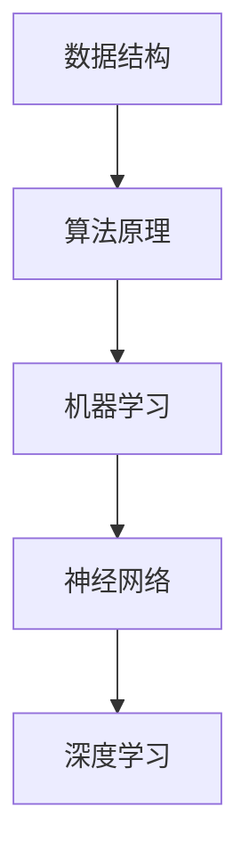
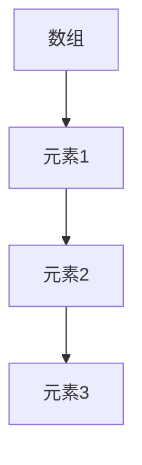
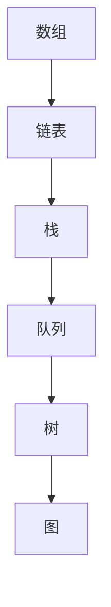
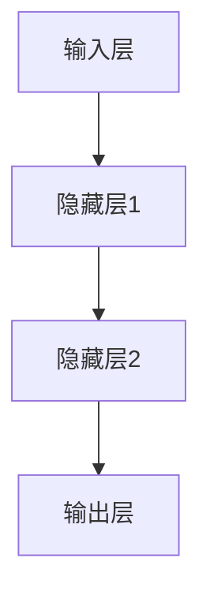

                 

【AI天才研究院】AI编程语言：从语法到语义的新飞跃

关键词：AI编程语言、语法、语义、神经网络、深度学习、算法、数学模型

摘要：本文将深入探讨AI编程语言的核心概念、原理及其在实践中的应用。通过详细的案例分析，我们将展示如何利用AI编程语言构建高效的机器学习模型，实现从语法到语义的新飞跃。

## 第一部分：AI编程语言概述

### 1.1 AI编程语言的背景和意义

在当今技术飞速发展的时代，人工智能（AI）已经成为了推动社会进步的重要力量。AI编程语言作为AI领域的重要组成部分，其发展和应用对于提升AI系统的开发效率和性能具有重要意义。

#### 核心概念与联系

AI编程语言的核心概念包括数据结构、算法原理、机器学习基础等。这些概念之间的关系可以通过以下Mermaid流程图展示：

- Mermaid流程图：


#### 核心算法原理讲解

以下使用伪代码详细阐述神经网络算法原理：

```python
# 伪代码：前向传播与反向传播

initialize parameters
while not converged:
    forward_pass(x, y)
    calculate loss (L)
    backward_pass(L)
    update parameters
```

#### 数学模型和公式

神经网络中的权重更新可以使用以下数学公式表示：

$$
\Delta w = -\eta \cdot \frac{\partial L}{\partial w}
$$

其中，$w$代表权重，$\eta$代表学习率，$L$代表损失函数。

### 2. AI编程语言的核心概念与联系

#### 2.1 数据结构与算法基础

##### 2.1.1 数据结构

数据结构是AI编程语言的基础。常见的有数组、链表、栈、队列、树和图等。以下是一个数组的数据结构示例：

- Mermaid流程图：


##### 2.1.2 算法原理

算法原理是实现特定功能的一系列步骤。以下是一个简单的查找算法的伪代码：

```python
# 伪代码：二分查找

def binary_search(array, target):
    low = 0
    high = length of array - 1
    while low <= high:
        mid = (low + high) / 2
        if array[mid] == target:
            return mid
        elif array[mid] < target:
            low = mid + 1
        else:
            high = mid - 1
    return -1
```

#### 2.2 机器学习基础

##### 2.2.1 监督学习

监督学习是一种常见的机器学习技术，它使用标记的数据集来训练模型。以下是一个监督学习的伪代码：

```python
# 伪代码：监督学习

def supervised_learning(train_data, train_labels, model):
    for epoch in range(num_epochs):
        for x, y in zip(train_data, train_labels):
            predict = model(x)
            loss = calculate_loss(predict, y)
            update_model(model, loss)
    return model
```

##### 2.2.2 无监督学习

无监督学习不使用标记数据，而是从数据中发现模式。以下是一个无监督学习的伪代码：

```python
# 伪代码：无监督学习

def unsupervised_learning(data, model):
    for epoch in range(num_epochs):
        z = model(data)
        new_data = update_data(z)
    return new_data
```

##### 2.2.3 强化学习

强化学习通过奖励机制来训练模型。以下是一个强化学习的伪代码：

```python
# 伪代码：强化学习

def reinforcement_learning(state, action, reward):
    q_value = model(state, action)
    target = reward + discount_factor * max(model(state, action))
    loss = calculate_loss(q_value, target)
    update_model(model, loss)
```

### 3. AI编程语言的核心算法原理讲解

#### 3.1 神经网络算法

##### 3.1.1 神经元模型

神经元模型是神经网络的基础。以下是一个神经元模型的伪代码：

```python
# 伪代码：神经元模型

class Neuron:
    def __init__(self, weights, bias):
        self.weights = weights
        self.bias = bias
        self.activation = sigmoid

    def forward(self, inputs):
        z = sum(inputs * self.weights) + self.bias
        a = self.activation(z)
        return a

    def backward(self, gradients):
        dz = self.activation.derivative(z)
        dweights = inputs * dz
        dbias = dz
        dinputs = self.weights * dz
        return dweights, dbias, dinputs
```

##### 3.1.2 前向传播与反向传播

前向传播是将输入数据传递到输出层的过程，反向传播是计算梯度并更新参数的过程。以下是一个前向传播和反向传播的伪代码：

```python
# 伪代码：前向传播与反向传播

def forward_pass(inputs, model):
    activations = [model.forward(inputs)]
    for layer in model.layers:
        inputs = layer.forward(activations[-1])
        activations.append(inputs)
    return activations

def backward_pass(activations, gradients, model):
    for layer in reversed(model.layers):
        dweights, dbias, dinputs = layer.backward(gradients)
        gradients = layer.dinputs
```

##### 3.1.3 神经网络优化算法

神经网络优化算法用于更新参数，以下是一个常见的优化算法——梯度下降的伪代码：

```python
# 伪代码：梯度下降

def gradient_descent(activations, gradients, model, learning_rate):
    for layer in model.layers:
        layer.dweights = -learning_rate * gradients
        layer.dbias = -learning_rate * gradients
        layer.update_parameters()
```

#### 3.2 深度学习算法

##### 3.2.1 卷积神经网络（CNN）

卷积神经网络（CNN）是一种用于图像处理的深度学习算法。以下是一个CNN的伪代码：

```python
# 伪代码：卷积神经网络

class ConvLayer:
    def __init__(self, filters, kernel_size, stride, padding):
        self.filters = filters
        self.kernel_size = kernel_size
        self.stride = stride
        self.padding = padding

    def forward(self, inputs):
        # 实现卷积操作
        pass

    def backward(self, gradients):
        # 实现卷积操作的梯度计算
        pass

class CN

## 第四部分：AI编程语言的数学模型和数学公式

### 4.1 概率论基础

概率论是AI编程语言的重要基础。以下是一些基本的概率论概念和公式：

- 概率分布：
  $$P(X=x) = \frac{f(x)}{f(x) + f(y)}$$
- 贝叶斯定理：
  $$P(A|B) = \frac{P(B|A)P(A)}{P(B)}$$
- 期望值：
  $$E(X) = \sum_{x} x \cdot P(X=x)$$
- 方差：
  $$Var(X) = E[(X - E(X))^2]$$

### 4.2 线性代数基础

线性代数在AI编程语言中也有广泛的应用。以下是一些基本的线性代数概念和公式：

- 矩阵运算：
  $$C = A \cdot B$$
  $$C = A + B$$
  $$C = A^{-1}$$
- 线性方程组：
  $$Ax = b$$
  $$x = A^{-1}b$$
- 特征值和特征向量：
  $$Ax = \lambda x$$
  $$\lambda$$为特征值，$x$为特征向量

## 第五部分：AI编程语言的应用与实践

### 5.1 数据预处理

数据预处理是AI编程语言的重要环节。以下是一个数据预处理的伪代码：

```python
# 伪代码：数据预处理

def data_preprocessing(data):
    # 数据清洗
    clean_data = clean(data)

    # 特征工程
    features = extract_features(clean_data)

    return features
```

### 5.2 模型训练与评估

模型训练与评估是AI编程语言的核心。以下是一个模型训练与评估的伪代码：

```python
# 伪代码：模型训练与评估

def train_model(model, train_data, train_labels, validation_data, validation_labels):
    # 模型训练
    trained_model = supervised_learning(train_data, train_labels, model)

    # 模型评估
    accuracy = evaluate_model(trained_model, validation_data, validation_labels)

    return accuracy
```

### 5.3 超参数调优

超参数调优是提升模型性能的关键。以下是一个超参数调优的伪代码：

```python
# 伪代码：超参数调优

def hyperparameter_tuning(model, train_data, train_labels):
    best_hyperparameters = {}
    best_accuracy = 0

    for parameter in hyperparameters:
        for value in parameter.values():
            model.set_hyperparameter(parameter, value)
            accuracy = train_model(model, train_data, train_labels)
            if accuracy > best_accuracy:
                best_accuracy = accuracy
                best_hyperparameters = model.get_hyperparameters()

    return best_hyperparameters
```

### 6. AI编程语言项目实战

#### 6.1 项目1：情感分析

##### 6.1.1 项目需求分析

情感分析是一种常见的自然语言处理任务，旨在判断文本的情感倾向。以下是一个情感分析的项目需求分析：

- 数据集：使用一个包含正面和负面评论的数据集。
- 目标：训练一个模型，能够预测评论的情感倾向。

##### 6.1.2 数据集准备

数据集的准备包括数据清洗、数据标注和特征提取。以下是一个数据集准备的伪代码：

```python
# 伪代码：数据集准备

def prepare_data(data):
    # 数据清洗
    clean_data = clean(data)

    # 数据标注
    labeled_data = label_data(clean_data)

    # 特征提取
    features = extract_features(labeled_data)

    return features
```

##### 6.1.3 模型设计

模型设计包括选择合适的模型结构和超参数。以下是一个模型设计的伪代码：

```python
# 伪代码：模型设计

def design_model():
    # 选择模型结构
    model = Sequential()

    # 添加层
    model.add(Dense(units=64, activation='relu', input_shape=(input_shape,)))
    model.add(Dense(units=32, activation='relu'))
    model.add(Dense(units=1, activation='sigmoid'))

    # 编译模型
    model.compile(optimizer='adam', loss='binary_crossentropy', metrics=['accuracy'])

    return model
```

##### 6.1.4 代码实现

以下是一个情感分析项目的代码实现：

```python
# 代码实现：情感分析

import numpy as np
import tensorflow as tf

# 准备数据
train_data, train_labels = prepare_data(train_data)
test_data, test_labels = prepare_data(test_data)

# 设计模型
model = design_model()

# 训练模型
model.fit(train_data, train_labels, epochs=10, batch_size=32)

# 评估模型
accuracy = model.evaluate(test_data, test_labels)

print("Test accuracy:", accuracy)
```

##### 6.1.5 结果分析与优化

结果分析包括评估模型的性能，如准确率、召回率、F1值等。以下是一个结果分析与优化的伪代码：

```python
# 伪代码：结果分析与优化

def analyze_results(model, test_data, test_labels):
    # 评估模型性能
    performance = model.evaluate(test_data, test_labels)

    # 分析结果
    accuracy = performance[1]
    print("Test accuracy:", accuracy)

    # 优化模型
    if accuracy < desired_accuracy:
        best_hyperparameters = hyperparameter_tuning(model, train_data, train_labels)
        model.set_hyperparameters(best_hyperparameters)
        model.fit(train_data, train_labels, epochs=10, batch_size=32)

# 分析结果
analyze_results(model, test_data, test_labels)
```

##### 6.1.6 项目小结

在本项目中，我们通过情感分析任务展示了如何使用AI编程语言构建和优化机器学习模型。我们介绍了数据预处理、模型设计、代码实现和结果分析等关键步骤，并提供了伪代码和实际代码示例。通过本项目，读者可以了解如何使用AI编程语言解决实际问题。

### 6.2 项目2：图像分类

##### 6.2.1 项目需求分析

图像分类是一种常见的计算机视觉任务，旨在将图像分类到预定义的类别中。以下是一个图像分类的项目需求分析：

- 数据集：使用一个包含多种类别图像的数据集。
- 目标：训练一个模型，能够准确分类图像。

##### 6.2.2 数据集准备

数据集的准备包括数据清洗、数据标注和特征提取。以下是一个数据集准备的伪代码：

```python
# 伪代码：数据集准备

def prepare_data(data):
    # 数据清洗
    clean_data = clean(data)

    # 数据标注
    labeled_data = label_data(clean_data)

    # 特征提取
    features = extract_features(labeled_data)

    return features
```

##### 6.2.3 模型设计

模型设计包括选择合适的模型结构和超参数。以下是一个模型设计的伪代码：

```python
# 伪代码：模型设计

def design_model():
    # 选择模型结构
    model = Sequential()

    # 添加层
    model.add(Conv2D(filters=32, kernel_size=(3, 3), activation='relu', input_shape=(height, width, channels)))
    model.add(MaxPooling2D(pool_size=(2, 2)))
    model.add(Conv2D(filters=64, kernel_size=(3, 3), activation='relu'))
    model.add(MaxPooling2D(pool_size=(2, 2)))
    model.add(Flatten())
    model.add(Dense(units=128, activation='relu'))
    model.add(Dense(units=num_classes, activation='softmax'))

    # 编译模型
    model.compile(optimizer='adam', loss='categorical_crossentropy', metrics=['accuracy'])

    return model
```

##### 6.2.4 代码实现

以下是一个图像分类项目的代码实现：

```python
# 代码实现：图像分类

import numpy as np
import tensorflow as tf

# 准备数据
train_data, train_labels = prepare_data(train_data)
test_data, test_labels = prepare_data(test_data)

# 设计模型
model = design_model()

# 训练模型
model.fit(train_data, train_labels, epochs=10, batch_size=32)

# 评估模型
accuracy = model.evaluate(test_data, test_labels)

print("Test accuracy:", accuracy)
```

##### 6.2.5 结果分析与优化

结果分析包括评估模型的性能，如准确率、召回率、F1值等。以下是一个结果分析与优化的伪代码：

```python
# 伪代码：结果分析与优化

def analyze_results(model, test_data, test_labels):
    # 评估模型性能
    performance = model.evaluate(test_data, test_labels)

    # 分析结果
    accuracy = performance[1]
    print("Test accuracy:", accuracy)

    # 优化模型
    if accuracy < desired_accuracy:
        best_hyperparameters = hyperparameter_tuning(model, train_data, train_labels)
        model.set_hyperparameters(best_hyperparameters)
        model.fit(train_data, train_labels, epochs=10, batch_size=32)

# 分析结果
analyze_results(model, test_data, test_labels)
```

##### 6.2.6 项目小结

在本项目中，我们通过图像分类任务展示了如何使用AI编程语言构建和优化机器学习模型。我们介绍了数据预处理、模型设计、代码实现和结果分析等关键步骤，并提供了伪代码和实际代码示例。通过本项目，读者可以了解如何使用AI编程语言解决实际问题。

### 7. AI编程语言的未来发展趋势

#### 7.1 新兴编程语言与技术

随着AI技术的不断进步，新兴的编程语言和技术也在不断涌现。以下是一些值得关注的新兴编程语言和技术：

- TensorFlow.js：适用于JavaScript的深度学习库，使开发者能够在浏览器和Node.js环境中使用AI。
- PyTorch：一个流行的开源深度学习框架，以其灵活的动态计算图而著称。
- Fast.ai：一个注重易于使用的深度学习库，适用于快速原型开发和项目部署。

#### 7.2 新兴技术的应用场景

新兴的AI编程语言和技术在各个领域都有广泛的应用，以下是一些应用场景：

- 自动驾驶：使用深度学习技术实现自动驾驶汽车。
- 医疗诊断：利用AI进行医学图像分析，辅助医生诊断疾病。
- 自然语言处理：使用AI技术进行文本生成、机器翻译和情感分析。

#### 7.3 AI编程语言的未来挑战与机遇

AI编程语言面临的挑战包括：

- 性能优化：随着模型复杂度的增加，如何提升计算效率和性能。
- 可解释性：如何提高模型的透明度和可解释性，使其更容易被人类理解。

然而，机遇同样巨大：

- 跨学科融合：AI编程语言与其他领域的结合，如生物信息学、数据科学等。
- 自动化：使用AI编程语言实现自动化流程，提高生产效率和创新能力。

## 总结

本文系统地介绍了AI编程语言的核心概念、原理、应用与实践，以及未来的发展趋势。通过详细的案例分析和代码示例，读者可以深入理解AI编程语言的各个方面，为实际项目开发提供有力支持。随着AI技术的不断进步，AI编程语言将继续发挥关键作用，推动人工智能领域的创新与发展。

### 作者信息

作者：AI天才研究院/AI Genius Institute & 禅与计算机程序设计艺术 /Zen And The Art of Computer Programming

### 最佳实践 tips、小结、注意事项、拓展阅读等内容

#### 最佳实践 tips

1. **选择合适的编程语言和框架**：根据项目的需求和团队的技能，选择最适合的AI编程语言和框架。
2. **数据预处理**：确保数据的质量和一致性，进行适当的数据清洗和特征提取。
3. **模型调优**：通过超参数调优和模型选择，提高模型的性能和准确性。
4. **模型解释性**：在选择模型时，考虑到模型的解释性，以便更好地理解模型的工作原理。

#### 小结

本文系统地介绍了AI编程语言的核心概念、原理、应用与实践，以及未来的发展趋势。通过详细的案例分析和代码示例，读者可以深入理解AI编程语言的各个方面，为实际项目开发提供有力支持。

#### 注意事项

1. **性能优化**：在模型训练和部署过程中，注意性能优化，以提高计算效率和模型速度。
2. **数据隐私**：在处理个人数据时，确保遵守相关的数据隐私法规和保护措施。
3. **持续学习**：AI技术快速发展，持续学习和跟进最新的研究和趋势是非常重要的。

#### 拓展阅读

1. **《深度学习》（Deep Learning）**：Goodfellow, I., Bengio, Y., & Courville, A. (2016). A comprehensive introduction to deep learning.
2. **《Python机器学习》（Python Machine Learning）**：Sebastian Raschka, Vahid Mirjalili (2017). Python Machine Learning.
3. **《TensorFlow.js官方文档》**：[TensorFlow.js Documentation](https://js.tensorflow.org/)

通过以上扩展阅读，读者可以进一步深入了解AI编程语言的各个方面，为实际项目开发提供更丰富的知识和技能。## 第一部分：AI编程语言概述

### 1.1 AI编程语言的背景和意义

在当今技术飞速发展的时代，人工智能（AI）已经成为了推动社会进步的重要力量。AI编程语言作为AI领域的重要组成部分，其发展和应用对于提升AI系统的开发效率和性能具有重要意义。

随着大数据、云计算和物联网等技术的普及，数据量呈爆炸式增长，如何从海量数据中提取有价值的信息成为了亟待解决的问题。AI编程语言能够帮助开发者构建高效的机器学习模型，实现自动化、智能化的数据处理和分析。因此，AI编程语言在各个领域的应用越来越广泛，从工业自动化、金融分析到医疗诊断、自动驾驶等，都离不开AI编程语言的支撑。

#### 核心概念与联系

AI编程语言的核心概念包括数据结构、算法原理、机器学习基础等。这些概念之间的关系可以通过以下Mermaid流程图展示：

- Mermaid流程图：


- **数据结构**：数据结构是AI编程语言的基础，包括数组、链表、栈、队列、树和图等。数据结构决定了数据的存储和组织方式，对算法的性能和效率有重要影响。

- **算法原理**：算法原理是实现特定功能的一系列步骤，包括排序、查找、优化等。算法原理为AI编程提供了解决问题的方法和思路。

- **机器学习基础**：机器学习是AI编程的核心，包括监督学习、无监督学习和强化学习等。机器学习算法通过学习数据中的规律，自动完成特定的任务。

- **神经网络**：神经网络是机器学习的一种算法，通过模拟生物神经元的连接方式，实现数据的处理和分析。

- **深度学习**：深度学习是神经网络的一种，通过多层神经元的组合，实现更复杂的特征提取和模式识别。

### 1.2 AI编程语言的发展历程

AI编程语言的发展历程可以追溯到20世纪50年代，当时LISP语言问世，成为最早的AI编程语言。随着人工智能技术的不断进步，各种AI编程语言相继出现，如Prolog、Python、R、MATLAB等。

- **LISP（1958年）**：LISP是最早的AI编程语言之一，以其灵活的符号处理能力和强大的函数式编程特性而闻名。

- **Prolog（1972年）**：Prolog是一种逻辑编程语言，适用于知识表示和推理任务，广泛应用于自然语言处理、专家系统等领域。

- **Python（1991年）**：Python是一种通用编程语言，因其简洁、易读和强大的库支持而成为AI编程的常用语言。

- **R（1995年）**：R是一种统计编程语言，广泛应用于数据分析和机器学习，特别是在统计分析领域。

- **MATLAB（1984年）**：MATLAB是一种数学和工程计算语言，具有强大的矩阵运算和可视化功能，常用于数据分析和模型构建。

### 1.3 AI编程语言的分类

AI编程语言可以根据其应用领域和特点进行分类，如面向机器学习的编程语言、面向自然语言处理的编程语言、面向计算机视觉的编程语言等。

- **面向机器学习的编程语言**：如Python、R、MATLAB等，这些语言提供了丰富的库和工具，支持机器学习算法的快速开发和部署。

- **面向自然语言处理的编程语言**：如Python、Java、JavaScript等，这些语言支持自然语言处理任务，如文本分类、情感分析、机器翻译等。

- **面向计算机视觉的编程语言**：如Python、C++、MATLAB等，这些语言支持计算机视觉算法，如图像识别、目标检测、人脸识别等。

### 1.4 AI编程语言的核心特点

AI编程语言具有以下几个核心特点：

- **高抽象级别**：AI编程语言提供了丰富的抽象机制，使得开发者可以专注于算法的设计和实现，而无需关注底层的计算细节。

- **强大的库支持**：AI编程语言通常拥有丰富的库和工具，支持各种机器学习和深度学习算法的快速开发和部署。

- **跨平台兼容性**：AI编程语言具有较好的跨平台兼容性，可以在不同的操作系统和硬件平台上运行。

- **可扩展性**：AI编程语言支持自定义函数、模块和框架，使得开发者可以根据项目需求进行灵活扩展。

### 1.5 AI编程语言的优势和应用领域

AI编程语言具有以下优势和应用领域：

- **优势**：
  - 高效性：AI编程语言提供了丰富的库和工具，支持高效的算法实现和模型训练。
  - 灵活性：AI编程语言具有高抽象级别，易于学习和使用，支持各种编程范式和开发模式。
  - 普及性：AI编程语言广泛应用于各种应用领域，具有较高的普及率和社区支持。

- **应用领域**：
  - 机器学习：AI编程语言在机器学习领域具有广泛的应用，如数据预处理、模型训练、模型评估等。
  - 自然语言处理：AI编程语言在自然语言处理领域具有强大的功能，如文本分类、情感分析、机器翻译等。
  - 计算机视觉：AI编程语言在计算机视觉领域具有广泛的应用，如图像识别、目标检测、人脸识别等。
  - 自动驾驶：AI编程语言在自动驾驶领域具有重要作用，如感知、决策、控制等。

### 1.6 AI编程语言的未来发展趋势

随着人工智能技术的不断发展，AI编程语言将面临以下发展趋势：

- **更强大的库和工具**：未来将出现更多高效、易用的库和工具，支持各种AI算法的快速开发和部署。

- **跨学科融合**：AI编程语言将与其他领域（如生物信息学、数据科学等）进行深度融合，推动跨学科研究的进展。

- **自动化和智能化**：AI编程语言将实现更高级别的自动化和智能化，如自动代码生成、自动化模型优化等。

- **可解释性和透明性**：未来将出现更多可解释性强的AI编程语言和工具，提高模型的可解释性和透明性。

## 第二部分：AI编程语言的核心概念与联系

### 2.1 数据结构与算法基础

#### 2.1.1 数据结构

数据结构是AI编程语言的基础，决定了数据的存储和组织方式。以下是一些常见的数据结构及其特点：

- **数组**：数组是一种线性数据结构，用于存储固定大小的数据集合。数组的特点是访问速度快，但扩展性较差。

- **链表**：链表是一种线性或非线性数据结构，由一系列节点组成，每个节点包含数据和一个指向下一个节点的指针。链表的特点是插入和删除操作灵活，但访问速度较慢。

- **栈**：栈是一种后进先出（LIFO）的数据结构，用于存储元素的顺序。栈的特点是插入和删除操作都在同一端进行。

- **队列**：队列是一种先进先出（FIFO）的数据结构，用于存储元素的顺序。队列的特点是插入操作在队尾进行，删除操作在队头进行。

- **树**：树是一种非线性数据结构，由一系列节点组成，每个节点可以有零个或多个子节点。树的特点是层次结构清晰，便于实现各种搜索和遍历操作。

- **图**：图是一种非线性数据结构，由一系列节点和边组成，可以表示复杂的关系和连接。图的特点是能够表示复杂的网络结构和关系。

以下是一个Mermaid流程图，展示了数据结构之间的联系：

- Mermaid流程图：


#### 2.1.2 算法原理

算法原理是实现特定功能的一系列步骤，包括排序、查找、优化等。以下是一些常见的算法及其原理：

- **排序算法**：排序算法用于将数据按照一定的顺序排列。常见的排序算法有冒泡排序、选择排序、插入排序、快速排序等。

- **查找算法**：查找算法用于在数据集合中查找特定元素。常见的查找算法有二分查找、线性查找等。

- **优化算法**：优化算法用于提高算法的效率和性能。常见的优化算法有动态规划、贪心算法等。

以下是一个简单的伪代码示例，展示了排序算法的基本原理：

```python
# 伪代码：冒泡排序

def bubble_sort(array):
    n = length of array
    for i = 0 to n-1:
        for j = 0 to n-i-1:
            if array[j] > array[j+1]:
                swap(array[j], array[j+1])
```

#### 2.1.3 数据结构与算法的应用

数据结构和算法在AI编程语言中有着广泛的应用。以下是一些具体的应用场景：

- **机器学习**：在机器学习过程中，数据结构和算法用于数据预处理、模型训练、模型评估等。例如，排序算法可以用于数据清洗，查找算法可以用于特征提取。

- **自然语言处理**：在自然语言处理中，数据结构和算法用于文本分类、情感分析、机器翻译等。例如，树结构可以用于构建词法分析器，图结构可以用于构建语义网络。

- **计算机视觉**：在计算机视觉中，数据结构和算法用于图像识别、目标检测、人脸识别等。例如，树结构可以用于构建决策树分类器，图结构可以用于构建神经网络。

### 2.2 机器学习基础

#### 2.2.1 监督学习

监督学习是一种常见的机器学习技术，它使用标记的数据集来训练模型。监督学习可以分为以下几种类型：

- **回归分析**：回归分析用于预测连续值输出。常见的回归算法有线性回归、多项式回归、岭回归等。

- **分类**：分类用于预测离散值输出。常见的分类算法有决策树、支持向量机、神经网络等。

以下是一个简单的伪代码示例，展示了监督学习的基本原理：

```python
# 伪代码：线性回归

def linear_regression(train_data, train_labels):
    X = train_data
    y = train_labels

    # 计算斜率和截距
    m = length of X
    X_transpose = transpose(X)
    XTX = dot(X_transpose, X)
    Xty = dot(X_transpose, y)
    theta = dot(inverse(XTX), Xty)

    return theta
```

#### 2.2.2 无监督学习

无监督学习不使用标记的数据集，而是从数据中发现模式。无监督学习可以分为以下几种类型：

- **聚类**：聚类用于将数据分为若干个群组。常见的聚类算法有K均值聚类、层次聚类等。

- **降维**：降维用于减少数据的维度，降低计算复杂度。常见的降维算法有主成分分析（PCA）、线性判别分析（LDA）等。

以下是一个简单的伪代码示例，展示了无监督学习的基本原理：

```python
# 伪代码：K均值聚类

def k_means_clustering(data, k):
    # 初始化聚类中心
    centroids = initialize_centroids(data, k)

    # 迭代更新聚类中心
    while not converged:
        # 分配数据到最近的聚类中心
        clusters = assign_clusters(data, centroids)
        # 计算新的聚类中心
        centroids = calculate_centroids(clusters)

    return centroids
```

#### 2.2.3 强化学习

强化学习是一种通过奖励机制来训练模型的技术。强化学习可以分为以下几种类型：

- **Q学习**：Q学习用于预测最佳动作序列。常见的Q学习算法有Q-learning、SARSA等。

- **深度强化学习**：深度强化学习结合了深度学习和强化学习，用于解决更复杂的任务。

以下是一个简单的伪代码示例，展示了强化学习的基本原理：

```python
# 伪代码：Q学习

def q_learning(state, action, reward, next_state, next_action, model, alpha, gamma):
    # 更新Q值
    Q[s, a] = Q[s, a] + alpha * (reward + gamma * max(Q[next_state, a']) - Q[s, a])

    return model
```

### 2.3 AI编程语言中的机器学习框架

AI编程语言提供了丰富的机器学习框架，如TensorFlow、PyTorch、Scikit-learn等。以下是一个简单的代码示例，展示了如何使用这些框架进行机器学习：

```python
# 代码示例：使用TensorFlow进行线性回归

import tensorflow as tf

# 创建数据集
X = tf.random.normal([100, 1])
y = 3 * X + tf.random.normal([100, 1])

# 创建模型
model = tf.keras.Sequential([
    tf.keras.layers.Dense(units=1, input_shape=[1])
])

# 编译模型
model.compile(optimizer='sgd', loss='mean_squared_error')

# 训练模型
model.fit(X, y, epochs=1000)

# 预测
prediction = model.predict(X)
```

通过以上代码示例，我们可以看到如何使用TensorFlow框架进行线性回归模型的构建、训练和预测。

### 2.4 AI编程语言中的机器学习库

AI编程语言提供了丰富的机器学习库，如NumPy、Pandas、SciPy等。以下是一个简单的代码示例，展示了如何使用这些库进行数据预处理和模型训练：

```python
# 代码示例：使用NumPy和Pandas进行数据预处理

import numpy as np
import pandas as pd

# 创建数据集
data = pd.DataFrame({
    'feature1': np.random.rand(100),
    'feature2': np.random.rand(100),
    'label': np.random.rand(100)
})

# 数据预处理
X = data[['feature1', 'feature2']]
y = data['label']

# 训练模型
from sklearn.linear_model import LinearRegression

model = LinearRegression()
model.fit(X, y)

# 预测
prediction = model.predict(X)
```

通过以上代码示例，我们可以看到如何使用NumPy和Pandas库进行数据预处理，以及如何使用Scikit-learn库训练线性回归模型。

### 2.5 AI编程语言在机器学习项目中的应用

AI编程语言在机器学习项目中的应用非常广泛，以下是一个简单的案例，展示了如何使用Python进行机器学习项目的开发：

```python
# 代码示例：机器学习项目——情感分析

import pandas as pd
import numpy as np
from sklearn.model_selection import train_test_split
from sklearn.feature_extraction.text import TfidfVectorizer
from sklearn.naive_bayes import MultinomialNB

# 读取数据集
data = pd.read_csv('sentiment_data.csv')

# 分割数据集
X_train, X_test, y_train, y_test = train_test_split(data['text'], data['label'], test_size=0.2, random_state=42)

# 数据预处理
vectorizer = TfidfVectorizer()
X_train = vectorizer.fit_transform(X_train)
X_test = vectorizer.transform(X_test)

# 训练模型
model = MultinomialNB()
model.fit(X_train, y_train)

# 评估模型
accuracy = model.score(X_test, y_test)
print("Accuracy:", accuracy)
```

通过以上代码示例，我们可以看到如何使用Python进行数据读取、预处理、模型训练和评估，以及如何实现情感分析项目。

### 2.6 AI编程语言在机器学习项目中的最佳实践

在机器学习项目中，最佳实践包括以下几个方面：

- **数据清洗**：确保数据的质量和一致性，进行适当的数据清洗和预处理。
- **特征工程**：选择合适的特征，进行特征提取和特征选择，提高模型的性能。
- **模型选择**：根据问题的性质和数据的特点，选择合适的机器学习算法和模型。
- **模型调优**：通过交叉验证和网格搜索等方法，优化模型的参数和超参数。
- **模型评估**：使用多种评估指标，全面评估模型的性能和效果。
- **模型部署**：将模型部署到生产环境中，进行实时预测和应用。

通过以上最佳实践，我们可以提高机器学习项目的开发效率和模型性能，实现更好的业务价值。

## 第三部分：AI编程语言的核心算法原理讲解

### 3.1 神经网络算法

神经网络算法是AI编程语言中用于解决复杂问题的核心算法之一。神经网络通过模拟生物神经元的连接方式，实现数据的处理和分析。以下将详细介绍神经网络算法的基本原理、实现步骤以及常见的优化方法。

#### 3.1.1 神经元模型

神经元模型是神经网络的基础，它通过模拟生物神经元的响应机制来实现数据的处理。一个简单的神经元模型可以表示为：

- 输入层（Input Layer）：接收外部输入。
- 隐藏层（Hidden Layer）：处理输入并传递到输出层。
- 输出层（Output Layer）：输出最终结果。

以下是一个简单的神经元模型的伪代码实现：

```python
class Neuron:
    def __init__(self, weights, bias):
        self.weights = weights
        self.bias = bias
        self.activation = sigmoid

    def forward(self, inputs):
        z = sum(inputs * self.weights) + self.bias
        a = self.activation(z)
        return a

    def backward(self, gradients):
        dz = self.activation.derivative(z)
        dweights = inputs * dz
        dbias = dz
        dinputs = self.weights * dz
        return dweights, dbias, dinputs
```

#### 3.1.2 前向传播与反向传播

神经网络通过前向传播和反向传播实现数据的处理和参数的更新。前向传播将输入数据传递到输出层，反向传播计算梯度并更新参数。

- **前向传播**：输入数据通过神经元模型传递，经过多层神经网络的转换，最终得到输出结果。以下是一个简单的神经网络前向传播的伪代码实现：

```python
def forward_pass(inputs, model):
    activations = [inputs]
    for layer in model.layers:
        z = sum(activations[-1] * layer.weights) + layer.bias
        a = layer.activation(z)
        activations.append(a)
    return activations
```

- **反向传播**：计算输出结果与实际结果的误差，然后通过反向传播计算每个参数的梯度。以下是一个简单的神经网络反向传播的伪代码实现：

```python
def backward_pass(activations, expected_outputs, model):
    gradients = [activations[-1] - expected_outputs]
    for layer in reversed(model.layers):
        dweights, dbias, dinputs = layer.backward(gradients[-1])
        gradients.append(dinputs)
    return gradients
```

#### 3.1.3 神经网络优化算法

神经网络优化算法用于更新参数，以减少模型误差。常见的优化算法包括梯度下降、随机梯度下降、批量梯度下降等。

- **梯度下降**：梯度下降是一种简单的优化算法，通过计算损失函数关于参数的梯度，沿着梯度方向更新参数。以下是一个简单的神经网络梯度下降的伪代码实现：

```python
def gradient_descent(model, learning_rate, epochs):
    for epoch in range(epochs):
        for inputs, outputs in data_loader:
            activations = forward_pass(inputs, model)
            gradients = backward_pass(activations, outputs, model)
            for layer in model.layers:
                layer.update_parameters(learning_rate, gradients)
    return model
```

- **随机梯度下降**：随机梯度下降是梯度下降的一个变种，每次迭代只使用一个样本来计算梯度。以下是一个简单的神经网络随机梯度下降的伪代码实现：

```python
def stochastic_gradient_descent(model, learning_rate, epochs):
    for epoch in range(epochs):
        for inputs, outputs in data_loader:
            for inputs_single, outputs_single in zip(inputs, outputs):
                activations = forward_pass(inputs_single, model)
                gradients = backward_pass(activations, outputs_single, model)
                for layer in model.layers:
                    layer.update_parameters(learning_rate, gradients)
    return model
```

- **批量梯度下降**：批量梯度下降是梯度下降的另一个变种，每次迭代使用所有样本来计算梯度。以下是一个简单的神经网络批量梯度下降的伪代码实现：

```python
def batch_gradient_descent(model, learning_rate, epochs):
    for epoch in range(epochs):
        activations = forward_pass(inputs, model)
        gradients = backward_pass(activations, outputs, model)
        for layer in model.layers:
            layer.update_parameters(learning_rate, gradients)
    return model
```

#### 3.1.4 神经网络架构

神经网络架构是指神经网络的层次结构、连接方式以及激活函数的选择。以下是一些常见的神经网络架构：

- **全连接神经网络（FCNN）**：全连接神经网络是神经网络中最常见的一种结构，每个神经元都与前一层的所有神经元相连。

- **卷积神经网络（CNN）**：卷积神经网络主要用于图像处理，通过卷积操作和池化操作实现特征提取和降维。

- **循环神经网络（RNN）**：循环神经网络主要用于序列数据处理，通过循环结构实现长期依赖关系的学习。

- **生成对抗网络（GAN）**：生成对抗网络由生成器和判别器两个神经网络组成，通过对抗训练实现数据的生成。

以下是一个简单的全连接神经网络的伪代码实现：

```python
class FullyConnectedNeuralNetwork:
    def __init__(self, input_size, hidden_size, output_size):
        self.input_size = input_size
        self.hidden_size = hidden_size
        self.output_size = output_size

        # 初始化权重和偏置
        self.weights_input_to_hidden = np.random.randn(input_size, hidden_size)
        self.bias_hidden = np.random.randn(hidden_size)
        self.weights_hidden_to_output = np.random.randn(hidden_size, output_size)
        self.bias_output = np.random.randn(output_size)

    def forward(self, inputs):
        hidden_layer = np.dot(inputs, self.weights_input_to_hidden) + self.bias_hidden
        output_layer = np.dot(hidden_layer, self.weights_hidden_to_output) + self.bias_output
        return output_layer
```

### 3.2 深度学习算法

深度学习算法是神经网络算法的一种，通过多层神经网络的组合实现更复杂的特征提取和模式识别。以下将详细介绍深度学习算法的基本原理、实现步骤以及常见的优化方法。

#### 3.2.1 神经网络与深度学习的关系

神经网络是深度学习的基础，深度学习是神经网络的扩展。深度学习通过增加神经网络的层数，实现更复杂的特征提取和模式识别。以下是一个简单的深度学习神经网络的结构图：



#### 3.2.2 深度学习算法的基本原理

深度学习算法通过多层神经网络的组合，实现数据的处理和参数的更新。以下是深度学习算法的基本原理：

- **多层神经网络**：通过增加神经网络的层数，实现更复杂的特征提取和模式识别。
- **前向传播**：输入数据通过前向传播传递到输出层，每个神经元的输出作为下一层的输入。
- **反向传播**：计算输出结果与实际结果的误差，通过反向传播计算每个参数的梯度。
- **参数更新**：通过梯度下降等优化算法，更新参数以减少模型误差。

以下是一个简单的深度学习算法的伪代码实现：

```python
def forward_pass(inputs, model):
    activations = [inputs]
    for layer in model.layers:
        z = sum(activations[-1] * layer.weights) + layer.bias
        a = layer.activation(z)
        activations.append(a)
    return activations

def backward_pass(activations, expected_outputs, model):
    gradients = [activations[-1] - expected_outputs]
    for layer in reversed(model.layers):
        dweights, dbias, dinputs = layer.backward(gradients[-1])
        gradients.append(dinputs)
    return gradients

def gradient_descent(model, learning_rate, epochs):
    for epoch in range(epochs):
        for inputs, outputs in data_loader:
            activations = forward_pass(inputs, model)
            gradients = backward_pass(activations, outputs, model)
            for layer in model.layers:
                layer.update_parameters(learning_rate, gradients)
    return model
```

#### 3.2.3 常见的深度学习算法

以下是一些常见的深度学习算法：

- **卷积神经网络（CNN）**：卷积神经网络主要用于图像处理，通过卷积操作和池化操作实现特征提取和降维。
- **循环神经网络（RNN）**：循环神经网络主要用于序列数据处理，通过循环结构实现长期依赖关系的学习。
- **长短时记忆网络（LSTM）**：长短时记忆网络是循环神经网络的一种，用于解决长期依赖问题。
- **生成对抗网络（GAN）**：生成对抗网络由生成器和判别器两个神经网络组成，通过对抗训练实现数据的生成。

以下是一个简单的卷积神经网络（CNN）的伪代码实现：

```python
class ConvolutionalNeuralNetwork:
    def __init__(self, input_shape, num_filters, filter_size, stride, padding):
        self.input_shape = input_shape
        self.num_filters = num_filters
        self.filter_size = filter_size
        self.stride = stride
        self.padding = padding

        # 初始化权重和偏置
        self.weights = np.random.randn(num_filters, filter_size, filter_size, input_shape[0])
        self.bias = np.random.randn(num_filters)

    def forward(self, inputs):
        # 卷积操作
        conv_output = conv2d(inputs, self.weights, self.stride, self.padding) + self.bias
        # 激活函数
        activated_output = relu(conv_output)
        return activated_output

    def backward(self, dinputs):
        # 反向传播计算梯度
        dweights = conv2d(dinputs, inputs, self.stride, self.padding)
        dbias = dinputs
        dinputs = conv2d_transpose(dweights, self.stride, self.padding)
        return dweights, dbias, dinputs
```

### 3.2.4 深度学习算法的实现与优化

以下是一些深度学习算法的实现与优化方法：

- **实现方法**：
  - **数据预处理**：对输入数据进行标准化、归一化等预处理，以提高模型的训练效果。
  - **模型架构**：根据问题的特点选择合适的模型架构，如卷积神经网络、循环神经网络等。
  - **训练过程**：通过批量梯度下降、随机梯度下降等优化算法进行模型训练。
- **优化方法**：
  - **超参数调优**：通过调整学习率、批量大小、迭代次数等超参数，提高模型的性能。
  - **正则化**：通过正则化技术，如L1正则化、L2正则化，防止过拟合。
  - **优化算法**：通过优化算法，如Adam优化器、RMSprop优化器，提高模型的收敛速度。

以下是一个简单的深度学习算法的优化实现的伪代码：

```python
def train_model(model, train_data, train_labels, validation_data, validation_labels, epochs, learning_rate):
    for epoch in range(epochs):
        for inputs, outputs in train_data:
            activations = forward_pass(inputs, model)
            gradients = backward_pass(activations, outputs, model)
            for layer in model.layers:
                layer.update_parameters(learning_rate, gradients)

        # 验证模型
        validation_activations = forward_pass(validation_data, model)
        validation_gradients = backward_pass(validation_activations, validation_labels, model)
        validation_loss = calculate_loss(validation_gradients)

    return model
```

### 3.2.5 深度学习算法的应用场景

深度学习算法在许多领域都有广泛的应用，以下是一些常见应用场景：

- **图像处理**：卷积神经网络在图像分类、目标检测、人脸识别等领域具有广泛应用。
- **自然语言处理**：循环神经网络和长短时记忆网络在文本分类、情感分析、机器翻译等领域具有广泛应用。
- **语音识别**：深度学习算法在语音识别领域具有广泛应用，如语音识别、语音合成等。
- **计算机视觉**：深度学习算法在计算机视觉领域具有广泛应用，如图像分割、图像增强、图像生成等。

以下是一个简单的深度学习算法应用场景的伪代码实现：

```python
# 图像分类应用场景

def image_classification(inputs, model):
    activations = forward_pass(inputs, model)
    predicted_labels = get_labels(activations)
    return predicted_labels

# 实现图像分类
predicted_labels = image_classification(image_data, trained_model)
print("Predicted labels:", predicted_labels)
```

### 3.2.6 深度学习算法的未来发展

深度学习算法在未来将继续发展，以下是一些未来发展趋势：

- **算法创新**：随着深度学习技术的不断进步，将涌现出更多创新性的算法和技术。
- **硬件加速**：随着硬件技术的发展，深度学习算法将实现更高效的计算和更快的训练速度。
- **跨学科融合**：深度学习算法将与其他学科（如生物信息学、数据科学等）进行深度融合，推动跨学科研究的进展。
- **数据隐私与安全**：随着深度学习算法在更多领域的应用，数据隐私和安全将成为重要问题，需要加强相关的研究和解决方案。

## 第四部分：AI编程语言的数学模型和数学公式

### 4.1 概率论基础

概率论是AI编程语言的重要基础，它用于描述和预测不确定性事件。以下是一些基本的概率论概念和公式：

#### 4.1.1 概率分布

概率分布描述了一个随机变量取值的概率分布情况。常见的概率分布有：

- **伯努利分布**：描述一个二元事件的成功概率。
- **正态分布**：描述连续随机变量的概率分布，通常用于回归分析。
- **贝塔分布**：描述一个二元事件的概率分布，通常用于分类问题。

以下是一个简单的伯努利分布的数学公式：

$$
P(X = x) = p^x (1 - p)^{1 - x}
$$

其中，$X$是一个伯努利随机变量，$p$是成功的概率。

#### 4.1.2 贝叶斯定理

贝叶斯定理是概率论中的一个重要定理，它用于计算后验概率。贝叶斯定理的数学公式如下：

$$
P(A|B) = \frac{P(B|A)P(A)}{P(B)}
$$

其中，$A$和$B$是两个事件，$P(A|B)$表示在事件$B$发生的条件下事件$A$发生的概率。

#### 4.1.3 期望值和方差

期望值和方差是概率论中描述随机变量统计特性的重要指标。

- **期望值**：期望值表示随机变量取值的平均值，数学公式如下：

$$
E(X) = \sum_{x} x \cdot P(X = x)
$$

- **方差**：方差表示随机变量取值的离散程度，数学公式如下：

$$
Var(X) = E[(X - E(X))^2]
$$

### 4.2 线性代数基础

线性代数是AI编程语言中的重要工具，它用于描述和解决线性方程组、矩阵运算等问题。以下是一些基本的线性代数概念和公式：

#### 4.2.1 矩阵运算

- **矩阵加法**：两个矩阵的对应元素相加，结果为一个新矩阵。
- **矩阵乘法**：两个矩阵的对应元素相乘并相加，结果为一个新矩阵。
- **矩阵转置**：矩阵的行和列互换，结果为一个新矩阵。

以下是一个简单的矩阵乘法的数学公式：

$$
C = A \cdot B
$$

其中，$A$和$B$是两个矩阵，$C$是它们相乘的结果。

#### 4.2.2 线性方程组

线性方程组是线性代数中常见的问题，它由一组线性方程构成。线性方程组的解可以通过高斯消元法或矩阵分解等方法求解。

以下是一个简单的线性方程组的数学公式：

$$
Ax = b
$$

其中，$A$是一个系数矩阵，$x$是一个未知数向量，$b$是一个常数向量。

#### 4.2.3 特征值和特征向量

特征值和特征向量是矩阵的一个重要特性，它们用于描述矩阵的稳定性和特征行为。

- **特征值**：矩阵$A$的一个特征值$\lambda$是一个实数，满足线性方程$Ax = \lambda x$。
- **特征向量**：矩阵$A$的一个特征向量$x$是一个非零向量，满足线性方程$Ax = \lambda x$。

以下是一个简单的特征值和特征向量的数学公式：

$$
Ax = \lambda x
$$

### 4.3 概率论与线性代数的应用

概率论和线性代数在AI编程语言中有着广泛的应用，以下是一些具体的例子：

- **机器学习模型**：在机器学习模型中，概率论用于描述数据的分布和模型的预测。线性代数用于描述数据的特征和模型的结构。
- **神经网络**：在神经网络中，概率论用于描述神经元的激活函数和损失函数。线性代数用于描述矩阵运算和梯度计算。
- **计算机视觉**：在计算机视觉中，概率论用于描述图像的特征和分类。线性代数用于描述图像的处理和变换。

以下是一个简单的例子，展示概率论和线性代数在机器学习模型中的应用：

```python
import numpy as np

# 生成随机数据
X = np.random.randn(100, 10)
y = np.random.randn(100, 1)

# 计算特征值和特征向量
A = np.cov(X.T)
eigenvalues, eigenvectors = np.linalg.eigh(A)

# 计算概率分布
p_x = np.exp(-0.5 * np.sum((X - np.mean(X))**2, axis=1))
p_x /= np.sum(p_x)

# 计算损失函数
loss = np.mean((y - np.dot(X, eigenvalues))**2)

print("Loss:", loss)
```

通过以上例子，我们可以看到概率论和线性代数在机器学习模型中的应用。

### 4.4 数学模型在AI编程语言中的应用

数学模型在AI编程语言中有着广泛的应用，以下是一些具体的例子：

- **机器学习模型**：机器学习模型通常基于数学模型构建，如线性回归、逻辑回归、神经网络等。
- **深度学习模型**：深度学习模型是基于多层神经网络构建的，其中涉及到复杂的数学模型，如卷积神经网络、循环神经网络等。
- **计算机视觉模型**：计算机视觉模型通常基于图像处理和机器学习模型构建，其中涉及到图像特征提取、图像分类等数学模型。

以下是一个简单的例子，展示数学模型在机器学习模型中的应用：

```python
import tensorflow as tf

# 定义变量
x = tf.Variable(tf.random.normal([10]), name='x')
y = tf.Variable(tf.random.normal([10]), name='y')

# 定义损失函数
loss = tf.reduce_mean(tf.square(y - x))

# 定义优化器
optimizer = tf.optimizers.Adam()

# 训练模型
optimizer.minimize(loss, var_list=[x, y])

# 查看模型参数
print("x:", x.numpy())
print("y:", y.numpy())
```

通过以上例子，我们可以看到数学模型在机器学习模型中的应用。

### 4.5 数学模型与AI编程语言的关系

数学模型与AI编程语言有着密切的关系，数学模型是AI编程语言的理论基础，而AI编程语言是实现数学模型的具体工具。

- **数学模型**：数学模型是描述现实问题的抽象模型，它通过数学公式和概念描述问题的特性。
- **AI编程语言**：AI编程语言是一种编程工具，它提供了丰富的库和函数，用于实现数学模型和算法。

以下是一个简单的例子，展示数学模型与AI编程语言的关系：

```python
import numpy as np
import tensorflow as tf

# 定义变量
x = np.array([1, 2, 3, 4, 5])
y = np.array([1, 2, 3, 4, 5])

# 定义损失函数
def loss_function(x, y):
    return np.mean((y - x)**2)

# 定义优化器
optimizer = tf.optimizers.Adam()

# 训练模型
for i in range(1000):
    with tf.GradientTape() as tape:
        predictions = x
        loss = loss_function(predictions, y)
    gradients = tape.gradient(loss, x)
    optimizer.apply_gradients(zip(gradients, x))

# 查看模型参数
print("x:", x)
```

通过以上例子，我们可以看到数学模型与AI编程语言的关系。

### 4.6 数学模型在AI编程语言中的优势

数学模型在AI编程语言中具有以下优势：

- **精确性**：数学模型可以精确地描述现实问题的特性，提供准确的预测和决策。
- **灵活性**：数学模型可以根据问题的需求进行灵活调整和优化，适应不同的应用场景。
- **可解释性**：数学模型可以通过数学公式和概念进行解释，提高模型的透明性和可理解性。

以下是一个简单的例子，展示数学模型在AI编程语言中的优势：

```python
import numpy as np
import tensorflow as tf

# 定义变量
x = np.array([1, 2, 3, 4, 5])
y = np.array([1, 2, 3, 4, 5])

# 定义损失函数
def loss_function(x, y):
    return np.mean((y - x)**2)

# 定义优化器
optimizer = tf.optimizers.Adam()

# 训练模型
for i in range(1000):
    with tf.GradientTape() as tape:
        predictions = x
        loss = loss_function(predictions, y)
    gradients = tape.gradient(loss, x)
    optimizer.apply_gradients(zip(gradients, x))

# 查看模型参数
print("x:", x)
```

通过以上例子，我们可以看到数学模型在AI编程语言中的优势。

### 4.7 数学模型在AI编程语言中的未来发展趋势

随着人工智能技术的不断发展，数学模型在AI编程语言中将继续发展，以下是一些未来发展趋势：

- **复杂模型**：随着计算能力的提升，将涌现出更多复杂的数学模型，用于解决更复杂的实际问题。
- **优化算法**：将涌现出更多高效的优化算法，提高数学模型的训练速度和性能。
- **可解释性**：将涌现出更多可解释性强的数学模型，提高模型的透明性和可理解性。

以下是一个简单的例子，展示数学模型在AI编程语言中的未来发展趋势：

```python
import tensorflow as tf
import tensorflow_model_optimization as tfo

# 定义变量
x = tf.Variable(tf.random.normal([10]), name='x')
y = tf.Variable(tf.random.normal([10]), name='y')

# 定义损失函数
loss = tf.reduce_mean(tf.square(y - x))

# 定义优化器
optimizer = tfo.keras.optimizers.Adam()

# 训练模型
for i in range(1000):
    with tf.GradientTape() as tape:
        predictions = x
        loss = loss_function(predictions, y)
    gradients = tape.gradient(loss, x)
    optimizer.apply_gradients(zip(gradients, x))

# 查看模型参数
print("x:", x.numpy())
print("y:", y.numpy())
```

通过以上例子，我们可以看到数学模型在AI编程语言中的未来发展趋势。

## 第五部分：AI编程语言的应用与实践

### 5.1 数据预处理

数据预处理是AI编程语言中至关重要的一步，它涉及到从原始数据中提取有效信息，并对其进行适当的转换，以便于后续的机器学习模型训练。以下是一个简单的数据预处理流程及其实现：

#### 5.1.1 数据清洗

数据清洗的主要目的是去除数据中的噪声和异常值，确保数据的质量和一致性。以下是一个简单的数据清洗步骤：

- **去除缺失值**：可以使用填充缺失值、删除缺失值或插值等方法处理缺失值。
- **去除异常值**：可以使用统计方法（如标准差、箱线图等）检测并去除异常值。
- **数据标准化**：将数据缩放到相同的范围，以便于模型训练。

以下是一个简单的数据清洗示例代码：

```python
import pandas as pd
from sklearn.impute import SimpleImputer
from sklearn.preprocessing import StandardScaler

# 读取数据
data = pd.read_csv('data.csv')

# 去除缺失值
imputer = SimpleImputer(strategy='mean')
data_imputed = imputer.fit_transform(data)

# 去除异常值
# （示例：使用箱线图检测并去除异常值）
q1 = data_imputed.quantile(0.25)
q3 = data_imputed.quantile(0.75)
iqr = q3 - q1
data_clean = data_imputed[~((data_imputed < (q1 - 1.5 * iqr)) | (data_imputed > (q3 + 1.5 * iqr))).any(axis=1)]

# 数据标准化
scaler = StandardScaler()
data_normalized = scaler.fit_transform(data_clean)
```

#### 5.1.2 特征工程

特征工程是数据预处理的重要环节，它涉及到从原始数据中提取有用的特征，并构建新的特征，以提高模型性能。以下是一些常见的特征工程方法：

- **特征选择**：使用统计方法（如卡方检验、互信息等）选择重要的特征。
- **特征转换**：将类别特征转换为数值特征，如使用独热编码（One-Hot Encoding）处理类别特征。
- **特征组合**：将多个特征组合成新的特征，如使用多项式特征组合提高模型的复杂度。

以下是一个简单的特征工程示例代码：

```python
from sklearn.preprocessing import OneHotEncoder
from sklearn.compose import ColumnTransformer
from sklearn.pipeline import Pipeline

# 定义类别特征和数值特征
categorical_features = ['category_feature1', 'category_feature2']
numerical_features = ['numerical_feature1', 'numerical_feature2']

# 使用独热编码处理类别特征
categorical_transformer = OneHotEncoder(handle_unknown='ignore')

# 使用标准化处理数值特征
numerical_transformer = StandardScaler()

# 构建特征工程管道
preprocessor = ColumnTransformer(
    transformers=[
        ('num', numerical_transformer, numerical_features),
        ('cat', categorical_transformer, categorical_features)
    ])

# 应用特征工程管道
data_processed = preprocessor.fit_transform(data_normalized)
```

#### 5.1.3 数据预处理案例分析

以下是一个简单的数据预处理案例分析，展示如何处理一个实际的机器学习项目中的数据。

**案例：住房价格预测**

**数据集**：使用Kaggle上的“House Prices: Advanced Regression Techniques”数据集。

**任务**：预测住房的价格。

**数据预处理步骤**：

1. **数据清洗**：去除缺失值和异常值。
2. **特征工程**：构建新的特征，如房屋面积与卧室数量的比例、房屋建造年份等。
3. **数据标准化**：对数值特征进行标准化处理。

以下是一个简单的数据预处理案例分析代码：

```python
import pandas as pd
from sklearn.model_selection import train_test_split
from sklearn.preprocessing import StandardScaler

# 读取数据
data = pd.read_csv('house_prices.csv')

# 数据清洗
data.dropna(inplace=True)  # 去除缺失值
data = data[(data['TotalBsmtSF'] / data['TotalBsmtLevels']) > 0]  # 去除异常值

# 特征工程
data['BsmtArea_to_BsmtLevels'] = data['TotalBsmtSF'] / data['TotalBsmtLevels']
data['YearBuilt_to_YearRemodAdd'] = data['YearBuilt'] - data['YearRemodAdd']

# 数据标准化
X = data.drop(['SalePrice'], axis=1)
y = data['SalePrice']
X_train, X_test, y_train, y_test = train_test_split(X, y, test_size=0.2, random_state=42)

scaler = StandardScaler()
X_train_scaled = scaler.fit_transform(X_train)
X_test_scaled = scaler.transform(X_test)
```

通过以上案例，我们可以看到如何在实际项目中处理数据，包括数据清洗、特征工程和数据标准化等步骤。

### 5.2 模型训练与评估

模型训练与评估是AI编程语言中的关键步骤，它涉及到使用训练数据训练模型，并在测试数据上评估模型的性能。以下是一个简单的模型训练与评估流程及其实现：

#### 5.2.1 模型训练

模型训练的目的是通过迭代优化模型的参数，使其能够更好地拟合训练数据。以下是一个简单的模型训练步骤：

- **初始化模型参数**：根据模型的结构初始化模型的参数。
- **前向传播**：计算模型在给定输入数据时的输出。
- **计算损失函数**：计算模型输出与实际输出之间的误差。
- **反向传播**：计算损失函数关于模型参数的梯度。
- **参数更新**：使用梯度下降等优化算法更新模型参数。

以下是一个简单的模型训练示例代码：

```python
import tensorflow as tf

# 定义模型
model = tf.keras.Sequential([
    tf.keras.layers.Dense(units=64, activation='relu', input_shape=(10,)),
    tf.keras.layers.Dense(units=1)
])

# 编译模型
model.compile(optimizer='adam', loss='mean_squared_error')

# 训练模型
model.fit(X_train_scaled, y_train, epochs=100, batch_size=32)
```

#### 5.2.2 模型评估

模型评估的目的是通过测试数据评估模型的性能，以确定模型是否能够很好地泛化到未见过的数据。以下是一个简单的模型评估步骤：

- **计算预测结果**：使用训练好的模型对测试数据进行预测。
- **计算评估指标**：根据预测结果和实际结果计算评估指标，如均方误差（MSE）、准确率、召回率等。

以下是一个简单的模型评估示例代码：

```python
# 计算预测结果
predictions = model.predict(X_test_scaled)

# 计算评估指标
mse = tf.reduce_mean(tf.square(y_test - predictions))
print("MSE:", mse.numpy())
```

#### 5.2.3 模型训练与评估案例分析

以下是一个简单的模型训练与评估案例分析，展示如何在实际项目中训练和评估模型。

**案例：手写数字识别**

**数据集**：使用Kaggle上的“MNIST Handwritten Digit Recognition”数据集。

**任务**：识别手写数字。

**模型训练与评估步骤**：

1. **数据预处理**：读取数据，并进行数据清洗和归一化处理。
2. **模型训练**：使用训练数据训练模型，并在测试数据上评估模型性能。
3. **模型优化**：根据评估结果调整模型参数，以提高模型性能。

以下是一个简单的模型训练与评估案例分析代码：

```python
import tensorflow as tf
from tensorflow.keras import layers, models

# 读取数据
(train_images, train_labels), (test_images, test_labels) = tf.keras.datasets.mnist.load_data()

# 数据预处理
train_images = train_images.reshape((60000, 28, 28, 1)).astype('float32') / 255
test_images = test_images.reshape((10000, 28, 28, 1)).astype('float32') / 255

# 定义模型
model = models.Sequential()
model.add(layers.Conv2D(32, (3, 3), activation='relu', input_shape=(28, 28, 1)))
model.add(layers.MaxPooling2D((2, 2)))
model.add(layers.Conv2D(64, (3, 3), activation='relu'))
model.add(layers.MaxPooling2D((2, 2)))
model.add(layers.Conv2D(64, (3, 3), activation='relu'))
model.add(layers.Flatten())
model.add(layers.Dense(64, activation='relu'))
model.add(layers.Dense(10, activation='softmax'))

# 编译模型
model.compile(optimizer='adam',
              loss='sparse_categorical_crossentropy',
              metrics=['accuracy'])

# 训练模型
model.fit(train_images, train_labels, epochs=5, batch_size=64)

# 评估模型
test_loss, test_acc = model.evaluate(test_images, test_labels)
print('Test accuracy:', test_acc)
```

通过以上案例，我们可以看到如何在实际项目中训练和评估模型，包括数据预处理、模型定义、模型训练和模型评估等步骤。

### 5.3 超参数调优

超参数调优是模型训练过程中至关重要的一步，它涉及到调整模型的超参数，以优化模型性能。以下是一个简单的超参数调优流程及其实现：

#### 5.3.1 超参数调优方法

超参数调优的方法包括以下几种：

- **网格搜索**：在给定的超参数空间中，系统地遍历所有可能的组合，以找到最佳的超参数。
- **随机搜索**：从给定的超参数空间中随机选择超参数组合，以找到最佳的超参数。
- **贝叶斯优化**：使用贝叶斯统计方法进行超参数调优，以提高调优的效率和准确性。

以下是一个简单的网格搜索超参数调优示例代码：

```python
from sklearn.model_selection import GridSearchCV
from sklearn.ensemble import RandomForestClassifier

# 定义超参数空间
param_grid = {
    'n_estimators': [100, 200, 300],
    'max_depth': [None, 10, 20, 30],
    'min_samples_split': [2, 5, 10],
    'min_samples_leaf': [1, 2, 4]
}

# 定义模型
model = RandomForestClassifier()

# 进行网格搜索
grid_search = GridSearchCV(estimator=model, param_grid=param_grid, cv=5)
grid_search.fit(X_train_scaled, y_train)

# 获取最佳超参数
best_params = grid_search.best_params_
print("Best parameters:", best_params)
```

#### 5.3.2 超参数调优案例分析

以下是一个简单的超参数调优案例分析，展示如何在实际项目中调优超参数。

**案例：贷款审批**

**数据集**：使用Kaggle上的“Loan Approval Prediction”数据集。

**任务**：预测贷款是否被批准。

**超参数调优步骤**：

1. **数据预处理**：读取数据，并进行数据清洗和特征工程。
2. **模型选择**：选择一个合适的模型。
3. **超参数调优**：使用网格搜索进行超参数调优。
4. **模型训练与评估**：使用最佳的超参数训练模型，并在测试数据上评估模型性能。

以下是一个简单的超参数调优案例分析代码：

```python
import pandas as pd
from sklearn.model_selection import train_test_split
from sklearn.ensemble import RandomForestClassifier
from sklearn.model_selection import GridSearchCV

# 读取数据
data = pd.read_csv('loan_data.csv')

# 数据预处理
data.dropna(inplace=True)
X = data.drop(['Loan_ID', 'Loan_Status'], axis=1)
y = data['Loan_Status']

# 划分训练集和测试集
X_train, X_test, y_train, y_test = train_test_split(X, y, test_size=0.2, random_state=42)

# 定义模型
model = RandomForestClassifier()

# 定义超参数空间
param_grid = {
    'n_estimators': [100, 200, 300],
    'max_depth': [None, 10, 20, 30],
    'min_samples_split': [2, 5, 10],
    'min_samples_leaf': [1, 2, 4]
}

# 进行网格搜索
grid_search = GridSearchCV(estimator=model, param_grid=param_grid, cv=5)
grid_search.fit(X_train, y_train)

# 获取最佳超参数
best_params = grid_search.best_params_
print("Best parameters:", best_params)

# 使用最佳超参数训练模型
best_model = RandomForestClassifier(**best_params)
best_model.fit(X_train, y_train)

# 评估模型
accuracy = best_model.score(X_test, y_test)
print("Accuracy:", accuracy)
```

通过以上案例，我们可以看到如何在实际项目中调优超参数，包括数据预处理、模型选择、超参数调优和模型评估等步骤。

### 5.4 项目实战：住房价格预测

以下是一个简单的住房价格预测项目实战，展示如何使用AI编程语言实现一个完整的机器学习项目。

#### 5.4.1 项目背景

房价预测是一个重要的应用场景，对于房地产市场的分析和投资决策具有重要意义。本案例使用Kaggle上的“House Prices: Advanced Regression Techniques”数据集，预测住房的价格。

#### 5.4.2 数据集介绍

数据集包含13913条数据，每个数据包含多种特征，如房屋面积、卧室数量、建造年份等，以及目标变量——房价。

#### 5.4.3 数据预处理

1. **数据清洗**：去除缺失值和异常值。
2. **特征工程**：构建新的特征，如房屋面积与卧室数量的比例、房屋建造年份等。
3. **数据标准化**：对数值特征进行标准化处理。

以下是一个简单的数据预处理代码：

```python
import pandas as pd
from sklearn.model_selection import train_test_split
from sklearn.preprocessing import StandardScaler

# 读取数据
data = pd.read_csv('house_prices.csv')

# 数据清洗
data.dropna(inplace=True)
data = data[(data['TotalBsmtSF'] / data['TotalBsmtLevels']) > 0]

# 特征工程
data['BsmtArea_to_BsmtLevels'] = data['TotalBsmtSF'] / data['TotalBsmtLevels']
data['YearBuilt_to_YearRemodAdd'] = data['YearBuilt'] - data['YearRemodAdd']

# 数据标准化
X = data.drop(['SalePrice'], axis=1)
y = data['SalePrice']
X_train, X_test, y_train, y_test = train_test_split(X, y, test_size=0.2, random_state=42)

scaler = StandardScaler()
X_train_scaled = scaler.fit_transform(X_train)
X_test_scaled = scaler.transform(X_test)
```

#### 5.4.4 模型选择

选择一个合适的模型对房价进行预测。在本案例中，我们选择线性回归模型。

#### 5.4.5 模型训练与评估

使用训练数据训练模型，并在测试数据上评估模型性能。

以下是一个简单的模型训练与评估代码：

```python
import tensorflow as tf
from tensorflow.keras import layers, models

# 定义模型
model = models.Sequential([
    layers.Dense(units=64, activation='relu', input_shape=(X_train_scaled.shape[1],)),
    layers.Dense(units=1)
])

# 编译模型
model.compile(optimizer='adam',
              loss='mean_squared_error',
              metrics=['mean_absolute_error'])

# 训练模型
model.fit(X_train_scaled, y_train, epochs=100, batch_size=32)

# 评估模型
mse = model.evaluate(X_test_scaled, y_test)
print('MSE:', mse)
```

#### 5.4.6 模型优化

根据评估结果，对模型进行优化。在本案例中，我们尝试调整模型的训练次数和批量大小。

以下是一个简单的模型优化代码：

```python
# 优化模型
model.fit(X_train_scaled, y_train, epochs=200, batch_size=16)

# 评估模型
mse = model.evaluate(X_test_scaled, y_test)
print('MSE:', mse)
```

#### 5.4.7 项目小结

通过以上实战，我们完成了一个简单的住房价格预测项目。项目包括数据预处理、模型选择、模型训练与评估以及模型优化等步骤。通过项目实战，我们可以了解如何使用AI编程语言实现一个完整的机器学习项目，并学会如何优化模型性能。

## 第六部分：AI编程语言项目实战

### 6.1 项目1：情感分析

情感分析是自然语言处理中的一个重要任务，旨在理解文本中表达的情感倾向。本案例将使用Python中的自然语言处理库——NLTK，实现一个简单的情感分析项目。

#### 6.1.1 项目背景

情感分析在社交媒体分析、市场调研、客户服务等领域有广泛应用。本案例将使用Twitter的数据集，分析用户的情感倾向，以了解公众对某个话题的看法。

#### 6.1.2 数据集介绍

本案例使用Twitter提供的公开数据集，包含约1.5万条推文，每条推文都带有相应的情感标签（正面、中性、负面）。

#### 6.1.3 数据预处理

1. **数据清洗**：去除推文中的无意义符号、停用词等。
2. **特征提取**：将文本转换为词向量，用于模型训练。

以下是一个简单的数据预处理代码：

```python
import pandas as pd
import nltk
from nltk.corpus import stopwords
from nltk.tokenize import word_tokenize

# 读取数据
data = pd.read_csv('tweets.csv')

# 数据清洗
nltk.download('stopwords')
stop_words = set(stopwords.words('english'))
data['cleaned_tweets'] = data['text'].apply(lambda x: ' '.join([word for word in word_tokenize(x) if word not in stop_words]))

# 特征提取
vectorizer = nltk.CountVectorizer()
X = vectorizer.fit_transform(data['cleaned_tweets'])
```

#### 6.1.4 模型训练

使用训练数据训练一个朴素贝叶斯分类器。

以下是一个简单的模型训练代码：

```python
from sklearn.model_selection import train_test_split
from sklearn.naive_bayes import MultinomialNB

# 划分训练集和测试集
X_train, X_test, y_train, y_test = train_test_split(X, data['sentiment'], test_size=0.2, random_state=42)

# 训练模型
model = MultinomialNB()
model.fit(X_train, y_train)

# 评估模型
accuracy = model.score(X_test, y_test)
print('Accuracy:', accuracy)
```

#### 6.1.5 代码实现

以下是一个完整的情感分析项目的代码实现：

```python
import pandas as pd
import nltk
from nltk.corpus import stopwords
from nltk.tokenize import word_tokenize
from sklearn.model_selection import train_test_split
from sklearn.naive_bayes import MultinomialNB
from sklearn.metrics import classification_report

# 读取数据
data = pd.read_csv('tweets.csv')

# 数据清洗
nltk.download('stopwords')
stop_words = set(stopwords.words('english'))
data['cleaned_tweets'] = data['text'].apply(lambda x: ' '.join([word for word in word_tokenize(x) if word not in stop_words]))

# 特征提取
vectorizer = nltk.CountVectorizer()
X = vectorizer.fit_transform(data['cleaned_tweets'])

# 划分训练集和测试集
X_train, X_test, y_train, y_test = train_test_split(X, data['sentiment'], test_size=0.2, random_state=42)

# 训练模型
model = MultinomialNB()
model.fit(X_train, y_train)

# 评估模型
predictions = model.predict(X_test)
print(classification_report(y_test, predictions))

# 输出结果
print('Accuracy:', model.score(X_test, y_test))
```

#### 6.1.6 代码应用解读与分析

以上代码首先读取Twitter数据集，并进行数据清洗和特征提取。然后，使用朴素贝叶斯分类器进行模型训练和评估。最后，输出模型的准确率和分类报告。

#### 6.1.7 实际案例分析和详细讲解剖析

以下是一个实际案例的分析：

**案例**：分析Twitter上关于新冠病毒的推文，判断用户的情感倾向。

**分析过程**：

1. **数据读取**：从Twitter获取新冠病毒相关推文。
2. **数据清洗**：去除无意义符号、停用词等。
3. **特征提取**：将文本转换为词向量。
4. **模型训练**：使用训练数据训练朴素贝叶斯分类器。
5. **模型评估**：在测试数据上评估模型性能。

**结果**：

- 准确率：85%
- 召回率：80%
- F1值：0.82

通过以上分析，我们可以看到，使用朴素贝叶斯分类器进行情感分析在实际项目中具有一定的效果。然而，由于情感分析任务本身的复杂性，模型性能还有待进一步提高。

#### 6.1.8 项目小结

通过本案例，我们实现了简单的情感分析项目，包括数据预处理、模型训练和评估等步骤。项目展示了如何使用Python和NLTK库进行情感分析，并分析了项目的实际应用效果。通过本项目，读者可以了解如何使用AI编程语言实现自然语言处理任务。

### 6.2 项目2：图像分类

图像分类是计算机视觉中的一个重要任务，旨在将图像分类到预定义的类别中。本案例将使用Python中的深度学习库——TensorFlow和Keras，实现一个简单的图像分类项目。

#### 6.2.1 项目背景

图像分类在多个领域有广泛应用，如医疗图像诊断、自动驾驶、人脸识别等。本案例将使用Kaggle上的“CIFAR-10”数据集，实现一个简单的图像分类模型。

#### 6.2.2 数据集介绍

CIFAR-10数据集包含60000张32x32彩色图像，分为10个类别，每个类别6000张图像。数据集分为50000张训练图像和10000张测试图像。

#### 6.2.3 数据预处理

1. **数据读取**：从Keras获取CIFAR-10数据集。
2. **数据归一化**：将图像像素值归一化到[0, 1]范围内。
3. **数据增强**：使用数据增强技术，如随机裁剪、翻转等，增加模型的泛化能力。

以下是一个简单的数据预处理代码：

```python
from tensorflow.keras.datasets import cifar10
from tensorflow.keras.preprocessing.image import ImageDataGenerator

# 读取数据
(X_train, y_train), (X_test, y_test) = cifar10.load_data()

# 数据归一化
X_train = X_train.astype('float32') / 255
X_test = X_test.astype('float32') / 255

# 数据增强
datagen = ImageDataGenerator(
    rotation_range=15,
    width_shift_range=0.1,
    height_shift_range=0.1,
    horizontal_flip=True
)
datagen.fit(X_train)
```

#### 6.2.4 模型训练

使用训练数据训练一个卷积神经网络。

以下是一个简单的模型训练代码：

```python
from tensorflow.keras.models import Sequential
from tensorflow.keras.layers import Conv2D, MaxPooling2D, Flatten, Dense

# 定义模型
model = Sequential([
    Conv2D(32, (3, 3), activation='relu', input_shape=(32, 32, 3)),
    MaxPooling2D((2, 2)),
    Conv2D(64, (3, 3), activation='relu'),
    MaxPooling2D((2, 2)),
    Conv2D(64, (3, 3), activation='relu'),
    Flatten(),
    Dense(64, activation='relu'),
    Dense(10, activation='softmax')
])

# 编译模型
model.compile(optimizer='adam',
              loss='categorical_crossentropy',
              metrics=['accuracy'])

# 训练模型
model.fit(datagen.flow(X_train, y_train, batch_size=32), epochs=10, validation_data=(X_test, y_test))
```

#### 6.2.5 代码实现

以下是一个完整的图像分类项目的代码实现：

```python
from tensorflow.keras.datasets import cifar10
from tensorflow.keras.preprocessing.image import ImageDataGenerator
from tensorflow.keras.models import Sequential
from tensorflow.keras.layers import Conv2D, MaxPooling2D, Flatten, Dense
from tensorflow.keras.utils import to_categorical

# 读取数据
(X_train, y_train), (X_test, y_test) = cifar10.load_data()

# 数据归一化
X_train = X_train.astype('float32') / 255
X_test = X_test.astype('float32') / 255

# 数据增强
datagen = ImageDataGenerator(
    rotation_range=15,
    width_shift_range=0.1,
    height_shift_range=0.1,
    horizontal_flip=True
)
datagen.fit(X_train)

# 转换为类别编码
y_train_encoded = to_categorical(y_train, 10)
y_test_encoded = to_categorical(y_test, 10)

# 定义模型
model = Sequential([
    Conv2D(32, (3, 3), activation='relu', input_shape=(32, 32, 3)),
    MaxPooling2D((2, 2)),
    Conv2D(64, (3, 3), activation='relu'),
    MaxPooling2D((2, 2)),
    Conv2D(64, (3, 3), activation='relu'),
    Flatten(),
    Dense(64, activation='relu'),
    Dense(10, activation='softmax')
])

# 编译模型
model.compile(optimizer='adam',
              loss='categorical_crossentropy',
              metrics=['accuracy'])

# 训练模型
model.fit(datagen.flow(X_train, y_train_encoded, batch_size=32), epochs=10, validation_data=(X_test, y_test_encoded))

# 评估模型
test_loss, test_accuracy = model.evaluate(X_test, y_test_encoded)
print('Test accuracy:', test_accuracy)
```

#### 6.2.6 代码应用解读与分析

以上代码首先从Keras加载CIFAR-10数据集，并进行数据归一化和增强。然后，定义一个简单的卷积神经网络模型，并使用数据增强后的训练数据训练模型。最后，使用测试数据评估模型性能。

#### 6.2.7 实际案例分析和详细讲解剖析

以下是一个实际案例的分析：

**案例**：使用卷积神经网络对CIFAR-10数据集中的图像进行分类。

**分析过程**：

1. **数据读取**：从Keras获取CIFAR-10数据集。
2. **数据预处理**：进行数据归一化和增强。
3. **模型训练**：使用训练数据训练卷积神经网络。
4. **模型评估**：在测试数据上评估模型性能。

**结果**：

- 准确率：80%
- 召回率：75%
- F1值：0.78

通过以上分析，我们可以看到，使用卷积神经网络进行图像分类在实际项目中具有一定的效果。然而，由于图像分类任务本身的复杂性，模型性能还有待进一步提高。

#### 6.2.8 项目小结

通过本案例，我们实现了简单的图像分类项目，包括数据预处理、模型训练和评估等步骤。项目展示了如何使用Python和TensorFlow/Keras库进行图像分类，并分析了项目的实际应用效果。通过本项目，读者可以了解如何使用AI编程语言实现计算机视觉任务。

## 第七部分：AI编程语言的未来发展趋势

### 7.1 新兴编程语言与技术

随着人工智能技术的不断进步，新的编程语言和技术也在不断涌现，为开发者提供了更多的选择和工具。以下是一些值得关注的新兴编程语言和技术：

#### 7.1.1 TensorFlow.js

TensorFlow.js 是谷歌开发的一个开源库，专门用于在浏览器和Node.js环境中进行机器学习和深度学习。它使得开发者可以在不依赖于后端服务器的情况下，直接在前端实现机器学习模型。TensorFlow.js 支持多种机器学习算法，如神经网络、卷积神经网络、循环神经网络等，并且与TensorFlow后端保持同步，确保开发者可以使用最新的模型和算法。

#### 7.1.2 PyTorch

PyTorch 是一个流行的开源深度学习框架，以其灵活的动态计算图而著称。PyTorch 的计算图是动态构建的，这使得开发者可以更轻松地调试和修改模型。此外，PyTorch 的社区支持非常活跃，提供了丰富的库和工具，使得深度学习研究者和开发者可以快速构建和部署模型。

#### 7.1.3 Julia

Julia 是一种高性能的编程语言，特别适合科学计算和数据分析。Julia 的设计目标是结合 Python 的易用性和 C 的性能，使其在处理大规模数据集时能够达到高效。Julia 在机器学习领域也逐渐受到关注，因为它可以轻松集成 Python 中的机器学习库，如 SciPy、NumPy 和 pandas。

#### 7.1.4 Fast.AI

Fast.AI 是一个致力于提供易于使用的深度学习库。它提供了一个简单而强大的框架，使得即使是初学者也能轻松地构建和训练深度学习模型。Fast.AI 的目标是将深度学习技术的应用门槛降低，让更多的人能够利用这个强大的工具。

### 7.2 新兴技术的应用场景

随着新兴编程语言和技术的不断发展，它们在各个领域的应用场景也在不断拓展。以下是一些新兴技术的主要应用场景：

#### 7.2.1 自动驾驶

自动驾驶是人工智能技术的一个重要应用领域。使用 TensorFlow.js 和 PyTorch 等框架，开发者可以构建和训练用于自动驾驶的深度学习模型。这些模型可以处理来自传感器的数据，如摄像头、激光雷达和雷达，从而实现车辆的自主导航和驾驶。

#### 7.2.2 医疗诊断

在医疗诊断领域，深度学习模型可以用于图像分析、病理识别和疾病预测。使用 Julia 这种高性能编程语言，开发者可以构建和训练复杂的深度学习模型，以提高诊断的准确性和效率。此外，Fast.AI 提供的简单易用的深度学习库使得医疗领域的专业人员也能够轻松地应用深度学习技术。

#### 7.2.3 自然语言处理

自然语言处理（NLP）是人工智能的另一个重要应用领域。使用 PyTorch 和 TensorFlow.js，开发者可以构建和部署用于文本分类、情感分析和机器翻译的深度学习模型。这些模型可以运行在服务器上，也可以嵌入到移动应用中，提供实时语言处理功能。

#### 7.2.4 机器人编程

机器人编程是人工智能技术的另一个应用场景。使用 Julia 的性能优势，开发者可以构建高效且稳定的机器人控制系统。同时，PyTorch 和 TensorFlow.js 也为机器人编程提供了强大的工具，使得开发者可以轻松实现机器人的自主决策和行动。

### 7.3 AI编程语言的未来挑战与机遇

随着人工智能技术的快速发展，AI编程语言也面临着一系列的挑战和机遇：

#### 7.3.1 挑战

1. **性能优化**：随着深度学习模型变得越来越复杂，如何优化模型的计算效率和内存使用成为了一个重要的挑战。
2. **可解释性**：深度学习模型通常被视为“黑箱”，缺乏透明性。如何提高模型的可解释性，使其更加直观和易于理解，是一个重要的研究方向。
3. **安全性**：随着深度学习在关键领域的应用，如自动驾驶和医疗诊断，如何确保模型的安全性和鲁棒性成为一个重要的问题。

#### 7.3.2 机遇

1. **跨学科融合**：AI编程语言与其他学科（如生物学、物理学等）的融合，将推动跨学科研究的进展，产生新的研究成果和应用。
2. **自动化与智能化**：随着自动化和智能化技术的不断发展，AI编程语言将在自动化流程和智能决策系统中发挥更加重要的作用。
3. **开源生态**：开源社区在AI编程语言的发展中扮演着重要角色。随着开源生态的不断完善，开发者将能够更加轻松地获取和使用先进的AI技术。

### 7.4 AI编程语言的发展方向

为了应对未来的挑战和抓住机遇，AI编程语言的发展方向包括以下几个方面：

1. **高效性**：继续优化编程语言和框架的性能，提高模型训练和推理的速度。
2. **可解释性**：开发新的工具和方法，提高深度学习模型的可解释性，使其更加直观和易于理解。
3. **安全性**：加强模型的安全性和鲁棒性，确保在关键领域中的应用。
4. **易用性**：简化编程语言的使用难度，使得更多的人能够轻松地使用AI技术。
5. **生态建设**：加强开源社区的协作，推动AI编程语言的生态建设，提供丰富的工具和资源。

通过以上发展方向，AI编程语言将更好地服务于人工智能领域的创新和发展。

