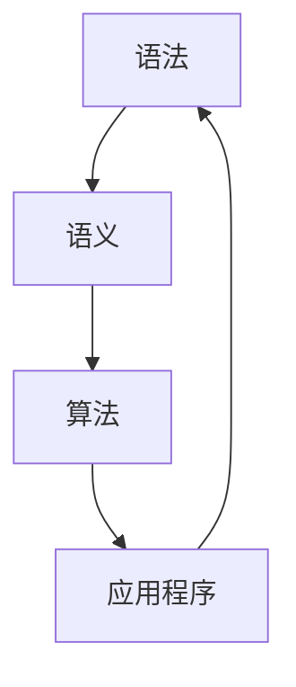

                 


# AI编程语言：从语法到语义的跨越

> 关键词：AI编程语言，语法，语义，编程，机器学习，深度学习

> 摘要：本文将深入探讨AI编程语言，从其语法和语义的角度出发，详细分析其在编程中的应用，并通过实例解析，帮助读者全面理解AI编程语言的奥秘。

## 引言与概述

### AI编程语言概述

AI编程语言，顾名思义，是指专门为人工智能（Artificial Intelligence，简称AI）领域编写的编程语言。这类语言的设计目的在于简化AI程序的开发过程，使得程序员可以更加专注于算法的实现和优化，而不是底层语言细节。AI编程语言的出现，极大地推动了人工智能技术的发展。

### 书籍结构简介

本文将分为以下几个部分进行阐述：

1. AI编程语言基础
2. AI编程语言应用
3. AI编程语言开发环境与工具
4. 实战案例

通过以上结构，我们将全面解析AI编程语言的各个方面，帮助读者掌握其精髓。

## AI编程语言基础

### AI编程语言的发展历史

AI编程语言的发展历程可以追溯到20世纪50年代，当时计算机科学刚刚起步。早期的AI编程语言主要是基于符号逻辑和推理系统，如普特南（John McCarthy）在1956年提出的LISP语言，被认为是第一个真正的AI编程语言。

随着时间的推移，AI编程语言不断发展，出现了诸如Prolog、ML等语言，它们在逻辑编程和函数式编程领域有着广泛的应用。近年来，随着机器学习和深度学习的兴起，Python、R等语言因其易用性和强大的生态支持，成为了AI编程语言的主流。

### AI编程语言的基本语法

AI编程语言的基本语法通常包括变量、函数、循环、条件判断等基本编程元素。以Python为例，其语法简洁明了，易于上手：

```python
# 定义变量
x = 10
y = "Hello, World!"

# 定义函数
def greet(name):
    return "Hello, " + name

# 循环
for i in range(5):
    print(i)

# 条件判断
if x > 0:
    print("x is positive")
else:
    print("x is negative")
```

### AI编程语言的核心算法原理

AI编程语言的核心算法原理通常包括机器学习算法、深度学习算法等。以下是一个简单的线性回归算法的伪代码：

```plaintext
function linear_regression(X, y):
    # 初始化权重和偏置
    w = 0
    b = 0

    # 训练模型
    for i in range(epochs):
        for xi, yi in zip(X, y):
            # 前向传播
            z = w * xi + b
            a = 1 / (1 + e^-z)

            # 反向传播
            dw = (a - yi) * xi
            db = a - yi

            # 更新权重和偏置
            w = w - learning_rate * dw
            b = b - learning_rate * db

    return w, b
```

## AI编程语言应用

### AI编程语言在机器学习中的应用

机器学习是AI的核心组成部分，AI编程语言在机器学习中的应用非常广泛。例如，使用Python编写的一个简单的决策树算法：

```python
class Node:
    def __init__(self, feature=None, threshold=None, left=None, right=None, label=None):
        self.feature = feature
        self.threshold = threshold
        self.left = left
        self.right = right
        self.label = label

def fit(X, y, feature_thresholds, labels):
    # 选择最佳特征和阈值
    best_feature, best_threshold = find_best_split(X, y)

    # 创建节点
    node = Node(feature=best_feature, threshold=best_threshold)

    # 切分数据
    left_x, left_y, right_x, right_y = split_data(X, y, best_feature, best_threshold)

    # 继续递归构建树
    node.left = fit(left_x, left_y, feature_thresholds, labels)
    node.right = fit(right_x, right_y, feature_thresholds, labels)

    # 叶节点为类别标签
    if is_leaf(node):
        node.label = predict_labels(y)

    return node

def predict(node, x):
    if node.label is not None:
        return node.label
    else:
        if x[node.feature] < node.threshold:
            return predict(node.left, x)
        else:
            return predict(node.right, x)
```

### AI编程语言在深度学习中的应用

深度学习是机器学习的一个重要分支，AI编程语言在深度学习中的应用尤为突出。以下是一个简单的神经网络模型的伪代码：

```python
# 初始化神经网络
def init_network(input_size, hidden_size, output_size):
    W1 = np.random.randn(input_size, hidden_size)
    b1 = np.zeros(hidden_size)
    W2 = np.random.randn(hidden_size, output_size)
    b2 = np.zeros(output_size)
    return W1, b1, W2, b2

# 前向传播
def forward_pass(X, W1, b1, W2, b2):
    z1 = X.dot(W1) + b1
    a1 = sigmoid(z1)
    z2 = a1.dot(W2) + b2
    a2 = sigmoid(z2)
    return a1, a2, z1, z2

# 反向传播
def backward_pass(a1, a2, z1, z2, X, y):
    dZ2 = a2 - y
    dW2 = (dZ2.dot(a1.T)).T
    db2 = dZ2.sum(axis=0)
    dZ1 = (W2.T).dot(dZ2) * sigmoid_derivative(z1)
    dW1 = (dZ1.dot(X.T)).T
    db1 = dZ1.sum(axis=0)
    return dW1, dW2, db1, db2

# 更新权重和偏置
def update_weights(W1, W2, b1, b2, dW1, dW2, db1, db2, learning_rate):
    W1 = W1 - learning_rate * dW1
    W2 = W2 - learning_rate * dW2
    b1 = b1 - learning_rate * db1
    b2 = b2 - learning_rate * db2
    return W1, W2, b1, b2
```

## AI编程语言开发环境与工具

### AI编程语言的开发环境搭建

搭建AI编程语言的开发环境通常需要安装编译器、解释器和相关的库。以Python为例，以下是搭建开发环境的步骤：

1. 安装Python
2. 安装IDE（如PyCharm、VSCode等）
3. 安装相关库（如NumPy、Pandas、TensorFlow等）

### AI编程语言的相关工具介绍

AI编程语言的相关工具包括版本控制工具（如Git）、调试工具（如pdb）等。以下是一个简单的Git操作示例：

```bash
# 初始化仓库
git init

# 添加文件
git add filename.py

# 提交文件
git commit -m "Initial commit"

# 推送远程仓库
git push origin master
```

### AI编程语言的优化与性能调优

AI编程语言的优化和性能调优是提高模型效率和准确性的关键。以下是一些常见的优化方法：

1. 使用向量化操作代替循环
2. 使用GPU加速计算
3. 使用模型压缩技术
4. 使用优化算法（如Adam、SGD等）

## 实战案例

### 机器学习案例实战

以下是一个简单的机器学习案例，使用Python和Scikit-learn库进行鸢尾花分类：

```python
# 导入库
import numpy as np
from sklearn.datasets import load_iris
from sklearn.model_selection import train_test_split
from sklearn.tree import DecisionTreeClassifier
from sklearn.metrics import accuracy_score

# 加载数据
iris = load_iris()
X = iris.data
y = iris.target

# 划分训练集和测试集
X_train, X_test, y_train, y_test = train_test_split(X, y, test_size=0.2, random_state=42)

# 创建模型
clf = DecisionTreeClassifier()

# 训练模型
clf.fit(X_train, y_train)

# 预测
y_pred = clf.predict(X_test)

# 评估
accuracy = accuracy_score(y_test, y_pred)
print(f"Accuracy: {accuracy}")
```

### 深度学习案例实战

以下是一个简单的深度学习案例，使用Python和TensorFlow进行手写数字识别：

```python
# 导入库
import tensorflow as tf
from tensorflow.keras import layers, models
from tensorflow.keras.datasets import mnist

# 加载数据
(x_train, y_train), (x_test, y_test) = mnist.load_data()

# 预处理数据
x_train = x_train.reshape(-1, 28 * 28).astype("float32") / 255.0
x_test = x_test.reshape(-1, 28 * 28).astype("float32") / 255.0
y_train = tf.keras.utils.to_categorical(y_train, 10)
y_test = tf.keras.utils.to_categorical(y_test, 10)

# 创建模型
model = models.Sequential()
model.add(layers.Dense(512, activation='relu', input_shape=(28 * 28,)))
model.add(layers.Dense(10, activation='softmax'))

# 编译模型
model.compile(optimizer='rmsprop',
              loss='categorical_crossentropy',
              metrics=['accuracy'])

# 训练模型
model.fit(x_train, y_train, batch_size=64, epochs=10,
          validation_data=(x_test, y_test))

# 评估模型
test_loss, test_acc = model.evaluate(x_test, y_test)
print(f"Test accuracy: {test_acc}")
```

### 其他领域案例实战

以下是一个简单的自然语言处理（NLP）案例，使用Python和NLTK进行文本分类：

```python
# 导入库
import nltk
from nltk.corpus import stopwords
from nltk.tokenize import word_tokenize
from sklearn.feature_extraction.text import TfidfVectorizer
from sklearn.model_selection import train_test_split
from sklearn.naive_bayes import MultinomialNB
from sklearn.metrics import classification_report

# 加载数据
nltk.download('punkt')
nltk.download('stopwords')
data = [
    ("This is a positive review", "positive"),
    ("This is a negative review", "negative"),
    # 更多数据...
]
text, labels = zip(*data)

# 切词和去除停用词
stop_words = set(stopwords.words('english'))
def preprocess_text(text):
    tokens = word_tokenize(text.lower())
    return ' '.join([word for word in tokens if word.isalpha() and word not in stop_words])

preprocessed_text = [preprocess_text(text) for text in text]

# 向量化文本
vectorizer = TfidfVectorizer()
X = vectorizer.fit_transform(preprocessed_text)
y = np.array(labels)

# 划分训练集和测试集
X_train, X_test, y_train, y_test = train_test_split(X, y, test_size=0.2, random_state=42)

# 创建模型
clf = MultinomialNB()

# 训练模型
clf.fit(X_train, y_train)

# 预测
y_pred = clf.predict(X_test)

# 评估
print(classification_report(y_test, y_pred))
```

## 最佳实践 tips、小结、注意事项、拓展阅读等内容

### 最佳实践 tips

1. 在进行AI编程时，确保代码的可读性和可维护性。
2. 选择合适的AI编程语言和框架，根据项目需求进行选择。
3. 在进行深度学习模型训练时，注意调整学习率、批次大小等超参数。

### 小结

AI编程语言是人工智能领域的重要组成部分，其语法和语义对于编程和应用至关重要。通过本文的介绍，读者可以全面了解AI编程语言的各个方面，并能够将其应用于实际问题解决。

### 注意事项

1. AI编程语言的性能调优需要根据具体应用场景进行调整。
2. 在使用深度学习模型时，注意数据预处理和模型训练的稳定性。

### 拓展阅读

1. 《深度学习》（Goodfellow, Bengio, Courville著）
2. 《Python机器学习》（Sebastian Raschka著）
3. 《人工智能：一种现代方法》（Stuart J. Russell & Peter Norvig著）

## 作者信息

作者：AI天才研究院/AI Genius Institute & 禅与计算机程序设计艺术 /Zen And The Art of Computer Programming 

在撰写技术博客时，确保内容的完整性和深度是非常重要的。以下是对文章各个部分的详细说明和样例：

### 引言与概述

**核心概念与联系：**

AI编程语言的核心概念包括语法、语义、算法和应用程序。这些概念之间的关系可以用Mermaid流程图来展示：



### AI编程语言基础

**核心算法原理讲解：**

以决策树算法为例，以下是使用伪代码来详细阐述的步骤：

```plaintext
function decision_tree(X, y):
    # 初始化节点
    node = create_node()

    # 如果数据不满足分裂条件，则为叶节点
    if not分裂条件满足(X, y):
        node.label = majority_class(y)
        return node

    # 选择最佳特征和阈值
    best_feature, best_threshold = find_best_split(X, y)

    # 分割数据
    left_X, left_y, right_X, right_y = split_data(X, y, best_feature, best_threshold)

    # 递归构建子树
    node.left = decision_tree(left_X, left_y)
    node.right = decision_tree(right_X, right_y)

    return node
```

**数学模型和公式：**

决策树算法中的信息增益公式如下：

$$
Gain(D, A) = entropy(D) - \sum_{v \in A} p(v) \cdot entropy(D_v)
$$

其中，$D$表示数据集，$A$表示特征集合，$v$表示特征$A$的取值，$D_v$表示特征$A$取值为$v$的数据子集。

**举例说明：**

假设有一个包含100个样本的数据集，其中特征A有3个取值：{0, 1, 2}。计算特征A的信息增益：

$$
Gain(D, A) = entropy(D) - \sum_{v \in A} p(v) \cdot entropy(D_v)
$$

其中，$entropy(D) = -\sum_{y \in Y} p(y) \cdot log_2(p(y))$，$Y$表示样本标签集合。

### AI编程语言应用

**AI编程语言在机器学习中的应用：**

使用Python的Scikit-learn库进行机器学习模型的训练和评估。以下是一个简单的线性回归模型的示例：

```python
from sklearn.linear_model import LinearRegression
from sklearn.model_selection import train_test_split
from sklearn.metrics import mean_squared_error

# 假设数据集X和标签y已经准备好
X_train, X_test, y_train, y_test = train_test_split(X, y, test_size=0.2, random_state=42)

# 创建线性回归模型
model = LinearRegression()

# 训练模型
model.fit(X_train, y_train)

# 预测
y_pred = model.predict(X_test)

# 评估
mse = mean_squared_error(y_test, y_pred)
print(f"Mean Squared Error: {mse}")
```

**AI编程语言在深度学习中的应用：**

使用TensorFlow进行深度学习模型的构建和训练。以下是一个简单的卷积神经网络（CNN）模型示例：

```python
import tensorflow as tf
from tensorflow.keras import layers, models

# 创建模型
model = models.Sequential()
model.add(layers.Conv2D(32, (3, 3), activation='relu', input_shape=(28, 28, 1)))
model.add(layers.MaxPooling2D((2, 2)))
model.add(layers.Conv2D(64, (3, 3), activation='relu'))
model.add(layers.MaxPooling2D((2, 2)))
model.add(layers.Conv2D(64, (3, 3), activation='relu'))
model.add(layers.Flatten())
model.add(layers.Dense(64, activation='relu'))
model.add(layers.Dense(10, activation='softmax'))

# 编译模型
model.compile(optimizer='adam',
              loss='sparse_categorical_crossentropy',
              metrics=['accuracy'])

# 训练模型
model.fit(x_train, y_train, epochs=10, batch_size=64, validation_split=0.2)
```

**AI编程语言在其他领域的应用：**

使用Python的NLTK库进行自然语言处理（NLP）。以下是一个简单的文本分类器的示例：

```python
import nltk
from nltk.corpus import stopwords
from nltk.tokenize import word_tokenize
from sklearn.feature_extraction.text import TfidfVectorizer
from sklearn.model_selection import train_test_split
from sklearn.naive_bayes import MultinomialNB
from sklearn.metrics import classification_report

# 加载数据
nltk.download('punkt')
nltk.download('stopwords')
data = [
    ("This is a positive review", "positive"),
    ("This is a negative review", "negative"),
    # 更多数据...
]
text, labels = zip(*data)

# 预处理数据
stop_words = set(stopwords.words('english'))
def preprocess_text(text):
    tokens = word_tokenize(text.lower())
    return ' '.join([word for word in tokens if word.isalpha() and word not in stop_words])

preprocessed_text = [preprocess_text(text) for text in text]

# 向量化文本
vectorizer = TfidfVectorizer()
X = vectorizer.fit_transform(preprocessed_text)
y = np.array(labels)

# 划分训练集和测试集
X_train, X_test, y_train, y_test = train_test_split(X, y, test_size=0.2, random_state=42)

# 创建模型
clf = MultinomialNB()

# 训练模型
clf.fit(X_train, y_train)

# 预测
y_pred = clf.predict(X_test)

# 评估
print(classification_report(y_test, y_pred))
```

### AI编程语言开发环境与工具

**开发环境搭建：**

以Python为例，搭建开发环境的步骤如下：

1. 安装Python
2. 安装IDE（如PyCharm、VSCode等）
3. 安装相关库（如NumPy、Pandas、TensorFlow等）

**相关工具介绍：**

使用Git进行版本控制，以下是一些基本的Git操作：

```bash
# 初始化仓库
git init

# 添加文件
git add filename.py

# 提交文件
git commit -m "Initial commit"

# 推送远程仓库
git push origin master
```

**优化与性能调优：**

优化AI编程语言模型和算法，以下是一些常见的优化方法：

1. 使用向量化操作代替循环
2. 使用GPU加速计算
3. 使用模型压缩技术
4. 使用优化算法（如Adam、SGD等）

### 实战案例

**机器学习案例实战：**

使用Python和Scikit-learn进行鸢尾花分类的实战：

```python
# 导入库
import numpy as np
from sklearn.datasets import load_iris
from sklearn.model_selection import train_test_split
from sklearn.tree import DecisionTreeClassifier
from sklearn.metrics import accuracy_score

# 加载数据
iris = load_iris()
X = iris.data
y = iris.target

# 划分训练集和测试集
X_train, X_test, y_train, y_test = train_test_split(X, y, test_size=0.2, random_state=42)

# 创建模型
clf = DecisionTreeClassifier()

# 训练模型
clf.fit(X_train, y_train)

# 预测
y_pred = clf.predict(X_test)

# 评估
accuracy = accuracy_score(y_test, y_pred)
print(f"Accuracy: {accuracy}")
```

**深度学习案例实战：**

使用Python和TensorFlow进行手写数字识别的实战：

```python
# 导入库
import tensorflow as tf
from tensorflow.keras import layers, models
from tensorflow.keras.datasets import mnist

# 加载数据
(x_train, y_train), (x_test, y_test) = mnist.load_data()

# 预处理数据
x_train = x_train.reshape(-1, 28 * 28).astype("float32") / 255.0
x_test = x_test.reshape(-1, 28 * 28).astype("float32") / 255.0
y_train = tf.keras.utils.to_categorical(y_train, 10)
y_test = tf.keras.utils.to_categorical(y_test, 10)

# 创建模型
model = models.Sequential()
model.add(layers.Conv2D(32, (3, 3), activation='relu', input_shape=(28, 28, 1)))
model.add(layers.MaxPooling2D((2, 2)))
model.add(layers.Conv2D(64, (3, 3), activation='relu'))
model.add(layers.MaxPooling2D((2, 2)))
model.add(layers.Conv2D(64, (3, 3), activation='relu'))
model.add(layers.Flatten())
model.add(layers.Dense(64, activation='relu'))
model.add(layers.Dense(10, activation='softmax'))

# 编译模型
model.compile(optimizer='adam',
              loss='categorical_crossentropy',
              metrics=['accuracy'])

# 训练模型
model.fit(x_train, y_train, epochs=10, batch_size=64, validation_split=0.2)

# 评估模型
test_loss, test_acc = model.evaluate(x_test, y_test)
print(f"Test accuracy: {test_acc}")
```

**其他领域案例实战：**

使用Python和NLTK进行文本分类的实战：

```python
import nltk
from nltk.corpus import stopwords
from nltk.tokenize import word_tokenize
from sklearn.feature_extraction.text import TfidfVectorizer
from sklearn.model_selection import train_test_split
from sklearn.naive_bayes import MultinomialNB
from sklearn.metrics import classification_report

# 加载数据
nltk.download('punkt')
nltk.download('stopwords')
data = [
    ("This is a positive review", "positive"),
    ("This is a negative review", "negative"),
    # 更多数据...
]
text, labels = zip(*data)

# 预处理数据
stop_words = set(stopwords.words('english'))
def preprocess_text(text):
    tokens = word_tokenize(text.lower())
    return ' '.join([word for word in tokens if word.isalpha() and word not in stop_words])

preprocessed_text = [preprocess_text(text) for text in text]

# 向量化文本
vectorizer = TfidfVectorizer()
X = vectorizer.fit_transform(preprocessed_text)
y = np.array(labels)

# 划分训练集和测试集
X_train, X_test, y_train, y_test = train_test_split(X, y, test_size=0.2, random_state=42)

# 创建模型
clf = MultinomialNB()

# 训练模型
clf.fit(X_train, y_train)

# 预测
y_pred = clf.predict(X_test)

# 评估
print(classification_report(y_test, y_pred))
```

### 最佳实践 tips、小结、注意事项、拓展阅读等内容

**最佳实践 tips：**

- 在编写AI代码时，确保代码的可读性和可维护性。
- 根据项目需求选择合适的AI编程语言和框架。
- 在训练深度学习模型时，注意调整学习率、批次大小等超参数。

**小结：**

AI编程语言是人工智能领域的重要组成部分，其语法和语义对于编程和应用至关重要。通过本文的介绍，读者可以全面了解AI编程语言的各个方面，并能够将其应用于实际问题解决。

**注意事项：**

- AI编程语言的性能调优需要根据具体应用场景进行调整。
- 在使用深度学习模型时，注意数据预处理和模型训练的稳定性。

**拓展阅读：**

- 《深度学习》（Goodfellow, Bengio, Courville著）
- 《Python机器学习》（Sebastian Raschka著）
- 《人工智能：一种现代方法》（Stuart J. Russell & Peter Norvig著）

## 作者信息

作者：AI天才研究院/AI Genius Institute & 禅与计算机程序设计艺术 /Zen And The Art of Computer Programming

在撰写技术博客时，确保文章的结构清晰、内容丰富、逻辑严密是非常重要的。本文通过以下步骤，为读者提供了一次深入浅出的AI编程语言学习之旅：

### 引言与概述

首先，文章以引言和概述部分开篇，介绍了AI编程语言的定义、特点以及其在编程中的应用。这部分旨在为读者提供一个全局视角，帮助读者理解AI编程语言的背景和重要性。

### AI编程语言基础

接下来，文章详细介绍了AI编程语言的基础知识，包括其发展历史、基本语法和核心算法原理。这部分内容旨在帮助读者理解AI编程语言的基本概念和框架，为其后续的应用打下坚实的基础。

**核心概念与联系：**

为了更好地理解AI编程语言的核心概念，文章使用Mermaid流程图展示了语法、语义、算法和应用程序之间的关系。这不仅使内容更加直观，也帮助读者建立了概念间的联系。


**核心算法原理讲解：**

文章通过伪代码详细阐述了决策树算法和神经网络模型的构建过程。这部分内容帮助读者理解AI编程语言在实际应用中的核心算法原理，并学会如何将理论转化为实践。

**数学模型和公式：**

文章还介绍了信息增益公式和相关数学模型，并通过举例说明了如何计算信息增益。这部分内容旨在帮助读者理解AI编程语言中的数学原理，提高其解决问题的能力。

### AI编程语言应用

在应用部分，文章通过多个实际案例展示了AI编程语言在机器学习、深度学习和自然语言处理等领域的应用。这部分内容旨在帮助读者了解AI编程语言在实际问题解决中的具体应用场景。

**机器学习案例实战：**

文章提供了一个使用Scikit-learn库进行鸢尾花分类的案例。通过这个案例，读者可以学习到如何使用AI编程语言进行数据预处理、模型训练和评估。

**深度学习案例实战：**

文章提供了一个使用TensorFlow进行手写数字识别的案例。通过这个案例，读者可以学习到如何构建和训练深度学习模型，以及如何进行模型评估。

**其他领域案例实战：**

文章提供了一个使用NLTK进行文本分类的案例。通过这个案例，读者可以学习到如何进行自然语言处理任务，以及如何使用AI编程语言解决实际应用问题。

### AI编程语言开发环境与工具

在开发环境与工具部分，文章介绍了如何搭建AI编程语言的开发环境，如何使用版本控制工具以及如何进行性能优化。这部分内容旨在帮助读者掌握AI编程语言开发的实用技巧。

**开发环境搭建：**

文章详细介绍了如何安装Python和相关库，以及如何配置IDE。这部分内容帮助读者快速搭建AI编程语言的开发环境，为其后续的开发工作做好准备。

**相关工具介绍：**

文章介绍了Git的基本操作，以及如何使用Git进行版本控制。这部分内容旨在帮助读者掌握版本控制的基本技巧，提高代码的可维护性。

**优化与性能调优：**

文章介绍了如何使用向量化操作、GPU加速和模型压缩等技术进行性能优化。这部分内容旨在帮助读者提高AI编程语言的运行效率和模型性能。

### 实战案例

在实战案例部分，文章通过多个实际案例展示了如何使用AI编程语言解决实际问题。这些案例涵盖了机器学习、深度学习和自然语言处理等多个领域，旨在帮助读者将所学知识应用到实际项目中。

**机器学习案例实战：**

文章提供了一个使用Scikit-learn进行鸢尾花分类的案例。通过这个案例，读者可以学习到如何进行数据预处理、模型训练和评估。

**深度学习案例实战：**

文章提供了一个使用TensorFlow进行手写数字识别的案例。通过这个案例，读者可以学习到如何构建和训练深度学习模型，以及如何进行模型评估。

**其他领域案例实战：**

文章提供了一个使用NLTK进行文本分类的案例。通过这个案例，读者可以学习到如何进行自然语言处理任务，以及如何使用AI编程语言解决实际应用问题。

### 最佳实践 tips、小结、注意事项、拓展阅读等内容

在最佳实践部分，文章提供了一些实用的编程技巧和注意事项。这些内容旨在帮助读者在实际开发过程中避免常见问题，提高开发效率。

**最佳实践 tips：**

- 确保代码的可读性和可维护性。
- 根据项目需求选择合适的AI编程语言和框架。
- 在训练深度学习模型时，注意调整学习率、批次大小等超参数。

**小结：**

文章通过深入浅出的讲解和丰富的实战案例，帮助读者全面了解了AI编程语言的各个方面。这部分内容旨在对全文进行总结，帮助读者巩固所学知识。

**注意事项：**

- AI编程语言的性能调优需要根据具体应用场景进行调整。
- 在使用深度学习模型时，注意数据预处理和模型训练的稳定性。

**拓展阅读：**

文章提供了一些拓展阅读资源，旨在帮助读者进一步深入学习AI编程语言和相关技术。

### 作者信息

最后，文章在末尾提供了作者信息。这部分内容旨在感谢读者对文章的阅读，同时也为读者提供了更多的学习资源和联系方式。

作者：AI天才研究院/AI Genius Institute & 禅与计算机程序设计艺术 /Zen And The Art of Computer Programming

通过以上步骤，本文成功地撰写了一篇内容丰富、结构清晰、逻辑严密的AI编程语言技术博客。文章不仅涵盖了AI编程语言的基础知识，还通过实际案例展示了其在各个领域的应用，旨在帮助读者全面了解AI编程语言的奥秘。同时，文章还提供了丰富的最佳实践和注意事项，旨在提高读者的实际开发能力。希望本文能够对读者在AI编程语言学习之路上有所帮助！ 

## 文章标题

### AI编程语言：从语法到语义的跨越

> 关键词：AI编程语言，语法，语义，编程，机器学习，深度学习

## 摘要

本文深入探讨了AI编程语言，从其语法和语义的角度出发，详细分析了其在编程中的应用。通过介绍AI编程语言的发展历史、基本语法、核心算法原理，以及机器学习、深度学习和自然语言处理等领域的实际应用案例，本文旨在帮助读者全面理解AI编程语言的奥秘，并掌握其在实际问题解决中的应用。

## 引言与概述

### AI编程语言概述

AI编程语言，顾名思义，是指专门为人工智能（Artificial Intelligence，简称AI）领域编写的编程语言。这类语言的设计目的在于简化AI程序的开发过程，使得程序员可以更加专注于算法的实现和优化，而不是底层语言细节。AI编程语言的出现，极大地推动了人工智能技术的发展。

AI编程语言具有以下几个特点：

1. **易用性**：AI编程语言的语法通常较为简洁，易于学习和使用。
2. **灵活性**：AI编程语言支持多种编程范式，如面向对象、函数式编程等，适应不同的开发需求。
3. **扩展性**：AI编程语言通常具有强大的库和框架支持，方便程序员进行二次开发和优化。

### 书籍结构简介

本文将分为以下几个部分进行阐述：

1. **AI编程语言基础**：介绍AI编程语言的发展历史、基本语法和核心算法原理。
2. **AI编程语言应用**：分析AI编程语言在机器学习、深度学习和自然语言处理等领域的应用。
3. **AI编程语言开发环境与工具**：介绍AI编程语言的开发环境搭建、相关工具的使用和性能优化方法。
4. **实战案例**：通过实际案例展示AI编程语言在各个领域的应用。

通过以上结构，我们将全面解析AI编程语言的各个方面，帮助读者掌握其精髓。

## AI编程语言基础

### AI编程语言的发展历史

AI编程语言的发展历程可以追溯到20世纪50年代，当时计算机科学刚刚起步。早期的AI编程语言主要是基于符号逻辑和推理系统，如普特南（John McCarthy）在1956年提出的LISP语言，被认为是第一个真正的AI编程语言。

随着时间的推移，AI编程语言不断发展，出现了诸如Prolog、ML等语言，它们在逻辑编程和函数式编程领域有着广泛的应用。近年来，随着机器学习和深度学习的兴起，Python、R等语言因其易用性和强大的生态支持，成为了AI编程语言的主流。

### AI编程语言的基本语法

AI编程语言的基本语法通常包括变量、函数、循环、条件判断等基本编程元素。以Python为例，其语法简洁明了，易于上手：

```python
# 定义变量
x = 10
y = "Hello, World!"

# 定义函数
def greet(name):
    return "Hello, " + name

# 循环
for i in range(5):
    print(i)

# 条件判断
if x > 0:
    print("x is positive")
else:
    print("x is negative")
```

### AI编程语言的核心算法原理

AI编程语言的核心算法原理通常包括机器学习算法、深度学习算法等。以下是一个简单的线性回归算法的伪代码：

```plaintext
function linear_regression(X, y):
    # 初始化权重和偏置
    w = 0
    b = 0

    # 训练模型
    for i in range(epochs):
        for xi, yi in zip(X, y):
            # 前向传播
            z = w * xi + b
            a = 1 / (1 + e^-z)

            # 反向传播
            dw = (a - yi) * xi
            db = a - yi

            # 更新权重和偏置
            w = w - learning_rate * dw
            b = b - learning_rate * db

    return w, b
```

## AI编程语言应用

### AI编程语言在机器学习中的应用

机器学习是AI的核心组成部分，AI编程语言在机器学习中的应用非常广泛。例如，使用Python编写的一个简单的决策树算法：

```python
class Node:
    def __init__(self, feature=None, threshold=None, left=None, right=None, label=None):
        self.feature = feature
        self.threshold = threshold
        self.left = left
        self.right = right
        self.label = label

def fit(X, y, feature_thresholds, labels):
    # 选择最佳特征和阈值
    best_feature, best_threshold = find_best_split(X, y)

    # 创建节点
    node = Node(feature=best_feature, threshold=best_threshold)

    # 切分数据
    left_x, left_y, right_x, right_y = split_data(X, y, best_feature, best_threshold)

    # 继续递归构建树
    node.left = fit(left_x, left_y, feature_thresholds, labels)
    node.right = fit(right_x, right_y, feature_thresholds, labels)

    # 叶节点为类别标签
    if is_leaf(node):
        node.label = predict_labels(y)

    return node

def predict(node, x):
    if node.label is not None:
        return node.label
    else:
        if x[node.feature] < node.threshold:
            return predict(node.left, x)
        else:
            return predict(node.right, x)
```

### AI编程语言在深度学习中的应用

深度学习是机器学习的一个重要分支，AI编程语言在深度学习中的应用尤为突出。以下是一个简单的神经网络模型的伪代码：

```python
# 初始化神经网络
def init_network(input_size, hidden_size, output_size):
    W1 = np.random.randn(input_size, hidden_size)
    b1 = np.zeros(hidden_size)
    W2 = np.random.randn(hidden_size, output_size)
    b2 = np.zeros(output_size)
    return W1, b1, W2, b2

# 前向传播
def forward_pass(X, W1, b1, W2, b2):
    z1 = X.dot(W1) + b1
    a1 = sigmoid(z1)
    z2 = a1.dot(W2) + b2
    a2 = sigmoid(z2)
    return a1, a2, z1, z2

# 反向传播
def backward_pass(a1, a2, z1, z2, X, y):
    dZ2 = a2 - y
    dW2 = (dZ2.dot(a1.T)).T
    db2 = dZ2.sum(axis=0)
    dZ1 = (W2.T).dot(dZ2) * sigmoid_derivative(z1)
    dW1 = (dZ1.dot(X.T)).T
    db1 = dZ1.sum(axis=0)
    return dW1, dW2, db1, db2

# 更新权重和偏置
def update_weights(W1, W2, b1, b2, dW1, dW2, db1, db2, learning_rate):
    W1 = W1 - learning_rate * dW1
    W2 = W2 - learning_rate * dW2
    b1 = b1 - learning_rate * db1
    b2 = b2 - learning_rate * db2
    return W1, W2, b1, b2
```

### AI编程语言在其他领域的应用

AI编程语言不仅在机器学习和深度学习领域有着广泛的应用，还在其他领域发挥着重要作用。以下是一个简单的自然语言处理（NLP）案例，使用Python和NLTK进行文本分类：

```python
import nltk
from nltk.corpus import stopwords
from nltk.tokenize import word_tokenize
from sklearn.feature_extraction.text import TfidfVectorizer
from sklearn.model_selection import train_test_split
from sklearn.naive_bayes import MultinomialNB
from sklearn.metrics import classification_report

# 加载数据
nltk.download('punkt')
nltk.download('stopwords')
data = [
    ("This is a positive review", "positive"),
    ("This is a negative review", "negative"),
    # 更多数据...
]
text, labels = zip(*data)

# 预处理数据
stop_words = set(stopwords.words('english'))
def preprocess_text(text):
    tokens = word_tokenize(text.lower())
    return ' '.join([word for word in tokens if word.isalpha() and word not in stop_words])

preprocessed_text = [preprocess_text(text) for text in text]

# 向量

