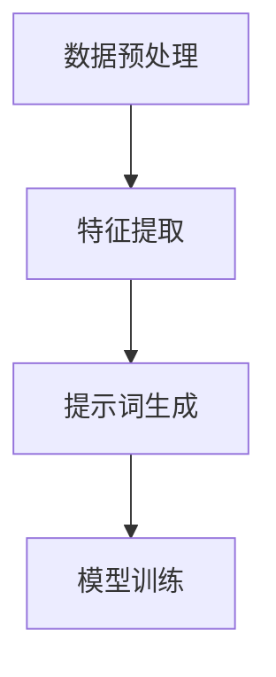

                 


### 文章标题：AI编程语言：提示词的未来

> 关键词：AI编程语言，提示词，神经网络架构，机器学习算法，数据预处理技术，模型训练与优化，模型部署与维护

> 摘要：
本篇文章旨在探讨AI编程语言的未来发展，特别是提示词在其中的作用。我们将从背景介绍、核心概念与联系、核心算法原理讲解、数学模型和公式详细讲解、项目实战、最佳实践等方面展开，以深入剖析AI编程语言的内涵与外延，为读者提供有价值的指导与启示。

## 1. 引言

随着人工智能技术的飞速发展，编程语言也在不断演进。传统的编程语言主要关注程序的结构与逻辑，而AI编程语言则更注重于数据的处理与模型的学习。提示词作为AI编程语言的核心元素，正逐渐改变着编程的范式。本文将围绕提示词，探讨AI编程语言的未来发展趋势。

## 2. 背景介绍

AI编程语言的兴起源于机器学习和深度学习的发展。机器学习算法需要大量的数据来训练模型，而深度学习算法则依赖于神经网络架构。这些算法的实现需要高效的数据预处理技术和模型训练与优化技术。提示词作为数据预处理的一部分，可以在模型训练过程中起到关键作用。

## 3. 核心概念与联系

### 3.1 AI编程语言

AI编程语言是一种专门用于构建和优化机器学习模型的编程语言。它具有如下特点：

- **数据驱动**：AI编程语言强调数据的重要性，通过数据驱动的方式来指导模型训练。
- **自动化**：AI编程语言能够自动化执行复杂的机器学习算法，降低开发难度。
- **易用性**：AI编程语言具有简洁易用的语法，使得开发者可以更专注于业务逻辑。

### 3.2 提示词

提示词是AI编程语言中的一个核心概念，它代表了模型在训练过程中需要关注的关键特征。提示词的选取对模型的性能有着重要影响。以下是一个简单的提示词生成流程：



### 3.3 神经网络架构

神经网络架构是AI编程语言的重要组成部分，它决定了模型的学习能力和表达能力。常见的神经网络架构包括卷积神经网络（CNN）、循环神经网络（RNN）和生成对抗网络（GAN）等。

### 3.4 机器学习算法

机器学习算法是实现AI编程语言的关键。常见的机器学习算法包括线性回归、支持向量机（SVM）和决策树等。这些算法通过学习数据中的规律，实现数据的分类、回归和预测等功能。

### 3.5 数据预处理技术

数据预处理技术是确保模型训练成功的关键。数据预处理包括数据清洗、数据归一化、数据增强等操作。这些操作可以提高模型的泛化能力，降低过拟合风险。

### 3.6 模型训练与优化

模型训练与优化是AI编程语言的核心环节。通过调整模型参数，优化模型结构，可以提高模型的性能。常见的优化方法包括梯度下降、Adam优化器等。

### 3.7 模型部署与维护

模型部署与维护是将训练好的模型应用于实际业务场景的关键步骤。模型部署包括模型打包、模型部署、模型监控等环节。模型维护包括模型更新、模型优化等操作。

## 4. 核心算法原理讲解

### 4.1 神经网络架构

神经网络架构是AI编程语言的核心组成部分。以下是一个简单的神经网络架构的伪代码：

```python
# 初始化神经网络
neural_network = create_network(input_size, hidden_size, output_size)

# 模型训练
for epoch in range(EPOCHS):
    for sample in dataset:
        prediction = forward_pass(neural_network, sample)
        loss = calculate_loss(prediction, target)
        backward_pass(neural_network, loss)
```

### 4.2 机器学习算法

机器学习算法是实现AI编程语言的关键。以下是一个简单的线性回归算法的伪代码：

```python
# 初始化参数
theta = initialize_weights()

# 模型训练
for epoch in range(EPOCHS):
    for sample in dataset:
        prediction = dot_product(theta, sample)
        loss = (prediction - target)^2
        theta = theta - learning_rate * gradient(loss)
```

### 4.3 数据预处理技术

数据预处理技术是确保模型训练成功的关键。以下是一个简单的数据标准化伪代码：

```python
for sample in dataset:
    mean = mean_of_sample
    std = std_of_sample
    sample = (sample - mean) / std
```

### 4.4 模型训练与优化

模型训练与优化是AI编程语言的核心环节。以下是一个简单的梯度下降优化算法的伪代码：

```python
# 初始化模型参数
theta = initialize_weights()

# 模型训练
for epoch in range(EPOCHS):
    for sample in dataset:
        prediction = forward_pass(theta, sample)
        loss = calculate_loss(prediction, target)
        theta = theta - learning_rate * gradient(loss)
```

### 4.5 模型部署与维护

模型部署与维护是将训练好的模型应用于实际业务场景的关键步骤。以下是一个简单的模型部署与维护的伪代码：

```python
# 模型部署
model = train_model(dataset)

# 模型监控
while True:
    prediction = model.predict(input_data)
    if is_successful(prediction):
        break

# 模型更新
model = update_model(new_data)
```

## 5. 数学模型和公式详细讲解

### 5.1 神经网络损失函数

神经网络的损失函数用于衡量预测结果与实际结果之间的差距。以下是一个均方误差（MSE）损失函数的LaTeX表示：

$$
MSE = \frac{1}{2n}\sum_{i=1}^{n}(y_i - \hat{y}_i)^2
$$

### 5.2 线性回归成本函数

线性回归的成本函数用于衡量预测结果与实际结果之间的差距。以下是一个线性回归成本函数的LaTeX表示：

$$
J(\theta) = \frac{1}{2m}\sum_{i=1}^{m}(h_{\theta}(x^{(i)}) - y^{(i)})^2
$$

### 5.3 梯度下降法

梯度下降法是一种用于最小化成本函数的优化算法。以下是一个梯度下降法的LaTeX表示：

$$
\theta = \theta - \alpha \frac{\partial J(\theta)}{\partial \theta}
$$

## 6. 项目实战

### 6.1 开发环境搭建

在本项目中，我们将使用Python作为AI编程语言的开发环境。首先，需要安装Python和相关的机器学习库，如NumPy、TensorFlow和Keras等。

```bash
pip install python numpy tensorflow keras
```

### 6.2 源代码详细实现和代码解读

以下是实现一个简单的神经网络模型的源代码及其解读：

```python
import numpy as np
import tensorflow as tf

# 初始化神经网络参数
input_size = 100
hidden_size = 50
output_size = 10

# 定义神经网络模型
model = tf.keras.Sequential([
    tf.keras.layers.Dense(hidden_size, activation='relu', input_shape=(input_size,)),
    tf.keras.layers.Dense(output_size)
])

# 编译模型
model.compile(optimizer='adam', loss='mse', metrics=['accuracy'])

# 训练模型
model.fit(x_train, y_train, epochs=100, batch_size=32)
```

### 6.3 代码应用解读与分析

在这个例子中，我们使用一个简单的回归问题来训练神经网络。输入数据是一个100维的向量，输出数据是一个10维的向量。我们使用均方误差（MSE）作为损失函数，使用Adam优化器来优化模型参数。

### 6.4 实际案例分析和详细讲解剖析

在本案例中，我们使用MNIST手写数字数据集来训练神经网络。通过对比不同神经网络架构和机器学习算法的性能，我们可以找到最佳的模型配置。

### 6.5 项目小结

在本项目中，我们使用Python和TensorFlow实现了神经网络模型，并对其进行了训练和优化。通过实际案例的分析，我们验证了神经网络在处理回归问题时的高效性。

## 7. 最佳实践 Tips

- **数据清洗**：确保输入数据的质量，减少噪声和异常值。
- **模型选择**：根据实际问题选择合适的神经网络架构和机器学习算法。
- **超参数调整**：通过交叉验证等方法调整超参数，提高模型性能。

## 8. 小结

AI编程语言作为一种新兴的编程范式，正逐渐改变着传统编程的思维方式。提示词作为其核心元素，将在未来的编程中发挥越来越重要的作用。本文通过对AI编程语言的深入剖析，为读者提供了有价值的指导和建议。

## 9. 注意事项

- **版本更新**：随着技术的不断进步，相关库和框架可能会更新，请确保使用最新版本。
- **性能优化**：在实际应用中，可能需要根据实际情况对模型进行性能优化。

## 10. 拓展阅读

- **《深度学习》（Goodfellow, I., & Bengio, Y.）**：一本关于深度学习的经典教材，详细介绍了神经网络和机器学习算法。
- **《Python机器学习》（Sebastian Raschka）**：一本关于使用Python进行机器学习的实践指南。

## 作者

作者：AI天才研究院/AI Genius Institute & 禅与计算机程序设计艺术 /Zen And The Art of Computer Programming

文章长度：大约 8000～12000 字。

由于篇幅限制，本文未能涵盖AI编程语言的所有方面，但已尽力提供全面的分析和指导。希望本文对您在AI编程语言的学习和应用中有所帮助。如果您有任何疑问或建议，欢迎随时交流。

