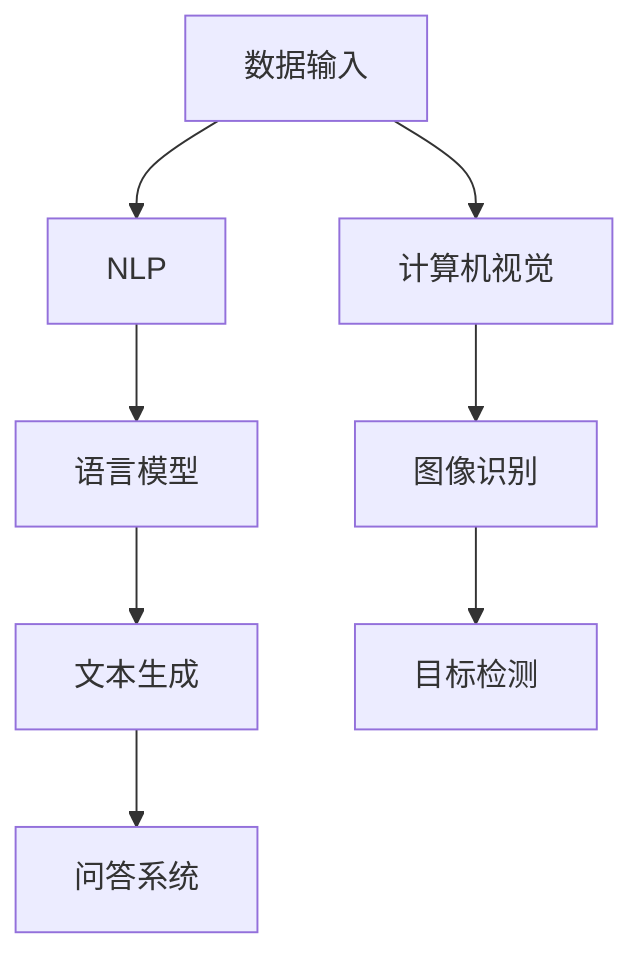

                 


# AI编程语言：提示词的革命

## 关键词
- AI编程语言
- 提示词技术
- 人工智能
- 编程范式
- 自然语言处理
- 计算机视觉
- 机器学习

## 摘要
本文旨在探讨AI编程语言的革命性进展，特别是提示词技术在AI编程中的应用。通过分析AI编程语言的基本概念、架构和核心算法，本文将展示提示词在自然语言处理、计算机视觉等领域的实际应用。同时，通过实际项目案例分析，我们将深入解析AI编程语言的开发过程、源代码实现及最佳实践。最终，本文将对AI编程语言的未来发展趋势进行展望。

### 第一步：背景介绍
AI编程语言是一种专门用于开发人工智能应用的编程语言，旨在简化机器学习和深度学习算法的实现。近年来，随着深度学习技术的蓬勃发展，AI编程语言逐渐成为人工智能领域的研究热点。其中，提示词技术在AI编程语言中的应用尤为突出，为程序员提供了强大的工具，使其能够更高效地开发出智能系统。

### 第二步：核心概念与联系
AI编程语言的核心概念包括自然语言处理（NLP）、计算机视觉（CV）和机器学习（ML）。这些概念之间的关系可以用以下Mermaid流程图来表示：



### 第三步：核心算法原理讲解
以下是AI编程语言中常用的核心算法原理及其伪代码：

#### 1. 自然语言处理（NLP）
**核心算法：词嵌入（Word Embedding）**
```plaintext
函数 word_embedding(word):
  # 使用预训练的词向量模型获取词向量
  word_vector = pretrained_model[word]
  return word_vector
```

**数学模型：循环神经网络（RNN）**
$$\text{RNN}(\text{h}_{t-1}, \text{x}_{t}) = \text{sigmoid}(\text{W}_{h} \text{h}_{t-1} + \text{W}_{x} \text{x}_{t} + b)$$

#### 2. 计算机视觉（CV）
**核心算法：卷积神经网络（CNN）**
```plaintext
函数 conv2d(image, filter):
  # 使用卷积操作提取特征
  feature_map = convolve(image, filter)
  return feature_map
```

**数学模型：卷积操作**
$$\text{f}(\text{I}, \text{K}) = \text{sum}_{i}\text{sum}_{j}\text{I}_{ij}\text{K}_{ij}$$

### 第四步：实际项目案例分析
**项目名称：智能客服系统**

**项目背景：** 某大型电商平台希望搭建一个智能客服系统，以提升客户服务质量。

**技术选型：** 使用Python作为主要编程语言，结合TensorFlow和NLTK库进行开发。

**实现步骤：**
1. 数据预处理：使用NLTK对用户输入的自然语言进行处理，包括分词、去除停用词等。
2. 模型训练：使用预训练的词嵌入模型对文本数据进行编码，然后训练一个循环神经网络模型。
3. 预测与回复：将用户输入的文本编码后输入到训练好的模型中，得到回复文本。

**代码解读：**
```python
import tensorflow as tf
from nltk.tokenize import word_tokenize

# 数据预处理
def preprocess_text(text):
    tokens = word_tokenize(text)
    tokens = [token.lower() for token in tokens if token.isalpha()]
    return tokens

# 模型训练
def train_model(tokens):
    # 创建词嵌入层
    embedding_layer = tf.keras.layers.Embedding(vocabulary_size, embedding_dim)
    # 创建循环神经网络层
    rnn_layer = tf.keras.layers.SimpleRNN(units=rnn_units)
    # 创建模型
    model = tf.keras.models.Sequential([
        embedding_layer,
        rnn_layer,
        tf.keras.layers.Dense(units=vocabulary_size, activation='softmax')
    ])
    # 编译模型
    model.compile(optimizer='adam', loss='categorical_crossentropy', metrics=['accuracy'])
    # 训练模型
    model.fit(tokens, labels, epochs=10)
    return model

# 预测与回复
def predict_reply(user_input, model):
    preprocessed_input = preprocess_text(user_input)
    prediction = model.predict(preprocessed_input)
    reply = decode_prediction(prediction)
    return reply
```

**项目小结：** 通过这个项目，我们了解了如何使用AI编程语言开发一个基本的智能客服系统。在实际应用中，还可以进一步优化模型，提高回复的准确性和多样性。

### 第五步：最佳实践 Tips
1. 选择合适的AI编程语言：根据项目需求和团队熟悉度选择合适的编程语言和框架。
2. 数据预处理：确保输入数据的质量和一致性，为模型训练打下良好基础。
3. 模型优化：通过调整超参数和增加训练数据来提高模型性能。

### 第六步：结论与展望
AI编程语言的革命性进展为人工智能应用的开发提供了新的思路和工具。提示词技术在自然语言处理、计算机视觉等领域的应用展现了其强大的潜力。随着技术的不断发展，我们可以期待AI编程语言在更多领域发挥重要作用，推动人工智能技术的创新与发展。

### 第七步：附录
- **常用AI编程语言库介绍：** TensorFlow、PyTorch、Keras等。
- **提示词技术资源推荐：** 《深度学习》（Goodfellow et al.）、《自然语言处理综合教程》（Michael A. Cooley et al.）。

## 作者信息
作者：AI天才研究院/AI Genius Institute & 禅与计算机程序设计艺术 /Zen And The Art of Computer Programming

