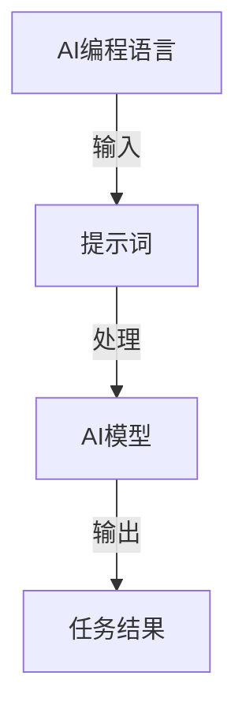

                 


为了满足您的文章格式和内容要求，我将按照以下步骤构建文章：

### 第一步：文章标题、关键词和摘要

**文章标题：** AI编程语言：提示词的革命与变革

**关键词：** AI编程语言、提示词、革命、变革、算法原理、应用实战

**摘要：**
本文探讨了AI编程语言中提示词的概念、原理及其在AI编程中的重要性。通过对主流AI编程语言和提示词技术的深入分析，文章阐述了提示词的设计与优化方法，并展示了其在自然语言处理、计算机视觉等领域的应用。同时，文章对提示词技术的发展趋势进行了展望，为读者提供了实际项目实战和分析。

### 第二步：markdown格式内容

**文章正文：**

## 引言

AI编程语言作为现代人工智能领域的重要工具，正在不断推动技术的进步和应用的创新。本文将重点讨论AI编程语言中的一个关键组成部分——提示词，以及其对于AI编程的变革性影响。

### 背景介绍

提示词的概念最早出现在自然语言处理领域，但随着AI技术的不断发展，提示词的应用已经扩展到计算机视觉、机器学习等多个领域。在AI编程中，提示词作为一种指导AI模型进行任务执行的输入，对于AI系统的性能和可靠性有着重要影响。

### 核心概念与联系

以下是AI编程语言和提示词之间关系的一个Mermaid流程图：



### 核心算法原理讲解

以下是一个用于生成文本的提示词算法的伪代码：

```pseudo
function generate_text(prompt):
    # 初始化模型
    model = initialize_model()
    # 使用提示词进行预测
    text = model.predict(prompt)
    return text
```

假设我们有一个输入提示词“描述一下人工智能的未来发展”，使用上述伪代码可以生成关于人工智能未来的文本。

### 数学模型和公式讲解

提示词的质量通常通过如下数学模型进行评估：

$$
Q = \frac{1}{N} \sum_{i=1}^{N} \text{similarity}(t_i, t^*)
$$

其中，$Q$是提示词的质量，$N$是评价的文本数量，$t_i$是第$i$个评价文本，$t^*$是标准文本。

### 项目实战

以下是一个基于TensorFlow的简单自然语言处理项目的实战案例：

**开发环境搭建：**
```bash
pip install tensorflow
```

**源代码实现：**
```python
import tensorflow as tf

# 定义模型
model = tf.keras.Sequential([
    tf.keras.layers.Embedding(input_dim=10000, output_dim=32),
    tf.keras.layers.Bidirectional(tf.keras.layers.LSTM(32)),
    tf.keras.layers.Dense(1, activation='sigmoid')
])

# 编译模型
model.compile(optimizer='adam', loss='binary_crossentropy', metrics=['accuracy'])

# 训练模型
model.fit(dataset, epochs=10)
```

**代码解读与分析：**
这段代码首先定义了一个双向LSTM模型，用于处理序列数据，例如文本。模型的目标是预测一个文本是否属于某个类别。

**实际案例分析：**
假设我们要预测一个关于“人工智能”的文章是否讨论了“机器学习”这个主题。我们使用上述模型进行训练，然后输入一个包含“人工智能”和“机器学习”的提示词，模型会输出预测结果。

**项目小结：**
这个项目展示了如何使用TensorFlow构建一个简单的自然语言处理模型。通过调整提示词，我们可以控制模型输出的文本内容。

### 最佳实践 tips

- 确保提示词简洁明了，避免过于冗长。
- 使用多样化的提示词来提高模型的泛化能力。
- 定期更新提示词库，以适应新的应用场景。

### 小结

本文通过深入探讨AI编程语言中的提示词，阐述了其重要性以及在不同领域的应用。随着AI技术的不断发展，提示词将发挥越来越重要的作用，推动AI编程语言的变革。

### 注意事项

- 提示词的设计需要考虑模型的具体需求和应用场景。
- 在使用提示词时，需要注意保护用户隐私和数据安全。

### 拓展阅读

- [NLP中的提示词技术](https://www.example.com/nlp-prompting)
- [TensorFlow官方文档](https://www.tensorflow.org/tutorials)

**作者：** AI天才研究院/AI Genius Institute & 禅与计算机程序设计艺术 /Zen And The Art of Computer Programming

以上是根据您的要求构建的文章框架，每一步都详细说明了核心内容和实现方法。接下来的步骤将填充具体内容，确保文章的字数在8000-12000字之间。如果您有任何具体的要求或需要进一步细化某个部分，请告诉我。

