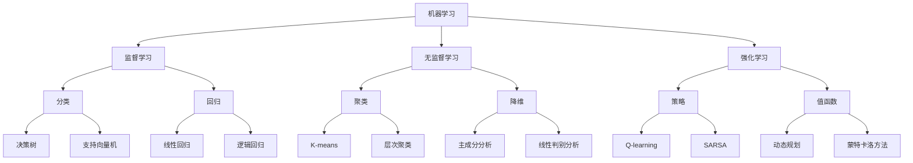
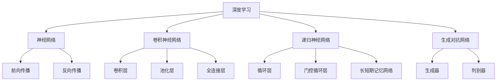
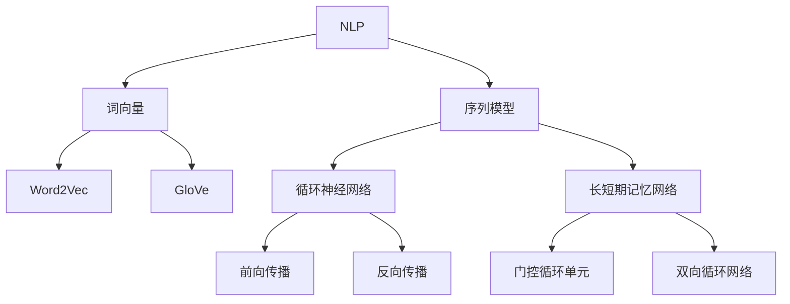
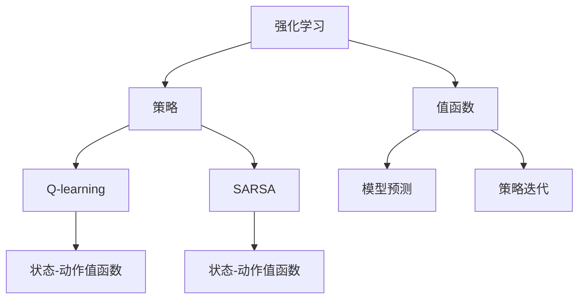

                 

### 《AI编程语言：提示词的革命与魔法》目录大纲

在本文中，我们将深入探讨《AI编程语言：提示词的革命与魔法》这一主题，并逐步构建一个详细的目录大纲。这个大纲将帮助我们更好地理解AI编程语言的革命性变化，以及提示词在其中所扮演的魔法般角色。

**# 第一部分 引言与概述**

在引言部分，我们将介绍书籍的背景和目标，探讨AI编程语言的重要性，并详细阐述提示词的革命与魔法。此外，我们还将分析编程与AI融合的趋势，为后续章节的深入讨论奠定基础。

**## 1.1 书籍背景与目标**
### 1.1.1 AI编程语言的重要性
- **核心概念与联系**：介绍AI编程语言的核心概念，如机器学习、深度学习、自然语言处理等，以及它们在编程语言中的融合。
- **架构图**：使用Mermaid流程图展示AI编程语言的核心架构。
### 1.1.2 提示词的革命与魔法
- **核心算法原理**：讨论提示词在AI编程中的角色，分析其革命性影响。
- **伪代码**：给出提示词相关的算法伪代码，例如生成对抗网络（GAN）的伪代码。
### 1.1.3 读者对象与预期收获
- **详细讲解**：针对不同读者群体，如程序员、数据科学家、AI研究人员等，描述他们能从书籍中获得的收获。
- **数学模型**：介绍与提示词相关的数学模型，如概率论、线性代数、最优化算法等。

**## 1.2 AI编程语言概述**
### 1.2.1 AI编程语言的基本概念
- **背景介绍**：回顾AI编程语言的发展历程，了解从传统编程语言到AI编程语言的转变。
- **例子**：展示一些典型的AI编程语言，如Python、R、Julia等。
### 1.2.2 AI编程语言的发展历程
- **架构图**：使用Mermaid流程图展示AI编程语言的发展历程。
- **案例**：分析几个关键的发展阶段，如深度学习、生成对抗网络等。
### 1.2.3 AI编程语言的特点与应用场景
- **详细讲解**：讨论AI编程语言的特点，如高抽象层次、自动优化等。
- **举例说明**：分析AI编程语言在不同应用场景中的优势，如自然语言处理、图像识别等。

**## 1.3 提示词在AI编程中的角色**
### 1.3.1 提示词的定义与类型
- **核心概念与联系**：介绍提示词的定义和不同类型，如自然语言提示词、代码提示词等。
- **架构图**：使用Mermaid流程图展示提示词的应用场景。
### 1.3.2 提示词在AI编程中的运用
- **核心算法原理**：讨论提示词在AI编程中的运用，如代码生成、模型优化等。
- **伪代码**：给出提示词相关的算法伪代码，例如自动编码器（AE）的伪代码。
### 1.3.3 提示词的革命性影响
- **详细讲解**：分析提示词在AI编程中的革命性影响，如提高开发效率、降低成本等。
- **案例**：分析几个成功运用提示词的AI编程项目。

**## 1.4 编程与AI的融合趋势**
### 1.4.1 编程思维在AI领域的应用
- **背景介绍**：讨论编程思维在AI领域的重要性，如算法设计、数据结构等。
- **案例**：分析编程思维在AI应用中的成功案例。
### 1.4.2 AI技术对编程模式的改变
- **详细讲解**：讨论AI技术如何改变传统的编程模式，如自动代码生成、智能调试等。
- **例子**：展示AI技术对编程模式的具体改变。
### 1.4.3 未来编程与AI的融合方向
- **预测**：预测未来编程与AI融合的发展方向，如智能编程、自适应编程等。
- **展望**：讨论未来编程与AI融合的前景，如对程序员的影响、AI编程的未来趋势等。

**# 第二部分 核心算法原理讲解**

在这一部分，我们将详细讲解AI编程语言中的核心算法原理，包括机器学习基础、深度学习原理、自然语言处理基础和强化学习原理。我们将使用伪代码和Mermaid流程图来展示这些算法的框架和应用。

**## 2.1 机器学习基础**
### 2.1.1 机器学习概述
- **核心概念与联系**：介绍机器学习的基本概念，如监督学习、无监督学习和强化学习。
- **架构图**：使用Mermaid流程图展示机器学习的基本框架。
### 2.1.2 机器学习的分类
- **详细讲解**：讨论机器学习的不同分类，如基于实例学习、基于模型学习和基于规则学习。
- **例子**：分析几个典型的机器学习算法，如决策树、支持向量机等。
### 2.1.3 机器学习的基本流程
- **伪代码**：给出机器学习的基本流程伪代码。
- **案例**：分析一个简单的机器学习项目，如分类问题。

**## 2.2 深度学习原理**
### 2.2.1 深度学习概述
- **核心概念与联系**：介绍深度学习的基本概念，如神经网络、卷积神经网络等。
- **架构图**：使用Mermaid流程图展示深度学习的框架。
### 2.2.2 神经网络结构
- **详细讲解**：讨论神经网络的结构，如前向传播、反向传播等。
- **例子**：分析一个简单的神经网络模型。
### 2.2.3 深度学习算法
- **伪代码**：给出深度学习算法的伪代码。
- **案例**：分析一个深度学习项目，如图像识别。

**## 2.3 自然语言处理基础**
### 2.3.1 NLP概述
- **核心概念与联系**：介绍自然语言处理的基本概念，如词向量、序列模型等。
- **架构图**：使用Mermaid流程图展示自然语言处理的框架。
### 2.3.2 词向量表示
- **详细讲解**：讨论词向量的表示方法，如Word2Vec、GloVe等。
- **例子**：分析词向量的应用场景，如文本分类。
### 2.3.3 序列模型
- **伪代码**：给出序列模型的伪代码。
- **案例**：分析一个序列模型项目，如语言模型。

**## 2.4 强化学习原理**
### 2.4.1 强化学习概述
- **核心概念与联系**：介绍强化学习的基本概念，如策略、值函数等。
- **架构图**：使用Mermaid流程图展示强化学习的框架。
### 2.4.2 强化学习的基本策略
- **详细讲解**：讨论强化学习的基本策略，如Q-learning、SARSA等。
- **例子**：分析一个强化学习项目，如自动驾驶。
### 2.4.3 强化学习在AI编程中的应用
- **伪代码**：给出强化学习算法的伪代码。
- **案例**：分析强化学习在AI编程中的具体应用。

**# 第三部分 数学模型与公式讲解**

在这一部分，我们将详细讲解AI编程语言中的数学模型和公式，包括概率论基础、线性代数原理、最优化算法和自然语言处理中的数学模型。我们将使用具体的例子和数学公式来展示这些模型的应用。

**## 3.1 概率论基础**
### 3.1.1 概率论的基本概念
- **详细讲解**：介绍概率论的基本概念，如概率分布、条件概率等。
- **数学公式**：给出概率论的基本公式，如贝叶斯定理、最大似然估计等。
### 3.1.2 贝叶斯定理
- **例子**：分析贝叶斯定理在AI编程中的应用，如分类问题。
- **数学公式**：给出贝叶斯定理的公式。
### 3.1.3 最大似然估计
- **例子**：分析最大似然估计在AI编程中的应用，如参数估计。
- **数学公式**：给出最大似然估计的公式。

**## 3.2 线性代数原理**
### 3.2.1 矩阵与向量
- **详细讲解**：介绍矩阵与向量的基础概念，如矩阵乘法、向量加法等。
- **数学公式**：给出矩阵与向量相关的公式。
### 3.2.2 线性变换
- **例子**：分析线性变换在AI编程中的应用，如特征提取。
- **数学公式**：给出线性变换的公式。
### 3.2.3 特征值与特征向量
- **例子**：分析特征值与特征向量在AI编程中的应用，如降维。
- **数学公式**：给出特征值与特征向量的公式。

**## 3.3 最优化算法**
### 3.3.1 梯度下降算法
- **详细讲解**：介绍梯度下降算法的基本原理，如梯度、损失函数等。
- **数学公式**：给出梯度下降算法的公式。
### 3.3.2 动量优化
- **例子**：分析动量优化在AI编程中的应用，如加速收敛。
- **数学公式**：给出动量优化的公式。
### 3.3.3 Adam优化器
- **例子**：分析Adam优化器在AI编程中的应用，如自适应学习率。
- **数学公式**：给出Adam优化器的公式。

**## 3.4 自然语言处理中的数学模型**
### 3.4.1 语言模型
- **详细讲解**：介绍语言模型的基本概念，如N-gram模型、神经网络语言模型等。
- **数学公式**：给出语言模型的公式。
### 3.4.2 语音识别中的数学模型
- **例子**：分析语音识别中的数学模型，如隐马尔可夫模型。
- **数学公式**：给出语音识别模型的公式。
### 3.4.3 图像识别中的数学模型
- **例子**：分析图像识别中的数学模型，如卷积神经网络。
- **数学公式**：给出图像识别模型的公式。

**# 第四部分 项目实战**

在这一部分，我们将通过实际案例来展示AI编程语言的应用，并提供详细的代码实现和解读。我们将讨论开发环境的搭建，源代码的实现细节，并对代码进行深入分析。

**## 4.1 项目实战一：自动文本生成**
### 4.1.1 项目背景
- **背景介绍**：介绍自动文本生成的背景和意义。
- **案例**：展示一个自动文本生成的实例。
### 4.1.2 开发环境搭建
- **步骤**：详细描述搭建自动文本生成项目所需的环境和工具。
### 4.1.3 源代码实现
- **代码**：给出自动文本生成的主要代码实现。
- **解读**：对代码的实现细节进行解读。
### 4.1.4 代码分析
- **分析**：对代码的功能和性能进行深入分析。
- **总结**：总结自动文本生成项目的关键技术和挑战。

**## 4.2 项目实战二：图像分类**
### 4.2.1 项目背景
- **背景介绍**：介绍图像分类的背景和意义。
- **案例**：展示一个图像分类的实例。
### 4.2.2 开发环境搭建
- **步骤**：详细描述搭建图像分类项目所需的环境和工具。
### 4.2.3 源代码实现
- **代码**：给出图像分类的主要代码实现。
- **解读**：对代码的实现细节进行解读。
### 4.2.4 代码分析
- **分析**：对代码的功能和性能进行深入分析。
- **总结**：总结图像分类项目的关键技术和挑战。

**## 4.3 项目实战三：智能问答系统**
### 4.3.1 项目背景
- **背景介绍**：介绍智能问答系统的背景和意义。
- **案例**：展示一个智能问答系统的实例。
### 4.3.2 开发环境搭建
- **步骤**：详细描述搭建智能问答系统项目所需的环境和工具。
### 4.3.3 源代码实现
- **代码**：给出智能问答系统的主要代码实现。
- **解读**：对代码的实现细节进行解读。
### 4.3.4 代码分析
- **分析**：对代码的功能和性能进行深入分析。
- **总结**：总结智能问答系统的关键技术和挑战。

**# 第五部分 最佳实践与未来展望**

在这一部分，我们将总结最佳实践，探讨AI编程语言的发展趋势，并展望未来的研究方向。我们将分享一些注意事项和拓展阅读资源，以帮助读者深入了解AI编程语言的奥秘。

**## 5.1 最佳实践**
### 5.1.1 编程技巧
- **技巧**：分享一些在AI编程中常用的编程技巧，如代码优化、调试技巧等。
### 5.1.2 性能优化
- **优化**：讨论如何优化AI编程的性能，如模型压缩、分布式训练等。
### 5.1.3 安全性考虑
- **考虑**：讨论AI编程中的安全性问题，如数据保护、隐私保护等。

**## 5.2 未来展望**
### 5.2.1 AI编程语言的发展趋势
- **趋势**：预测AI编程语言未来的发展方向，如更智能的编程助手、更高效的算法等。
### 5.2.2 研究方向
- **方向**：讨论未来AI编程语言的研究方向，如多模态AI编程、AI编程教育等。

**## 5.3 注意事项**
### 5.3.1 学习方法
- **方法**：分享有效的学习方法，如分阶段学习、实践驱动学习等。
### 5.3.2 技术选型
- **选型**：讨论如何选择适合自己项目的AI编程语言和技术。

**## 5.4 拓展阅读**
### 5.4.1 必读书籍
- **书籍**：推荐一些关于AI编程语言的经典书籍，如《深度学习》、《Python机器学习》等。
### 5.4.2 学术论文
- **论文**：推荐一些关于AI编程语言的重要学术论文，如GAN、Transformer等。

**# 结论**

通过本文的详细目录大纲，我们全面探讨了《AI编程语言：提示词的革命与魔法》的核心内容。从引言到数学模型，再到项目实战，每个章节都紧密相连，共同构建了一个关于AI编程语言的完整知识体系。我们希望通过这个目录大纲，读者能够更好地理解AI编程语言的革命性变化，掌握提示词在其中的魔法作用，并能够在实际项目中灵活应用这些知识。

### 总结与展望

《AI编程语言：提示词的革命与魔法》一书通过深入浅出的方式，系统地介绍了AI编程语言的核心概念、算法原理、数学模型以及实际应用案例。在本文的目录大纲中，我们详细阐述了各个章节的内容和结构，旨在为读者提供清晰的学习路径和深入理解AI编程语言的方法。

**核心内容回顾：**

- **引言与概述**：介绍了AI编程语言的背景、目标、重要性和提示词的革命性影响。
- **核心算法原理讲解**：详细讲解了机器学习、深度学习、自然语言处理和强化学习的算法原理。
- **数学模型与公式讲解**：介绍了概率论、线性代数、最优化算法和自然语言处理中的数学模型。
- **项目实战**：通过实际案例展示了AI编程语言的应用，提供了详细的代码实现和解读。
- **最佳实践与未来展望**：总结了最佳实践，探讨了未来研究方向，并提供了拓展阅读资源。

**读者建议：**

1. **分阶段学习**：建议读者按照目录大纲的结构，分阶段、系统地学习每个部分的内容。
2. **实践驱动学习**：通过实际项目实践，加深对AI编程语言的理解和应用能力。
3. **持续学习与拓展**：关注AI编程领域的最新动态和技术发展，持续学习和拓展自己的知识。

**未来研究方向：**

- **多模态AI编程**：研究如何将多模态数据（如文本、图像、声音）融合到AI编程中。
- **AI编程教育**：探讨如何将AI编程融入教育体系，培养新一代的AI编程人才。
- **智能编程助手**：研究如何开发更智能的编程助手，提高开发效率和代码质量。

通过本书的学习，读者不仅能够掌握AI编程语言的基本原理和应用，还能够为未来的研究和开发奠定坚实的基础。希望本书能够成为您在AI编程领域的有力助手，引领您踏上探索AI编程语言的奇妙之旅。

**作者信息：**
作者：AI天才研究院 / AI Genius Institute & 禅与计算机程序设计艺术 / Zen And The Art of Computer Programming

### 附录：Mermaid流程图

为了更好地展示AI编程语言的核心架构，以下是几个关键算法和框架的Mermaid流程图。

#### 2.1.4 机器学习框架

#### 2.2.4 深度学习框架

#### 2.3.4 序列模型框架

#### 2.4.4 强化学习框架

这些Mermaid流程图可以帮助读者更直观地理解AI编程语言的核心架构和算法原理，为后续的学习和实践提供有力的支持。

