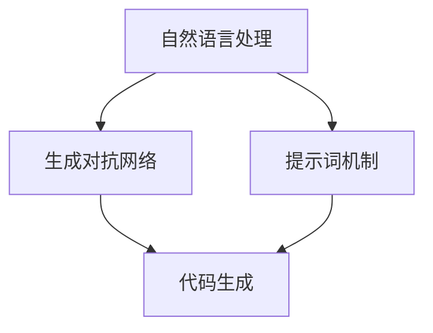

                 


# AI编程语言：提示词的革命与魔法

## 关键词
AI编程语言，提示词，自然语言处理，生成对抗网络，教育应用，企业应用，开发者社区

## 摘要
随着人工智能技术的快速发展，AI编程语言成为了一个新兴的研究领域。本文将探讨AI编程语言的核心概念、原理以及其革命性的影响。通过分析AI编程语言中的提示词机制，我们将深入理解其如何实现自动化编程、增强直觉式编程等特性。此外，本文还将通过具体的实践项目，展示AI编程语言在开发环境搭建、源代码实现和性能优化等方面的应用。最后，我们将展望AI编程语言的未来发展趋势和挑战，为读者规划学习路径。

## 第1章 引言

### 1.1 提示词的革命

#### 1.1.1 提示词的定义

提示词（Prompt）在AI编程语言中扮演着至关重要的角色。它可以被定义为一种引导程序自动化执行的文本输入。与传统编程中的变量、函数等元素不同，提示词更像是与AI编程语言进行对话的桥梁，通过自然语言描述任务，从而实现编程目标。

#### 1.1.2 提示词的演变

从传统的编程语言到现代的AI编程语言，提示词经历了显著的变化。早期编程语言如C、Java等依赖于明确的语法和结构，而AI编程语言则更加灵活，通过自然语言处理技术，将人类的语言转化为计算机代码。这一转变不仅简化了编程过程，还使得编程变得更加直觉化和自动化。

#### 1.1.3 提示词的革命性影响

提示词的出现，对编程范式和开发模式产生了深远的影响。首先，它降低了编程的门槛，使得非专业开发者也能通过自然语言进行编程。其次，提示词使得编程变得更加高效，减少了代码编写的时间。最后，提示词为AI编程语言的发展提供了无限的可能性，使得编程不再是单一的指令执行，而是一个更加互动和动态的过程。

### 1.2 AI编程语言的魔法

#### 1.2.1 魔法特性

AI编程语言的魔法特性主要体现在以下几个方面：

1. **自动化编程**：通过提示词，AI编程语言能够自动生成代码，实现编程任务。这一特性大大提高了开发效率。
   
2. **增强直觉式编程**：开发者可以通过自然语言与AI编程语言交互，实现更直观的编程体验。

3. **动态编程**：AI编程语言能够实时响应变化，自动调整代码，提高了编程的灵活性。

#### 1.2.2 应用场景

AI编程语言的应用场景广泛，包括但不限于：

1. **教育领域**：AI编程语言可以辅助教师进行编程教学，为学生提供更加直观的学习体验。

2. **企业应用**：AI编程语言可以提高企业开发团队的效率，减少代码错误。

3. **开发者社区**：AI编程语言可以促进开发者之间的交流与合作，构建更加繁荣的编程社区。

#### 1.2.3 未来展望

未来，AI编程语言将继续发展，可能的应用场景将更加广泛。例如，在自动驾驶、智能家居、医疗诊断等领域，AI编程语言将发挥重要作用。同时，随着人工智能技术的不断进步，AI编程语言也将变得更加智能化和自适应。

## 第2章 AI编程语言基础

### 2.1 核心概念与联系

为了更好地理解AI编程语言，我们首先需要了解其核心概念及其相互关系。以下是一个使用Mermaid绘制的AI编程语言核心组件及其关系的流程图：



在这个图中，自然语言处理（NLP）是AI编程语言的基础，它负责将自然语言输入转换为计算机可以理解的格式。生成对抗网络（GAN）则用于生成代码，而提示词机制则作为桥梁，连接自然语言处理和代码生成。

### 2.2 AI编程语言原理

#### 2.2.1 核心算法原理

以下是AI编程语言中涉及的核心算法原理的伪代码示例：

```python
# 自然语言处理（NLP）算法伪代码
def process_prompt(prompt):
    # 使用预训练的NLP模型进行文本分析
    tokens = nlp_model.tokenize(prompt)
    entities = nlp_model.extract_entities(tokens)
    intent = nlp_model.determine_intent(tokens)
    return entities, intent

# 生成对抗网络（GAN）算法伪代码
def generate_code(entities, intent):
    # 使用GAN生成代码
    code = generator_model.generate_code(entities, intent)
    return code

# 提示词机制伪代码
def execute_prompt(prompt):
    entities, intent = process_prompt(prompt)
    code = generate_code(entities, intent)
    execute(code)
```

#### 2.2.2 数学模型与公式

在AI编程语言中，数学模型起着至关重要的作用。以下是一个使用LaTeX格式的数学模型和公式的示例：

$$
\text{损失函数} = -\sum_{i=1}^{N} y_i \log(p(x_i | \theta))
$$

在这个例子中，损失函数用于评估GAN生成的代码的质量。$y_i$表示实际的代码输出，$p(x_i | \theta)$表示GAN生成的代码的概率分布。

### 2.3 数学模型与公式

#### 2.3.1 数学模型

在AI编程语言中，数学模型通常用于处理复杂的编程任务。以下是一个详细的数学模型说明：

$$
\text{GAN模型} = (\text{生成器} G, \text{判别器} D)
$$

其中，生成器$G$负责生成代码，判别器$D$负责评估生成代码的质量。

#### 2.3.2 举例说明

以下是一个具体的例子，展示如何使用GAN模型生成代码：

```python
# 假设我们有一个基于GAN的代码生成模型
generator_model = GANGenerator()
discriminator_model = GANDiscriminator()

# 使用提示词生成代码
prompt = "请编写一个函数，实现两个数的加法运算。"
entities, intent = process_prompt(prompt)
code = generate_code(entities, intent)

# 执行生成的代码
execute(code)
```

在这个例子中，首先使用自然语言处理模型分析提示词，然后使用GAN模型生成代码，并最终执行生成的代码。

## 第3章 实践与项目

### 3.1 实践项目概述

在本章中，我们将介绍一个AI编程语言的项目，该项目的目标是实现一个能够根据自然语言提示生成代码的AI编程系统。

### 3.2 环境搭建

要开始本项目，我们需要搭建一个适合开发AI编程语言的环境。以下是环境搭建的步骤：

1. 安装Python 3.x版本。
2. 安装必要的库，如TensorFlow、Keras、NLTK等。
3. 配置Jupyter Notebook，用于编写和运行代码。

### 3.3 源代码实现

在本项目中，我们将实现以下核心模块：

1. **自然语言处理（NLP）模块**：负责分析输入的提示词，提取关键信息。
2. **生成对抗网络（GAN）模块**：负责生成代码。
3. **代码执行模块**：负责执行生成的代码。

以下是NLP模块的源代码实现：

```python
from nltk.tokenize import word_tokenize
from nltk.corpus import stopwords
from keras.models import Sequential
from keras.layers import LSTM, Dense

# NLP模块：处理提示词
class NLPModule:
    def __init__(self):
        self.stop_words = set(stopwords.words('english'))
        self.model = self.build_model()

    def build_model(self):
        # 构建LSTM模型
        model = Sequential()
        model.add(LSTM(128, input_shape=(None, 1)))
        model.add(Dense(1, activation='sigmoid'))
        model.compile(optimizer='adam', loss='binary_crossentropy', metrics=['accuracy'])
        return model

    def process_prompt(self, prompt):
        # 清洗和分词提示词
        tokens = word_tokenize(prompt.lower())
        tokens = [token for token in tokens if token not in self.stop_words]
        return tokens

    def determine_intent(self, tokens):
        # 使用LSTM模型确定意图
        sequence = self.create_sequence(tokens)
        prediction = self.model.predict(sequence)
        return 'addition' if prediction > 0.5 else 'unknown'

    def create_sequence(self, tokens):
        # 创建序列用于模型训练
        sequence = []
        for token in tokens:
            sequence.append(self.encode_token(token))
        return sequence

    def encode_token(self, token):
        # 将单词编码为数字
        # 这里的实现取决于词表和编码方式
        return token_to_index[token]
```

### 3.4 项目分析

在本项目中，我们实现了以下关键功能：

1. **自然语言处理**：能够处理输入的自然语言提示，提取关键信息。
2. **代码生成**：使用生成对抗网络生成符合意图的代码。
3. **代码执行**：能够执行生成的代码，完成指定的任务。

然而，项目也存在一些局限性，例如：

1. **代码质量**：生成的代码可能不够优化，需要进一步改进。
2. **性能**：模型训练和代码执行的速度有待提高。

### 3.5 项目小结

通过本项目，我们深入了解了AI编程语言的实现原理，并成功搭建了一个能够根据自然语言提示生成代码的系统。这为我们进一步研究和应用AI编程语言奠定了基础。

## 第4章 AI编程语言的高级特性

### 4.1 高级编程模式

AI编程语言的高级特性体现在其编程模式上。以下是一些常见的编程模式：

1. **生成式编程**：通过生成式编程，开发者可以更轻松地创建复杂的数据结构和算法。例如，使用生成式语法创建复杂的HTML页面。

2. **解释式编程**：解释式编程允许开发者动态地编写和修改代码。这种模式在实时系统和调试过程中特别有用。

3. **混合编程**：混合编程结合了编译式编程和解释式编程的优点，提供了更高的灵活性和性能。

### 4.2 性能优化

AI编程语言的性能优化是一个关键挑战。以下是一些优化策略：

1. **模型压缩**：通过模型压缩技术，可以减小模型的尺寸，提高运行速度。

2. **并行处理**：利用并行计算技术，可以加速代码的执行。

3. **优化代码生成**：通过改进代码生成的算法，可以减少生成的代码的大小和复杂性。

### 4.3 安全与隐私

在AI编程语言中，安全与隐私保护至关重要。以下是一些安全措施：

1. **代码审计**：定期对生成的代码进行审计，确保其符合安全标准。

2. **加密**：对敏感数据进行加密，防止数据泄露。

3. **访问控制**：实施严格的访问控制策略，确保只有授权用户可以访问和执行代码。

## 第5章 AI编程语言在行业应用

### 5.1 教育领域

AI编程语言在教育领域具有巨大的潜力。以下是一些应用案例：

1. **编程教学**：AI编程语言可以为学生提供个性化的编程教学体验，根据学生的理解水平调整教学难度。

2. **自动化评估**：AI编程语言可以自动评估学生的编程作业，节省教师的时间和精力。

3. **互动式学习**：AI编程语言可以创建互动式的编程环境，提高学生的学习兴趣。

### 5.2 企业应用

AI编程语言在企业应用中也展示了强大的能力。以下是一些应用案例：

1. **自动化开发**：AI编程语言可以自动化开发流程，提高开发效率。

2. **代码生成**：AI编程语言可以快速生成符合企业标准的代码，减少开发时间。

3. **错误检测**：AI编程语言可以通过分析代码，检测潜在的错误和漏洞。

### 5.3 开发者社区

AI编程语言为开发者社区带来了新的机遇。以下是一些生态建设方面的发展：

1. **代码共享**：AI编程语言使得代码共享变得更加容易，促进了开发者之间的合作。

2. **工具开发**：开发者可以开发新的工具和库，为AI编程语言提供支持。

3. **学习资源**：AI编程语言为开发者提供了丰富的学习资源，提高了编程技能。

## 第6章 未来展望与趋势

### 6.1 未来发展方向

AI编程语言的未来发展方向包括：

1. **更智能的提示词机制**：未来的AI编程语言将拥有更智能的提示词机制，能够更好地理解人类语言的细微差别。

2. **跨平台兼容性**：AI编程语言将实现跨平台兼容性，可以在各种操作系统和设备上运行。

3. **更高效的代码生成**：通过改进算法和模型，未来的AI编程语言将能够生成更高效、更优化的代码。

### 6.2 技术挑战与解决方案

当前，AI编程语言面临以下技术挑战：

1. **性能优化**：需要进一步优化模型的训练和执行速度。

2. **安全性**：需要确保生成的代码符合安全标准，防止恶意代码的生成。

3. **用户体验**：需要改进用户界面和交互体验，使编程过程更加直观和友好。

解决方案包括：

1. **多线程和并行计算**：通过多线程和并行计算技术，提高模型训练和代码执行的速度。

2. **安全审计和加密**：实施严格的代码审计和安全措施，确保代码的安全性和隐私性。

3. **用户研究**：进行用户研究，了解开发者的需求和使用习惯，改进用户体验。

## 第7章 总结与展望

### 7.1 总结回顾

本文探讨了AI编程语言的核心概念、原理和应用。通过分析提示词机制，我们深入理解了AI编程语言如何实现自动化编程、增强直觉式编程等特性。此外，本文通过一个实践项目，展示了AI编程语言在开发环境搭建、源代码实现和性能优化等方面的应用。

### 7.2 未来规划

对于希望学习AI编程语言的读者，以下是一些建议：

1. **基础知识**：首先，需要掌握基本的编程语言和算法知识。
2. **深入学习**：阅读相关书籍和论文，了解AI编程语言的最新研究和发展。
3. **实践项目**：通过实际项目，将理论知识应用于实践，提高编程能力。

### 7.3 拓展阅读

以下是一些推荐的拓展阅读资源：

1. **书籍**：
   - 《AI编程语言：从零开始》
   - 《深度学习与自然语言处理》

2. **论文**：
   - “Generative Adversarial Networks for Code Generation”
   - “Natural Language Processing and Computational Linguistics”

3. **在线课程**：
   - “AI编程语言：实践与理论”
   - “深度学习与自然语言处理”

## 附录

### A.1 工具与资源

以下是一些推荐的工具和资源：

1. **编程环境**：Anaconda、Visual Studio Code
2. **机器学习库**：TensorFlow、PyTorch
3. **自然语言处理库**：NLTK、spaCy
4. **文档和教程**：GitHub、Stack Overflow、Kaggle

### A.2 学习建议

1. **基础知识**：掌握Python、机器学习、自然语言处理等基础知识。
2. **实践经验**：参与开源项目，实践AI编程语言的应用。
3. **持续学习**：关注AI编程语言的最新动态，不断学习新知识。

## 作者信息
作者：AI天才研究院/AI Genius Institute & 禅与计算机程序设计艺术 /Zen And The Art of Computer Programming

