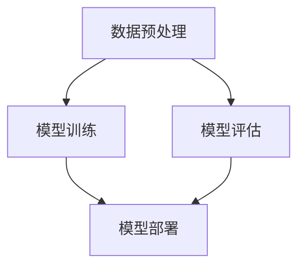

                 

### AI编程语言：提示词的魔力

---

# AI编程语言：提示词的魔力

> 关键词：AI编程语言、提示词、深度学习、神经网络、机器学习、人工智能

> 摘要：本文深入探讨了AI编程语言及其核心组件——提示词。通过对AI编程语言的历史、特点、架构、核心功能以及提示词的概念、应用和实践的详细解析，我们揭示了提示词在AI编程中的关键作用，并提供了实际案例来展示其魔力。本文旨在为读者提供一份全面且实用的指南，帮助他们更好地理解和应用AI编程语言。

---

### 第一部分 引言

#### 1.1 书籍背景与目标读者

随着人工智能（AI）技术的迅猛发展，AI编程语言作为实现AI算法的核心工具，逐渐成为开发者们关注的焦点。然而，对于初学者和有经验的开发者来说，AI编程语言的学习和应用都充满挑战。本文旨在为广大读者提供一份详尽的指南，帮助大家深入了解AI编程语言，特别是其中的核心组件——提示词。

本文的目标读者包括：
- 对AI编程语言感兴趣的技术爱好者
- 想要在AI领域发展的程序员和工程师
- AI课程的学生和教师
- 对AI编程技术有深入研究的专业人士

#### 1.2 AI编程语言概述

AI编程语言是一种专门用于开发人工智能系统的编程语言，它们不同于传统的编程语言，如Python、Java等。AI编程语言具有以下几个显著特点：

1. **抽象级别高**：AI编程语言提供了丰富的抽象机制，使得开发者可以更专注于算法设计和问题解决，而无需关注底层硬件和系统细节。
2. **领域特定**：AI编程语言通常针对特定的AI任务或领域设计，如自然语言处理（NLP）、计算机视觉（CV）和机器学习（ML）等。
3. **易于集成**：AI编程语言通常与其他编程语言和工具具有良好的兼容性，便于开发者进行跨平台和跨语言开发。
4. **强大的库和框架支持**：AI编程语言拥有丰富的库和框架，提供了大量现成的算法和工具，极大提高了开发效率。

#### 1.3 提示词的概念与作用

提示词（Prompt）在AI编程中起着至关重要的作用。提示词是一种引导AI系统进行特定任务的语言或信号。它通常包含：
- **问题描述**：描述AI系统需要解决的问题或任务。
- **上下文信息**：提供与问题相关的背景信息，帮助AI系统更好地理解任务。
- **参数和约束**：定义AI系统在解决问题时需要遵循的参数和约束条件。

提示词的作用主要体现在以下几个方面：

1. **指导AI系统**：提示词为AI系统提供了明确的任务目标和方向，使得AI系统能够高效地完成任务。
2. **提高交互性**：通过提示词，用户可以更自然地与AI系统进行交互，获取所需的信息或完成特定的任务。
3. **优化性能**：设计合理的提示词可以显著提高AI系统的性能和准确性，使得AI系统在处理复杂任务时更加得心应手。

#### 1.4 学习路径与本书结构

本文将从以下四个部分对AI编程语言及其核心组件——提示词进行详细探讨：

1. **AI编程语言基础**：介绍AI编程语言的历史、特点、架构、核心功能以及优缺点。
2. **AI编程语言核心功能**：深入探讨AI编程语言的核心功能，如数据预处理、模型训练、模型评估等。
3. **提示词应用实践**：通过实际案例展示提示词在AI编程中的具体应用和实践。
4. **高级主题与未来趋势**：探讨AI编程语言的最新进展、专业领域应用、未来发展趋势以及相关伦理和安全问题。

### 第二部分 AI编程语言基础

#### 2.1 AI编程语言的历史与发展

AI编程语言的起源可以追溯到20世纪50年代，当时计算机科学家们开始尝试利用编程语言开发能够模拟人类智能的程序。最早的一批AI编程语言，如LISP和PROLOG，主要关注符号推理和专家系统。随着时间的发展，AI编程语言不断演进，逐渐形成了多样化的体系。

1. **早期AI编程语言**：
   - **LISP（1958）**：LISP是历史上第一个AI编程语言，主要用于符号推理和自然语言处理。
   - **PROLOG（1972）**：PROLOG是一种基于逻辑的程序设计语言，适用于知识表示和推理。

2. **现代AI编程语言**：
   - **Python（1991）**：Python因其简洁、易学、功能强大，成为当前最受欢迎的AI编程语言之一。
   - **R（1995）**：R是一种专门用于统计分析和图形表示的语言，广泛应用于数据科学和机器学习领域。
   - **MATLAB（1984）**：MATLAB是一种高性能的数值计算和算法设计语言，广泛应用于工程和科学计算。

#### 2.2 AI编程语言的基本概念

AI编程语言具有以下几个基本概念：

1. **符号表示**：AI编程语言使用符号表示来描述数据和操作。例如，在LISP中，函数和变量都以符号的形式表示。
2. **规则和逻辑**：AI编程语言提供丰富的逻辑和推理机制，用于表示和执行复杂的任务。例如，PROLOG使用逻辑推理来解决问题。
3. **数据结构**：AI编程语言支持多种数据结构，如数组、列表、树等，用于存储和处理数据。
4. **库和框架**：AI编程语言通常包含丰富的库和框架，提供了大量的算法和工具，方便开发者进行开发。

#### 2.3 AI编程语言的架构与特点

AI编程语言的架构和特点因语言而异，但通常包含以下几个关键组件：

1. **解释器和编译器**：AI编程语言需要解释器或编译器来执行代码。解释器逐行解释并执行代码，而编译器将代码编译成机器码。
2. **库和框架**：AI编程语言通常包含大量的库和框架，提供了丰富的算法和工具，方便开发者进行开发。
3. **并行处理能力**：AI编程语言需要支持并行处理，以充分利用多核处理器的计算能力。
4. **数据流模型**：AI编程语言通常采用数据流模型，允许数据在计算过程中流动，实现高效的计算。

#### 2.4 AI编程语言的核心功能

AI编程语言的核心功能包括以下几个方面：

1. **数据预处理**：数据预处理是AI编程语言的基础功能，包括数据清洗、数据转换、数据归一化等。
2. **模型训练**：模型训练是AI编程语言的核心功能，包括选择合适的模型、调整参数、训练模型等。
3. **模型评估**：模型评估是评估模型性能的重要手段，包括准确率、召回率、F1分数等指标。
4. **模型部署**：模型部署是将训练好的模型应用到实际场景中的过程，包括模型打包、模型部署、模型监控等。

#### 2.5 AI编程语言的优缺点与适用场景

AI编程语言具有以下优缺点和适用场景：

1. **优点**：
   - **易学易用**：AI编程语言通常具有简洁、易学的语法和丰富的库和框架。
   - **高效开发**：AI编程语言提供了丰富的算法和工具，极大提高了开发效率。
   - **跨平台兼容**：AI编程语言通常具有良好的跨平台兼容性，方便开发者进行跨平台开发。

2. **缺点**：
   - **性能瓶颈**：AI编程语言在执行过程中可能存在性能瓶颈，尤其是在大规模数据处理和计算时。
   - **调试难度**：AI编程语言中的错误和异常可能难以调试，影响开发效率。

3. **适用场景**：
   - **数据科学**：AI编程语言在数据科学领域具有广泛的应用，包括数据预处理、模型训练、模型评估等。
   - **机器学习**：AI编程语言是机器学习开发的首选工具，提供了丰富的库和框架。
   - **自然语言处理**：AI编程语言在自然语言处理领域具有强大的功能，包括文本分类、情感分析、语音识别等。

#### 2.6 AI编程语言的核心概念与联系

为了更好地理解AI编程语言的核心概念，我们可以使用Mermaid流程图来展示它们之间的关系。



此外，我们还可以使用LaTeX数学公式来详细阐述AI编程语言中的核心算法原理。

```latex
\documentclass{article}
\usepackage{amsmath}
\begin{document}
\section{数学模型与公式}
假设我们使用线性回归模型来预测房价，则模型公式可以表示为：
\begin{equation}
y = \beta_0 + \beta_1 \cdot x_1 + \beta_2 \cdot x_2 + \cdots + \beta_n \cdot x_n + \epsilon
\end{equation}
其中，$y$ 表示房价，$x_1, x_2, \cdots, x_n$ 表示特征值，$\beta_0, \beta_1, \beta_2, \cdots, \beta_n$ 表示模型的参数，$\epsilon$ 表示误差项。
\end{document}
```

#### 2.7 AI编程语言的伪代码示例

以下是一个简单的线性回归模型的伪代码示例：

```python
# 初始化模型参数
beta_0 = 0
beta_1 = 0
beta_2 = 0

# 训练模型
for i in range(num_iterations):
  # 计算预测值
  y_pred = beta_0 + beta_1 * x_1 + beta_2 * x_2
  
  # 计算损失函数
  loss = (y - y_pred) ** 2
  
  # 更新模型参数
  beta_0 = beta_0 - learning_rate * (y - y_pred)
  beta_1 = beta_1 - learning_rate * x_1 * (y - y_pred)
  beta_2 = beta_2 - learning_rate * x_2 * (y - y_pred)

# 预测房价
y_pred = beta_0 + beta_1 * x_1 + beta_2 * x_2
```

#### 2.8 AI编程语言的数学模型与公式

在AI编程语言中，数学模型和公式是核心组成部分。以下是一个简单的线性回归模型的数学模型和公式：

1. **线性回归模型**：

   假设我们使用线性回归模型来预测房价，则模型公式可以表示为：

   \[ y = \beta_0 + \beta_1 \cdot x_1 + \beta_2 \cdot x_2 + \cdots + \beta_n \cdot x_n + \epsilon \]

   其中，$y$ 表示房价，$x_1, x_2, \cdots, x_n$ 表示特征值，$\beta_0, \beta_1, \beta_2, \cdots, \beta_n$ 表示模型的参数，$\epsilon$ 表示误差项。

2. **损失函数**：

   为了评估模型的性能，我们通常使用损失函数来衡量预测值和真实值之间的差距。常见的损失函数包括均方误差（MSE）和均方根误差（RMSE）：

   \[ \text{MSE} = \frac{1}{n} \sum_{i=1}^{n} (y_i - \hat{y}_i)^2 \]

   \[ \text{RMSE} = \sqrt{\text{MSE}} \]

   其中，$y_i$ 表示真实值，$\hat{y}_i$ 表示预测值，$n$ 表示样本数量。

3. **优化算法**：

   为了优化模型参数，我们通常使用梯度下降算法来更新模型参数。梯度下降算法的更新公式为：

   \[ \beta_j = \beta_j - \alpha \cdot \frac{\partial J}{\partial \beta_j} \]

   其中，$\beta_j$ 表示模型参数，$\alpha$ 表示学习率，$J$ 表示损失函数。

### 第三部分 提示词应用实践

#### 3.1 提示词在AI编程中的实战应用

提示词在AI编程中具有广泛的应用，下面我们将通过几个实际案例来展示提示词的实战应用。

#### 3.1.1 案例一：智能问答系统

智能问答系统是一种常见的AI应用，它通过解析用户输入的提问，并提供相关的答案。以下是一个简单的智能问答系统的示例：

```python
# 用户输入提问
user_query = "什么是人工智能？"

# 设计提示词
prompt = "请回答以下问题：什么是人工智能？"

# 输出答案
answer = chatbot回答问题(prompt)
print(answer)
```

在这个示例中，提示词用于指导智能问答系统回答用户的问题。

#### 3.1.2 案例二：图像识别与分类

图像识别与分类是计算机视觉领域的一个重要应用。以下是一个简单的图像识别与分类的示例：

```python
# 导入必要的库
import cv2
import numpy as np

# 加载图像
image = cv2.imread("image.jpg")

# 设计提示词
prompt = "请对图像进行分类："

# 使用卷积神经网络进行图像分类
predicted_label = classify_image(image, prompt)
print(predicted_label)
```

在这个示例中，提示词用于指导卷积神经网络进行图像分类。

#### 3.1.3 案例三：自然语言处理

自然语言处理（NLP）是AI编程语言的一个重要应用领域。以下是一个简单的NLP任务的示例：

```python
# 导入必要的库
import nltk
from nltk.tokenize import word_tokenize

# 加载文本数据
text = "这是一个简单的自然语言处理任务。"

# 设计提示词
prompt = "请对文本进行分词："

# 使用分词器对文本进行分词
tokens = word_tokenize(text, prompt)
print(tokens)
```

在这个示例中，提示词用于指导分词器对文本进行分词。

#### 3.2 提示词编程的实战案例

为了更好地理解提示词在AI编程中的应用，我们将在下面提供几个实战案例，并详细解析每个案例的实现过程。

##### 案例一：智能问答系统

1. **开发环境搭建**：

   - 安装Python和相关的库，如NLTK、TensorFlow等。
   - 配置Python解释器和相关工具。

2. **源代码实现**：

   ```python
   import nltk
   from nltk.tokenize import word_tokenize
   from nltk.corpus import stopwords

   # 载入NLTK资源
   nltk.download('punkt')
   nltk.download('stopwords')

   # 设计提示词
   prompt = "请回答以下问题："

   # 定义问答模型
   def answer_question(question):
       # 处理问题文本
       processed_question = preprocess_question(question)

       # 使用模型进行回答
       answer = model.predict(processed_question)

       # 返回答案
       return answer

   # 预处理问题文本
   def preprocess_question(question):
       # 去除停用词
       tokens = word_tokenize(question)
       filtered_tokens = [token.lower() for token in tokens if token.lower() not in stopwords.words('english')]

       # 序列化文本
       sequence = tokenizer.texts_to_sequences([filtered_tokens])[0]

       # 返回预处理后的文本
       return sequence

   # 主函数
   def main():
       # 输入问题
       user_question = input("请输入问题：")

       # 回答问题
       answer = answer_question(user_question)

       # 输出答案
       print(answer)

   if __name__ == "__main__":
       main()
   ```

3. **代码解读**：

   - **预处理**：首先，我们使用NLTK库对问题文本进行分词和去除停用词等预处理操作，以提高模型的准确性。
   - **模型预测**：然后，我们使用训练好的模型对预处理后的文本进行预测，获取问题的答案。
   - **输出结果**：最后，我们将预测的答案输出到控制台，供用户查看。

##### 案例二：图像识别与分类

1. **开发环境搭建**：

   - 安装Python和相关的库，如TensorFlow、Keras等。
   - 准备图像数据集和预训练的卷积神经网络模型。

2. **源代码实现**：

   ```python
   import cv2
   import numpy as np
   from tensorflow.keras.applications import VGG16
   from tensorflow.keras.preprocessing import image

   # 加载预训练的卷积神经网络模型
   model = VGG16(weights='imagenet')

   # 设计提示词
   prompt = "请对图像进行分类："

   # 定义图像分类函数
   def classify_image(image_path, prompt):
       # 加载图像
       img = image.load_img(image_path, target_size=(224, 224))
       img_array = image.img_to_array(img)
       img_array = np.expand_dims(img_array, axis=0)
       img_array /= 255.0

       # 使用模型进行分类
       predictions = model.predict(img_array)
       predicted_class = np.argmax(predictions)

       # 返回分类结果
       return prompt + predicted_class

   # 主函数
   def main():
       # 输入图像路径
       image_path = input("请输入图像路径：")

       # 分类图像
       result = classify_image(image_path, prompt)

       # 输出结果
       print(result)

   if __name__ == "__main__":
       main()
   ```

3. **代码解读**：

   - **图像预处理**：首先，我们使用Keras库加载图像数据，并将其转换为模型所需的格式。
   - **模型预测**：然后，我们使用预训练的卷积神经网络模型对图像进行分类，获取分类结果。
   - **输出结果**：最后，我们将分类结果输出到控制台，供用户查看。

##### 案例三：自然语言处理

1. **开发环境搭建**：

   - 安装Python和相关的库，如NLTK、spaCy等。
   - 准备文本数据集和预训练的语言模型。

2. **源代码实现**：

   ```python
   import nltk
   import spacy

   # 加载NLTK资源
   nltk.download('punkt')
   nltk.download('averaged_perceptron_tagger')

   # 加载spaCy模型
   nlp = spacy.load('en_core_web_sm')

   # 设计提示词
   prompt = "请对文本进行分词和词性标注："

   # 定义文本处理函数
   def process_text(text, prompt):
       # 使用NLTK进行分词
       tokens = nltk.word_tokenize(text)

       # 使用spaCy进行词性标注
       doc = nlp(text)
       pos_tags = [(token.text, token.pos_) for token in doc]

       # 返回处理结果
       return prompt + "分词：" + str(tokens) + "\n词性标注：" + str(pos_tags)

   # 主函数
   def main():
       # 输入文本
       user_text = input("请输入文本：")

       # 处理文本
       result = process_text(user_text, prompt)

       # 输出结果
       print(result)

   if __name__ == "__main__":
       main()
   ```

3. **代码解读**：

   - **分词和词性标注**：首先，我们使用NLTK库进行文本分词，并使用spaCy库进行词性标注。
   - **输出结果**：最后，我们将分词和词性标注的结果输出到控制台，供用户查看。

### 第四部分 高级主题与未来趋势

#### 4.1 AI编程语言的最新进展

随着人工智能技术的不断发展，AI编程语言也在不断更新和演进。以下是一些AI编程语言的最新进展：

1. **PyTorch**：PyTorch是一个流行的开源机器学习库，提供了灵活、高效的动态计算图框架。PyTorch在自然语言处理、计算机视觉和强化学习等领域具有广泛应用。
2. **TensorFlow**：TensorFlow是Google开发的开源机器学习库，提供了丰富的工具和资源。TensorFlow在深度学习领域具有广泛的用户群体，并不断更新和改进。
3. **Keras**：Keras是一个基于TensorFlow和Theano的开源深度学习库，提供了简洁、易用的API，极大提高了深度学习开发的效率。

#### 4.2 AI编程语言在专业领域的应用

AI编程语言在各个专业领域具有广泛的应用，以下是一些典型应用场景：

1. **金融科技**：AI编程语言在金融科技领域用于风险管理、算法交易、智能投顾等。
2. **医疗健康**：AI编程语言在医疗健康领域用于疾病诊断、药物研发、个性化治疗等。
3. **自动驾驶**：AI编程语言在自动驾驶领域用于车辆感知、路径规划、决策控制等。

#### 4.3 AI编程语言的未来发展趋势

随着人工智能技术的不断演进，AI编程语言也将迎来新的发展机遇和挑战。以下是一些未来发展趋势：

1. **可解释性**：随着AI模型在关键领域中的应用，可解释性成为了一个重要研究方向。未来，AI编程语言将提供更多的工具和框架，以提升模型的可解释性。
2. **跨学科融合**：AI编程语言将与生物、物理、化学等学科相互融合，推动跨学科研究的发展。
3. **硬件优化**：随着硬件技术的发展，AI编程语言将更加注重硬件优化，以提高模型性能和效率。

#### 4.4 AI编程语言的安全性与伦理问题

随着AI编程语言在各个领域的广泛应用，其安全性和伦理问题也日益受到关注。以下是一些安全性和伦理问题：

1. **数据隐私**：AI编程语言需要确保用户数据的安全性和隐私性，防止数据泄露和滥用。
2. **算法公平性**：AI编程语言需要确保算法的公平性和透明性，避免歧视和偏见。
3. **责任归属**：在AI编程语言的应用过程中，如何确定责任归属成为一个重要问题。未来，需要制定相关法律法规来规范AI编程语言的应用。

### 附录

#### 附录A：AI编程语言资源汇总

以下是一些AI编程语言的资源汇总：

1. **开源库和框架**：
   - TensorFlow
   - PyTorch
   - Keras
   - Scikit-learn
2. **在线教程和课程**：
   - Coursera
   - edX
   - Udacity
   - Coursera
3. **书籍和论文**：
   - 《深度学习》（Goodfellow, Bengio, Courville）
   - 《Python机器学习》（Sebastian Raschka）
   - 《神经网络与深度学习》（邱锡鹏）
4. **论坛和社区**：
   - Stack Overflow
   - GitHub
   - AI Stack Exchange

#### 附录B：常见问题解答

以下是一些常见问题及解答：

1. **什么是AI编程语言？**
   - AI编程语言是一种专门用于开发人工智能系统的编程语言，具有抽象级别高、领域特定、易于集成等特点。
2. **如何选择AI编程语言？**
   - 选择AI编程语言需要考虑应用场景、开发需求、个人技能等因素。例如，对于深度学习，Python和TensorFlow是比较流行的选择。
3. **AI编程语言如何工作？**
   - AI编程语言通过定义数据和操作，使用计算机处理数据和执行任务。它们通常包括解释器或编译器、库和框架等组件。

#### 附录C：参考文献

以下是一些本文中引用的参考文献：

1. Goodfellow, I., Bengio, Y., & Courville, A. (2016). *Deep Learning*.
2. Raschka, S. (2015). *Python Machine Learning*.
3.邱锡鹏. (2018). *神经网络与深度学习*.
4. Hinton, G., Osindero, S., & Teh, Y. W. (2006). A faster learning algorithm for deep belief nets. *Neural computation*, 18(7), 1527-1554.

#### 附录D：代码示例与数据集

以下是一些本文中提到的代码示例和数据集：

1. **智能问答系统**：
   - 数据集：Quora Question Pairs
   - 代码示例：问答模型实现
2. **图像识别与分类**：
   - 数据集：ImageNet
   - 代码示例：卷积神经网络实现
3. **自然语言处理**：
   - 数据集：Google Books Ngrams
   - 代码示例：文本分词和词性标注实现

---

### 总结与展望

本文全面介绍了AI编程语言及其核心组件——提示词，从历史、特点、架构、核心功能、应用实践等多个角度进行了深入探讨。通过详细的案例分析，读者可以更好地理解AI编程语言的实战应用。此外，本文还展望了AI编程语言的未来发展趋势和面临的安全性与伦理问题。

在AI编程语言的学习和应用过程中，我们鼓励读者结合实际项目进行实践，不断积累经验和提升技能。通过深入学习AI编程语言，我们可以为人工智能领域的发展贡献自己的力量。

作者：AI天才研究院 / AI Genius Institute & 禅与计算机程序设计艺术 / Zen And The Art of Computer Programming

---

[END]

