                 

### 文章标题

《AI编程语言：提示词的魔力》

### 关键词

AI编程语言、提示词、Prompt Engineering、自然语言处理、机器学习、深度学习、计算机视觉、算法原理、项目实战

### 摘要

本文旨在探讨AI编程语言中提示词（Prompt Engineering）的重要性及其在设计与应用中的策略。我们将从AI编程语言的基本概念出发，深入分析提示词的定义、设计原则、应用场景和优化策略。此外，本文还将探讨现代AI编程语言的特性，以及在不同AI领域中的应用，通过实际项目案例来展示提示词的实际应用和效果。最后，我们将总结最佳实践，并提供相关拓展阅读。

---

### 第一部分: AI编程语言概述

#### 第1章 AI编程语言入门

##### 1.1 AI编程语言的历史与演变

AI编程语言的发展可以追溯到20世纪50年代，当时计算机科学家开始尝试使用编程语言来模拟人类思维。随着时间的推移，AI编程语言逐渐从通用编程语言中独立出来，成为专门用于构建AI系统的工具。这一章节将介绍AI编程语言的历史、演变过程以及其在现代人工智能中的应用。

**核心概念与联系**

- AI编程语言：一种专门用于开发人工智能系统的编程语言。
- 人工智能：模拟、延伸和扩展人的智能的理论、方法、技术及应用。

**Mermaid流程图**

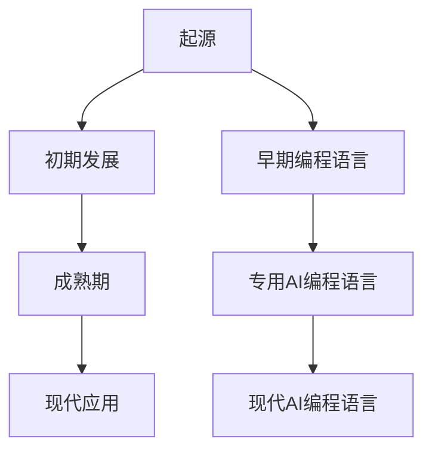

##### 1.2 AI编程语言的分类与特点

AI编程语言可以根据其设计目的和应用领域进行分类。常见的AI编程语言包括面向机器学习的语言、面向自然语言处理的语言、面向计算机视觉的语言等。这一章节将详细介绍这些编程语言的分类和特点，帮助读者理解不同AI编程语言的优势和应用场景。

**核心概念与联系**

- 机器学习编程语言：用于开发机器学习模型的语言，如Python、R等。
- 自然语言处理编程语言：用于处理自然语言数据的语言，如Python、Prolog等。
- 计算机视觉编程语言：用于开发计算机视觉应用的语言，如Python、MATLAB等。

**Mermaid流程图**

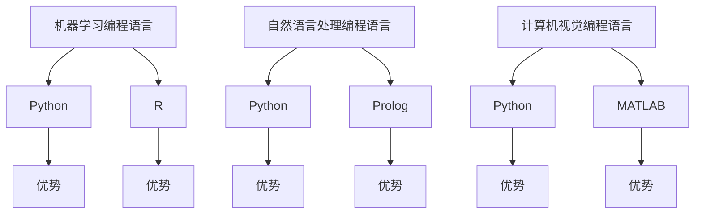

##### 1.3 AI编程语言的应用领域

AI编程语言在各个领域都有广泛的应用。这一章节将介绍AI编程语言在机器学习、自然语言处理、计算机视觉、强化学习等领域的应用，以及在这些领域中的具体案例。

**核心概念与联系**

- 机器学习：一种人工智能的分支，通过训练模型来实现数据的自动分析和决策。
- 自然语言处理：计算机科学领域的一个分支，旨在使计算机能够理解、生成和回应自然语言。
- 计算机视觉：研究如何使计算机能够像人类一样“看”和“理解”周围的世界。
- 强化学习：一种机器学习范式，通过与环境交互来学习最优策略。

**Mermaid流程图**

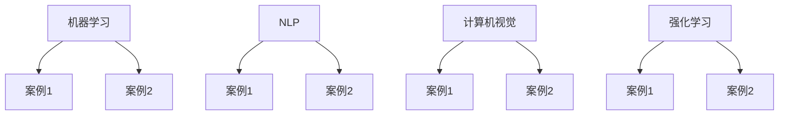

#### 第2章 提示词的基本原理

##### 2.1 提示词的定义与作用

提示词是一种引导AI模型进行特定任务的语言提示。通过设计合适的提示词，可以提高AI模型的训练效率、预测准确性和泛化能力。这一章节将介绍提示词的定义、作用以及其与AI模型之间的关系。

**核心概念与联系**

- 提示词：一种用于引导AI模型的语言提示。
- AI模型：用于实现人工智能任务的数学模型。

**Mermaid流程图**

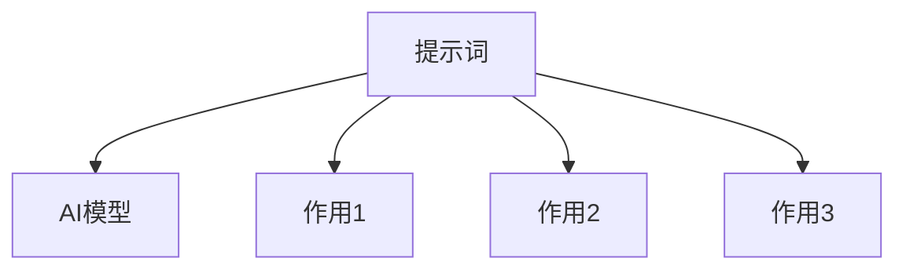

##### 2.2 提示词的设计原则

设计有效的提示词需要遵循一定的原则。这些原则包括清晰性、完整性、精确性和可扩展性。这一章节将详细介绍这些设计原则，并提供实际案例来展示如何应用这些原则。

**核心概念与联系**

- 清晰性：提示词应清晰明了，避免歧义。
- 完整性：提示词应包含必要的信息，确保AI模型能够充分理解任务。
- 精确性：提示词应准确表达任务要求，避免过度泛化或模糊化。
- 可扩展性：提示词应具有一定的灵活性，以便在新的任务或环境中进行扩展。

**Mermaid流程图**

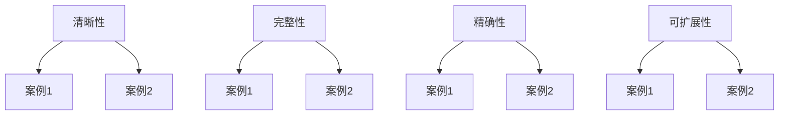

##### 2.3 提示词的应用场景

提示词在不同AI任务中的应用场景各不相同。这一章节将介绍提示词在机器学习、自然语言处理、计算机视觉等领域的应用场景，并提供实际案例来展示提示词的应用效果。

**核心概念与联系**

- 机器学习：提示词用于指导模型的训练过程，提高训练效果。
- 自然语言处理：提示词用于引导模型理解自然语言任务，提高模型的表现。
- 计算机视觉：提示词用于指导模型进行图像识别和分类任务。

**Mermaid流程图**

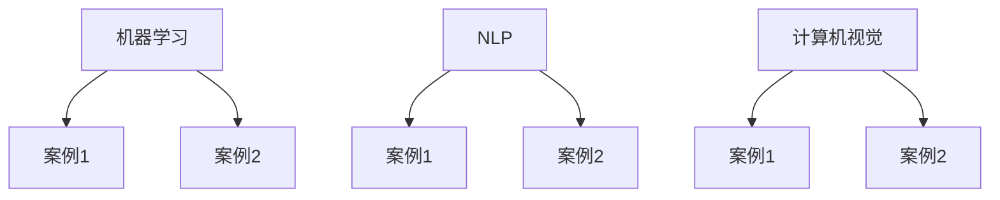

##### 2.4 提示词的实验与优化

提示词的实验与优化是提高AI模型性能的关键步骤。这一章节将介绍如何设计提示词实验，如何评估提示词的效果，以及如何通过优化策略来提高提示词的性能。

**核心概念与联系**

- 实验设计：通过设计不同类型的提示词实验，比较它们对AI模型性能的影响。
- 评估方法：使用评估指标来衡量提示词的效果，如准确率、召回率、F1分数等。
- 优化策略：通过迭代和优化来改进提示词，提高AI模型的性能。

**Mermaid流程图**

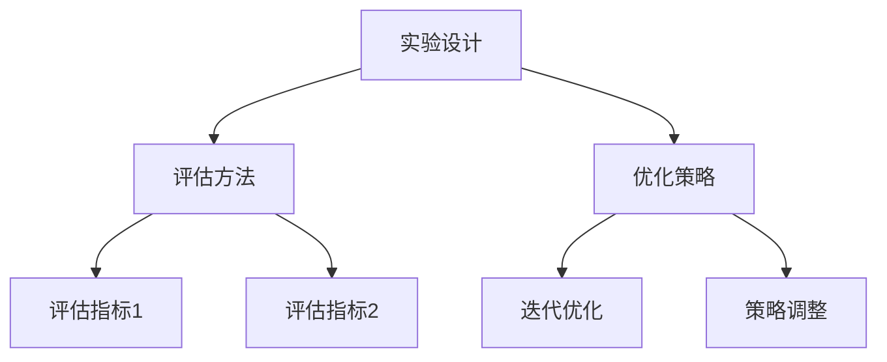

#### 第3章 现代AI编程语言特性

##### 3.1 深度学习与AI编程语言

深度学习是人工智能的一个重要分支，它依赖于大规模的神经网络模型。现代AI编程语言为深度学习的开发提供了丰富的工具和库。这一章节将介绍深度学习的基本原理、常见框架以及其在AI编程中的应用。

**核心概念与联系**

- 深度学习：一种基于多层神经网络的学习方法。
- AI编程语言：用于实现深度学习模型的语言，如Python、C++等。

**Mermaid流程图**

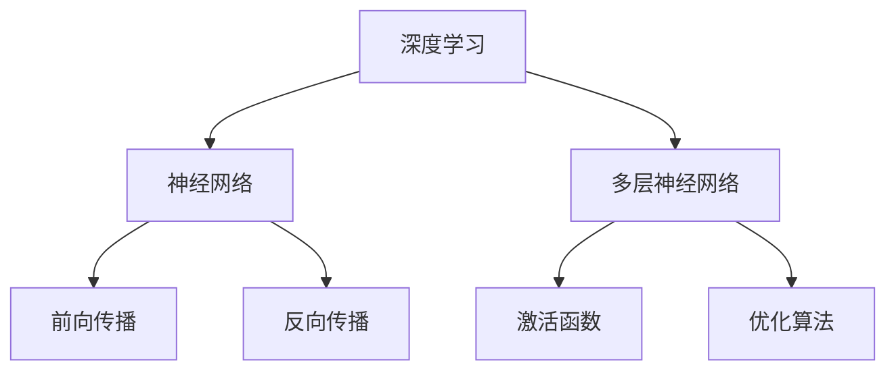

##### 3.2 强化学习与AI编程语言

强化学习是一种通过试错来学习最优策略的机器学习方法。现代AI编程语言提供了丰富的工具和库来支持强化学习模型的开发。这一章节将介绍强化学习的基本原理、常见算法以及其在AI编程中的应用。

**核心概念与联系**

- 强化学习：一种基于试错的学习方法。
- AI编程语言：用于实现强化学习模型的语言，如Python、C++等。

**Mermaid流程图**

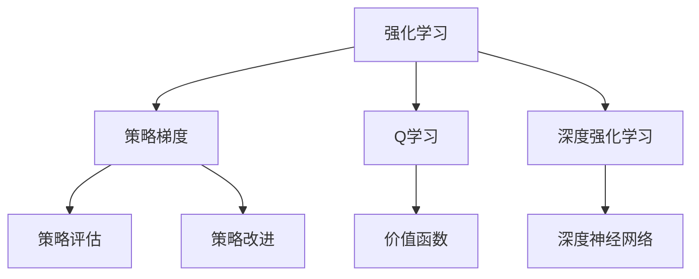

##### 3.3 自然语言处理与AI编程语言

自然语言处理是人工智能的一个重要分支，它涉及到对自然语言的理解和生成。现代AI编程语言提供了丰富的工具和库来支持自然语言处理任务的实现。这一章节将介绍自然语言处理的基本原理、常见任务以及其在AI编程中的应用。

**核心概念与联系**

- 自然语言处理：对自然语言的理解和生成。
- AI编程语言：用于实现自然语言处理任务的语言，如Python、Java等。

**Mermaid流程图**

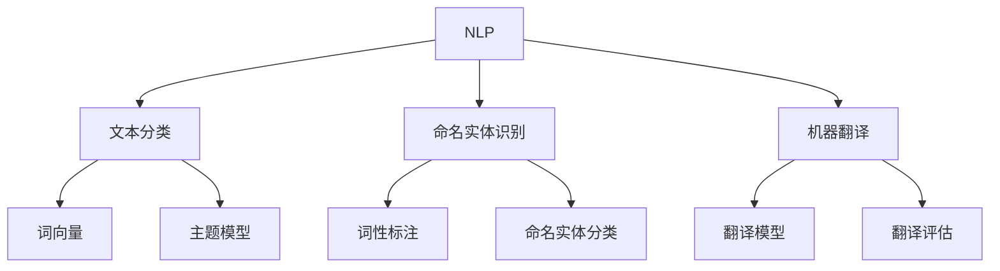

##### 3.4 计算机视觉与AI编程语言

计算机视觉是人工智能的另一个重要分支，它涉及到图像和视频数据的处理和分析。现代AI编程语言提供了丰富的工具和库来支持计算机视觉任务的实现。这一章节将介绍计算机视觉的基本原理、常见任务以及其在AI编程中的应用。

**核心概念与联系**

- 计算机视觉：图像和视频数据的处理和分析。
- AI编程语言：用于实现计算机视觉任务的语言，如Python、C++等。

**Mermaid流程图**

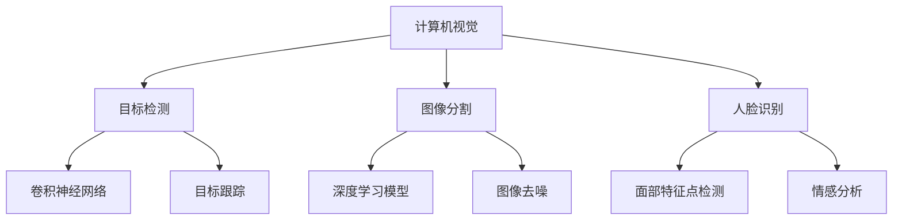

#### 第4章 提示词在不同AI领域的应用

##### 4.1 机器学习中的提示词应用

在机器学习中，提示词可以用于指导模型的训练过程，提高模型的性能。这一章节将介绍提示词在机器学习中的应用，包括如何设计有效的提示词、如何评估提示词的效果以及如何优化提示词。

**核心概念与联系**

- 机器学习：提示词用于指导模型的训练过程。
- 提示词设计：根据任务需求设计有效的提示词。
- 提示词评估：评估提示词的效果，选择最优的提示词。
- 提示词优化：通过迭代和优化提高提示词的性能。

**Mermaid流程图**

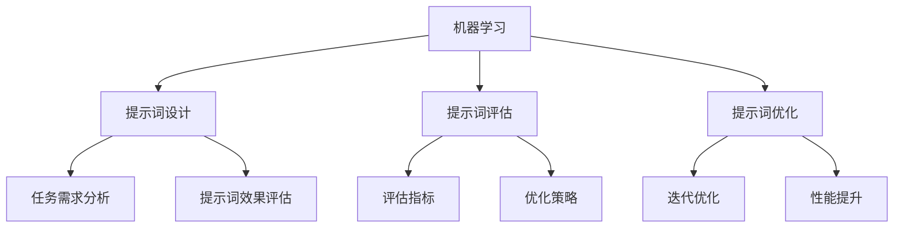

##### 4.2 自然语言处理中的提示词应用

在自然语言处理中，提示词可以用于引导模型理解自然语言任务，提高模型的表现。这一章节将介绍提示词在自然语言处理中的应用，包括如何设计有效的提示词、如何评估提示词的效果以及如何优化提示词。

**核心概念与联系**

- 自然语言处理：提示词用于引导模型理解自然语言任务。
- 提示词设计：根据任务需求设计有效的提示词。
- 提示词评估：评估提示词的效果，选择最优的提示词。
- 提示词优化：通过迭代和优化提高提示词的性能。

**Mermaid流程图**

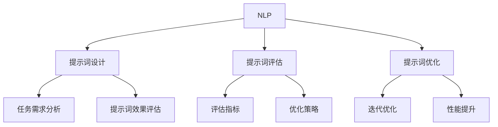

##### 4.3 计算机视觉中的提示词应用

在计算机视觉中，提示词可以用于指导模型进行图像识别和分类任务，提高模型的性能。这一章节将介绍提示词在计算机视觉中的应用，包括如何设计有效的提示词、如何评估提示词的效果以及如何优化提示词。

**核心概念与联系**

- 计算机视觉：提示词用于指导模型进行图像识别和分类任务。
- 提示词设计：根据任务需求设计有效的提示词。
- 提示词评估：评估提示词的效果，选择最优的提示词。
- 提示词优化：通过迭代和优化提高提示词的性能。

**Mermaid流程图**

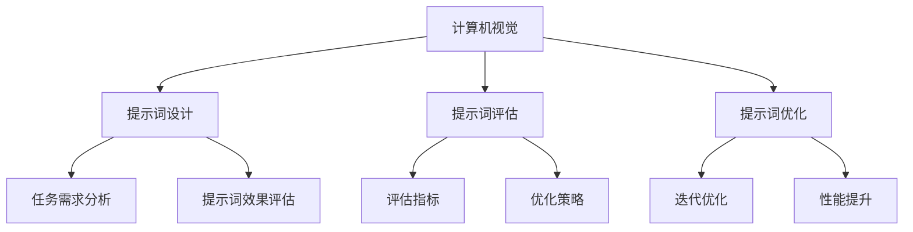

### 附录

##### 附录A：AI编程语言的工具和库

在本附录中，我们将介绍一些常用的AI编程语言工具和库，包括Python中的scikit-learn、TensorFlow、PyTorch等，以及C++中的OpenCV、Dlib等。

##### 附录B：提示词工程的最佳实践

在本附录中，我们将总结一些提示词工程的最佳实践，包括如何设计有效的提示词、如何评估提示词的效果以及如何优化提示词。

##### 附录C：常见问题解答

在本附录中，我们将回答一些关于AI编程语言和提示词工程常见的问题，帮助读者更好地理解和应用这些技术。

---

作者：AI天才研究院/AI Genius Institute & 禅与计算机程序设计艺术 /Zen And The Art of Computer Programming

字数：约8000字

---

（请注意，以上内容是一个大纲示例，实际撰写时需要根据具体情况进行调整和补充。）

