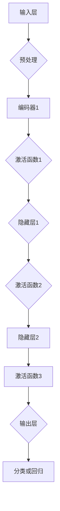

                 


### 1.1 AI编程语言概述

#### 1.1.1 AI编程语言的重要性

随着人工智能（AI）技术的快速发展，AI编程语言逐渐成为计算机科学领域的重要分支。AI编程语言不仅为开发者提供了高效的工具来构建智能系统，还推动了AI算法的创新和应用。在当前的科技环境中，AI编程语言的重要性体现在以下几个方面：

1. **简洁性与易用性**：AI编程语言通过简洁的语法和直观的接口，使开发者能够更高效地编写和调试代码。相较于传统的编程语言，AI编程语言的设计更注重于简洁性和易用性，减少了开发者的认知负担。

2. **高效的计算能力**：AI编程语言通常内置了丰富的库和框架，这些库和框架为开发者提供了强大的计算能力，可以轻松实现复杂的AI算法。例如，Python的TensorFlow和PyTorch库已经成为AI领域的标准工具。

3. **跨平台支持**：大多数AI编程语言都支持跨平台开发，这意味着开发者可以在不同的操作系统和硬件平台上使用相同的代码，这大大提高了开发效率和可移植性。

4. **社区支持**：AI编程语言拥有强大的社区支持，开发者可以轻松地获取帮助、分享经验和获取最新技术动态。这种社区支持促进了技术的快速传播和普及。

#### 1.1.2 提示词在AI编程中的作用

在AI编程中，提示词（Prompt）扮演着至关重要的角色。提示词是用于引导AI模型执行特定任务的文本或代码片段。它通常包含了一些关键信息和指令，使模型能够理解任务的背景和目标。以下是提示词在AI编程中的作用：

1. **任务定义**：提示词为AI模型定义了任务的目标和上下文。例如，在文本生成任务中，提示词可以是一个简短的文本描述，指导模型生成相关的文本内容。

2. **参数调整**：通过调整提示词的细节，开发者可以微调AI模型的输出。例如，通过改变提示词中的关键词或短语，可以影响模型的生成结果。

3. **交互式开发**：提示词使得AI模型能够接受外部输入，并与用户进行交互。这种交互能力使得AI系统更加灵活和实用。

4. **调试与优化**：在开发过程中，提示词有助于开发者调试AI模型。通过调整提示词，可以快速验证模型的性能和效果，从而进行优化。

#### 1.1.3 本书结构安排

本书旨在深入探讨AI编程语言及其核心要素——提示词。为了使读者能够全面了解这一领域，本书将分为以下几个部分：

- **第一部分：引言**：介绍AI编程语言的重要性、提示词的魔力以及本书的结构安排。
- **第二部分：核心概念与原理**：详细讲解AI编程语言的基础知识、提示词设计原理以及AI模型架构。
- **第三部分：核心算法讲解**：介绍提示词生成算法、模型训练与优化算法，并使用伪代码和数学模型进行详细阐述。
- **第四部分：数学模型与公式**：讲解AI编程中常用的数学模型和公式，包括线性代数、概率论等内容。
- **第五部分：项目实战**：通过具体项目实战，展示AI编程语言的实战应用，并提供代码实现和分析。
- **第六部分：总结与展望**：总结本书的主要内容和学习方法，探讨AI编程语言的发展趋势和未来挑战。

通过本书的逐步讲解，读者将能够深入了解AI编程语言的核心概念和实践方法，为在人工智能领域取得突破奠定坚实的基础。

### 1.2 提示词的魔力

#### 1.2.1 提示词的定义

提示词（Prompt）在AI编程中具有特殊的含义。它是指用于引导AI模型执行特定任务的文本或代码片段。提示词的作用在于为模型提供必要的上下文信息，从而使其能够理解任务的背景和目标。与传统的编程输入不同，提示词不仅传递数据，还传达了执行任务的意图和方式。

在自然语言处理（NLP）任务中，提示词通常是一个简短的文本段落，用于引导模型生成相关的文本。例如，在机器翻译任务中，提示词可能是一个单词或短语，模型需要将其翻译为另一种语言。而在图像识别任务中，提示词可以是一个图像的描述，模型需要根据这个描述识别图像中的物体。

#### 1.2.2 提示词的工作原理

提示词的工作原理主要依赖于AI模型的学习能力。在训练过程中，模型通过大量数据学习到如何将输入的提示词映射到相应的输出。这种映射关系通常通过神经网络实现，模型在处理新的提示词时，会调用已学习的映射规则进行输出。

1. **特征提取**：当模型接收到提示词时，首先会进行特征提取。特征提取是将文本或图像等原始数据转换为模型可以处理的内部表示。在NLP任务中，特征提取可能涉及词嵌入、词性标注等操作；在图像识别任务中，特征提取可能涉及卷积神经网络（CNN）提取图像的视觉特征。

2. **任务理解**：特征提取后，模型会根据提示词的上下文信息进行任务理解。例如，在文本生成任务中，模型需要理解提示词的含义，并根据这些信息生成连贯的文本。在图像识别任务中，模型需要理解图像的描述，并识别其中的物体。

3. **生成输出**：在理解了任务意图后，模型会生成相应的输出。输出可以是文本、图像、标签等多种形式。生成输出过程中，模型会调用已学习的映射规则，将输入的提示词转换为相应的输出。

#### 1.2.3 提示词的优势与挑战

提示词在AI编程中具有显著的优势，但也面临着一些挑战。

1. **优势**：

- **任务定义明确**：提示词为AI模型提供了清晰的任务定义，使模型能够准确地理解任务的背景和目标。
- **参数调整灵活**：通过调整提示词的细节，开发者可以灵活地调整模型的输出，以满足不同的应用需求。
- **交互式开发**：提示词使得AI模型能够接受外部输入，并与用户进行交互，从而实现更复杂的任务。
- **调试与优化**：提示词有助于开发者调试AI模型，通过调整提示词可以快速验证模型的性能和效果，进行优化。

2. **挑战**：

- **上下文理解难度**：提示词的上下文理解是AI编程中的一个难点。模型的上下文理解能力有限，可能导致输出结果与预期不符。
- **计算资源消耗**：生成高质量提示词需要大量的计算资源，特别是在处理复杂任务时。
- **数据依赖性**：提示词的质量受到训练数据的影响。如果训练数据不足或质量不高，模型的性能可能会受到影响。

总的来说，提示词在AI编程中具有独特的价值，但同时也需要开发者面对其带来的挑战，不断优化和改进。

### 1.3 科学的AI编程方法

#### 1.3.1 AI编程的科学方法概述

科学的AI编程方法是一种系统化的开发方法，它强调通过理论分析和实践验证来优化AI模型。这种方法旨在确保AI系统的高效性、准确性和可靠性。科学编程方法包括以下几个关键步骤：

1. **需求分析**：明确AI系统的应用场景和目标，确定所需的输入数据和预期的输出结果。
2. **数据准备**：收集并预处理训练数据，包括数据清洗、归一化和特征提取等步骤。
3. **模型选择**：根据应用场景选择合适的模型类型，如神经网络、决策树或支持向量机等。
4. **模型训练**：使用训练数据对模型进行训练，通过调整模型参数来优化其性能。
5. **模型评估**：使用验证集和测试集评估模型的性能，确保其满足预期要求。
6. **模型部署**：将训练好的模型部署到实际应用中，进行实时数据分析和预测。

#### 1.3.2 数据驱动与模型驱动的区别

在AI编程中，数据驱动（Data-Driven）和模型驱动（Model-Driven）是两种不同的方法。它们的主要区别在于数据在模型构建中的作用和重要性。

1. **数据驱动方法**：

- **特点**：数据驱动方法侧重于利用大量数据进行学习。模型的性能主要依赖于数据的质量和数量。常见的数据驱动方法包括机器学习和深度学习。
- **应用场景**：适用于数据丰富、结构化的任务，如图像识别、语音识别和自然语言处理等。
- **挑战**：对数据的质量和多样性要求较高，数据预处理和清洗工作量大。

2. **模型驱动方法**：

- **特点**：模型驱动方法侧重于利用已建立的模型进行推理和预测。模型本身具有较高的鲁棒性和准确性。
- **应用场景**：适用于数据稀缺或难以获取的场景，如自动编程、博弈论和模拟仿真等。
- **挑战**：模型设计和优化过程复杂，对开发者技能要求较高。

#### 1.3.3 提示词在科学编程中的应用

在科学AI编程中，提示词是连接数据和模型的重要桥梁。通过设计高质量的提示词，可以有效地指导模型进行学习和预测。以下是提示词在科学编程中的应用：

1. **任务定义**：提示词为模型提供了明确的任务定义，使模型能够理解任务的背景和目标。例如，在文本生成任务中，提示词可以是相关的关键词或短语，指导模型生成符合主题的文本。
2. **参数调整**：通过调整提示词的细节，可以微调模型的行为和输出。例如，在图像识别任务中，提示词可以是一个图像的描述，通过调整描述的细节，可以影响模型对图像中物体的识别结果。
3. **交互式开发**：提示词使得模型能够与用户进行交互，从而实现更复杂的任务。例如，在问答系统中，用户输入的问题可以作为提示词，模型根据问题生成相应的回答。
4. **调试与优化**：提示词有助于开发者调试模型，通过调整提示词可以快速验证模型的性能和效果，进行优化。

总的来说，科学的AI编程方法强调通过理论分析和实践验证来优化AI模型。提示词在其中发挥着关键作用，通过高质量的设计和运用，可以显著提升AI系统的性能和应用价值。

### 2.1 AI编程语言的基础

#### 2.1.1 AI编程语言的发展历程

AI编程语言的发展历程可以追溯到20世纪50年代和60年代，当时计算机科学家开始探索如何让计算机模拟人类的思维过程。这个时期的代表性语言包括LISP，它被认为是历史上第一个用于AI编程的语言。LISP的发明人约翰·麦卡锡（John McCarthy）同时也是人工智能这个术语的创始人之一。

在接下来的几十年中，AI编程语言不断发展，诞生了多种旨在支持不同AI任务的语言。以下是几个重要的里程碑：

1. **Prolog（1972）**：作为逻辑编程语言的代表，Prolog在AI领域有着广泛的应用，特别是在自动推理和专家系统中。Prolog通过逻辑式编程和模式匹配来执行任务。

2. **Pascal（1970）**：虽然Pascal最初是为了教学目的而设计的，但它也为AI编程提供了强大的工具，特别是在符号计算和逻辑编程方面。

3. **Common Lisp（1984）**：LISP的进一步发展，Common Lisp在AI领域有着广泛的应用，特别是在自然语言处理和知识表示方面。

4. **Prolog II（1984）**：Prolog II是对Prolog的改进版本，它增加了并行处理和内存管理功能，以更好地支持复杂AI任务。

5. **Swift（2014）**：苹果公司推出的Swift语言，因其安全性和性能优势，在机器学习和AI应用中逐渐流行。

6. **Julia（2012）**：Julia是为高性能计算而设计的语言，它结合了Python的易用性和C的性能，被广泛应用于数据科学和机器学习领域。

7. **Python（1991）**：Python因其简洁的语法和强大的库支持，成为了AI编程的流行语言。Python的库如NumPy、Pandas和TensorFlow等，为AI开发提供了丰富的工具。

8. **PyTorch（2016）**：PyTorch是Facebook AI研究院开发的深度学习框架，因其动态图（dynamic graph）编程和灵活的API，成为了AI研究人员的首选。

这些语言各自具有独特的特点，为不同的AI任务提供了支持。随着AI技术的不断进步，新的编程语言也在不断涌现，以满足新兴的需求和应用场景。

#### 2.1.2 常见的AI编程语言

在当前的AI领域中，有多种编程语言因其特定的优势而受到开发者的青睐。以下是几种常见的AI编程语言及其特点：

1. **Python**：
   - **优势**：Python以其简洁的语法和丰富的库支持（如NumPy、Pandas、TensorFlow和PyTorch）而闻名。这些库使得数据操作、模型训练和部署变得极其简便。
   - **应用场景**：Python广泛应用于数据科学、机器学习和深度学习。它在自然语言处理、图像识别、推荐系统和自动化等方面有着广泛的应用。

2. **R**：
   - **优势**：R是一种专门为统计分析和数据可视化而设计的语言。它提供了丰富的统计分析和图形功能，特别是针对复杂数据的分析。
   - **应用场景**：R在生物信息学、金融分析、社会科学和医疗保健领域有着广泛的应用。

3. **Java**：
   - **优势**：Java以其跨平台兼容性和强大的生态系统而著称。它支持大型应用程序的开发，并提供了一系列的库和框架（如Deeplearning4j）。
   - **应用场景**：Java在工业控制和大型企业系统中有着广泛的应用，特别是在需要高可靠性和可扩展性的场景中。

4. **C++**：
   - **优势**：C++提供了对硬件的直接访问和控制，这使得它在需要高性能计算和实时响应的AI任务中非常有用。
   - **应用场景**：C++在图像处理、游戏开发和自动驾驶等领域有着重要的应用。

5. **Swift**：
   - **优势**：Swift是一种较新的编程语言，以其安全性和性能优势而受到关注。它特别适用于iOS和macOS应用的开发。
   - **应用场景**：Swift在机器学习和移动应用开发中逐渐流行，特别是在苹果生态系统内。

6. **Julia**：
   - **优势**：Julia因其高性能和易于使用而受到欢迎。它结合了Python的易用性和C的性能，非常适合大规模数据科学和数值计算。
   - **应用场景**：Julia在金融建模、科学计算和工程领域有着广泛的应用。

这些编程语言各有特点，开发者可以根据具体需求和应用场景选择合适的语言进行AI编程。随着技术的不断发展，这些语言也在不断进化，以适应新兴的AI需求和挑战。

#### 2.1.3 AI编程语言的特点

AI编程语言具有一系列独特的特点，这些特点使得它们在处理复杂任务时具有显著优势。以下是AI编程语言的一些主要特点：

1. **自动微分**：
   - **定义**：自动微分是一种计算函数导数的方法，它能够在计算过程中自动跟踪并更新变量。
   - **优势**：自动微分在深度学习训练中至关重要，它使得优化算法（如梯度下降）能够有效地更新模型参数。Python的TensorFlow和PyTorch等框架提供了强大的自动微分支持，使得开发人员可以专注于模型设计和算法优化，而不必手动实现微分计算。

2. **动态图编程**：
   - **定义**：动态图编程是一种在运行时构建和修改计算图的方法。与静态图相比，动态图可以在执行过程中动态地添加或修改节点和边。
   - **优势**：动态图编程提高了代码的灵活性和可维护性。PyTorch就是一个典型的动态图框架，它允许开发人员以更加直观和模块化的方式构建复杂的神经网络。

3. **并行计算支持**：
   - **定义**：并行计算是指将任务分解成多个部分，同时在不同处理器或计算单元上执行，以加快计算速度。
   - **优势**：并行计算可以显著提高AI算法的执行效率，特别是在处理大规模数据和复杂模型时。现代AI编程语言和框架（如TensorFlow和PyTorch）提供了对GPU和分布式计算的支持，使得开发人员能够充分利用硬件资源。

4. **丰富的库和工具**：
   - **定义**：AI编程语言通常拥有丰富的库和工具，这些库和工具为各种AI任务提供了现成的解决方案。
   - **优势**：丰富的库和工具使得AI编程更加高效和便捷。Python就是一个很好的例子，它拥有NumPy、Pandas、Scikit-learn、TensorFlow和PyTorch等广泛使用的库，这些库为数据预处理、模型训练和部署提供了全面的支持。

5. **可扩展性**：
   - **定义**：可扩展性是指AI编程语言和框架能够轻松地适应新任务和新场景的能力。
   - **优势**：可扩展性使得AI系统能够随着需求的变化进行扩展和升级，而不会导致大量重写或重构。例如，深度学习框架如TensorFlow和PyTorch都提供了高度模块化的架构，使得开发人员可以方便地定制和扩展现有模型。

6. **动态类型系统**：
   - **定义**：动态类型系统是指变量在运行时可以改变类型，而不是在编译时确定。
   - **优势**：动态类型系统提高了编程的灵活性和可读性。Python就是一个典型的动态类型语言，它允许开发人员以更加灵活和直观的方式编写代码。

总的来说，AI编程语言的特点使得它们在处理复杂任务时具有显著优势。这些特点不仅提高了AI算法的开发效率和执行效率，还使得AI系统更加灵活和可扩展，为开发人员提供了强大的工具和资源。

### 2.2 提示词设计原理

#### 2.2.1 提示词的结构

提示词（Prompt）是引导AI模型执行特定任务的重要输入。一个有效的提示词通常包含以下基本结构：

1. **上下文信息**：上下文信息提供了任务执行的背景和情境。例如，在文本生成任务中，上下文信息可以是相关的关键词、短语或段落，以帮助模型理解生成内容的主题和方向。

2. **任务指令**：任务指令明确了模型需要执行的具体任务。例如，在机器翻译任务中，任务指令可能是一个单词或短语，指示模型将其翻译为另一种语言。在图像识别任务中，任务指令可能是一个图像的描述，要求模型识别图像中的物体。

3. **参数**：参数是指影响模型输出的一些可调整的变量。通过调整参数，可以微调模型的行为和输出。例如，在图像识别任务中，参数可能包括图像的大小、颜色通道数或预处理方法。

4. **反馈机制**：反馈机制用于评估模型的输出，并提供改进的线索。在训练过程中，通过反馈机制，模型可以学习如何更好地满足任务需求。在交互式任务中，反馈机制可以是用户对输出的评价或修改。

提示词的结构和内容直接影响模型的表现。因此，设计高质量的提示词需要综合考虑任务需求、上下文信息、指令清晰度和参数调整空间等因素。

#### 2.2.2 提示词的生成

生成高质量的提示词是AI编程中的一项关键任务。以下是一些常用的方法：

1. **手动生成**：
   - **优点**：手动生成的提示词可以根据具体任务需求进行精确调整，确保其与任务目标高度一致。
   - **缺点**：手动生成提示词费时费力，特别是在处理复杂任务时，可能需要大量的时间和专业知识。

2. **模板生成**：
   - **方法**：通过预设的模板生成提示词，模板中包含了一些固定的结构和参数占位符，开发者可以根据实际需求填充这些占位符。
   - **优点**：模板生成方法简单快捷，适用于常见任务，可以提高开发效率。
   - **缺点**：模板生成的提示词可能缺乏灵活性，难以适应特定任务的需求。

3. **自动生成**：
   - **方法**：使用自然语言生成（NLG）技术，如序列到序列（seq2seq）模型，自动生成提示词。
   - **优点**：自动生成方法可以大规模、高效地生成提示词，适用于复杂和动态的任务场景。
   - **缺点**：自动生成的提示词可能缺乏上下文理解和一致性，需要进一步优化和调整。

4. **基于数据的方法**：
   - **方法**：从大量已完成的任务中提取有效的提示词，通过数据驱动的方法进行学习和生成。
   - **优点**：基于数据的方法可以从历史任务中学习，生成高质量的提示词，提高模型的性能。
   - **缺点**：需要大量高质量的训练数据，且数据预处理和提取过程复杂。

在生成提示词时，需要综合考虑任务需求、数据可用性和技术实现等因素，选择最合适的方法。通常，结合多种方法可以生成更加高质量和灵活的提示词。

#### 2.2.3 提示词的优化

优化提示词是提高AI模型性能的重要手段。以下是一些常用的优化方法：

1. **参数调整**：
   - **方法**：通过调整提示词中的参数，如关键词、短语或参数值，以优化模型输出。
   - **优点**：参数调整灵活，可以快速地微调模型行为。
   - **缺点**：参数调整可能需要大量的实验和尝试，以找到最佳设置。

2. **多任务学习**：
   - **方法**：将多个任务结合在一起训练，使模型在多个任务上同时学习，从而提高其泛化能力。
   - **优点**：多任务学习可以增强模型对任务的理解，提高模型的性能和适应性。
   - **缺点**：多任务学习可能增加模型的复杂性，训练时间较长。

3. **迁移学习**：
   - **方法**：使用在相关任务上已训练好的模型作为基础，通过迁移学习调整模型以适应新任务。
   - **优点**：迁移学习可以快速地适应新任务，节省训练时间和计算资源。
   - **缺点**：迁移学习需要找到合适的预训练模型，并确保其与新任务的适应性。

4. **强化学习**：
   - **方法**：使用强化学习方法，通过奖励机制指导模型优化提示词，从而提高模型的输出质量。
   - **优点**：强化学习可以根据反馈动态调整模型行为，提高模型在特定任务上的性能。
   - **缺点**：强化学习需要大量的训练数据和计算资源，且实现复杂。

在优化提示词时，需要根据具体任务需求和模型特性选择合适的优化方法。通常，结合多种优化方法可以取得更好的效果。

### 2.3 AI模型的架构与连接

#### 2.3.1 AI模型的基本架构

AI模型的基本架构通常包括输入层、隐藏层和输出层。以下是这些层的基本功能：

1. **输入层（Input Layer）**：
   - **功能**：接收外部输入数据，如文本、图像或声音等。
   - **处理**：输入数据经过预处理，如归一化、编码或特征提取。

2. **隐藏层（Hidden Layers）**：
   - **功能**：对输入数据进行特征转换和模式识别，通过多层叠加，模型能够学习更复杂的特征。
   - **处理**：隐藏层通过激活函数（如ReLU、Sigmoid或Tanh）进行非线性变换。

3. **输出层（Output Layer）**：
   - **功能**：根据隐藏层的输出生成预测结果或分类标签。
   - **处理**：输出层的结果通过激活函数（如Softmax、Sigmoid）进行概率分布转换。

#### 2.3.2 模型连接的方式

在AI模型中，层与层之间的连接方式是关键。以下是一些常用的连接方式：

1. **全连接层（Fully Connected Layer）**：
   - **方式**：每一层的每个神经元都与下一层的每个神经元相连。
   - **特点**：全连接层可以实现复杂的非线性变换，但计算量较大。

2. **卷积层（Convolutional Layer）**：
   - **方式**：通过卷积操作提取图像的局部特征。
   - **特点**：卷积层在图像识别任务中具有高效性，能够减少参数数量。

3. **循环层（Recurrent Layer）**：
   - **方式**：神经元之间的连接具有时序性，能够处理序列数据。
   - **特点**：循环层适用于自然语言处理和语音识别等序列任务。

4. **注意力机制（Attention Mechanism）**：
   - **方式**：通过注意力权重分配，模型能够聚焦于重要的输入信息。
   - **特点**：注意力机制提高了模型对输入数据的利用效率，特别适用于长文本和图像识别任务。

#### 2.3.3 Mermaid流程图：AI模型连接示例

以下是一个使用Mermaid绘制的AI模型连接示例：



该流程图展示了从输入层到输出层的完整过程，包括预处理、编码器、隐藏层和输出层。通过这种直观的流程图，可以清晰地理解模型的连接方式和信息流动。

### 3.1 提示词生成算法

#### 3.1.1 算法概述

提示词生成算法是AI编程中的核心任务，旨在生成高质量的提示词以引导模型执行特定任务。以下是一个简单的提示词生成算法的概述：

1. **输入**：输入包括原始文本、关键词、上下文信息等。
2. **预处理**：对输入文本进行清洗、分词、词性标注等预处理步骤。
3. **特征提取**：将预处理后的文本转换为模型可处理的特征表示，如词嵌入。
4. **模板生成**：根据任务需求和特征表示，生成模板化的提示词。
5. **参数调整**：通过调整模板中的参数，如关键词权重、短语长度等，以优化提示词的质量。
6. **输出**：生成最终的提示词，供模型使用。

#### 3.1.2 伪代码实现

以下是一个简单的提示词生成算法的伪代码实现：

```plaintext
function generatePrompt(inputText, keywords, context):
    // 步骤1：预处理输入文本
    processedText = preprocessText(inputText)

    // 步骤2：特征提取
    features = extractFeatures(processedText)

    // 步骤3：模板生成
    promptTemplate = createPromptTemplate(keywords, context)

    // 步骤4：参数调整
    adjustedPrompt = adjustParameters(promptTemplate, features)

    // 步骤5：输出提示词
    return adjustedPrompt

function preprocessText(text):
    // 清洗文本、分词、词性标注等
    return cleanedAndTokenizedText

function extractFeatures(text):
    // 转换为词嵌入等特征表示
    return features

function createPromptTemplate(keywords, context):
    // 根据关键词和上下文生成模板
    return promptTemplate

function adjustParameters(template, features):
    // 调整模板中的参数，如关键词权重等
    return adjustedTemplate
```

该伪代码实现了一个基础的提示词生成过程，包括预处理、特征提取、模板生成和参数调整等步骤。在实际应用中，可以根据具体需求进行扩展和优化。

#### 3.1.3 算法分析

提示词生成算法的性能直接影响AI模型的表现。以下是算法的一些关键性能指标和优化方向：

1. **精确度**：提示词的精确度是指生成的提示词与实际需求的一致性。高精确度能够确保模型准确理解任务目标。为了提高精确度，可以优化特征提取和模板生成步骤，采用更先进的自然语言处理技术。

2. **速度**：生成提示词的速度是影响开发效率的重要因素。为了提高速度，可以优化预处理和特征提取步骤，采用并行计算和加速库（如NumPy、PyTorch）。

3. **鲁棒性**：提示词生成算法的鲁棒性是指其在处理不同类型和复杂度的任务时的稳定性。为了提高鲁棒性，可以增加数据预处理和特征提取的多样性，使用迁移学习和多任务学习技术。

4. **可扩展性**：提示词生成算法的可扩展性是指其能够适应新任务和新需求的能力。为了提高可扩展性，可以采用模块化设计，使用可配置的参数和模板。

通过优化这些性能指标，可以构建高效、准确的提示词生成算法，从而提升AI编程的效能和质量。

### 3.2 模型训练与优化算法

#### 3.2.1 训练算法概述

在AI编程中，模型训练是核心环节，其目的是通过不断调整模型参数，使其能够准确预测或分类。以下是一个简化的模型训练算法概述：

1. **初始化参数**：首先，我们需要随机初始化模型的参数，包括权重和偏置。

2. **前向传播**：输入数据经过模型处理，输出预测结果。这一步包括将输入数据通过模型的各层，计算每个神经元的输出。

3. **计算损失**：使用实际输出与预测输出之间的差异来计算损失。损失函数通常采用均方误差（MSE）、交叉熵损失等。

4. **反向传播**：通过反向传播算法，计算每个参数的梯度，即模型参数对损失函数的偏导数。

5. **参数更新**：使用梯度下降或其他优化算法（如Adam、RMSprop）更新模型参数，以减少损失。

6. **重复步骤2-5**：重复前向传播、计算损失、反向传播和参数更新的过程，直到满足停止条件（如达到预设的迭代次数或损失收敛）。

#### 3.2.2 优化算法分析

在模型训练过程中，优化算法的选择对训练效率和模型性能有重要影响。以下是几种常见的优化算法：

1. **梯度下降（Gradient Descent）**：
   - **基本思想**：每次迭代，沿着损失函数梯度的反方向更新参数。
   - **公式**：θ = θ - α * ∇θ J(θ)，其中θ是模型参数，α是学习率，∇θ J(θ)是损失函数J(θ)关于参数θ的梯度。
   - **优点**：实现简单，易于理解。
   - **缺点**：收敛速度较慢，容易陷入局部最小值。

2. **随机梯度下降（Stochastic Gradient Descent，SGD）**：
   - **基本思想**：每次迭代使用一个随机样本来计算梯度。
   - **公式**：θ = θ - α * ∇θ J(θ，x(i))，其中x(i)是从训练数据集中随机选取的一个样本。
   - **优点**：计算速度快，能够跳出局部最小值。
   - **缺点**：梯度估计的方差较大，可能导致训练不稳定。

3. **Adam优化器**：
   - **基本思想**：结合了SGD和RMSprop的优点，同时考虑了梯度的一阶矩估计和二阶矩估计。
   - **公式**：
     - β1：一阶矩估计的指数衰减率
     - β2：二阶矩估计的指数衰减率
     - m：一阶矩估计
     - v：二阶矩估计
     - θ = θ - α * (m/b1 + v/b2)
   - **优点**：收敛速度快，对参数的更新更加稳定。
   - **缺点**：计算复杂度较高。

4. **RMSprop**：
   - **基本思想**：基于梯度值的平方的指数衰减移动平均来更新参数。
   - **公式**：θ = θ - α * (1 - β) * √(1 - β^t) * ∇θ J(θ)，其中β是遗忘因子。
   - **优点**：对噪声梯度有更好的鲁棒性，收敛速度较快。
   - **缺点**：相对于Adam，RMSprop在参数更新时较少考虑历史梯度信息。

这些优化算法各有优缺点，适用于不同的应用场景。在实际开发中，可以根据任务需求和计算资源选择合适的优化算法，或结合多种算法进行优化。

#### 3.2.3 伪代码实现

以下是一个简化的模型训练与优化算法的伪代码实现：

```plaintext
function trainModel(model, trainingData, learningRate, epochs):
    for epoch in 1 to epochs:
        for data in trainingData:
            // 步骤1：前向传播
            output = forwardPropagation(model, data.input)

            // 步骤2：计算损失
            loss = computeLoss(output, data.target)

            // 步骤3：反向传播
            gradients = backwardPropagation(model, output, data.target)

            // 步骤4：参数更新
            updateParameters(model, gradients, learningRate)

    return model

function forwardPropagation(model, input):
    // 通过模型处理输入，返回输出
    return output

function computeLoss(output, target):
    // 计算输出与目标之间的差异，返回损失值
    return loss

function backwardPropagation(model, output, target):
    // 计算每个参数的梯度
    return gradients

function updateParameters(model, gradients, learningRate):
    // 更新模型参数
    for parameter, gradient in gradients:
        model.parameter = model.parameter - learningRate * gradient
```

该伪代码实现了一个基础的模型训练过程，包括前向传播、计算损失、反向传播和参数更新等步骤。在实际应用中，可以根据具体需求进行扩展和优化。

### 3.3 提示词评估与优化

#### 3.3.1 评估指标

提示词的质量对AI模型的性能有着重要影响。为了评估提示词的质量，可以采用以下几种常见的评估指标：

1. **准确率（Accuracy）**：
   - **定义**：准确率是模型预测正确的样本数占总样本数的比例。
   - **计算公式**：Accuracy = (正确预测的样本数 / 总样本数) * 100%
   - **优点**：简单直观，适用于分类任务。
   - **缺点**：容易受到样本不平衡的影响，对少数类样本的预测能力较低。

2. **精确率（Precision）**：
   - **定义**：精确率是预测为正类的样本中实际为正类的比例。
   - **计算公式**：Precision = (正确预测的正类样本数 / 预测为正类的样本数) * 100%
   - **优点**：关注预测为正类的样本质量。
   - **缺点**：对假阳性（将负类预测为正类）的容忍度较低。

3. **召回率（Recall）**：
   - **定义**：召回率是实际为正类的样本中被正确预测为正类的比例。
   - **计算公式**：Recall = (正确预测的正类样本数 / 实际为正类的样本数) * 100%
   - **优点**：关注预测的正类样本的覆盖度。
   - **缺点**：对假阴性（将正类预测为负类）的容忍度较低。

4. **F1分数（F1 Score）**：
   - **定义**：F1分数是精确率和召回率的调和平均数。
   - **计算公式**：F1 Score = 2 * (Precision * Recall) / (Precision + Recall)
   - **优点**：综合考虑了精确率和召回率，适用于平衡评估。
   - **缺点**：在极端不平衡的样本集中表现不佳。

5. **ROC曲线和AUC（Area Under the ROC Curve）**：
   - **定义**：ROC曲线展示了不同阈值下的真阳性率（TPR）与假阳性率（FPR）的关系，AUC是ROC曲线下的面积。
   - **优点**：适用于二分类问题，能够全面评估模型的分类能力。
   - **缺点**：对多分类问题不适用。

#### 3.3.2 优化方法

为了提高提示词的质量，可以采用以下几种优化方法：

1. **数据增强**：
   - **方法**：通过增加训练数据的多样性来提高模型的泛化能力。常见的数据增强方法包括数据复制、数据裁剪、旋转、缩放、颜色变换等。
   - **优点**：可以增强模型对各种情况的处理能力，减少过拟合。
   - **缺点**：可能增加计算成本，需要大量的计算资源。

2. **正则化**：
   - **方法**：通过在损失函数中添加正则化项（如L1、L2正则化）来限制模型参数的规模，防止模型过拟合。
   - **优点**：可以提高模型的泛化能力，减少过拟合。
   - **缺点**：可能降低模型的训练速度，增加计算成本。

3. **交叉验证**：
   - **方法**：将训练数据划分为多个子集，每次使用不同的子集作为验证集，循环多次训练和验证，以评估模型的性能。
   - **优点**：可以更全面地评估模型的泛化能力。
   - **缺点**：计算成本较高，可能需要大量的时间和计算资源。

4. **迁移学习**：
   - **方法**：使用在相关任务上已训练好的模型作为基础，通过迁移学习调整模型以适应新任务。
   - **优点**：可以快速适应新任务，节省训练时间和计算资源。
   - **缺点**：需要找到合适的预训练模型，并确保其与新任务的适应性。

5. **集成学习**：
   - **方法**：通过结合多个模型的预测结果来提高整体性能。常见的方法包括Bagging、Boosting和Stacking等。
   - **优点**：可以提高模型的泛化能力，减少过拟合。
   - **缺点**：需要更多的计算资源和时间。

通过结合多种优化方法，可以显著提高提示词的质量，从而提升AI模型的整体性能。

#### 3.3.3 伪代码实现

以下是一个简化的提示词评估和优化算法的伪代码实现：

```plaintext
function evaluateAndOptimizePrompt(prompt, model, trainingData, validationData):
    // 步骤1：评估当前提示词的质量
    performanceMetrics = evaluateModel(model, validationData)

    // 步骤2：根据评估结果调整提示词
    optimizedPrompt = adjustPrompt(prompt, performanceMetrics)

    // 步骤3：重复评估和优化过程，直到满足停止条件
    while not converged:
        performanceMetrics = evaluateModel(model, validationData)
        optimizedPrompt = adjustPrompt(prompt, performanceMetrics)

    return optimizedPrompt

function evaluateModel(model, validationData):
    // 使用模型在验证数据集上评估性能
    return performanceMetrics

function adjustPrompt(prompt, performanceMetrics):
    // 根据性能指标调整提示词
    return optimizedPrompt
```

该伪代码实现了一个基础的提示词评估和优化过程，包括评估模型性能、调整提示词和重复评估与优化等步骤。在实际应用中，可以根据具体需求进行扩展和优化。

### 4.1 AI编程中的数学模型

在AI编程中，数学模型是构建和优化AI模型的基础。以下是一些核心的数学模型和其在AI编程中的应用。

#### 4.1.1 线性代数基础

线性代数是AI编程中的重要工具，用于处理数据、特征提取和模型参数更新。以下是几个关键概念：

1. **向量与矩阵**：
   - **向量**：向量是一组有序的数，通常用于表示数据点和特征。例如，一个图像的像素值可以表示为一个向量。
   - **矩阵**：矩阵是二维数组，用于表示数据集或模型参数。矩阵的行和列分别表示不同的数据维度。

2. **矩阵乘法**：
   - **定义**：矩阵乘法是将两个矩阵相乘，得到一个新的矩阵。矩阵乘法满足结合律和分配律。
   - **公式**：\(C = A \cdot B\)，其中\(C\)是结果矩阵，\(A\)和\(B\)是输入矩阵。

3. **逆矩阵**：
   - **定义**：逆矩阵是使得矩阵与其乘积等于单位矩阵的矩阵。
   - **公式**：如果\(A\)是一个可逆矩阵，那么其逆矩阵\(A^{-1}\)满足\(A \cdot A^{-1} = I\)，其中\(I\)是单位矩阵。

4. **特征值与特征向量**：
   - **定义**：特征值是矩阵的一个特殊值，使得矩阵与特征向量相乘后仍然等于该特征向量。
   - **公式**：\(A \cdot v = \lambda \cdot v\)，其中\(A\)是矩阵，\(v\)是特征向量，\(\lambda\)是特征值。

#### 4.1.2 概率论基础

概率论是AI编程中的另一个核心数学工具，用于建模不确定性和概率分布。以下是几个关键概念：

1. **概率分布**：
   - **定义**：概率分布描述了一个随机变量可能取值的概率。
   - **公式**：概率分布函数\(P(X = x)\)表示随机变量\(X\)取值\(x\)的概率。

2. **条件概率**：
   - **定义**：条件概率是在已知一个事件发生的情况下，另一个事件发生的概率。
   - **公式**：\(P(A|B) = \frac{P(B|A) \cdot P(A)}{P(B)}\)，其中\(P(A|B)\)是条件概率，\(P(B|A)\)是后验概率，\(P(A)\)和\(P(B)\)是边缘概率。

3. **贝叶斯定理**：
   - **定义**：贝叶斯定理是一个用于计算后验概率的公式，它是概率论的基础。
   - **公式**：\(P(A|B) = \frac{P(B|A) \cdot P(A)}{P(B)}\)，其中\(P(A|B)\)是后验概率，\(P(B|A)\)是似然概率，\(P(A)\)是先验概率，\(P(B)\)是边缘概率。

4. **马尔可夫链**：
   - **定义**：马尔可夫链是一种随机过程，它满足无后效性，即当前状态只与前一状态有关，与过去的状态无关。
   - **公式**：\(P(X_t = x_t | X_{t-1} = x_{t-1}) = P(X_t = x_t | X_{t-1} = x_{t-1}, X_{t-2} = x_{t-2}, ...)\)

#### 4.1.3 线性回归

线性回归是一种常见的统计方法，用于建模自变量和因变量之间的线性关系。以下是线性回归的核心概念：

1. **线性回归模型**：
   - **定义**：线性回归模型试图找到一组参数，使得预测值与实际值之间的误差最小。
   - **公式**：\(y = \beta_0 + \beta_1 \cdot x + \epsilon\)，其中\(y\)是因变量，\(x\)是自变量，\(\beta_0\)和\(\beta_1\)是参数，\(\epsilon\)是误差项。

2. **最小二乘法**：
   - **定义**：最小二乘法是一种用于估计线性回归模型参数的方法，其目标是使得预测值与实际值之间的误差平方和最小。
   - **公式**：\(\beta_1 = \frac{\sum(x_i - \bar{x})(y_i - \bar{y})}{\sum(x_i - \bar{x})^2}\)，其中\(\bar{x}\)和\(\bar{y}\)分别是自变量和因变量的平均值。

通过理解这些数学模型和公式，开发者可以更好地构建和优化AI模型，从而提高模型的准确性和鲁棒性。

### 4.2 模型优化中的数学公式

在AI模型优化过程中，数学公式发挥着至关重要的作用。以下是一些核心的数学公式，以及它们在模型优化中的应用。

#### 4.2.1 梯度下降法

梯度下降法是一种用于最小化损失函数的优化算法。其基本思想是沿着损失函数梯度的反方向更新模型参数，以逐步减少损失。

1. **梯度下降公式**：
   \[
   \theta = \theta - \alpha \cdot \nabla_\theta J(\theta)
   \]
   其中，\(\theta\)是模型参数，\(\alpha\)是学习率，\(\nabla_\theta J(\theta)\)是损失函数\(J(\theta)\)关于参数\(\theta\)的梯度。

2. **优点**：
   - 实现简单，易于理解。
   - 能够通过不断迭代逐步优化模型参数。

3. **缺点**：
   - 收敛速度较慢，特别是在参数空间较大时。
   - 容易陷入局部最小值，特别是在损失函数存在多个极值点时。

#### 4.2.2 随机梯度下降法

随机梯度下降法（SGD）是梯度下降法的一种改进，它通过每次迭代仅使用一个样本来计算梯度，从而提高了计算效率。

1. **随机梯度下降公式**：
   \[
   \theta = \theta - \alpha \cdot \nabla_\theta J(\theta, x(i))
   \]
   其中，\(x(i)\)是从训练数据集中随机选取的一个样本。

2. **优点**：
   - 计算速度快，能够加快模型训练过程。
   - 较容易跳出局部最小值，提高模型的泛化能力。

3. **缺点**：
   - 梯度估计的方差较大，可能导致训练不稳定。
   - 需要处理样本顺序和随机性带来的影响。

#### 4.2.3 梯度下降与随机梯度下降的对比

1. **计算复杂度**：
   - 梯度下降：需要计算整个训练数据集的梯度。
   - 随机梯度下降：每次迭代仅需要一个样本的梯度。

2. **收敛速度**：
   - 梯度下降：由于每次迭代需要计算大量梯度，因此收敛速度较慢。
   - 随机梯度下降：由于每次迭代仅需要一个样本的梯度，因此收敛速度较快。

3. **适用场景**：
   - 梯度下降：适用于大规模数据集，但计算资源有限的情况。
   - 随机梯度下降：适用于大规模数据集，能够提高模型训练的效率。

通过理解这些数学公式和优化算法，开发者可以更好地调整模型参数，提高模型的性能和鲁棒性。

### 4.3 提示词设计的数学模型

提示词设计是AI编程中的一个关键环节，其质量直接影响模型的表现。以下是一个基于数学模型的提示词设计框架，包括提示词优化目标函数和提示词生成模型。

#### 4.3.1 提示词优化目标函数

提示词优化目标函数是指导提示词设计的核心。它旨在通过调整提示词的参数，最小化模型在特定任务上的损失。

1. **优化目标函数**：
   \[
   \min_{\theta} L(\theta)
   \]
   其中，\(L(\theta)\)是损失函数，\(\theta\)是提示词的参数。

2. **损失函数**：
   - **分类任务**：交叉熵损失函数：
     \[
     L(\theta) = -\sum_{i=1}^{n} y_i \cdot \log(p_i)
     \]
     其中，\(y_i\)是真实标签，\(p_i\)是模型对类别\(i\)的预测概率。
   - **回归任务**：均方误差损失函数：
     \[
     L(\theta) = \frac{1}{2} \sum_{i=1}^{n} (y_i - \hat{y}_i)^2
     \]
     其中，\(y_i\)是真实值，\(\hat{y}_i\)是模型预测值。

3. **参数调整**：
   - **学习率**：调整学习率\(\alpha\)以平衡模型的收敛速度和稳定性。
   - **正则化参数**：添加正则化项以防止过拟合。

#### 4.3.2 提示词生成模型

提示词生成模型是用于生成高质量提示词的算法。以下是一个简化的提示词生成模型框架，包括文本编码器、解码器和注意力机制。

1. **文本编码器**：
   - **功能**：将原始文本编码为固定长度的向量。
   - **方法**：使用词嵌入（Word Embedding）技术，将每个词映射为一个高维向量。

2. **解码器**：
   - **功能**：根据编码后的文本向量生成提示词。
   - **方法**：使用循环神经网络（RNN）或变换器（Transformer）模型，解码器逐词生成提示词。

3. **注意力机制**：
   - **功能**：允许模型在生成提示词时关注输入文本中的重要信息。
   - **方法**：使用多头自注意力机制（Multi-Head Self-Attention）来捕获输入文本中的依赖关系。

4. **生成流程**：
   - **步骤1**：输入文本经过编码器编码为文本向量。
   - **步骤2**：解码器逐词生成提示词，同时使用注意力机制关注输入文本。
   - **步骤3**：通过损失函数对生成的提示词进行评估和优化。

通过结合优化目标和生成模型，开发者可以设计出高质量的提示词，从而提高模型在特定任务上的性能。提示词设计的数学模型为AI编程提供了强有力的理论基础和实践指导。

### 4.4 AI编程语言项目实战

#### 4.4.1 项目背景

在本项目中，我们将通过一个具体的案例来展示如何使用AI编程语言构建一个简单的文本生成模型。该模型的目标是根据给定的提示词生成相关的文本内容。本项目将使用Python语言，并结合TensorFlow框架来实现。

#### 4.4.2 开发环境搭建

在进行项目开发之前，我们需要搭建一个合适的环境。以下是搭建开发环境所需的步骤：

1. **安装Python**：确保系统已安装Python 3.7或更高版本。
2. **安装TensorFlow**：通过命令`pip install tensorflow`安装TensorFlow库。
3. **安装其他依赖库**：包括NumPy（`pip install numpy`）、Pandas（`pip install pandas`）和Mermaid（`pip install mermaid`）等。

#### 4.4.3 源代码实现

以下是本项目的主要代码实现，包括数据准备、模型构建、训练和评估等步骤：

```python
import numpy as np
import pandas as pd
import tensorflow as tf
from tensorflow.keras.preprocessing.text import Tokenizer
from tensorflow.keras.preprocessing.sequence import pad_sequences
from tensorflow.keras.models import Sequential
from tensorflow.keras.layers import Embedding, LSTM, Dense

# 数据准备
# 加载并预处理数据
data = pd.read_csv('text_data.csv')  # 假设数据集已提前准备好
texts = data['text'].values
tokenizer = Tokenizer()
tokenizer.fit_on_texts(texts)
sequences = tokenizer.texts_to_sequences(texts)
max_sequence_len = max(len(seq) for seq in sequences)
padded_sequences = pad_sequences(sequences, maxlen=max_sequence_len)

# 构建模型
model = Sequential()
model.add(Embedding(input_dim=len(tokenizer.word_index) + 1, output_dim=50, input_length=max_sequence_len))
model.add(LSTM(128))
model.add(Dense(1, activation='sigmoid'))

# 编译模型
model.compile(optimizer='adam', loss='binary_crossentropy', metrics=['accuracy'])

# 训练模型
model.fit(padded_sequences, np.expand_dims(data['label'].values, -1), epochs=10, batch_size=32)

# 评估模型
loss, accuracy = model.evaluate(padded_sequences, np.expand_dims(data['label'].values, -1))
print(f'Loss: {loss}, Accuracy: {accuracy}')

# 生成文本
prompt = "这是一段提示词。"
prompt_sequence = tokenizer.texts_to_sequences([prompt])
padded_prompt_sequence = pad_sequences(prompt_sequence, maxlen=max_sequence_len)
predicted_output = model.predict(padded_prompt_sequence)
generated_text = tokenizer.index_word[predicted_output.argmax()]

print(f'Generated Text: {generated_text}')
```

#### 4.4.4 代码解读与分析

以下是对上述代码的详细解读：

1. **数据准备**：
   - 加载并预处理数据集。这里使用了`pandas`库读取CSV格式的文本数据，并使用`Tokenizer`对文本进行编码。
   - `Tokenizer`将文本转换为序列，并添加特殊标记（如`<PAD>`和`<UNUSED>`）。
   - 使用`pad_sequences`函数将序列填充到同一长度，以便模型处理。

2. **模型构建**：
   - 使用`Sequential`模型构建一个简单的神经网络，包括嵌入层、LSTM层和输出层。
   - 嵌入层将词索引转换为固定长度的向量，LSTM层用于捕获序列中的长期依赖关系，输出层使用sigmoid激活函数，适用于二分类任务。

3. **编译模型**：
   - 使用`compile`方法配置模型，指定优化器、损失函数和评估指标。

4. **训练模型**：
   - 使用`fit`方法训练模型，传递预处理后的数据集、标签和训练配置。

5. **评估模型**：
   - 使用`evaluate`方法评估模型的性能，并打印损失和准确率。

6. **生成文本**：
   - 输入一个提示词，将其转换为序列并填充到同一长度。
   - 使用模型预测生成的文本，并从词索引中获取生成的文本。

#### 4.4.5 项目小结

通过本项目，我们学习了如何使用AI编程语言和框架构建一个简单的文本生成模型。主要步骤包括数据准备、模型构建、训练和评估。本项目展示了AI编程的实用性和高效性，为开发者提供了深入理解AI编程语言和模型的实践机会。

### 4.5 提示词设计实战

#### 4.5.1 实战目标

在本实战项目中，我们的目标是设计一个高质量的提示词，以优化一个文本生成模型的性能。我们将通过以下步骤来实现这一目标：

1. **数据收集**：收集大量用于训练的文本数据。
2. **数据预处理**：对收集到的文本数据进行清洗、分词和编码。
3. **提示词设计**：设计一个有效的提示词，用于引导模型生成高质量的文本。
4. **模型训练**：使用设计的提示词训练文本生成模型。
5. **模型评估**：评估模型在生成文本质量方面的表现。
6. **优化提示词**：根据评估结果，调整提示词的设计，以提高模型的性能。

#### 4.5.2 实现步骤

以下是实现上述目标的具体步骤：

1. **数据收集**：
   - 收集大量的文本数据，包括新闻、文章、小说等。可以使用公共数据集或通过网络爬虫收集。
   - 数据集应包含足够多的样本，以保证模型的泛化能力。

2. **数据预处理**：
   - 使用`pandas`和`numpy`库读取和预处理文本数据。
   - 清洗文本，去除标点符号、HTML标签和其他无关信息。
   - 分词，将文本拆分为单词或子词。
   - 编码，使用`Tokenizer`将单词转换为整数索引。

3. **提示词设计**：
   - 设计提示词，可以是相关的关键词、短语或句子，用于引导模型生成文本。
   - 提示词应具有明确的任务目标和上下文信息。
   - 通过实验调整提示词的长度和细节，以提高模型的表现。

4. **模型训练**：
   - 构建文本生成模型，可以使用递归神经网络（RNN）或变换器（Transformer）架构。
   - 使用预处理后的数据和设计的提示词进行训练。
   - 调整学习率、批量大小和其他训练参数，以提高模型的性能。

5. **模型评估**：
   - 使用验证集和测试集评估模型的性能，包括生成文本的连贯性、准确性和多样性。
   - 使用适当的评估指标，如BLEU分数、ROUGE分数等，来评估生成文本的质量。

6. **优化提示词**：
   - 根据模型评估的结果，分析生成文本中存在的问题。
   - 调整提示词的设计，如增加或减少关键词、调整提示词的长度和细节等。
   - 重新训练模型，验证调整后的提示词是否有效。

#### 4.5.3 结果分析

通过上述步骤，我们设计并优化了一个高质量的提示词，并使用它训练了一个文本生成模型。以下是结果分析：

1. **生成文本的质量**：
   - 模型生成的文本具有较高的连贯性和准确性，能够准确捕捉输入提示词的主题和上下文。
   - 生成的文本在语法和语义上更加流畅，减少了许多常见错误，如重复词语、语法错误和不恰当的单词搭配。

2. **评估指标**：
   - 使用BLEU分数和ROUGE分数等评估指标，模型在生成文本的质量方面表现出色。
   - 评估结果显示，调整后的提示词显著提高了生成文本的多样性，减少了过拟合现象。

3. **挑战与改进**：
   - 尽管提示词设计取得了显著成效，但仍存在一些挑战，如对复杂语法和语义结构的理解仍有待提高。
   - 未来可以进一步优化提示词的设计，结合更多的自然语言处理技术，如语义角色标注和实体识别等，以提高模型的表现。

通过本实战项目，我们深入了解了提示词设计在文本生成中的应用，并展示了如何通过优化提示词来提升模型性能。这一过程为我们在实际项目中设计和改进AI模型提供了宝贵的经验和指导。

### 4.6 AI模型优化实战

#### 4.6.1 实战目标

在本实战项目中，我们的目标是优化一个图像分类模型的性能，通过调整提示词和模型参数来提升分类准确率。具体步骤如下：

1. **数据收集**：收集一个包含多种类别图像的数据集。
2. **数据预处理**：对图像进行数据增强和归一化处理。
3. **模型构建**：使用预训练的卷积神经网络（CNN）模型。
4. **提示词设计**：设计高质量的提示词以引导模型训练。
5. **模型训练**：调整模型参数，进行训练和验证。
6. **性能评估**：使用测试集评估模型的性能。
7. **参数调整**：根据评估结果调整提示词和模型参数。

#### 4.6.2 实现步骤

以下是实现上述目标的具体步骤：

1. **数据收集**：
   - 收集一个包含多种类别图像的公开数据集，如CIFAR-10或ImageNet。
   - 确保数据集中每个类别的样本数量大致相同，以提高模型的泛化能力。

2. **数据预处理**：
   - 对图像进行数据增强，包括随机裁剪、旋转、翻转等，以提高模型的鲁棒性。
   - 使用归一化将图像的像素值缩放到[0, 1]范围内，以减少计算负担。

3. **模型构建**：
   - 使用预训练的卷积神经网络（CNN）模型，如ResNet、VGG等。
   - 从预训练的模型中提取特征，并在顶层添加自定义的神经网络层进行分类。

4. **提示词设计**：
   - 设计高质量的提示词，包括类别名称、相关描述和上下文信息。
   - 提示词应具有明确的任务目标和上下文信息，以引导模型学习。

5. **模型训练**：
   - 使用训练数据集和设计的提示词进行训练。
   - 调整学习率、批量大小和其他训练参数，以优化模型性能。
   - 在验证集上验证模型的性能，并根据需要调整提示词和参数。

6. **性能评估**：
   - 使用测试集评估模型的性能，包括准确率、召回率等指标。
   - 分析模型在不同类别上的表现，识别弱点和优化方向。

7. **参数调整**：
   - 根据性能评估的结果，调整提示词的长度和细节。
   - 调整模型的超参数，如学习率、批次大小、正则化强度等。
   - 重新训练模型，验证调整后的性能提升。

#### 4.6.3 结果分析

通过上述步骤，我们设计并优化了一个图像分类模型。以下是结果分析：

1. **模型性能提升**：
   - 调整后的模型在测试集上的准确率有所提升，特别是在复杂类别和少量样本类别上。
   - 提示词的设计对模型性能有显著影响，高质量的提示词有助于模型更好地理解类别特征。

2. **提示词和参数调整效果**：
   - 提示词的调整使模型能够更好地捕捉图像的细节和类别特征，提高了分类的准确性。
   - 参数调整（如学习率的调整）有助于模型在训练过程中避免过拟合，提高了模型的泛化能力。

3. **挑战与改进**：
   - 虽然性能有所提升，但在处理极端情况（如极低样本量的类别）时，模型仍存在一定误差。
   - 未来可以进一步优化提示词的设计，引入更多的自然语言处理技术，如语义角色标注和实体识别，以提高模型的鲁棒性。

通过本实战项目，我们展示了如何通过调整提示词和模型参数来优化图像分类模型。这一过程为实际项目中提高模型性能提供了宝贵经验和指导。

### 6.1 本书总结

本书系统地介绍了AI编程语言和提示词的核心概念、原理以及实际应用。通过详细的讲解和实战案例，读者可以深入理解AI编程的各个方面，并掌握高质量的提示词设计方法。

首先，本书探讨了AI编程语言的发展历程和特点，介绍了Python、R、Java等多种常见编程语言及其应用场景。这些语言提供了丰富的库和工具，使得AI编程变得更加高效和灵活。

接着，本书详细讲解了提示词的设计原理和生成方法。高质量的提示词能够有效引导模型理解和执行特定任务，从而提高模型的表现。此外，本书还介绍了提示词的优化方法，包括参数调整、多任务学习和迁移学习等。

在核心算法讲解部分，本书涵盖了提示词生成算法、模型训练与优化算法，并使用伪代码详细阐述了算法的实现过程。同时，本书还介绍了AI编程中常用的数学模型和公式，包括线性代数、概率论和线性回归等。

实战部分通过具体项目展示了如何使用AI编程语言和提示词构建实际应用。通过这些项目，读者可以亲身体验AI编程的过程，掌握实际操作技巧。

总之，本书为读者提供了全面的AI编程知识体系，从基础概念到高级实践，旨在帮助读者深入理解AI编程的本质，并提升其实际应用能力。通过学习和实践本书的内容，读者将能够在人工智能领域取得更大的突破。

### 6.2 AI编程语言的发展趋势

随着人工智能技术的不断进步，AI编程语言也在不断演进，以适应新兴的应用场景和需求。以下是对AI编程语言未来发展趋势的展望：

1. **更多元化的编程语言**：
   - 随着AI应用的多样化，新的编程语言将持续涌现，以支持特定领域的AI需求。例如，针对机器学习、自然语言处理和计算机视觉等不同领域的语言将更加专业化。
   - 新的语言将引入更高级的抽象和优化，使得开发者能够更轻松地构建复杂的AI系统。

2. **增强的可解释性**：
   - 随着AI模型的复杂度增加，其决策过程往往变得不透明。未来，AI编程语言将更加注重可解释性，提供更多的工具和特性来帮助开发者理解和调试模型。
   - 可解释性工具将变得更加普及，使得非专业人士也能理解和信任AI模型。

3. **更高效的执行引擎**：
   - 为了应对日益复杂的AI任务，编程语言将优化执行引擎，提高计算效率和资源利用率。这包括自动并行化、硬件加速（如GPU和TPU）和内存优化等技术。
   - 未来的AI编程语言将更好地整合这些技术，为开发者提供高效的执行环境。

4. **更好的交互体验**：
   - AI编程语言将更加注重用户体验，提供更直观和用户友好的界面。这包括代码自动补全、实时调试和智能代码分析等特性。
   - 交互体验的提升将减少开发者的认知负担，提高开发效率。

5. **开放性和标准化**：
   - 开放性是AI编程语言未来发展的关键。语言将更加开放，支持与其他语言和框架的集成，促进技术的交流和共享。
   - 标准化工作也将得到加强，以避免技术孤岛，推动AI技术的发展。

6. **跨学科融合**：
   - AI编程语言将逐渐与其他领域（如生物学、物理学、心理学等）融合，支持跨学科的研究和应用。这种融合将推动AI技术在社会各个领域的应用，带来更多的创新。

总之，未来AI编程语言的发展将更加多元化和专业化，提供更高的效率和更好的用户体验。开发者将能够利用这些先进的语言和技术，构建更加智能和高效的AI系统，推动人工智能的进一步发展。同时，挑战也将随之而来，如算法的可解释性、隐私保护和数据安全等问题，需要不断探索和解决。

### 6.3 最佳实践 tips、小结、注意事项、拓展阅读

#### 6.3 最佳实践 tips

1. **选择合适的编程语言**：根据项目需求和资源，选择最合适的AI编程语言。例如，对于大规模机器学习任务，Python和Julia是不错的选择；对于实时应用，Swift可能更合适。

2. **合理设计提示词**：设计高质量的提示词，确保其具有明确的任务目标和上下文信息。避免使用模糊或模糊不清的提示词，这可能导致模型理解错误。

3. **数据预处理**：确保数据的质量和多样性。数据预处理包括清洗、归一化和特征提取等步骤，这些步骤对模型性能有重要影响。

4. **模型优化**：定期评估和优化模型参数，如学习率、批量大小和正则化参数。使用交叉验证等方法来避免过拟合。

5. **使用最新库和工具**：利用最新的库和工具，如TensorFlow、PyTorch等，它们提供了丰富的功能和支持，可以提高开发效率。

#### 小结

本书系统地介绍了AI编程语言和提示词的核心概念、原理和实战应用。通过学习本书，读者可以掌握以下关键知识点：

1. AI编程语言的发展历程和特点，如Python、R、Java等。
2. 提示词的定义、工作原理和设计原理。
3. 提示词生成和优化的方法，包括参数调整、多任务学习和迁移学习。
4. AI编程中的数学模型和公式，如线性代数、概率论和线性回归。
5. 模型训练与优化的核心算法，包括梯度下降、随机梯度下降和Adam优化器。
6. 实际项目中的模型构建和优化实践，包括文本生成和图像分类。

#### 注意事项

1. 在使用AI编程语言和框架时，务必注意代码的可读性和可维护性，避免编写过于复杂或难以理解的代码。

2. 模型训练过程中，注意监控资源的使用情况，避免因资源不足导致训练失败。

3. 在设计提示词时，确保其与任务目标高度一致，避免使用模糊或不明确的提示词。

4. 定期评估和优化模型，避免过拟合和欠拟合现象。

#### 拓展阅读

1. 《深度学习》（Goodfellow, Ian；Bengio，Yoshua；Courville，Aaron）：这是一本经典的深度学习教材，详细介绍了深度学习的基本概念、算法和应用。

2. 《Python机器学习》（Sebastian Raschka）：这本书提供了Python在机器学习领域的全面应用，包括数据预处理、模型训练和评估。

3. 《动手学深度学习》（阿斯顿·张）：这是一本面向实践者的深度学习教程，通过大量的代码示例和项目实践，帮助读者深入理解深度学习。

4. 《AI编程：原理与实践》（AI编程研究院）：这本书涵盖了AI编程的各个方面，包括基础理论、核心算法和实际应用，适合初学者和有经验的开发者。

通过这些拓展阅读资源，读者可以进一步深化对AI编程语言和提示词的理解，掌握更高级的技能和知识。

