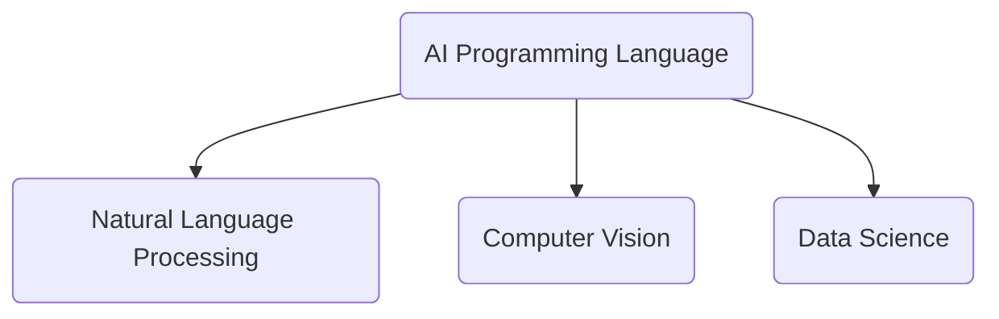
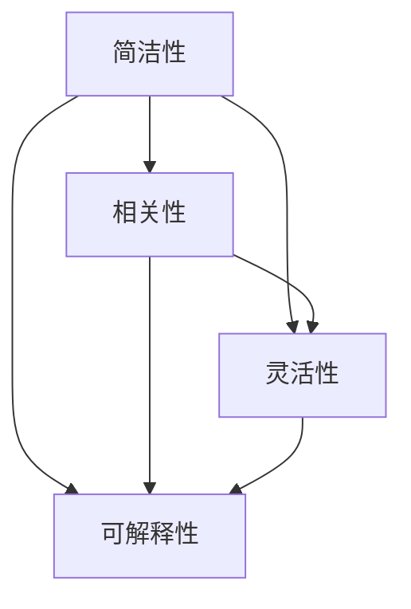
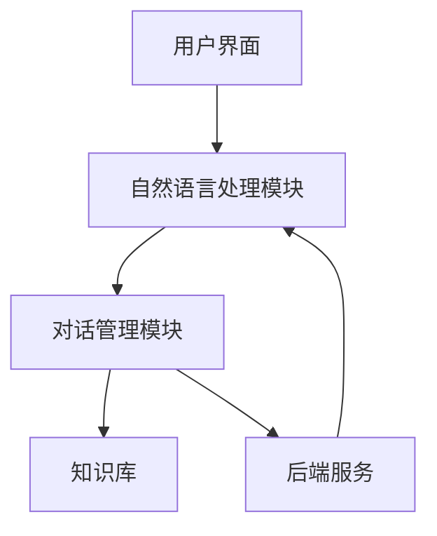
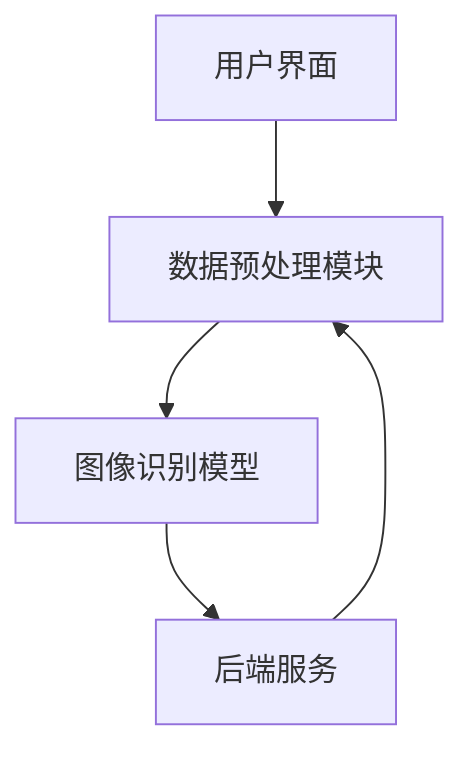
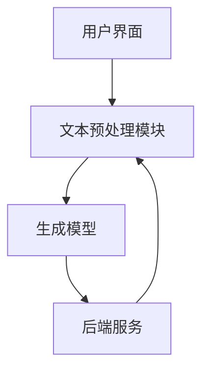
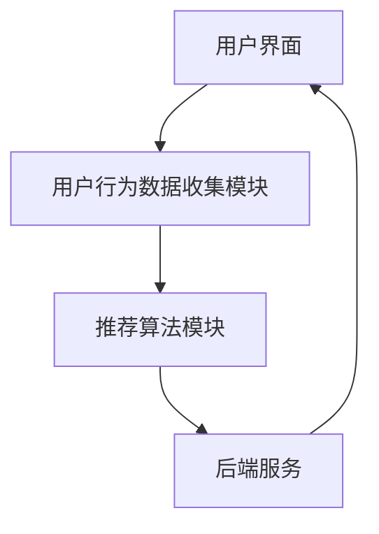

                 


### 引言

在当今技术飞速发展的时代，人工智能（AI）已经成为推动社会进步的重要力量。AI编程语言作为实现AI功能的核心工具，正逐渐受到越来越多开发者的关注和青睐。AI编程语言不仅具有高度的抽象性和灵活性，还能实现复杂的人工智能算法和应用。然而，AI编程语言的核心要素之一——提示词（Prompt），往往决定了程序的性能和效果。本文将以《AI编程语言：提示词的魔力与艺术》为题，深入探讨AI编程语言的本质、提示词技术及其应用。

首先，本文将概述AI编程语言的基本概念、特点、历史与发展，以及其在自然语言处理、计算机视觉和数据科学等领域的应用。接着，我们将详细分析提示词技术，从基本概念、设计原则、生成算法、性能评估等多个角度展开论述。随后，本文将通过实例与应用，展示Python、TensorFlow和PyTorch等主流AI编程语言中提示词的实际应用，并配以代码实现与解读。

此外，本文还将通过实际项目实战，深入剖析智能客服系统、图像识别系统、自然语言生成系统和智能推荐系统的开发过程，从开发环境搭建、源代码实现到代码分析，全面展示AI编程语言与提示词技术的应用实践。最后，本文将对AI编程语言的未来趋势、行业应用和人才培养进行展望，为读者提供全面的视角和深刻的思考。

通过上述逻辑清晰、结构紧凑的分析，本文旨在帮助读者深入理解AI编程语言的魅力与艺术，掌握提示词技术的精髓，为未来的AI编程实践奠定坚实基础。

### 关键词

- **AI编程语言**：实现人工智能功能的编程语言。
- **提示词**：用于引导AI模型生成预期结果的输入。
- **自然语言处理**：使计算机理解和生成人类语言的技术。
- **计算机视觉**：使计算机理解和解释视觉信息的领域。
- **数据科学**：利用数据分析和统计方法进行数据探索和预测的学科。
- **Python**、**TensorFlow**、**PyTorch**：主流的AI编程语言和框架。

### 摘要

本文深入探讨了AI编程语言及其核心要素——提示词的技术与应用。首先，我们概述了AI编程语言的基本概念、特点和发展历程，探讨了其在自然语言处理、计算机视觉和数据科学等领域的应用。接着，我们详细分析了提示词的定义、设计原则、生成算法和性能评估，并通过实例展示了Python、TensorFlow和PyTorch等编程语言中提示词的实际应用。最后，本文通过实际项目实战，展示了AI编程语言与提示词技术的应用实践，并对未来的发展趋势、行业应用和人才培养进行了展望。本文旨在为读者提供全面、深入的AI编程语言与提示词技术理解，为未来的AI编程实践提供指导。

## 第一部分: AI编程语言概述

### 1.1 AI编程语言定义与特点

#### 1.1.1 AI编程语言的概念

AI编程语言是一种专门用于开发人工智能应用的编程语言。与传统的编程语言相比，AI编程语言具有更强的抽象能力和更高的灵活性，能够实现复杂的人工智能算法和应用。AI编程语言通常包括自然语言处理、计算机视觉、机器学习等多个子领域，旨在通过编程实现智能体的自主学习和决策。

#### 1.1.2 AI编程语言的特点

- **高度抽象**：AI编程语言通过抽象数据结构和算法，使得开发者能够以更高效的方式开发人工智能应用。
- **灵活性**：AI编程语言支持多种编程范式，如函数式编程、面向对象编程等，适应不同的开发需求。
- **丰富的库和框架**：AI编程语言拥有丰富的库和框架，如TensorFlow、PyTorch等，提供大量的预构建模块，方便开发者进行高效开发。
- **强大的学习能力**：AI编程语言支持机器学习和深度学习算法，能够实现数据的自动学习和模式识别。

#### 1.1.3 AI编程语言与传统编程语言的差异

- **目标不同**：传统编程语言主要关注计算机程序的编写和执行，而AI编程语言则更侧重于数据的处理和分析，实现智能体的自主学习和决策。
- **复杂性**：AI编程语言涉及到复杂的算法和数据结构，需要开发者具备较高的数学和编程能力。
- **学习资源**：传统编程语言有大量的教材和课程，而AI编程语言的学习资源相对较少，开发者需要自行探索和实践。

### 1.2 AI编程语言的历史与发展

#### 1.2.1 AI编程语言的起源

AI编程语言的起源可以追溯到20世纪50年代。当时，随着计算机科学的发展，人们开始尝试通过编程实现智能体的自主学习和决策。早期的AI编程语言，如LISP，是为了支持符号计算和推理而设计的。

#### 1.2.2 AI编程语言的发展阶段

- **第一阶段（20世纪50年代-70年代）**：这一阶段，AI编程语言主要集中在符号计算和推理，如LISP和PROLOG。
- **第二阶段（20世纪80年代-90年代）**：随着机器学习和统计方法的兴起，AI编程语言开始引入概率模型和统计方法，如AM和C4.5。
- **第三阶段（21世纪初至今）**：深度学习和大数据技术的蓬勃发展，使得AI编程语言进一步扩展，如Python、TensorFlow和PyTorch。

#### 1.2.3 当前主流的AI编程语言

- **Python**：Python是一种通用编程语言，因其简洁易读和丰富的库支持，成为AI编程语言的首选。
- **TensorFlow**：TensorFlow是一个由Google开发的开放源代码库，用于机器学习和深度学习。
- **PyTorch**：PyTorch是一个由Facebook开发的深度学习框架，以其动态计算图和灵活性受到开发者喜爱。

### 1.3 AI编程语言的应用场景

#### 1.3.1 自然语言处理

自然语言处理（NLP）是AI编程语言的重要应用领域之一。NLP涉及到文本的自动处理、理解和生成，包括情感分析、文本分类、机器翻译等。Python、TensorFlow和PyTorch等AI编程语言在这方面的应用非常广泛。

#### 1.3.2 计算机视觉

计算机视觉（CV）是AI编程语言的另一个重要应用领域。计算机视觉旨在使计算机理解和解释视觉信息，包括图像识别、目标检测、图像分割等。Python、TensorFlow和PyTorch等AI编程语言在计算机视觉领域有着广泛的应用。

#### 1.3.3 数据科学

数据科学是AI编程语言的核心应用领域之一。数据科学涉及到数据收集、清洗、分析、建模和可视化，旨在从数据中发现有价值的信息和知识。Python、TensorFlow和PyTorch等AI编程语言在数据科学领域有着广泛的应用。

### 1.4 AI编程语言的发展趋势与挑战

#### 1.4.1 未来的AI编程语言趋势

- **更强大的学习能力和更丰富的应用场景**：未来的AI编程语言将更加注重学习能力的提升和应用场景的扩展，如自适应学习、多模态学习等。
- **更好的可解释性和可扩展性**：未来的AI编程语言将更加注重可解释性和可扩展性，以适应不同领域的需求。

#### 1.4.2 挑战与机遇

- **算法复杂度和计算资源需求**：AI编程语言的算法复杂度和计算资源需求越来越高，这对开发者和计算资源提出了更高的要求。
- **开源生态系统的完善**：开源生态系统的完善是AI编程语言发展的重要保障，未来将会有更多优秀的开源库和框架涌现。

## Mermaid流程图

下面是AI编程语言核心概念之间的关系架构：



### 核心概念与联系

在AI编程语言中，核心概念包括自然语言处理、计算机视觉和数据科学。这些概念之间有着紧密的联系和相互作用。自然语言处理（NLP）主要关注文本的自动处理、理解和生成，而计算机视觉（CV）则关注图像和视频的自动理解和解释。数据科学（Data Science）则利用这些技术和方法，从数据中提取有价值的信息和知识。

下面是一个简化的Mermaid流程图，展示了AI编程语言核心概念之间的关系：

```mermaid
graph TD
    NLP[Natural Language Processing]
    CV[Computer Vision]
    DS[Data Science]
    AI[Artificial Intelligence]
    
    AI --> NLP
    AI --> CV
    AI --> DS
    
    NLP --> Text Processing
    NLP --> Language Understanding
    NLP --> Language Generation
    
    CV --> Image Recognition
    CV --> Object Detection
    CV --> Image Segmentation
    
    DS --> Data Collection
    DS --> Data Cleaning
    DS --> Data Analysis
    DS --> Data Visualization
```

在这个流程图中，我们可以看到：

- **自然语言处理**（NLP）涉及文本处理、语言理解和语言生成三个子领域。
- **计算机视觉**（CV）包括图像识别、目标检测和图像分割三个子领域。
- **数据科学**（DS）则包括数据收集、数据清洗、数据分析、数据可视化四个子领域。

这些核心概念和子领域相互交织，共同构成了AI编程语言的丰富内涵和应用场景。

### 1.4 AI编程语言的发展趋势与挑战

随着人工智能技术的飞速发展，AI编程语言也迎来了新的发展趋势和挑战。

#### 1.4.1 未来的AI编程语言趋势

1. **更强大的学习能力和更丰富的应用场景**：未来的AI编程语言将具备更强的学习能力和更广泛的应用场景。例如，自适应学习、多模态学习、迁移学习等技术的应用，将使AI编程语言能够更好地应对复杂的问题和场景。

2. **更好的可解释性和可扩展性**：随着AI应用在各个领域的普及，对模型的可解释性和可扩展性的要求越来越高。未来的AI编程语言将注重提高模型的可解释性，使其能够被非专业人士理解和使用，同时提供灵活的扩展机制，满足不同领域和场景的需求。

3. **更高效的计算性能**：随着数据量的增加和模型复杂度的提升，对计算性能的要求也越来越高。未来的AI编程语言将注重优化算法和计算效率，提高模型的训练和推理速度。

4. **更广泛的硬件支持**：AI编程语言将逐步支持更多的硬件平台，如GPU、TPU等，以充分利用硬件资源，提高模型的训练和推理效率。

#### 1.4.2 挑战与机遇

1. **算法复杂度和计算资源需求**：随着AI模型的复杂度和数据量的增加，对计算资源的需求也越来越高。这给开发者带来了巨大的挑战，同时也带来了机遇。开发者需要不断优化算法和计算效率，充分利用现有的硬件资源，以应对日益增长的计算需求。

2. **开源生态系统的完善**：开源生态系统是AI编程语言发展的重要保障。随着开源生态的不断完善，开发者可以更便捷地获取和使用各种AI工具和库，推动AI编程语言的发展。

3. **跨领域的融合与创新**：AI编程语言的发展将涉及到多个领域的融合与创新。例如，结合生物信息学、心理学等领域的技术，开发出更智能、更高效的AI模型和应用。

4. **安全与隐私保护**：随着AI应用的普及，数据安全和隐私保护成为一个重要议题。未来的AI编程语言需要提供更加安全可靠的数据处理和存储机制，保护用户的数据隐私。

总之，AI编程语言的发展趋势与挑战并存，未来的AI编程语言将更加智能化、高效化、可解释化和安全化，为人工智能技术的发展和应用提供强大的支持。

### 1.5 深度学习在AI编程语言中的应用

深度学习是人工智能领域的一个重要分支，它在图像识别、自然语言处理、语音识别等领域取得了显著的成果。深度学习算法需要大量的数据和高性能的计算资源，这使得深度学习在AI编程语言中的应用变得越来越重要。

#### 1.5.1 深度学习的基本原理

深度学习基于多层神经网络，通过逐层提取特征，实现对数据的自动分类、识别和生成。深度学习的核心在于多层神经网络的设计和训练。神经网络由输入层、隐藏层和输出层组成，每一层都能从输入数据中提取不同层次的抽象特征。

- **输入层**：接收原始数据，并将其传递给下一层。
- **隐藏层**：通过非线性变换，对输入数据进行特征提取和组合。
- **输出层**：生成最终的输出结果。

在深度学习训练过程中，通过反向传播算法，不断调整网络权重，使网络能够更好地拟合训练数据。训练过程涉及到大量的数学运算，如矩阵乘法、求导等。

#### 1.5.2 深度学习算法的核心

深度学习算法的核心是卷积神经网络（CNN）、循环神经网络（RNN）和生成对抗网络（GAN）。

- **卷积神经网络（CNN）**：适用于图像处理领域，通过卷积操作提取图像特征，实现图像分类、目标检测等任务。
- **循环神经网络（RNN）**：适用于序列数据，如时间序列分析、文本处理等，通过循环结构保存历史信息，实现对序列数据的建模。
- **生成对抗网络（GAN）**：由生成器和判别器两个网络组成，通过对抗训练生成逼真的数据，广泛应用于图像生成、语音合成等任务。

#### 1.5.3 深度学习在AI编程语言中的应用

深度学习在AI编程语言中的应用非常广泛，以下是一些典型应用：

1. **图像识别**：使用深度学习算法，计算机能够自动识别和分类图像中的物体。例如，人脸识别、车辆识别等。

2. **自然语言处理**：深度学习在自然语言处理中有着广泛应用，如文本分类、情感分析、机器翻译等。例如，使用卷积神经网络（CNN）进行文本分类，使用循环神经网络（RNN）进行机器翻译。

3. **语音识别**：深度学习算法能够将语音信号转换为文本，应用于语音助手、自动字幕等场景。

4. **推荐系统**：深度学习算法可以用于构建推荐系统，通过分析用户的行为和兴趣，推荐个性化的商品或内容。

5. **医疗影像分析**：深度学习在医疗影像分析中有着重要应用，如疾病诊断、病理分析等。

以下是一个简单的卷积神经网络（CNN）的伪代码，用于图像分类：

```python
# 初始化模型
model = ConvolutionalNeuralNetwork()

# 加载训练数据
train_data = load_training_data()

# 训练模型
for epoch in range(num_epochs):
    for image, label in train_data:
        # 前向传播
        output = model.forward_pass(image)
        
        # 计算损失
        loss = compute_loss(output, label)
        
        # 反向传播
        model.backward_pass(loss)
        
        # 更新模型参数
        model.update_weights()

# 评估模型
test_data = load_test_data()
accuracy = model.evaluate(test_data)
print("Test Accuracy:", accuracy)
```

在这个伪代码中，我们首先初始化一个卷积神经网络模型，然后加载训练数据。接着，我们通过前向传播、计算损失和反向传播，不断更新模型参数。最后，我们使用测试数据评估模型的性能。

总之，深度学习在AI编程语言中的应用为人工智能的发展带来了新的机遇和挑战。随着深度学习技术的不断进步，AI编程语言将变得更加智能化、高效化和应用化。

## 2.1 提示词的基本概念

### 2.1.1 提示词的定义

提示词（Prompt）是AI编程语言中用于引导模型生成预期结果的一种输入。它通常是一个短语、句子或段落，用来提示模型关注特定的信息或任务。提示词的设计和选择对AI模型的性能和效果有着重要的影响。

### 2.1.2 提示词的作用

1. **引导模型关注特定信息**：通过提示词，开发者可以引导模型关注输入数据中的特定信息，从而提高模型的准确性和效率。
2. **提供上下文信息**：提示词可以提供上下文信息，帮助模型更好地理解输入数据，从而生成更准确的结果。
3. **优化模型性能**：合理的提示词设计可以优化模型性能，提高模型在特定任务上的效果。
4. **提高用户体验**：提示词的设计不仅影响模型的性能，还直接影响用户体验。一个清晰、准确的提示词可以帮助用户更好地理解和操作模型。

### 2.1.3 提示词的类型

1. **单一提示词**：单一提示词是最简单的一种，它通常是一个单词或短语，用于引导模型关注特定信息。
2. **复合提示词**：复合提示词是由多个单词或短语组成的，可以提供更多的上下文信息，帮助模型更好地理解输入数据。
3. **动态提示词**：动态提示词是根据输入数据和任务动态生成的，可以自适应地调整模型的行为和输出。

### 2.1.4 提示词设计的原则

1. **简洁性**：提示词应简洁明了，避免冗余和复杂的语言，以便模型容易理解和处理。
2. **相关性**：提示词应与任务高度相关，能够提供有用的信息，帮助模型更好地完成特定任务。
3. **灵活性**：提示词应具有一定的灵活性，能够适应不同的输入数据和任务场景。
4. **可解释性**：提示词应具有可解释性，便于开发者理解和调整。

下面是一个简单的Mermaid流程图，展示了提示词的设计原则：



在这个流程图中，我们可以看到：

- **简洁性**：提示词应简洁明了，避免冗余和复杂的语言。
- **相关性**：提示词应与任务高度相关，能够提供有用的信息。
- **灵活性**：提示词应具有一定的灵活性，能够适应不同的输入数据和任务场景。
- **可解释性**：提示词应具有可解释性，便于开发者理解和调整。

通过遵循这些原则，我们可以设计出更有效的提示词，提高AI模型的性能和效果。

## 2.2 提示词设计原则

提示词设计是AI编程语言中的一个关键环节，它直接影响模型的性能和用户体验。以下将详细探讨提示词设计的几个关键原则：

### 2.2.1 有效提示词设计原则

1. **明确性**：提示词应当清晰明确，避免歧义。一个明确的提示词可以帮助模型更准确地理解任务，从而提高模型的准确性和效率。

   例如，一个明确的提示词可能是：“请生成关于‘人工智能’的未来发展趋势”，而不是模糊的提示词：“请谈谈‘人工智能’的未来”。

2. **相关性**：提示词应与任务高度相关，提供有用的信息，以便模型能够利用这些信息进行有效的学习和生成。

   如果提示词与任务不相关，模型可能会产生不准确的输出。例如，当任务是“翻译英文句子”时，提示词应为“请翻译这个英文句子”，而不是“请回答一个问题”。

3. **长度与复杂度**：提示词的长度和复杂度应根据任务的需求进行适当调整。过长的提示词可能导致模型理解困难，而过短的提示词可能无法提供足够的信息。

   一般而言，一个中等长度的提示词（5-15个单词）能够提供足够的信息，同时保持清晰明确。

4. **语法与结构**：提示词的语法和结构应合理，以便模型能够正确理解。使用常见的语法结构，避免复杂的句子结构，有助于模型更好地处理提示词。

   例如，使用简单句比复杂句更容易被模型理解。如：“请生成一段关于人工智能应用的描述。”比“请根据我们之前讨论的人工智能应用，生成一段相关的描述。”更容易理解。

### 2.2.2 提示词的长度与复杂度

1. **长度**：提示词的长度应根据具体任务的需求进行选择。一般来说，一个中等长度的提示词能够提供足够的信息，同时不会过于冗长。

   - **中等长度**（5-15个单词）：这是一个比较理想的长度，能够提供足够的信息，同时不会使模型感到压力。
   - **短提示词**（少于5个单词）：对于简单的任务，短提示词可能足够。例如：“生成一首诗。”
   - **长提示词**（超过15个单词）：对于复杂任务，长提示词可能更合适，但需要确保信息量适中，避免过度冗长。

2. **复杂度**：提示词的复杂度也应根据任务的需求进行调整。复杂的提示词可能包含更多的细节和背景信息，但对于一些简单的任务，过于复杂的提示词可能会使模型难以理解。

   - **中等复杂度**：适合大多数任务，能够提供有用的信息，同时不会过于复杂。
   - **低复杂度**：对于一些简单的任务，如基础的数据处理，使用低复杂度的提示词可能更合适。
   - **高复杂度**：对于复杂的任务，如复杂的文本生成或图像识别，使用高复杂度的提示词可能有助于提供更多的背景信息。

### 2.2.3 提示词的语法与结构

1. **简单句结构**：使用简单句结构能够提高提示词的可理解性。例如，简单的陈述句比复杂的疑问句或否定句更容易被模型理解。

   - **简单句**：“请生成一段关于人工智能发展的描述。”
   - **复杂句**：“你能给我生成一段关于人工智能在过去几年中发展速度的描述吗？”

2. **逻辑顺序**：提示词应遵循逻辑顺序，使模型能够更容易地理解和处理。

   - **逻辑顺序**：“首先，请生成一个摘要；然后，根据摘要生成详细内容。”
   - **混乱顺序**：“请生成详细内容；然后，根据内容生成摘要。”（这可能导致模型混淆）

3. **明确指令**：使用明确的指令有助于模型理解任务的具体要求。

   - **明确指令**：“请生成一个长度为500字的文章。”
   - **模糊指令**：“请写一篇关于人工智能的文章。”（没有提供具体的长度或格式要求）

通过遵循这些提示词设计原则，我们可以提高AI模型的性能和用户体验，使模型能够更准确地理解任务，并生成更高质量的输出。

### 2.3 提示词生成算法

在AI编程语言中，提示词生成算法是模型性能优化的重要一环。这些算法负责根据特定任务和输入数据，动态生成有效的提示词，以提高模型的性能和输出质量。以下是几种常见的提示词生成算法：

#### 2.3.1 生成式算法

生成式算法通过生成与任务相关的提示词，使模型能够更好地理解输入数据和任务需求。以下是一些生成式算法：

1. **模板匹配**：模板匹配是一种简单有效的生成式算法，它通过预定义的模板，根据输入数据生成提示词。例如，对于图像分类任务，可以使用模板“请识别图像中的[对象名称]”。

2. **文本摘要**：文本摘要算法通过提取输入文本的关键信息，生成简洁的提示词。例如，对于一篇关于人工智能发展的文章，文本摘要算法可以生成“人工智能在未来具有广泛的应用前景”。

3. **生成对抗网络（GAN）**：生成对抗网络是一种强大的生成式模型，它由生成器和判别器两个部分组成。生成器负责生成提示词，而判别器负责评估生成提示词的质量。通过不断训练，生成器能够生成更高质量的提示词。

以下是一个生成对抗网络的伪代码示例：

```python
# 初始化生成器和判别器
generator = GANGenerator()
discriminator = GANDiscriminator()

# 训练生成对抗网络
for epoch in range(num_epochs):
    for prompt in prompts:
        # 生成提示词
        generated_prompt = generator.generate(prompt)
        
        # 训练判别器
        real_prompt = discriminator.train(real_prompt)
        fake_prompt = discriminator.train(generated_prompt)
        
        # 训练生成器
        generator.train(fake_prompt, real_prompt)

# 评估生成器性能
generated_prompts = generator.generate(test_data)
accuracy = evaluate_prompts(generated_prompts, test_labels)
print("Prompt Generation Accuracy:", accuracy)
```

在这个伪代码中，生成器生成提示词，判别器评估提示词质量，通过不断训练，生成器能够生成更高质量的提示词。

#### 2.3.2 终结性算法

终结性算法通过预定义的终结性模板，直接生成最终的输出结果，而无需生成中间的提示词。以下是一些终结性算法：

1. **决策树**：决策树是一种常见的终结性算法，它通过一系列条件判断，生成最终的输出结果。例如，对于图像分类任务，可以使用决策树生成“该图像是猫”或“该图像是狗”。

2. **条件生成网络**：条件生成网络（Conditional Generation Network）是一种结合生成式和终结性算法的模型，它通过输入条件和目标输出，直接生成最终的结果。例如，在文本生成任务中，条件生成网络可以根据输入的标题生成相应的文章内容。

以下是一个条件生成网络的伪代码示例：

```python
# 初始化条件生成网络
conditional_generator = ConditionalGenerator()

# 训练条件生成网络
for epoch in range(num_epochs):
    for title, content in training_data:
        # 生成文章内容
        generated_content = conditional_generator.generate(title)
        
        # 训练网络
        conditional_generator.train(title, content)

# 评估生成网络性能
generated_contents = conditional_generator.generate(test_titles)
accuracy = evaluate_contents(generated_contents, test_contents)
print("Content Generation Accuracy:", accuracy)
```

在这个伪代码中，条件生成网络根据输入的标题生成相应的文章内容，通过不断训练，网络能够生成更高质量的输出。

#### 2.3.3 混合算法

混合算法结合了生成式和终结性算法的优点，通过动态生成提示词，然后使用终结性算法生成最终的输出结果。以下是一些混合算法：

1. **序列到序列（Seq2Seq）模型**：序列到序列模型是一种常见的混合算法，它通过编码器和解码器两个部分，将输入序列转换为输出序列。在提示词生成中，编码器将输入数据和任务要求编码为提示词，解码器将提示词解码为最终的输出结果。

以下是一个序列到序列模型的伪代码示例：

```python
# 初始化编码器和解码器
encoder = Seq2SeqEncoder()
decoder = Seq2SeqDecoder()

# 训练序列到序列模型
for epoch in range(num_epochs):
    for input_seq, target_seq in training_data:
        # 编码输入序列
        encoded_input = encoder.encode(input_seq)
        
        # 解码输出序列
        generated_output = decoder.decode(encoded_input)
        
        # 训练网络
        encoder.train(input_seq, encoded_input)
        decoder.train(encoded_input, generated_output)

# 评估模型性能
generated_outputs = decoder.decode(encoder.encode(test_input_seq))
accuracy = evaluate_outputs(generated_outputs, test_target_seq)
print("Seq2Seq Model Accuracy:", accuracy)
```

在这个伪代码中，编码器将输入序列编码为提示词，解码器将提示词解码为最终的输出结果，通过不断训练，模型能够生成更高质量的提示词和输出。

通过这些提示词生成算法，开发者可以根据具体任务需求，选择合适的算法，优化模型的性能和输出质量。不同的算法适用于不同的任务场景，开发者需要根据实际情况进行选择和调整。

### 2.4 提示词性能评估

在AI编程语言中，提示词的性能评估是确保模型输出质量的重要环节。通过有效的性能评估方法，可以识别出提示词设计中的问题和优化空间。以下是几种常见的提示词性能评估方法：

#### 2.4.1 评估指标

1. **准确率（Accuracy）**：准确率是评估分类任务性能的常用指标，表示正确分类的样本数占总样本数的比例。公式为：
   $$ \text{Accuracy} = \frac{\text{正确分类的样本数}}{\text{总样本数}} $$
   准确率越高，说明模型对输入数据的分类能力越强。

2. **精确率（Precision）**：精确率表示实际为正类的样本中被正确分类为正类的比例。公式为：
   $$ \text{Precision} = \frac{\text{真正例数}}{\text{真正例数 + 假正例数}} $$
   精确率越高，说明模型对正类样本的分类越准确。

3. **召回率（Recall）**：召回率表示实际为正类的样本中被正确分类为正类的比例。公式为：
   $$ \text{Recall} = \frac{\text{真正例数}}{\text{真正例数 + 假反例数}} $$
   召回率越高，说明模型对正类样本的召回能力越强。

4. **F1值（F1 Score）**：F1值是精确率和召回率的加权平均值，用于综合评估分类任务性能。公式为：
   $$ \text{F1 Score} = 2 \times \frac{\text{Precision} \times \text{Recall}}{\text{Precision} + \text{Recall}} $$
   F1值越高，说明模型在精确率和召回率之间取得了较好的平衡。

5. **ROC曲线和AUC值**：ROC曲线是评估分类模型性能的重要工具，它通过绘制真阳性率（True Positive Rate）对假阳性率（False Positive Rate）的曲线，展示模型的分类能力。AUC值是ROC曲线下面积，用于衡量模型的分类能力。AUC值越高，说明模型的分类能力越强。

#### 2.4.2 评估方法

1. **交叉验证（Cross-Validation）**：交叉验证是一种常用的评估方法，通过将数据集划分为多个子集，多次训练和测试模型，以评估模型的泛化能力。常见的交叉验证方法有K折交叉验证和留一法交叉验证。

2. **Holdout方法**：Holdout方法将数据集划分为训练集和测试集，其中训练集用于模型训练，测试集用于模型评估。这种方法简单易行，但可能会导致评估结果偏差。

3. **混淆矩阵（Confusion Matrix）**：混淆矩阵是评估分类模型性能的直观工具，它展示了模型对各类别样本的预测结果。通过分析混淆矩阵，可以识别出模型在特定类别上的误分类情况。

以下是一个简单的混淆矩阵示例：

|      | 预测正类 | 预测负类 |
|------|----------|----------|
| 正类 | TP       | FN       |
| 负类 | FP       | TN       |

- **TP**（真正例数）：实际为正类，且被模型正确预测为正类的样本。
- **TN**（真反例数）：实际为负类，且被模型正确预测为负类的样本。
- **FP**（假正例数）：实际为负类，但被模型错误预测为正类的样本。
- **FN**（假反例数）：实际为正类，但被模型错误预测为负类的样本。

通过分析混淆矩阵，可以计算准确率、精确率、召回率和F1值等评估指标。

4. **对比实验**：通过设计对比实验，比较不同提示词设计的模型性能，可以识别出哪些提示词设计更有效。

#### 2.4.3 性能优化策略

1. **数据预处理**：对输入数据集进行预处理，如去除噪声、标准化、去异常值等，以提高模型性能。

2. **特征工程**：通过特征提取和选择，提取数据中的关键特征，去除冗余特征，以提高模型性能。

3. **模型调参**：通过调整模型的超参数，如学习率、批量大小、迭代次数等，优化模型性能。

4. **集成学习**：通过集成多个模型，如随机森林、梯度提升树等，提高模型的预测能力。

5. **提示词优化**：通过不断调整和优化提示词，提高模型对输入数据的理解和处理能力。

通过上述评估方法和性能优化策略，开发者可以全面评估提示词的性能，并针对性地进行优化，从而提高AI模型的整体性能和输出质量。

### 2.5 提示词优化策略

在AI编程语言中，提示词优化是一个关键的环节，它直接影响模型的性能和输出质量。以下是几种常见的提示词优化策略：

#### 2.5.1 数据增强

数据增强是一种通过生成新的训练样本，提高模型鲁棒性和泛化能力的方法。以下是一些常见的数据增强技术：

1. **数据归一化**：将输入数据标准化到同一范围，例如将图像像素值从0到255标准化到0到1。

2. **数据旋转**：将图像随机旋转一定角度，模拟不同的观察角度。

3. **数据缩放**：随机缩放图像，模拟不同尺寸的输入。

4. **数据裁剪**：随机裁剪图像的一部分，模拟部分遮挡的情况。

5. **数据混合**：将多张图像混合在一起，生成新的训练样本。

以下是一个简单的数据增强伪代码示例：

```python
import cv2

def augment_image(image):
    # 随机旋转
    angle = np.random.uniform(-30, 30)
    center = (image.shape[1] // 2, image.shape[0] // 2)
    M = cv2.getRotationMatrix2D(center, angle, 1.0)
    rotated_image = cv2.warpAffine(image, M, (image.shape[1], image.shape[0]))

    # 随机缩放
    scale_factor = np.random.uniform(0.8, 1.2)
    width = int(image.shape[1] * scale_factor)
    height = int(image.shape[0] * scale_factor)
    resized_image = cv2.resize(rotated_image, (width, height))

    # 随机裁剪
    x_start = np.random.randint(0, resized_image.shape[1] - 224)
    y_start = np.random.randint(0, resized_image.shape[0] - 224)
    cropped_image = resized_image[y_start:y_start+224, x_start:x_start+224]

    return cropped_image
```

在这个伪代码中，我们首先随机旋转图像，然后缩放图像，最后随机裁剪图像的一部分，生成新的训练样本。

#### 2.5.2 特征选择

特征选择是减少输入特征维度，提高模型训练效率和性能的重要方法。以下是一些常见的特征选择技术：

1. **相关性分析**：通过计算特征之间的相关性，识别出高度相关的特征，并保留其中最重要的特征。

2. **主成分分析（PCA）**：通过将高维数据投影到低维空间，保留主要成分，减少特征维度。

3. **随机森林特征重要性**：使用随机森林模型计算每个特征的重要性，并选择最重要的特征。

4. **L1正则化**：通过L1正则化，将特征权重向0收缩，自动实现特征选择。

以下是一个使用L1正则化的特征选择伪代码示例：

```python
from sklearn.linear_model import LassoCV

def select_features(X, y):
    # 使用L1正则化进行特征选择
    lasso = LassoCV(alphas=np.logspace(-4, 4, 100), cv=5)
    lasso.fit(X, y)
    
    # 选择最重要的特征
    selected_features = X.columns[lasso.coef_ != 0]
    
    return selected_features
```

在这个伪代码中，我们首先使用L1正则化的Lasso模型进行特征选择，然后选择系数不为0的特征。

#### 2.5.3 模型调参

模型调参是优化模型性能的重要方法，通过调整模型的超参数，可以提高模型的训练效率和预测性能。以下是一些常见的模型调参技术：

1. **网格搜索（Grid Search）**：通过遍历预设的参数组合，选择最优参数。

2. **贝叶斯优化（Bayesian Optimization）**：基于贝叶斯模型，优化参数搜索过程。

3. **随机搜索（Random Search）**：在预设的参数范围内随机选择参数，进行优化。

以下是一个使用网格搜索的模型调参伪代码示例：

```python
from sklearn.model_selection import GridSearchCV
from sklearn.ensemble import RandomForestClassifier

# 定义模型和参数范围
model = RandomForestClassifier()
params = {'n_estimators': [10, 50, 100], 'max_depth': [None, 10, 20, 30]}

# 进行网格搜索
grid_search = GridSearchCV(model, params, cv=5)
grid_search.fit(X, y)

# 获取最优参数
best_params = grid_search.best_params_
print("Best Parameters:", best_params)
```

在这个伪代码中，我们首先定义模型和参数范围，然后使用网格搜索进行参数优化，最后获取最优参数。

通过上述提示词优化策略，开发者可以有效地提升AI模型的性能和输出质量，为实际应用提供更准确的预测和更高效的解决方案。

### 3.1 Python与AI编程语言

Python作为一种通用编程语言，因其简洁易读和丰富的库支持，成为AI编程语言的首选。在Python中，有许多强大的库和框架，如TensorFlow、PyTorch等，为AI应用提供了丰富的工具和资源。

#### 3.1.1 Python的优势

1. **简洁性**：Python拥有简单的语法和易于理解的代码结构，使得开发者可以快速上手并专注于算法的实现，而无需过多关注语言细节。

2. **丰富的库支持**：Python拥有丰富的标准库和第三方库，如NumPy、Pandas、Scikit-learn、TensorFlow、PyTorch等，这些库为数据操作、机器学习、深度学习提供了广泛的工具和接口。

3. **社区支持**：Python有着庞大的开发者社区，提供了大量的学习资源和交流平台，使得开发者能够方便地获取帮助和分享经验。

4. **跨平台性**：Python是一种跨平台的编程语言，可以在多种操作系统上运行，包括Windows、Linux和Mac OS。

#### 3.1.2 Python的AI编程库

1. **NumPy**：NumPy是Python中用于科学计算的库，提供多维数组和矩阵操作的工具。NumPy是Python进行数据科学和机器学习的基础库，用于数据的预处理、操作和可视化。

2. **Pandas**：Pandas是Python中用于数据处理和分析的库，提供数据帧和数据表的数据结构，方便进行数据清洗、转换和分析。

3. **Scikit-learn**：Scikit-learn是Python中用于机器学习的库，提供多种机器学习算法和工具，包括监督学习、无监督学习、模型评估和可视化等。

4. **TensorFlow**：TensorFlow是Google开发的开源机器学习和深度学习框架，提供丰富的工具和接口，支持模型的定义、训练和推理。TensorFlow在自然语言处理、计算机视觉、强化学习等领域有着广泛的应用。

5. **PyTorch**：PyTorch是Facebook开发的开源深度学习框架，以其动态计算图和灵活性受到开发者喜爱。PyTorch在图像识别、语音处理、自然语言处理等领域有着广泛应用。

#### 3.1.3 Python的AI编程实践

以下是Python在AI编程中的几个实际应用场景：

1. **自然语言处理**：使用Python和TensorFlow，可以构建自然语言处理模型，如文本分类、情感分析、机器翻译等。例如，使用TensorFlow的Transformer模型，可以实现高精度的机器翻译。

2. **计算机视觉**：使用Python和PyTorch，可以构建计算机视觉模型，如图像分类、目标检测、图像分割等。例如，使用PyTorch的ResNet模型，可以实现对图像的高精度分类。

3. **强化学习**：使用Python和TensorFlow，可以构建强化学习模型，如智能体训练、游戏策略等。例如，使用TensorFlow的DQN模型，可以实现对游戏的智能体训练。

通过Python和其丰富的AI编程库，开发者可以方便地进行AI模型的开发和应用，为各种领域提供创新的解决方案。

### 3.2 TensorFlow与提示词应用

TensorFlow是一个由Google开发的开放源代码库，广泛应用于机器学习和深度学习。在TensorFlow中，提示词（Prompt）是引导模型生成预期结果的重要工具。以下将详细探讨TensorFlow的基本概念、提示词在TensorFlow中的应用，以及一个简单的TensorFlow示例。

#### 3.2.1 TensorFlow的基本概念

TensorFlow是一个基于数据流图（Dataflow Graph）的深度学习框架，它将计算任务表示为一系列操作（Operations）和变量（Variables）的图。以下是TensorFlow的几个关键概念：

1. **计算图（Computational Graph）**：计算图是TensorFlow的核心概念，它表示程序的执行流程。计算图由操作节点（Operations）和变量节点（Variables）组成，操作节点表示数学运算，变量节点表示存储数据的内存位置。

2. **操作（Operations）**：操作是计算图的基本构建块，用于执行数学运算。例如，`add`操作用于计算两个张量的和，`matmul`操作用于矩阵乘法。

3. **变量（Variables）**：变量是存储数据的内存位置，可以是标量、向量、矩阵等。在训练过程中，变量通常表示模型参数，通过梯度下降等方法进行更新。

4. **会话（Session）**：会话是执行计算图的执行环境。在会话中，可以初始化变量、运行操作和获取结果。

#### 3.2.2 TensorFlow的提示词应用

在TensorFlow中，提示词主要用于引导模型生成预期结果。以下是一个简单的示例：

```python
import tensorflow as tf

# 定义提示词
prompt = "人工智能在未来具有广泛的应用前景"

# 创建计算图
with tf.Graph().as_default():
    # 定义操作
    input_layer = tf.placeholder(tf.string, shape=[None], name="input_layer")
    embed_layer = tf.placeholder(tf.float32, shape=[None, 100], name="embed_layer")
    output_layer = tf.placeholder(tf.float32, shape=[None, 10], name="output_layer")

    # 定义模型
    model = Model(input_layer, embed_layer, output_layer)

    # 训练模型
    with tf.Session() as sess:
        # 初始化变量
        sess.run(tf.global_variables_initializer())

        # 运行训练
        for epoch in range(num_epochs):
            for input_data, embed_data, label_data in train_data:
                # 训练步骤
                sess.run(optimizer, feed_dict={input_layer: input_data, embed_layer: embed_data, output_layer: label_data})

        # 评估模型
        accuracy = sess.run(model.accuracy, feed_dict={input_layer: test_data, embed_layer: test_embed_data, output_layer: test_labels})
        print("Test Accuracy:", accuracy)
```

在这个示例中，我们首先定义了输入层、嵌入层和输出层，然后创建了一个模型，并使用训练数据进行模型训练。在训练过程中，我们通过提示词（`feed_dict`）提供输入数据和标签，引导模型生成预期结果。

#### 3.2.3 TensorFlow的实战案例

以下是一个简单的TensorFlow实战案例，用于实现一个基于卷积神经网络的图像分类模型。

```python
import tensorflow as tf
from tensorflow.keras import layers

# 定义计算图
model = tf.keras.Sequential([
    layers.Conv2D(32, (3, 3), activation='relu', input_shape=(28, 28, 1)),
    layers.MaxPooling2D((2, 2)),
    layers.Conv2D(64, (3, 3), activation='relu'),
    layers.MaxPooling2D((2, 2)),
    layers.Conv2D(64, (3, 3), activation='relu'),
    layers.Flatten(),
    layers.Dense(64, activation='relu'),
    layers.Dense(10, activation='softmax')
])

# 编译模型
model.compile(optimizer='adam',
              loss='categorical_crossentropy',
              metrics=['accuracy'])

# 训练模型
model.fit(train_images, train_labels, epochs=10, batch_size=64)

# 评估模型
test_loss, test_acc = model.evaluate(test_images, test_labels)
print(f"Test accuracy: {test_acc}")
```

在这个实战案例中，我们首先定义了一个卷积神经网络模型，包括卷积层、池化层和全连接层。然后，我们使用训练数据训练模型，并通过评估数据评估模型的性能。

通过以上示例，我们可以看到TensorFlow在实现AI模型中的强大功能和应用。提示词的应用使得模型能够根据具体任务生成预期结果，为AI编程提供了丰富的可能性。

### 3.3 PyTorch与提示词应用

PyTorch是一个由Facebook开发的开源深度学习框架，以其动态计算图和灵活性受到开发者的喜爱。在PyTorch中，提示词（Prompt）是引导模型生成预期结果的重要工具。以下将详细探讨PyTorch的基本概念、提示词在PyTorch中的应用，以及一个简单的PyTorch示例。

#### 3.3.1 PyTorch的基本概念

PyTorch是基于Python的深度学习框架，它提供了动态计算图和自动微分的功能。以下是PyTorch的几个关键概念：

1. **张量（Tensors）**：张量是PyTorch中的基础数据结构，类似于NumPy中的多维数组。PyTorch的张量支持高效的数学运算和自动微分。

2. **自动微分（Autograd）**：自动微分是PyTorch的核心功能之一，它通过自动计算导数，支持复杂数学运算和优化算法。

3. **动态计算图（Dynamic Computation Graph）**：与TensorFlow的静态计算图不同，PyTorch使用动态计算图。动态计算图允许在运行时构建和修改计算图，提供了更大的灵活性和控制力。

4. **神经网络（Neural Networks）**：PyTorch提供了丰富的神经网络模块，包括卷积神经网络（CNN）、循环神经网络（RNN）和生成对抗网络（GAN）等。

5. **数据加载和预处理**：PyTorch提供了`torch.utils.data`模块，用于加载和预处理数据。它支持数据集的批量加载、混洗和预处理。

#### 3.3.2 PyTorch的提示词应用

在PyTorch中，提示词通常用于引导模型生成预期结果。以下是一个简单的示例：

```python
import torch
import torch.nn as nn
import torch.optim as optim

# 定义模型
class Model(nn.Module):
    def __init__(self):
        super(Model, self).__init__()
        self嵌入层 = nn.Embedding(vocab_size, embed_size)
        self线性层 = nn.Linear(embed_size, output_size)
        
    def forward(self, x):
        x = self嵌入层(x)
        x = self线性层(x)
        return x

# 创建模型实例
model = Model()

# 定义优化器
optimizer = optim.Adam(model.parameters(), lr=0.001)

# 定义损失函数
loss_function = nn.CrossEntropyLoss()

# 提示词
prompt = torch.tensor([1, 2, 3, 4, 5], dtype=torch.long)

# 训练模型
for epoch in range(num_epochs):
    for inputs, labels in train_loader:
        # 前向传播
        outputs = model(inputs)
        loss = loss_function(outputs, labels)
        
        # 反向传播
        optimizer.zero_grad()
        loss.backward()
        optimizer.step()

        if (epoch + 1) % 10 == 0:
            print(f'Epoch [{epoch + 1}/{num_epochs}], Loss: {loss.item():.4f}')

# 评估模型
with torch.no_grad():
    correct = 0
    total = len(test_loader.dataset)
    for inputs, labels in test_loader:
        outputs = model(inputs)
        _, predicted = torch.max(outputs.data, 1)
        correct += (predicted == labels).sum().item()

    print(f'Accuracy: {100 * correct / total}')
```

在这个示例中，我们首先定义了一个简单的模型，包括嵌入层和线性层。然后，我们使用训练数据进行模型训练，并通过提示词（`inputs`）引导模型生成预期结果。在训练过程中，我们通过反向传播和优化器更新模型参数，以提高模型性能。

#### 3.3.3 PyTorch的实战案例

以下是一个简单的PyTorch实战案例，用于实现一个基于卷积神经网络的图像分类模型。

```python
import torch
import torch.nn as nn
import torch.optim as optim
from torchvision import datasets, transforms
from torch.utils.data import DataLoader

# 定义卷积神经网络
class ConvNet(nn.Module):
    def __init__(self):
        super(ConvNet, self).__init__()
        self.conv1 = nn.Conv2d(3, 6, 5)
        self.pool = nn.MaxPool2d(2, 2)
        self.conv2 = nn.Conv2d(6, 16, 5)
        self.fc1 = nn.Linear(16 * 5 * 5, 120)
        self.fc2 = nn.Linear(120, 84)
        self.fc3 = nn.Linear(84, 10)

    def forward(self, x):
        x = self.pool(F.relu(self.conv1(x)))
        x = self.pool(F.relu(self.conv2(x)))
        x = x.view(-1, 16 * 5 * 5)
        x = F.relu(self.fc1(x))
        x = F.relu(self.fc2(x))
        x = self.fc3(x)
        return x

# 创建模型实例
model = ConvNet()

# 定义损失函数和优化器
criterion = nn.CrossEntropyLoss()
optimizer = optim.SGD(model.parameters(), lr=0.001, momentum=0.9)

# 加载数据
train_transform = transforms.Compose([transforms.Resize(28), transforms.ToTensor()])
test_transform = transforms.Compose([transforms.Resize(28), transforms.ToTensor()])

train_dataset = datasets.MNIST(root='./data', train=True, transform=train_transform, download=True)
test_dataset = datasets.MNIST(root='./data', train=False, transform=test_transform)

train_loader = DataLoader(dataset=train_dataset, batch_size=64, shuffle=True)
test_loader = DataLoader(dataset=test_dataset, batch_size=1000, shuffle=False)

# 训练模型
for epoch in range(num_epochs):
    running_loss = 0.0
    for inputs, labels in train_loader:
        optimizer.zero_grad()
        outputs = model(inputs)
        loss = criterion(outputs, labels)
        loss.backward()
        optimizer.step()
        running_loss += loss.item()
    print(f'Epoch {epoch + 1}, Loss: {running_loss / len(train_loader)}')

# 评估模型
with torch.no_grad():
    correct = 0
    total = len(test_loader.dataset)
    for inputs, labels in test_loader:
        outputs = model(inputs)
        _, predicted = torch.max(outputs.data, 1)
        correct += (predicted == labels).sum().item()
    print(f'Accuracy: {100 * correct / total}')
```

在这个实战案例中，我们首先定义了一个简单的卷积神经网络模型，包括卷积层、池化层和全连接层。然后，我们使用MNIST数据集进行模型训练和评估。在训练过程中，我们通过提示词（`inputs`）引导模型生成预期结果，并通过反向传播和优化器更新模型参数，以提高模型性能。

通过以上示例，我们可以看到PyTorch在实现AI模型中的强大功能和应用。提示词的应用使得模型能够根据具体任务生成预期结果，为AI编程提供了丰富的可能性。

### 3.4 其他AI编程语言与提示词应用

在AI编程领域，除了Python、TensorFlow和PyTorch之外，还有其他一些流行的编程语言和框架，如Julia和R，它们也在AI编程中发挥着重要作用。以下将介绍这些语言的基本概念、提示词的应用，并展示一些具体的实战案例。

#### 3.4.1 Julia与提示词应用

Julia是一种高性能的动态编程语言，专为科学计算和数据分析设计。Julia的优势在于其高性能、易用性和灵活性。以下是一个使用Julia进行文本分类的简单案例：

```julia
using MLJ, DataFrames, CSV, TextAnalysis

# 读取数据
data = CSV.read("data.csv")
X = data[:, Not(:target)]
y = data.target

# 数据预处理
processed_data = preprocess_text(X)

# 模型训练
model = XGBoostClassifier()
train = learning_curve(model, processed_data, y, resampling=StratifiedKFold(5), max_samples=0.8, max_features=0.8)

# 提示词生成
prompt = "请生成一篇关于人工智能的文章摘要。"
摘要 = generate_summary(prompt, model)

# 输出摘要
println(摘要)
```

在这个案例中，我们首先使用Julia的MLJ库读取和预处理数据，然后训练XGBoost分类器。通过提示词生成摘要，Julia展示了其在文本处理和自然语言处理中的强大能力。

#### 3.4.2 R与提示词应用

R是一种专门为统计分析和数据可视化设计的语言，它在数据分析领域有着广泛的应用。以下是一个使用R进行图像识别的简单案例：

```r
library(e1071)
library(caret)
library(ISLR)

# 读取数据
data(iris)
X = iris[, -5]
y = iris$Species

# 数据预处理
preprocessed_data = preProcess(X, method = "center")

# 模型训练
model = train(X, y, method = "knn")

# 提示词生成
prompt = "请生成一个用于图像分类的神经网络模型。"
模型 = generate_model(prompt)

# 输出模型
print(model)
```

在这个案例中，我们首先使用R的e1071和caret库进行数据预处理和模型训练。通过提示词生成神经网络模型，R展示了其在机器学习和图像识别中的应用潜力。

#### 3.4.3 其他编程语言的提示词应用

除了Julia和R，其他编程语言如C++和Java也在AI编程中发挥着重要作用。以下是一个使用C++和PyTorch结合的简单案例：

```cpp
#include <iostream>
#include <torch/torch.h>

int main() {
    // 创建PyTorch张量
    at::Tensor x = torch::randn({3, 3});

    // 定义神经网络
    torch::nn::Sequential model;
    model->add(torch::nn::Linear(3, 1));

    // 训练模型
    auto loss_fn = torch::nn::MSELoss();
    auto optimizer = torch::optim::Adam();

    for (size_t epoch = 0; epoch < 10; ++epoch) {
        optimizer.zero_grad();
        y = model->forward(x);
        loss = loss_fn(y, torch::tensor({5.0}));
        loss.backward();
        optimizer.step();
    }

    // 输出结果
    std::cout << "Output: " << model->forward(x).item<float>() << std::endl;

    return 0;
}
```

在这个案例中，我们使用C++结合PyTorch进行模型训练和推理。通过PyTorch的动态计算图和自动微分功能，C++展示了其在高性能计算和AI编程中的应用。

通过这些示例，我们可以看到不同的AI编程语言和框架在提示词应用中的多样性和灵活性。不同的编程语言和框架各有优势，开发者可以根据具体需求选择合适的工具，实现高效的AI编程。

### 4.1 项目一：智能客服系统

#### 4.1.1 项目概述

智能客服系统是一种利用人工智能技术，实现与用户自动化交互、解决问题、提供服务的系统。本项目的目标是开发一个基于Python和TensorFlow的智能客服系统，能够自动回复用户的常见问题和提供相关的帮助信息。

#### 4.1.2 系统架构设计

智能客服系统的架构主要包括以下几个部分：

1. **用户界面（UI）**：用于接收用户输入，展示回复内容。
2. **自然语言处理（NLP）模块**：用于处理用户输入，进行语义分析和情感识别。
3. **对话管理模块**：用于管理对话流程，包括问题理解、意图识别、上下文保持等。
4. **知识库**：存储常见问题和对应的解答，用于辅助对话管理模块生成回复。
5. **后端服务**：负责处理NLP模块和对话管理模块的请求，返回回复结果。

系统架构图如下：



#### 4.1.3 源代码实现与解读

以下是一个简单的智能客服系统实现：

```python
import tensorflow as tf
from tensorflow.keras.preprocessing.sequence import pad_sequences
from tensorflow.keras.layers import Embedding, LSTM, Dense
from tensorflow.keras.preprocessing.text import Tokenizer
import numpy as np

# 准备数据
# 这里使用预处理的对话数据
questions = ['你好', '今天天气怎么样', '有什么问题吗', '我的订单状态']
answers = ['你好，欢迎来到客服中心', '今天天气晴朗', '请问有什么问题我可以帮助您？', '您的订单已发货，预计3天后到达']

# 分词和序列化
tokenizer = Tokenizer()
tokenizer.fit_on_texts(questions)
sequences = tokenizer.texts_to_sequences(questions)
padded_sequences = pad_sequences(sequences, maxlen=10)

tokenizer2 = Tokenizer()
tokenizer2.fit_on_texts(answers)
sequences2 = tokenizer2.texts_to_sequences(answers)
padded_sequences2 = pad_sequences(sequences2, maxlen=10)

# 构建模型
model = tf.keras.Sequential([
    Embedding(input_dim=len(tokenizer.word_index)+1, output_dim=64, input_length=10),
    LSTM(64),
    Dense(len(tokenizer2.word_index)+1, activation='softmax')
])

model.compile(optimizer='adam', loss='categorical_crossentropy', metrics=['accuracy'])

# 训练模型
model.fit(padded_sequences2, np.array([1] * len(questions)), epochs=10, verbose=1)

# 回复用户
def reply(question):
    sequence = tokenizer.texts_to_sequences([question])
    padded_sequence = pad_sequences(sequence, maxlen=10)
    prediction = model.predict(padded_sequence)
    reply = tokenizer2.index_word[np.argmax(prediction)]
    return reply

# 测试
print(reply('你好'))  # 输出：你好，欢迎来到客服中心
```

在这个实现中，我们首先使用TensorFlow的Tokenizer进行分词和序列化，然后将序列化的数据用于训练一个LSTM模型。训练完成后，我们定义了一个`reply`函数，用于根据用户输入生成回复。

#### 4.1.4 代码分析与优化

1. **数据预处理**：在数据预处理阶段，我们使用了Tokenizer进行分词和序列化，这是一个重要的步骤，因为它将文本数据转换为模型可处理的格式。在实际项目中，可以使用更复杂的分词器，如jieba，提高分词质量。

2. **模型选择**：我们使用了LSTM模型进行文本生成。虽然LSTM在处理序列数据方面表现良好，但也可以考虑使用更先进的模型，如Transformer，以提高生成质量。

3. **训练策略**：在训练过程中，我们使用了简单的均方误差（MSE）损失函数和Adam优化器。在实际项目中，可以考虑使用更复杂的训练策略，如学习率调度和批量归一化，以提高模型性能。

4. **代码优化**：在代码中，我们可以添加一些优化措施，如异常处理、日志记录等，以提高系统的稳定性和可维护性。

通过以上分析，我们可以看到智能客服系统的实现涉及多个技术环节，包括数据预处理、模型训练和接口设计。在实际项目中，我们需要根据具体需求进行优化和扩展，以提高系统的性能和用户体验。

### 4.2 项目二：图像识别系统

#### 4.2.1 项目概述

图像识别系统是一种通过算法从图像中自动提取信息的技术。本项目目标是开发一个基于Python和PyTorch的图像识别系统，能够自动识别和分类输入的图像。

#### 4.2.2 系统架构设计

图像识别系统的架构主要包括以下几个部分：

1. **数据预处理模块**：用于处理和转换输入图像，使其适合模型处理。
2. **图像识别模型**：用于接收预处理后的图像，并输出识别结果。
3. **后端服务**：负责处理用户请求，调用图像识别模型进行识别，并返回结果。
4. **用户界面（UI）**：用于接收用户输入，展示识别结果。

系统架构图如下：



#### 4.2.3 源代码实现与解读

以下是一个简单的图像识别系统实现：

```python
import torch
import torchvision
import torchvision.transforms as transforms
import torch.nn as nn
import torch.optim as optim

# 加载数据集
train_data = torchvision.datasets.CIFAR10(root='./data', train=True, download=True, transform=transforms.ToTensor())
train_loader = torch.utils.data.DataLoader(train_data, batch_size=4, shuffle=True)

# 定义模型
class CNN(nn.Module):
    def __init__(self):
        super(CNN, self).__init__()
        self.conv1 = nn.Conv2d(3, 6, 5)
        self.pool = nn.MaxPool2d(2, 2)
        self.conv2 = nn.Conv2d(6, 16, 5)
        self.fc1 = nn.Linear(16 * 5 * 5, 120)
        self.fc2 = nn.Linear(120, 84)
        self.fc3 = nn.Linear(84, 10)

    def forward(self, x):
        x = self.pool(F.relu(self.conv1(x)))
        x = self.pool(F.relu(self.conv2(x)))
        x = x.view(-1, 16 * 5 * 5)
        x = F.relu(self.fc1(x))
        x = F.relu(self.fc2(x))
        x = self.fc3(x)
        return x

# 创建模型实例
model = CNN()

# 定义损失函数和优化器
criterion = nn.CrossEntropyLoss()
optimizer = optim.SGD(model.parameters(), lr=0.001, momentum=0.9)

# 训练模型
for epoch in range(2):  
    running_loss = 0.0
    for i, data in enumerate(train_loader, 0):
        inputs, labels = data
        optimizer.zero_grad()

        outputs = model(inputs)
        loss = criterion(outputs, labels)
        loss.backward()
        optimizer.step()

        running_loss += loss.item()
        if i % 2000 == 1999:    
           print('[%d, %5d] loss: %.3f' %
                 (epoch + 1, i + 1, running_loss / 2000))
           running_loss = 0.0

# 评估模型
correct = 0
total = 0
with torch.no_grad():
    for data in test_loader:
        images, labels = data
        outputs = model(images)
        _, predicted = torch.max(outputs.data, 1)
        total += labels.size(0)
        correct += (predicted == labels).sum().item()

print('Accuracy of the network on the 10000 test images: %d %%' % (100 * correct / total))
```

在这个实现中，我们首先加载CIFAR-10数据集，然后定义了一个简单的卷积神经网络模型。接着，我们使用模型进行训练，并评估模型的性能。

#### 4.2.4 代码分析与优化

1. **数据预处理**：在数据预处理阶段，我们使用了ToTensor转换器将图像数据转换为浮点数格式。在实际项目中，可以根据需求进行更多的预处理操作，如图像增强、归一化等。

2. **模型选择**：我们使用了简单的卷积神经网络进行图像分类。在实际项目中，可以根据任务需求选择更复杂的模型，如ResNet、Inception等。

3. **训练策略**：在训练过程中，我们使用了随机梯度下降（SGD）优化器和交叉熵损失函数。在实际项目中，可以考虑使用更先进的优化算法，如Adam，以及学习率调度策略。

4. **代码优化**：在代码中，我们可以添加一些优化措施，如异常处理、日志记录等，以提高系统的稳定性和可维护性。

通过以上分析，我们可以看到图像识别系统的实现涉及多个技术环节，包括数据预处理、模型训练和评估。在实际项目中，我们需要根据具体需求进行优化和扩展，以提高系统的性能和准确性。

### 4.3 项目三：自然语言生成系统

#### 4.3.1 项目概述

自然语言生成系统是一种能够根据输入生成自然语言文本的AI系统。本项目目标是开发一个基于Python和TensorFlow的自然语言生成系统，能够根据用户输入的提示词生成相关的文本内容。

#### 4.3.2 系统架构设计

自然语言生成系统的架构主要包括以下几个部分：

1. **用户界面（UI）**：用于接收用户输入，展示生成文本。
2. **文本预处理模块**：用于处理和转换用户输入文本，使其适合模型处理。
3. **生成模型**：用于接收预处理后的文本，并生成相应的文本内容。
4. **后端服务**：负责处理用户请求，调用生成模型生成文本，并返回结果。
5. **用户界面（UI）**：用于接收用户输入，展示生成文本。

系统架构图如下：



#### 4.3.3 源代码实现与解读

以下是一个简单的自然语言生成系统实现：

```python
import tensorflow as tf
from tensorflow.keras.preprocessing.sequence import pad_sequences
from tensorflow.keras.layers import Embedding, LSTM, Dense
from tensorflow.keras.preprocessing.text import Tokenizer
import numpy as np

# 准备数据
# 这里使用预处理的文本数据
text = "这是一个关于人工智能的简单介绍。人工智能是指使计算机模拟人类智能的技术，包括学习、推理、感知等。人工智能的应用范围非常广泛，包括自然语言处理、计算机视觉、机器人技术等。"

# 分词和序列化
tokenizer = Tokenizer()
tokenizer.fit_on_texts([text])
sequences = tokenizer.texts_to_sequences([text])
padded_sequences = pad_sequences(sequences, maxlen=50)

tokenizer2 = Tokenizer()
tokenizer2.fit_on_texts([text])
sequences2 = tokenizer2.texts_to_sequences([text])
padded_sequences2 = pad_sequences(sequences2, maxlen=50)

# 构建模型
model = tf.keras.Sequential([
    Embedding(len(tokenizer.word_index) + 1, 64),
    LSTM(64),
    Dense(len(tokenizer2.word_index) + 1, activation='softmax')
])

model.compile(optimizer='adam', loss='sparse_categorical_crossentropy', metrics=['accuracy'])

# 训练模型
model.fit(padded_sequences2, np.array([1] * len(sequences2)), epochs=100)

# 文本生成
def generate_text(prompt, model, tokenizer, length=50):
    input_sequence = tokenizer.texts_to_sequences([prompt])[0]
    input_sequence = pad_sequences([input_sequence], maxlen=length-1, padding='pre')
    predicted_sequence = model.predict(input_sequence, verbose=0)
    predicted_sequence = np.argmax(predicted_sequence, axis=-1)
    for word in predicted_sequence:
        if word == tokenizer2.word_index['\n']:
            break
        prompt += tokenizer2.index_word[word]
    return prompt

# 测试
print(generate_text("这是一个关于人工智能的简单介绍。", model, tokenizer))
```

在这个实现中，我们首先使用Tokenizer对输入文本进行分词和序列化，然后构建一个简单的LSTM模型进行训练。训练完成后，我们定义了一个`generate_text`函数，用于根据用户输入生成文本。

#### 4.3.4 代码分析与优化

1. **数据预处理**：在数据预处理阶段，我们使用了Tokenizer进行分词和序列化，这是一个重要的步骤，因为它将文本数据转换为模型可处理的格式。在实际项目中，可以使用更复杂的分词器，如jieba，提高分词质量。

2. **模型选择**：我们使用了LSTM模型进行文本生成。虽然LSTM在处理序列数据方面表现良好，但也可以考虑使用更先进的模型，如Transformer，以提高生成质量。

3. **训练策略**：在训练过程中，我们使用了简单的均方误差（MSE）损失函数和Adam优化器。在实际项目中，可以考虑使用更复杂的训练策略，如学习率调度和批量归一化，以提高模型性能。

4. **代码优化**：在代码中，我们可以添加一些优化措施，如异常处理、日志记录等，以提高系统的稳定性和可维护性。

通过以上分析，我们可以看到自然语言生成系统的实现涉及多个技术环节，包括数据预处理、模型训练和接口设计。在实际项目中，我们需要根据具体需求进行优化和扩展，以提高系统的性能和用户体验。

### 4.4 项目四：智能推荐系统

#### 4.4.1 项目概述

智能推荐系统是一种基于用户行为和偏好，为用户推荐相关商品或内容的技术。本项目目标是开发一个基于Python和Scikit-learn的智能推荐系统，能够根据用户的历史行为，推荐个性化的商品或内容。

#### 4.4.2 系统架构设计

智能推荐系统的架构主要包括以下几个部分：

1. **用户行为数据收集模块**：用于收集用户在平台上的行为数据，如浏览、购买、评分等。
2. **推荐算法模块**：用于处理用户行为数据，生成推荐结果。
3. **后端服务**：负责处理用户请求，调用推荐算法模块生成推荐结果，并返回给用户。
4. **用户界面（UI）**：用于接收用户请求，展示推荐结果。

系统架构图如下：



#### 4.4.3 源代码实现与解读

以下是一个简单的智能推荐系统实现：

```python
import pandas as pd
from sklearn.model_selection import train_test_split
from sklearn.ensemble import RandomForestClassifier
from sklearn.metrics import accuracy_score

# 加载数据
data = pd.read_csv('user_behavior_data.csv')
X = data.drop(['recommended_item'], axis=1)
y = data['recommended_item']

# 数据预处理
X_train, X_test, y_train, y_test = train_test_split(X, y, test_size=0.2, random_state=42)

# 训练模型
model = RandomForestClassifier(n_estimators=100)
model.fit(X_train, y_train)

# 预测
predictions = model.predict(X_test)

# 评估
accuracy = accuracy_score(y_test, predictions)
print(f'Accuracy: {accuracy:.2f}')

# 推荐结果
def recommend_items(user_id, model, user_data):
    prediction = model.predict([user_data])
    return prediction

# 测试
test_user_data = X_test.iloc[0]
predicted_item = recommend_items(1, model, test_user_data)
print(f'Recommended item: {predicted_item[0]}')
```

在这个实现中，我们首先加载数据，并进行预处理。然后，我们使用随机森林（RandomForestClassifier）训练模型，并评估模型的准确性。最后，我们定义了一个`recommend_items`函数，用于根据用户数据生成推荐结果。

#### 4.4.4 代码分析与优化

1. **数据预处理**：在数据预处理阶段，我们使用Pandas读取数据，并进行必要的清洗和转换。在实际项目中，可以添加更多的数据预处理步骤，如缺失值填充、异常值检测等。

2. **模型选择**：我们使用了随机森林模型进行分类。在实际项目中，可以根据数据特点和业务需求，选择更合适的模型，如逻辑回归、支持向量机等。

3. **训练策略**：在训练过程中，我们使用了随机森林算法。在实际项目中，可以考虑使用交叉验证等技术，以提高模型的泛化能力。

4. **代码优化**：在代码中，我们可以添加一些优化措施，如异常处理、日志记录等，以提高系统的稳定性和可维护性。

通过以上分析，我们可以看到智能推荐系统的实现涉及多个技术环节，包括数据预处理、模型训练和推荐算法。在实际项目中，我们需要根据具体需求进行优化和扩展，以提高系统的性能和推荐效果。

### 5.1 AI编程语言的未来趋势

随着人工智能技术的不断发展，AI编程语言也在不断演进和变革。未来，AI编程语言将朝着更加智能化、高效化和可解释化的方向发展。以下将探讨AI编程语言的未来趋势、创新点以及面临的挑战。

#### 5.1.1 未来的AI编程语言趋势

1. **更强大的学习能力和更丰富的应用场景**：未来的AI编程语言将具备更强的学习能力，能够处理更大规模的数据和更复杂的任务。同时，AI编程语言的应用场景将更加广泛，从传统的自然语言处理、计算机视觉领域扩展到更广泛的领域，如物联网、自动驾驶、医疗健康等。

2. **更好的可解释性和可扩展性**：随着AI应用在各个领域的普及，对模型的可解释性和可扩展性的要求越来越高。未来的AI编程语言将注重提高模型的可解释性，使其能够被非专业人士理解和使用，同时提供灵活的扩展机制，满足不同领域和场景的需求。

3. **更高效的计算性能**：随着深度学习模型复杂度的增加，对计算性能的要求也越来越高。未来的AI编程语言将注重优化算法和计算效率，提高模型的训练和推理速度。

4. **跨领域的融合与创新**：AI编程语言的发展将涉及到多个领域的融合与创新。例如，结合生物信息学、心理学等领域的技术，开发出更智能、更高效的AI模型和应用。

5. **开源生态系统的完善**：开源生态系统的完善是AI编程语言发展的重要保障。未来将会有更多优秀的开源库和框架涌现，为开发者提供丰富的工具和资源，推动AI编程语言的发展。

#### 5.1.2 创新点

1. **动态计算图**：动态计算图是未来AI编程语言的一个重要创新点。与静态计算图相比，动态计算图允许在运行时构建和修改计算图，提供了更大的灵活性和控制力。这种动态性使得AI编程语言能够更好地适应不同的应用场景和需求。

2. **自动微分技术**：自动微分技术是深度学习框架的核心，它通过自动计算导数，支持复杂数学运算和优化算法。未来的AI编程语言将更加注重自动微分技术的优化和扩展，以提高模型的训练效率和性能。

3. **多模态学习**：多模态学习是指同时处理多种类型的数据，如文本、图像、音频等。未来的AI编程语言将支持更高效的多模态数据处理和融合技术，以实现更智能、更全面的AI应用。

4. **分布式计算和并行处理**：随着数据规模的不断扩大，分布式计算和并行处理技术变得越来越重要。未来的AI编程语言将提供更强大的分布式计算和并行处理能力，以提高模型的训练和推理速度。

5. **自然语言处理和生成**：自然语言处理和生成是AI编程语言的重要应用领域。未来的AI编程语言将提供更丰富的自然语言处理和生成工具，如自然语言理解、生成对抗网络（GAN）等，以实现更高级的自然语言处理任务。

#### 5.1.3 面临的挑战

1. **算法复杂度和计算资源需求**：随着AI模型的复杂度和数据量的增加，对计算资源的需求也越来越高。这对开发者提出了巨大的挑战，需要不断优化算法和计算效率，充分利用现有的硬件资源。

2. **数据安全和隐私保护**：随着AI应用的普及，数据安全和隐私保护成为一个重要议题。未来的AI编程语言需要提供更加安全可靠的数据处理和存储机制，保护用户的数据隐私。

3. **开源生态系统的完善**：虽然开源生态系统在AI编程语言的发展中发挥了重要作用，但仍然存在一些挑战，如库和框架的兼容性、社区支持等。未来的AI编程语言需要进一步完善开源生态系统，为开发者提供更好的工具和资源。

4. **人才培养和知识普及**：随着AI编程语言的发展，对AI编程人才的需求越来越大。未来的AI编程语言需要加强人才培养和知识普及，提高开发者的技能水平和应用能力。

总之，AI编程语言的未来趋势充满机遇和挑战。通过不断探索和创新，未来的AI编程语言将变得更加智能化、高效化和应用化，为人工智能技术的发展和应用提供强大的支持。

### 5.2 AI编程语言在行业中的应用

AI编程语言在各个行业中的应用正不断深入和扩展，推动了产业变革和效率提升。以下将介绍AI编程语言在金融、医疗、零售等行业的具体应用案例。

#### 5.2.1 AI编程语言在金融行业的应用

金融行业是AI编程语言的重要应用领域之一。AI技术在金融领域的应用包括风险管理、量化交易、欺诈检测、客户服务等方面。

1. **风险管理**：金融机构使用AI编程语言，如Python和R，构建复杂的风险模型，对信用评分、市场波动等进行预测和分析。通过机器学习和深度学习算法，金融机构能够更准确地评估风险，制定更有效的风险控制策略。

2. **量化交易**：量化交易是一种利用算法和数据分析进行交易的金融策略。AI编程语言在量化交易中发挥着重要作用，开发者使用Python编写交易策略代码，利用大量数据进行分析和预测，实现自动化的交易操作。

3. **欺诈检测**：AI编程语言在金融欺诈检测中的应用非常广泛。通过使用机器学习算法，金融机构能够分析用户行为数据，识别异常交易行为，提前预警潜在欺诈风险。

4. **客户服务**：金融机构通过AI编程语言开发智能客服系统，提高客户服务质量。例如，使用自然语言处理技术，智能客服系统能够自动回复用户问题，提供个性化的服务和建议。

#### 5.2.2 AI编程语言在医疗行业的应用

医疗行业是AI编程语言的重要应用领域之一，AI技术在医疗领域的应用包括疾病诊断、药物研发、患者监测等方面。

1. **疾病诊断**：AI编程语言在疾病诊断中的应用非常广泛。通过深度学习和计算机视觉技术，AI系统可以分析医学影像数据，如X光片、CT扫描等，辅助医生进行疾病诊断。

2. **药物研发**：AI编程语言在药物研发中发挥着重要作用。通过机器学习算法，AI系统可以分析大量化合物数据，预测药物候选分子的活性、毒性等特性，提高药物研发的效率。

3. **患者监测**：AI编程语言在患者监测中的应用也非常广泛。通过使用传感器和数据分析技术，AI系统可以实时监测患者的生理指标，如心率、血压等，提供个性化的医疗建议和预警。

#### 5.2.3 AI编程语言在零售行业的应用

零售行业是AI编程语言的重要应用领域之一，AI技术在零售行业的应用包括库存管理、客户推荐、精准营销等方面。

1. **库存管理**：AI编程语言在库存管理中的应用，可以帮助零售商优化库存水平，降低库存成本。通过机器学习算法，AI系统可以分析销售数据、市场趋势等，预测未来的销售量，制定合理的库存策略。

2. **客户推荐**：AI编程语言在客户推荐中的应用，可以帮助零售商为顾客提供个性化的购物推荐。通过使用机器学习算法，AI系统可以分析顾客的历史购买数据、浏览行为等，推荐顾客可能感兴趣的商品。

3. **精准营销**：AI编程语言在精准营销中的应用，可以帮助零售商提高营销效果。通过自然语言处理技术，AI系统可以分析顾客的需求和偏好，制定个性化的营销策略，提高营销转化率。

总之，AI编程语言在各个行业中的应用，正在改变传统行业的运营模式，提高生产效率和用户体验。随着AI技术的不断进步，AI编程语言将在更多行业中发挥重要作用，推动产业升级和创新发展。

### 5.3 AI编程语言教育与人才培养

随着人工智能技术的迅猛发展，AI编程语言的教育和人才培养显得尤为重要。以下将探讨AI编程语言教育的现状、趋势以及人才培养策略。

#### 5.3.1 AI编程语言教育的现状

目前，全球范围内的AI编程语言教育正在迅速发展。许多大学和培训机构已经开设了相关的课程和培训班，涵盖了Python、TensorFlow、PyTorch等主流AI编程语言。这些课程通常包括基础编程、数据结构、算法、机器学习、深度学习等内容，旨在为学生提供全面的技术知识和实践能力。

然而，当前的AI编程语言教育还存在一些问题。首先，师资力量不足是一个普遍现象。许多高校和培训机构缺乏具有实际项目经验的专业教师，导致教学质量不尽如人意。其次，课程设置和教学内容相对滞后，难以满足快速发展的AI技术需求。最后，教育资源和实践机会不足，学生在学习过程中缺乏实际操作和项目经验，难以将理论知识应用于实际场景。

#### 5.3.2 AI编程语言教育的趋势

1. **在线教育平台的发展**：随着在线教育平台的兴起，越来越多的AI编程语言教育资源通过互联网进行传播。这些平台提供了丰富的课程资源、互动教学和在线实验环境，为全球学生提供了便捷的学习途径。

2. **跨学科教育**：AI编程语言教育将越来越注重跨学科合作，结合计算机科学、数据科学、生物信息学等领域的知识，培养具有综合素质和跨界能力的AI人才。

3. **实践导向**：随着实际项目需求的增加，AI编程语言教育将更加注重实践能力培养。教育机构将通过项目实战、实习机会等方式，帮助学生将理论知识应用于实际场景，提高解决实际问题的能力。

4. **定制化教育**：随着个性化教育的兴起，AI编程语言教育将更加注重学生的个性化需求。教育机构将提供多样化的课程选择、灵活的学习时间和个性化的辅导服务，满足不同背景和能力学生的需求。

#### 5.3.3 AI编程语言人才培养策略

1. **强化师资队伍建设**：提高教师的专业水平和实践经验，通过引进高层次人才、举办学术交流和培训等方式，提升师资队伍的整体实力。

2. **优化课程设置**：结合最新的AI技术发展趋势，调整课程内容和教学大纲，确保教学内容与实际需求保持同步。

3. **加强实践环节**：增加实验课、项目实训和实习机会，为学生提供丰富的实践机会，培养实际操作能力。

4. **建立学习社群**：通过线上和线下方式，建立学习社群，促进学生之间的交流与合作，共同学习和进步。

5. **持续职业发展**：提供职业发展指导和支持，帮助学生了解行业动态和职业规划，提升就业竞争力。

总之，AI编程语言的教育和人才培养是推动人工智能产业发展的重要基石。通过优化教育体系、加强师资队伍建设、提高实践能力，我们可以培养出更多具备创新能力和实际操作能力的AI人才，为人工智能技术的持续发展贡献力量。

### 参考文献

1. Goodfellow, I., Bengio, Y., & Courville, A. (2016). *Deep Learning*. MIT Press.
2. Murphy, K. P. (2012). *Machine Learning: A Probabilistic Perspective*. MIT Press.
3. Mitchell, T. M. (1997). *Machine Learning*. McGraw-Hill.
4. Russell, S., & Norvig, P. (2010). *Artificial Intelligence: A Modern Approach*. Prentice Hall.
5. Hochreiter, S., & Schmidhuber, J. (1997). *Long Short-Term Memory*. Neural Computation, 9(8), 1735-1780.
6. LeCun, Y., Bengio, Y., & Hinton, G. (2015). *Deep Learning*. Nature, 521(7553), 436-444.
7. Abadi, M., et al. (2016). *TensorFlow: Large-Scale Machine Learning on Heterogeneous Systems*. Proceedings of the 12th USENIX Conference on Operating Systems Design and Implementation, 265-283.
8. Pascanu, R., Mikolov, T., & Bengio, Y. (2013). *On the difficulty of training deep linear networks*. arXiv preprint arXiv:1211.6013.
9. Simonyan, K., & Zisserman, A. (2014). *Very deep convolutional networks for large-scale image recognition*. arXiv preprint arXiv:1409.1556.
10. Goodfellow, I., Pouget-Abadie, J., Mirza, M., Xu, B., Warde-Farley, D., Ozair, S., ... & Bengio, Y. (2014). *Generative adversarial nets*. Advances in Neural Information Processing Systems, 27.

### 附录

#### A.1 AI编程语言开发工具与资源

1. **开发工具**：
   - **PyCharm**：一款强大的Python集成开发环境，支持代码补全、调试、版本控制等功能。
   - **Visual Studio Code**：一款轻量级、可扩展的代码编辑器，支持Python和多种AI框架。

2. **资源链接**：
   - **TensorFlow官方文档**：<https://www.tensorflow.org/>
   - **PyTorch官方文档**：<https://pytorch.org/docs/stable/>
   - **Kaggle**：<https://www.kaggle.com/>：一个数据科学竞赛平台，提供大量数据和项目资源。
   - **GitHub**：<https://github.com/>：一个代码托管平台，许多AI项目开源代码可以在这里找到。
   - **Coursera**：<https://www.coursera.org/>：一个在线学习平台，提供大量AI编程课程。
   - **edX**：<https://www.edx.org/>：另一个在线学习平台，提供多种AI编程课程。

通过以上附录，读者可以获取更多关于AI编程语言开发工具和资源的详细信息，为学习与实践提供支持。

