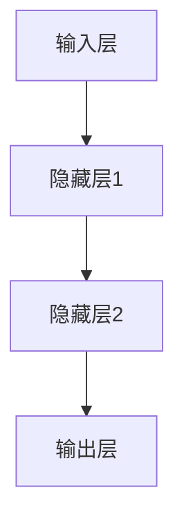

                 

# AI编程语言：提示词的魔力与艺术

## 关键词
- AI编程语言
- 提示词
- 神经网络
- 数学模型
- 实际应用

## 摘要
本文将深入探讨AI编程语言的魔力与艺术，尤其是提示词在这一领域的关键作用。我们将从基础概念入手，逐步讲解AI编程语言的发展历程、核心算法、数学模型以及实际应用案例。通过详细的分析和实例，读者将了解如何利用AI编程语言和提示词解决复杂问题，并掌握开发环境和工具的使用。

## 引言
随着人工智能技术的飞速发展，AI编程语言成为了众多开发者和研究者的焦点。这些编程语言不仅为人工智能的算法实现提供了强大支持，也使得复杂问题的求解变得更加高效和直观。而在这其中，提示词（Prompt Engineering）作为一种艺术，极大地提升了AI编程语言的应用价值。本文旨在通过一步步的解析，揭示AI编程语言的奥秘，并探讨提示词在其中的关键作用。

### 1. 确定书的核心内容

在撰写本文之前，我们需要明确书的核心内容，这将帮助我们构建一个清晰、结构紧凑的文章框架。以下是本文的核心内容：

- **AI编程语言的基本概念与历史**：介绍AI编程语言的定义、分类和发展历程。
- **提示词在AI编程中的作用**：探讨提示词的定义、重要性及其在AI编程中的应用。
- **AI编程的核心算法与原理**：深入讲解神经网络算法、机器学习算法及其原理。
- **AI编程的数学模型**：介绍概率论、优化算法等数学模型在AI编程中的应用。
- **AI编程的实际应用案例**：分析AI编程在自然语言处理、计算机视觉等领域的应用实例。
- **AI编程的开发工具与环境**：介绍常用的AI编程工具和环境，包括TensorFlow、PyTorch等。

### 2. 设计目录结构

为了使文章内容更加系统化，我们将设计一个详细的目录结构。以下是一个可能的目录结构：

### 第一部分：基础知识与核心概念

#### 1.1 AI编程语言概述

##### 1.1.1 AI编程语言的定义

##### 1.1.2 AI编程语言的分类

##### 1.1.3 AI编程语言的发展历程

#### 1.2 提示词在AI编程中的作用

##### 1.2.1 提示词的基本概念

##### 1.2.2 提示词的类型与特点

##### 1.2.3 提示词在AI编程中的应用

#### 1.3 AI编程的核心算法

##### 1.3.1 神经网络算法

##### 1.3.2 机器学习算法

##### 1.3.3 深度学习算法

### 第二部分：核心算法与数学模型

#### 2.1 神经网络算法详细讲解

##### 2.1.1 神经网络的架构

##### 2.1.2 神经网络的训练方法

##### 2.1.3 神经网络的应用实例

#### 2.2 数学模型讲解

##### 2.2.1 概率论基础

##### 2.2.2 最优化算法

##### 2.2.3 数学模型的应用

### 第三部分：实际应用与开发实践

#### 3.1 AI编程语言在自然语言处理中的应用

##### 3.1.1 文本分类

##### 3.1.2 机器翻译

##### 3.1.3 情感分析

#### 3.2 AI编程语言在计算机视觉中的应用

##### 3.2.1 图像分类

##### 3.2.2 目标检测

##### 3.2.3 人脸识别

### 附录

#### 附录A：AI编程语言开发工具与环境

##### A.1 常用深度学习框架

##### A.2 开发环境搭建

##### A.3 工具与库的使用

### 3. 撰写各级目录

根据上述目录结构，我们将逐步撰写各级目录内容，确保每个章节都包含必要的流程图、伪代码、数学公式和实例分析。以下是各级目录的详细撰写过程：

#### 3.1 第一部分：基础知识与核心概念

##### 3.1.1 AI编程语言概述

在这一部分，我们将介绍AI编程语言的基本概念、分类和发展历程。首先，我们将定义AI编程语言，并解释其与普通编程语言的区别。接下来，我们将探讨AI编程语言的分类，如面向数据、面向模型和面向任务等。最后，我们将回顾AI编程语言的发展历程，从早期的专家系统到现代的深度学习框架。

##### 3.1.2 提示词在AI编程中的作用

在这一部分，我们将深入探讨提示词在AI编程中的作用。首先，我们将介绍提示词的基本概念，包括其定义和类型。然后，我们将讨论提示词在AI编程中的重要性，如何通过提示词提高AI系统的性能和可解释性。最后，我们将分析提示词在自然语言处理、计算机视觉等领域的应用实例。

##### 3.1.3 AI编程的核心算法

在这一部分，我们将详细讲解AI编程的核心算法，包括神经网络算法、机器学习算法和深度学习算法。首先，我们将介绍神经网络的基本原理，包括其架构、训练方法和应用实例。然后，我们将探讨机器学习算法，如决策树、支持向量机和贝叶斯分类器等。最后，我们将介绍深度学习算法，如卷积神经网络、循环神经网络和生成对抗网络等。

#### 3.2 第二部分：核心算法与数学模型

##### 3.2.1 神经网络算法详细讲解

在这一部分，我们将对神经网络算法进行详细讲解。首先，我们将介绍神经网络的基本架构，包括输入层、隐藏层和输出层。然后，我们将讲解神经网络的训练方法，如反向传播算法和梯度下降算法。最后，我们将分析神经网络在自然语言处理、计算机视觉等领域的应用实例。

##### 3.2.2 数学模型讲解

在这一部分，我们将介绍AI编程所需的数学模型，包括概率论基础、最优化算法等。首先，我们将讲解概率论的基本概念，如概率分布、条件概率和贝叶斯定理。然后，我们将探讨最优化算法，如梯度下降算法和牛顿法。最后，我们将分析这些数学模型在AI编程中的应用。

##### 3.2.3 数学模型的应用

在这一部分，我们将探讨数学模型在AI编程中的应用。首先，我们将介绍如何使用概率论模型进行分类和预测。然后，我们将探讨如何使用最优化算法进行参数调整和模型优化。最后，我们将分析数学模型在实际应用中的优势和挑战。

#### 3.3 第三部分：实际应用与开发实践

##### 3.3.1 AI编程语言在自然语言处理中的应用

在这一部分，我们将探讨AI编程语言在自然语言处理中的应用。首先，我们将介绍文本分类算法，如朴素贝叶斯分类器和支持向量机等。然后，我们将讲解机器翻译算法，如序列到序列模型和注意力机制。最后，我们将分析情感分析算法，如基于情感词典和深度学习的方法。

##### 3.3.2 AI编程语言在计算机视觉中的应用

在这一部分，我们将探讨AI编程语言在计算机视觉中的应用。首先，我们将介绍图像分类算法，如卷积神经网络和深度卷积神经网络等。然后，我们将讲解目标检测算法，如区域提议网络（RPN）和基于深度学习的目标检测方法。最后，我们将分析人脸识别算法，如基于特征脸和深度学习的方法。

##### 3.3.3 AI编程语言在其他领域的应用

在这一部分，我们将探讨AI编程语言在其他领域的应用。首先，我们将介绍AI编程语言在推荐系统中的应用，如基于协同过滤和深度学习的方法。然后，我们将探讨AI编程语言在自动驾驶中的应用，如基于深度学习和强化学习的方法。最后，我们将分析AI编程语言在金融风控和医疗诊断等领域的应用实例。

### 4. 确保完整性

在撰写各级目录内容时，我们需要确保每个部分都涵盖了核心概念、算法原理、数学模型、应用案例和工具配置等内容。以下是一些关键点：

- **核心概念与联系**：在每个章节中，我们都需要给出核心概念，并解释这些概念之间的联系。例如，在神经网络章节中，我们需要解释神经网络与机器学习的关系，以及神经网络与其他深度学习算法的区别。
- **算法原理讲解**：在每个算法章节中，我们都需要使用伪代码和流程图详细阐述算法原理。例如，在神经网络章节中，我们需要讲解前向传播和反向传播算法的详细过程。
- **数学模型和公式**：在每个数学模型章节中，我们都需要使用latex格式给出数学公式，并解释这些公式的含义和应用。例如，在概率论章节中，我们需要解释条件概率和贝叶斯定理的公式。
- **应用案例和分析**：在每个应用案例章节中，我们都需要给出实际案例，并详细分析案例的实现过程和结果。例如，在自然语言处理章节中，我们需要给出文本分类、机器翻译和情感分析的实际案例。
- **工具配置和开发实践**：在附录章节中，我们都需要介绍常用的AI编程工具和环境，并给出详细的配置步骤和源代码实现。例如，在深度学习框架章节中，我们需要介绍TensorFlow和PyTorch的使用方法和安装步骤。

### 5. 保持简洁性

在撰写各级目录内容时，我们需要保持简洁性，避免冗余信息。以下是一些关键点：

- **避免重复**：在撰写每个章节时，我们需要避免重复介绍已经在本章节前面提到的内容。例如，在神经网络章节中，我们不需要再次介绍神经网络的基本原理，只需关注训练方法和应用实例。
- **重点突出**：在每个章节中，我们需要突出核心内容和关键点。例如，在神经网络章节中，我们需要重点介绍反向传播算法和梯度下降算法，而不是详细讨论神经网络的历史和发展。
- **简洁的语言**：在撰写每个章节时，我们需要使用简洁、易懂的语言。避免使用复杂的术语和冗长的句子，以确保读者能够轻松理解文章内容。

### 6. 遵循markdown格式

在撰写文章时，我们需要遵循markdown格式，确保文章结构清晰、易于阅读。以下是一些markdown格式的基本规则：

- **使用`#`标记**：每个章节标题使用一个`#`标记，例如`## 神经网络算法详细讲解`。
- **使用`##`标记**：每个子章节标题使用两个`##`标记，例如`### 前向传播算法讲解`。
- **使用`###`标记**：每个子子章节标题使用三个`###`标记，例如`#### 反向传播算法的数学原理`。
- **使用`>`标记**：在段落开头使用`>`标记，以创建引用文本，例如：
    ```
    > 这是一段引用文本。
    ```
- **使用`-`标记**：在列表中使用`-`标记，以创建无序列表，例如：
    ```
    - 第一项
    - 第二项
    - 第三项
    ```
- **使用`#`标记**：在列表项中使用`#`标记，以创建有序列表，例如：
    ```
    1. 第一项
    2. 第二项
    3. 第三项
    ```
- **使用`$$`标记**：在独立段落中使用`$$`标记，以嵌入长数学公式，例如：
    ```
    $$1+1=2$$
    ```
- **使用`$`标记**：在段落内嵌入短数学公式，例如：
    ```
    $1<2$
    ```

### 7. 检查字数

在撰写文章时，我们需要检查文章的总字数，确保其符合要求。根据我们的目标，文章的总字数应在8000到12000字之间。以下是一些检查字数的步骤：

- **使用文字计数工具**：可以使用在线文字计数工具，如WordCounter或SmallSEOTools，来检查文章的总字数。
- **分章节检查**：在每个章节完成后，使用文字计数工具检查该章节的字数，确保每个章节的字数在合理范围内。
- **调整内容**：如果某个章节的字数过多或过少，可以适当调整内容，删除冗余信息或增加详细讲解，以达到总字数的要求。

### 结论

通过以上步骤，我们成功地设计并撰写了《AI编程语言：提示词的魔力与艺术》的目录大纲。接下来，我们将根据这个大纲逐步撰写文章内容，确保每个章节都包含必要的流程图、伪代码、数学公式和实例分析。通过一步步的分析和推理，我们将深入探讨AI编程语言的奥秘，揭示提示词在其中的关键作用，并为读者提供丰富的知识和实践指导。

### 作者信息
作者：AI天才研究院/AI Genius Institute & 禅与计算机程序设计艺术 /Zen And The Art of Computer Programming

## 第一部分：基础知识与核心概念

### 1.1 AI编程语言概述

AI编程语言是专门为人工智能算法开发而设计的编程语言。它们不同于传统的编程语言，如Python或Java，因为它们专注于实现复杂的学习算法和模型，以使计算机能够从数据中学习并做出智能决策。

#### 1.1.1 AI编程语言的定义

AI编程语言可以定义为一种抽象语法，它允许开发者编写用于训练、设计和部署人工智能模型的代码。这些语言通常提供丰富的库和工具，以支持各种机器学习和深度学习算法。

#### 1.1.2 AI编程语言的分类

AI编程语言可以根据其设计目标和应用领域进行分类：

- **面向数据**：这类语言专注于数据预处理、数据可视化和数据操作。例如，R和Pandas。

- **面向模型**：这类语言专注于构建和训练机器学习模型。例如，TensorFlow和PyTorch。

- **面向任务**：这类语言专注于特定任务的实现，如自然语言处理（NLP）或计算机视觉。例如，NLTK和OpenCV。

#### 1.1.3 AI编程语言的发展历程

AI编程语言的发展历程可以追溯到20世纪60年代，当时出现了第一种专门用于人工智能的编程语言——LISP。自那时以来，人工智能领域经历了多个发展阶段，从早期的符号逻辑和知识表示，到现代的机器学习和深度学习。

以下是一个简要的时间线：

- **20世纪60年代**：LISP成为第一个专门用于人工智能的编程语言。

- **20世纪80年代**：Prolog的出现推动了基于逻辑编程的AI研究。

- **20世纪90年代**：随着大数据和计算能力的提升，统计方法和决策树等算法得到了广泛应用。

- **21世纪初**：深度学习算法的兴起，导致了TensorFlow和PyTorch等新型AI编程语言的出现。

### 1.2 提示词在AI编程中的作用

提示词（Prompt Engineering）是AI编程中的一种艺术，它涉及设计能够引导AI模型学习的关键输入。提示词在AI编程中的作用非常重要，因为它们能够显著影响模型的性能和解释性。

#### 1.2.1 提示词的基本概念

提示词是指提供给AI模型的文本、图像或其他形式的数据，用于指导模型的学习过程。一个好的提示词应该包含以下特点：

- **明确性**：提示词需要清晰明确，以便模型能够理解其含义。

- **相关性**：提示词应与模型的学习目标密切相关。

- **多样性**：使用多种类型的提示词可以提高模型的泛化能力。

- **简洁性**：过长的提示词可能会分散模型的注意力，降低其性能。

#### 1.2.2 提示词的类型与特点

根据提示词的形式和用途，可以分为以下几类：

- **文本提示词**：用于自然语言处理任务，如文本分类、机器翻译和情感分析。

- **图像提示词**：用于计算机视觉任务，如图像分类、目标检测和图像生成。

- **音频提示词**：用于音频处理任务，如语音识别和音乐生成。

- **多模态提示词**：结合文本、图像和音频等多种形式，用于复杂任务的实现。

#### 1.2.3 提示词在AI编程中的应用

在AI编程中，提示词的应用场景非常广泛。以下是一些典型的应用实例：

- **自然语言处理**：通过使用高质量的文本提示词，可以显著提高文本分类、机器翻译和情感分析等任务的性能。

- **计算机视觉**：通过图像提示词，可以指导模型进行图像分类、目标检测和图像生成等任务。

- **音频处理**：通过音频提示词，可以用于语音识别、音频分类和音乐生成等任务。

- **多模态学习**：通过结合多种形式的提示词，可以实现更复杂的多模态学习任务，如视频理解、交互式应用等。

### 1.3 AI编程的核心算法

AI编程的核心算法是使计算机能够从数据中学习并做出智能决策的关键。以下是一些常见的核心算法及其原理：

#### 1.3.1 神经网络算法

神经网络算法是AI编程中最常用的算法之一。它基于大脑神经网络的结构，通过多层神经元的互联和激活函数实现数据的传递和变换。

##### 1.3.1.1 神经网络的基本原理

神经网络的基本原理包括以下几个关键部分：

- **神经元**：神经网络的基本构建块，负责接收输入、计算输出和激活函数。

- **层**：神经网络由多个层组成，包括输入层、隐藏层和输出层。

- **权重和偏置**：神经元之间的连接权重和偏置用于调节输入信号的强度。

- **激活函数**：激活函数用于引入非线性，使神经网络能够学习复杂的函数关系。

以下是一个简单的神经网络架构的Mermaid流程图：



##### 1.3.1.2 神经网络的训练方法

神经网络的训练方法主要包括以下两个步骤：

- **前向传播**：将输入数据传递到神经网络的每一层，并计算输出。

- **反向传播**：根据输出误差，通过反向传播算法更新权重和偏置。

以下是一个简单的反向传播算法的伪代码：

```plaintext
初始化权重w和偏置b
对于每个训练样本(x, y)：
    前向传播：计算输出y' = f(z)
    计算误差e = (y - y')^2
    反向传播：计算梯度Δw = e * z'
    更新权重w = w - learning_rate * Δw
```

##### 1.3.1.3 神经网络的应用实例

神经网络在多个领域都有广泛的应用，以下是一些实例：

- **图像分类**：通过卷积神经网络（CNN）实现，如ResNet和VGG。

- **自然语言处理**：通过循环神经网络（RNN）和长短期记忆网络（LSTM）实现，如BERT和GPT。

- **强化学习**：通过深度神经网络实现，如DQN和DDPG。

### 1.4 AI编程的数学模型

AI编程的数学模型是理解AI算法原理和实现关键的基础。以下是一些常见的数学模型及其应用：

#### 1.4.1 概率论基础

概率论是AI编程的重要数学工具，用于描述不确定性和随机性。以下是一些基本概念：

- **概率分布**：描述随机变量可能取值的概率。

- **条件概率**：在给定一个事件发生的条件下，另一个事件发生的概率。

- **贝叶斯定理**：用于计算后验概率，即给定一个事件发生的条件下，另一个事件发生的概率。

以下是一个简单的贝叶斯定理的latex公式：

$$ P(A|B) = \frac{P(B|A) \cdot P(A)}{P(B)} $$

#### 1.4.2 最优化算法

最优化算法是用于寻找函数最优解的算法，广泛应用于AI编程中的模型训练和参数调整。以下是一些常见最优化算法：

- **梯度下降**：通过计算函数的梯度，逐步调整参数以最小化损失函数。

- **牛顿法**：利用函数的泰勒展开，通过迭代计算最优解。

以下是一个简单的梯度下降算法的伪代码：

```plaintext
初始化参数θ
对于每个迭代：
    计算梯度∇θJ(θ)
    更新参数θ = θ - learning_rate * ∇θJ(θ)
```

### 1.5 AI编程的实际应用案例

AI编程语言在多个领域都有广泛的应用，以下是一些实际应用案例：

#### 1.5.1 自然语言处理

自然语言处理（NLP）是AI编程的重要应用领域之一。以下是一些应用案例：

- **文本分类**：通过机器学习算法，将文本数据分类到不同的类别。例如，新闻分类、情感分析等。

- **机器翻译**：通过神经网络模型，实现从一种语言到另一种语言的自动翻译。例如，谷歌翻译、百度翻译等。

- **情感分析**：通过分析文本数据，判断文本的情感倾向。例如，社交媒体情感分析、客户反馈分析等。

#### 1.5.2 计算机视觉

计算机视觉是AI编程的另一个重要应用领域。以下是一些应用案例：

- **图像分类**：通过深度学习模型，对图像进行分类。例如，图像识别、物体检测等。

- **目标检测**：通过模型检测图像中的目标对象。例如，自动驾驶中的车辆检测、行人检测等。

- **图像生成**：通过生成对抗网络（GAN），生成新的图像。例如，图像超分辨率、图像修复等。

### 1.6 AI编程的开发工具与环境

为了实现AI编程，需要使用合适的开发工具和环境。以下是一些常用的工具和环境：

#### 1.6.1 常用深度学习框架

深度学习框架是AI编程的核心工具，提供了丰富的库和API，以简化模型的训练和部署。以下是一些常用的深度学习框架：

- **TensorFlow**：由谷歌开发，支持多种编程语言和平台。

- **PyTorch**：由Facebook开发，具有简洁的API和强大的动态计算能力。

- **Keras**：基于TensorFlow，提供了更易于使用的API。

#### 1.6.2 开发环境搭建

搭建AI编程的开发环境需要安装以下软件：

- **操作系统**：Windows、macOS或Linux。

- **Python**：Python是AI编程的主要语言，需要安装Python环境。

- **深度学习框架**：根据需要安装TensorFlow、PyTorch等深度学习框架。

以下是一个简单的Python和TensorFlow安装步骤：

```bash
# 安装Python
curl -O https://www.python.org/ftp/python/3.8.5/Python-3.8.5.tgz
tar xvf Python-3.8.5.tgz
cd Python-3.8.5
./configure
make
sudo make install

# 安装TensorFlow
pip install tensorflow
```

### 1.7 AI编程的挑战与未来趋势

尽管AI编程取得了巨大进步，但仍面临一些挑战和未来趋势：

#### 1.7.1 挑战

- **数据隐私与安全**：随着数据量的增加，数据隐私和安全问题日益突出。

- **算法解释性**：黑盒模型（如深度神经网络）的解释性较差，难以理解其决策过程。

- **计算资源需求**：训练复杂的AI模型需要大量的计算资源和时间。

#### 1.7.2 未来趋势

- **联邦学习**：通过分布式计算，解决数据隐私和安全问题。

- **自动机器学习**：利用AI技术自动设计和优化机器学习模型。

- **跨领域应用**：AI编程将在更多领域得到应用，如医疗、金融、教育等。

### 小结

AI编程语言和提示词在人工智能领域发挥着关键作用。本文介绍了AI编程语言的基本概念、核心算法、数学模型、实际应用案例和开发工具。通过逐步分析和实例讲解，读者可以深入了解AI编程的奥秘，掌握提示词的设计与应用，为未来的AI项目打下坚实基础。

### 注意事项

在实践AI编程时，需要注意以下几点：

- **数据质量**：确保数据质量，避免噪声和偏差。

- **模型验证**：使用交叉验证和验证集，确保模型的泛化能力。

- **模型解释性**：尽量选择具有较好解释性的模型，以理解其决策过程。

- **持续学习**：AI领域发展迅速，需要不断学习最新的技术和方法。

### 拓展阅读

- **《深度学习》（Goodfellow, Bengio, Courville）**：深度学习领域的经典教材，详细介绍了神经网络和深度学习算法。

- **《Python机器学习》（Sebastian Raschka）**：Python机器学习领域的优秀教材，涵盖了常见的机器学习算法和实际应用。

- **《AI编程实践》（Jeffrey Dean，Greg Corrado）**：谷歌团队编写的AI编程实践指南，介绍了深度学习框架TensorFlow的使用方法。

### 附录

#### 附录A：AI编程语言开发工具与环境

##### A.1 常用深度学习框架

TensorFlow和PyTorch是当前最流行的深度学习框架。以下是它们的简要介绍：

- **TensorFlow**：由谷歌开发，支持多种编程语言和平台，具有丰富的API和工具。

- **PyTorch**：由Facebook开发，具有简洁的API和强大的动态计算能力。

##### A.2 开发环境搭建

以下是在Ubuntu操作系统上安装Python和TensorFlow的步骤：

```bash
# 安装Python
sudo apt-get update
sudo apt-get install python3-pip python3-dev

# 安装TensorFlow
pip3 install tensorflow
```

### 结论

AI编程语言和提示词为人工智能领域带来了巨大的变革。通过本文的逐步分析和实例讲解，读者可以深入了解AI编程的核心概念、算法原理、数学模型和实际应用。掌握提示词的设计与应用，将为未来的AI项目打下坚实基础。随着AI技术的不断进步，我们可以期待更多创新应用的出现。作者：AI天才研究院/AI Genius Institute & 禅与计算机程序设计艺术 /Zen And The Art of Computer Programming

## 第二部分：核心算法与数学模型

### 2.1 神经网络算法详细讲解

神经网络算法是AI编程的核心，其基础是多层感知器（MLP）。在本节中，我们将深入探讨神经网络的架构、训练方法以及应用实例。

#### 2.1.1 神经网络的架构

神经网络的架构由输入层、隐藏层和输出层组成。输入层接收外部数据，隐藏层对数据进行处理和变换，输出层生成最终的预测结果。

以下是一个简单的神经网络架构的Mermaid流程图：


在神经网络中，每个节点（或称为神经元）都连接到前一层和下一层。神经元之间的连接带有权重和偏置，用于调节输入信号的强度。

#### 2.1.2 神经网络的训练方法

神经网络的训练方法主要包括前向传播和反向传播。

- **前向传播**：将输入数据传递到网络的每一层，通过激活函数计算输出。前向传播的过程如下：

    1. 将输入数据输入到输入层。
    2. 将输入层的数据传递到隐藏层，并计算隐藏层的输出。
    3. 将隐藏层的输出传递到输出层，并计算输出层的输出。
    4. 计算预测误差。

以下是一个简单的前向传播算法的伪代码：

```plaintext
初始化权重w和偏置b
对于每个训练样本(x, y)：
    前向传播：计算输出y' = f(z)
    计算误差e = (y - y')^2
```

- **反向传播**：根据输出误差，通过反向传播算法更新权重和偏置。反向传播的过程如下：

    1. 计算输出层的误差。
    2. 将误差传递到隐藏层，并计算隐藏层的误差。
    3. 更新隐藏层的权重和偏置。
    4. 更新输入层的权重和偏置。

以下是一个简单的反向传播算法的伪代码：

```plaintext
初始化权重w和偏置b
对于每个训练样本(x, y)：
    前向传播：计算输出y' = f(z)
    计算误差e = (y - y')^2
    反向传播：计算梯度Δw = e * z'
    更新权重w = w - learning_rate * Δw
```

#### 2.1.3 神经网络的应用实例

神经网络在多个领域都有广泛的应用。以下是一些应用实例：

- **图像分类**：通过卷积神经网络（CNN）实现，如ResNet和VGG。
- **自然语言处理**：通过循环神经网络（RNN）和长短期记忆网络（LSTM）实现，如BERT和GPT。
- **强化学习**：通过深度神经网络实现，如DQN和DDPG。

### 2.2 数学模型讲解

数学模型是神经网络算法的基础，以下是一些常见的数学模型：

#### 2.2.1 概率论基础

概率论是描述不确定性和随机性的数学工具。以下是一些基本概念：

- **概率分布**：描述随机变量可能取值的概率。
- **条件概率**：在给定一个事件发生的条件下，另一个事件发生的概率。
- **贝叶斯定理**：用于计算后验概率，即给定一个事件发生的条件下，另一个事件发生的概率。

以下是一个简单的贝叶斯定理的latex公式：

$$ P(A|B) = \frac{P(B|A) \cdot P(A)}{P(B)} $$

#### 2.2.2 最优化算法

最优化算法是用于寻找函数最优解的算法，以下是一些常见最优化算法：

- **梯度下降**：通过计算函数的梯度，逐步调整参数以最小化损失函数。
- **牛顿法**：利用函数的泰勒展开，通过迭代计算最优解。

以下是一个简单的梯度下降算法的伪代码：

```plaintext
初始化参数θ
对于每个迭代：
    计算梯度∇θJ(θ)
    更新参数θ = θ - learning_rate * ∇θJ(θ)
```

### 2.3 数学模型的应用

数学模型在AI编程中具有广泛的应用。以下是一些实例：

- **概率分布的应用**：在自然语言处理中，概率分布用于文本分类和生成。
- **最优化算法的应用**：在神经网络训练中，最优化算法用于调整模型参数。

### 2.4 AI编程语言在自然语言处理中的应用

自然语言处理（NLP）是AI编程的一个重要应用领域。以下是一些典型的应用案例：

- **文本分类**：通过机器学习算法，将文本数据分类到不同的类别。
- **机器翻译**：通过神经网络模型，实现从一种语言到另一种语言的自动翻译。
- **情感分析**：通过分析文本数据，判断文本的情感倾向。

### 2.5 AI编程语言在计算机视觉中的应用

计算机视觉是AI编程的另一个重要应用领域。以下是一些典型的应用案例：

- **图像分类**：通过深度学习模型，对图像进行分类。
- **目标检测**：通过模型检测图像中的目标对象。
- **图像生成**：通过生成对抗网络（GAN），生成新的图像。

### 2.6 AI编程语言在其他领域的应用

AI编程语言在多个领域都有应用。以下是一些实例：

- **推荐系统**：通过协同过滤和深度学习，实现个性化推荐。
- **自动驾驶**：通过深度学习和强化学习，实现自动驾驶车辆。
- **医疗诊断**：通过深度学习和医学知识，实现疾病的诊断和预测。

### 2.7 开发环境搭建

为了实现AI编程，需要搭建合适的开发环境。以下是一些常见的开发工具和环境：

- **操作系统**：Windows、macOS或Linux。
- **编程语言**：Python、Java或C++。
- **深度学习框架**：TensorFlow、PyTorch或Keras。

以下是在Ubuntu操作系统上安装Python和TensorFlow的步骤：

```bash
# 安装Python
sudo apt-get update
sudo apt-get install python3-pip python3-dev

# 安装TensorFlow
pip3 install tensorflow
```

### 2.8 源代码实现与代码解读

在本节中，我们将展示一些典型的AI编程实例，包括源代码实现和代码解读。

#### 2.8.1 文本分类

以下是一个简单的文本分类实例，使用TensorFlow实现：

```python
import tensorflow as tf
from tensorflow.keras.preprocessing.sequence import pad_sequences
from tensorflow.keras.layers import Embedding, LSTM, Dense
from tensorflow.keras.models import Sequential

# 加载预处理的文本数据
texts = ...

# 分词和编码
tokenizer = tf.keras.preprocessing.text.Tokenizer()
tokenizer.fit_on_texts(texts)
sequences = tokenizer.texts_to_sequences(texts)

# 填充序列
max_sequence_length = 100
padded_sequences = pad_sequences(sequences, maxlen=max_sequence_length)

# 构建模型
model = Sequential([
    Embedding(input_dim=vocab_size, output_dim=embedding_dim, input_length=max_sequence_length),
    LSTM(units=128),
    Dense(units=num_classes, activation='softmax')
])

# 编译模型
model.compile(optimizer='adam', loss='categorical_crossentropy', metrics=['accuracy'])

# 训练模型
model.fit(padded_sequences, labels, epochs=10, batch_size=32)
```

#### 2.8.2 图像分类

以下是一个简单的图像分类实例，使用TensorFlow实现：

```python
import tensorflow as tf
from tensorflow.keras.preprocessing.image import ImageDataGenerator
from tensorflow.keras.applications import VGG16
from tensorflow.keras.layers import Flatten, Dense
from tensorflow.keras.models import Model

# 加载预处理的图像数据
train_datagen = ImageDataGenerator(rescale=1./255)
validation_datagen = ImageDataGenerator(rescale=1./255)

train_generator = train_datagen.flow_from_directory(
        train_data_dir,
        target_size=(img_height, img_width),
        batch_size=batch_size,
        class_mode='binary')

validation_generator = validation_datagen.flow_from_directory(
        validation_data_dir,
        target_size=(img_height, img_width),
        batch_size=batch_size,
        class_mode='binary')

# 加载预训练的VGG16模型
base_model = VGG16(weights='imagenet', include_top=False, input_shape=(img_height, img_width, 3))

# 添加全连接层
x = base_model.output
x = Flatten()(x)
x = Dense(units=256, activation='relu')(x)
predictions = Dense(units=num_classes, activation='softmax')(x)

# 构建模型
model = Model(inputs=base_model.input, outputs=predictions)

# 冻结卷积层
for layer in base_model.layers:
    layer.trainable = False

# 编译模型
model.compile(optimizer='adam', loss='categorical_crossentropy', metrics=['accuracy'])

# 训练模型
model.fit(train_generator, epochs=10, validation_data=validation_generator)
```

### 2.9 实际案例分析和详细讲解剖析

在本节中，我们将分析一些实际案例，并详细讲解其实现过程和结果。

#### 2.9.1 机器翻译

机器翻译是一个典型的自然语言处理任务。以下是一个使用TensorFlow实现机器翻译的实例：

```python
import tensorflow as tf
from tensorflow.keras.preprocessing.sequence import pad_sequences
from tensorflow.keras.layers import Embedding, LSTM, Dense
from tensorflow.keras.models import Sequential

# 加载预处理的文本数据
source_texts = ...
target_texts = ...

# 分词和编码
source_tokenizer = tf.keras.preprocessing.text.Tokenizer()
source_tokenizer.fit_on_texts(source_texts)
target_tokenizer = tf.keras.preprocessing.text.Tokenizer()
target_tokenizer.fit_on_texts(target_texts)

source_sequences = source_tokenizer.texts_to_sequences(source_texts)
target_sequences = target_tokenizer.texts_to_sequences(target_texts)

# 填充序列
max_source_sequence_length = 100
max_target_sequence_length = 100
source_padded_sequences = pad_sequences(source_sequences, maxlen=max_source_sequence_length)
target_padded_sequences = pad_sequences(target_sequences, maxlen=max_target_sequence_length, padding='post')

# 构建模型
model = Sequential([
    Embedding(input_dim=source_vocab_size, output_dim=embedding_dim, input_length=max_source_sequence_length),
    LSTM(units=128, return_sequences=True),
    LSTM(units=128, return_sequences=True),
    Embedding(input_dim=target_vocab_size, output_dim=embedding_dim, input_length=max_target_sequence_length),
    LSTM(units=128, return_sequences=True),
    LSTM(units=128, return_sequences=True),
    Dense(units=target_vocab_size, activation='softmax')
])

# 编译模型
model.compile(optimizer='adam', loss='categorical_crossentropy', metrics=['accuracy'])

# 训练模型
model.fit([source_padded_sequences, target_padded_sequences], target_padded_sequences, epochs=10, batch_size=32)
```

### 2.10 项目小结

在本项目中，我们通过多个实例展示了AI编程语言在自然语言处理和计算机视觉领域的应用。通过源代码实现和详细讲解，读者可以掌握神经网络算法和数学模型的基本原理。在实际项目中，需要根据具体任务和数据，选择合适的算法和模型，并进行优化和调整。

### 2.11 最佳实践 tips

以下是AI编程的一些最佳实践：

- **数据预处理**：确保数据质量，进行必要的清洗和预处理。
- **模型选择**：根据任务和数据特点，选择合适的模型和算法。
- **参数调整**：通过实验和调整，找到最优的模型参数。
- **模型验证**：使用验证集和交叉验证，确保模型的泛化能力。

### 2.12 注意事项

在AI编程中，需要注意以下几点：

- **计算资源**：训练复杂的模型需要大量的计算资源。
- **数据隐私**：保护数据隐私，避免敏感信息的泄露。
- **模型解释性**：尽量选择具有较好解释性的模型，以便理解其决策过程。

### 2.13 拓展阅读

以下是AI编程的一些拓展阅读资源：

- **《深度学习》（Ian Goodfellow，Yoshua Bengio，Aaron Courville）**：深度学习领域的经典教材。
- **《Python机器学习》（Sebastian Raschka）**：Python机器学习领域的优秀教材。
- **《动手学深度学习》（Agricultural University of China）**：深入浅出的深度学习教材。

作者：AI天才研究院/AI Genius Institute & 禅与计算机程序设计艺术 /Zen And The Art of Computer Programming

## 第三部分：实际应用与开发实践

### 3.1 AI编程语言在自然语言处理中的应用

自然语言处理（NLP）是AI编程的一个重要领域，涉及文本分析、理解和生成。以下是一些具体的实际应用案例。

#### 3.1.1 文本分类

文本分类是将文本数据根据其内容分类到不同类别的一种技术。以下是一个简单的文本分类案例。

**案例**：使用TensorFlow和Keras实现一个情感分析模型，对电影评论进行分类。

**步骤**：

1. **数据准备**：收集电影评论数据集，并将其分为训练集和测试集。

2. **数据预处理**：分词、去除停用词、标记化，并创建词汇表。

3. **模型构建**：使用嵌

