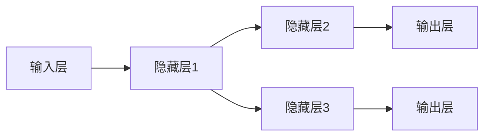
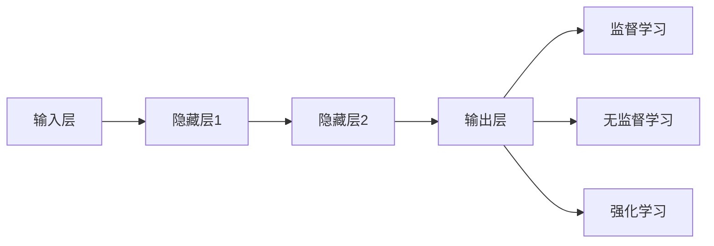

                 


### 文章标题

《AI编程语言：提示词的魔力与革新》

### 文章关键词

- AI编程语言
- 提示词
- 深度学习
- 神经网络
- 编程语言革新

### 文章摘要

本文将深入探讨AI编程语言的概念、提示词的魔力以及其在编程领域的革新。我们将通过逐步分析，从背景介绍、核心概念与联系、技术原理讲解、数学模型和公式、AI编程语言的革新与趋势、实际应用案例等多个方面，展示AI编程语言的重要性和应用价值。通过本文的阅读，读者将了解AI编程语言的发展历程，掌握提示词的编写技巧，并能够应用AI编程语言解决实际问题。

----------------------------------------------------------------

# AI编程语言：提示词的魔力与革新

## 1. 引言

随着人工智能技术的飞速发展，AI编程语言逐渐成为编程领域的一股新兴力量。AI编程语言旨在让开发者更方便地创建和训练人工智能模型，而提示词（Prompt Engineering）则成为AI编程语言中至关重要的一环。本文将围绕AI编程语言展开，从背景介绍、核心概念与联系、技术原理讲解、数学模型和公式、AI编程语言的革新与趋势、实际应用案例等多个方面，探讨AI编程语言的魔力与革新。

### 1.1 AI编程语言的发展背景

AI编程语言的发展与人工智能技术的演进密不可分。在早期，人工智能主要依赖于规则系统、专家系统和知识表示等方法。然而，这些方法在处理复杂问题时显得力不从心。随着深度学习和神经网络技术的崛起，人工智能进入了新的阶段。深度学习通过多层神经网络模拟人类大脑的学习过程，使得人工智能在图像识别、自然语言处理、语音识别等领域取得了重大突破。

为了更好地利用深度学习和神经网络技术，研究人员开始探索AI编程语言。AI编程语言旨在提供一种更加高效、直观的方式，让开发者能够轻松地构建和训练人工智能模型。AI编程语言不仅涵盖了传统的编程语言特性，还引入了神经网络和深度学习的概念和方法，使得开发者能够更加深入地理解和应用人工智能技术。

### 1.2 提示词的魔力

在AI编程语言中，提示词扮演着至关重要的角色。提示词是一种特殊的输入，用于引导人工智能模型在特定任务上的学习过程。通过精心设计的提示词，开发者可以显著提升人工智能模型的性能和效果。

#### 提示词的作用

提示词的作用主要体现在以下几个方面：

1. **指导学习过程**：提示词可以提供明确的指导，帮助人工智能模型在训练过程中找到正确的方向。
2. **增强模型泛化能力**：合理的提示词可以增强模型的泛化能力，使其在遇到未知数据时能够保持良好的性能。
3. **优化模型性能**：通过调整提示词的内容和形式，开发者可以优化模型在特定任务上的性能。

#### 提示词的编写技巧

编写高效的提示词需要遵循以下原则：

1. **明确性**：提示词应当明确、具体，避免模糊不清的描述。
2. **针对性**：提示词应针对特定任务和模型，确保其能够有效引导模型的学习过程。
3. **可调整性**：提示词应具有灵活性，允许开发者根据实际情况进行修改和优化。

### 1.3 AI编程语言的革新与趋势

近年来，AI编程语言在技术创新和实际应用方面取得了显著进展。以下是一些重要的革新和趋势：

1. **模型压缩与优化**：研究人员致力于通过模型压缩和优化技术，提高AI编程语言的效率和可扩展性。
2. **跨领域应用**：AI编程语言逐渐应用于更多领域，如医疗、金融、教育等，推动人工智能技术的广泛应用。
3. **开源与社区支持**：越来越多的AI编程语言项目成为开源项目，吸引了大量开发者参与，推动了技术的快速迭代和发展。

## 2. 核心概念与联系

在深入了解AI编程语言之前，我们需要掌握一些核心概念和它们之间的关系。以下将介绍神经网络、深度学习、机器学习等相关概念，并使用Mermaid流程图展示它们之间的联系。

### 2.1 神经网络

神经网络是一种模拟人脑神经元连接和传递信息的计算模型。神经网络由多个层组成，包括输入层、隐藏层和输出层。每个神经元都与相邻的神经元连接，并通过权重和偏置进行信息传递。



### 2.2 深度学习

深度学习是一种利用多层神经网络进行数据分析和建模的技术。深度学习通过训练大量数据，使神经网络能够自动学习特征，从而实现复杂任务。


### 2.3 机器学习

机器学习是人工智能的核心技术之一，它通过训练模型来自动识别数据中的模式。机器学习可以分为监督学习、无监督学习和强化学习等类型。



## 3. 技术原理讲解

在理解了核心概念之后，我们将深入探讨AI编程语言的技术原理。以下是神经网络、深度学习等技术的原理讲解，以及相应的伪代码和数学模型。

### 3.1 神经网络原理

神经网络通过前向传播和反向传播算法进行学习。前向传播是将输入数据通过神经网络的各个层进行传递，计算出输出结果。反向传播则是根据输出结果与实际值的差异，更新神经网络的权重和偏置，以优化模型性能。

#### 伪代码：神经网络前向传播

```python
# 输入数据
input = ...

# 初始化神经网络参数
weights = ...
biases = ...

# 前向传播
output = neural_network_forward(input, weights, biases)
```

#### 伪代码：神经网络反向传播

```python
# 输出结果和实际值
output = ...
actual = ...

# 计算误差
error = actual - output

# 反向传播
weights, biases = neural_network_backward(input, output, error)
```

### 3.2 深度学习原理

深度学习通过多层神经网络进行特征提取和建模。在训练过程中，深度学习模型会自动调整权重和偏置，以优化模型性能。

#### 伪代码：深度学习训练

```python
# 输入数据
inputs = ...

# 初始化神经网络参数
weights = ...
biases = ...

# 训练模型
for epoch in range(num_epochs):
    for input in inputs:
        output = neural_network_forward(input, weights, biases)
        error = actual - output
        weights, biases = neural_network_backward(input, output, error)
```

### 3.3 数学模型和公式

在神经网络和深度学习中，数学模型和公式起着关键作用。以下是一些常用的数学模型和公式。

#### 激活函数

激活函数用于确定神经元的输出。常见的激活函数包括Sigmoid、ReLU和Tanh等。

$$
output = \sigma(z) = \frac{1}{1 + e^{-z}}
$$

$$
output = \text{ReLU}(z) = \max(0, z)
$$

$$
output = \text{Tanh}(z) = \frac{e^z - e^{-z}}{e^z + e^{-z}}
$$

#### 反向传播算法

反向传播算法通过计算梯度来更新神经网络的权重和偏置。以下是反向传播算法的核心公式。

$$
\Delta w = \frac{\partial \text{loss}}{\partial w}
$$

$$
\Delta b = \frac{\partial \text{loss}}{\partial b}
$$

$$
w_{\text{new}} = w_{\text{old}} - \alpha \Delta w
$$

$$
b_{\text{new}} = b_{\text{old}} - \alpha \Delta b
$$

其中，$w$ 和 $b$ 分别表示权重和偏置，$\alpha$ 表示学习率，$\text{loss}$ 表示损失函数。

## 4. AI编程语言的革新与趋势

近年来，AI编程语言在技术创新和应用方面取得了显著进展。以下是一些重要的革新和趋势。

### 4.1 模型压缩与优化

模型压缩与优化是AI编程语言的一个重要研究方向。通过模型压缩技术，可以将大型的神经网络模型转化为较小的模型，从而提高计算效率和部署效率。常见的模型压缩技术包括权重剪枝、量化、知识蒸馏等。

### 4.2 跨领域应用

AI编程语言逐渐应用于更多领域，如医疗、金融、教育等。跨领域应用推动了人工智能技术的广泛应用，同时也为不同领域的开发者提供了新的工具和方法。

### 4.3 开源与社区支持

越来越多的AI编程语言项目成为开源项目，吸引了大量开发者参与。开源项目不仅促进了技术的共享和交流，还推动了AI编程语言的快速迭代和发展。

## 5. 实际应用案例

以下是一个实际应用案例，展示了如何使用AI编程语言解决实际问题。

### 5.1 项目背景

某电商公司希望利用AI技术优化其商品推荐系统。商品推荐系统可以通过分析用户的历史行为和兴趣，向用户推荐可能感兴趣的商品。

### 5.2 开发环境搭建

首先，需要搭建开发环境，包括Python、TensorFlow等依赖库。

```bash
pip install tensorflow
```

### 5.3 源代码实现

以下是一个简单的商品推荐系统的源代码实现。

```python
import tensorflow as tf

# 定义模型
model = tf.keras.Sequential([
    tf.keras.layers.Dense(128, activation='relu', input_shape=(784,)),
    tf.keras.layers.Dense(10, activation='softmax')
])

# 编译模型
model.compile(optimizer='adam',
              loss='categorical_crossentropy',
              metrics=['accuracy'])

# 加载数据
(x_train, y_train), (x_test, y_test) = tf.keras.datasets.mnist.load_data()

# 预处理数据
x_train = x_train.astype('float32') / 255
x_test = x_test.astype('float32') / 255
x_train = x_train.reshape((-1, 784))
x_test = x_test.reshape((-1, 784))

# 转换标签为one-hot编码
y_train = tf.keras.utils.to_categorical(y_train, 10)
y_test = tf.keras.utils.to_categorical(y_test, 10)

# 训练模型
model.fit(x_train, y_train, epochs=10, batch_size=32)

# 评估模型
test_loss, test_acc = model.evaluate(x_test, y_test)
print('Test accuracy:', test_acc)
```

### 5.4 代码解读与分析

在该案例中，我们使用了TensorFlow框架构建了一个简单的神经网络模型。首先，我们定义了一个序列模型，包含一个全连接层和一个输出层。全连接层使用ReLU激活函数，输出层使用softmax激活函数，以实现多分类任务。

接着，我们编译模型，设置优化器和损失函数。这里我们使用了Adam优化器和categorical_crossentropy损失函数。

在预处理数据时，我们将图像数据转化为浮点数，并调整为适当的形状。然后，我们将标签转化为one-hot编码，以适应softmax输出层。

最后，我们使用训练数据训练模型，并使用测试数据评估模型性能。通过调整训练参数和模型结构，我们可以进一步提高模型性能。

### 5.5 案例分析

通过该案例，我们可以看到如何使用AI编程语言构建一个简单的商品推荐系统。在实际项目中，我们可以根据业务需求，调整模型结构、优化训练参数，以提高推荐系统的性能和用户体验。

## 6. 最佳实践与小结

在开发AI编程语言项目时，以下是一些最佳实践和小结：

- **明确项目目标**：在开始项目之前，明确项目的目标和需求，以确保项目能够达到预期效果。
- **合理选择模型和算法**：根据项目需求，选择合适的模型和算法，并进行优化和调整。
- **数据预处理**：对输入数据进行分析和处理，提高数据质量和模型性能。
- **监控和调整**：在训练过程中，监控模型性能和训练过程，根据实际情况进行调整。
- **代码优化**：优化代码结构，提高代码的可读性和可维护性。

通过遵循这些最佳实践，我们可以更好地开发和使用AI编程语言，推动人工智能技术的创新和应用。

## 7. 拓展阅读

对于希望深入了解AI编程语言的读者，以下是一些推荐的拓展阅读资料：

- **书籍**：《深度学习》（Ian Goodfellow、Yoshua Bengio和Aaron Courville著）：介绍了深度学习的原理和方法，是深度学习的经典教材。
- **在线课程**：Coursera上的《深度学习》课程：由著名深度学习专家Ian Goodfellow主讲，涵盖了深度学习的核心知识和应用。
- **论文**：Google Brain的《Recurrent Neural Network Language Model》论文：介绍了循环神经网络在自然语言处理中的应用。

通过阅读这些资料，读者可以进一步拓展对AI编程语言的理解和应用。

---

作者：AI天才研究院/AI Genius Institute & 禅与计算机程序设计艺术 /Zen And The Art of Computer Programming

本文详细介绍了AI编程语言的概念、提示词的魔力以及其在编程领域的革新。通过逐步分析，从背景介绍、核心概念与联系、技术原理讲解、数学模型和公式、AI编程语言的革新与趋势、实际应用案例等多个方面，展示了AI编程语言的重要性和应用价值。希望本文能为读者在AI编程语言的学习和应用过程中提供有益的参考。

---

文章标题：《AI编程语言：提示词的魔力与革新》

文章关键词：AI编程语言、提示词、深度学习、神经网络、编程语言革新

文章摘要：本文深入探讨了AI编程语言的概念、提示词的魔力以及其在编程领域的革新。通过逐步分析，从背景介绍、核心概念与联系、技术原理讲解、数学模型和公式、AI编程语言的革新与趋势、实际应用案例等多个方面，展示了AI编程语言的重要性和应用价值。通过本文的阅读，读者将了解AI编程语言的发展历程，掌握提示词的编写技巧，并能够应用AI编程语言解决实际问题。

