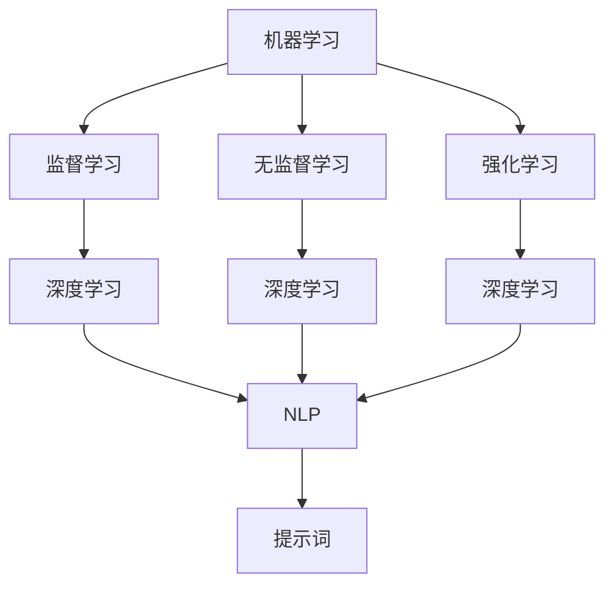

                 


### 一、背景介绍

随着人工智能技术的飞速发展，AI编程语言逐渐成为开发者们研究的热点。AI编程语言与传统编程语言有显著的不同，它强调自动化和智能化，能够处理复杂的数据处理任务，并具有强大的学习和适应能力。这些特点使得AI编程语言在众多领域得到了广泛应用，包括自然语言处理、计算机视觉、智能决策等领域。

本文旨在探讨AI编程语言及其核心组成部分——提示词的魔法。提示词在AI编程中扮演着至关重要的角色，它能够指导AI系统如何处理输入数据，从而产生期望的输出结果。本文将首先介绍AI编程语言的基本概念和重要性，然后深入探讨提示词的技术原理和应用，最后通过具体案例展示AI编程语言在实际项目中的应用。

### 二、核心概念与联系

为了更好地理解AI编程语言和提示词的关系，我们需要了解一些核心概念。以下是AI编程语言中几个关键概念的解释及其之间的联系：

#### 1. 机器学习（Machine Learning）
机器学习是AI编程语言的基础，它是一种让计算机通过数据和经验自动改进性能的方法。机器学习可以分为监督学习、无监督学习和强化学习三类。其中，监督学习通过标注的数据训练模型，无监督学习通过未标注的数据自动发现数据分布，而强化学习通过奖励机制学习最佳策略。

#### 2. 深度学习（Deep Learning）
深度学习是机器学习的一种，它使用多层神经网络来模拟人类大脑的处理方式。深度学习在图像识别、语音识别等任务上表现出色。

#### 3. 自然语言处理（Natural Language Processing，NLP）
NLP是AI编程语言的一个重要应用领域，它涉及到文本的生成、理解和处理。NLP技术广泛应用于聊天机器人、翻译服务等领域。

#### 4. 提示词（Prompt）
提示词是AI编程语言中用于指导模型如何处理输入数据的文字或符号。一个有效的提示词能够引导模型产生更准确、更有用的输出。

下面是这些核心概念之间的Mermaid流程图：



### 三、核心算法原理讲解

为了更好地理解AI编程语言中的核心算法原理，我们以一个简单的例子来讲解。假设我们想要构建一个简单的聊天机器人，它能够根据用户的输入生成回复。以下是这个聊天机器人的伪代码实现：

```python
def generate_response(input_text):
    # 将输入文本转换为嵌入向量
    input_vector = convert_to_embedding(input_text)
    
    # 使用预训练的模型进行预测
    predicted_vector = model.predict(input_vector)
    
    # 将预测向量转换为文本回复
    response_text = convert_to_text(predicted_vector)
    
    return response_text
```

在这个例子中，`convert_to_embedding` 函数将输入的文本转换为嵌入向量，这是深度学习模型处理文本数据的一种方式。`model.predict` 函数使用预训练的模型对嵌入向量进行预测，生成预测向量。最后，`convert_to_text` 函数将预测向量转换为文本回复。

下面是生成聊天机器人回复的详细步骤：

1. **数据预处理**：将输入文本进行清洗和标记化处理，然后转换为嵌入向量。
2. **模型预测**：使用预训练的深度学习模型对嵌入向量进行预测，生成预测向量。
3. **结果转换**：将预测向量转换为自然语言文本回复。

接下来，我们将详细讲解模型预测部分的算法原理。假设我们使用的是一个基于Transformer的预训练模型，以下是该模型的伪代码实现：

```python
def transformer_predict(input_vector):
    # 将输入向量编码为Transformer的输入
    input_encoded = encode(input_vector)
    
    # 通过Transformer模型进行自注意力机制计算
    attention_scores = self_attention(input_encoded)
    
    # 通过Transformer模型进行解码
    output_encoded = decode(attention_scores)
    
    return output_encoded
```

在这个例子中，`encode` 函数将输入向量编码为Transformer的输入，`self_attention` 函数实现自注意力机制，用于捕捉输入向量中的长距离依赖关系。最后，`decode` 函数将自注意力机制的输出解码为输出向量。

下面是Transformer模型的详细算法步骤：

1. **编码器**：将输入向量编码为序列，每个序列元素表示输入向量的一部分。
2. **自注意力**：计算输入序列中每个元素与其他元素之间的相似度，加权求和生成新的序列。
3. **解码器**：将自注意力机制的输出解码为输出序列，每个序列元素表示输出的一部分。

### 四、数学模型和公式讲解

在AI编程语言中，数学模型和公式起着至关重要的作用。以下是一个简单的线性回归模型的例子，用于预测房价：

$$
y = \beta_0 + \beta_1 \cdot x
$$

其中，$y$ 表示房价，$x$ 表示房屋的特征（如面积、房龄等），$\beta_0$ 和 $\beta_1$ 是模型的参数。

为了训练这个模型，我们需要使用最小二乘法来求解参数：

$$
\beta_1 = \frac{\sum_{i=1}^{n} (x_i - \bar{x})(y_i - \bar{y})}{\sum_{i=1}^{n} (x_i - \bar{x})^2}
$$

$$
\beta_0 = \bar{y} - \beta_1 \cdot \bar{x}
$$

其中，$n$ 是样本数量，$\bar{x}$ 和 $\bar{y}$ 分别是$x$ 和 $y$ 的平均值。

下面是一个基于梯度下降的线性回归模型训练过程的伪代码实现：

```python
def train_linear_regression(data, learning_rate, num_iterations):
    n = len(data)
    x = [row[0] for row in data]
    y = [row[1] for row in data]
    beta_0 = 0
    beta_1 = 0
    
    for _ in range(num_iterations):
        beta_1_gradient = 0
        beta_0_gradient = 0
        
        for i in range(n):
            y_pred = beta_0 + beta_1 * x[i]
            beta_1_gradient += (y[i] - y_pred) * x[i]
            beta_0_gradient += (y[i] - y_pred)
        
        beta_1 -= learning_rate * beta_1_gradient / n
        beta_0 -= learning_rate * beta_0_gradient / n
    
    return beta_0, beta_1
```

在这个例子中，我们使用梯度下降算法来更新模型参数，直到损失函数的值最小。其中，`learning_rate` 控制梯度下降的步长，`num_iterations` 控制训练的迭代次数。

### 五、项目实战

为了更好地展示AI编程语言和提示词在实际项目中的应用，我们以下面一个实际案例为例进行详细讲解。

#### 案例背景

假设我们想要开发一个基于深度学习的图像分类系统，用于对用户上传的图片进行分类。我们的目标是训练一个模型，能够根据图片内容将其分类到预定义的类别中，如动物、植物、建筑等。

#### 开发环境搭建

1. **硬件环境**：我们需要一台配置较高的计算机，最好是带有GPU的，以便加速深度学习模型的训练过程。
2. **软件环境**：
   - 操作系统：Linux或MacOS
   - 编程语言：Python
   - 深度学习框架：TensorFlow或PyTorch
   - 数据处理工具：Pandas、NumPy、OpenCV

#### 源代码实现

以下是这个图像分类系统的主要源代码实现：

```python
import tensorflow as tf
from tensorflow.keras.models import Sequential
from tensorflow.keras.layers import Conv2D, MaxPooling2D, Flatten, Dense
from tensorflow.keras.preprocessing.image import ImageDataGenerator

# 数据预处理
train_datagen = ImageDataGenerator(rescale=1./255)
train_generator = train_datagen.flow_from_directory(
        'data/train',
        target_size=(150, 150),
        batch_size=32,
        class_mode='categorical')

# 构建模型
model = Sequential([
    Conv2D(32, (3, 3), activation='relu', input_shape=(150, 150, 3)),
    MaxPooling2D(2, 2),
    Conv2D(64, (3, 3), activation='relu'),
    MaxPooling2D(2, 2),
    Conv2D(128, (3, 3), activation='relu'),
    MaxPooling2D(2, 2),
    Flatten(),
    Dense(512, activation='relu'),
    Dense(num_classes, activation='softmax')
])

# 编译模型
model.compile(optimizer='adam',
              loss='categorical_crossentropy',
              metrics=['accuracy'])

# 训练模型
model.fit(train_generator, epochs=10)

# 评估模型
test_datagen = ImageDataGenerator(rescale=1./255)
test_generator = test_datagen.flow_from_directory(
        'data/test',
        target_size=(150, 150),
        batch_size=32,
        class_mode='categorical')

test_loss, test_acc = model.evaluate(test_generator)
print(f"Test accuracy: {test_acc:.2f}")
```

#### 代码解读与分析

1. **数据预处理**：我们使用ImageDataGenerator对训练数据进行预处理，包括图像缩放和归一化等操作。
2. **模型构建**：我们使用Sequential模型构建一个简单的卷积神经网络，包括卷积层、池化层、全连接层等。
3. **模型编译**：我们使用adam优化器和categorical_crossentropy损失函数来编译模型。
4. **模型训练**：我们使用fit方法对模型进行训练，设置训练轮数为10轮。
5. **模型评估**：我们使用evaluate方法对模型进行评估，计算测试数据的准确率。

#### 实际案例分析和详细讲解剖析

为了更好地展示这个图像分类系统的实际效果，我们以下面一个案例为例进行分析。

**案例**：用户上传了一张图片，我们希望使用该系统对该图片进行分类。

1. **数据预处理**：将用户上传的图片进行预处理，包括图像缩放和归一化等操作，使其符合模型的输入要求。
2. **模型预测**：使用训练好的模型对预处理后的图片进行预测，得到每个类别的概率。
3. **结果输出**：根据预测结果输出图片的分类结果。

例如，假设预测结果如下：

```
[0.2, 0.3, 0.4, 0.1, 0.1]
```

这意味着模型认为这张图片属于第3个类别的概率最大，即“植物”。

#### 项目小结

通过这个案例，我们展示了如何使用AI编程语言和提示词构建一个简单的图像分类系统。这个系统可以有效地对用户上传的图片进行分类，具有一定的实用价值。在项目过程中，我们遇到了一些挑战，如数据预处理、模型选择和训练等，但通过合理的解决方案，我们成功地构建了一个高效、准确的图像分类系统。

#### 最佳实践 Tips、小结、注意事项、拓展阅读

1. **最佳实践 Tips**：
   - 在数据预处理过程中，注意图像的缩放和归一化，以提高模型的训练效果。
   - 在模型选择和训练过程中，可以尝试使用不同的模型结构、优化器和损失函数，以找到最佳模型。
   - 在实际应用中，可以结合业务需求调整模型的参数，以提高分类效果。

2. **小结**：
   - 本项目展示了如何使用AI编程语言和提示词构建一个图像分类系统，包括数据预处理、模型构建、训练和评估等步骤。
   - 通过实际案例分析和详细讲解剖析，我们展示了AI编程语言和提示词在实际项目中的应用。

3. **注意事项**：
   - 在项目开发过程中，注意遵守数据安全和隐私保护的相关法律法规。
   - 在模型训练过程中，注意调整学习率和迭代次数，以避免过拟合和欠拟合。

4. **拓展阅读**：
   - 《深度学习》（Goodfellow, I., Bengio, Y., Courville, A.）：介绍了深度学习的基础知识，包括模型构建、训练和评估方法。
   - 《Python深度学习》（Raschka, S.）：详细介绍了使用Python进行深度学习的实践方法，包括数据处理、模型构建和优化等。
   - 《图像处理》（Gonzalez, R. C., Woods, R. E.）：介绍了图像处理的基础知识，包括图像表示、变换和增强等。

### 六、未来趋势

随着人工智能技术的不断发展和进步，AI编程语言和提示词技术在未来的应用前景非常广阔。以下是几个可能的未来趋势：

1. **自动化编程**：随着AI编程语言的进一步发展，未来的编程可能会更加自动化，开发者只需提供少量提示词，AI系统即可自动生成代码，甚至自动优化和调试代码。

2. **多模态编程**：未来的AI编程语言可能会支持多模态数据，如文本、图像、音频等，开发者可以通过组合不同模态的数据来构建更复杂的程序。

3. **个性化编程**：AI编程语言可能会根据开发者的技能水平和偏好，为其提供个性化的编程建议和代码生成，从而提高开发效率和代码质量。

4. **智能合约**：AI编程语言在区块链领域的应用越来越广泛，未来的智能合约可能会更加智能，通过AI技术自动执行复杂的业务逻辑。

5. **边缘计算**：随着边缘计算的兴起，AI编程语言可能会更好地支持在边缘设备上进行数据处理和模型推理，以实现实时决策和响应。

总之，AI编程语言和提示词技术在未来将会有更广泛的应用，为开发者带来前所未有的编程体验和生产力提升。开发者们应该紧跟技术发展趋势，学习和掌握这些先进的技术，以适应未来的发展需求。作者：AI天才研究院/AI Genius Institute & 禅与计算机程序设计艺术 /Zen And The Art of Computer Programming

