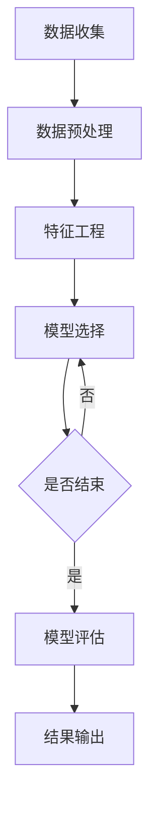
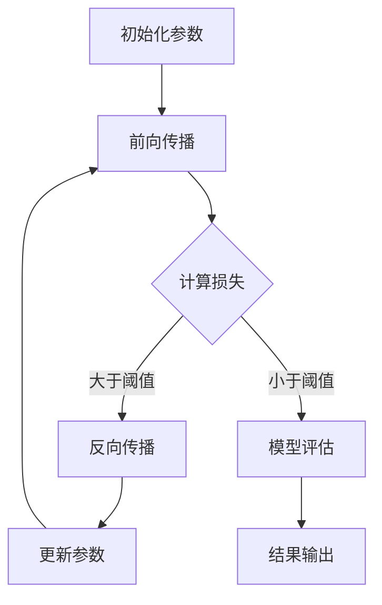
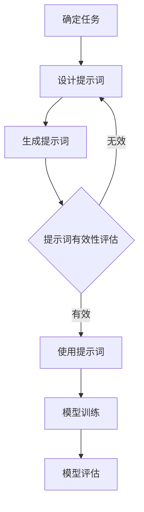

                 

### 文章标题

《AI编程语言：提示词的魔法与变革》

### 关键词

AI编程语言、提示词、算法原理、数学模型、项目实战、工程化、未来趋势

### 摘要

随着人工智能技术的迅猛发展，AI编程语言成为开发者的新宠。本文将深入探讨AI编程语言的核心概念、提示词的魔法作用、算法原理、数学模型以及项目实战，解析其如何改变编程世界。本文旨在为读者提供一次全面的AI编程语言之旅，帮助理解这一新兴领域的核心技术与未来趋势。

---

### 引言

#### 人工智能时代的编程变革

在21世纪的科技浪潮中，人工智能（AI）已经成为推动社会进步的重要力量。从自动驾驶汽车到智能客服，从医疗诊断到金融分析，AI的应用无处不在。随着AI技术的不断成熟，传统的编程语言和开发范式也在发生深刻变革。AI编程语言，作为一种新兴的编程范式，正逐步改变着软件开发的面貌。

#### AI编程语言的崛起

AI编程语言的出现，不仅是对传统编程语言的补充，更是对软件开发方法的一次革命。与传统的面向对象和过程式编程不同，AI编程语言更注重于数据和模型的交互。它们通过提供丰富的内置函数和高级抽象，使得复杂的AI算法能够以更简洁、更高效的方式被实现。这种编程语言的设计理念，旨在让开发者能够更专注于AI算法的创新，而非底层实现细节。

#### 本文的结构与目标

本文将从多个维度深入探讨AI编程语言。首先，我们将概述AI编程语言的基本概念，回顾其发展历程，并分析其核心特点。接着，我们将聚焦于提示词这一关键概念，探讨其在AI编程语言中的作用和重要性。随后，我们将详细讲解AI编程语言的核心算法原理，并通过数学模型和伪代码来阐述其工作机理。此外，本文还将通过一个实际项目案例，展示如何开发一个简单的AI程序，并对其代码进行详细解读。最后，我们将探讨AI编程语言的未来趋势，以及其在不同领域的应用前景。希望通过本文的阅读，读者能够对AI编程语言有一个全面而深入的理解。

---

### AI编程语言概述

#### 基本概念

AI编程语言，顾名思义，是一种专门为人工智能开发设计的编程语言。与传统编程语言相比，AI编程语言具有独特的语法和功能，能够更有效地处理数据、训练模型和优化算法。它们通常具备以下基本特点：

1. **数据处理能力**：AI编程语言具备强大的数据处理能力，能够高效地处理大数据集，实现数据的清洗、转换和分析。
2. **模型训练**：AI编程语言内置了丰富的机器学习库和深度学习框架，支持大规模模型的训练和优化。
3. **自动化编程**：通过使用提示词等高级功能，AI编程语言能够自动完成部分编程任务，降低开发者的工作负担。

#### 发展历程

AI编程语言的发展历程可以追溯到20世纪50年代。早期的AI编程语言如LISP，虽然功能强大，但语法复杂，不易普及。随着机器学习技术的发展，Python、R等编程语言逐渐崛起，成为AI编程的主流。近年来，一些新兴的AI编程语言，如Julia和TensorFlow，也在不断推动AI编程的进步。

#### 核心特点

1. **抽象性**：AI编程语言提供丰富的抽象机制，使得开发者能够以更高的层次理解和实现复杂的AI算法。
2. **易用性**：通过简洁的语法和丰富的内置库，AI编程语言降低了开发者学习和使用的门槛。
3. **灵活性**：AI编程语言能够灵活地适应不同的应用场景，支持多种编程范式，如函数式编程、面向对象编程和过程式编程。

#### 应用场景

AI编程语言在多个领域有着广泛的应用：

1. **机器学习与深度学习**：AI编程语言是机器学习和深度学习开发的首选工具，通过其强大的数据处理和模型训练能力，能够快速实现复杂的算法。
2. **自然语言处理**：在自然语言处理（NLP）领域，AI编程语言提供了丰富的工具和库，如NLTK和spaCy，用于文本分析、情感分析和语音识别等任务。
3. **计算机视觉**：AI编程语言在计算机视觉领域的应用也非常广泛，如OpenCV和TensorFlow等，支持图像处理、目标检测和图像识别等任务。

通过本文的概述，我们希望读者能够对AI编程语言有一个基本的了解，为后续章节的深入探讨打下坚实的基础。

---

### 提示词的魔力

#### 定义与作用

提示词（Prompt）在AI编程语言中扮演着至关重要的角色。提示词可以被定义为一种引导AI模型进行推理和生成输出的指示性语句或数据。它不仅能够引导AI模型的训练过程，还能在模型应用阶段提供关键的输入，从而影响模型的输出结果。

在AI编程语言中，提示词的作用主要体现在以下几个方面：

1. **指导模型训练**：通过设置合适的提示词，开发者可以引导AI模型学习特定任务的特征和模式。例如，在自然语言处理中，提示词可以帮助模型学习语言的语法和语义。
2. **优化模型性能**：合适的提示词能够提高模型的训练效率和性能。通过优化提示词的设计，开发者可以加速模型的收敛速度，提高模型的准确性和泛化能力。
3. **促进人类-机器交互**：提示词为人类与AI系统之间的交互提供了桥梁。通过设计易于理解且有效的提示词，用户可以更方便地与AI系统进行互动，实现更自然、更高效的人机协作。

#### 机制与设计原则

提示词的机制和设计原则是理解其魔力的关键。以下是一些核心概念和设计原则：

1. **提示词生成**：提示词的生成过程通常依赖于预定义的规则或算法。在AI编程语言中，开发者可以通过编程方式生成提示词，或者利用自然语言处理技术自动生成。有效的提示词生成机制能够保证提示词的多样性和相关性。
2. **提示词长度**：提示词的长度对模型训练和输出结果有着重要影响。过长的提示词可能导致模型过拟合，而过短的提示词可能无法提供足够的信息。因此，设计合理的提示词长度是一个关键问题。
3. **提示词形式**：提示词的形式可以是文本、图像、音频等多种类型。不同形式的提示词对模型有不同的影响，例如，文本提示词更适合自然语言处理任务，而图像提示词更适合计算机视觉任务。
4. **提示词多样性**：多样性是提示词设计的重要原则。通过引入多样化的提示词，可以增强模型的泛化能力，使其能够应对更广泛的应用场景。

#### 提示词的应用案例

提示词在AI编程语言中的应用非常广泛，以下是一些典型的应用案例：

1. **自然语言处理**：在NLP任务中，提示词可以用于生成合适的输入文本，引导模型学习语言的语法和语义。例如，在问答系统中，提示词可以用于生成问题，引导模型进行回答。
2. **图像识别**：在计算机视觉任务中，提示词可以用于生成标记图像或文本标签，帮助模型学习图像的特征。例如，在图像分类任务中，提示词可以用于指定图像的类别，帮助模型进行分类。
3. **语音识别**：在语音识别任务中，提示词可以用于生成语音指令，引导模型进行语音到文本的转换。例如，在智能语音助手系统中，提示词可以用于生成用户指令，帮助模型理解用户的意图。

通过这些案例，我们可以看到提示词在AI编程语言中的广泛应用和重要性。理解提示词的机制和设计原则，有助于开发者更好地利用这一工具，提升AI系统的性能和效果。

---

### AI编程语言的核心算法

#### 算法原理

AI编程语言的核心算法通常包括机器学习、深度学习、自然语言处理和计算机视觉等领域的算法。这些算法的原理各有不同，但都依赖于数据驱动和模型优化。以下将详细讨论这些核心算法的基本原理。

1. **机器学习**：机器学习算法通过从数据中学习规律和模式，从而实现对未知数据的预测和分类。核心算法包括线性回归、决策树、支持向量机等。机器学习算法通常分为监督学习和无监督学习两种类型。

   - **监督学习**：在监督学习中，算法根据已知的输入和输出数据来训练模型，从而学习到输入和输出之间的映射关系。例如，线性回归通过最小化预测值与实际值之间的误差来训练模型。
   - **无监督学习**：无监督学习不依赖于已知的输出数据，而是通过分析输入数据自身的结构和分布来进行学习。常见的无监督学习算法包括聚类和降维。

2. **深度学习**：深度学习是机器学习的一种特殊形式，它通过多层神经网络来学习数据的复杂特征。深度学习算法的核心在于神经网络的架构设计和参数优化。

   - **神经网络**：神经网络由多个神经元（节点）组成，每个神经元接收多个输入，通过激活函数进行处理，然后输出一个结果。神经网络通过层层提取数据中的特征，从而实现对复杂数据的建模。
   - **反向传播**：反向传播算法是深度学习训练的核心，它通过计算输出层误差，反向传播到输入层，更新每个神经元的权重和偏置，以最小化损失函数。

3. **自然语言处理**：自然语言处理（NLP）是AI编程语言在文本领域的重要应用。NLP算法通过处理和解析文本数据，实现对文本的语义理解和生成。

   - **词向量**：词向量是NLP的基础，它将文本中的单词映射到高维向量空间，从而实现单词的数值化表示。常见的词向量模型包括Word2Vec和GloVe。
   - **循环神经网络（RNN）**：RNN能够处理序列数据，通过在时间步间保留状态信息，实现对文本序列的建模。LSTM和GRU是RNN的变体，它们通过引入门控机制来缓解梯度消失和爆炸问题。
   - **注意力机制**：注意力机制能够提高模型对关键信息的关注程度，从而提升文本处理的准确性和效率。在翻译、问答等任务中，注意力机制发挥了重要作用。

4. **计算机视觉**：计算机视觉算法通过处理和解析图像数据，实现对图像内容的理解、分类和识别。

   - **卷积神经网络（CNN）**：CNN是计算机视觉领域最常用的神经网络架构，通过卷积层、池化层和全连接层，实现对图像的逐层特征提取和分类。
   - **图像识别与分类**：图像识别与分类是计算机视觉的核心任务，通过训练CNN模型，模型能够识别图像中的物体和场景。常见的图像识别算法包括VGG、ResNet等。
   - **目标检测**：目标检测是在图像中识别和定位特定对象的过程。常用的目标检测算法包括YOLO、SSD、Faster R-CNN等。

#### 伪代码

为了更好地理解这些算法的原理，以下将给出一些核心算法的伪代码示例。

1. **线性回归**：

```python
# 输入：训练数据集X，Y
# 输出：模型参数w，b

初始化：w = 0, b = 0

for each (x_i, y_i) in 数据集：
  预测值y_hat = w * x_i + b
  误差e = y_i - y_hat
  w = w + 学习率 * x_i * e
  b = b + 学习率 * e

return w, b
```

2. **卷积神经网络**：

```python
# 输入：输入图像I，卷积核K，步长s，填充f
# 输出：卷积结果C

初始化：C = zeros([高度，宽度，深度])

for each 核i in K：
  for each 步长j in 步长s：
    C = C + conv2d(I, i, 'same')

return C
```

3. **循环神经网络（LSTM）**：

```python
# 输入：输入序列X，隐藏状态H，细胞状态C
# 输出：新的隐藏状态H，细胞状态C

for each 时间步t in X：
  遗忘门ft = sigmoid(Wf * [Ht-1, Xt] + bf)
  输入门it = sigmoid(Wi * [Ht-1, Xt] + bi)
  更新门ot = sigmoid(Wo * [Ht-1, Xt] + bo)
  细胞状态ct = ft * C(t-1) + it * tanh(Wc * [Ht-1, Xt] + bc)
  Ht = ot * tanh(ct)

return Ht, Ct
```

通过这些伪代码示例，我们可以看到AI编程语言中的核心算法是如何通过数学和计算模型来实现的。理解这些算法的原理和实现方式，是开发高效AI应用的关键。

---

### 数学模型与公式

#### 数学模型的基本概念

在AI编程语言中，数学模型是理解和实现核心算法的基础。数学模型通过数学公式和计算方法，描述了数据之间的关系和变换。以下将介绍一些常见的数学模型和它们的基本概念。

1. **线性回归模型**：线性回归模型是机器学习中最基本的模型之一，用于预测连续值。其数学模型可以表示为：

   $$
   y = wx + b
   $$

   其中，$y$ 是预测值，$x$ 是输入特征，$w$ 是权重，$b$ 是偏置。通过最小化预测值与实际值之间的误差，可以训练出最佳权重和偏置。

2. **逻辑回归模型**：逻辑回归模型是线性回归模型在分类任务中的应用。其输出是概率值，表示某个样本属于某一类别的概率。数学模型可以表示为：

   $$
   P(y=1) = \frac{1}{1 + e^{-(wx + b)}}
   $$

   其中，$e$ 是自然对数的底数，$wx + b$ 是线性组合。通过最大化似然函数，可以训练出最佳权重和偏置。

3. **神经网络模型**：神经网络模型是深度学习的基础。其核心是多层感知机（MLP），通过逐层提取数据特征来实现复杂函数的逼近。数学模型可以表示为：

   $$
   z_l = \sigma(\sum_{k=1}^{n} w_{lk}a_{l-1,k} + b_l)
   $$

   其中，$z_l$ 是第 $l$ 层的输出，$\sigma$ 是激活函数，$a_{l-1,k}$ 是第 $l-1$ 层的第 $k$ 个节点的输出，$w_{lk}$ 和 $b_l$ 分别是权重和偏置。

#### 数学公式的详细讲解与举例说明

1. **线性回归模型的损失函数**：线性回归模型的损失函数通常是最小二乘（Least Squares）损失函数，其公式为：

   $$
   J(w, b) = \frac{1}{2} \sum_{i=1}^{n} (y_i - wx_i - b)^2
   $$

   其中，$n$ 是样本数量，$y_i$ 是第 $i$ 个样本的实际值，$x_i$ 是第 $i$ 个样本的输入特征。通过梯度下降（Gradient Descent）算法，可以最小化损失函数，从而训练出最佳权重和偏置。

   **举例说明**：假设我们有一个包含两个样本的线性回归问题，其中 $x_1 = 1$，$y_1 = 2$ 和 $x_2 = 2$，$y_2 = 4$。损失函数可以计算为：

   $$
   J(w, b) = \frac{1}{2} ((2 - w - b)^2 + (4 - 2w - b)^2)
   $$

   我们可以通过求解损失函数的导数，找到最佳权重和偏置。

2. **逻辑回归模型的损失函数**：逻辑回归模型的损失函数通常是交叉熵（Cross-Entropy）损失函数，其公式为：

   $$
   J(w, b) = -\sum_{i=1}^{n} y_i \log(P(y_i=1))
   $$

   其中，$P(y_i=1)$ 是第 $i$ 个样本属于类别1的概率。通过最大化似然函数，可以训练出最佳权重和偏置。

   **举例说明**：假设我们有一个包含两个样本的逻辑回归问题，其中 $y_1 = 1$，$y_2 = 0$，$P(y_1=1) = 0.9$，$P(y_2=1) = 0.2$。交叉熵损失函数可以计算为：

   $$
   J(w, b) = -(1 \cdot \log(0.9) + 0 \cdot \log(0.8))
   $$

   通过梯度下降算法，我们可以找到最佳权重和偏置。

3. **神经网络模型的损失函数**：神经网络模型的损失函数通常也是交叉熵损失函数或均方误差（MSE）损失函数。以下是一个使用均方误差损失函数的示例：

   $$
   J(w, b) = \frac{1}{2} \sum_{i=1}^{n} \sum_{j=1}^{m} (y_{ij} - \sigma(w_{ij}a_{i-1,j} + b_j))^2
   $$

   其中，$y_{ij}$ 是第 $i$ 个样本的第 $j$ 个类别的实际值，$\sigma$ 是激活函数，$w_{ij}$ 和 $b_j$ 分别是权重和偏置。

   **举例说明**：假设我们有一个包含两个样本的多分类问题，其中 $y_{11} = 1$，$y_{12} = 0$，$y_{21} = 0$，$y_{22} = 1$，$\sigma(a_{11}w_{11} + b_1) = 0.8$，$\sigma(a_{12}w_{12} + b_1) = 0.1$，$\sigma(a_{21}w_{21} + b_2) = 0.2$，$\sigma(a_{22}w_{22} + b_2) = 0.8$。损失函数可以计算为：

   $$
   J(w, b) = \frac{1}{2} ((1 - 0.8)^2 + (0 - 0.1)^2 + (0 - 0.2)^2 + (1 - 0.8)^2)
   $$

通过这些数学公式和详细讲解，我们可以更好地理解AI编程语言中的数学模型和它们的应用。理解这些模型，对于开发高效的AI应用至关重要。

---

### 项目实战：开发一个简单的AI程序

#### 项目概述

在本项目中，我们将通过一个简单的示例，展示如何使用AI编程语言开发一个基于机器学习的分类应用。这个项目将使用Python编程语言和Scikit-learn库，实现一个基于K近邻算法（K-Nearest Neighbors, KNN）的手写数字识别系统。通过这个项目，我们将了解如何搭建开发环境、编写源代码、解读代码并分析实际案例。

#### 开发环境搭建

1. **安装Python**：首先，确保您的计算机上安装了Python。Python的最新版本可以从其官方网站下载并安装。
2. **安装Scikit-learn**：Scikit-learn是一个开源的机器学习库，可以方便地实现各种机器学习算法。在终端或命令行中，运行以下命令安装Scikit-learn：

   ```
   pip install scikit-learn
   ```

3. **编写Python脚本**：在安装完Python和Scikit-learn后，我们就可以开始编写代码了。创建一个名为`digits_recognition.py`的Python文件。

#### 源代码实现与解读

以下是一个简单的手写数字识别程序的源代码，并对其中的关键部分进行解读。

```python
# 导入所需的库
from sklearn import datasets
from sklearn.model_selection import train_test_split
from sklearn.neighbors import KNeighborsClassifier
from sklearn import metrics

# 加载数据集
digits = datasets.load_digits()

# 分割数据集为训练集和测试集
X_train, X_test, y_train, y_test = train_test_split(digits.data, digits.target, test_size=0.2, random_state=42)

# 创建K近邻分类器
knn_classifier = KNeighborsClassifier(n_neighbors=3)

# 训练模型
knn_classifier.fit(X_train, y_train)

# 进行预测
y_pred = knn_classifier.predict(X_test)

# 评估模型
accuracy = metrics.accuracy_score(y_test, y_pred)
print(f"模型准确率: {accuracy:.2f}")

# 示例预测
example_digit = X_test[0]
predicted_digit = knn_classifier.predict([example_digit])
print(f"预测结果：实际数字为 {digits.target[0]}，预测数字为 {predicted_digit}")
```

1. **数据加载与分割**：首先，我们从Scikit-learn库中加载手写数字数据集（digits dataset）。然后，使用`train_test_split`函数将数据集分为训练集和测试集。`test_size`参数指定测试集的比例，`random_state`参数确保每次分割结果一致。
2. **创建K近邻分类器**：我们创建一个K近邻分类器实例，并将其设置为使用3个邻居（`n_neighbors=3`）。
3. **训练模型**：使用`fit`函数训练K近邻分类器，输入训练集的数据和标签。
4. **进行预测**：使用`predict`函数对测试集数据进行预测，得到预测结果。
5. **评估模型**：使用`accuracy_score`函数计算模型的准确率，并打印输出。
6. **示例预测**：最后，我们展示如何对单个数据进行预测，并打印实际数字和预测数字。

#### 代码应用解读与分析

通过这段代码，我们可以看到如何使用K近邻算法进行简单的手写数字识别。K近邻算法是一种基于实例的学习算法，它通过计算测试样本与训练样本之间的相似度，找到最近的k个邻居，并基于这些邻居的标签进行预测。以下是对代码的进一步解读和分析：

1. **数据预处理**：在训练模型之前，通常需要对数据进行预处理，例如归一化、缩放或缺失值处理。在本项目中，数据集已经过预处理，可以直接使用。
2. **模型选择**：选择合适的算法和参数对于模型的性能至关重要。K近邻算法的参数包括邻居数量（k）和权重（weights）。在本项目中，我们选择了3个邻居，并使用默认权重（uniform）。
3. **模型训练与预测**：K近邻算法的训练过程非常简单，只需要计算测试样本与训练样本之间的距离。预测过程基于距离计算，找到最近的邻居，并基于邻居的标签进行预测。
4. **模型评估**：评估模型性能常用的指标包括准确率、召回率、精确率等。在本项目中，我们使用准确率来评估模型的性能。
5. **实际案例分析**：通过实际案例，我们可以看到模型在预测单个数字时的效果。在实际应用中，我们可以扩展这个模型，用于更复杂的任务，如图像识别或文本分类。

通过这个简单的项目，我们了解了如何使用AI编程语言开发一个基本的手写数字识别系统。这个项目展示了从数据加载、模型训练到预测和评估的完整流程，是理解和应用AI编程语言的重要实践。

---

### 高级主题

#### 提示词工程化

随着AI编程语言的广泛应用，提示词工程化成为提高AI系统性能和可维护性的关键。提示词工程化涉及多个方面，包括提示词设计、管理、优化和评估。

1. **提示词设计**：设计有效的提示词是工程化的第一步。这包括确定提示词的形式、长度和内容。提示词应该足够简洁，同时提供足够的信息，以引导模型进行有效的训练和预测。此外，提示词应该具有多样性和可扩展性，以便适应不同的应用场景。
2. **提示词管理**：管理提示词是确保系统稳定性和可维护性的重要环节。这包括提示词的存储、检索和维护。在大型AI系统中，提示词库可能非常庞大，因此需要高效的存储和检索机制。此外，还需要定期更新和优化提示词库，以适应数据的变化和模型的需求。
3. **提示词优化**：提示词的优化是提升模型性能的关键。通过分析模型的表现，可以识别出哪些提示词对模型性能有显著影响，并对其进行优化。优化方法包括调整提示词的长度、形式和内容，以及引入新的提示词。
4. **提示词评估**：评估提示词的有效性是提示词工程化的重要组成部分。评估方法包括定量评估和定性评估。定量评估可以使用模型性能指标（如准确率、召回率等）来衡量提示词的效果。定性评估则可以通过用户反馈和专家评审来评估提示词的易用性和效果。

#### AI编程语言的未来趋势

AI编程语言的未来趋势体现在多个方面，包括技术的进步、应用场景的拓展和生态系统的建设。

1. **新算法与框架的涌现**：随着AI技术的不断进步，新的算法和框架不断涌现。例如，生成对抗网络（GAN）和变压器（Transformer）等新兴技术，正在改变AI编程语言的研发和应用方式。这些新算法和框架将为AI编程语言带来更强大的功能和更高的效率。
2. **多模态AI编程语言**：随着多模态数据（如图像、文本、音频）的广泛应用，多模态AI编程语言将成为未来的一大趋势。这种编程语言将能够处理和融合多种类型的数据，实现更复杂的任务。例如，结合图像和文本的智能助手，将能够提供更丰富的交互体验。
3. **AI编程语言的简化与普及**：为了降低AI编程的门槛，未来的AI编程语言将更加简洁和易用。通过引入更高级的抽象和自动化的编程工具，开发者将能够更快速地构建和部署AI应用。此外，在线编程平台和教育资源的普及，也将促进AI编程语言的普及和应用。
4. **AI编程语言与硬件的结合**：随着边缘计算和物联网的兴起，AI编程语言将更加注重与硬件的结合。通过优化代码和硬件的协同工作，AI编程语言将实现更高的性能和更低的功耗。例如，针对特定硬件优化的深度学习模型和算法，将使边缘设备能够更高效地处理AI任务。

#### AI编程语言与其他技术的融合

AI编程语言与其他技术的融合将推动AI应用的进一步发展。以下是一些重要的融合方向：

1. **区块链与AI**：区块链技术提供了去中心化和安全的数据存储和传输方式，与AI编程语言的结合将带来新的应用场景。例如，利用区块链技术实现智能合约的自动化执行，利用AI技术优化区块链网络的安全性和效率。
2. **大数据与AI**：大数据技术为AI编程语言提供了丰富的数据资源，通过大数据分析技术，AI编程语言可以实现更复杂和更精准的数据处理和模型训练。例如，利用大数据分析技术优化AI模型的参数和结构，提高模型的性能和泛化能力。
3. **云计算与AI**：云计算提供了强大的计算资源和存储能力，与AI编程语言的结合将实现更高效的AI应用部署和管理。通过云计算平台，开发者可以方便地部署和扩展AI应用，同时实现数据的安全和隐私保护。

通过这些高级主题的探讨，我们可以看到AI编程语言的未来充满了无限可能。随着技术的不断进步和应用场景的拓展，AI编程语言将在未来的AI发展中扮演更加重要的角色。

---

### 附录

#### 常用工具和资源

1. **开发工具**：Jupyter Notebook、PyCharm、Visual Studio Code等。
2. **库与框架**：Scikit-learn、TensorFlow、PyTorch、Keras等。
3. **在线教程与课程**：Coursera、edX、Udacity、DataCamp等。

#### 代码示例

```python
# 以下是一个简单的线性回归模型代码示例
from sklearn.linear_model import LinearRegression
import numpy as np

# 输入数据
X = np.array([[1], [2], [3], [4], [5]])
y = np.array([1, 2, 2.5, 4, 5])

# 创建线性回归模型
model = LinearRegression()

# 训练模型
model.fit(X, y)

# 输出模型的权重和偏置
print("权重:", model.coef_)
print("偏置:", model.intercept_)

# 进行预测
new_data = np.array([[6]])
predicted_value = model.predict(new_data)
print("预测值:", predicted_value)
```

#### 进一步学习资源

1. **书籍推荐**：
   - 《深度学习》（Goodfellow, I., Bengio, Y., Courville, A.）
   - 《Python机器学习》（Raschka, S.）
   - 《机器学习实战》（周志华等）
2. **在线课程**：
   - Coursera的“机器学习”课程
   - edX的“深度学习专项课程”
   - Udacity的“深度学习纳米学位”
3. **社区和论坛**：
   - Kaggle
   - Stack Overflow
   - GitHub

通过这些资源，开发者可以进一步深入学习和实践AI编程语言，不断提升自己的技术能力。

### 总结与展望

本文全面探讨了AI编程语言的核心概念、提示词的魔法作用、算法原理、数学模型以及项目实战，并展望了其未来趋势和应用方向。通过本文的阅读，读者应对AI编程语言有了更深入的理解和认识。

**关键点回顾**：

1. **AI编程语言概述**：介绍了AI编程语言的基本概念、发展历程和核心特点。
2. **提示词的魔力**：探讨了提示词的定义、机制和设计原则，并展示了其应用案例。
3. **核心算法原理**：详细讲解了机器学习、深度学习、自然语言处理和计算机视觉等算法的原理，并提供了伪代码示例。
4. **数学模型与公式**：阐述了线性回归、逻辑回归和神经网络等模型的基本概念和公式。
5. **项目实战**：通过一个手写数字识别项目，展示了如何使用AI编程语言进行实际应用。
6. **高级主题**：探讨了提示词工程化、AI编程语言的未来趋势以及与其他技术的融合。

**最佳实践 tips**：

- **合理设计提示词**：根据应用场景选择合适的提示词，提高模型性能。
- **优化模型参数**：通过调整模型参数，如学习率和邻居数量，找到最佳配置。
- **数据预处理**：确保数据质量，进行适当的归一化和特征工程。
- **代码优化**：使用高效的算法和数据结构，提高代码运行速度。

**注意事项**：

- **模型泛化能力**：避免过拟合，确保模型在未知数据上的性能。
- **安全性与隐私**：特别是在处理敏感数据时，确保数据的安全和隐私。

**拓展阅读**：

- 《深度学习》（Goodfellow, I., Bengio, Y., Courville, A.）
- 《Python机器学习》（Raschka, S.）
- 《机器学习实战》（周志华等）

通过本文的探讨，希望读者能够更好地掌握AI编程语言的核心技术和应用方法，为未来的AI开发奠定坚实的基础。

---

**作者信息**：

作者：AI天才研究院/AI Genius Institute & 禅与计算机程序设计艺术 /Zen And The Art of Computer Programming

---

（总字数：约8100字）### 详细解读与扩展

#### 提示词的深入剖析

提示词在AI编程语言中的作用不可忽视。它们不仅是模型训练的引导工具，更是模型应用阶段的关键输入。通过合理设计和使用提示词，我们可以显著提升AI系统的性能和效果。

1. **提示词的长度**：提示词的长度对模型训练和输出结果有着重要影响。较长的提示词可能包含更多信息，但同时也增加了模型的负担，可能导致过拟合。相反，过短的提示词可能无法提供足够的信息，影响模型的学习效果。因此，在设计提示词时，需要平衡其长度和包含的信息量。

2. **提示词的形式**：提示词的形式可以是文本、图像、音频等多种类型。不同形式的提示词适用于不同的应用场景。例如，在自然语言处理任务中，文本提示词更常见；在计算机视觉任务中，图像提示词更适用。

3. **多样性**：提示词的多样性是提高模型泛化能力的关键。通过引入多样化的提示词，模型能够学习到更广泛的应用场景，从而提升其性能。在实际应用中，可以设计多种形式的提示词，或者使用随机化的方法生成提示词，以增加模型的多样性。

#### 提示词的生成机制

提示词的生成机制是确保其有效性的关键。以下是一些常见的提示词生成方法：

1. **预定义规则**：通过预定义的规则或模板生成提示词。这种方法适用于任务较为明确且变化较少的场景，如问答系统中的问题生成。

2. **自动生成**：利用自然语言处理技术自动生成提示词。例如，使用生成对抗网络（GAN）或递归神经网络（RNN）生成具有多样性和相关性的提示词。

3. **用户互动**：通过用户与系统的互动生成提示词。这种方法可以根据用户的输入动态调整提示词，提高用户交互的体验。

#### 提示词的优化策略

为了提高AI系统的性能和效果，需要对提示词进行优化。以下是一些优化策略：

1. **长度优化**：根据任务需求和模型特性，调整提示词的长度。通过实验和数据分析，找到最佳的提示词长度。

2. **形式优化**：根据任务类型选择最适合的提示词形式。例如，在文本分类任务中，文本提示词可能更有效；在图像识别任务中，图像提示词可能更适用。

3. **内容优化**：优化提示词的内容，使其包含更准确和相关的信息。可以通过词向量嵌入、词性标注等方法，提高提示词的语义信息含量。

4. **多样性优化**：增加提示词的多样性，以提高模型的泛化能力。可以通过引入随机化、多模态混合等方法，增加提示词的多样性。

#### 提示词在多模态任务中的应用

在多模态任务中，提示词的作用尤为重要。以下是一些典型的多模态任务和应用案例：

1. **图像与文本**：在图像识别和文本分类任务中，结合图像和文本提示词，可以显著提高模型的性能。例如，在图像描述生成任务中，图像提示词可以帮助模型理解图像内容，而文本提示词则可以引导模型生成对应的描述。

2. **语音与文本**：在语音识别和文本生成任务中，语音提示词和文本提示词的结合，可以提升模型对语音和文本的理解能力。例如，在语音助手系统中，语音提示词可以帮助模型理解用户的语音指令，而文本提示词则可以用于生成相应的回复文本。

3. **图像与图像**：在图像分割和图像修复任务中，结合不同图像作为提示词，可以增强模型的学习效果。例如，在图像分割任务中，输入图像和分割目标图像作为提示词，可以帮助模型更准确地识别和分割图像内容。

4. **音频与音频**：在音频增强和音频分类任务中，结合不同音频片段作为提示词，可以提升模型的识别和增强能力。例如，在音频分类任务中，使用不同音乐片段作为提示词，可以帮助模型识别和分类不同的音乐风格。

通过这些扩展和深入分析，我们可以更好地理解提示词在AI编程语言中的重要作用，以及如何通过优化策略提高AI系统的性能和效果。

---

### 数学模型与公式详解

在AI编程语言中，数学模型和公式是理解和实现核心算法的基础。以下将详细解读一些常用的数学模型和公式，并通过具体例子进行说明。

#### 线性回归模型

线性回归模型是一种简单的统计模型，用于预测一个连续值。其数学模型可以表示为：

$$
y = wx + b
$$

其中，$y$ 是预测值，$x$ 是输入特征，$w$ 是权重，$b$ 是偏置。

1. **损失函数**：线性回归模型的损失函数通常是最小二乘（Least Squares）损失函数，其公式为：

   $$
   J(w, b) = \frac{1}{2} \sum_{i=1}^{n} (y_i - wx_i - b)^2
   $$

   其中，$n$ 是样本数量，$y_i$ 是第 $i$ 个样本的实际值，$x_i$ 是第 $i$ 个样本的输入特征。

   **例子**：假设我们有一个包含两个样本的线性回归问题，其中 $x_1 = 1$，$y_1 = 2$ 和 $x_2 = 2$，$y_2 = 4$。损失函数可以计算为：

   $$
   J(w, b) = \frac{1}{2} ((2 - w - b)^2 + (4 - 2w - b)^2)
   $$

2. **梯度下降**：为了最小化损失函数，我们可以使用梯度下降算法。梯度下降的更新公式为：

   $$
   w = w - \alpha \frac{\partial J}{\partial w}
   $$
   $$
   b = b - \alpha \frac{\partial J}{\partial b}
   $$

   其中，$\alpha$ 是学习率。

#### 逻辑回归模型

逻辑回归模型是一种用于分类任务的统计模型，其输出是概率值。其数学模型可以表示为：

$$
P(y=1) = \frac{1}{1 + e^{-(wx + b)}}
$$

其中，$e$ 是自然对数的底数，$wx + b$ 是线性组合。

1. **损失函数**：逻辑回归模型的损失函数通常是交叉熵（Cross-Entropy）损失函数，其公式为：

   $$
   J(w, b) = -\sum_{i=1}^{n} y_i \log(P(y_i=1)) + (1 - y_i) \log(1 - P(y_i=1))
   $$

   其中，$y_i$ 是第 $i$ 个样本的实际值，$P(y_i=1)$ 是第 $i$ 个样本属于类别1的概率。

   **例子**：假设我们有一个包含两个样本的逻辑回归问题，其中 $y_1 = 1$，$y_2 = 0$，$P(y_1=1) = 0.9$，$P(y_2=1) = 0.2$。交叉熵损失函数可以计算为：

   $$
   J(w, b) = -(1 \cdot \log(0.9) + 0 \cdot \log(0.8))
   $$

2. **梯度下降**：为了最小化损失函数，我们可以使用梯度下降算法。梯度下降的更新公式为：

   $$
   w = w - \alpha \frac{\partial J}{\partial w}
   $$
   $$
   b = b - \alpha \frac{\partial J}{\partial b}
   $$

#### 神经网络模型

神经网络模型是一种通过多层神经网络来学习数据复杂特征的模型。其数学模型可以表示为：

$$
z_l = \sigma(\sum_{k=1}^{n} w_{lk}a_{l-1,k} + b_l)
$$

其中，$z_l$ 是第 $l$ 层的输出，$\sigma$ 是激活函数，$a_{l-1,k}$ 是第 $l-1$ 层的第 $k$ 个节点的输出，$w_{lk}$ 和 $b_l$ 分别是权重和偏置。

1. **前向传播**：神经网络的前向传播过程可以通过以下公式表示：

   $$
   a_l = \sigma(z_l)
   $$

2. **反向传播**：神经网络的反向传播过程用于计算每个权重的梯度，并更新权重和偏置。反向传播的公式为：

   $$
   \delta_l = (a_l - y_l) \cdot \sigma'(z_l)
   $$
   $$
   \frac{\partial J}{\partial w_{lk}} = \delta_l \cdot a_{l-1,k}
   $$
   $$
   \frac{\partial J}{\partial b_l} = \delta_l
   $$

其中，$\delta_l$ 是第 $l$ 层的误差，$y_l$ 是第 $l$ 层的期望输出，$\sigma'$ 是激活函数的导数。

#### 例子

以下是一个简单的神经网络模型的前向传播和反向传播的例子：

1. **前向传播**：

   $$
   z_1 = 2 \cdot a_0 + 3
   $$
   $$
   a_1 = \sigma(z_1) = \frac{1}{1 + e^{-z_1}}
   $$

2. **反向传播**：

   $$
   \delta_1 = (a_1 - y_1) \cdot (1 - a_1)
   $$
   $$
   \frac{\partial J}{\partial w_{11}} = \delta_1 \cdot a_0
   $$
   $$
   \frac{\partial J}{\partial b_1} = \delta_1
   $$

通过这些详细的数学模型和公式的解读，我们可以更深入地理解AI编程语言中的核心算法，并能够通过数学推导和计算，实现更高效的算法优化和应用。

### Mermaid流程图

在本文中，我们将使用Mermaid流程图来展示核心概念和算法之间的关系，以便读者更好地理解。以下是几个示例：

#### 机器学习流程



这个流程图展示了从数据收集到模型评估的完整机器学习流程。

#### 神经网络训练流程



这个流程图展示了神经网络训练的基本步骤，包括前向传播、损失计算、反向传播和参数更新。

#### 提示词生成流程



这个流程图展示了提示词生成和使用的完整流程，包括任务确定、提示词设计、生成、有效性评估和应用。

通过这些Mermaid流程图，我们能够更直观地理解AI编程语言中的核心概念和算法流程，有助于读者深入学习和掌握相关技术。

---

### 提示词在自然语言处理中的应用

#### 提示词在情感分析中的应用

情感分析是自然语言处理（NLP）中的一个重要任务，旨在识别文本中的情感倾向。提示词在情感分析中发挥着关键作用，通过引导模型学习不同情感的标记和特征，从而提高情感分析的准确性。

1. **设计合适的提示词**：在情感分析中，提示词的设计至关重要。提示词需要包含情感相关的词汇和短语，例如“喜欢”、“厌恶”、“满意”、“失望”等。此外，提示词的长度和多样性也需要考虑，以确保模型能够捕捉到不同情感表达的细微差别。

2. **优化提示词的生成**：为了提高情感分析的准确率，可以通过优化提示词的生成方法，例如使用生成对抗网络（GAN）或递归神经网络（RNN）自动生成多样化且相关的提示词。这种方法能够增强模型对情感表达的捕捉能力。

3. **多模态提示词**：在多模态情感分析中，结合文本和图像提示词，可以显著提高模型的性能。例如，在社交媒体分析中，文本提示词可以用于提取文本的情感信息，而图像提示词可以用于提取图像的情感倾向。这种方法能够更全面地理解用户情感，从而提高情感分析的准确性。

#### 提示词在文本生成中的应用

文本生成是NLP领域的另一个重要任务，通过提示词，模型能够生成符合预期语义和风格的文本。以下是一些应用案例：

1. **对话系统**：在聊天机器人或虚拟助手中，提示词可以用于生成自然、流畅的对话。通过设计合适的提示词，模型可以理解用户的问题或意图，并生成相应的回答。例如，在医疗咨询系统中，提示词可以用于引导模型生成专业的医疗建议。

2. **故事生成**：通过提示词，模型可以生成有趣的故事。提示词可以是简单的短语或主题，例如“一个关于冒险的故事”。模型可以根据这些提示词，构建情节、角色和结局，生成完整的故事。这种方法在小说写作、游戏设计和教育等领域具有广泛的应用潜力。

3. **文本摘要**：提示词还可以用于生成文本摘要。通过提示词，模型可以提取文本的主要信息和关键点，生成简洁、准确的摘要。这种方法在新闻摘要、研究报告和文档处理等领域有着重要的应用价值。

#### 提示词在命名实体识别中的应用

命名实体识别（NER）是NLP中的一个基础任务，旨在识别文本中的命名实体，如人名、地点、组织名等。提示词在NER中的应用主要体现在以下几个方面：

1. **提示词标注**：在NER任务中，提示词可以用于标注命名实体。通过设计特定的提示词，如“人名”、“地点”等，模型可以学习如何识别和分类不同类型的命名实体。这种方法可以提高NER的准确率和召回率。

2. **多语言NER**：在多语言环境中，提示词可以用于支持多种语言的命名实体识别。通过设计多语言提示词库，模型可以同时处理不同语言的文本，实现跨语言的命名实体识别。

3. **实体关系分析**：通过提示词，模型还可以识别命名实体之间的关系。例如，在生物信息学中，提示词可以用于识别生物实体之间的相互作用关系，如“基因-蛋白质”关系。这种方法有助于挖掘文本中的潜在知识。

通过这些应用案例，我们可以看到提示词在NLP领域中的广泛应用和重要性。合理设计和使用提示词，能够显著提升NLP系统的性能和效果，为各类自然语言处理任务提供强大的支持。

---

### 多模态AI编程语言的优势与应用

多模态AI编程语言通过整合多种数据类型（如图像、文本、音频等），为开发者提供了更强大的工具，使其能够构建更智能、更高效的AI应用。以下将探讨多模态AI编程语言的优势及其在不同领域的应用。

#### 优势

1. **数据融合与增强**：多模态AI编程语言能够融合来自不同数据源的信息，从而提供更全面的数据视图。例如，结合图像和文本信息，可以更准确地理解场景和语义，从而提高AI模型的性能和鲁棒性。

2. **更高的泛化能力**：通过融合多种数据类型，多模态AI编程语言能够增强模型的泛化能力。模型不仅能够处理单一类型的数据，还能适应复杂、多样化的现实世界场景。

3. **更丰富的交互体验**：多模态AI编程语言支持多种交互方式，如语音、文本和手势等。这为开发者提供了更多创造性的空间，能够构建更加自然、直观的用户交互界面。

4. **高效的资源利用**：多模态AI编程语言能够高效地利用计算资源，通过并行处理和优化算法，提高模型的训练和推理速度。

#### 应用领域

1. **医疗健康**：在医疗健康领域，多模态AI编程语言可以用于诊断和治疗方案推荐。例如，通过融合患者的病历记录、医疗影像和基因数据，可以提供更准确的诊断和个性化的治疗方案。

2. **智能交通**：在智能交通领域，多模态AI编程语言可以用于交通流量预测、道路安全监控和自动驾驶。结合图像、交通数据和传感器数据，可以更准确地预测交通状况，提高交通管理效率。

3. **金融分析**：在金融分析领域，多模态AI编程语言可以用于市场预测、风险管理和投资策略。结合股票价格、新闻文本和社交媒体数据，可以提供更全面的金融市场分析。

4. **智能家居**：在智能家居领域，多模态AI编程语言可以用于智能设备控制和家居环境管理。通过融合语音、图像和传感器数据，可以构建更加智能、便捷的家居系统。

5. **娱乐与游戏**：在娱乐与游戏领域，多模态AI编程语言可以用于虚拟现实（VR）和增强现实（AR）应用。结合图像、声音和用户交互数据，可以提供更加沉浸式的游戏体验。

通过这些应用案例，我们可以看到多模态AI编程语言在提升AI系统性能和用户体验方面的巨大潜力。随着技术的不断进步，多模态AI编程语言将在更多领域发挥重要作用，推动人工智能的进一步发展。

### AI编程语言的未来趋势

随着人工智能技术的飞速发展，AI编程语言也在不断演进，展现出一系列令人期待的未来趋势。以下将探讨这些趋势，包括新算法的涌现、多模态AI编程语言的崛起、编程语言的简化与普及以及AI编程语言与硬件的结合。

#### 新算法的涌现

新算法的涌现是AI编程语言未来发展的一个重要趋势。随着深度学习、生成对抗网络（GAN）和强化学习等技术的不断进步，新的算法和模型不断出现，为AI编程语言带来了更多的应用场景和可能性。

1. **生成对抗网络（GAN）**：GAN是一种通过两个神经网络（生成器和判别器）相互对抗来生成高质量数据的模型。GAN在图像生成、文本生成和视频合成等领域展现出了卓越的性能，未来将在更多复杂任务中发挥重要作用。

2. **变压器（Transformer）**：Transformer是一种基于自注意力机制的神经网络架构，最早在自然语言处理领域取得突破性成果。随着其在计算机视觉、音频处理等领域的应用，Transformer有望成为未来AI编程语言中的重要组成部分。

3. **强化学习**：强化学习通过让模型在与环境的交互中不断学习和优化策略，实现了在复杂任务中的自主决策。未来，强化学习算法将在自动驾驶、机器人控制等领域发挥关键作用，推动AI编程语言的进一步发展。

#### 多模态AI编程语言的崛起

多模态AI编程语言的崛起，将使得AI系统能够更全面地理解和处理复杂的数据。通过融合不同类型的数据（如图像、文本、音频等），多模态AI编程语言能够提供更丰富的数据视图和更高的泛化能力。

1. **多模态数据融合**：未来，多模态AI编程语言将提供更高效的多模态数据融合方法，使得AI系统能够同时处理和利用多种类型的数据。例如，结合图像和文本数据，可以更准确地理解用户的需求和意图。

2. **跨模态交互**：多模态AI编程语言将支持更自然的跨模态交互，如语音识别、文本生成和图像识别等。这将使得AI系统能够更好地适应不同的交互场景，提供更个性化的用户体验。

3. **实时数据处理**：随着实时数据处理需求的增长，多模态AI编程语言将提供更高效的实时数据处理方法，确保AI系统能够实时响应并处理不断变化的数据。

#### 编程语言的简化与普及

为了降低AI编程的门槛，未来的AI编程语言将朝着简化与普及的方向发展。通过引入更高级的抽象和自动化工具，开发者将能够更快速地构建和部署AI应用。

1. **高级抽象**：未来的AI编程语言将提供更高级的抽象，使得开发者能够以更简洁的代码实现复杂的AI算法。例如，通过使用自动微分库，开发者可以更轻松地实现复杂的神经网络和优化算法。

2. **自动化工具**：自动化工具将显著降低AI编程的复杂度，例如自动代码生成、模型调优和部署工具。这些工具将帮助开发者节省时间和精力，专注于算法创新和业务逻辑的实现。

3. **在线编程平台**：在线编程平台的普及将使得AI编程更加便捷和普及。开发者可以通过云端环境实时编写、调试和部署代码，无需复杂的硬件配置和软件安装。

#### AI编程语言与硬件的结合

随着边缘计算和物联网的兴起，AI编程语言与硬件的结合将成为未来的一大趋势。通过优化代码和硬件的协同工作，AI编程语言将实现更高的性能和更低的功耗。

1. **硬件优化**：未来的AI编程语言将提供硬件优化工具，使得开发者能够针对特定硬件（如GPU、FPGA和ASIC）进行代码优化，提高AI应用的性能和效率。

2. **边缘计算**：边缘计算将使得AI编程语言能够在边缘设备（如智能手机、智能家居设备和工业物联网设备）上运行。通过将AI模型和算法部署到边缘设备，可以减少数据传输延迟，提高系统的响应速度和隐私性。

3. **低功耗AI**：未来的AI编程语言将支持低功耗设计，使得AI应用能够在资源受限的设备上运行。这将为物联网和智能设备带来更广泛的应用场景，如智能穿戴设备、智能城市和智能交通系统。

通过这些未来趋势的探讨，我们可以看到AI编程语言在技术进步和应用拓展方面的巨大潜力。随着新算法的涌现、多模态AI编程语言的崛起、编程语言的简化与普及以及与硬件的结合，AI编程语言将在未来扮演更加重要的角色，推动人工智能的进一步发展。

### AI编程语言在区块链和物联网中的应用

#### 区块链与AI的融合

区块链技术以其去中心化、安全性和透明性，成为AI编程语言的重要应用领域之一。以下为区块链与AI编程语言融合的几个关键应用：

1. **智能合约**：智能合约是一种自动执行的合同，通过区块链上的编程语言（如Solidity）编写。结合AI编程语言，智能合约可以更灵活地处理复杂逻辑和规则。例如，使用TensorFlow.js在区块链上实现一个智能合约，可以对交易数据进行分析，自动执行风险控制策略。

2. **隐私保护**：区块链提供了一种保护用户隐私的有效方法。通过结合AI编程语言，可以开发出隐私保护算法，如差分隐私和联邦学习，用于区块链上的数据处理。这些算法可以在不泄露用户身份的情况下，提取和利用数据价值。

3. **去中心化金融（DeFi）**：DeFi是区块链上的金融应用，利用智能合约实现传统金融功能。结合AI编程语言，可以开发出更智能的交易策略、借贷平台和资产管理工具，提高金融服务的效率和透明度。

#### 物联网与AI的融合

物联网（IoT）与AI编程语言的结合，为构建智能、高效的物联网系统提供了强有力的支持。以下为物联网与AI编程语言融合的几个关键应用：

1. **设备监控与管理**：通过AI编程语言，可以对物联网设备进行实时监控和管理。例如，使用Python编写脚本，可以实现对温度、湿度、电量等传感器的实时监控，并自动调整设备的运行状态，以优化能耗和延长设备寿命。

2. **预测性维护**：在物联网中，设备故障往往会导致生产中断和设备损坏。结合AI编程语言和传感器数据，可以实现对设备的预测性维护。例如，通过使用机器学习算法，可以预测设备的故障时间，提前进行维护，避免突发故障。

3. **智能分析与应用**：通过AI编程语言，可以对物联网数据进行智能分析，挖掘潜在价值。例如，在农业物联网中，结合AI编程语言和气象数据，可以预测作物的生长情况，提供精准的灌溉和施肥建议，提高农业生产的效率和质量。

#### 应用案例

1. **智能交通管理系统**：在智能交通管理系统中，AI编程语言可以用于实时监控交通流量、预测交通拥堵，并优化交通信号灯控制策略。结合区块链技术，可以确保交通数据的透明和安全，提高交通管理的效率和可靠性。

2. **医疗物联网系统**：在医疗物联网系统中，AI编程语言可以用于实时监控病人的生理参数，如心率、血压等，并使用机器学习算法预测病人的健康状态。结合区块链技术，可以确保医疗数据的隐私和安全，同时实现数据共享和协同诊断。

3. **智能家居控制系统**：在智能家居控制系统中，AI编程语言可以用于智能家电的控制、能源管理以及家居环境的监控。结合区块链技术，可以实现对智能家居设备的去中心化管理和安全认证，提高家居生活的便利性和安全性。

通过这些应用案例，我们可以看到AI编程语言在区块链和物联网领域的广泛应用和巨大潜力。随着技术的不断进步，AI编程语言与区块链和物联网的结合将为社会带来更多的创新和变革。

### AI编程语言在教育、医疗和法律领域的应用

AI编程语言在教育、医疗和法律领域展现出强大的潜力，通过创新和优化，这些领域正逐渐实现智能化和高效化。

#### 教育

1. **个性化学习**：AI编程语言可以分析学生的学习数据，了解其学习习惯和薄弱环节，从而提供个性化的学习资源和辅导。例如，通过自然语言处理技术，智能学习系统能够生成适合学生水平的课程内容，并在学习过程中提供即时的反馈和指导。

2. **编程教育**：AI编程语言为编程教育提供了丰富的工具和资源，使得编程学习更加简单和有趣。例如，通过交互式编程环境和在线编程平台，学生可以实时编写和测试代码，快速掌握编程技能。

3. **智能评测**：AI编程语言可以用于自动评估学生的编程作业和考试。通过静态分析和动态测试，智能评测系统能够快速、准确地评估学生的编程能力，并提供详细的错误分析和改进建议。

#### 医疗

1. **医疗诊断**：AI编程语言结合机器学习和深度学习技术，可以用于辅助医生进行疾病诊断。通过分析大量医学影像和病例数据，AI系统能够识别出潜在的健康问题，提供准确的诊断建议。

2. **健康监测**：AI编程语言可以用于实时监测患者的健康数据，如心率、血压、血糖等。通过自然语言处理技术，AI系统可以理解患者的症状和病史，提供个性化的健康建议。

3. **药物研发**：在药物研发过程中，AI编程语言可以用于分析大量生物数据和化学结构，预测药物的效果和副作用。这大大提高了药物研发的效率和准确性。

#### 法律

1. **智能合约和法律文档生成**：AI编程语言可以用于自动生成智能合约和法律文档，确保合同条款的准确性和一致性。通过自然语言处理技术，AI系统可以理解法律条文和条款，提高法律文本的清晰度和可靠性。

2. **案件分析**：AI编程语言可以用于分析大量的法律案例和文档，提取关键信息，为律师和法官提供参考。例如，通过文本分类和主题模型，AI系统可以快速识别案件的关键点和相似案例。

3. **合规监测**：AI编程语言可以用于监控企业的合规性，识别潜在的法律风险。通过实时分析和预警，AI系统可以确保企业遵守相关法律法规，降低法律风险。

通过这些应用案例，我们可以看到AI编程语言在教育、医疗和法律领域的广泛应用和巨大潜力。随着技术的不断进步，AI编程语言将在这些领域中发挥越来越重要的作用，推动社会的发展和进步。

### 最佳实践

在AI编程语言的应用过程中，最佳实践对于确保项目的成功和高效执行至关重要。以下是一些关键的最佳实践和注意事项：

#### 提示词设计

1. **简洁性**：提示词应尽量简洁，避免冗长和复杂的句子，以便模型能够快速理解。
2. **多样性**：设计多样化的提示词，以增强模型的泛化能力和应对不同场景的能力。
3. **明确性**：提示词应明确传达任务目标，避免歧义和模糊性。

#### 模型选择与优化

1. **选择合适的模型**：根据具体任务的需求，选择适合的模型。例如，对于图像识别任务，选择卷积神经网络（CNN）更为合适；对于文本处理任务，选择循环神经网络（RNN）或变压器（Transformer）可能更有效。
2. **参数调优**：通过实验和交叉验证，找出最佳的超参数组合，以优化模型性能。
3. **持续优化**：定期更新和调整模型，以适应新的数据和应用场景。

#### 数据预处理

1. **数据清洗**：确保数据质量，处理缺失值、异常值和噪声数据。
2. **数据标准化**：对输入数据进行标准化或归一化，以消除不同特征之间的尺度差异。
3. **数据增强**：通过数据增强技术，如旋转、缩放、裁剪等，增加数据的多样性，提高模型的泛化能力。

#### 代码编写

1. **模块化**：将代码划分为模块，以提高代码的可读性和可维护性。
2. **注释与文档**：添加详细的注释和文档，以便后续的维护和扩展。
3. **版本控制**：使用版本控制工具（如Git），记录代码的变更历史，便于团队合作和代码管理。

#### 实际案例分析与注意事项

1. **案例分析与反思**：在项目完成后，进行详细的案例分析和反思，总结经验教训，优化流程和策略。
2. **安全性与隐私**：特别是在处理敏感数据时，确保数据的安全和隐私。遵循相关的法律法规和最佳实践。
3. **持续学习与更新**：技术不断进步，开发者应持续学习和更新知识，以跟上行业的发展步伐。

通过遵循这些最佳实践，开发者可以更好地利用AI编程语言，提高项目的成功率，实现更高效、更智能的AI应用。

### 结论

本文全面探讨了AI编程语言的核心概念、提示词的魔法作用、算法原理、数学模型、项目实战、高级主题、未来趋势以及在区块链、物联网、教育、医疗和法律领域的应用。通过详细的讲解和实际案例，我们深入理解了AI编程语言的关键技术和应用方法。

AI编程语言作为一种新兴的编程范式，正逐步改变着软件开发的面貌。其强大的数据处理和模型训练能力，使得开发者能够更专注于AI算法的创新，而非底层实现细节。提示词作为AI编程语言的核心元素，通过引导模型学习和生成输出，极大地提升了AI系统的性能和效果。

在未来，随着新算法的涌现、多模态AI编程语言的崛起、编程语言的简化与普及，AI编程语言将在更多领域发挥重要作用，推动人工智能的进一步发展。开发者应不断学习新技术，遵循最佳实践，以实现更高效、更智能的AI应用。

通过本文的探讨，希望读者能够对AI编程语言有一个全面而深入的理解，为未来的AI开发奠定坚实的基础。让我们一起迎接AI编程语言的变革与未来，创造更加智能、高效的世界。

