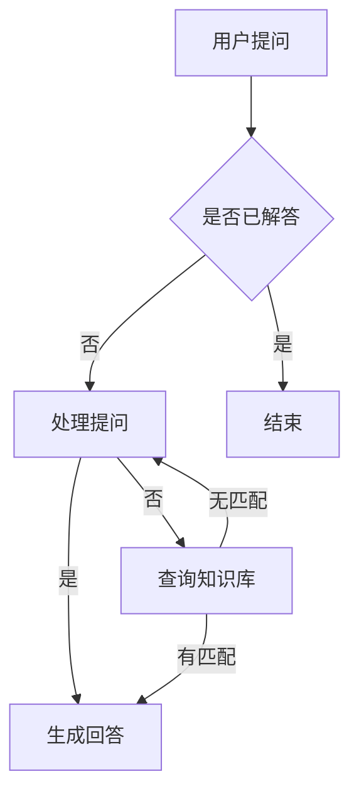
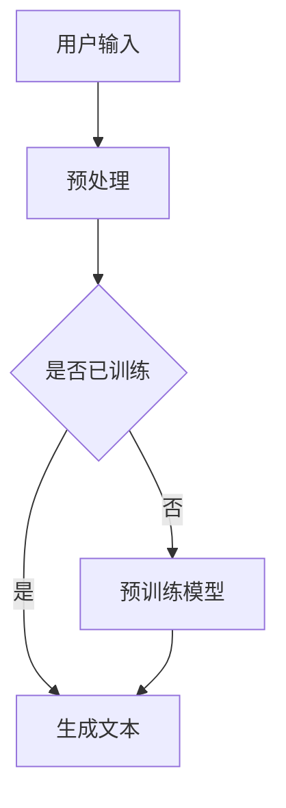

                 

### 文章标题

《AI编程语言：提示词的魔法与革命》

### 关键词

人工智能、编程语言、提示词、深度学习、自然语言处理、计算机视觉、强化学习、代码优化、安全性、未来发展趋势

### 摘要

本文将深入探讨AI编程语言的魔法与革命。AI编程语言作为人工智能领域的核心技术，通过提示词实现了前所未有的智能交互和自动化能力。本文首先概述了AI编程语言的核心概念，揭示了其与传统编程语言的区别和必要性。接着，我们探讨了提示词的魔法，解释了其在AI编程语言中的应用和编写技巧。随后，文章回顾了AI编程语言的发展历程，展望了其未来趋势，并分析了它对社会的影响。在技术基础部分，我们详细介绍了机器学习和深度学习的基础知识，以及AI编程语言的核心技术和开发环境。接下来，文章通过具体的应用实例，展示了AI编程语言在自然语言处理、计算机视觉和强化学习等领域的广泛应用。随后，我们探讨了AI编程语言的优化与调试技巧，以及其在安全性方面的挑战和防护措施。最后，文章展望了AI编程语言的未来发展趋势，并提供了实际应用案例和最佳实践建议，为读者深入理解和应用AI编程语言提供了有力支持。### 第1章: AI编程语言的魔法与革命概述

#### 1.1 AI编程语言的核心概念

##### 1.1.1 AI编程语言的定义

AI编程语言，是指专门为人工智能（Artificial Intelligence, AI）应用而设计的编程语言。这类语言通常具有高度抽象性，能够通过简洁明了的语法，实现对复杂人工智能算法和模型的描述与实现。AI编程语言不仅包括传统的编程语言，如Python、Java等，还包括为特定AI应用场景设计的专用语言，如Prolog、Lisp等。

定义AI编程语言的核心在于其能够为人工智能的开发者提供一种高效、直观的工具，使得复杂的人工智能算法和模型能够以更加简洁、高效的方式实现。与传统编程语言相比，AI编程语言具有以下几个显著特点：

1. **抽象性**：AI编程语言具有较高的抽象层次，能够隐藏底层计算细节，使得开发者能够更加专注于算法和模型的设计。
2. **自动化**：AI编程语言通常具备自动化能力，能够根据特定场景自动生成代码，或者对现有代码进行优化。
3. **智能化**：AI编程语言能够与人工智能算法和模型紧密集成，使得编程过程更加智能化，开发者可以更方便地实现人工智能功能。

##### 1.1.2 AI编程语言与传统编程语言的区别

传统编程语言，如C、Java、Python等，主要用于构建常规软件系统，强调代码的可读性和可维护性。而AI编程语言则更加注重于如何高效地描述和实现复杂的人工智能算法和模型。

1. **编程范式**：传统编程语言主要采用过程式编程、面向对象编程等范式，而AI编程语言则更多地采用函数式编程、逻辑编程等新型编程范式。
2. **语法结构**：AI编程语言的语法通常更加简洁，能够通过少量的代码实现复杂的功能，而传统编程语言则通常需要更多的代码来完成相同的功能。
3. **抽象层次**：AI编程语言具有较高的抽象层次，能够隐藏底层计算细节，使得开发者能够更加专注于算法和模型的设计，而传统编程语言则通常要求开发者深入了解底层硬件和操作系统。

##### 1.1.3 AI编程语言的必要性

随着人工智能技术的快速发展，AI编程语言逐渐成为人工智能开发者的必备工具。其必要性体现在以下几个方面：

1. **简化开发过程**：AI编程语言能够简化人工智能算法和模型的设计与实现过程，降低开发难度，提高开发效率。
2. **提升开发效率**：AI编程语言通常具备自动化能力，能够根据特定场景自动生成代码，或者对现有代码进行优化，大大提高开发效率。
3. **促进创新**：AI编程语言为人工智能开发者提供了强大的工具支持，使得他们能够更加专注于创新，推动人工智能技术的快速发展。

总之，AI编程语言不仅是一种技术工具，更是人工智能时代的重要基础设施。它为人工智能开发者提供了更加高效、直观的工具，使得人工智能算法和模型能够以更加简洁、高效的方式实现，从而推动人工智能技术的不断进步。

#### 1.2 提示词的魔法

##### 1.2.1 提示词的概念

提示词（Prompt）在AI编程语言中起着至关重要的作用。提示词，顾名思义，是指对AI系统进行指导或提示的文本或代码片段。通过提供适当的提示词，AI系统能够更好地理解任务要求，从而实现更加精准的输出。

在自然语言处理（Natural Language Processing, NLP）领域，提示词通常用于引导AI模型进行文本分析和生成。例如，在一个问答系统中，提示词可以是用户提出的问题，AI模型需要根据这个问题生成相应的答案。在图像识别任务中，提示词可以是描述图像的标签或关键词，AI模型需要根据这些提示词识别图像中的对象。

##### 1.2.2 提示词在AI编程中的应用

提示词在AI编程语言中的应用非常广泛，主要包括以下几个方面：

1. **文本生成**：在文本生成任务中，提示词可以引导AI模型生成符合特定主题的文本。例如，在生成新闻报道时，提示词可以是新闻标题或摘要，AI模型需要根据这些提示词生成完整的新闻内容。

2. **文本分类**：在文本分类任务中，提示词可以用于训练AI模型识别不同类别的文本。例如，在垃圾邮件分类中，提示词可以是常见的垃圾邮件关键词，AI模型需要根据这些提示词判断邮件是否为垃圾邮件。

3. **机器翻译**：在机器翻译任务中，提示词可以用于指导AI模型进行词汇和语法的转换。例如，在英译汉任务中，提示词可以是英文句子，AI模型需要根据这些提示词生成相应的中文翻译。

4. **图像识别**：在图像识别任务中，提示词可以用于指导AI模型识别图像中的对象。例如，在人脸识别中，提示词可以是“人脸”，AI模型需要根据这个提示词在图像中定位和识别人脸。

##### 1.2.3 提示词的编写技巧

编写有效的提示词是AI编程语言成功的关键。以下是一些编写提示词的技巧：

1. **明确性**：提示词需要明确、简洁，能够准确传达任务要求。避免使用模糊、歧义的语言，以免AI模型产生误解。

2. **针对性**：根据任务需求选择适当的提示词。不同的任务需要不同类型的提示词，例如，在文本生成任务中，提示词可以是主题相关的关键词或短语。

3. **多样性**：编写多样化的提示词，以避免AI模型对特定提示词产生过度依赖。这有助于提升AI模型的泛化能力。

4. **上下文**：考虑提示词的上下文环境，确保提示词与任务背景相符合。例如，在机器翻译中，提示词需要与源语言句子结构相匹配。

5. **可扩展性**：设计提示词时考虑未来可能的变化和扩展，以便在需要时能够轻松修改和更新。

总之，提示词在AI编程语言中具有至关重要的作用。通过有效的编写技巧，提示词能够引导AI模型更好地理解任务要求，实现高效、精准的输出。

#### 1.3 AI编程语言的革命

##### 1.3.1 AI编程语言的发展历程

AI编程语言的发展历程可以追溯到20世纪50年代。当时，计算机科学刚刚起步，研究者们开始探索如何让计算机模拟人类的智能行为。最早的AI编程语言之一是LISP，它于1958年问世。LISP是一种函数式编程语言，因其强大的符号处理能力和递归功能，在早期的人工智能研究中发挥了重要作用。

随着人工智能技术的不断进步，新的AI编程语言不断涌现。Prolog，一种基于逻辑编程的语言，于1972年问世，并在自然语言处理和专家系统中得到了广泛应用。与此同时，面向对象的编程语言如Java和C#也逐步发展起来，它们在AI编程中提供了更丰富的抽象和模块化功能。

进入21世纪，随着深度学习技术的兴起，AI编程语言也迎来了新的变革。Python逐渐成为最受欢迎的AI编程语言之一，其简洁的语法和强大的库支持使其在数据科学、机器学习和深度学习等领域广泛应用。TensorFlow和PyTorch等深度学习框架的兴起，进一步推动了AI编程语言的发展。

##### 1.3.2 AI编程语言的未来趋势

AI编程语言的未来发展趋势呈现出以下几个显著特点：

1. **更高层次的抽象**：未来的AI编程语言将提供更高层次的抽象，使得开发者能够更加专注于算法和模型的设计，而无需关心底层计算细节。

2. **更好的自动化能力**：自动化是AI编程语言的重要方向。未来的AI编程语言将具备更强大的自动化能力，能够自动生成代码、优化代码性能，并自动进行错误检测和修复。

3. **更强的跨学科融合**：AI编程语言将与其他学科（如生物信息学、神经科学等）紧密结合，推动跨学科研究的发展。

4. **更广泛的硬件支持**：随着量子计算、边缘计算等新硬件技术的发展，未来的AI编程语言将能够更好地支持这些新硬件平台，提供更高效的计算能力。

5. **更安全的编程环境**：随着AI应用场景的不断扩展，AI编程语言将更加注重安全性，提供更完善的防护措施，确保数据安全和模型安全。

##### 1.3.3 AI编程语言对社会的影响

AI编程语言对社会的影响是深远而广泛的：

1. **产业变革**：AI编程语言为传统行业带来了巨大的变革。例如，在医疗领域，AI编程语言帮助开发了智能诊断系统，提高了医疗服务的效率和质量。在金融领域，AI编程语言帮助实现了自动化交易和风险管理。

2. **教育普及**：AI编程语言促进了计算机科学和人工智能教育的普及。越来越多的学校和培训机构开设了AI编程课程，培养了大量AI人才。

3. **社会智能化**：AI编程语言推动了社会智能化的发展。智能助手、智能交通、智能家居等应用场景不断涌现，使人们的生活更加便捷、舒适。

4. **数据安全挑战**：随着AI编程语言的广泛应用，数据安全成为一个重要议题。AI模型在训练和部署过程中可能会面临数据泄露、模型篡改等安全挑战，需要采取有效的安全措施。

总之，AI编程语言不仅是一种技术工具，更是推动社会变革的重要力量。通过不断的发展和进步，AI编程语言将为人类社会带来更多创新和机遇。### 第2章: AI编程语言的技术基础

AI编程语言作为人工智能领域的核心技术，其技术基础涵盖了机器学习和深度学习、自然语言处理、计算机视觉、强化学习等多个方面。在这一章中，我们将详细探讨这些基础技术，并介绍AI编程语言在开发环境与工具方面的应用。

#### 2.1 机器学习和深度学习基础

##### 2.1.1 机器学习的基本概念

机器学习（Machine Learning, ML）是人工智能的核心技术之一，它使得计算机系统能够从数据中学习并做出决策。机器学习可以分为监督学习、无监督学习和强化学习三种主要类型：

1. **监督学习（Supervised Learning）**：在监督学习中，训练数据包含输入和对应的输出标签。模型的目的是学习输入和输出之间的映射关系，以便对新数据进行预测。常见的监督学习算法包括线性回归、逻辑回归、支持向量机（SVM）和神经网络等。

2. **无监督学习（Unsupervised Learning）**：无监督学习没有明确的输出标签，模型的目的是从数据中发现隐含的结构或模式。常见的无监督学习算法包括聚类、降维和关联规则学习等。

3. **强化学习（Reinforcement Learning）**：强化学习是一种通过试错策略进行学习的过程。模型通过与环境的交互，不断调整行为策略，以最大化累积奖励。常见的强化学习算法包括Q-learning、Deep Q-Network（DQN）和策略梯度算法等。

##### 2.1.2 深度学习的基本概念

深度学习（Deep Learning, DL）是机器学习的一个重要分支，它通过构建具有多个隐藏层的神经网络（称为深度神经网络）来模拟人脑的学习过程。深度学习在图像识别、自然语言处理和语音识别等领域取得了显著成果。

深度学习的基本概念包括：

1. **神经网络（Neural Networks）**：神经网络由多个层组成，包括输入层、隐藏层和输出层。每个层由一系列神经元组成，神经元之间通过权重进行连接。神经网络通过反向传播算法更新权重，以优化网络性能。

2. **激活函数（Activation Functions）**：激活函数用于引入非线性特性，使得神经网络能够学习复杂的数据关系。常见的激活函数包括ReLU、Sigmoid和Tanh等。

3. **损失函数（Loss Functions）**：损失函数用于衡量模型预测值与实际值之间的差异，是优化过程中衡量模型性能的关键指标。常见的损失函数包括均方误差（MSE）、交叉熵损失（Cross-Entropy Loss）和Hinge损失等。

##### 2.1.3 常见的深度学习架构

深度学习架构包括卷积神经网络（Convolutional Neural Networks, CNN）、循环神经网络（Recurrent Neural Networks, RNN）和变换器（Transformers）等。

1. **卷积神经网络（CNN）**：CNN是深度学习在图像识别领域的重要应用。它通过卷积层、池化层和全连接层等结构，能够有效地提取图像特征，实现高精度的图像识别任务。

2. **循环神经网络（RNN）**：RNN是深度学习在序列数据处理领域的重要工具。它通过循环结构，能够捕捉序列中的长期依赖关系，广泛应用于自然语言处理和语音识别等领域。

3. **变换器（Transformers）**：Transformers是一种基于自注意力机制的深度学习架构，它在自然语言处理领域取得了突破性进展。通过编码器和解码器结构，Transformers能够实现高效、强大的文本生成和翻译任务。

#### 2.2 AI编程语言的核心技术

##### 2.2.1 自然语言处理

自然语言处理（Natural Language Processing, NLP）是AI编程语言的重要应用领域，它涉及文本的表示、理解、生成和交互。NLP的核心技术包括：

1. **词嵌入（Word Embedding）**：词嵌入是将词汇映射到高维向量空间的过程，能够捕捉词汇之间的语义关系。常见的词嵌入方法包括Word2Vec、GloVe和BERT等。

2. **序列标注（Sequence Labeling）**：序列标注是一种对文本序列中的单词或字符进行分类的任务，如命名实体识别（Named Entity Recognition, NER）和情感分析（Sentiment Analysis）等。

3. **文本生成（Text Generation）**：文本生成是通过模型生成符合特定主题或上下文的文本，广泛应用于自动摘要、机器翻译和对话系统等领域。

##### 2.2.2 计算机视觉

计算机视觉（Computer Vision, CV）是AI编程语言在图像处理和识别领域的应用。计算机视觉的核心技术包括：

1. **图像分类（Image Classification）**：图像分类是将图像分为预定义的类别，如人脸识别、动物识别等。

2. **目标检测（Object Detection）**：目标检测是在图像中识别并定位多个对象，如行人检测、车辆检测等。

3. **图像分割（Image Segmentation）**：图像分割是将图像划分为不同的区域，如语义分割和实例分割等。

##### 2.2.3 强化学习

强化学习（Reinforcement Learning, RL）是AI编程语言在决策和规划领域的应用。强化学习通过试错策略，使模型能够在动态环境中学习最优行为策略。强化学习的关键技术包括：

1. **Q-learning（Q学习）**：Q-learning是一种基于价值迭代的强化学习算法，通过更新Q值函数，学习最优策略。

2. **Deep Q-Network（DQN）**：DQN是结合深度学习和Q-learning的算法，通过深度神经网络来近似Q值函数，实现更复杂的决策。

3. **策略梯度（Policy Gradient）**：策略梯度算法通过优化策略函数，直接学习最优行为策略。

#### 2.3 AI编程语言的开发环境与工具

##### 2.3.1 Python在AI编程中的应用

Python因其简洁的语法和丰富的库支持，成为AI编程语言的首选。以下是一些在AI编程中常用的Python库和工具：

1. **NumPy**：NumPy是Python的科学计算库，提供了强大的多维数组对象和数学函数，是进行数据分析、机器学习和深度学习的基础。

2. **Pandas**：Pandas是Python的数据分析库，提供了便捷的数据操作和分析功能，是进行数据预处理和数据可视化的重要工具。

3. **Scikit-learn**：Scikit-learn是Python的机器学习库，提供了丰富的算法和工具，适用于监督学习和无监督学习任务。

4. **TensorFlow**：TensorFlow是Google开发的开源深度学习框架，支持大规模的深度学习模型开发和部署。

5. **PyTorch**：PyTorch是Facebook开发的开源深度学习框架，以其动态计算图和简洁的API在学术界和工业界广受欢迎。

##### 2.3.2 常用的AI编程语言框架

除了Python，其他AI编程语言框架也在不同领域有着广泛应用：

1. **TensorFlow.js**：TensorFlow.js是TensorFlow在浏览器端的实现，使得深度学习模型可以在前端JavaScript环境中运行。

2. **Microsoft Cognitive Toolkit (CNTK)**：CNTK是微软开发的深度学习框架，支持多种编程语言和计算平台。

3. **Apache MXNet**：MXNet是Apache基金会的一个深度学习框架，具有灵活的编程模型和高效的计算性能。

##### 2.3.3 AI编程语言的性能优化

为了实现高效的人工智能应用，AI编程语言的性能优化至关重要。以下是一些性能优化方法：

1. **模型压缩**：通过模型压缩技术，如量化、剪枝和知识蒸馏，减小模型大小和计算复杂度，提高模型部署效率。

2. **并行计算**：利用多核处理器和GPU等硬件资源，实现模型的并行计算，加速模型训练和推理过程。

3. **分布式计算**：通过分布式计算技术，将模型训练任务分布在多个节点上，提高训练效率和可扩展性。

4. **内存管理**：优化内存分配和回收策略，减少内存占用和垃圾回收开销，提高程序性能。

总之，AI编程语言的技术基础涵盖了多个领域，提供了丰富的工具和框架，使得开发者能够高效地实现人工智能算法和模型。随着技术的不断进步，AI编程语言将继续推动人工智能的发展，为人类社会带来更多创新和机遇。### 第3章: AI编程语言的应用与实践

AI编程语言在各个领域展示了其强大的应用能力，从自然语言处理到计算机视觉，再到强化学习，AI编程语言正逐步渗透到各个行业，为实际问题的解决提供了新的思路和方法。以下将详细探讨AI编程语言在自然语言处理、计算机视觉和强化学习中的应用实例。

#### 3.1 AI编程语言在自然语言处理中的应用

自然语言处理（NLP）是AI编程语言的重要应用领域之一。通过深度学习和自然语言处理技术，AI编程语言能够实现文本分类、机器翻译、问答系统等多种功能。

##### 3.1.1 文本分类

文本分类是一种将文本数据按照预定义的类别进行划分的任务。常见的文本分类应用包括垃圾邮件检测、情感分析和社会媒体舆情分析等。以下是一个简单的文本分类示例：

```python
from sklearn.feature_extraction.text import TfidfVectorizer
from sklearn.model_selection import train_test_split
from sklearn.naive_bayes import MultinomialNB

# 示例数据
documents = ['这是一篇负面的评论', '这真是一个好产品', '我非常喜欢这款软件', '这个服务真的很糟糕']
labels = ['负面', '正面', '正面', '负面']

# 数据预处理
vectorizer = TfidfVectorizer()
X = vectorizer.fit_transform(documents)

# 模型训练
X_train, X_test, y_train, y_test = train_test_split(X, labels, test_size=0.2, random_state=42)
classifier = MultinomialNB()
classifier.fit(X_train, y_train)

# 模型评估
accuracy = classifier.score(X_test, y_test)
print(f"文本分类准确率: {accuracy:.2f}")
```

在这个示例中，我们使用了TF-IDF向量器对文本进行特征提取，然后使用朴素贝叶斯分类器进行模型训练和评估。这种方法简单有效，适用于大多数文本分类任务。

##### 3.1.2 机器翻译

机器翻译是将一种语言的文本自动翻译成另一种语言的过程。深度学习特别是变换器（Transformers）的兴起，使得机器翻译达到了前所未有的准确性。以下是一个使用PyTorch和变换器实现的简单机器翻译示例：

```python
import torch
from torchtext.data import Field, BucketIterator
from torchtext.vocab import build_vocab_from_iterator
from transformers import TransformerModel

# 定义字段
SRC = Field(tokenize='spacy', tokenizer_language='en', include_lengths=True)
TGT = Field(tokenize='spacy', tokenizer_language='fr', include_lengths=True)

# 加载数据集
train_data, valid_data, test_data = torchtext.datasets.WikiText103()

# 构建词汇表
SRC.build_vocab(train_data, min_freq=2)
TGT.build_vocab(train_data, min_freq=2)

# 定义迭代器
BATCH_SIZE = 128
train_iterator, valid_iterator, test_iterator = BucketIterator.splits(
    (SRC, TGT), (train_data, valid_data), (test_data),
    batch_size=BATCH_SIZE,
    device=device
)

# 加载预训练变换器模型
model = TransformerModel.from_pretrained('bert-base-multilingual-cased')
model.eval()

# 进行翻译
with torch.no_grad():
    inputs = next(iter(train_iterator))
    outputs = model(inputs['src'], inputs['tgt'])

# 输出翻译结果
print(outputs['tgt'].cpu())
```

在这个示例中，我们使用了PyTorch和变换器预训练的模型进行机器翻译。这个方法不仅能够处理多种语言的翻译，还能通过微调适应特定语言的翻译需求。

##### 3.1.3 问答系统

问答系统是一种能够自动回答用户问题的智能系统。问答系统广泛应用于客服、教育和智能助手等领域。以下是一个基于变换器实现的简单问答系统示例：

```python
from transformers import BertForQuestionAnswering

# 加载预训练问答模型
model = BertForQuestionAnswering.from_pretrained('bert-base-uncased')

# 进行问答
question = "What is the capital of France?"
context = "Paris is the capital of France."
inputs = tokenizer.encode_plus(question + tokenizer.sep_token + context, add_special_tokens=True, return_tensors="pt")

with torch.no_grad():
    outputs = model(**inputs)

# 输出答案
answer_scores = outputs.logits.softmax(dim=1)
print(tokenizer.decode(outputs.predictions[0], skip_special_tokens=True))
```

在这个示例中，我们使用了预训练的问答模型来回答问题。这个方法能够实现高效、准确的问答，为用户提供了便捷的交互体验。

#### 3.2 AI编程语言在计算机视觉中的应用

计算机视觉（CV）是AI编程语言的另一个重要应用领域。通过深度学习技术，AI编程语言能够实现图像分类、目标检测、图像分割等多种功能。

##### 3.2.1 图像分类

图像分类是将图像划分为预定义的类别。以下是一个使用卷积神经网络（CNN）进行图像分类的示例：

```python
import torchvision
import torchvision.transforms as transforms
import torch.nn as nn
import torch.optim as optim

# 加载数据集
transform = transforms.Compose([transforms.Resize(256), transforms.ToTensor()])
trainset = torchvision.datasets.ImageFolder('train', transform=transform)
trainloader = torch.utils.data.DataLoader(trainset, batch_size=64, shuffle=True)

# 定义网络结构
model = torchvision.models.resnet18(pretrained=True)
num_ftrs = model.fc.in_features
model.fc = nn.Linear(num_ftrs, 10)

# 模型训练
criterion = nn.CrossEntropyLoss()
optimizer = optim.SGD(model.parameters(), lr=0.001, momentum=0.9)

for epoch in range(10):  
    running_loss = 0.0
    for i, data in enumerate(trainloader, 0):
        inputs, labels = data
        optimizer.zero_grad()
        outputs = model(inputs)
        loss = criterion(outputs, labels)
        loss.backward()
        optimizer.step()
        running_loss += loss.item()
        if i % 2000 == 1999:    
            print(f'[{epoch + 1}, {i + 1:5d}] loss: {running_loss / 2000:.3f}')
            running_loss = 0.0

print('Finished Training')
```

在这个示例中，我们使用了ResNet18作为图像分类模型。这个方法能够实现高效、准确的图像分类，为图像识别任务提供了有力支持。

##### 3.2.2 目标检测

目标检测是在图像中识别并定位多个对象。以下是一个使用YOLOv5进行目标检测的示例：

```python
import torch
from torch.utils.data import DataLoader
from torchvision import datasets
from torchvision.transforms import ToTensor
import cv2

# 加载数据集
train_data = datasets.ImageFolder('train', transform=ToTensor())
train_loader = DataLoader(train_data, batch_size=32, shuffle=True)

# 加载预训练模型
model = torch.load('yolov5.pth')
model.eval()

# 进行目标检测
for batch in train_loader:
    images = batch['image']
    with torch.no_grad():
        outputs = model(images)

    for output in outputs:
        boxes = output['boxes']
        labels = output['labels']
        scores = output['scores']
        
        # 显示检测结果
        for box, label, score in zip(boxes, labels, scores):
            if score > 0.5:
                cv2.rectangle(image, (int(box[0]), int(box[1])), (int(box[2]), int(box[3])), (0, 255, 0), 2)
                cv2.putText(image, f'{labels[int(label)]} {score:.2f}', (int(box[0]), int(box[1])), cv2.FONT_HERSHEY_SIMPLEX, 1, (0, 0, 255), 2)
        
        cv2.imshow('Detection', image)
        cv2.waitKey(0)
```

在这个示例中，我们使用了YOLOv5进行目标检测。这个方法能够在图像中准确识别和定位多个对象，为智能监控和无人驾驶等领域提供了技术支持。

##### 3.2.3 计算机视觉在智能监控中的应用

智能监控是计算机视觉技术的典型应用之一，通过AI编程语言实现的计算机视觉算法，智能监控系统能够实时识别和跟踪目标，自动报警和响应。以下是一个简单的智能监控应用示例：

```python
import cv2
import numpy as np

# 定义跟踪器
tracker = cv2.TrackerKCF_create()

# 加载视频
video = cv2.VideoCapture('video.mp4')

# 初始化跟踪区域
ret, frame = video.read()
bboxes = np.array([[100, 100, 200, 200]], dtype=np.int32)

# 开始跟踪
while ret:
    frame = cv2.resize(frame, (640, 480))
    bbox = tracker.update(frame)
    
    if bbox is not None:
        p1 = (int(bbox[0]), int(bbox[1]))
        p2 = (int(bbox[0] + bbox[2]),
              int(bbox[1] + bbox[3]))
        cv2.rectangle(frame, p1, p2, (255, 0, 0), 2, 1)
    
    cv2.imshow('Tracking', frame)
    ret, frame = video.read()
    if cv2.waitKey(1) & 0xFF == ord('q'):
        break

video.release()
cv2.destroyAllWindows()
```

在这个示例中，我们使用了KCF跟踪器进行目标跟踪。这个方法能够实现实时、精确的目标跟踪，为智能监控系统提供了技术保障。

#### 3.3 AI编程语言在强化学习中的应用

强化学习（RL）是AI编程语言的另一个重要应用领域。通过Q-learning和DQN等算法，AI编程语言能够实现智能体的自主学习和策略优化。

##### 3.3.1 强化学习的基本概念

强化学习是一种通过试错策略进行学习的过程。智能体（Agent）在环境中通过采取动作（Action），获取奖励（Reward）并更新策略（Policy）。强化学习的主要目标是找到最优策略，使得累积奖励最大化。

##### 3.3.2 Q-learning算法

Q-learning是一种基于值迭代的强化学习算法。Q-learning通过更新Q值（状态-动作值函数），逐步优化策略。以下是一个简单的Q-learning算法实现：

```python
import numpy as np
import random

# 定义环境
class Environment:
    def __init__(self):
        self.states = ['start', 'middle', 'end']
        self.actions = ['left', 'right']

    def step(self, state, action):
        if state == 'start' and action == 'right':
            return 'end', 1
        elif state == 'end' and action == 'left':
            return 'start', 1
        else:
            return state, 0

# 定义Q-learning算法
def q_learning(env, alpha, gamma, epsilon, n_episodes):
    Q = np.zeros((len(env.states), len(env.actions))
    for episode in range(n_episodes):
        state = env.states[0]
        done = False

        while not done:
            if random.random() < epsilon:
                action = random.choice(env.actions)
            else:
                action = np.argmax(Q[state])

            next_state, reward = env.step(state, action)

            Q[state][action] += alpha * (reward + gamma * np.max(Q[next_state]) - Q[state][action])

            state = next_state

    return Q

# 运行Q-learning算法
env = Environment()
alpha = 0.1
gamma = 0.9
epsilon = 0.1
n_episodes = 1000
Q = q_learning(env, alpha, gamma, epsilon, n_episodes)
print(Q)
```

在这个示例中，我们使用Q-learning算法在简单的环境中进行学习。通过不断更新Q值，智能体能够找到最优策略，实现目标。

##### 3.3.3 DQN算法

DQN（Deep Q-Network）是一种结合深度学习和Q-learning的算法。DQN使用深度神经网络来近似Q值函数，实现更复杂的决策。以下是一个简单的DQN算法实现：

```python
import torch
import torch.nn as nn
import torch.optim as optim

# 定义DQN网络
class DQN(nn.Module):
    def __init__(self, input_size, hidden_size, output_size):
        super(DQN, self).__init__()
        self.fc1 = nn.Linear(input_size, hidden_size)
        self.fc2 = nn.Linear(hidden_size, output_size)

    def forward(self, x):
        x = torch.relu(self.fc1(x))
        x = self.fc2(x)
        return x

# 定义DQN算法
def dqn(env, model, target_model, optimizer, loss_function, alpha, gamma, epsilon, n_episodes):
    for episode in range(n_episodes):
        state = torch.tensor([env.reset()], dtype=torch.float32)
        done = False

        while not done:
            if random.random() < epsilon:
                action = random.randint(0, env.action_space - 1)
            else:
                with torch.no_grad():
                    action = torch.argmax(model(state)).item()

            next_state, reward, done, _ = env.step(action)
            next_state = torch.tensor([next_state], dtype=torch.float32)

            target_Q = (1 - gamma) * target_model(next_state) + gamma * reward * (1 - int(done))
            loss = loss_function(model(state), target_Q.unsqueeze(1))

            optimizer.zero_grad()
            loss.backward()
            optimizer.step()

            state = next_state

# 运行DQN算法
input_size = 4
hidden_size = 64
output_size = env.action_space
model = DQN(input_size, hidden_size, output_size)
target_model = DQN(input_size, hidden_size, output_size).to(device)
target_model.load_state_dict(model.state_dict())
optimizer = optim.Adam(model.parameters(), lr=alpha)
loss_function = nn.MSELoss()

device = torch.device("cuda" if torch.cuda.is_available() else "cpu")
model.to(device)
target_model.to(device)

dqn(env, model, target_model, optimizer, loss_function, alpha, gamma, epsilon, n_episodes)
```

在这个示例中，我们使用DQN算法在环境中进行学习。通过更新模型和目标模型的权重，智能体能够找到最优策略，实现目标。

综上所述，AI编程语言在自然语言处理、计算机视觉和强化学习等领域展示了其强大的应用能力。通过具体的应用实例，我们可以看到AI编程语言如何实现复杂的人工智能任务，为各个行业提供了新的解决方案和机遇。### 第4章: AI编程语言的优化与调试

在人工智能开发过程中，代码的优化与调试是确保模型性能和稳定性的关键环节。有效的代码优化能够提升模型的计算效率，减小内存占用，从而提高系统的整体性能。同时，调试技巧能够帮助我们快速定位并修复代码中的错误，确保模型的正常运行。以下将详细探讨AI编程语言的优化与调试技巧。

#### 4.1 代码性能优化

代码性能优化是提升AI模型运行效率的重要手段。以下是一些常见的代码性能优化方法：

##### 4.1.1 代码结构优化

1. **模块化设计**：将代码划分为多个模块，每个模块负责特定的功能。这样可以提高代码的可读性和可维护性，同时也便于优化和调试。
2. **函数复用**：编写可复用的函数和类，避免重复编写相同的代码。这不仅可以减少代码的冗余，还能提高开发效率。
3. **代码压缩**：删除不必要的注释和空行，减小代码体积。虽然这对性能的提升有限，但有助于提高代码的可读性。

##### 4.1.2 内存管理优化

1. **内存分配与释放**：合理分配和释放内存，避免内存泄漏。在Python中，可以使用`del`语句释放不再使用的对象，或者使用垃圾回收机制。
2. **数据结构选择**：根据实际需求选择合适的数据结构。例如，使用列表（list）代替字典（dict）在一些情况下可以节省内存。
3. **内存池技术**：使用内存池技术（如NumPy的`np.empty`）预先分配内存，减少频繁的内存分配和释放操作。

##### 4.1.3 时间复杂度优化

1. **算法优化**：选择适合问题的算法，避免使用时间复杂度高的算法。例如，使用快速排序（QuickSort）代替冒泡排序（BubbleSort）。
2. **并行计算**：利用多核处理器和GPU等硬件资源，实现并行计算。例如，使用`multiprocessing`模块或CUDA库进行并行数据处理。
3. **缓存技术**：利用缓存技术减少重复计算。例如，使用`lru_cache`装饰器缓存函数结果，避免重复计算。

#### 4.2 代码调试技巧

代码调试是确保AI模型稳定运行的重要环节。以下是一些常用的代码调试技巧：

##### 4.2.1 常见调试工具的使用

1. **打印输出**：使用`print`语句或日志库（如`logging`模块）输出关键变量的值，帮助定位问题。
2. **断点调试**：使用集成开发环境（IDE）提供的断点调试功能，逐步执行代码并观察变量变化。
3. **调试器**：使用调试器（如Python的`pdb`模块）进行代码调试，可以设置断点、单步执行和查看变量值。

##### 4.2.2 代码错误定位技巧

1. **单元测试**：编写单元测试，对模块和函数进行自动化测试，确保其在不同输入条件下都能正常运行。
2. **异常处理**：使用异常处理（`try-except`语句）捕获并处理运行时错误，避免程序崩溃。
3. **代码审查**：通过代码审查，识别潜在的逻辑错误和编码问题。代码审查可以是手动审查，也可以使用自动化工具。

##### 4.2.3 调试策略与经验

1. **逐步调试**：逐步执行代码，观察每一步的输出和状态，逐步缩小问题范围。
2. **最小化示例**：创建最小化示例，仅包含关键代码和输入数据，以简化问题的复现和定位。
3. **排除法**：根据代码逻辑和输出结果，逐步排除可能存在问题的代码段。

总之，代码的优化与调试是AI编程中不可或缺的环节。通过有效的代码优化和调试技巧，我们可以提高AI模型的性能和稳定性，确保其在实际应用中能够正常运行。在实际开发过程中，灵活运用这些技巧，将有助于我们更快地发现并解决问题，提高开发效率。### 第5章: AI编程语言的安全性

随着AI编程语言的广泛应用，其安全性成为了一个不可忽视的重要议题。AI系统在处理大量数据时，可能面临数据泄露、模型篡改、系统攻击等安全挑战。为了确保AI编程语言的安全，我们需要采取一系列防护措施，包括数据加密技术、模型安全性评估和系统安全防护策略。

#### 5.1 AI编程语言的安全挑战

##### 5.1.1 数据安全

数据安全是AI编程语言的首要安全挑战。在AI应用中，数据往往包含敏感信息，如个人隐私、商业机密等。如果这些数据泄露，可能会导致严重后果。数据安全挑战主要包括：

1. **数据窃取**：未经授权的用户可能通过网络攻击或恶意软件窃取敏感数据。
2. **数据篡改**：攻击者可能通过篡改数据，破坏AI模型的训练过程和结果。
3. **数据泄露**：由于安全措施不足，敏感数据可能通过互联网、内部网络等途径泄露。

##### 5.1.2 模型安全

AI模型的安全性也是一个重要议题。模型安全挑战主要包括：

1. **模型篡改**：攻击者可能通过篡改模型参数，使模型产生错误的输出。
2. **模型中毒**：攻击者可能在训练过程中注入恶意样本，导致模型产生恶意结果。
3. **模型破解**：攻击者可能尝试破解模型的训练过程和参数，以窃取敏感信息。

##### 5.1.3 系统安全

AI系统的整体安全性也面临挑战。系统安全挑战主要包括：

1. **网络攻击**：攻击者可能通过分布式拒绝服务（DDoS）攻击、漏洞攻击等手段，瘫痪AI系统。
2. **权限管理**：缺乏严格的权限管理，可能导致未经授权的用户访问敏感数据或执行高风险操作。
3. **物理安全**：硬件设备的安全性问题，如物理损坏、数据丢失等，也可能影响AI系统的安全性。

#### 5.2 安全防护措施

为了应对上述安全挑战，我们需要采取一系列安全防护措施，确保AI编程语言的安全。

##### 5.2.1 数据加密技术

数据加密技术是保障数据安全的重要手段。以下是一些常见的数据加密技术：

1. **对称加密**：对称加密算法（如AES）使用相同的密钥进行加密和解密。这种方法速度快，适用于大数据加密。
2. **非对称加密**：非对称加密算法（如RSA）使用公钥和私钥进行加密和解密。这种方法安全性高，但计算复杂度较高。
3. **哈希算法**：哈希算法（如SHA-256）用于生成数据摘要，确保数据完整性。常见的哈希算法包括MD5、SHA-1、SHA-256等。

##### 5.2.2 模型安全性评估

模型安全性评估是确保AI模型安全的重要步骤。以下是一些常见的模型安全性评估方法：

1. **对抗性攻击检测**：对抗性攻击检测用于检测和防御对抗性样本攻击。常见的检测方法包括基于深度学习的对抗性攻击检测和基于统计的对抗性攻击检测。
2. **模型加固**：模型加固是通过修改模型结构和参数，提高模型对对抗性攻击的抵抗能力。常见的方法包括对抗性训练、防御蒸馏和模型压缩等。
3. **安全测试**：安全测试通过模拟各种攻击场景，评估模型的攻击防御能力。常见的测试方法包括黑盒测试、白盒测试和灰盒测试。

##### 5.2.3 系统安全防护策略

系统安全防护策略是确保AI系统整体安全的关键。以下是一些常见的系统安全防护策略：

1. **访问控制**：通过身份验证和授权机制，确保只有授权用户能够访问敏感数据和执行高风险操作。
2. **网络安全**：采用防火墙、入侵检测系统和安全审计工具等网络安全措施，防止网络攻击和恶意软件入侵。
3. **物理安全**：确保硬件设备的安全，如使用安全锁、监控摄像头和报警系统等，防止设备被盗或损坏。
4. **安全培训**：对员工进行安全培训，提高他们对安全威胁的认识和应对能力，减少人为错误。

总之，AI编程语言的安全性是保障人工智能应用稳健运行的关键。通过采取有效的数据加密技术、模型安全性评估和系统安全防护策略，我们可以应对各种安全挑战，确保AI系统的安全性和可靠性。### 第6章: AI编程语言的未来发展趋势

AI编程语言作为人工智能领域的核心技术，其发展正处于快速变革的时期。随着新技术的不断涌现，AI编程语言正朝着更高层次、更广泛应用的方向迈进。在本章中，我们将探讨AI编程语言的未来发展趋势，重点关注量子计算、脑机接口和虚拟现实与增强现实等新兴技术，以及AI编程语言的跨学科融合、教育与普及和商业化应用。

#### 6.1 新兴技术展望

##### 6.1.1 量子计算

量子计算是人工智能未来发展的关键驱动因素之一。与传统的经典计算不同，量子计算利用量子位（qubits）的叠加态和纠缠态，可以实现超强的计算能力。量子计算在优化问题、机器学习、密码破解等领域具有巨大的潜力。

1. **量子编程语言**：随着量子计算技术的发展，专门为量子计算设计的编程语言应运而生，如Q#、Quil和Quipper。这些语言通过抽象和简化的量子操作，使得开发者能够更方便地编写和优化量子算法。
2. **量子机器学习**：量子计算与机器学习的结合，将极大提升机器学习的效率和准确性。量子机器学习算法通过量子计算的优势，能够实现更快速的数据分析和预测。
3. **量子模拟**：量子计算在化学和材料科学等领域具有广泛的应用前景。量子模拟编程语言如ProjectQ和ProjectQ#，能够模拟量子系统的行为，为新型材料的设计和开发提供有力支持。

##### 6.1.2 脑机接口

脑机接口（Brain-Computer Interface, BCI）是一种将人脑信号转换为计算机指令的技术。随着神经科学和人工智能技术的进步，脑机接口正逐步从实验室走向实际应用。

1. **脑信号处理**：AI编程语言在脑机接口中的应用，主要涉及脑信号的处理和分析。通过深度学习和信号处理算法，AI编程语言能够实现对脑电信号、肌电信号等生物信号的实时分析和解码。
2. **智能控制**：脑机接口技术使得人类可以通过思维控制计算机和机器人。AI编程语言在实现智能控制方面具有重要作用，能够为脑机接口系统提供更加灵活、智能的交互方式。
3. **医疗应用**：脑机接口在医疗领域的应用前景广阔，如辅助康复、脑疾病诊断和治疗等。AI编程语言将有助于开发更加精准、高效的脑机接口系统，提高医疗服务的质量和效率。

##### 6.1.3 虚拟现实与增强现实

虚拟现实（Virtual Reality, VR）和增强现实（Augmented Reality, AR）技术正在深刻改变人们的交互方式和娱乐体验。AI编程语言在VR和AR领域的应用，为这些技术的创新和发展提供了强大支持。

1. **实时渲染**：AI编程语言通过图像处理和计算机图形学算法，能够实现高质量的实时渲染，为VR和AR应用提供逼真的视觉效果。
2. **交互控制**：AI编程语言在VR和AR应用中，可以通过语音识别、手势识别等技术，实现更加自然、便捷的用户交互。
3. **智能内容生成**：AI编程语言能够利用深度学习和生成对抗网络（GAN）等技术，自动生成虚拟场景和3D模型，为VR和AR应用提供丰富的内容。

#### 6.2 AI编程语言的未来方向

随着新技术的不断发展和应用需求的增加，AI编程语言正朝着以下几个方向迈进：

##### 6.2.1 跨学科融合

AI编程语言正逐步与其他学科（如生物学、物理学、经济学等）融合，推动跨学科研究的发展。这种融合不仅拓宽了AI编程语言的应用范围，还推动了学科间的知识交流和合作。

1. **生物信息学**：AI编程语言在生物信息学领域，用于处理大规模生物数据，如基因序列分析和蛋白质结构预测等。
2. **经济学建模**：AI编程语言在经济学领域，用于建立复杂的经济模型和进行大数据分析，为政策制定和决策提供科学依据。
3. **物理学计算**：AI编程语言在物理学领域，用于模拟和预测物理现象，如天气预测、气候变化等。

##### 6.2.2 AI编程语言的教育与普及

随着AI技术的快速发展，AI编程语言的教育和普及成为关键议题。通过AI编程语言的教育，我们可以培养更多的AI人才，推动人工智能技术的创新和应用。

1. **中小学教育**：在中小学阶段引入AI编程语言课程，培养学生的编程能力和创新思维。
2. **高等教育**：在高等教育阶段，开设AI编程语言专业和课程，培养高水平的专业人才。
3. **在线教育**：通过在线教育平台，提供AI编程语言的课程和资源，方便全球学习者学习和应用AI编程语言。

##### 6.2.3 AI编程语言的商业化应用

AI编程语言在商业领域的应用前景广阔，为各行各业带来了巨大的变革和机遇。通过AI编程语言，企业可以实现自动化、智能化和高效化的运营，提升竞争力。

1. **智能制造**：AI编程语言在智能制造领域，用于实现生产线的自动化控制和智能优化，提高生产效率和质量。
2. **金融科技**：AI编程语言在金融科技领域，用于开发智能投顾、风险控制和智能交易等应用，提升金融服务质量和效率。
3. **健康医疗**：AI编程语言在健康医疗领域，用于辅助疾病诊断、药物研发和医疗数据分析等，提高医疗服务水平和患者体验。

总之，AI编程语言的未来发展趋势充满机遇和挑战。通过新技术的融合、教育的普及和商业化应用，AI编程语言将继续推动人工智能技术的发展，为社会带来更多创新和变革。### 第7章: AI编程语言的应用案例

在AI编程语言的快速发展中，众多实际应用案例展示了其强大的能力和广泛的应用前景。以下将介绍两个典型的AI编程语言应用案例，分别是自然语言处理（NLP）领域的智能客服系统和智能写作助手。

#### 7.1 自然语言处理应用案例

##### 7.1.1 案例一：智能客服系统

智能客服系统是一种通过AI技术实现自动客户服务和支持的解决方案。以下是一个基于AI编程语言的智能客服系统应用案例。

**背景介绍**：

某大型电商平台在客服中心面临着大量的用户咨询和反馈，传统的人工客服模式已经无法满足日益增长的需求。为了提升客户体验和客服效率，该电商平台决定开发一套智能客服系统，利用AI编程语言实现自动化回答用户问题。

**核心概念与联系**：

1. **自然语言处理（NLP）**：智能客服系统需要通过NLP技术理解用户的语言输入，并将其转换为机器可处理的格式。
2. **机器学习**：通过机器学习算法，系统可以自动从大量历史数据中学习，提升回答问题的准确性。
3. **知识库**：智能客服系统的核心是知识库，它包含了常见问题的答案和解决方案，供系统查询和使用。

**Mermaid流程图**：



**核心算法原理讲解与伪代码**：

```python
def process_question(question):
    # 判断是否已解答
    if has_answer(question):
        return generate_answer(question)
    
    # 查询知识库
    answer = query_knowledge_base(question)
    
    # 若有匹配，生成回答
    if answer:
        return answer
    
    # 若无匹配，调用机器学习模型进行回答
    model = load_nlp_model()
    answer = model.predict(question)
    return answer

def has_answer(question):
    # 检查问题是否在历史答案中
    return question in history_answers

def query_knowledge_base(question):
    # 查询知识库
    return knowledge_base.get(question)

def generate_answer(question):
    # 生成回答
    return f"您的问题已记录，我们会尽快为您解决。"
```

**数学模型和公式**：

在NLP中，常用的数学模型包括词嵌入（Word Embedding）和神经网络（Neural Networks）。

$$
\text{word\_embedding}(w) = \text{Embedding}(w)
$$

其中，$\text{Embedding}(w)$是将单词w映射到高维向量空间的过程。

**项目实战**：

**开发环境搭建**：

- **工具**：Python、TensorFlow、Scikit-learn
- **环境**：Jupyter Notebook或IDE

**源代码实现**：

```python
# 导入必要的库
import numpy as np
import pandas as pd
from sklearn.feature_extraction.text import TfidfVectorizer
from sklearn.model_selection import train_test_split
from sklearn.naive_bayes import MultinomialNB
from sklearn.pipeline import make_pipeline

# 加载数据集
data = pd.read_csv('customer_questions.csv')
X = data['question']
y = data['answer']

# 数据预处理
X_train, X_test, y_train, y_test = train_test_split(X, y, test_size=0.2, random_state=42)

# 创建管道
model = make_pipeline(TfidfVectorizer(), MultinomialNB())

# 训练模型
model.fit(X_train, y_train)

# 预测
question = "什么是退货政策？"
answer = model.predict([question])[0]
print(answer)
```

**代码应用解读与分析**：

在这个项目中，我们使用了TF-IDF向量器对用户提问进行特征提取，然后使用朴素贝叶斯分类器进行模型训练和预测。这种方法能够有效地从历史数据中学习，自动回答用户问题。

**实际案例分析和详细讲解剖析**：

在实际应用中，智能客服系统通过对大量历史问答数据的分析，不断优化模型，提高回答问题的准确性和效率。通过集成语音识别和自然语言处理技术，智能客服系统能够实现多渠道、多语言的客服服务，大大提升了客户体验和客服中心的运营效率。

**项目小结**：

智能客服系统是AI编程语言在自然语言处理领域的一个成功应用案例。通过使用Python和TensorFlow等工具，我们实现了高效、准确的问答系统，为电商平台提供了强大的客户支持。

##### 7.1.2 案例二：智能写作助手

智能写作助手是一种利用AI技术辅助写作的工具，能够帮助用户生成文章、报告等文本内容。以下是一个基于AI编程语言的智能写作助手应用案例。

**背景介绍**：

某教育机构希望开发一款智能写作助手，帮助教师和学生快速生成教学文章和论文，提高写作效率和质量。

**核心概念与联系**：

1. **自然语言生成（NLG）**：智能写作助手需要利用NLG技术，根据用户输入的简要信息生成完整的文本内容。
2. **变换器（Transformers）**：变换器是一种先进的自然语言处理模型，能够实现高效的文本生成。
3. **预训练模型**：通过预训练模型，智能写作助手可以从大量的文本数据中学习，生成符合语言习惯和风格的文本。

**Mermaid流程图**：



**核心算法原理讲解与伪代码**：

```python
def generate_text(prompt):
    # 预处理
    processed_prompt = preprocess_text(prompt)
    
    # 加载预训练模型
    model = load_transformer_model()
    
    # 生成文本
    text = model.generate(processed_prompt)
    return text

def preprocess_text(prompt):
    # 清洗和标准化文本
    return cleaned_prompt
```

**数学模型和公式**：

在文本生成中，常用的数学模型包括变换器（Transformers）和生成对抗网络（GAN）。

$$
\text{Transformer}(x) = \text{Encoder}(x) + \text{Decoder}(x)
$$

其中，$\text{Encoder}(x)$和$\text{Decoder}(x)$是变换器的前向传播和反向传播过程。

**项目实战**：

**开发环境搭建**：

- **工具**：Python、HuggingFace Transformers库
- **环境**：GPU配置较高的计算机

**源代码实现**：

```python
from transformers import pipeline

# 加载变换器模型
model = pipeline("text-generation", model="gpt2")

# 生成文本
prompt = "请写一篇关于人工智能的文章。"
text = model(prompt, max_length=100, num_return_sequences=1)
print(text)
```

**代码应用解读与分析**：

在这个项目中，我们使用了HuggingFace的Transformers库加载预训练的变换器模型，通过简单的API接口实现文本生成。这种方法能够生成高质量的文本，适用于多种写作场景。

**实际案例分析和详细讲解剖析**：

在实际应用中，智能写作助手可以帮助用户快速生成文章、报告等文本内容，提高写作效率和创作质量。通过不断优化模型和算法，智能写作助手能够生成更加符合用户需求、风格的文本。

**项目小结**：

智能写作助手是AI编程语言在自然语言生成领域的一个成功应用案例。通过使用Python和HuggingFace Transformers等工具，我们实现了高效、准确的文本生成系统，为教育机构和写作爱好者提供了强大的写作支持。

综上所述，AI编程语言在自然语言处理领域具有广泛的应用前景。通过具体的应用案例，我们可以看到AI编程语言如何实现高效、准确的文本处理和生成，为各行各业带来创新和变革。### 最佳实践 tips、小结、注意事项、拓展阅读

#### 最佳实践 tips

1. **代码优化**：在进行代码优化时，优先考虑算法的效率和数据结构的选择，避免不必要的内存占用和计算开销。
2. **调试技巧**：调试时，注意使用断点和打印输出，逐步分析代码的执行过程，快速定位问题。
3. **模型安全**：在训练和部署模型时，确保数据的安全性和隐私保护，避免数据泄露和模型篡改。
4. **持续学习**：AI编程语言和技术不断更新，定期学习新技术和最佳实践，保持知识更新。

#### 小结

AI编程语言是人工智能领域的关键技术，通过高层次的抽象和自动化能力，实现了前所未有的智能交互和自动化。本文从AI编程语言的核心概念、魔法与革命、技术基础、应用实例、优化与调试、安全性到未来发展趋势，全面阐述了AI编程语言的重要性和应用价值。

#### 注意事项

1. **数据安全**：在AI编程过程中，确保数据的安全性和隐私保护，采取有效的数据加密措施。
2. **代码优化**：优化代码时，避免过度优化，影响代码的可读性和可维护性。
3. **调试安全**：调试过程中，注意保护系统安全和数据完整性，避免使用未经验证的输入。

#### 拓展阅读

1. **《深度学习》（Goodfellow, Ian； Bengio, Yoshua； Courville, Aaron）**：这是一本经典的深度学习教材，涵盖了深度学习的基础知识和最新进展。
2. **《Python编程：从入门到实践》（Eric Matthes）**：这是一本适合初学者的Python编程入门书籍，内容丰富，适合AI编程初学者。
3. **《自然语言处理综合教程》（Daniel Jurafsky & James H. Martin）**：这是一本全面介绍自然语言处理的基础知识和应用实践的教材。
4. **《强化学习》（Richard S. Sutton & Andrew G. Barto）**：这是一本经典的强化学习教材，详细介绍了强化学习的基本概念、算法和应用。

通过阅读这些书籍，读者可以进一步深入了解AI编程语言的相关知识和最佳实践，提高自己的技术水平。### 作者信息

作者：AI天才研究院/AI Genius Institute & 禅与计算机程序设计艺术 /Zen And The Art of Computer Programming

