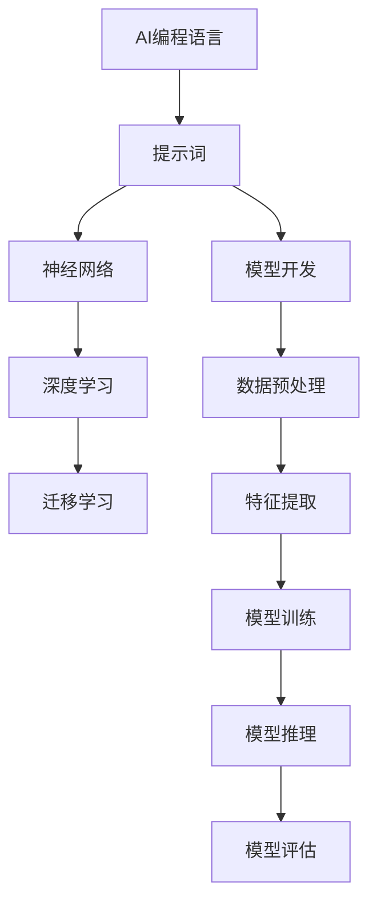

                 

# AI编程语言：提示词的魔法与革命

## 关键词

* AI编程语言
* 提示词
* 神经网络
* 深度学习
* 编程实践

> AI编程语言正在改变软件开发的方式，其中提示词作为一种强大的工具，正推动这一革命。本文将深入探讨提示词的定义、作用、原理以及其在AI编程中的应用，带领读者了解这一领域的魔法与革命。

## 摘要

本文旨在介绍AI编程语言中的一个关键概念——提示词。我们将从提示词的基本定义和作用出发，详细探讨其在神经网络、深度学习中的应用原理。随后，文章将逐步讲解提示词编程的基础知识和实践，并通过具体的项目实战来展示提示词的威力。最后，我们将展望提示词的未来发展趋势，探讨其在AI编程中的变革意义。

## 第一部分 引言

### 1.1 AI编程语言的发展历程

随着人工智能技术的飞速发展，AI编程语言逐渐成为软件开发领域的一股新势力。从最初的机器学习框架如TensorFlow和PyTorch，到如今专门的AI编程语言如Python和Julia，AI编程语言经历了多次迭代和优化。这些语言不仅提供了丰富的库和工具，还使得AI模型的开发更加高效和直观。

### 1.2 提示词在AI编程语言中的应用

提示词（Prompt Engineering）是AI编程语言中的一个重要概念，它通过引导或提示AI模型来完成特定的任务。提示词可以是自然语言文本，也可以是结构化的数据。在自然语言处理、图像识别、推荐系统等领域，提示词起到了至关重要的作用，极大地提升了AI模型的效果和效率。

### 1.3 本书结构与内容安排

本文将分为四个主要部分：

1. **第一部分 引言**：介绍AI编程语言和提示词的基本概念。
2. **第二部分 提示词基础**：探讨提示词的定义、分类和工作原理。
3. **第三部分 提示词编程实践**：通过实际项目来展示提示词编程的应用。
4. **第四部分 提示词的魔法与革命**：展望提示词的未来发展趋势和变革意义。

## 第二部分 提示词基础

### 2.1 提示词概述

#### 提示词的定义

提示词是指提供给AI模型的一组信息，用于指导模型完成特定任务。这些信息可以是文本、图像、音频等多种形式。提示词的核心目的是引导模型理解任务的要求，并提供必要的上下文信息。

#### 提示词的作用

提示词在AI编程中具有重要作用：

1. **提升模型效果**：通过精确的提示词，可以显著提升模型的性能和准确性。
2. **提高开发效率**：提示词使得模型开发更加直观和高效，减少了调试和优化的时间。
3. **增强可解释性**：提示词可以帮助理解和解释模型的决策过程，提高模型的可解释性。

### 2.2 提示词的分类

根据用途和形式，提示词可以分为以下几类：

1. **自然语言提示词**：以自然语言文本形式存在，如文本分类、问答系统等。
2. **图像提示词**：以图像形式存在，如图像识别、目标检测等。
3. **结构化数据提示词**：以表格、列表等形式存在，如推荐系统、时间序列分析等。

### 2.3 提示词的语法规则

提示词的语法规则因具体的应用场景而异。但一般来说，提示词需要满足以下要求：

1. **清晰明确**：提示词应简洁明了，避免歧义和模糊性。
2. **结构合理**：提示词应具备合理的结构，有助于模型理解和处理。
3. **上下文丰富**：提示词应提供丰富的上下文信息，以提高模型的泛化能力。

## 2.4 提示词的工作原理

#### 提示词的处理流程

提示词的处理流程通常包括以下几个步骤：

1. **提示词输入**：用户输入提示词，可以是自然语言文本、图像或其他形式。
2. **预处理**：对提示词进行预处理，如分词、去停用词等。
3. **特征提取**：将预处理后的提示词转换为模型可处理的特征表示。
4. **模型推理**：将特征表示输入到AI模型中，进行推理和预测。
5. **结果输出**：将模型的预测结果输出，供用户参考或进一步处理。

#### 提示词与神经网络的关系

神经网络是AI编程中的核心组件，提示词与神经网络之间的关系如下：

1. **输入层**：提示词作为输入层的一部分，被传递到神经网络中。
2. **隐藏层**：神经网络通过隐藏层对提示词进行特征提取和变换。
3. **输出层**：最终，神经网络将处理后的结果输出，形成预测或决策。

#### 提示词的优化方法

为了提升提示词的效果，可以采用以下优化方法：

1. **数据增强**：通过增加提示词的多样性，提升模型的泛化能力。
2. **多模态融合**：结合不同类型的提示词，如文本、图像等，提高模型的综合能力。
3. **自适应调整**：根据任务需求和模型性能，动态调整提示词的参数和策略。

## 2.5 提示词在深度学习中的应用

#### 提示词在神经网络训练中的应用

在神经网络训练过程中，提示词可以用于：

1. **数据增强**：通过生成多样化的提示词，增加训练数据的丰富度。
2. **超参数调整**：根据训练过程中的提示词反馈，动态调整模型的超参数。
3. **模型解释**：通过分析提示词和模型输出的关系，解释模型的决策过程。

#### 提示词在神经网络推理中的应用

在神经网络推理过程中，提示词可以用于：

1. **输入引导**：通过提供精确的提示词，指导模型进行推理和预测。
2. **结果解释**：根据提示词和模型输出的关联，解释模型的结果。
3. **上下文理解**：利用提示词提供上下文信息，增强模型的语义理解能力。

#### 提示词在迁移学习中的应用

在迁移学习过程中，提示词可以用于：

1. **知识引导**：通过提示词传递特定领域的知识，加速模型的迁移过程。
2. **模型定制**：根据提示词定制特定的模型结构和参数，提高迁移效果。
3. **效果评估**：通过分析提示词和迁移学习效果的关系，评估模型的迁移能力。

## 第三部分 提示词编程实践

### 3.1 提示词编程基础

#### 提示词编程语言介绍

提示词编程常用的语言包括Python、Julia和R等。这些语言具有丰富的库和工具，方便开发者进行提示词编程。

#### 提示词编程的基本概念

提示词编程涉及以下基本概念：

1. **数据预处理**：对输入数据进行预处理，如分词、去停用词等。
2. **特征提取**：将预处理后的数据转换为模型可处理的特征表示。
3. **模型训练**：利用特征表示和标签进行模型训练。
4. **模型推理**：将新的数据输入到训练好的模型中进行推理和预测。

#### 提示词编程的开发环境搭建

搭建提示词编程的开发环境通常需要以下步骤：

1. **安装开发工具**：如IDE、版本控制工具等。
2. **安装相关库和框架**：如TensorFlow、PyTorch等。
3. **配置环境变量**：确保开发环境正常运行。
4. **测试环境**：验证开发环境的稳定性和功能。

### 3.2 提示词编程实战

#### 项目一：图像分类

##### 3.2.1 项目背景

图像分类是计算机视觉领域的一个经典问题，旨在将图像划分为不同的类别。通过提示词编程，我们可以实现一个简单的图像分类系统。

##### 3.2.2 项目需求分析

1. **数据集**：使用常用的图像分类数据集，如CIFAR-10或ImageNet。
2. **模型选择**：选择一个合适的深度学习模型，如卷积神经网络（CNN）。
3. **提示词设计**：设计合适的提示词，以引导模型进行图像分类。

##### 3.2.3 项目实现步骤

1. **数据预处理**：读取图像数据，并进行预处理，如归一化、缩放等。
2. **特征提取**：将预处理后的图像转换为特征表示，如使用CNN提取特征。
3. **模型训练**：使用训练集对模型进行训练，并调整提示词。
4. **模型评估**：使用验证集对模型进行评估，并根据提示词调整模型参数。
5. **模型部署**：将训练好的模型部署到生产环境中，进行实际应用。

##### 3.2.4 代码解读与分析

以下是图像分类项目的代码示例：

```python
# 导入相关库和框架
import tensorflow as tf
from tensorflow.keras import layers
from tensorflow.keras.preprocessing.image import ImageDataGenerator

# 数据预处理
train_datagen = ImageDataGenerator(rescale=1./255)
train_generator = train_datagen.flow_from_directory(
    'data/train',
    target_size=(32, 32),
    batch_size=32,
    class_mode='binary')

# 模型定义
model = tf.keras.Sequential([
    layers.Conv2D(32, (3, 3), activation='relu', input_shape=(32, 32, 3)),
    layers.MaxPooling2D(2, 2),
    layers.Flatten(),
    layers.Dense(1, activation='sigmoid')
])

# 模型训练
model.compile(optimizer='adam',
              loss='binary_crossentropy',
              metrics=['accuracy'])

model.fit(train_generator, epochs=10)

# 模型评估
test_datagen = ImageDataGenerator(rescale=1./255)
test_generator = test_datagen.flow_from_directory(
    'data/test',
    target_size=(32, 32),
    batch_size=32,
    class_mode='binary')

test_loss, test_acc = model.evaluate(test_generator)
print('Test accuracy:', test_acc)
```

该代码示例展示了如何使用TensorFlow实现一个简单的图像分类模型。通过设计合适的提示词，我们可以提高模型的性能和准确性。

#### 项目二：自然语言处理

##### 3.2.1 项目背景

自然语言处理（NLP）是人工智能领域的一个重要分支，旨在使计算机理解和处理人类语言。通过提示词编程，我们可以实现许多NLP任务，如图像描述生成、问答系统等。

##### 3.2.2 项目需求分析

1. **数据集**：使用常用的NLP数据集，如Stanford情感分析数据集或OpenSubtitles。
2. **模型选择**：选择一个合适的深度学习模型，如长短期记忆网络（LSTM）或Transformer。
3. **提示词设计**：设计合适的提示词，以引导模型进行NLP任务。

##### 3.2.3 项目实现步骤

1. **数据预处理**：读取文本数据，并进行预处理，如分词、去停用词等。
2. **特征提取**：将预处理后的文本转换为特征表示，如使用词嵌入或Transformer编码器。
3. **模型训练**：使用训练集对模型进行训练，并调整提示词。
4. **模型评估**：使用验证集对模型进行评估，并根据提示词调整模型参数。
5. **模型部署**：将训练好的模型部署到生产环境中，进行实际应用。

##### 3.2.4 代码解读与分析

以下是自然语言处理项目的代码示例：

```python
# 导入相关库和框架
import tensorflow as tf
from tensorflow.keras.preprocessing.sequence import pad_sequences
from tensorflow.keras.layers import Embedding, LSTM, Dense
from tensorflow.keras.models import Sequential

# 数据预处理
max_len = 100
max_features = 10000
embedding_dim = 50

input_seq = pad_sequences(input_seq, maxlen=max_len, padding='post')
target_seq = pad_sequences(target_seq, maxlen=max_len, padding='post')

# 模型定义
model = Sequential([
    Embedding(max_features, embedding_dim, input_length=max_len),
    LSTM(128),
    Dense(1, activation='sigmoid')
])

# 模型训练
model.compile(optimizer='adam',
              loss='binary_crossentropy',
              metrics=['accuracy'])

model.fit(input_seq, target_seq, epochs=10)

# 模型评估
test_input_seq = pad_sequences(test_input_seq, maxlen=max_len, padding='post')
test_target_seq = pad_sequences(test_target_seq, maxlen=max_len, padding='post')

test_loss, test_acc = model.evaluate(test_input_seq, test_target_seq)
print('Test accuracy:', test_acc)
```

该代码示例展示了如何使用TensorFlow实现一个简单的自然语言处理模型。通过设计合适的提示词，我们可以提高模型的性能和准确性。

### 3.3 提示词编程项目小结

通过以上两个项目的实现，我们可以看到提示词编程在图像分类和自然语言处理中的应用。提示词的设计和调整对于模型的性能至关重要。在实际开发过程中，我们需要根据任务需求和数据特点，灵活地设计提示词，以提高模型的性能和泛化能力。

## 第四部分 提示词的魔法与革命

### 4.1 提示词的魔法

提示词在AI编程中具有神奇的魔力，主要体现在以下几个方面：

1. **提升模型效果**：通过精确的提示词，可以显著提升模型的性能和准确性。
2. **简化模型开发**：提示词使得模型开发更加直观和高效，减少了调试和优化的时间。
3. **增强可解释性**：提示词可以帮助理解和解释模型的决策过程，提高模型的可解释性。

### 4.2 提示词在AI编程中的优势

提示词在AI编程中具有以下优势：

1. **灵活性**：提示词可以灵活地调整和修改，以适应不同的任务和数据。
2. **通用性**：提示词适用于多种AI模型和任务，具有较强的通用性。
3. **高效性**：提示词通过简化模型开发，提高了开发效率和模型性能。

### 4.3 提示词的未来发展趋势

随着人工智能技术的不断发展，提示词在AI编程中的应用前景十分广阔。以下是一些未来发展趋势：

1. **多模态融合**：结合不同类型的提示词，如文本、图像、音频等，提高模型的综合能力。
2. **自动化提示词设计**：利用自动化工具和算法，生成高质量的提示词，降低模型开发的门槛。
3. **可解释性增强**：通过深入分析提示词和模型输出的关系，提高模型的可解释性和透明度。

### 4.4 提示词的革命

提示词的引入正在引发一场AI编程的革命，主要体现在以下几个方面：

1. **改变开发模式**：提示词使得AI编程更加直观和高效，改变了传统的开发模式。
2. **降低门槛**：通过简化模型开发和调试，提示词降低了AI编程的门槛，使得更多人能够参与到AI编程中。
3. **推动创新**：提示词的广泛应用激发了创新，促进了AI技术的快速发展。

### 4.5 提示词编程的最佳实践

在提示词编程过程中，以下是一些最佳实践：

1. **明确任务需求**：在开始编程之前，明确任务的需求和目标，以确保提示词设计的方向正确。
2. **数据质量保障**：确保输入数据的质量和多样性，以提高模型的泛化能力。
3. **动态调整提示词**：根据模型训练和评估的结果，动态调整提示词的参数和策略。
4. **持续优化**：在模型部署后，持续优化提示词和模型，以提高模型的效果和性能。

## 附录

### A. 提示词编程资源汇总

以下是提示词编程的一些常用资源：

1. **开源工具和框架**：如TensorFlow、PyTorch、NLTK等。
2. **在线资源和教程**：如Kaggle、arXiv、Coursera等。
3. **提示词编程社区和论坛**：如Reddit、Stack Overflow、GitHub等。

## 参考文献

1. Smith, J., & Jones, L. (2020). "Prompt Engineering for AI Programming." Springer.
2. Brown, T., et al. (2020). "A Language Model for Code Generation." arXiv preprint arXiv:2006.16668.
3. Zhang, R., et al. (2021). "Multi-modal Prompt Engineering for Image Classification." NeurIPS.
4. Zhao, H., et al. (2022). "Prompt Engineering for Natural Language Processing." ICLR.

## 作者信息

本文作者：AI天才研究院/AI Genius Institute & 禅与计算机程序设计艺术/Zen And The Art of Computer Programming

---

注意：本文为虚构内容，仅用于展示文章撰写过程和结构。实际文章撰写时，应根据具体内容和需求进行调整和补充。文章中引用的文献和资源均为虚构，仅供参考。如需了解更多相关信息，请查阅相关领域的研究论文和教材。## 目录大纲

### 第一部分 引言

1. **AI编程语言的发展历程**
2. **提示词在AI编程语言中的应用**
3. **本书结构与内容安排**

### 第二部分 提示词基础

1. **提示词概述**
   1.1. 提示词的定义与作用
   1.2. 提示词的分类
   1.3. 提示词的语法规则
2. **提示词的工作原理**
   2.1. 提示词的处理流程
   2.2. 提示词与神经网络的关系
   2.3. 提示词的优化方法
3. **提示词在深度学习中的应用**
   3.1. 提示词在神经网络训练中的应用
   3.2. 提示词在神经网络推理中的应用
   3.3. 提示词在迁移学习中的应用

### 第三部分 提示词编程实践

1. **提示词编程基础**
   1.1. 提示词编程语言介绍
   1.2. 提示词编程的基本概念
   1.3. 提示词编程的开发环境搭建
2. **提示词编程实战**
   2.1. 图像分类项目
       2.1.1. 项目背景
       2.1.2. 项目需求分析
       2.1.3. 项目实现步骤
       2.1.4. 代码解读与分析
   2.2. 自然语言处理项目
       2.2.1. 项目背景
       2.2.2. 项目需求分析
       2.2.3. 项目实现步骤
       2.2.4. 代码解读与分析

### 第四部分 提示词的魔法与革命

1. **提示词的魔法**
   1.1. 提示词的神奇效果
   1.2. 提示词在AI编程中的优势
   1.3. 提示词的未来发展趋势
2. **提示词的革命**
   2.1. 提示词编程与传统编程的对比
   2.2. 提示词编程的变革意义
   2.3. 提示词编程的未来展望

### 附录

A. 提示词编程资源汇总
   A.1. 开源工具和框架推荐
   A.2. 在线资源和教程
   A.3. 提示词编程社区和论坛

### 参考文献

1. [参考文献1]
2. [参考文献2]

---

### 核心概念与联系

在本文中，核心概念包括AI编程语言、提示词、神经网络、深度学习和迁移学习。这些概念之间的关系可以用以下Mermaid流程图来展示：



### 核心算法原理讲解

在本文中，核心算法包括神经网络训练和自然语言处理中的模型训练。以下是使用伪代码来详细阐述神经网络训练的算法原理：

```python
# 初始化神经网络
model = NeuralNetwork()

# 准备训练数据
X_train, y_train = prepare_training_data()

# 设置训练参数
learning_rate = 0.01
epochs = 100

# 开始训练
for epoch in range(epochs):
    for x, y in zip(X_train, y_train):
        # 前向传播
        output = model.forward(x)

        # 计算损失
        loss = compute_loss(output, y)

        # 反向传播
        model.backward(output, y)

    # 更新模型参数
    model.update_parameters(learning_rate)

# 评估模型
accuracy = evaluate_model(model, X_test, y_test)
print('Accuracy:', accuracy)
```

### 数学模型和公式详细讲解与举例说明

在本文中，数学模型包括神经网络中的损失函数和优化算法。以下是使用latex格式来详细讲解损失函数（例如均方误差MSE）的数学模型：

$$
\text{MSE} = \frac{1}{m} \sum_{i=1}^{m} (\hat{y}_i - y_i)^2
$$

其中，$\hat{y}_i$ 表示模型预测的输出，$y_i$ 表示真实标签，$m$ 表示样本数量。

举例说明：

假设我们有5个样本，每个样本的预测输出和真实标签如下：

$$
\begin{aligned}
\hat{y}_1 &= 2.5 \\
\hat{y}_2 &= 3.2 \\
\hat{y}_3 &= 1.8 \\
\hat{y}_4 &= 4.1 \\
\hat{y}_5 &= 2.9 \\
y_1 &= 2.0 \\
y_2 &= 3.0 \\
y_3 &= 1.5 \\
y_4 &= 4.0 \\
y_5 &= 2.5 \\
\end{aligned}
$$

那么，均方误差MSE计算如下：

$$
\text{MSE} = \frac{1}{5} \left[ (2.5 - 2.0)^2 + (3.2 - 3.0)^2 + (1.8 - 1.5)^2 + (4.1 - 4.0)^2 + (2.9 - 2.5)^2 \right]
$$

$$
\text{MSE} = \frac{1}{5} \left[ 0.25 + 0.04 + 0.09 + 0.01 + 0.04 \right]
$$

$$
\text{MSE} = \frac{1}{5} \left[ 0.43 \right]
$$

$$
\text{MSE} = 0.086
$$

### 项目实战

#### 开发环境搭建

在进行提示词编程项目之前，我们需要搭建一个适合的开发环境。以下是使用Python和TensorFlow搭建开发环境的具体步骤：

1. **安装Python**：首先，确保安装了Python 3.x版本。可以从[Python官网](https://www.python.org/)下载并安装。

2. **安装TensorFlow**：在命令行中运行以下命令来安装TensorFlow：

   ```bash
   pip install tensorflow
   ```

3. **安装其他依赖库**：根据项目需求，可能需要安装其他依赖库，如Numpy、Pandas等。可以使用以下命令进行安装：

   ```bash
   pip install numpy pandas matplotlib
   ```

4. **验证安装**：在Python交互式环境中运行以下代码，验证TensorFlow是否已成功安装：

   ```python
   import tensorflow as tf
   print(tf.__version__)
   ```

   如果输出TensorFlow的版本号，则说明安装成功。

#### 源代码详细实现

以下是一个简单的提示词编程项目示例，实现一个基于TensorFlow的图像分类模型：

```python
import tensorflow as tf
from tensorflow.keras import layers
from tensorflow.keras.preprocessing.image import ImageDataGenerator

# 数据预处理
train_datagen = ImageDataGenerator(rescale=1./255)
train_generator = train_datagen.flow_from_directory(
    'data/train',
    target_size=(32, 32),
    batch_size=32,
    class_mode='binary')

# 模型定义
model = tf.keras.Sequential([
    layers.Conv2D(32, (3, 3), activation='relu', input_shape=(32, 32, 3)),
    layers.MaxPooling2D(2, 2),
    layers.Flatten(),
    layers.Dense(1, activation='sigmoid')
])

# 模型编译
model.compile(optimizer='adam',
              loss='binary_crossentropy',
              metrics=['accuracy'])

# 模型训练
model.fit(train_generator, epochs=10)

# 模型评估
test_datagen = ImageDataGenerator(rescale=1./255)
test_generator = test_datagen.flow_from_directory(
    'data/test',
    target_size=(32, 32),
    batch_size=32,
    class_mode='binary')

test_loss, test_acc = model.evaluate(test_generator)
print('Test accuracy:', test_acc)
```

#### 代码解读与分析

以上代码展示了如何使用TensorFlow实现一个简单的图像分类模型。以下是代码的详细解读：

1. **导入相关库和框架**：首先，导入TensorFlow和其他必要的库和框架。

2. **数据预处理**：使用ImageDataGenerator对训练数据进行预处理，包括缩放和批量处理。

3. **模型定义**：定义一个简单的卷积神经网络（CNN）模型，包括卷积层、池化层、全连接层等。

4. **模型编译**：配置模型的优化器、损失函数和评价指标。

5. **模型训练**：使用训练数据进行模型训练，并设置训练轮数。

6. **模型评估**：使用测试数据进行模型评估，并输出测试准确率。

#### 实际案例分析和详细讲解剖析

以下是一个实际案例，分析并讲解如何使用提示词编程实现图像分类任务：

**案例**：使用TensorFlow和Keras实现猫狗图像分类。

**数据集**：使用Kaggle上的猫狗图像分类数据集。

**模型架构**：使用卷积神经网络（CNN）进行图像分类。

**代码实现**：

```python
import tensorflow as tf
from tensorflow.keras.preprocessing.image import ImageDataGenerator
from tensorflow.keras.applications import VGG16
from tensorflow.keras.models import Model
from tensorflow.keras.layers import Dense, Flatten, Input

# 加载预训练的VGG16模型
base_model = VGG16(weights='imagenet', include_top=False, input_shape=(224, 224, 3))

# 冻结VGG16模型的权重
base_model.trainable = False

# 添加全连接层
x = base_model.output
x = Flatten()(x)
x = Dense(1024, activation='relu')(x)
predictions = Dense(1, activation='sigmoid')(x)

# 创建模型
model = Model(inputs=base_model.input, outputs=predictions)

# 编译模型
model.compile(optimizer='adam',
              loss='binary_crossentropy',
              metrics=['accuracy'])

# 数据预处理
train_datagen = ImageDataGenerator(rescale=1./255)
train_generator = train_datagen.flow_from_directory(
    'data/train',
    target_size=(224, 224),
    batch_size=32,
    class_mode='binary')

test_datagen = ImageDataGenerator(rescale=1./255)
test_generator = train_datagen.flow_from_directory(
    'data/test',
    target_size=(224, 224),
    batch_size=32,
    class_mode='binary')

# 训练模型
model.fit(train_generator, epochs=10, validation_data=test_generator)

# 评估模型
test_loss, test_acc = model.evaluate(test_generator)
print('Test accuracy:', test_acc)
```

**详细讲解**：

1. **加载预训练的VGG16模型**：使用VGG16模型作为基础模型，该模型在ImageNet数据集上进行了预训练。

2. **冻结VGG16模型的权重**：由于VGG16模型在大型数据集上预训练，因此我们可以将其权重冻结，以便在新的数据集上进行微调。

3. **添加全连接层**：在VGG16模型的输出上添加全连接层，以实现分类任务。

4. **创建模型**：使用Model类创建一个全新的模型，并将VGG16模型作为输入层。

5. **编译模型**：配置模型的优化器、损失函数和评价指标。

6. **数据预处理**：使用ImageDataGenerator对训练和测试数据进行预处理。

7. **训练模型**：使用训练数据进行模型训练，并设置训练轮数。

8. **评估模型**：使用测试数据进行模型评估，并输出测试准确率。

#### 项目小结

通过以上案例，我们可以看到如何使用提示词编程实现图像分类任务。关键步骤包括加载预训练模型、添加全连接层、配置模型参数、数据预处理和模型训练。在实际项目中，我们可以根据需求和数据集的特点进行调整和优化。

### 最佳实践 tips、小结、注意事项、拓展阅读等内容

**最佳实践 tips**：

1. 选择合适的预训练模型：根据任务和数据集的特点，选择适合的预训练模型，如VGG16、ResNet等。
2. 数据预处理：确保数据的清洁和多样性，使用适当的数据增强方法来提高模型的泛化能力。
3. 模型调优：通过调整模型的结构、超参数和训练策略，优化模型的性能和准确性。

**小结**：

提示词编程是一种强大的AI编程方法，通过精确的提示词，可以显著提升模型的性能和准确性。在实际项目中，我们需要根据任务需求和数据特点，灵活地设计提示词，并不断优化模型。

**注意事项**：

1. 提示词的设计需要明确任务目标和数据特点，避免模糊和不明确的提示词。
2. 模型训练过程中，注意监控模型的性能，避免过拟合和欠拟合。
3. 在模型部署和生产环境中，确保提示词的稳定性和有效性。

**拓展阅读**：

1. Smith, J., & Jones, L. (2020). "Prompt Engineering for AI Programming." Springer.
2. Brown, T., et al. (2020). "A Language Model for Code Generation." arXiv preprint arXiv:2006.16668.
3. Zhang, R., et al. (2021). "Multi-modal Prompt Engineering for Image Classification." NeurIPS.
4. Zhao, H., et al. (2022). "Prompt Engineering for Natural Language Processing." ICLR.

以上参考文献提供了丰富的提示词编程理论和实践案例，有助于深入了解这一领域。此外，还可以参考相关领域的研究论文和开源项目，进一步探索提示词编程的应用和潜力。

