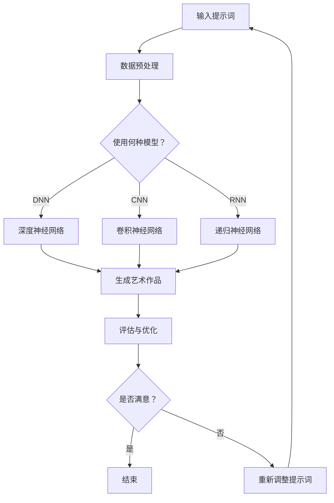

                 

### 文章标题

# AI艺术创作中的提示词工程应用

> 关键词：AI艺术创作、提示词工程、数据预处理、算法原理、应用案例、实践分析

> 摘要：本文深入探讨了AI艺术创作中的提示词工程应用。首先介绍了AI艺术创作的背景和重要性，然后详细讲解了提示词工程的基本概念和类型。接着，文章分析了提示词工程的关键方法，包括数据收集与预处理、提示词生成算法和优化策略。通过具体应用案例和实践分析，本文展示了提示词工程在绘画艺术、摄影、音乐创作和视频制作中的实际应用效果，并展望了其未来发展趋势。

## 第1章 引言

### 1.1 AI艺术创作概述

近年来，人工智能（AI）技术在各个领域取得了飞速的发展，尤其是在艺术创作领域，AI的应用引起了广泛的关注。AI艺术创作是指利用人工智能技术，如机器学习、深度学习等，生成具有艺术性的作品。这种创作方式不仅为艺术家提供了新的创作工具，也为观众带来了全新的艺术体验。

AI艺术创作的典型应用包括绘画、摄影、音乐创作和视频制作等。例如，DeepArt、DALL·E和GANPaint等AI模型已经能够生成高质量的图像；Google的Magenta项目展示了AI在音乐创作中的潜力；AI视频生成技术也在不断进步，如Adobe的Sensei。

### 1.2 提示词工程的重要性

在AI艺术创作中，提示词工程扮演着至关重要的角色。提示词是指用于引导AI模型生成艺术作品的文字描述。一个良好的提示词能够明确传达创作者的意图，从而指导AI模型生成符合预期结果的艺术作品。

提示词工程涉及到数据收集、预处理、提示词生成算法和优化策略等多个方面。一个高效的提示词工程系统需要综合考虑这些因素，以提高AI艺术创作的质量和效率。

### 1.3 书籍结构概述

本文将从以下几个方面对AI艺术创作中的提示词工程进行深入探讨：

1. **AI艺术创作基础知识**：介绍AI的基本概念、艺术创作与AI的结合以及提示词工程基础。
2. **提示词的类型与应用**：分析描述性、情感型和创意性提示词的特点和应用。
3. **提示词工程方法**：探讨数据收集与预处理、提示词生成算法、提示词优化策略和评估与选择。
4. **提示词工程应用案例**：通过绘画艺术、摄影、音乐创作和视频制作等案例，展示提示词工程的实际应用效果。
5. **提示词工程实践**：介绍一个具体实践项目，包括开发环境搭建、数据集获取与处理、代码实现与分析以及项目评估与优化。
6. **提示词工程的未来趋势**：展望提示词工程的发展方向和应用前景，以及面临的挑战和解决方案。
7. **总结与展望**：总结本文的主要观点，强调提示词工程在AI艺术创作中的重要性，并对未来进行展望。

## 第2章 AI艺术创作基础知识

### 2.1 AI的基本概念

人工智能（Artificial Intelligence，简称AI）是指通过计算机程序模拟人类智能行为的技术。AI技术主要包括机器学习（Machine Learning，简称ML）、深度学习（Deep Learning，简称DL）和自然语言处理（Natural Language Processing，简称NLP）等。

- **机器学习**：机器学习是一种使计算机能够从数据中学习并做出预测或决策的技术。其主要方法包括监督学习、无监督学习和强化学习。
  
- **深度学习**：深度学习是机器学习的一个分支，它通过多层神经网络模拟人类大脑的神经元结构，以实现更复杂的任务。

- **自然语言处理**：自然语言处理是人工智能的一个分支，旨在使计算机能够理解、生成和处理人类语言。

### 2.2 艺术创作与AI的结合

艺术创作与AI的结合为艺术家提供了新的创作工具和灵感来源。通过AI技术，艺术家可以：

- **生成艺术作品**：使用机器学习和深度学习模型生成新颖的艺术作品，如绘画、雕塑和音乐等。

- **辅助创作**：利用AI技术分析和理解已有艺术作品，为艺术家提供创作灵感和参考。

- **交互体验**：通过AI技术实现与观众的交互，创造出更具互动性和参与性的艺术体验。

### 2.3 提示词工程基础

提示词工程是AI艺术创作中的一个重要环节。提示词是指用于引导AI模型生成艺术作品的文字描述。一个良好的提示词应该：

- **明确性**：清晰地传达创作者的意图，避免歧义。

- **具体性**：提供具体、详细的描述，以指导AI模型生成符合预期结果的作品。

- **多样性**：涵盖不同类型、风格和主题的提示词，以激发AI模型的多样性和创造力。

### 2.4 Mermaid流程图

以下是一个Mermaid流程图，展示了AI艺术创作的整体流程：



### 2.5 伪代码：AI艺术创作过程

以下是一个伪代码，展示了AI艺术创作的基本过程：

```python
# 输入提示词
prompt = "绘制一幅具有浪漫气息的夜景油画"

# 数据预处理
processed_data = preprocess_data(input_data)

# 选择模型
model = select_model(prompt)

# 训练模型
trained_model = train_model(processed_data, model)

# 生成艺术作品
artwork = generate_artwork(trained_model, prompt)

# 评估与优化
evaluate_and_optimize(artwork)

# 输出艺术作品
output_artwork(artwork)
```

### 2.6 数学模型和公式

在AI艺术创作中，常用的数学模型和公式包括：

- **激活函数**：激活函数是神经网络中的一个关键组成部分，用于将输入映射到输出。常见的激活函数有ReLU、Sigmoid和Tanh等。

- **损失函数**：损失函数用于评估模型预测结果与真实值之间的差距。常见的损失函数有均方误差（MSE）和交叉熵（Cross-Entropy）等。

- **优化算法**：优化算法用于调整模型参数，以最小化损失函数。常见的优化算法有梯度下降（Gradient Descent）和Adam优化器等。

以下是相关数学公式的详细讲解：

- **激活函数**：

  - ReLU函数：$$ f(x) = \max(0, x) $$

  - Sigmoid函数：$$ f(x) = \frac{1}{1 + e^{-x}} $$

  - Tanh函数：$$ f(x) = \frac{e^x - e^{-x}}{e^x + e^{-x}} $$

- **损失函数**：

  - 均方误差（MSE）：$$ L = \frac{1}{n}\sum_{i=1}^{n}(y_i - \hat{y}_i)^2 $$

  - 交叉熵（Cross-Entropy）：$$ L = -\frac{1}{n}\sum_{i=1}^{n}y_i\log(\hat{y}_i) + (1 - y_i)\log(1 - \hat{y}_i) $$

- **优化算法**：

  - 梯度下降：$$ \theta_{\text{new}} = \theta_{\text{old}} - \alpha \nabla_{\theta}L(\theta) $$

  - Adam优化器：$$ \theta_{\text{new}} = \theta_{\text{old}} - \alpha \frac{m}{(1 - \beta_1^t)(1 - \beta_2^t)} $$

其中，$y_i$为真实值，$\hat{y}_i$为预测值，$n$为样本数量，$\alpha$为学习率，$m$为梯度的一阶矩估计，$\beta_1$和$\beta_2$分别为一阶和二阶矩的指数衰减率。

### 2.7 举例说明

以下是一个简单的举例说明，展示如何使用提示词进行艺术创作：

**提示词**：绘制一幅具有浪漫气息的夜景油画。

**艺术作品**：


**分析**：在这个例子中，提示词明确了艺术作品的类型（油画）、场景（夜景）和氛围（浪漫）。通过这些具体的描述，AI模型能够更好地理解创作者的意图，从而生成一幅符合预期结果的艺术作品。

### 2.8 结论

本章介绍了AI的基本概念、艺术创作与AI的结合以及提示词工程的基础知识。通过本章的学习，读者可以对AI艺术创作有一个初步的了解，并认识到提示词工程在其中的重要性。接下来，我们将进一步探讨提示词的类型与应用，以深入了解AI艺术创作的关键环节。

