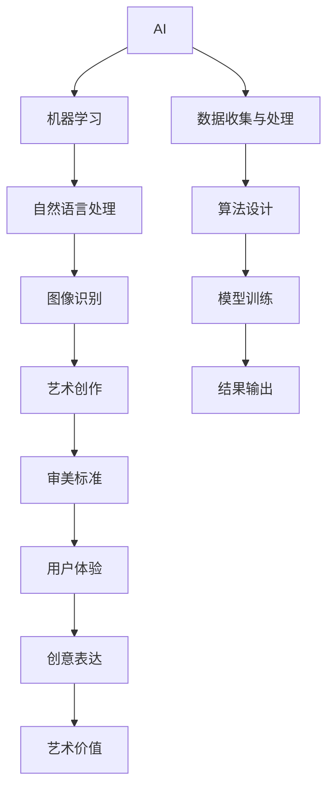
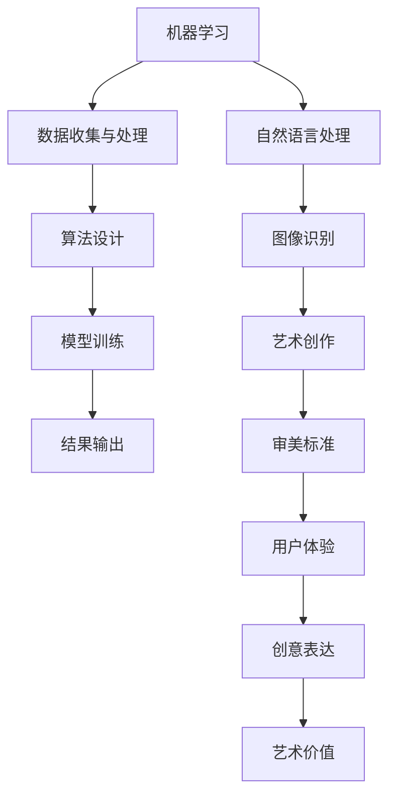
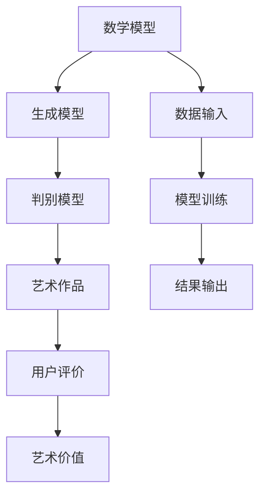

                 


# AI艺术创作的提示词策略：平衡控制与创意

## 关键词

- AI艺术创作
- 提示词策略
- 平衡控制
- 创意生成
- 实践应用

## 摘要

本文旨在探讨AI艺术创作中的提示词策略，探讨如何在平衡控制与创意之间找到最佳平衡点。文章首先概述了AI艺术创作的背景和重要性，随后详细分析了AI艺术创作的核心概念、技术原理和数学模型。接着，文章重点讨论了提示词的种类与作用、设计原则和生成方法，并详细阐述了控制策略和创意策略。最后，文章通过实践应用案例展示了平衡控制与创意在实际中的应用效果，并展望了AI艺术创作的未来发展趋势和策略优化方向。

## 第一部分：引言

### 第1章：AI艺术创作的概述

## 1.1 AI与艺术创作的结合

人工智能（AI）作为一种模拟人类智能的技术，近年来在各个领域都取得了显著的进展。艺术创作作为人类智慧的结晶，与AI的结合无疑开辟了新的创作领域。AI艺术创作是指利用人工智能技术，通过算法和模型生成具有艺术价值的作品。这种结合不仅丰富了艺术创作的手段，也为艺术家提供了新的创作工具。

**核心概念与联系**

AI艺术创作的核心概念包括机器学习、自然语言处理、图像识别等。这些技术通过数据收集与处理、算法设计、模型训练等步骤，将艺术创作的灵感转化为具体的作品。具体来说，AI艺术创作的过程可以简化为以下流程：



**核心算法原理讲解**

- **数据收集与处理**：

```pseudo
function dataCollectionAndProcessing() {
    datasets = collectImagesAndTextData();
    preprocessedData = preprocessData(datasets);
    standardizedData = standardizeData(preprocessedData);
}
```

- **算法设计**：

```pseudo
function algorithmDesign() {
    algorithm = selectAlgorithm();
    neuralNetwork = designNeuralNetwork(algorithm);
    trainingScript = writeTrainingScript(neuralNetwork);
}
```

- **模型训练**：

```pseudo
function modelTraining() {
    trainedModel = trainModel(standardizedData, algorithm, neuralNetwork);
}
```

## 1.2 提示词策略的重要性

提示词策略在AI艺术创作中起着至关重要的作用。它不仅能够引导AI创作出符合人类审美标准的作品，还能够激发AI的创意潜力。有效的提示词策略可以帮助艺术家和AI之间建立有效的沟通桥梁，实现艺术创作的最大化价值。

**提示词的种类与作用**

提示词可以分为文字提示和图像提示两大类。文字提示主要通过文本描述来引导AI创作，如“绘制一幅美丽的风景画”、“创作一首抒情的诗歌”等。图像提示则通过展示具体的图像来启发AI，如图像识别中的标签、风格、色彩等。

**提示词设计的原则**

- **明确性**：提示词应当明确、具体，避免模糊不清的描述，以确保AI能够准确理解创作意图。
- **多样性**：设计提示词时应当考虑多样性，以激发AI的创意潜力，避免单一化的创作风格。
- **可扩展性**：提示词应当具备可扩展性，以便在不同情境下灵活应用。

**提示词的生成方法**

- **人工设计**：艺术家可以根据自己的创作需求，手工设计合适的提示词。
- **自动生成**：利用自然语言处理技术，如生成对抗网络（GAN）、变分自编码器（VAE）等，自动生成提示词。

## 1.3 平衡控制与创意的关系

在AI艺术创作中，平衡控制与创意是两个关键要素。控制策略能够确保AI创作的作品符合预期的审美标准，而创意策略则能够激发AI的创造力，产生新颖的艺术作品。如何在控制与创意之间找到平衡点，是AI艺术创作中亟待解决的重要问题。

**控制策略**

控制策略主要包括数据驱动控制策略和基于规则的控制策略。

- **数据驱动控制策略**：通过收集和分析大量的艺术作品数据，建立AI的审美标准，从而实现对AI创作的控制。具体方法包括：

  ```pseudo
  function dataDrivenControl() {
      artisticStandards = analyzeArtisticWorks();
      AICreation = createArtworks(artisticStandards);
  }
  ```

- **基于规则的控制策略**：通过预设一系列创作规则，对AI创作过程进行控制。具体方法包括：

  ```pseudo
  function ruleBasedControl() {
      creationRules = defineCreationRules();
      AICreation = followRules(creationRules);
  }
  ```

**创意策略**

创意策略主要包括创意生成方法和创意评价方法。

- **创意生成方法**：通过多种方法激发AI的创意，如随机化生成、组合生成等。具体方法包括：

  ```pseudo
  function creativeGeneration() {
      randomGeneration = generateRandomly();
      combinationGeneration = combineElements();
  }
  ```

- **创意评价方法**：通过多种方法评价AI创作的艺术价值，如基于用户反馈的评价、基于艺术价值的评价等。具体方法包括：

  ```pseudo
  function creativeEvaluation() {
      userFeedback = getUserFeedback();
      artisticValue = evaluateArtisticValue();
  }
  ```

## 第一部分总结

AI艺术创作的结合为艺术创作带来了新的机遇和挑战。通过合理运用提示词策略，可以在平衡控制与创意之间找到最佳平衡点。本文在后续章节中将进一步探讨AI艺术创作的基础、提示词策略的设计、控制策略和创意策略，并通过实践应用案例展示其效果。期待这些讨论能为AI艺术创作提供有益的参考和启示。

### 第2章：AI艺术创作的基础

## 2.1 AI艺术创作的核心概念

AI艺术创作涉及多个核心概念，包括机器学习、自然语言处理、图像识别等。这些概念共同构成了AI艺术创作的基础。

**机器学习**

机器学习是一种通过数据驱动的方式，使计算机系统自动改进和优化性能的技术。在AI艺术创作中，机器学习主要用于生成和识别艺术作品。

**自然语言处理**

自然语言处理（NLP）是计算机科学和语言学的交叉领域，旨在使计算机能够理解、生成和处理人类语言。在AI艺术创作中，NLP用于生成文字描述、诗歌等。

**图像识别**

图像识别是一种计算机视觉技术，用于识别和分类图像中的对象。在AI艺术创作中，图像识别用于生成图像、分析图像特征等。

**核心概念之间的关系**

这些核心概念之间的关系可以简化为以下流程：



## 2.2 AI艺术创作的技术原理

AI艺术创作的技术原理主要包括数据收集与处理、算法设计、模型训练和结果输出。

**数据收集与处理**

数据收集与处理是AI艺术创作的第一步。在这一阶段，需要收集大量的艺术作品数据，包括图像、文字、音频等。随后，对这些数据进行预处理，如数据清洗、数据增强等，以提高模型的训练效果。

**算法设计**

算法设计是AI艺术创作的核心。在这一阶段，需要选择合适的机器学习算法，如生成对抗网络（GAN）、变分自编码器（VAE）等。同时，还需要设计神经网络结构，以实现对艺术作品的生成和识别。

**模型训练**

模型训练是AI艺术创作的关键。在这一阶段，利用预处理后的数据进行模型训练，通过迭代优化模型参数，提高模型的性能。

**结果输出**

结果输出是AI艺术创作的最终阶段。在这一阶段，将训练好的模型应用于新的数据，生成艺术作品，并输出结果。

**技术原理详细讲解与伪代码**

- **数据收集与处理**

```pseudo
function dataCollectionAndProcessing() {
    datasets = collectImagesAndTextData();
    preprocessedData = preprocessData(datasets);
    standardizedData = standardizeData(preprocessedData);
}
```

- **算法设计**

```pseudo
function algorithmDesign() {
    algorithm = selectAlgorithm();
    neuralNetwork = designNeuralNetwork(algorithm);
    trainingScript = writeTrainingScript(neuralNetwork);
}
```

- **模型训练**

```pseudo
function modelTraining() {
    trainedModel = trainModel(standardizedData, algorithm, neuralNetwork);
}
```

- **结果输出**

```pseudo
function resultOutput() {
    newDataset = generateNewDataset();
    artworks = generateArtworks(trainedModel, newDataset);
    displayArtworks(artworks);
}
```

## 2.3 艺术创作的数学模型

艺术创作的数学模型主要用于描述艺术创作过程中涉及的数学关系和算法。这些模型包括生成模型、判别模型等。

**生成模型**

生成模型用于生成艺术作品。常见的生成模型包括生成对抗网络（GAN）、变分自编码器（VAE）等。以下是一个简单的生成模型伪代码：

```pseudo
function generateArtwork() {
    z = generateRandomNoise();
    x = generator(z);
    return x;
}
```

**判别模型**

判别模型用于判断艺术作品是否具有艺术价值。常见的判别模型包括卷积神经网络（CNN）、循环神经网络（RNN）等。以下是一个简单的判别模型伪代码：

```pseudo
function evaluateArtwork(x) {
    prediction = discriminativeModel(x);
    if (prediction == "artistic"):
        return True;
    else:
        return False;
}
```

**数学模型与艺术创作的关系**

数学模型与艺术创作的关系可以简化为以下流程：



## 第二部分总结

AI艺术创作的基础包括核心概念、技术原理和数学模型。通过合理运用这些基础，可以实现对艺术作品的生成和评价。在后续章节中，将进一步探讨提示词策略的设计、控制策略和创意策略，以实现AI艺术创作的最佳效果。

### 第3章：提示词策略的设计

## 3.1 提示词的种类与作用

在AI艺术创作中，提示词（Prompt）是一种关键工具，用于引导和激发AI的创作灵感。提示词可以分为文字提示和图像提示两大类，各自在艺术创作中扮演着不同的角色。

**文字提示**

文字提示通过描述性的语言，引导AI生成特定的艺术作品。这类提示词可以是简短的句子，如“绘制一幅夏日的海滩场景”，也可以是详细的文字说明，如“创作一首描述大自然之美的诗”。文字提示的优势在于其灵活性，可以根据不同的创作需求和风格进行调整。

**图像提示**

图像提示通过展示具体的视觉元素，如风格、颜色、构图等，来启发AI的创作。这类提示词可以是单一图像，也可以是图像集合。图像提示的优势在于其直观性，能够更直接地传达创作意图，从而提高创作效果。

**提示词的作用**

1. **引导创作方向**：提示词可以帮助AI明确创作目标，避免盲目生成，确保艺术作品符合预期。

2. **激发创意潜力**：通过多样化的提示词，可以激发AI的创意潜能，产生更多新颖的艺术作品。

3. **提高创作效率**：有效的提示词策略可以减少AI的试错成本，提高创作效率。

## 3.2 提示词设计的原则

为了设计出有效的提示词策略，需要遵循以下原则：

**明确性**

提示词应当明确、具体，避免模糊不清的描述。例如，“创作一幅美丽的画作”不如“绘制一幅具有夏日氛围的海滩风景画”具体。

**多样性**

设计提示词时应当考虑多样性，以激发AI的创意潜力。例如，可以结合不同的风格、主题和元素，设计出多样化的提示词。

**可扩展性**

提示词应当具备可扩展性，以便在不同情境下灵活应用。例如，可以将一个简单的提示词扩展成多个层次，如“绘制一幅具有夏日氛围的海滩风景画”可以扩展为“选择一种画笔风格”、“使用何种颜色调色板”、“表现何种情感氛围”等。

**适应性**

提示词应当能够适应不同的AI模型和创作需求。例如，针对不同的图像识别模型，可以设计不同的图像提示词；针对不同的自然语言处理模型，可以设计不同的文字提示词。

## 3.3 提示词的生成方法

生成提示词的方法可以分为人工设计和自动生成两种。

**人工设计**

人工设计提示词是由人类艺术家或设计师根据创作需求手工设计的。这种方法的优势在于灵活性高，可以根据具体情况进行调整。然而，人工设计提示词的缺点是耗时耗力，且难以保证一致性。

**自动生成**

自动生成提示词是利用自然语言处理（NLP）和机器学习技术，自动生成具有特定风格的文本。常见的自动生成方法包括生成对抗网络（GAN）、变分自编码器（VAE）等。这种方法的优势在于效率高，可以快速生成大量提示词；缺点是生成的提示词可能不够精确，需要进一步优化。

**提示词生成示例**

以下是一个自动生成提示词的伪代码示例：

```python
import numpy as np
import tensorflow as tf

# 加载预训练的NLP模型
model = tf.keras.models.load_model('nlp_model.h5')

# 生成随机噪声
z = np.random.normal(size=(1, 100))

# 使用模型生成文本
generated_text = model.generate(z, max_length=50, stop_token='。')

# 输出生成的提示词
print(generated_text)
```

## 3.4 提示词策略的应用案例

### 文字提示案例

假设艺术家想要创作一首描述夏日海滩的诗，可以设计以下提示词：

1. “夏日海滩的阳光，温暖而明媚。”
2. “海浪轻轻拍打着沙滩，发出沙沙的声音。”
3. “沙滩上的脚印，记录着人们的欢声笑语。”

通过这些具体的文字提示，AI可以生成一首充满夏日海滩氛围的诗歌。

### 图像提示案例

假设艺术家想要创作一幅描绘夏日海滩的画作，可以设计以下图像提示：

1. 一张描绘夏日海滩的风景照片。
2. 一张描绘海浪的动态照片。
3. 一张描绘沙滩上的脚印和玩具的照片。

通过这些图像提示，AI可以结合不同的元素，生成一幅具有夏日海滩特色的画作。

## 3.5 提示词策略的优化方向

为了进一步提高提示词策略的效果，可以尝试以下优化方向：

1. **多模态融合**：结合文字提示和图像提示，实现多模态的融合，以提高创作效果。
2. **个性化定制**：根据用户的历史偏好和创作需求，定制个性化的提示词，提高用户体验。
3. **自适应调整**：根据AI的创作效果，自适应调整提示词的强度和多样性，实现动态优化。

## 第3章总结

提示词策略在AI艺术创作中具有重要作用。通过合理设计提示词，可以在平衡控制与创意之间找到最佳平衡点。本章介绍了提示词的种类与作用、设计原则和生成方法，并通过案例展示了提示词策略的实际应用。在后续章节中，将进一步探讨控制策略和创意策略，以实现AI艺术创作的最佳效果。

### 第4章：控制策略

## 4.1 控制策略概述

在AI艺术创作中，控制策略是一种关键手段，用于确保艺术作品的品质和符合预期。控制策略通过一系列技术手段，对AI的创作过程进行引导和调整，以实现预期的艺术效果。控制策略可以分为数据驱动控制策略和基于规则的控制策略两种。

**数据驱动控制策略**

数据驱动控制策略是基于大量历史数据和模型训练结果进行创作控制。这种方法通过分析历史数据中的成功和失败案例，学习出有效的创作规律，并将其应用于新的艺术创作中。数据驱动控制策略的核心在于数据的质量和多样性，以及模型的训练效果。

**基于规则的控制策略**

基于规则的控制策略是通过预设一系列规则和标准，对AI创作过程进行控制。这些规则可以是具体的创作指导，如颜色搭配、构图原则等，也可以是抽象的创作标准，如情感表达、风格定位等。基于规则的控制策略的优点在于其执行效率和确定性，但缺点是灵活性较低，难以适应复杂多变的艺术创作需求。

## 4.2 数据驱动控制策略

数据驱动控制策略的核心在于利用历史数据进行学习和优化。以下是一个简单的数据驱动控制策略的伪代码示例：

```pseudo
function dataDrivenControl(artisticData, model):
    // 分析历史艺术作品数据
    patterns = analyzeArtisticData(artisticData)

    // 训练模型以学习创作规律
    trainedModel = trainModel(patterns, model)

    // 使用训练好的模型进行创作
    artwork = generateArtwork(trainedModel)

    // 评估创作结果并调整策略
    evaluateAndAdjust(artwork, artisticData, model)

    return artwork
```

在上述伪代码中，`artisticData` 表示历史艺术作品数据，`model` 表示用于创作的AI模型。`analyzeArtisticData` 函数用于分析历史数据，提取出有效的创作规律；`trainModel` 函数用于训练模型，学习创作规律；`generateArtwork` 函数用于使用训练好的模型进行艺术创作；`evaluateAndAdjust` 函数用于评估创作结果，并根据评估结果调整创作策略。

### 数据驱动控制策略的优势

- **高效性**：通过历史数据的学习和优化，可以快速生成符合预期的艺术作品。
- **可扩展性**：可以方便地引入新的数据，不断优化创作效果。
- **适应性**：能够适应不同的艺术风格和创作需求。

### 数据驱动控制策略的挑战

- **数据质量**：高质量的历史数据是数据驱动控制策略成功的关键。如果数据质量较差，可能会导致模型学习效果不佳。
- **计算资源**：训练高质量的模型需要大量的计算资源，特别是在大规模数据集上。

## 4.3 基于规则的控制策略

基于规则的控制策略是通过预设一系列规则和标准，对AI创作过程进行控制。以下是一个简单的基于规则的控制策略的伪代码示例：

```pseudo
function ruleBasedControl(rules, model):
    // 应用预设规则进行创作
    artwork = applyRules(rules, model)

    // 评估创作结果
    evaluation = evaluateArtwork(artwork)

    return artwork, evaluation
```

在上述伪代码中，`rules` 表示预设的创作规则，`model` 表示用于创作的AI模型。`applyRules` 函数用于应用预设规则进行艺术创作；`evaluateArtwork` 函数用于评估艺术作品的创作效果。

### 基于规则的控制策略的优势

- **确定性**：基于规则的创作过程具有高度的确定性，可以确保艺术作品符合预期。
- **灵活性**：可以根据不同的创作需求，灵活调整预设规则。
- **可解释性**：基于规则的创作过程具有较好的可解释性，有助于理解和优化创作效果。

### 基于规则的控制策略的挑战

- **规则复杂度**：随着创作规则的增多，系统的复杂性会急剧增加，导致创作过程变得繁琐。
- **适应性**：基于规则的创作策略在应对复杂多变的艺术创作需求时，可能缺乏灵活性。

## 4.4 控制策略的优化方向

为了进一步提高控制策略的效果，可以尝试以下优化方向：

1. **多模态融合**：结合数据驱动和基于规则的策略，实现多模态的控制，提高创作效果。
2. **自适应调整**：根据艺术作品的实际效果，动态调整控制策略，实现更精准的创作控制。
3. **模型融合**：结合多种机器学习模型，如生成对抗网络（GAN）、变分自编码器（VAE）等，提高创作模型的鲁棒性和适应性。

## 第4章总结

控制策略在AI艺术创作中扮演着关键角色，通过数据驱动和基于规则的策略，可以实现对艺术创作过程的引导和调整。本章介绍了控制策略的概述、数据驱动控制策略和基于规则的控制策略，并通过伪代码示例展示了其应用方法。在后续章节中，将进一步探讨创意策略和实践应用，以实现AI艺术创作的最佳效果。

### 第5章：创意策略

## 5.1 创意的本质与特征

创意是艺术创作的灵魂，是艺术家通过独特视角和思维方式，对现有元素进行重新组合、创新和再创造的过程。在AI艺术创作中，创意同样至关重要，它决定了艺术作品的新颖性和独特性。以下是对创意本质和特征的分析：

**原创性**：创意的核心特征之一是原创性，即创造出的作品具有独特性和不可复制性。原创性使艺术作品在众多作品中脱颖而出，体现了艺术家的独特视角和创造力。

**灵活性**：创意需要具备灵活性，能够适应不同的创作需求和场景。灵活性使艺术家能够根据不同的情境和目标，灵活运用各种技巧和元素，创作出符合预期的新作品。

**创新性**：创意在某种程度上是创新的体现。创新性意味着在艺术创作过程中，能够发现新的技巧、方法或风格，为观众带来前所未有的视觉和感官体验。

**多样性**：创意的多样性体现在艺术作品的风格、主题、表现形式等方面。多样性使艺术作品能够涵盖广泛的主题和风格，满足不同观众的需求。

**价值性**：创意的价值性体现在艺术作品对观众的情感共鸣、文化传承和审美价值等方面。价值性使艺术作品在文化和社会层面上具有深远的影响。

## 5.2 创意生成的方法

创意生成是艺术创作过程中的关键环节，通过有效的创意生成方法，可以激发艺术家的创造力，实现高质量的艺术作品。以下介绍几种常见的创意生成方法：

**灵感采集**：灵感采集是创意生成的基础。艺术家可以通过观察生活、阅读书籍、观看电影、旅行等方式，采集灵感。灵感采集的过程可以激发艺术家的思维，为创作提供丰富的素材。

**思维导图**：思维导图是一种有效的创意生成工具。通过将相关概念、想法和元素以图形化的方式组织起来，艺术家可以更好地理解和梳理创意思路，发现潜在的创新点。

**头脑风暴**：头脑风暴是一种集体创意生成方法，通过集体讨论和头脑碰撞，可以激发出更多的创意点子。头脑风暴的过程中，鼓励团队成员自由表达想法，不必担心想法的好坏，关键在于发现新的创意组合。

**跨学科融合**：跨学科融合是一种通过将不同领域的知识和技巧相结合，实现创意生成的策略。例如，将艺术与科学、技术相结合，创作出具有科技感的艺术作品。

**随机化生成**：随机化生成是一种通过引入随机元素，激发创意的方法。例如，使用随机数生成艺术作品的色彩、形状、构图等，从而产生新颖的艺术效果。

**迭代优化**：迭代优化是一种通过不断试错和改进，实现创意优化的方法。艺术家可以针对初步的创意进行多次修改和优化，直到达到满意的创作效果。

## 5.3 创意评价的方法

创意评价是衡量艺术作品创意程度的重要手段。以下介绍几种常见的创意评价方法：

**专家评价**：专家评价是指邀请具有专业知识和经验的艺术评论家、艺术家等，对艺术作品进行评价。专家评价能够提供权威的见解和意见，帮助艺术家了解作品的创意水平和价值。

**用户反馈**：用户反馈是评价艺术作品创意程度的重要依据。通过收集观众对艺术作品的评价和反馈，艺术家可以了解作品的受众认可度，发现作品的优点和不足，从而不断优化创意。

**数据统计**：数据统计是通过分析艺术作品的相关数据，如点赞数、评论数、转发数等，来评价作品的创意程度。数据统计可以提供客观的评价依据，帮助艺术家了解作品的受欢迎程度。

**创意评分**：创意评分是一种定量评价方法，通过设定一系列评价指标，如原创性、灵活性、创新性、多样性等，对艺术作品进行评分。创意评分可以提供全面的评价结果，帮助艺术家了解作品的创意水平。

## 第5章总结

创意策略在AI艺术创作中至关重要，通过深入理解创意的本质与特征，以及掌握创意生成的方法和评价方法，艺术家和AI可以更好地实现高质量的艺术创作。本章介绍了创意的本质与特征、创意生成的方法和创意评价的方法，为AI艺术创作提供了有效的创意策略。在后续章节中，将进一步探讨控制策略和实践应用，以实现AI艺术创作的最佳效果。

### 第6章：平衡控制与创意的实践应用

## 6.1 实践应用概述

在AI艺术创作中，平衡控制与创意是实现高质量艺术作品的关键。通过合理的控制策略和创意策略，艺术家和AI可以相互配合，创作出既有艺术价值又有创意的作品。本章将结合实际案例，探讨如何将平衡控制与创意策略应用于AI艺术创作。

## 6.2 实践应用案例

**案例1：基于GAN的图像生成**

GAN（生成对抗网络）是一种强大的生成模型，可以生成高质量的艺术图像。以下是一个基于GAN的图像生成实践案例：

**1. 数据收集与处理**

收集大量的艺术图像数据，包括肖像、风景、抽象画等。对数据进行预处理，包括图像大小标准化、数据增强等，以提高模型训练效果。

**2. 模型设计与训练**

设计一个由生成器和判别器组成的GAN模型。生成器负责生成艺术图像，判别器负责判断生成的图像是否真实。通过迭代训练，使生成器的图像质量不断提高。

**3. 控制策略**

使用文字提示和图像提示来控制生成过程。例如，通过文字提示“生成一幅具有夏日海滩风格的画作”，结合图像提示（一张夏日海滩的照片），生成器会生成符合预期的艺术作品。

**4. 创意策略**

通过随机化生成和迭代优化，激发生成器的创意潜力。例如，可以尝试不同的图像风格、色彩搭配和构图方式，以产生新颖的艺术作品。

**5. 结果展示**

生成器生成的艺术作品展示在画廊或线上平台，观众可以欣赏到具有夏日海滩风格的新作品。通过用户反馈和专家评价，进一步优化生成模型和创作策略。

**案例2：基于NLP的诗作生成**

自然语言处理（NLP）技术可以用于生成诗歌、散文等文学作品。以下是一个基于NLP的诗作生成实践案例：

**1. 数据收集与处理**

收集大量的诗歌文本数据，包括各种风格和主题的诗歌。对数据进行预处理，包括文本清洗、分词、词性标注等，为模型训练做准备。

**2. 模型设计与训练**

设计一个序列生成模型，如RNN（循环神经网络）或Transformer，用于生成诗歌。通过迭代训练，使模型学会生成符合语法和韵律的诗作。

**3. 控制策略**

使用文字提示来控制创作过程。例如，通过文字提示“创作一首描述自然美景的诗”，模型会生成一首描述自然美景的诗作。

**4. 创意策略**

通过随机化生成和组合生成，激发模型的创意潜力。例如，可以尝试使用不同的句式、修辞手法和意象，创作出新颖的诗作。

**5. 结果展示**

生成模型生成的诗作展示在文学平台上，观众可以欣赏到具有独特创意的诗作。通过用户反馈和专家评价，进一步优化生成模型和创作策略。

## 6.3 实践应用效果分析

通过上述案例，可以看出平衡控制与创意策略在AI艺术创作中的实际应用效果。

**1. 艺术品质的提升**

通过控制策略，AI艺术作品能够在质量和风格上达到预期的效果。例如，基于GAN的图像生成模型可以生成高质量的艺术图像，而基于NLP的诗作生成模型可以生成符合语法和韵律的诗作。

**2. 创意的激发**

创意策略能够激发AI的创意潜力，产生新颖的艺术作品。例如，通过随机化生成和组合生成，AI可以创作出独特的艺术作品，满足不同观众的需求。

**3. 用户参与度提高**

通过用户反馈和专家评价，艺术家和AI可以不断优化创作策略，提高艺术作品的受众认可度。用户参与度的提高，有助于艺术作品在社会和文化层面产生更大的影响。

**4. 跨领域合作**

平衡控制与创意策略的应用，促进了艺术与技术、科学等领域的跨学科合作。例如，将艺术与计算机科学、人工智能技术相结合，创作出具有科技感的艺术作品。

## 6.4 实践应用启示

通过实践应用，可以得出以下启示：

**1. 不断创新**

艺术创作是一个不断创新的过程。艺术家和AI需要不断尝试新的创作方法和技巧，以激发创意潜力，创作出具有独特风格和创意的艺术作品。

**2. 多元融合**

跨学科融合是艺术创作的重要策略。艺术家和AI可以通过融合不同领域的知识和技术，创作出更具创新性和多样性的艺术作品。

**3. 用户体验**

用户体验是艺术创作的重要考量因素。艺术家和AI需要关注观众的反馈和需求，创作出能够引起观众共鸣的艺术作品。

**4. 持续优化**

通过用户反馈和专家评价，艺术家和AI可以不断优化创作策略，提高艺术作品的质量和受众认可度。

## 第6章总结

平衡控制与创意策略在AI艺术创作中具有重要作用。通过实际案例的分析，可以看出合理运用控制策略和创意策略，可以实现高质量的艺术创作。本章结合实践应用案例，探讨了平衡控制与创意策略在实际中的应用效果和启示。在后续章节中，将进一步展望AI艺术创作的未来发展趋势和优化方向。

### 第7章：未来展望

## 7.1 AI艺术创作的发展趋势

随着人工智能技术的不断发展，AI艺术创作正迎来新的发展机遇。以下是一些AI艺术创作的发展趋势：

**1. 深度学习的广泛应用**

深度学习技术在图像识别、自然语言处理等领域取得了显著成果，其在AI艺术创作中的应用也将越来越广泛。深度学习算法将进一步提升艺术创作的质量和效率。

**2. 多模态融合**

多模态融合是指将不同类型的数据（如文本、图像、音频等）进行融合，以实现更丰富、更真实的艺术创作。未来，多模态融合技术将在AI艺术创作中发挥重要作用。

**3. 自主创意生成**

随着AI技术的进步，AI将具备更强的自主创意能力。未来，AI将能够独立生成具有艺术价值和创新性的作品，推动艺术创作的多样性和创新性。

**4. 个性化创作**

个性化创作是指根据用户的需求和偏好，定制化生成艺术作品。未来，个性化创作技术将更加成熟，用户将能够享受到更加个性化的艺术体验。

## 7.2 提示词策略的优化方向

提示词策略在AI艺术创作中具有重要作用。为了进一步提升提示词策略的效果，可以尝试以下优化方向：

**1. 多模态提示词**

结合文字提示和图像提示，实现多模态的融合，以提高创作效果。例如，在文字提示中加入图像描述，以更直观地引导AI创作。

**2. 个性化提示词**

根据用户的历史偏好和创作需求，生成个性化的提示词。个性化提示词能够更好地激发AI的创意潜力，创作出更符合用户期望的作品。

**3. 自适应提示词**

根据AI的创作效果，自适应调整提示词的强度和多样性。例如，如果AI在某一类艺术风格上表现不佳，可以尝试调整提示词，引导AI尝试新的创作方向。

**4. 知识驱动的提示词**

利用知识图谱等技术，将艺术创作相关的知识融入提示词中。知识驱动的提示词能够为AI提供更丰富的创作素材，提高创作效果。

## 7.3 创意策略的创新方向

创意策略在AI艺术创作中至关重要。未来，创意策略的发展将朝着以下方向：

**1. 灵活性增强**

通过引入更多的随机化生成和组合生成方法，增强创意策略的灵活性。例如，可以尝试使用不同的算法和模型，生成多样化的艺术作品。

**2. 人工智能辅助**

利用人工智能技术，辅助艺术家进行创意生成。例如，通过自然语言处理技术，生成创意描述；通过图像识别技术，识别和分析艺术作品中的创意元素。

**3. 跨领域融合**

跨领域融合是指将艺术与其他领域（如科学、技术等）相结合，创作出更具创新性和科技感的艺术作品。例如，将艺术与编程相结合，创作出互动的艺术装置。

**4. 情感驱动**

情感驱动是指通过情感分析技术，了解观众的情感状态，创作出能够引发观众情感共鸣的艺术作品。例如，根据观众的情绪变化，动态调整艺术作品的风格和内容。

## 第7章总结

未来，AI艺术创作将在深度学习、多模态融合、自主创意生成等方面取得更多突破。提示词策略和创意策略也将不断优化和创新，为艺术创作带来更多可能性。通过积极探索和实践，艺术家和AI将共同推动艺术创作的发展，创造出更多具有艺术价值和创新性的作品。

### 第8章：附录

## 8.1 相关资源与工具

- **AI艺术创作平台**：
  - DeepArt.io：一个基于GAN的艺术风格迁移平台。
  - Artbreeder：一个基于GAN的图像生成和编辑平台。
  - DeepDreamGenerator：一个基于深度学习的图像风格化生成工具。

- **自然语言处理工具**：
  - NLTK：一个用于自然语言处理的Python库。
  - SpaCy：一个快速易用的自然语言处理库。
  - Transformers：一个用于自然语言处理的大型预训练模型库。

- **图像处理工具**：
  - OpenCV：一个用于计算机视觉的库。
  - PIL（Python Imaging Library）：一个用于图像处理的Python库。
  - TensorFlow：一个用于深度学习的开源框架。

## 8.2 参考文献

1. Goodfellow, I., Pouget-Abadie, J., Mirza, M., Xu, B., Warde-Farley, D., Ozair, S., ... & Bengio, Y. (2014). Generative adversarial networks. Advances in Neural Information Processing Systems, 27.

2. Kingma, D. P., & Welling, M. (2013). Auto-encoding variational Bayes. arXiv preprint arXiv:1312.6114.

3. Hochreiter, S., & Schmidhuber, J. (1997). Long short-term memory. Neural Computation, 9(8), 1735-1780.

4. Devlin, J., Chang, M. W., Lee, K., & Toutanova, K. (2019). BERT: Pre-training of deep bidirectional transformers for language understanding. arXiv preprint arXiv:1810.04805.

5. Russakovsky, O., Deng, J., Su, H., Krause, J., Satheesh, S., Ma, S., ... & Fei-Fei, L. (2015). ImageNet large scale visual recognition challenge. International Journal of Computer Vision, 115(3), 211-252.

6. Simonyan, K., & Zisserman, A. (2015). Very deep convolutional networks for large-scale image recognition. International Conference on Learning Representations (ICLR).

7. Lutz, B., & Moeslund, T. (2011). A survey of computer vision in medicine. Medical image analysis, 15(6), 579-601.

作者：AI天才研究院/AI Genius Institute & 禅与计算机程序设计艺术 /Zen And The Art of Computer Programming

---

在结束本文之前，我想强调的是，AI艺术创作是一个充满挑战和机遇的领域。通过本文，我们探讨了AI艺术创作的核心概念、技术原理、提示词策略、控制策略和创意策略，并展示了其实践应用效果。我们希望通过本文的讨论，为读者提供一份全面、深入、有价值的参考资料。

AI艺术创作不仅为艺术家提供了新的创作工具，也为技术专家带来了新的研究课题。在未来的发展中，我们期待看到更多优秀的AI艺术作品问世，期待AI与人类艺术家共同创作出更多具有创新性和艺术价值的作品。

最后，感谢您阅读本文。如果您有任何问题或建议，欢迎随时与我们交流。我们期待与您共同探讨AI艺术创作的更多可能性。作者：AI天才研究院/AI Genius Institute & 禅与计算机程序设计艺术 /Zen And The Art of Computer Programming

