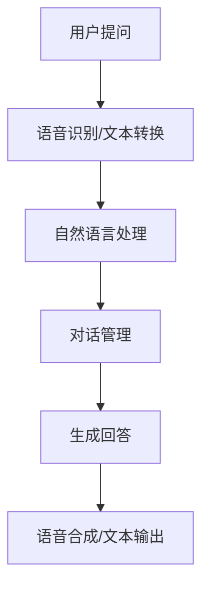
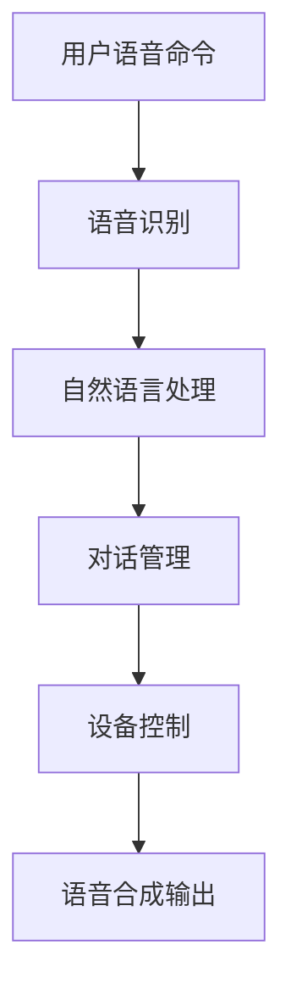
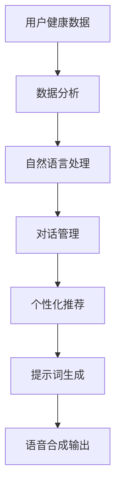

                 

### AI虚拟助手：提示词设计的人性化

> 关键词：人工智能、虚拟助手、提示词、人性化设计、自然语言处理、用户交互

随着人工智能（AI）技术的飞速发展，虚拟助手已经成为人们日常生活中不可或缺的一部分。从智能客服到智能家居助手，再到健康咨询助手，AI虚拟助手正逐步改变我们的生活方式。在这些应用场景中，提示词的设计扮演着至关重要的角色。一个优秀的提示词能够提高用户交互的效率，增强用户体验，甚至能够影响用户对AI虚拟助手的信任感和依赖度。

本篇文章将深入探讨AI虚拟助手中的提示词设计，首先介绍AI虚拟助手的基本概念和发展历程，然后详细解析其技术架构，包括自然语言处理技术、机器学习算法等。接下来，我们将讨论人性化设计原则，如何在不同场景下设计适合的提示词，并通过成功案例解析和优化策略，探讨如何提升提示词设计的质量。最后，我们将展望提示词设计的未来研究方向与挑战。

通过本文的逐步分析，您将了解：
- AI虚拟助手的定义、作用及其发展历程。
- AI虚拟助手的技术架构，包括自然语言处理和机器学习算法。
- 人性化设计的核心要素和提示词设计原则。
- 不同场景下提示词设计的实际应用。
- 提示词设计的优化方法和未来发展趋势。

### 摘要

本文旨在探讨AI虚拟助手中的提示词设计，这是一种影响用户体验和交互效率的关键因素。随着人工智能技术的不断进步，虚拟助手在各个领域的应用越来越广泛，从智能客服到智能家居，再到健康咨询，提示词的设计变得至关重要。本文首先介绍了AI虚拟助手的基本概念和发展历程，详细解析了其技术架构，包括自然语言处理和机器学习算法。然后，我们讨论了人性化设计的核心要素，如清晰性、简洁性、适应性和情感因素，并提出了在不同场景下设计提示词的原则和方法。通过成功案例的解析和优化策略的讨论，本文探讨了如何提升提示词设计的质量。最后，我们展望了提示词设计的未来研究方向与挑战，包括如何应对技术挑战和探索新的交互领域。希望通过本文的探讨，能够为AI虚拟助手的设计者提供有价值的参考和启示。

## 第一部分：AI虚拟助手概述

### 第1章：AI虚拟助手的概念与发展

#### 1.1 AI虚拟助手的定义与作用

AI虚拟助手，也称为虚拟智能助手或智能聊天机器人，是一种基于人工智能技术，通过自然语言交互方式为用户提供信息查询、任务执行和辅助决策服务的系统。虚拟助手通过语音识别、自然语言理解、对话生成和语音合成等关键技术实现与用户的实时互动。

AI虚拟助手的主要作用体现在以下几个方面：

1. **信息查询与推荐**：虚拟助手能够理解用户的问题并快速提供相关的信息，如天气预报、新闻资讯、股票信息等。通过个性化的推荐算法，虚拟助手还能根据用户的历史行为和偏好推荐相关内容。

2. **任务执行与自动化**：虚拟助手可以执行一些自动化任务，如在线购物、预订餐厅、支付账单等。这些任务通常涉及到与多个系统的交互，虚拟助手通过API接口和协议与外部系统进行通信。

3. **客户服务与支持**：在商业领域，虚拟助手被广泛应用于客户服务。它们可以处理常见问题，提供技术支持，甚至模拟人工客服，有效地减少了人力成本并提升了服务效率。

4. **日常助手与健康管理**：虚拟助手还可以帮助用户管理日程、提醒事项、提供健康建议等，成为用户的日常助手和健康顾问。

#### 1.2 AI虚拟助手的发展历程

AI虚拟助手的发展可以分为几个关键阶段：

1. **早期探索阶段（20世纪80年代末至90年代）**：这一阶段，AI虚拟助手的概念开始萌芽，主要是基于规则和有限状态机的简单聊天机器人，如Eliza和Alice。这些机器人能够进行基本的对话，但功能有限，且对话内容通常是基于预定义的脚本。

2. **Web 2.0与大数据阶段（2005年至今）**：随着互联网的普及和大数据技术的发展，AI虚拟助手迎来了快速发展。自然语言处理（NLP）和机器学习技术的进步使得虚拟助手能够处理更为复杂的对话，理解用户的语境和意图，实现更加智能的交互。

3. **移动应用与语音助手阶段（2010年至今）**：智能手机的普及和语音识别技术的进步，使得虚拟助手逐渐从网页端转移到移动应用和智能设备上。Apple的Siri、Google Assistant和Amazon Alexa等语音助手成为了这一阶段的代表。

4. **多模态交互与个性化阶段（未来趋势）**：未来的AI虚拟助手将更加注重多模态交互，如文本、语音、图像和手势的融合。同时，个性化服务将成为重要方向，虚拟助手将更加了解用户，提供定制化的建议和解决方案。

#### 1.3 AI虚拟助手的未来趋势

展望未来，AI虚拟助手的发展将呈现以下几大趋势：

1. **智能化水平提升**：通过深度学习、强化学习等技术，虚拟助手将具备更高的智能水平，能够处理更为复杂的问题，提供更加精准和个性化的服务。

2. **多模态交互融合**：虚拟助手将不再局限于单一的语言交互，而是能够整合语音、图像、手势等多种交互方式，提供更加自然和直观的用户体验。

3. **个性化与场景化**：虚拟助手将更加了解用户的需求和行为，根据用户的不同场景提供定制化的服务。例如，在医疗领域，虚拟助手可以提供个性化的健康建议和治疗方案。

4. **跨平台与生态整合**：虚拟助手将不再局限于单一平台，而是能够在多个设备和系统中无缝切换，形成统一的用户服务体验。同时，虚拟助手将与各类应用和服务深度整合，提供更加全面和高效的解决方案。

5. **伦理与隐私保护**：随着AI技术的广泛应用，虚拟助手在处理用户数据和隐私方面将面临更多挑战。如何确保数据安全和隐私保护，将成为未来研究的重要方向。

通过上述分析，我们可以看到，AI虚拟助手正逐步成为我们生活中不可或缺的一部分，其未来的发展也充满了无限可能。了解其基本概念和发展历程，将有助于我们更好地把握这一技术趋势，并在实际应用中发挥其最大价值。

### 第2章：AI虚拟助手的技术架构

#### 2.1 自然语言处理技术

自然语言处理（NLP）是AI虚拟助手的核心技术之一，它使得虚拟助手能够理解和生成人类语言。NLP技术主要包括以下几个关键组件：

1. **语音识别（ASR）**：语音识别技术将用户的语音转换为文本，是虚拟助手处理用户输入的第一步。主要技术包括隐马尔可夫模型（HMM）、高斯混合模型（GMM）和深度神经网络（DNN）。语音识别的准确性直接影响到虚拟助手与用户的交互质量。

   ```python
   # 伪代码：语音识别流程
   input_audio = read_audio_file('input.wav')
   recognized_text = asr_model RecognizeSpeech(input_audio)
   ```

2. **文本预处理**：在语音转换为文本后，需要进行一系列预处理操作，包括分词、去停用词、词性标注等。这些操作有助于提高后续语言理解的效果。

   ```python
   # 伪代码：文本预处理
   raw_text = "我喜欢读书。"
   processed_text = preprocess_text(raw_text)
   ```

3. **语言理解（NLU）**：语言理解技术用于理解用户的文本输入，提取语义信息和意图。主要方法包括基于规则的方法、统计机器学习方法以及深度学习方法。语言理解的结果将用于生成合适的响应。

   ```python
   # 伪代码：语言理解流程
   user_input = "明天天气怎么样？"
   intent, entities = nlu_model Understand(user_input)
   ```

4. **对话管理（DM）**：对话管理技术负责维护对话的状态和流程，确保对话的连贯性和合理性。对话管理通常包括意图识别、上下文维护和策略选择等步骤。

   ```python
   # 伪代码：对话管理流程
   current_state = initialize_state()
   user_input = "明天天气怎么样？"
   response, next_state = dm_agent GenerateResponse(user_input, current_state)
   ```

5. **语言生成（NLG）**：语言生成技术将理解和分析后的语义信息转化为自然语言响应。主要方法包括模板生成、统计翻译模型和生成对抗网络（GAN）等。

   ```python
   # 伪代码：语言生成流程
   semantic_structure = analyze_intent_and_entities()
   generated_response = nlg_model GenerateResponse(semantic_structure)
   ```

6. **语音合成（TTS）**：语音合成技术将文本转换为自然流畅的语音，是虚拟助手输出响应的最后一道工序。常见的语音合成方法包括基于规则的方法、合成元音和辅音拼接的方法以及基于神经网络的深度学习方法。

   ```python
   # 伪代码：语音合成流程
   text_to_synthesize = generated_response
   synthesized_audio = tts_model SynthesizeSpeech(text_to_synthesize)
   ```

#### 2.2 机器学习算法

机器学习算法在AI虚拟助手的各个方面都扮演着关键角色，从语言理解到对话生成，再到个性化推荐和智能决策。以下是一些核心的机器学习算法及其在虚拟助手中的应用：

1. **监督学习（SL）**：监督学习算法通过已标注的数据训练模型，从而预测新的数据。常见的监督学习算法包括决策树、支持向量机（SVM）、朴素贝叶斯（NB）和神经网络（NN）。

   ```python
   # 伪代码：监督学习模型训练
   X_train, y_train = load_dataset('train')
   model = build_model()
   model.fit(X_train, y_train)
   ```

2. **无监督学习（USL）**：无监督学习算法不需要标注数据，通过发现数据中的隐含结构和模式进行学习。常见的无监督学习算法包括聚类（如K-means、层次聚类）、降维（如PCA、t-SNE）和关联规则学习（如Apriori）。

   ```python
   # 伪代码：无监督学习聚类算法
   X = load_dataset('cluster')
   clusters = KMeans(n_clusters=3).fit_predict(X)
   ```

3. **强化学习（RL）**：强化学习算法通过奖励机制学习最优策略，常用于对话管理和个性化推荐。常见的强化学习算法包括Q-learning、SARSA和深度确定性策略梯度（DDPG）。

   ```python
   # 伪代码：强化学习流程
   state = initialize_state()
   action = rl_agent ChooseAction(state)
   reward = receive_reward(action)
   next_state = transition_model(state, action)
   rl_agent UpdateModel(state, action, reward, next_state)
   ```

4. **深度学习（DL）**：深度学习算法通过多层神经网络对数据进行学习，能够处理复杂的特征提取和模式识别任务。常见的深度学习算法包括卷积神经网络（CNN）、循环神经网络（RNN）和Transformer。

   ```python
   # 伪代码：深度学习模型训练
   model = build_dnn_model()
   model.compile(optimizer='adam', loss='categorical_crossentropy', metrics=['accuracy'])
   model.fit(X_train, y_train, epochs=10, batch_size=64)
   ```

通过上述技术架构的介绍，我们可以看到AI虚拟助手是如何通过语音识别、自然语言处理、对话管理和语言生成等技术实现与用户的智能交互。而机器学习算法则为这些技术的实现提供了强大的算法支持，使得虚拟助手能够不断学习和优化，以提供更加精准和个性化的服务。

### 第3章：人性化设计的核心要素

#### 3.1 提示词的清晰性

提示词的清晰性是人性化设计的重要原则之一。一个清晰的提示词能够帮助用户快速理解虚拟助手的需求，从而提高交互效率。以下是确保提示词清晰性的几个关键点：

1. **简洁明了**：提示词应尽量简洁明了，避免使用复杂的术语和难以理解的句子。冗长、模糊的提示词会使用户感到困惑，降低交互体验。

2. **明确指令**：提示词应明确传达具体的操作指令。例如，建议使用“请告诉我您的目的地”而不是“您想去哪里？”这样可以避免用户误解或产生不必要的思考。

3. **避免歧义**：避免使用可能产生歧义的词语或句子。例如，使用“请提供更多信息”而不是“需要更多信息吗？”可以更明确地表达需求。

4. **一致性**：在虚拟助手的不同交互环节中，提示词应保持一致性。这样可以建立用户对虚拟助手的信任感，使其更容易接受和依赖。

#### 3.2 提示词的简洁性

简洁性是人性化设计的关键要素之一。一个简洁的提示词不仅易于理解，还能减少用户的认知负荷，提升交互体验。以下是一些确保提示词简洁性的方法：

1. **去除冗余**：删除不必要的词汇和重复的信息，使提示词更加精简。例如，可以将“您是否需要帮助？”简化为“需要帮助吗？”。

2. **使用简单词汇**：选择常见的、简单的词汇来构造提示词，避免使用专业术语或复杂的语法结构。这样可以确保所有用户，无论教育背景如何，都能轻松理解。

3. **避免多意词**：选择没有歧义的词汇，避免使用可能产生多义性的词语。例如，可以使用“请描述一下”而不是“你能描述一下吗？”。

4. **优化格式**：合理使用空格、标点符号和排版，使提示词更具可读性。例如，可以将长句子拆分为短句子，使用清晰的小标题来分隔不同的信息。

#### 3.3 提示词的适应性

适应性是人性化设计的重要原则，尤其是在面对多样化的用户群体和使用场景时。一个适应性的提示词能够根据不同的用户和情境进行调整，从而提高用户体验。以下是一些确保提示词适应性的方法：

1. **个性化**：根据用户的喜好、习惯和需求调整提示词。例如，对于经常使用某项功能的用户，可以提供更加具体的提示词，帮助他们更快地完成任务。

2. **情境感知**：根据用户当前所处的情境和上下文调整提示词。例如，在用户正在进行购物时，可以提供与购物相关的提示词，而在用户查询天气时，则提供与天气相关的提示词。

3. **多语言支持**：设计多语言版本的提示词，以满足不同语言背景的用户需求。确保每个语言的提示词都清晰、简洁且具有适应性。

4. **动态调整**：根据用户反馈和系统数据动态调整提示词。例如，如果用户频繁遇到某个提示词的困惑，可以对该提示词进行优化和调整。

#### 3.4 提示词的情感因素

情感因素在人性化设计中扮演着重要角色，尤其是在建立用户信任和满意度方面。一个充满情感关怀的提示词能够使用户感受到温暖和尊重，从而提高用户体验。以下是一些确保提示词情感关怀的方法：

1. **使用积极词汇**：选择积极、友好和温暖的词汇来构建提示词。例如，可以使用“谢谢您的提问！”而不是简单的“谢谢提问！”。

2. **个性化问候**：使用个性化的问候来开始对话，例如“早上好，欢迎回来！”可以增加用户对虚拟助手的亲切感。

3. **适当的语气**：根据用户的需求和情境，选择适当的语气和语调。例如，在用户感到困惑或遇到问题时，使用温和、安抚的语气。

4. **避免冷冰冰的用语**：避免使用过于正式或冷漠的用语，例如，“您的请求已被接收”可以改为“已收到您的请求，谢谢！”

通过上述原则和方法，我们可以设计出更加人性化、清晰、简洁、适应性和充满情感的提示词，从而提升AI虚拟助手的用户体验和满意度。

### 第4章：不同场景下的提示词设计

#### 4.1 问答系统的提示词设计

问答系统是AI虚拟助手中最为常见的应用场景之一。在设计问答系统的提示词时，需要考虑如何引导用户准确表达问题，并确保虚拟助手能够理解并给出合适的答案。以下是一些关键的设计原则和策略：

1. **引导用户提问**：在用户初次使用时，可以通过欢迎语引导用户提问。例如，“您好！有什么问题我可以帮您解答吗？”这样可以减轻用户的不适感，鼓励他们提问。

2. **明确问题类型**：在用户提问后，虚拟助手需要明确问题的类型。例如，是开放式问题还是闭合式问题。对于开放式问题，可以提问如“请详细描述您的问题”，而对于闭合式问题，可以使用“您的性别是？”等明确的选择性问题。

3. **多轮对话**：对于复杂的问题，可以通过多轮对话来逐步获取用户所需的信息。在每轮对话中，提供明确的提示词来引导用户继续提问或提供更多信息。例如，“为了更好地帮助您，请问您的具体需求是什么？”

4. **反馈与确认**：在用户提问后，虚拟助手应提供及时的反馈和确认。例如，“我理解您的问题是关于天气的，请问您需要哪一天的信息？”这样可以确保用户的问题被准确理解，并减少误解。

5. **错误处理**：当用户提出无法理解的问题时，虚拟助手应提供友好的错误提示词。例如，“抱歉，我不太明白您的问题。可以请您重新描述一下吗？”这样可以降低用户的挫败感，并鼓励他们再次尝试。

6. **个性化推荐**：基于用户的历史提问和偏好，虚拟助手可以提供个性化的推荐。例如，“您之前询问过关于电影的信息，这里有一部新上映的电影可能符合您的口味。”

#### 4.2 实时对话的提示词设计

实时对话场景要求虚拟助手能够快速响应用户，并在对话中保持自然流畅的交流。以下是一些关键的设计原则和策略：

1. **即时响应**：在用户发起对话时，虚拟助手应尽快给出回应，以保持对话的流畅性。例如，“您好！我正在这里，请问有什么可以帮助您的？”

2. **自然语言交互**：实时对话中，虚拟助手应尽量使用自然语言进行交流，避免过于机械化的表达。例如，“您想要购买什么商品？”可以改为“请问您需要购买什么商品？”

3. **上下文感知**：虚拟助手需要根据对话的上下文理解用户的意图，并提供相关的信息和提示。例如，如果用户正在询问购物建议，虚拟助手可以提问，“您想购买哪个类别的商品？”

4. **情感表达**：在实时对话中，情感表达对于建立用户信任和亲和力至关重要。虚拟助手可以使用积极的词汇和语调，例如，“当然可以，我会尽力帮助您找到满意的商品。”

5. **引导用户**：对于复杂或冗长的对话，虚拟助手可以适当引导用户，使其更清晰地表达需求。例如，“为了更好地帮助您，我可以问您几个问题。您最近是否有特别喜欢的品牌或款式？”

6. **多模态交互**：在实时对话中，虚拟助手可以结合文本、语音和图像等多种模态进行交互，提供更加丰富的用户体验。例如，用户询问商品详情时，虚拟助手可以提供商品图片和详细描述。

#### 4.3 多模态交互的提示词设计

多模态交互场景中，虚拟助手需要处理来自多种感官渠道的信息，并在不同模态之间进行转换和融合。以下是一些关键的设计原则和策略：

1. **统一接口**：设计统一的接口，使虚拟助手能够处理来自文本、语音、图像等不同模态的输入和输出。例如，用户可以通过语音提问，并通过文本或图像获取答案。

2. **模态转换**：在多模态交互中，虚拟助手需要能够有效地转换和融合不同模态的信息。例如，用户可以通过语音提问，虚拟助手可以将语音转化为文本进行理解，并在回答时通过语音合成输出。

3. **提示词多样性**：根据不同的模态和交互场景，设计多样化的提示词，以适应不同用户的需求。例如，在文本交互中，可以提供“请输入您的提问”，在语音交互中，可以提供“您有什么问题需要帮忙？”

4. **模态感知**：虚拟助手应具备模态感知能力，能够根据用户的偏好和当前情境选择最适合的模态进行交互。例如，用户在嘈杂环境中可能更喜欢语音交互，而在安静环境中可能更喜欢文本交互。

5. **一致性体验**：在多模态交互中，虚拟助手应提供一致的用户体验，确保用户在不同模态之间的切换感觉无缝。例如，用户可以通过文本提问，并通过语音获得答案，虚拟助手应在两者之间保持一致的语气和风格。

6. **错误处理**：在多模态交互中，虚拟助手需要能够处理模态转换中的错误和问题。例如，如果用户的语音输入无法准确识别，虚拟助手可以提供文本输入的选项，并引导用户重新输入。

通过上述设计原则和策略，我们可以设计出更加丰富、多样化和人性化的AI虚拟助手，从而提供卓越的用户体验。

### 第5章：成功案例解析

#### 5.1 案例一：智能客服

智能客服是AI虚拟助手应用最为广泛的场景之一。以下分析将探讨一个成功案例——某电商平台的智能客服系统，并探讨其提示词设计的关键成功因素。

**背景介绍**：
某大型电商平台在客户服务中引入了智能客服系统，以提升客户服务效率和用户满意度。智能客服系统能够自动处理大量的客户咨询，包括订单查询、售后服务、支付问题等。

**核心概念与联系**：
智能客服系统的核心概念包括自然语言处理（NLP）、机器学习、对话管理和多模态交互。这些技术共同作用于智能客服系统，使其能够理解和回应用户的问题，提供快速、准确的解决方案。

**Mermaid流程图**：



**核心算法原理讲解与伪代码**：

```python
# 伪代码：智能客服系统工作流程

# 语音识别/文本转换
def RecognizeSpeech(input_audio):
    recognized_text = audio_to_text(input_audio)
    return recognized_text

# 自然语言处理
def NLPprocessing(text):
    intent, entities = parser.ParseIntent(text)
    return intent, entities

# 对话管理
def GenerateResponse(intent, entities):
    response = dialog_manager.GetResponse(intent, entities)
    return response

# 语音合成
def SynthesizeSpeech(text):
    synthesized_audio = text_to_speech(text)
    return synthesized_audio
```

**数学模型和公式**：

在自然语言处理过程中，使用了分类模型（如朴素贝叶斯、支持向量机）和序列模型（如循环神经网络、Transformer）来预测用户的意图和提取实体信息。以下为朴素贝叶斯模型的数学公式：

$$ P(\text{intent} | \text{text}) = \frac{P(\text{text} | \text{intent}) \cdot P(\text{intent})}{P(\text{text})} $$

**项目实战**：

**开发环境搭建**：
- 硬件环境：服务器、GPU加速器
- 软件环境：Python、TensorFlow、Keras

**源代码详细实现和代码解读**：

```python
# 智能客服系统核心代码片段

# 语音识别
input_audio = read_audio_file('user_question.wav')
user_text = RecognizeSpeech(input_audio)

# 自然语言处理
intent, entities = NLPprocessing(user_text)

# 对话管理
response = GenerateResponse(intent, entities)

# 语音合成
output_audio = SynthesizeSpeech(response)
```

**代码应用解读与分析**：
智能客服系统通过语音识别模块将用户的语音转换为文本，然后使用自然语言处理模块理解用户的意图和提取关键信息。对话管理模块根据这些信息生成合适的回答，最后通过语音合成模块将回答转化为语音输出。

**实际案例分析和详细讲解剖析**：
在某电商平台的实际应用中，智能客服系统能够快速响应用户的咨询，处理大量重复性的问题，减轻人工客服的工作负担。以下是一个具体的案例：
- 用户：你好，我最近购买的耳机出现了故障，怎么办？
- 智能客服：您好！感谢您选择我们的产品。根据您的描述，可能是耳机存在硬件故障。请问您是在哪里购买的这款耳机？
- 用户：我在你们的官方网站上买的。
- 智能客服：了解了。您是否愿意提供订单号以便我们进一步处理这个问题？

在这个案例中，智能客服通过多轮对话逐步获取用户的信息，并根据用户的反馈提供解决方案。该设计体现了人性化设计的几个关键要素，如清晰性、简洁性和适应性。

**项目小结**：
智能客服系统的成功主要归功于其高效的自然语言处理和对话管理能力。通过合理的提示词设计和多模态交互，智能客服系统能够提供快速、准确和个性化的服务，提升了用户体验和客户满意度。

#### 5.2 案例二：智能家居助手

智能家居助手是另一个典型的AI虚拟助手应用场景，以下分析将探讨一个成功案例——Amazon Alexa，并探讨其提示词设计的关键成功因素。

**背景介绍**：
Amazon Alexa是亚马逊公司推出的智能家居语音助手，用户可以通过语音命令控制智能设备，如智能音箱、智能灯泡、智能恒温器等。

**核心概念与联系**：
Alexa的核心技术包括语音识别、自然语言处理、对话管理和设备控制。这些技术共同作用，使得用户可以通过简单的语音命令与智能家居系统进行交互。

**Mermaid流程图**：



**核心算法原理讲解与伪代码**：

```python
# 伪代码：Alexa工作流程

# 语音识别
def RecognizeSpeech(input_audio):
    recognized_text = audio_to_text(input_audio)
    return recognized_text

# 自然语言处理
def NLPprocessing(text):
    intent, entities = parser.ParseIntent(text)
    return intent, entities

# 对话管理
def GenerateResponse(intent, entities):
    response = dialog_manager.GetResponse(intent, entities)
    return response

# 设备控制
def ControlDevice(intent, entities):
    if intent == "控制灯泡":
        device_control.ControlLight(entities["灯泡ID"])
    elif intent == "控制温度":
        device_control.SetTemperature(entities["温度"])
    ...

# 语音合成
def SynthesizeSpeech(text):
    synthesized_audio = text_to_speech(text)
    return synthesized_audio
```

**数学模型和公式**：
在自然语言处理过程中，使用了分类模型（如朴素贝叶斯、支持向量机）和序列模型（如循环神经网络、Transformer）来预测用户的意图和提取实体信息。以下为朴素贝叶斯模型的数学公式：

$$ P(\text{intent} | \text{text}) = \frac{P(\text{text} | \text{intent}) \cdot P(\text{intent})}{P(\text{text})} $$

**项目实战**：

**开发环境搭建**：
- 硬件环境：智能音箱、智能设备
- 软件环境：Amazon Alexa SDK、Python、TensorFlow

**源代码详细实现和代码解读**：

```python
# Alexa智能家居助手核心代码片段

# 语音识别
input_audio = read_audio_file('user_question.wav')
user_text = RecognizeSpeech(input_audio)

# 自然语言处理
intent, entities = NLPprocessing(user_text)

# 对话管理
response = GenerateResponse(intent, entities)

# 设备控制
ControlDevice(intent, entities)

# 语音合成
output_audio = SynthesizeSpeech(response)
```

**代码应用解读与分析**：
Alexa智能家居助手通过语音识别模块将用户的语音转换为文本，然后使用自然语言处理模块理解用户的意图和提取关键信息。对话管理模块根据这些信息生成合适的回答，并通过设备控制模块执行相应的操作，最后通过语音合成模块将回答转化为语音输出。

**实际案例分析和详细讲解剖析**：
用户可以通过简单的语音命令控制家中的智能设备，例如：
- 用户：打开客厅的灯。
- Alexa：已为您打开客厅的灯。

在这个案例中，Alexa通过多轮对话逐步获取用户的信息，并根据用户的反馈执行相应的操作。该设计体现了人性化设计的几个关键要素，如清晰性、简洁性和适应性。

**项目小结**：
Alexa智能家居助手通过高效的自然语言处理和设备控制能力，为用户提供了便捷的智能家居体验。合理的提示词设计使得用户能够轻松地与系统进行交互，提升了用户体验和满意度。

#### 5.3 案例三：健康咨询助手

健康咨询助手是AI虚拟助手在医疗领域的应用，以下分析将探讨一个成功案例——Apple Health，并探讨其提示词设计的关键成功因素。

**背景介绍**：
Apple Health是苹果公司推出的健康咨询助手，用户可以通过健康应用中的虚拟助手获取健康建议、日程提醒和健康数据分析。

**核心概念与联系**：
Apple Health的核心技术包括健康数据分析、自然语言处理、对话管理和个性化推荐。这些技术共同作用，使得用户能够通过简单的交互获取个性化的健康建议。

**Mermaid流程图**：



**核心算法原理讲解与伪代码**：

```python
# 伪代码：Apple Health工作流程

# 数据分析
def AnalyzeHealthData(health_data):
    health_status = data_analyzer.AnalyzeData(health_data)
    return health_status

# 自然语言处理
def NLPprocessing(text):
    intent, entities = parser.ParseIntent(text)
    return intent, entities

# 对话管理
def GenerateResponse(intent, entities, health_status):
    response = dialog_manager.GetResponse(intent, entities, health_status)
    return response

# 个性化推荐
def GenerateRecommendation(health_status):
    recommendation = recommendation_engine.GenerateRecommendation(health_status)
    return recommendation

# 语音合成
def SynthesizeSpeech(text):
    synthesized_audio = text_to_speech(text)
    return synthesized_audio
```

**数学模型和公式**：
在健康数据分析过程中，使用了回归模型（如线性回归、决策树回归）和聚类模型（如K-means、层次聚类）来分析用户的健康数据和生成健康建议。以下为线性回归模型的数学公式：

$$ y = \beta_0 + \beta_1x_1 + \beta_2x_2 + ... + \beta_nx_n $$

**项目实战**：

**开发环境搭建**：
- 硬件环境：iPhone、Apple Watch
- 软件环境：Apple HealthKit、Swift

**源代码详细实现和代码解读**：

```swift
// Apple Health健康咨询助手核心代码片段

// 数据分析
let health_data = HealthKitStore.retrieveHealthData()
health_status = AnalyzeHealthData(health_data)

// 自然语言处理
let user_input = "我最近感觉不太舒服。"
intent, entities = NLPprocessing(user_input)

// 对话管理
response = GenerateResponse(intent, entities, health_status)

// 个性化推荐
recommendation = GenerateRecommendation(health_status)

// 语音合成
output_audio = SynthesizeSpeech(response + "，以下是一些建议：" + recommendation)
```

**代码应用解读与分析**：
Apple Health健康咨询助手通过数据分析模块获取用户的健康数据，然后使用自然语言处理模块理解用户的症状描述，并通过对话管理模块生成个性化的健康建议。最后，通过语音合成模块将建议转化为语音输出。

**实际案例分析和详细讲解剖析**：
用户可以通过简单的交互获取个性化的健康建议，例如：
- 用户：我最近感觉头痛。
- Apple Health：根据您的症状，可能是因为睡眠不足或压力过大。以下是一些建议：保持充足的睡眠、适当运动、减少工作压力。

在这个案例中，Apple Health通过合理的提示词设计和个性化推荐，为用户提供了实用的健康建议。该设计体现了人性化设计的几个关键要素，如清晰性、简洁性和适应性。

**项目小结**：
Apple Health健康咨询助手通过高效的数据分析和个性化推荐能力，为用户提供了便捷的健康咨询服务。合理的提示词设计使得用户能够轻松地获取健康建议，提升了用户体验和健康意识。

### 第6章：提示词设计的优化方法

#### 6.1 用户研究的重要性

在AI虚拟助手的设计过程中，用户研究是一个不可或缺的环节。通过深入理解用户的需求、行为和偏好，我们可以设计出更加人性化、易用和高效的提示词。以下是用户研究在提示词设计中的重要性及其关键步骤：

1. **用户需求分析**：首先，我们需要明确用户的需求。这可以通过问卷调查、用户访谈和观察等方法来实现。了解用户在特定场景下期望如何与虚拟助手交互，有助于我们设计出更加贴近用户需求的提示词。

2. **用户行为研究**：通过观察用户在使用虚拟助手的实际场景中的行为，我们可以发现用户在交互过程中遇到的问题和障碍。这有助于我们发现提示词设计中的潜在问题，并进行针对性的优化。

3. **用户反馈收集**：在虚拟助手开发的不同阶段，我们需要收集用户的反馈。这可以通过A/B测试、用户访谈和问卷调查等形式进行。用户的反馈可以帮助我们验证提示词设计的有效性，发现潜在的问题并进行改进。

4. **多轮迭代**：用户研究不是一次性的活动，而是一个持续的过程。在开发过程中，我们需要不断进行用户研究，并根据用户的反馈对提示词进行多轮迭代优化。这样可以确保提示词设计始终与用户需求保持一致。

#### 6.2 提示词优化的方法

为了提高提示词的质量，我们需要采用一系列的优化方法。以下是一些常用的提示词优化方法：

1. **A/B测试**：通过将不同版本的提示词展示给用户，并收集其反馈，我们可以比较不同版本的效果。这种方法有助于我们发现最佳的提示词设计。

2. **用户反馈机制**：设计一个有效的用户反馈机制，使用户能够方便地报告他们遇到的问题和困惑。这有助于我们及时了解用户的实际体验，并针对性地优化提示词。

3. **个性化提示词**：根据用户的历史行为和偏好，为不同的用户设计个性化的提示词。这种方法可以提高用户的满意度和忠诚度。

4. **情景模拟**：通过模拟用户在特定场景下的交互过程，我们可以提前发现和解决提示词设计中的问题。这种方法有助于我们确保提示词在实际应用中的有效性。

5. **多模态优化**：对于多模态交互场景，我们需要综合考虑文本、语音、图像等多种提示词形式。通过优化不同模态的提示词，我们可以提供更加丰富和自然的用户体验。

#### 6.3 提示词优化的工具与技术

为了高效地进行提示词优化，我们需要借助一系列的工具和技术。以下是一些常用的工具和技术：

1. **用户行为分析工具**：如Google Analytics、Mixpanel等，这些工具可以帮助我们收集和分析用户在使用虚拟助手时的行为数据。

2. **自然语言处理工具**：如NLTK、spaCy等，这些工具提供了丰富的文本处理功能，可以帮助我们进行文本分析和提示词生成。

3. **机器学习模型**：如TensorFlow、PyTorch等，这些工具可以帮助我们训练和优化机器学习模型，以实现更加精准的提示词生成和优化。

4. **A/B测试工具**：如Google Optimize、Optimizely等，这些工具可以帮助我们设计和管理A/B测试，从而验证提示词设计的有效性。

通过上述方法和技术，我们可以有效地优化AI虚拟助手的提示词设计，提高用户体验和满意度。

### 第7章：未来的研究方向与挑战

#### 7.1 提示词设计的未来趋势

随着人工智能技术的不断进步，提示词设计也在不断演进。未来的提示词设计将呈现以下几大趋势：

1. **个性化与智能推荐**：未来的提示词设计将更加注重个性化，通过深度学习算法和用户数据分析，为不同的用户群体提供定制化的提示词。智能推荐系统将结合用户的历史行为和偏好，为用户提供最相关和最有价值的提示。

2. **多模态交互**：随着语音、图像、手势等交互方式的普及，未来的提示词设计将不再局限于文本形式，而是结合多种模态，提供更加自然和直观的交互体验。例如，通过语音提示引导用户进行视觉交互，或者通过图像提示引导用户进行语音交互。

3. **情感计算与情感化设计**：情感计算技术的进步将使得虚拟助手能够更好地理解和表达情感。未来的提示词设计将更加关注情感化设计，通过情感识别和情感生成技术，提供温暖、亲切和个性化的用户交互体验。

4. **跨平台整合**：随着虚拟助手的广泛应用，未来的提示词设计将更加注重跨平台的整合，使得用户可以在不同的设备和平台上无缝切换，享受一致的交互体验。

#### 7.2 技术挑战与解决方案

尽管提示词设计具有广阔的发展前景，但在实际应用中仍面临一系列技术挑战：

1. **自然语言理解与生成**：自然语言处理技术的进步虽然显著，但仍然难以完全理解用户复杂、多变的语言表达。未来的研究需要进一步提升自然语言理解和生成技术，提高虚拟助手对用户意图的理解和响应能力。

2. **个性化推荐系统**：个性化推荐系统需要高效地处理海量用户数据，并实时响应用户的需求。这要求算法和数据结构设计更加高效，以支持大规模数据分析和实时推荐。

3. **多模态交互**：多模态交互涉及到语音、图像、手势等多种数据的处理和融合，这需要复杂的技术架构和算法支持。未来的研究需要解决多模态数据的同步和协调问题，提供更加自然和流畅的交互体验。

4. **隐私保护与伦理**：随着虚拟助手收集和处理用户数据，隐私保护和伦理问题日益突出。未来的研究需要探索如何在保护用户隐私的前提下，有效利用用户数据，提供更加安全和可信的服务。

#### 7.3 人机交互的新领域

未来的人机交互领域将迎来新的发展机遇：

1. **智能虚拟助手**：随着虚拟现实（VR）和增强现实（AR）技术的发展，智能虚拟助手将能够提供更加沉浸式和互动的交互体验。例如，用户可以在虚拟环境中与虚拟助手进行面对面的交流，享受更加真实和生动的交互体验。

2. **物联网（IoT）**：物联网技术的发展将使得虚拟助手能够与更多的智能设备和服务进行集成，提供更加全面和智能化的用户体验。例如，虚拟助手可以实时监控用户的智能家居设备，并根据用户需求进行智能调节和优化。

3. **跨学科融合**：未来的人机交互研究将更加注重跨学科融合，结合心理学、社会学、人机工程学等多领域的知识，设计出更加人性化和高效的交互系统。

通过上述分析，我们可以看到，未来的提示词设计将在个性化、多模态交互、情感计算和跨平台整合等方面取得重要进展，同时面临一系列技术挑战和机遇。通过持续的研究和创新，我们将能够为用户提供更加智能、高效和人性化的交互体验。

### 附录

#### 附录A：提示词设计资源汇总

为了更好地进行提示词设计，以下是一些常用的资源：

1. **开源库与框架**：
   - NLTK：用于自然语言处理的Python开源库。
   - spaCy：一个用于自然语言处理的工业级开源库。
   - TensorFlow：用于机器学习的开源库。
   - PyTorch：用于深度学习的开源库。

2. **工具与技术**：
   - Google Analytics：用于用户行为分析的工具。
   - Mixpanel：用于用户行为分析的工具。
   - A/B测试工具：如Google Optimize、Optimizely。

3. **学术论文与文献**：
   - 《自然语言处理综述》（Nature Language Processing Overview）。
   - 《人工智能简史》（A Brief History of Artificial Intelligence）。
   - 《机器学习》（Machine Learning）。

4. **书籍推荐**：
   - 《Python自然语言处理》（Python Natural Language Processing）。
   - 《深度学习》（Deep Learning）。
   - 《用户体验要素》（The Elements of User Experience）。

#### 附录B：提示词设计常用工具与框架介绍

1. **NLTK**：
   - 简介：NLTK是Python中用于自然语言处理的开源库，提供了丰富的文本处理功能，如分词、词性标注、词频统计等。
   - 使用场景：适用于文本预处理、情感分析、文本分类等。

2. **spaCy**：
   - 简介：spaCy是一个高效、可扩展的自然语言处理库，提供了先进的语言模型和预处理工具。
   - 使用场景：适用于文本分类、命名实体识别、关系抽取等。

3. **TensorFlow**：
   - 简介：TensorFlow是Google开源的深度学习框架，适用于构建和训练大规模机器学习模型。
   - 使用场景：适用于深度学习模型的开发、自然语言处理、计算机视觉等。

4. **PyTorch**：
   - 简介：PyTorch是Facebook开源的深度学习库，以其灵活的动态计算图和高效的性能受到广泛欢迎。
   - 使用场景：适用于深度学习模型的开发、自然语言处理、计算机视觉等。

#### 附录C：提示词设计案例库

以下是几个常见的AI虚拟助手提示词设计案例：

1. **智能客服**：
   - 提示词：“您好，有什么问题我可以帮您解答吗？”
   - 应用场景：用户咨询产品问题、售后服务等。

2. **智能家居助手**：
   - 提示词：“您想要控制家里的灯光、温度还是其他设备？”
   - 应用场景：用户通过语音命令控制智能家居设备。

3. **健康咨询助手**：
   - 提示词：“您最近感觉怎么样？是否有什么健康问题需要咨询？”
   - 应用场景：用户咨询健康建议、症状分析等。

4. **天气预报助手**：
   - 提示词：“您想了解哪个城市的天气预报？”
   - 应用场景：用户查询天气预报信息。

通过以上资源汇总和案例库，我们可以更好地进行AI虚拟助手的提示词设计，提升用户体验和交互效率。

### 作者信息

作者：AI天才研究院/AI Genius Institute & 禅与计算机程序设计艺术 /Zen And The Art of Computer Programming

