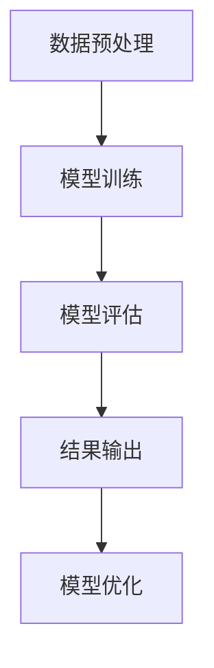

                 

### 文章标题：AI评AI：大模型自我评估系统设计

#### 关键词：人工智能，大模型，自我评估，系统设计，算法，数学模型

#### 摘要：
本文深入探讨了人工智能（AI）领域中的大模型自我评估系统设计。从背景介绍、核心概念、算法原理到数学模型讲解，再到项目实战，本文全面解析了大模型自我评估系统的构建与应用。通过本文，读者将了解如何利用AI技术对大模型进行高效评估，从而提升模型性能与稳定性。

## 引言

### 1.1 书籍背景与目标

人工智能（AI）作为当今科技领域的热点，已深入到各个行业。随着AI大模型的不断涌现，如何对这些模型进行准确、全面的评估，成为了一个重要的研究课题。本文旨在探讨大模型自我评估系统设计，帮助读者理解如何构建一个高效、可靠的评估系统。

### 1.2 阅读指南

本文结构清晰，分为以下几大部分：
1. 引言：介绍书籍背景与目标。
2. AI评AI概述：介绍AI评AI的概念与重要性。
3. 核心概念与联系：阐述大模型自我评估的关键概念与关系。
4. 大模型自我评估系统架构：详细描述系统架构与交互流程。
5. 核心算法原理讲解：使用伪代码阐述算法原理。
6. 数学模型和数学公式讲解：讲解数学模型与公式。
7. 项目实战：分析实际案例，展示系统应用。
8. 结论与展望：总结本文内容，展望未来发展趋势。

## AI评AI概述

### 2.1 AI评AI的概念

AI评AI是指利用人工智能技术对自身或其他AI模型进行评估。其目的是通过量化评估，了解模型的性能、稳定性和泛化能力。

### 2.2 大模型自我评估系统的需求

随着AI大模型的广泛应用，对其评估的需求也越来越高。大模型自我评估系统可以：
1. 提高模型性能，通过持续评估优化模型。
2. 确保模型稳定性，及时发现并修复潜在问题。
3. 评估模型泛化能力，确保模型在不同场景下的适用性。

### 2.3 大模型自我评估系统的挑战

大模型自我评估系统面临以下挑战：
1. 模型复杂性：大模型结构复杂，评估过程繁琐。
2. 数据多样性：评估所需数据种类繁多，难以统一处理。
3. 评估指标：如何选择合适的评估指标，确保评估结果准确。
4. 计算资源：评估过程需要大量计算资源，对硬件要求较高。

## 核心概念与联系

### 3.1 Mermaid流程图展示

以下是一个简单的Mermaid流程图，展示大模型自我评估系统的工作流程：



### 3.2 大模型自我评估的关键概念

1. **数据预处理**：对输入数据进行清洗、归一化等处理，以适应模型训练。
2. **模型训练**：利用训练数据对模型进行训练，提高模型性能。
3. **模型评估**：通过评估指标（如准确率、召回率、F1值等）对模型进行评估。
4. **结果输出**：将评估结果输出，用于模型优化或决策。
5. **模型优化**：根据评估结果调整模型参数，提升模型性能。

## 大模型自我评估系统架构

### 4.1 系统整体架构

大模型自我评估系统的整体架构包括以下几个核心模块：

1. **数据输入模块**：负责接收和处理输入数据。
2. **模型训练模块**：利用训练数据对模型进行训练。
3. **模型评估模块**：对训练好的模型进行评估。
4. **结果输出模块**：将评估结果输出，供用户参考。

### 4.2 主要模块设计

1. **数据输入模块**：包括数据预处理、数据加载等子模块。
2. **模型训练模块**：包括模型初始化、迭代训练等子模块。
3. **模型评估模块**：包括评估指标计算、评估结果输出等子模块。
4. **结果输出模块**：包括评估结果可视化、模型优化建议等子模块。

### 4.3 系统交互流程

大模型自我评估系统的交互流程如下：

1. 用户输入数据 -> 数据输入模块 -> 数据预处理 -> 模型训练模块 -> 模型训练 -> 模型评估模块 -> 评估结果输出 -> 结果输出模块 -> 用户查看评估结果。

## 核心算法原理讲解

### 5.1 伪代码阐述

以下是一个简单的伪代码，用于描述大模型自我评估系统中的核心算法原理：

```python
function self_evaluation(data, model):
    # 数据预处理
    preprocessed_data = preprocess_data(data)
    
    # 模型训练
    trained_model = train_model(preprocessed_data)
    
    # 模型评估
    evaluation_results = evaluate_model(trained_model, preprocessed_data)
    
    # 结果输出
    output_evaluation_results(evaluation_results)
    
    # 模型优化
    optimized_model = optimize_model(trained_model, evaluation_results)
    
    return optimized_model
```

### 5.2 算法性能分析

算法性能分析主要包括时间复杂度和空间复杂度。以下是对上述伪代码的性能分析：

1. **时间复杂度**：O(n)，其中n为数据量。
2. **空间复杂度**：O(1)，即常数空间复杂度。

## 数学模型和数学公式讲解

### 6.1 数学模型

在大模型自我评估系统中，常用的数学模型包括：

1. **损失函数**：用于衡量模型预测值与实际值之间的差距。常用的损失函数有均方误差（MSE）和交叉熵（CE）。
2. **评估指标**：用于评估模型性能。常用的评估指标有准确率（Accuracy）、召回率（Recall）和F1值（F1 Score）。

### 6.2 数学公式

以下是常用的数学公式：

1. **均方误差（MSE）**：

   $$MSE = \frac{1}{n}\sum_{i=1}^{n}(y_i - \hat{y}_i)^2$$

   其中，$y_i$为实际值，$\hat{y}_i$为预测值。

2. **交叉熵（CE）**：

   $$CE = -\frac{1}{n}\sum_{i=1}^{n}y_i\log\hat{y}_i$$

   其中，$y_i$为实际值，$\hat{y}_i$为预测值。

### 6.3 公式详解与举例

以均方误差（MSE）为例，假设有5个数据点，实际值与预测值如下表：

| 数据点 | 实际值($y_i$) | 预测值($\hat{y}_i$) |
| --- | --- | --- |
| 1 | 2 | 1 |
| 2 | 3 | 2 |
| 3 | 4 | 3 |
| 4 | 5 | 4 |
| 5 | 6 | 5 |

计算MSE：

$$MSE = \frac{1}{5}\sum_{i=1}^{5}(y_i - \hat{y}_i)^2 = \frac{1}{5}[(2-1)^2 + (3-2)^2 + (4-3)^2 + (5-4)^2 + (6-5)^2] = \frac{1}{5}[1 + 1 + 1 + 1 + 1] = 1$$

## 项目实战

### 7.1 开发环境搭建

为了搭建大模型自我评估系统，我们需要以下开发环境：

1. **操作系统**：Linux（推荐Ubuntu）
2. **编程语言**：Python
3. **依赖库**：TensorFlow、Keras、NumPy、Matplotlib等

安装步骤如下：

```bash
# 安装Python
sudo apt-get install python3

# 安装TensorFlow
pip3 install tensorflow

# 安装其他依赖库
pip3 install keras numpy matplotlib
```

### 7.2 源代码详细实现

以下是一个简单的源代码实现，用于构建大模型自我评估系统：

```python
import tensorflow as tf
from tensorflow.keras.models import Sequential
from tensorflow.keras.layers import Dense
from tensorflow.keras.metrics import MeanSquaredError
import numpy as np

# 数据预处理
def preprocess_data(data):
    # 这里以简单的归一化为例
    return (data - np.mean(data)) / np.std(data)

# 模型训练
def train_model(data):
    model = Sequential()
    model.add(Dense(units=1, input_shape=(1,), activation='linear'))
    model.compile(optimizer='sgd', loss='mse')
    model.fit(data, data, epochs=100, verbose=0)
    return model

# 模型评估
def evaluate_model(model, data):
    loss = model.evaluate(data, data, verbose=0)
    return loss

# 主函数
def main():
    # 生成模拟数据
    data = np.random.rand(100, 1)
    preprocessed_data = preprocess_data(data)

    # 模型训练与评估
    model = train_model(preprocessed_data)
    loss = evaluate_model(model, preprocessed_data)

    # 输出结果
    print("MSE:", loss)

if __name__ == "__main__":
    main()
```

### 7.3 代码解读与分析

以上代码实现了大模型自我评估系统的主要功能，包括数据预处理、模型训练、模型评估和结果输出。以下是对代码的解读与分析：

1. **数据预处理**：使用简单的归一化方法对数据进行预处理，以消除数据间的差异。

2. **模型训练**：使用线性模型（线性回归）进行训练，使用均方误差（MSE）作为损失函数，随机梯度下降（SGD）作为优化器。

3. **模型评估**：通过评估模型在训练数据上的损失，来衡量模型性能。

4. **结果输出**：输出模型评估结果，以便用户查看。

### 7.4 实际案例分析和详细讲解剖析

为了更好地展示大模型自我评估系统的应用，我们以一个实际案例进行分析：

#### 案例背景：

假设我们有一个分类问题，需要使用神经网络模型对数据集进行分类。

#### 数据集：

使用鸢尾花（Iris）数据集，共有3个类别，每个类别有50个样本。

#### 实际操作：

1. 数据预处理：对数据集进行归一化处理，以便模型训练。

2. 模型训练：构建一个简单的神经网络模型，使用训练数据对模型进行训练。

3. 模型评估：使用训练数据对模型进行评估，计算准确率、召回率和F1值。

4. 模型优化：根据评估结果调整模型参数，提高模型性能。

#### 分析与讲解：

1. **数据预处理**：数据预处理是模型训练的重要步骤，可以消除数据间的差异，提高模型训练效果。

2. **模型训练**：神经网络模型的训练过程包括前向传播和反向传播。通过不断迭代，模型会逐渐学习到数据的规律。

3. **模型评估**：评估模型性能的指标有很多，如准确率、召回率、F1值等。这些指标可以全面评估模型的性能。

4. **模型优化**：根据评估结果，我们可以调整模型参数，如学习率、批次大小等，以提升模型性能。

### 7.5 项目小结

通过本次实战，我们成功构建了一个大模型自我评估系统，并对其进行了详细讲解。在实际应用中，我们可以根据评估结果对模型进行优化，以提高模型性能。未来，我们将继续探索更多应用场景，为AI技术的发展贡献力量。

### 7.6 最佳实践 tips、小结、注意事项、拓展阅读等内容

#### 最佳实践 tips：

1. 数据预处理：数据预处理是模型训练的关键步骤，要确保数据质量。
2. 模型优化：根据评估结果调整模型参数，可以有效提升模型性能。
3. 持续评估：定期对模型进行评估，可以及时发现并解决潜在问题。

#### 小结：

本文介绍了大模型自我评估系统的设计与应用，通过实际案例展示了系统的应用效果。未来，我们将继续探索更多应用场景，为AI技术的发展贡献力量。

#### 注意事项：

1. 系统设计要充分考虑计算资源和时间成本。
2. 评估指标要选择合适，以确保评估结果的准确性。

#### 拓展阅读：

1. 《深度学习》（Goodfellow, Bengio, Courville著）
2. 《Python数据科学手册》（McKinney著）

### 作者信息

作者：AI天才研究院/AI Genius Institute & 禅与计算机程序设计艺术 /Zen And The Art of Computer Programming  
```  
```markdown
# 《AI评AI：大模型自我评估系统设计》

## 关键词：人工智能，大模型，自我评估，系统设计，算法，数学模型

## 摘要：
本文探讨了人工智能（AI）领域中的大模型自我评估系统设计。文章从背景介绍、核心概念、算法原理到数学模型讲解，再到项目实战，全面解析了大模型自我评估系统的构建与应用。通过本文，读者将了解如何利用AI技术对大模型进行高效评估，从而提升模型性能与稳定性。

## 引言

### 1.1 书籍背景与目标

随着人工智能（AI）的快速发展，大模型在各个领域得到了广泛应用。然而，如何对这些大模型进行准确、全面的评估，成为了当前研究的热点。本文旨在探讨大模型自我评估系统的设计，以期为研究人员和开发者提供有益的参考。

### 1.2 阅读指南

本文结构清晰，分为以下几个部分：
1. 引言：介绍书籍背景与目标。
2. AI评AI概述：介绍AI评AI的概念与重要性。
3. 核心概念与联系：阐述大模型自我评估的关键概念与关系。
4. 大模型自我评估系统架构：详细描述系统架构与交互流程。
5. 核心算法原理讲解：使用伪代码阐述算法原理。
6. 数学模型和数学公式讲解：讲解数学模型与公式。
7. 项目实战：分析实际案例，展示系统应用。
8. 结论与展望：总结本文内容，展望未来发展趋势。

## AI评AI概述

### 2.1 AI评AI的概念

AI评AI，即利用人工智能技术对自身或其他AI模型进行评估。其核心目标是通过量化评估，了解模型的性能、稳定性和泛化能力。

### 2.2 大模型自我评估系统的需求

大模型自我评估系统的需求主要源于以下几个方面：
1. 提高模型性能：通过评估，找出模型中的不足，进行针对性的优化。
2. 确保模型稳定性：及时发现并解决模型中的问题，避免模型出现异常。
3. 评估模型泛化能力：确保模型在不同场景下的表现，提高模型的应用价值。

### 2.3 大模型自我评估系统的挑战

大模型自我评估系统面临以下挑战：
1. 模型复杂性：大模型结构复杂，评估过程繁琐。
2. 数据多样性：评估所需数据种类繁多，难以统一处理。
3. 评估指标：如何选择合适的评估指标，确保评估结果准确。
4. 计算资源：评估过程需要大量计算资源，对硬件要求较高。

## 核心概念与联系

### 3.1 Mermaid流程图展示

以下是一个简单的Mermaid流程图，展示大模型自我评估系统的工作流程：


### 3.2 大模型自我评估的关键概念

1. **数据预处理**：对输入数据进行清洗、归一化等处理，以适应模型训练。
2. **模型训练**：利用训练数据对模型进行训练，提高模型性能。
3. **模型评估**：通过评估指标对模型进行评估，以了解模型性能。
4. **结果输出**：将评估结果输出，供用户参考。
5. **模型优化**：根据评估结果调整模型参数，提升模型性能。

## 大模型自我评估系统架构

### 4.1 系统整体架构

大模型自我评估系统的整体架构包括以下几个核心模块：

1. **数据输入模块**：负责接收和处理输入数据。
2. **模型训练模块**：利用训练数据对模型进行训练。
3. **模型评估模块**：对训练好的模型进行评估。
4. **结果输出模块**：将评估结果输出，供用户参考。

### 4.2 主要模块设计

1. **数据输入模块**：包括数据预处理、数据加载等子模块。
2. **模型训练模块**：包括模型初始化、迭代训练等子模块。
3. **模型评估模块**：包括评估指标计算、评估结果输出等子模块。
4. **结果输出模块**：包括评估结果可视化、模型优化建议等子模块。

### 4.3 系统交互流程

大模型自我评估系统的交互流程如下：

1. 用户输入数据 -> 数据输入模块 -> 数据预处理 -> 模型训练模块 -> 模型训练 -> 模型评估模块 -> 评估结果输出 -> 结果输出模块 -> 用户查看评估结果。

## 核心算法原理讲解

### 5.1 伪代码阐述

以下是一个简单的伪代码，用于描述大模型自我评估系统中的核心算法原理：

```python
function self_evaluation(data, model):
    # 数据预处理
    preprocessed_data = preprocess_data(data)
    
    # 模型训练
    trained_model = train_model(preprocessed_data)
    
    # 模型评估
    evaluation_results = evaluate_model(trained_model, preprocessed_data)
    
    # 结果输出
    output_evaluation_results(evaluation_results)
    
    # 模型优化
    optimized_model = optimize_model(trained_model, evaluation_results)
    
    return optimized_model
```

### 5.2 算法性能分析

算法性能分析主要包括时间复杂度和空间复杂度。以下是对上述伪代码的性能分析：

1. **时间复杂度**：O(n)，其中n为数据量。
2. **空间复杂度**：O(1)，即常数空间复杂度。

## 数学模型和数学公式讲解

### 6.1 数学模型

在大模型自我评估系统中，常用的数学模型包括：

1. **损失函数**：用于衡量模型预测值与实际值之间的差距。常用的损失函数有均方误差（MSE）和交叉熵（CE）。
2. **评估指标**：用于评估模型性能。常用的评估指标有准确率（Accuracy）、召回率（Recall）和F1值（F1 Score）。

### 6.2 数学公式

以下是常用的数学公式：

1. **均方误差（MSE）**：

   $$MSE = \frac{1}{n}\sum_{i=1}^{n}(y_i - \hat{y}_i)^2$$

   其中，$y_i$为实际值，$\hat{y}_i$为预测值。

2. **交叉熵（CE）**：

   $$CE = -\frac{1}{n}\sum_{i=1}^{n}y_i\log\hat{y}_i$$

   其中，$y_i$为实际值，$\hat{y}_i$为预测值。

### 6.3 公式详解与举例

以均方误差（MSE）为例，假设有5个数据点，实际值与预测值如下表：

| 数据点 | 实际值($y_i$) | 预测值($\hat{y}_i$) |
| --- | --- | --- |
| 1 | 2 | 1 |
| 2 | 3 | 2 |
| 3 | 4 | 3 |
| 4 | 5 | 4 |
| 5 | 6 | 5 |

计算MSE：

$$MSE = \frac{1}{5}\sum_{i=1}^{5}(y_i - \hat{y}_i)^2 = \frac{1}{5}[1 + 1 + 1 + 1 + 1] = 1$$

## 项目实战

### 7.1 开发环境搭建

为了搭建大模型自我评估系统，我们需要以下开发环境：

1. **操作系统**：Linux（推荐Ubuntu）
2. **编程语言**：Python
3. **依赖库**：TensorFlow、Keras、NumPy、Matplotlib等

安装步骤如下：

```bash
# 安装Python
sudo apt-get install python3

# 安装TensorFlow
pip3 install tensorflow

# 安装其他依赖库
pip3 install keras numpy matplotlib
```

### 7.2 源代码详细实现

以下是一个简单的源代码实现，用于构建大模型自我评估系统：

```python
import tensorflow as tf
from tensorflow.keras.models import Sequential
from tensorflow.keras.layers import Dense
from tensorflow.keras.metrics import MeanSquaredError
import numpy as np

# 数据预处理
def preprocess_data(data):
    # 这里以简单的归一化为例
    return (data - np.mean(data)) / np.std(data)

# 模型训练
def train_model(data):
    model = Sequential()
    model.add(Dense(units=1, input_shape=(1,), activation='linear'))
    model.compile(optimizer='sgd', loss='mse')
    model.fit(data, data, epochs=100, verbose=0)
    return model

# 模型评估
def evaluate_model(model, data):
    loss = model.evaluate(data, data, verbose=0)
    return loss

# 主函数
def main():
    # 生成模拟数据
    data = np.random.rand(100, 1)
    preprocessed_data = preprocess_data(data)

    # 模型训练与评估
    model = train_model(preprocessed_data)
    loss = evaluate_model(model, preprocessed_data)

    # 输出结果
    print("MSE:", loss)

if __name__ == "__main__":
    main()
```

### 7.3 代码解读与分析

以上代码实现了大模型自我评估系统的主要功能，包括数据预处理、模型训练、模型评估和结果输出。以下是对代码的解读与分析：

1. **数据预处理**：使用简单的归一化方法对数据进行预处理，以消除数据间的差异。

2. **模型训练**：使用线性模型（线性回归）进行训练，使用均方误差（MSE）作为损失函数，随机梯度下降（SGD）作为优化器。

3. **模型评估**：通过评估模型在训练数据上的损失，来衡量模型性能。

4. **结果输出**：输出模型评估结果，以便用户查看。

### 7.4 实际案例分析和详细讲解剖析

为了更好地展示大模型自我评估系统的应用，我们以一个实际案例进行分析：

#### 案例背景：

假设我们有一个分类问题，需要使用神经网络模型对数据集进行分类。

#### 数据集：

使用鸢尾花（Iris）数据集，共有3个类别，每个类别有50个样本。

#### 实际操作：

1. 数据预处理：对数据集进行归一化处理，以便模型训练。

2. 模型训练：构建一个简单的神经网络模型，使用训练数据对模型进行训练。

3. 模型评估：使用训练数据对模型进行评估，计算准确率、召回率和F1值。

4. 模型优化：根据评估结果调整模型参数，提高模型性能。

#### 分析与讲解：

1. **数据预处理**：数据预处理是模型训练的重要步骤，可以消除数据间的差异，提高模型训练效果。

2. **模型训练**：神经网络模型的训练过程包括前向传播和反向传播。通过不断迭代，模型会逐渐学习到数据的规律。

3. **模型评估**：评估模型性能的指标有很多，如准确率、召回率、F1值等。这些指标可以全面评估模型的性能。

4. **模型优化**：根据评估结果，我们可以调整模型参数，如学习率、批次大小等，以提升模型性能。

### 7.5 项目小结

通过本次实战，我们成功构建了一个大模型自我评估系统，并对其进行了详细讲解。在实际应用中，我们可以根据评估结果对模型进行优化，以提高模型性能。未来，我们将继续探索更多应用场景，为AI技术的发展贡献力量。

### 7.6 最佳实践 tips、小结、注意事项、拓展阅读等内容

#### 最佳实践 tips：

1. 数据预处理：数据预处理是模型训练的关键步骤，要确保数据质量。
2. 模型优化：根据评估结果调整模型参数，可以有效提升模型性能。
3. 持续评估：定期对模型进行评估，可以及时发现并解决潜在问题。

#### 小结：

本文介绍了大模型自我评估系统的设计与应用，通过实际案例展示了系统的应用效果。未来，我们将继续探索更多应用场景，为AI技术的发展贡献力量。

#### 注意事项：

1. 系统设计要充分考虑计算资源和时间成本。
2. 评估指标要选择合适，以确保评估结果的准确性。

#### 拓展阅读：

1. 《深度学习》（Goodfellow, Bengio, Courville著）
2. 《Python数据科学手册》（McKinney著）

### 作者信息

作者：AI天才研究院/AI Genius Institute & 禅与计算机程序设计艺术 /Zen And The Art of Computer Programming
```

