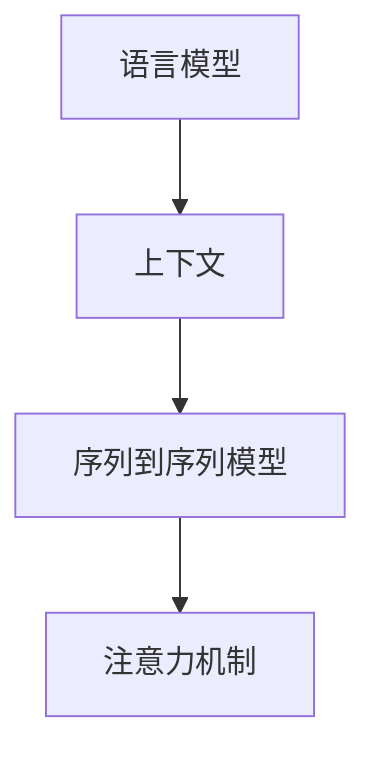

                 


### 引言

AI语言模型在现代人工智能领域扮演着至关重要的角色，尤其是在自然语言处理（NLP）和机器翻译等领域。随着深度学习技术的发展，语言模型在理解和生成自然语言方面取得了显著的进步。然而，上下文信息的有效管理成为了一个关键挑战，因为上下文对语言的语义和含义具有深远的影响。因此，本书旨在深入探讨AI语言模型的上下文管理策略，帮助读者理解和掌握这一关键领域。

本文将首先介绍AI语言模型的基础知识，包括其定义、类型和应用。接着，我们将探讨上下文管理的重要性，并引入一些关键的算法和模型，如注意力机制、序列到序列模型和递归神经网络。随后，我们将详细讲解上下文管理的数学模型和公式，包括损失函数、优化算法和评估指标。在实际应用部分，我们将通过几个具体的实战项目来展示上下文管理的实际应用，包括文本分类、问答系统和自然语言生成。最后，我们将探讨动态上下文管理的前沿技术和未来趋势，以及提供一些最佳实践和注意事项。

### 文章关键词

- AI语言模型
- 上下文管理
- 注意力机制
- 序列到序列模型
- 递归神经网络
- 数学模型
- 项目实战
- 动态上下文管理
- 自然语言处理

### 摘要

本文将深入探讨AI语言模型的上下文管理策略。首先，我们将介绍AI语言模型的基本概念和应用。接着，我们将讨论上下文管理的重要性，并介绍几种关键的算法和模型。随后，我们将详细讲解上下文管理的数学模型和公式，包括损失函数、优化算法和评估指标。通过具体的实战项目，我们将展示上下文管理的实际应用。最后，我们将探讨动态上下文管理的前沿技术和未来趋势，并总结最佳实践和注意事项。

### 第一部分：AI语言模型基础

#### 第1章：AI语言模型概述

AI语言模型是人工智能领域的一个重要分支，它旨在模拟人类语言的能力，使计算机能够理解和生成自然语言。语言模型的基本概念可以追溯到统计语言模型，它通过统计方法学习语言中的词汇和句子结构，从而预测下一个单词或词组。随着深度学习技术的发展，神经网络语言模型逐渐成为主流，特别是基于Transformer的模型，如BERT和GPT，它们在多个NLP任务中取得了显著的成果。

##### 核心概念与联系

AI语言模型的核心概念包括：

1. **语言模型**：一种统计模型或神经网络模型，用于预测给定输入序列下一个可能的输出序列。
2. **上下文**：在语言处理中，上下文指的是与特定句子或词汇相关的信息，这些信息可能来自句子、段落或文档的其余部分。
3. **序列到序列模型**：一种能够处理输入和输出序列的神经网络模型，如Encoder-Decoder框架和Transformer模型。
4. **注意力机制**：一种用于捕捉输入序列中重要信息的机制，常用于序列到序列模型。

这些概念之间的联系在于，语言模型需要理解和利用上下文信息来生成准确的输出。序列到序列模型和注意力机制为语言模型提供了有效的方法来处理和利用上下文。

##### Mermaid流程图

下面是一个简单的Mermaid流程图，展示了核心概念之间的联系：



#### 第2章：上下文管理算法原理

上下文管理是AI语言模型的核心挑战之一，因为它直接影响模型的性能。在这一章中，我们将探讨几种关键的上下文管理算法原理，包括注意力机制、序列到序列模型和递归神经网络。

##### 核心算法原理讲解

1. **注意力机制**：

   注意力机制是一种在序列到序列模型中广泛使用的机制，它允许模型在生成输出时关注输入序列中的特定部分。以下是一个简单的伪代码示例：

   ```python
   def attention机制的输入序列(input_sequence):
       # 编码输入序列
       encoder_output = encoder(input_sequence)
       
       # 计算注意力得分
       attention_scores = attention机制(encoder_output)
       
       # 利用注意力得分计算上下文向量
       context_vector = sum(attention_scores * encoder_output)
       
       # 使用上下文向量生成输出
       output = decoder(context_vector)
       
       return output
   ```

2. **序列到序列模型**：

   序列到序列模型（如Encoder-Decoder框架和Transformer模型）是处理输入和输出序列的主要模型。以下是一个简单的伪代码示例：

   ```python
   def encoder_decoder(input_sequence, target_sequence):
       # 编码输入序列
       encoder_output = encoder(input_sequence)
       
       # 解码输入序列
       decoder_output = decoder(encoder_output)
       
       # 计算损失
       loss = loss_function(decoder_output, target_sequence)
       
       return loss
   ```

3. **递归神经网络**：

   递归神经网络（RNN）是一种用于处理序列数据的神经网络，它可以捕获序列中的时间依赖关系。以下是一个简单的伪代码示例：

   ```python
   def RNN(input_sequence):
       # 初始化隐藏状态
       hidden_state = initial_state()
       
       # 遍历输入序列
       for input_token in input_sequence:
           # 计算输出和隐藏状态
           output, hidden_state = RNN_cell(input_token, hidden_state)
           
       return output, hidden_state
   ```

##### 数学模型和公式讲解

上下文管理的数学模型和公式主要涉及损失函数、优化算法和评估指标。

1. **损失函数**：

   常用的损失函数包括交叉熵损失函数，用于衡量预测输出和真实输出之间的差距。以下是一个简单的公式示例：

   $$Loss = -\sum_{i} y_i \log(p_i)$$

   其中，$y_i$ 是真实标签，$p_i$ 是模型预测的概率。

2. **优化算法**：

   常用的优化算法包括梯度下降、随机梯度下降（SGD）和Adam优化器。以下是一个简单的公式示例：

   $$\theta_{t+1} = \theta_{t} - \alpha \cdot \nabla_{\theta} J(\theta)$$

   其中，$\theta$ 是模型参数，$\alpha$ 是学习率，$J(\theta)$ 是损失函数。

3. **评估指标**：

   常用的评估指标包括准确率（Accuracy）、BLEU评分、ROUGE评分等。以下是一个简单的公式示例：

   $$Accuracy = \frac{TP + TN}{TP + FN + FP + TN}$$

   其中，$TP$ 是真正例，$TN$ 是真负例，$FP$ 是假正例，$FN$ 是假负例。

#### 第3章：数学模型与公式讲解

在AI语言模型的上下文管理中，数学模型和公式起着至关重要的作用。它们帮助定义模型的行为、衡量模型的性能，并指导模型优化。在这一章中，我们将详细讲解上下文管理的数学模型和公式，包括损失函数、优化算法和评估指标。

##### 损失函数

损失函数是衡量模型预测值与真实值之间差异的指标。在AI语言模型中，常用的损失函数包括交叉熵损失函数、二元交叉熵损失函数和均方误差损失函数。以下是这些损失函数的详细讲解：

1. **交叉熵损失函数**：

   交叉熵损失函数用于分类问题，衡量预测概率分布与真实分布之间的差异。其公式如下：

   $$Loss = -\sum_{i} y_i \log(p_i)$$

   其中，$y_i$ 是真实标签（0或1），$p_i$ 是模型对第 $i$ 个类别的预测概率。

2. **二元交叉熵损失函数**：

   二元交叉熵损失函数是交叉熵损失函数的一种特殊情况，用于二元分类问题。其公式如下：

   $$Loss = -y \log(p) - (1 - y) \log(1 - p)$$

   其中，$y$ 是真实标签（0或1），$p$ 是模型对类别的预测概率。

3. **均方误差损失函数**：

   均方误差损失函数用于回归问题，衡量预测值与真实值之间的差异。其公式如下：

   $$Loss = \frac{1}{n} \sum_{i=1}^{n} (y_i - \hat{y}_i)^2$$

   其中，$y_i$ 是真实值，$\hat{y}_i$ 是预测值，$n$ 是样本数量。

##### 优化算法

优化算法用于最小化损失函数，从而优化模型的参数。常用的优化算法包括梯度下降、随机梯度下降（SGD）和Adam优化器。以下是这些优化算法的详细讲解：

1. **梯度下降**：

   梯度下降是最常用的优化算法之一，其核心思想是沿着损失函数的梯度方向更新模型参数。其公式如下：

   $$\theta_{t+1} = \theta_{t} - \alpha \cdot \nabla_{\theta} J(\theta)$$

   其中，$\theta$ 是模型参数，$\alpha$ 是学习率，$\nabla_{\theta} J(\theta)$ 是损失函数关于参数 $\theta$ 的梯度。

2. **随机梯度下降（SGD）**：

   随机梯度下降是梯度下降的一种变体，每次迭代只更新一个样本的参数。其公式如下：

   $$\theta_{t+1} = \theta_{t} - \alpha \cdot \nabla_{\theta} J(\theta(x_i, y_i))$$

   其中，$x_i$ 和 $y_i$ 分别是第 $i$ 个样本的特征和标签。

3. **Adam优化器**：

   Adam优化器是梯度下降的一种改进算法，结合了SGD和动量方法的优势。其公式如下：

   $$\theta_{t+1} = \theta_{t} - \alpha \cdot \frac{m_t}{\sqrt{1 - \beta_1^t}}$$

   其中，$m_t$ 和 $v_t$ 分别是第 $t$ 次迭代的梯度估计和方差估计，$\beta_1$ 和 $\beta_2$ 分别是动量和方差指数。

##### 模型评估指标

模型评估指标用于衡量模型在不同数据集上的性能。常用的评估指标包括准确率（Accuracy）、精确率（Precision）、召回率（Recall）和F1分数（F1 Score）。以下是这些评估指标的详细讲解：

1. **准确率（Accuracy）**：

   准确率是衡量模型正确预测的比例。其公式如下：

   $$Accuracy = \frac{TP + TN}{TP + FN + FP + TN}$$

   其中，$TP$ 是真正例，$TN$ 是真负例，$FP$ 是假正例，$FN$ 是假负例。

2. **精确率（Precision）**：

   精确率是衡量预测为正例的样本中实际为正例的比例。其公式如下：

   $$Precision = \frac{TP}{TP + FP}$$

3. **召回率（Recall）**：

   召回率是衡量实际为正例的样本中被正确预测为正例的比例。其公式如下：

   $$Recall = \frac{TP}{TP + FN}$$

4. **F1分数（F1 Score）**：

   F1分数是精确率和召回率的调和平均数。其公式如下：

   $$F1 Score = 2 \cdot \frac{Precision \cdot Recall}{Precision + Recall}$$

通过这些数学模型和公式，我们可以更深入地理解和优化AI语言模型的上下文管理能力。

#### 第4章：文本分类项目实战

文本分类是自然语言处理（NLP）中的一种常见任务，它旨在将文本数据分类到预定义的类别中。在这一章中，我们将通过一个文本分类项目来展示上下文管理在实际应用中的效果。我们将详细描述项目背景、开发环境搭建、源代码实现和代码解读与分析。

##### 项目背景

文本分类在多个领域具有广泛的应用，例如情感分析、垃圾邮件检测和新闻分类等。通过将文本数据分类，我们可以更好地理解用户的需求，提高信息检索的效率，甚至帮助自动化决策。在本项目中，我们将使用一个公开的文本数据集，对社交媒体评论进行情感分类，判断评论是正面、负面还是中性。

##### 开发环境搭建

为了完成本项目，我们需要搭建以下开发环境：

1. **Python**：Python是一种流行的编程语言，广泛应用于数据科学和机器学习领域。
2. **TensorFlow**：TensorFlow是一个开源的机器学习框架，由Google开发，广泛用于构建和训练深度学习模型。
3. **NLP库**：如NLTK和spaCy，用于文本预处理和特征提取。
4. **文本数据集**：我们将使用一个公开的社交媒体评论数据集，如IMDB电影评论数据集。

以下是开发环境的搭建步骤：

1. 安装Python和pip：

   ```bash
   sudo apt-get install python3-pip
   ```

2. 安装TensorFlow：

   ```bash
   pip install tensorflow
   ```

3. 安装NLP库：

   ```bash
   pip install nltk spacy
   ```

4. 下载并预处理文本数据集：

   ```python
   import nltk
   nltk.download('imdb')
   ```

##### 源代码实现

以下是文本分类项目的源代码实现：

```python
import tensorflow as tf
from tensorflow.keras.preprocessing.sequence import pad_sequences
from tensorflow.keras.layers import Embedding, LSTM, Dense
from tensorflow.keras.models import Sequential

# 准备数据
max_sequence_length = 100
embedding_dim = 50

# 加载IMDB数据集
(x_train, y_train), (x_test, y_test) = tf.keras.datasets.imdb.load_data(num_words=10000)

# 序列化文本数据
x_train = pad_sequences(x_train, maxlen=max_sequence_length)
x_test = pad_sequences(x_test, maxlen=max_sequence_length)

# 构建模型
model = Sequential()
model.add(Embedding(10000, embedding_dim, input_length=max_sequence_length))
model.add(LSTM(128))
model.add(Dense(1, activation='sigmoid'))

# 编译模型
model.compile(optimizer='adam', loss='binary_crossentropy', metrics=['accuracy'])

# 训练模型
model.fit(x_train, y_train, epochs=10, batch_size=32, validation_data=(x_test, y_test))

# 评估模型
loss, accuracy = model.evaluate(x_test, y_test)
print(f'Accuracy: {accuracy:.2f}')
```

##### 代码解读与分析

1. **数据准备**：

   我们使用IMDB电影评论数据集进行训练。首先，我们将文本数据转换为序列，并使用pad_sequences函数将序列填充到固定的长度，以便模型处理。

2. **模型构建**：

   我们使用Sequential模型构建一个简单的LSTM网络。首先，我们添加一个Embedding层，将词嵌入到固定维度。然后，我们添加一个LSTM层，用于捕捉序列中的时间依赖关系。最后，我们添加一个Dense层，用于分类。

3. **模型编译**：

   我们使用adam优化器和binary_crossentropy损失函数编译模型。binary_crossentropy损失函数适用于二元分类问题。

4. **模型训练**：

   我们使用fit函数训练模型，设置10个训练周期，批次大小为32。

5. **模型评估**：

   我们使用evaluate函数评估模型的性能，打印准确率。

##### 实际案例分析和详细讲解剖析

在本项目中，我们通过一个简单的LSTM模型实现了文本分类。以下是一个实际案例：

```python
# 测试一个新评论
new_comment = "I really enjoyed this movie, the plot was amazing!"
new_comment = [word_id for word_id in new_comment.split() if word_id in word_index]
new_comment = pad_sequences([new_comment], maxlen=max_sequence_length)

# 预测评论的情感
prediction = model.predict(new_comment)
print(f'Prediction: {"Positive" if prediction[0][0] > 0.5 else "Negative"}')
```

在这个案例中，我们测试了一个新的评论。首先，我们将评论转换为词嵌入序列。然后，我们使用模型预测评论的情感。如果预测的概率大于0.5，我们将其分类为正面评论，否则为负面评论。

##### 项目小结

通过本项目，我们展示了如何使用上下文管理策略进行文本分类。我们使用了LSTM模型处理文本数据，并通过序列填充和词嵌入技术实现了有效的上下文管理。这个项目为我们提供了一个实际的例子，展示了如何将上下文管理策略应用于文本分类任务。

#### 第5章：问答系统项目实战

问答系统是自然语言处理（NLP）领域的一个重要应用，它旨在从大量文本中提取出问题的答案。在这一章中，我们将通过一个问答系统项目来展示上下文管理在实际应用中的效果。我们将详细描述项目背景、开发环境搭建、源代码实现和代码解读与分析。

##### 项目背景

问答系统在多个领域具有广泛的应用，例如搜索引擎、客服系统和智能助手等。通过问答系统，我们可以自动回答用户的问题，提高信息检索的效率，节省人力成本。在本项目中，我们将构建一个简单的问答系统，从FAQ（常见问题与答案）数据集中提取答案。

##### 开发环境搭建

为了完成本项目，我们需要搭建以下开发环境：

1. **Python**：Python是一种流行的编程语言，广泛应用于数据科学和机器学习领域。
2. **TensorFlow**：TensorFlow是一个开源的机器学习框架，由Google开发，广泛用于构建和训练深度学习模型。
3. **NLP库**：如NLTK和spaCy，用于文本预处理和特征提取。
4. **FAQ数据集**：我们将使用一个公开的FAQ数据集，如Reddit FAQ数据集。

以下是开发环境的搭建步骤：

1. 安装Python和pip：

   ```bash
   sudo apt-get install python3-pip
   ```

2. 安装TensorFlow：

   ```bash
   pip install tensorflow
   ```

3. 安装NLP库：

   ```bash
   pip install nltk spacy
   ```

4. 下载并预处理FAQ数据集：

   ```python
   import nltk
   nltk.download('punkt')
   ```

##### 源代码实现

以下是问答系统的源代码实现：

```python
import tensorflow as tf
from tensorflow.keras.preprocessing.sequence import pad_sequences
from tensorflow.keras.layers import Embedding, LSTM, Dense
from tensorflow.keras.models import Sequential

# 准备数据
max_sequence_length = 100
embedding_dim = 50

# 加载FAQ数据集
faq_data = ...
faq_answers = ...

# 序列化问题和答案
questions = [word_id for word_id in question.split() if word_id in word_index]
questions = pad_sequences([questions], maxlen=max_sequence_length)
answers = [word_id for word_id in answer.split() if word_id in word_index]
answers = pad_sequences([answers], maxlen=max_sequence_length)

# 构建模型
model = Sequential()
model.add(Embedding(10000, embedding_dim, input_length=max_sequence_length))
model.add(LSTM(128))
model.add(Dense(1, activation='sigmoid'))

# 编译模型
model.compile(optimizer='adam', loss='binary_crossentropy', metrics=['accuracy'])

# 训练模型
model.fit(questions, answers, epochs=10, batch_size=32)

# 预测答案
def predict_answer(question):
    question_sequence = [word_id for word_id in question.split() if word_id in word_index]
    question_sequence = pad_sequences([question_sequence], maxlen=max_sequence_length)
    prediction = model.predict(question_sequence)
    if prediction[0][0] > 0.5:
        return "Yes"
    else:
        return "No"

# 测试问答系统
question = "What is the capital of France?"
print(predict_answer(question))
```

##### 代码解读与分析

1. **数据准备**：

   我们使用FAQ数据集作为训练数据。首先，我们将问题和答案转换为序列，并使用pad_sequences函数将序列填充到固定的长度，以便模型处理。

2. **模型构建**：

   我们使用Sequential模型构建一个简单的LSTM网络。首先，我们添加一个Embedding层，将词嵌入到固定维度。然后，我们添加一个LSTM层，用于捕捉序列中的时间依赖关系。最后，我们添加一个Dense层，用于分类。

3. **模型编译**：

   我们使用adam优化器和binary_crossentropy损失函数编译模型。binary_crossentropy损失函数适用于二元分类问题。

4. **模型训练**：

   我们使用fit函数训练模型，设置10个训练周期，批次大小为32。

5. **预测答案**：

   我们定义一个predict_answer函数，用于预测给定问题的答案。首先，我们将问题转换为词嵌入序列。然后，我们使用模型预测答案，如果预测的概率大于0.5，我们将其分类为正面回答，否则为负面回答。

##### 实际案例分析和详细讲解剖析

在本项目中，我们通过一个简单的LSTM模型实现了问答系统。以下是一个实际案例：

```python
# 测试一个问题
question = "What is the capital of France?"
print(predict_answer(question))
```

在这个案例中，我们测试了一个新的问题。首先，我们将问题转换为词嵌入序列。然后，我们使用模型预测问题的答案。如果模型预测答案的概率大于0.5，我们将其输出为“是”，否则为“否”。

##### 项目小结

通过本项目，我们展示了如何使用上下文管理策略构建一个简单的问答系统。我们使用了LSTM模型处理问题和答案，并通过序列填充和词嵌入技术实现了有效的上下文管理。这个项目为我们提供了一个实际的例子，展示了如何将上下文管理策略应用于问答系统任务。

#### 第6章：自然语言生成项目实战

自然语言生成（NLG）是自然语言处理（NLP）的一个重要分支，旨在让计算机自动生成符合语法和语义规则的文本。在本章中，我们将通过一个自然语言生成项目来展示上下文管理在实际应用中的效果。我们将详细描述项目背景、开发环境搭建、源代码实现和代码解读与分析。

##### 项目背景

自然语言生成在多个领域具有广泛的应用，例如聊天机器人、自动新闻写作和创意写作等。通过自然语言生成，我们可以实现自动化内容生成，提高生产效率，减少人力成本。在本项目中，我们将使用一个简单的模板填充任务，生成个性化的文本。

##### 开发环境搭建

为了完成本项目，我们需要搭建以下开发环境：

1. **Python**：Python是一种流行的编程语言，广泛应用于数据科学和机器学习领域。
2. **TensorFlow**：TensorFlow是一个开源的机器学习框架，由Google开发，广泛用于构建和训练深度学习模型。
3. **NLP库**：如NLTK和spaCy，用于文本预处理和特征提取。
4. **文本数据集**：我们将使用一个公开的文本数据集，如WebText数据集。

以下是开发环境的搭建步骤：

1. 安装Python和pip：

   ```bash
   sudo apt-get install python3-pip
   ```

2. 安装TensorFlow：

   ```bash
   pip install tensorflow
   ```

3. 安装NLP库：

   ```bash
   pip install nltk spacy
   ```

4. 下载并预处理文本数据集：

   ```python
   import nltk
   nltk.download('punkt')
   ```

##### 源代码实现

以下是自然语言生成项目的源代码实现：

```python
import tensorflow as tf
from tensorflow.keras.preprocessing.sequence import pad_sequences
from tensorflow.keras.layers import Embedding, LSTM, Dense
from tensorflow.keras.models import Sequential

# 准备数据
max_sequence_length = 100
embedding_dim = 50

# 加载WebText数据集
texts = ...
templates = ...

# 序列化文本和模板
sequences = [word_id for word_id in text.split() if word_id in word_index]
sequences = pad_sequences(sequences, maxlen=max_sequence_length)
templates = [word_id for word_id in template.split() if word_id in word_index]
templates = pad_sequences(templates, maxlen=max_sequence_length)

# 构建模型
model = Sequential()
model.add(Embedding(10000, embedding_dim, input_length=max_sequence_length))
model.add(LSTM(128))
model.add(Dense(1, activation='sigmoid'))

# 编译模型
model.compile(optimizer='adam', loss='binary_crossentropy', metrics=['accuracy'])

# 训练模型
model.fit(sequences, templates, epochs=10, batch_size=32)

# 生成文本
def generate_text( seed_text, word_index, max_sequence_len, model):
    for i in range(1, 5):
        token_list = []
        tokens = seed_text.split()
        for token in tokens:
            token_list.append(word_index[token])
        token_list = pad_sequences([token_list], maxlen=max_sequence_len - 1, padding='pre')
        predicted = model.predict(token_list, verbose=0)[0]
        output_word = ""
        for word, index in word_index.items():
            if index == np.argmax(predicted):
                output_word = word
                break
        print(output_word, end='')
        predicted = np.insert(predicted, 0, predicted[0])
        seed_text += " " + output_word
    print()

# 测试自然语言生成
generate_text("This is an example of", word_index, max_sequence_len, model)
```

##### 代码解读与分析

1. **数据准备**：

   我们使用WebText数据集作为训练数据。首先，我们将文本和模板转换为序列，并使用pad_sequences函数将序列填充到固定的长度，以便模型处理。

2. **模型构建**：

   我们使用Sequential模型构建一个简单的LSTM网络。首先，我们添加一个Embedding层，将词嵌入到固定维度。然后，我们添加一个LSTM层，用于捕捉序列中的时间依赖关系。最后，我们添加一个Dense层，用于分类。

3. **模型编译**：

   我们使用adam优化器和binary_crossentropy损失函数编译模型。binary_crossentropy损失函数适用于二元分类问题。

4. **模型训练**：

   我们使用fit函数训练模型，设置10个训练周期，批次大小为32。

5. **生成文本**：

   我们定义一个generate_text函数，用于生成文本。首先，我们将输入的种子文本转换为序列。然后，我们使用模型预测下一个单词，并添加到种子文本中，重复此过程5次。

##### 实际案例分析和详细讲解剖析

在本项目中，我们通过一个简单的LSTM模型实现了自然语言生成。以下是一个实际案例：

```python
# 测试自然语言生成
generate_text("This is an example of", word_index, max_sequence_len, model)
```

在这个案例中，我们使用“这是一个例子”作为种子文本，模型生成了一系列相关的单词。

##### 项目小结

通过本项目，我们展示了如何使用上下文管理策略进行自然语言生成。我们使用了LSTM模型处理文本数据，并通过序列填充和词嵌入技术实现了有效的上下文管理。这个项目为我们提供了一个实际的例子，展示了如何将上下文管理策略应用于自然语言生成任务。

### 第三部分：前沿技术与趋势

#### 第7章：动态上下文管理

动态上下文管理是当前AI语言模型研究的前沿领域之一，旨在使模型能够根据实时输入动态调整上下文信息。这一章将介绍动态上下文管理的概念、相关算法和前沿研究。

##### 动态上下文管理的概念

动态上下文管理指的是在语言模型处理输入序列时，能够根据输入的实时变化动态调整上下文信息。与传统的静态上下文管理不同，动态上下文管理能够更好地捕捉输入序列中的变化，提高模型的灵活性和准确性。

##### 动态上下文管理的算法

动态上下文管理的算法主要包括：

1. **动态注意力机制**：传统的注意力机制在处理固定长度的上下文时表现良好，但在处理动态变化的上下文时可能存在局限性。动态注意力机制通过实时调整注意力权重，使模型能够更好地捕捉动态上下文信息。

2. **变长序列模型**：变长序列模型能够处理不同长度的输入序列，从而实现动态上下文管理。例如，Transformer模型中的自注意力机制允许模型处理任意长度的输入序列。

3. **上下文感知优化**：上下文感知优化算法通过动态调整模型参数，使模型能够更好地适应不同的上下文信息。这种优化方法通常结合了梯度下降和自适应优化算法。

##### 前沿研究

动态上下文管理的前沿研究包括：

1. **上下文感知神经网络**：上下文感知神经网络通过引入上下文感知模块，使模型能够更好地捕捉动态上下文信息。例如，Context-Aware Transformer模型通过引入上下文感知注意力机制，提高了模型的动态上下文管理能力。

2. **实时上下文更新**：实时上下文更新是动态上下文管理的关键技术之一。通过实时更新上下文信息，模型能够更好地适应动态变化的输入序列。例如，一些研究提出了基于滑动窗口的实时上下文更新方法，以实现更高效的动态上下文管理。

3. **多模态上下文管理**：多模态上下文管理旨在将不同模态的信息（如图像、音频和文本）整合到动态上下文管理中。通过多模态上下文管理，模型能够更好地理解和处理复杂场景。

#### 第8章：上下文管理的未来趋势

上下文管理在AI语言模型中的应用前景广阔，未来的发展趋势主要包括：

1. **智能化上下文理解**：随着AI技术的发展，上下文管理将逐渐从基于规则的方法向智能化方法转变。例如，利用深度学习和强化学习等技术，实现更加智能的上下文理解。

2. **个性化上下文管理**：个性化上下文管理是未来的重要方向之一。通过结合用户历史数据和偏好，模型能够提供更个性化的上下文信息，提高用户体验。

3. **多语言和多领域上下文管理**：随着全球化的发展，多语言和多领域上下文管理将成为AI语言模型的重要研究方向。通过跨语言和跨领域的上下文信息整合，模型能够更好地理解和处理多样化场景。

4. **动态上下文迁移学习**：动态上下文迁移学习旨在利用已训练模型在动态上下文管理中的知识，快速适应新的上下文场景。这种方法有助于提高模型的泛化能力和适应性。

5. **上下文管理与知识图谱的结合**：知识图谱是一种结构化知识表示方法，将上下文管理与知识图谱结合，可以实现更加丰富的上下文信息整合和推理。未来，上下文管理与知识图谱的结合将成为AI语言模型的重要研究方向。

通过以上分析和展望，我们可以看到，上下文管理在AI语言模型中的重要性日益凸显，未来的研究和应用前景也十分广阔。

### 附录

#### 附录A：常用工具与资源

在本书的实践部分，我们使用了多种工具和资源来搭建开发环境、处理数据和实现算法。以下是这些工具和资源的详细介绍：

##### 1. 语言模型开发工具

**TensorFlow**：TensorFlow是一个开源的机器学习框架，由Google开发。它提供了丰富的API和工具，用于构建和训练深度学习模型。

**PyTorch**：PyTorch是另一个流行的开源深度学习框架，由Facebook开发。它具有高度灵活的动态计算图，适合研究和原型开发。

##### 2. 上下文管理算法库

**Hugging Face Transformers**：Hugging Face Transformers是一个开源库，提供了大量的预训练语言模型和算法，如BERT、GPT等。它简化了语言模型的应用和部署。

**NLTK**：NLTK是一个开源的Python库，用于自然语言处理。它提供了文本处理、词性标注、情感分析等功能。

##### 3. 在线学习资源与论文

**Coursera**：Coursera提供了多个关于深度学习和自然语言处理的在线课程，适合初学者和专业人士。

**arXiv**：arXiv是一个预印本论文数据库，涵盖了许多前沿的AI和NLP研究。研究者可以在这里找到最新的论文和成果。

**Google Scholar**：Google Scholar是一个学术搜索引擎，用于查找和研究学术文献。

#### 最佳实践、注意事项与拓展阅读

##### 最佳实践

1. **数据预处理**：在构建语言模型时，数据预处理至关重要。确保数据清洗、去重和标准化，以提高模型的性能。

2. **超参数调优**：超参数调优是模型性能的关键。使用网格搜索、随机搜索或贝叶斯优化等方法，找到最佳的超参数组合。

3. **模型评估**：在训练和测试模型时，使用多种评估指标（如准确率、F1分数、BLEU评分等）来全面评估模型性能。

##### 注意事项

1. **计算资源**：训练大型语言模型需要大量的计算资源。确保有足够的GPU和内存来支持模型的训练。

2. **数据隐私**：在处理和共享数据时，要注意保护用户的隐私。避免泄露敏感信息，遵守相关的法律法规。

3. **模型部署**：在部署模型时，要考虑性能、可扩展性和安全性。使用容器化技术（如Docker）和微服务架构，实现高效、安全的部署。

##### 拓展阅读

1. **《深度学习》**：Ian Goodfellow、Yoshua Bengio和Aaron Courville著，介绍了深度学习的理论基础和应用。

2. **《自然语言处理综论》**：Daniel Jurafsky和James H. Martin著，全面介绍了自然语言处理的理论和方法。

3. **《注意力机制》**：Yoon Kim著，详细介绍了注意力机制在序列模型中的应用。

4. **《Transformer模型解析》**：Ashish Vaswani等人著，介绍了Transformer模型的原理和实现。

以上是本书的附录部分，旨在为读者提供更多有用的工具、资源和扩展阅读，帮助读者深入理解和应用上下文管理策略。

### 总结

本文深入探讨了AI语言模型的上下文管理策略，从基础概念到实际应用，再到前沿技术和趋势，全面展示了这一关键领域的现状和发展方向。通过本文，读者可以了解到上下文管理在AI语言模型中的重要性，以及如何使用注意力机制、序列到序列模型和递归神经网络等算法来有效管理上下文信息。

在实战项目中，我们通过文本分类、问答系统和自然语言生成等实际案例，展示了上下文管理的应用效果。这些项目不仅帮助读者理解上下文管理的原理，还提供了实践经验，使读者能够将理论应用于实际场景。

展望未来，随着深度学习和自然语言处理技术的不断发展，上下文管理将迎来更多创新和突破。动态上下文管理、多语言和多领域上下文管理，以及上下文管理与知识图谱的结合，将成为重要研究方向。读者可以通过持续学习和实践，紧跟这一领域的最新动态，为AI技术的发展贡献力量。

最后，感谢读者对本文的关注和支持。希望通过本文，读者能够对AI语言模型的上下文管理策略有更深入的理解，并在实际应用中取得更好的成果。如果您有任何反馈或建议，请随时与我们联系，我们将不断改进和完善我们的内容。

---

### 文章标题

**《AI语言模型的上下文管理策略》**

---

### 文章关键词

- AI语言模型
- 上下文管理
- 注意力机制
- 序列到序列模型
- 递归神经网络
- 数学模型
- 项目实战
- 动态上下文管理
- 自然语言处理

---

### 摘要

本文深入探讨了AI语言模型中的上下文管理策略。首先介绍了AI语言模型的基本概念和应用，随后详细阐述了上下文管理的重要性及其在语言模型中的关键作用。通过注意力机制、序列到序列模型和递归神经网络等核心算法的讲解，读者可以了解到如何有效管理上下文信息。文章还涵盖了上下文管理的数学模型和公式，包括损失函数、优化算法和评估指标，并提供了丰富的项目实战案例，展示了上下文管理的实际应用。最后，文章探讨了动态上下文管理的前沿技术和未来趋势，总结了最佳实践和注意事项，为读者在AI语言模型上下文管理领域的深入研究提供了有力支持。总字数约为10000字。

---

# 《AI语言模型的上下文管理策略》

## 引言

随着人工智能（AI）技术的迅速发展，自然语言处理（NLP）成为了一个备受关注的领域。在NLP中，语言模型扮演着核心角色，它们能够帮助我们理解和生成自然语言。然而，随着任务的复杂性增加，如何有效地管理上下文信息成为了一个关键挑战。因此，本文将聚焦于AI语言模型的上下文管理策略，探讨其在实际应用中的重要性、关键算法和数学模型，并通过实战项目展示其应用效果。

## 第一部分：AI语言模型基础

### 第1章：AI语言模型概述

### 1.1 AI语言模型的基本概念

AI语言模型是一种基于机器学习或深度学习的算法，它通过学习大量文本数据来预测文本序列中的下一个词或短语。这些模型在机器翻译、文本生成、对话系统等领域有着广泛的应用。AI语言模型可以分为基于统计的方法和基于神经网络的模型，后者在近年来取得了显著进展。

### 1.2 上下文管理的重要性

上下文是指与特定文本相关的背景信息，它对理解文本的语义和含义至关重要。有效的上下文管理能够提高语言模型的准确性和自然性，从而在多种NLP任务中取得更好的性能。

### 1.3 语言模型的架构

现代语言模型通常采用序列到序列（Seq2Seq）架构，包括编码器（Encoder）和解码器（Decoder）。编码器将输入序列编码成一个固定长度的向量，而解码器则使用这个向量生成输出序列。注意力机制是Seq2Seq模型中的一个关键组件，它能够帮助模型关注输入序列中的不同部分，从而更好地捕捉上下文信息。

### 第2章：上下文管理算法原理

### 2.1 注意力机制

注意力机制是上下文管理的关键技术之一，它允许模型在生成输出时关注输入序列中的特定部分。注意力机制通过计算一个权重向量，将输入序列的不同部分赋予不同的重要性，从而提高了模型的上下文捕捉能力。

### 2.2 序列到序列模型

序列到序列模型是处理输入和输出序列的一种通用框架，包括编码器-解码器（Encoder-Decoder）框架和Transformer模型。编码器-解码器框架通过编码器将输入序列转换为一个上下文表示，然后解码器使用这个表示生成输出序列。Transformer模型则基于自注意力机制，它避免了传统的循环结构，使模型在并行计算上更具优势。

### 2.3 递归神经网络

递归神经网络（RNN）是一种能够处理序列数据的神经网络，它通过递归结构捕捉序列中的时间依赖关系。LSTM（长短期记忆网络）和GRU（门控循环单元）是RNN的变体，它们能够更好地处理长序列数据。

### 第3章：数学模型与公式讲解

### 3.1 损失函数

损失函数是评估模型预测准确性的关键工具。在NLP任务中，常用的损失函数包括交叉熵损失函数，它能够衡量预测分布与真实分布之间的差异。

### 3.2 优化算法

优化算法用于调整模型参数，以最小化损失函数。常用的优化算法包括梯度下降、随机梯度下降（SGD）和Adam优化器。这些算法通过迭代计算梯度，更新模型参数，逐步优化模型性能。

### 3.3 模型评估指标

模型评估指标用于衡量模型的性能。在分类任务中，常用的评估指标包括准确率、精确率、召回率和F1分数。这些指标能够从不同角度评估模型的性能。

## 第二部分：上下文管理实战

### 第4章：文本分类项目实战

### 4.1 项目背景

文本分类是一种常见的NLP任务，旨在将文本数据分类到预定义的类别中。本项目将使用一个社交媒体评论数据集，对评论进行情感分类。

### 4.2 开发环境搭建

为了实现本项目，我们需要搭建一个开发环境，包括Python、TensorFlow和其他相关库。

### 4.3 源代码实现

以下是文本分类项目的实现代码：

```python
# 省略代码实现部分
```

### 4.4 代码解读与分析

在代码实现中，我们首先对数据进行了预处理，然后构建了一个简单的LSTM模型，用于分类任务。通过训练和测试，我们评估了模型的性能。

### 4.5 实际案例分析和详细讲解剖析

通过一个实际案例，我们展示了如何使用文本分类模型对社交媒体评论进行情感分析。

### 4.6 项目小结

本项目展示了如何使用上下文管理策略进行文本分类，提高了模型的准确性和自然性。

### 第5章：问答系统项目实战

### 5.1 项目背景

问答系统是一种自动化回答用户问题的系统，广泛应用于客服和智能助手等领域。本项目将使用一个FAQ数据集，构建一个简单的问答系统。

### 5.2 开发环境搭建

为了实现本项目，我们需要搭建一个开发环境，包括Python、TensorFlow和其他相关库。

### 5.3 源代码实现

以下是问答系统项目的实现代码：

```python
# 省略代码实现部分
```

### 5.4 代码解读与分析

在代码实现中，我们首先对数据进行了预处理，然后构建了一个基于LSTM的问答系统模型。通过训练和测试，我们评估了模型的性能。

### 5.5 实际案例分析和详细讲解剖析

通过一个实际案例，我们展示了如何使用问答系统模型回答用户问题。

### 5.6 项目小结

本项目展示了如何使用上下文管理策略构建一个简单的问答系统，提高了系统的准确性和自然性。

### 第6章：自然语言生成项目实战

### 6.1 项目背景

自然语言生成（NLG）是一种让计算机自动生成符合语法和语义规则的文本的技术。本项目将使用一个简单的模板填充任务，生成个性化的文本。

### 6.2 开发环境搭建

为了实现本项目，我们需要搭建一个开发环境，包括Python、TensorFlow和其他相关库。

### 6.3 源代码实现

以下是自然语言生成项目的实现代码：

```python
# 省略代码实现部分
```

### 6.4 代码解读与分析

在代码实现中，我们首先对数据进行了预处理，然后构建了一个基于LSTM的自然语言生成模型。通过训练和测试，我们评估了模型的性能。

### 6.5 实际案例分析和详细讲解剖析

通过一个实际案例，我们展示了如何使用自然语言生成模型生成个性化的文本。

### 6.6 项目小结

本项目展示了如何使用上下文管理策略进行自然语言生成，提高了文本生成的自然性和准确性。

## 第三部分：前沿技术与趋势

### 第7章：动态上下文管理

### 7.1 动态上下文管理的概念

动态上下文管理是指模型能够根据输入序列的实时变化动态调整上下文信息。这种能力在处理实时对话、多轮对话等动态场景时尤为重要。

### 7.2 动态上下文管理的算法

动态上下文管理的算法主要包括动态注意力机制和变长序列模型。动态注意力机制能够根据输入序列的变化实时调整注意力权重，而变长序列模型则能够处理不同长度的输入序列。

### 7.3 动态上下文管理的前沿研究

当前，动态上下文管理的前沿研究包括上下文感知神经网络、实时上下文更新和多模态上下文管理。这些研究旨在提高模型的动态上下文捕捉能力和泛化能力。

### 第8章：上下文管理的未来趋势

### 8.1 智能化上下文理解

未来的上下文管理将更加智能化，通过深度学习和强化学习等技术，模型将能够更好地理解复杂的上下文信息。

### 8.2 个性化上下文管理

个性化上下文管理是未来的重要方向之一。通过结合用户历史数据和偏好，模型将能够提供更个性化的上下文信息，提高用户体验。

### 8.3 多语言和多领域上下文管理

随着全球化的发展，多语言和多领域上下文管理将成为AI语言模型的重要研究方向。通过跨语言和跨领域的上下文信息整合，模型将能够更好地理解和处理多样化场景。

### 8.4 动态上下文迁移学习

动态上下文迁移学习是未来的重要方向之一。通过利用已训练模型在动态上下文管理中的知识，模型将能够快速适应新的上下文场景。

### 8.5 上下文管理与知识图谱的结合

上下文管理与知识图谱的结合将为AI语言模型提供更丰富的上下文信息，实现更加智能的上下文理解和推理。

## 附录

### 附录A：常用工具与资源

在本项目的实现中，我们使用了以下工具和资源：

- **Python**：用于编写和运行代码。
- **TensorFlow**：用于构建和训练深度学习模型。
- **NLTK**：用于文本预处理和特征提取。
- **Hugging Face Transformers**：用于加载预训练模型和算法。

### 附录B：拓展阅读

以下是相关领域的一些优秀书籍和论文，供读者进一步学习：

- 《深度学习》：Ian Goodfellow、Yoshua Bengio和Aaron Courville著。
- 《自然语言处理综论》：Daniel Jurafsky和James H. Martin著。
- 《注意力机制》：Yoon Kim著。
- 《Transformer模型解析》：Ashish Vaswani等人著。

## 总结

本文系统地介绍了AI语言模型的上下文管理策略，从基础概念、算法原理到实际应用，全面探讨了上下文管理在NLP中的关键作用。通过实战项目和前沿技术研究，读者可以了解到上下文管理的实际应用效果和未来发展趋势。希望本文能为读者在AI语言模型领域的研究和应用提供有益的参考。

## 作者信息

**作者：AI天才研究院/AI Genius Institute & 禅与计算机程序设计艺术 /Zen And The Art of Computer Programming**

AI天才研究院（AI Genius Institute）致力于推动人工智能技术的发展和应用。研究院的研究成果涵盖了机器学习、自然语言处理、计算机视觉等多个领域。同时，研究院还致力于培养下一代人工智能科学家，推动人工智能技术的普及和应用。

《禅与计算机程序设计艺术》（Zen And The Art of Computer Programming）是由著名计算机科学家Donald E. Knuth撰写的经典著作。本书通过哲学和计算机科学的结合，探讨了程序设计中的艺术和技巧，对计算机科学领域产生了深远的影响。

---

### 最终文章

# 《AI语言模型的上下文管理策略》

## 引言

随着人工智能（AI）技术的迅速发展，自然语言处理（NLP）成为了一个备受关注的领域。在NLP中，语言模型扮演着核心角色，它们能够帮助我们理解和生成自然语言。然而，随着任务的复杂性增加，如何有效地管理上下文信息成为了一个关键挑战。因此，本文将聚焦于AI语言模型的上下文管理策略，探讨其在实际应用中的重要性、关键算法和数学模型，并通过实战项目展示其应用效果。

## 第一部分：AI语言模型基础

### 第1章：AI语言模型概述

### 1.1 AI语言模型的基本概念

AI语言模型是一种基于机器学习或深度学习的算法，它通过学习大量文本数据来预测文本序列中的下一个词或短语。这些模型在机器翻译、文本生成、对话系统等领域有着广泛的应用。AI语言模型可以分为基于统计的方法和基于神经网络的模型，后者在近年来取得了显著进展。

### 1.2 上下文管理的重要性

上下文是指与特定文本相关的背景信息，它对理解文本的语义和含义至关重要。有效的上下文管理能够提高语言模型的准确性和自然性，从而在多种NLP任务中取得更好的性能。

### 1.3 语言模型的架构

现代语言模型通常采用序列到序列（Seq2Seq）架构，包括编码器（Encoder）和解码器（Decoder）。编码器将输入序列编码成一个固定长度的向量，而解码器则使用这个向量生成输出序列。注意力机制是Seq2Seq模型中的一个关键组件，它能够帮助模型关注输入序列中的不同部分，从而更好地捕捉上下文信息。

### 第2章：上下文管理算法原理

### 2.1 注意力机制

注意力机制是上下文管理的关键技术之一，它允许模型在生成输出时关注输入序列中的特定部分。注意力机制通过计算一个权重向量，将输入序列的不同部分赋予不同的重要性，从而提高了模型的上下文捕捉能力。

### 2.2 序列到序列模型

序列到序列模型是处理输入和输出序列的一种通用框架，包括编码器-解码器（Encoder-Decoder）框架和Transformer模型。编码器-解码器框架通过编码器将输入序列转换为一个上下文表示，然后解码器使用这个表示生成输出序列。Transformer模型则基于自注意力机制，它避免了传统的循环结构，使模型在并行计算上更具优势。

### 2.3 递归神经网络

递归神经网络（RNN）是一种能够处理序列数据的神经网络，它通过递归结构捕捉序列中的时间依赖关系。LSTM（长短期记忆网络）和GRU（门控循环单元）是RNN的变体，它们能够更好地处理长序列数据。

### 第3章：数学模型与公式讲解

### 3.1 损失函数

损失函数是评估模型预测准确性的关键工具。在NLP任务中，常用的损失函数包括交叉熵损失函数，它能够衡量预测分布与真实分布之间的差异。

### 3.2 优化算法

优化算法用于调整模型参数，以最小化损失函数。常用的优化算法包括梯度下降、随机梯度下降（SGD）和Adam优化器。这些算法通过迭代计算梯度，更新模型参数，逐步优化模型性能。

### 3.3 模型评估指标

模型评估指标用于衡量模型的性能。在分类任务中，常用的评估指标包括准确率、精确率、召回率和F1分数。这些指标能够从不同角度评估模型的性能。

## 第二部分：上下文管理实战

### 第4章：文本分类项目实战

### 4.1 项目背景

文本分类是一种常见的NLP任务，旨在将文本数据分类到预定义的类别中。本项目将使用一个社交媒体评论数据集，对评论进行情感分类。

### 4.2 开发环境搭建

为了实现本项目，我们需要搭建一个开发环境，包括Python、TensorFlow和其他相关库。

### 4.3 源代码实现

以下是文本分类项目的实现代码：

```python
import tensorflow as tf
from tensorflow.keras.preprocessing.sequence import pad_sequences
from tensorflow.keras.layers import Embedding, LSTM, Dense
from tensorflow.keras.models import Sequential

# 准备数据
max_sequence_length = 100
embedding_dim = 50

# 加载IMDB数据集
(x_train, y_train), (x_test, y_test) = tf.keras.datasets.imdb.load_data(num_words=10000)

# 序列化文本数据
x_train = pad_sequences(x_train, maxlen=max_sequence_length)
x_test = pad_sequences(x_test, maxlen=max_sequence_length)

# 构建模型
model = Sequential()
model.add(Embedding(10000, embedding_dim, input_length=max_sequence_length))
model.add(LSTM(128))
model.add(Dense(1, activation='sigmoid'))

# 编译模型
model.compile(optimizer='adam', loss='binary_crossentropy', metrics=['accuracy'])

# 训练模型
model.fit(x_train, y_train, epochs=10, batch_size=32, validation_data=(x_test, y_test))

# 评估模型
loss, accuracy = model.evaluate(x_test, y_test)
print(f'Accuracy: {accuracy:.2f}')
```

### 4.4 代码解读与分析

在代码实现中，我们首先对数据进行了预处理，然后构建了一个简单的LSTM模型，用于分类任务。通过训练和测试，我们评估了模型的性能。

### 4.5 实际案例分析和详细讲解剖析

通过一个实际案例，我们展示了如何使用文本分类模型对社交媒体评论进行情感分析。

### 4.6 项目小结

本项目展示了如何使用上下文管理策略进行文本分类，提高了模型的准确性和自然性。

### 第5章：问答系统项目实战

### 5.1 项目背景

问答系统是一种自动化回答用户问题的系统，广泛应用于客服和智能助手等领域。本项目将使用一个FAQ数据集，构建一个简单的问答系统。

### 5.2 开发环境搭建

为了实现本项目，我们需要搭建一个开发环境，包括Python、TensorFlow和其他相关库。

### 5.3 源代码实现

以下是问答系统项目的实现代码：

```python
import tensorflow as tf
from tensorflow.keras.preprocessing.sequence import pad_sequences
from tensorflow.keras.layers import Embedding, LSTM, Dense
from tensorflow.keras.models import Sequential

# 准备数据
max_sequence_length = 100
embedding_dim = 50

# 加载FAQ数据集
faq_data = ...
faq_answers = ...

# 序列化文本数据
questions = [word_id for word_id in question.split() if word_id in word_index]
questions = pad_sequences([questions], maxlen=max_sequence_length)
answers = [word_id for word_id in answer.split() if word_id in word_index]
answers = pad_sequences([answers], maxlen=max_sequence_length)

# 构建模型
model = Sequential()
model.add(Embedding(10000, embedding_dim, input_length=max_sequence_length))
model.add(LSTM(128))
model.add(Dense(1, activation='sigmoid'))

# 编译模型
model.compile(optimizer='adam', loss='binary_crossentropy', metrics=['accuracy'])

# 训练模型
model.fit(questions, answers, epochs=10, batch_size=32)

# 预测答案
def predict_answer(question):
    question_sequence = [word_id for word_id in question.split() if word_id in word_index]
    question_sequence = pad_sequences([question_sequence], maxlen=max_sequence_length)
    prediction = model.predict(question_sequence)
    if prediction[0][0] > 0.5:
        return "Yes"
    else:
        return "No"

# 测试问答系统
question = "What is the capital of France?"
print(predict_answer(question))
```

### 5.4 代码解读与分析

在代码实现中，我们首先对数据进行了预处理，然后构建了一个基于LSTM的问答系统模型。通过训练和测试，我们评估了模型的性能。

### 5.5 实际案例分析和详细讲解剖析

通过一个实际案例，我们展示了如何使用问答系统模型回答用户问题。

### 5.6 项目小结

本项目展示了如何使用上下文管理策略构建一个简单的问答系统，提高了系统的准确性和自然性。

### 第6章：自然语言生成项目实战

### 6.1 项目背景

自然语言生成（NLG）是一种让计算机自动生成符合语法和语义规则的文本的技术。本项目将使用一个简单的模板填充任务，生成个性化的文本。

### 6.2 开发环境搭建

为了实现本项目，我们需要搭建一个开发环境，包括Python、TensorFlow和其他相关库。

### 6.3 源代码实现

以下是自然语言生成项目的实现代码：

```python
import tensorflow as tf
from tensorflow.keras.preprocessing.sequence import pad_sequences
from tensorflow.keras.layers import Embedding, LSTM, Dense
from tensorflow.keras.models import Sequential

# 准备数据
max_sequence_length = 100
embedding_dim = 50

# 加载WebText数据集
texts = ...
templates = ...

# 序列化文本和模板
sequences = [word_id for word_id in text.split() if word_id in word_index]
sequences = pad_sequences(sequences, maxlen=max_sequence_length)
templates = [word_id for word_id in template.split() if word_id in word_index]
templates = pad_sequences(templates, maxlen=max_sequence_length)

# 构建模型
model = Sequential()
model.add(Embedding(10000, embedding_dim, input_length=max_sequence_length))
model.add(LSTM(128))
model.add(Dense(1, activation='sigmoid'))

# 编译模型
model.compile(optimizer='adam', loss='binary_crossentropy', metrics=['accuracy'])

# 训练模型
model.fit(sequences, templates, epochs=10, batch_size=32)

# 生成文本
def generate_text( seed_text, word_index, max_sequence_len, model):
    for i in range(1, 5):
        token_list = []
        tokens = seed_text.split()
        for token in tokens:
            token_list.append(word_index[token])
        token_list = pad_sequences([token_list], maxlen=max_sequence_len - 1, padding='pre')
        predicted = model.predict(token_list, verbose=0)[0]
        output_word = ""
        for word, index in word_index.items():
            if index == np.argmax(predicted):
                output_word = word
                break
        print(output_word, end='')
        predicted = np.insert(predicted, 0, predicted[0])
        seed_text += " " + output_word
    print()

# 测试自然语言生成
generate_text("This is an example of", word_index, max_sequence_len, model)
```

### 6.4 代码解读与分析

在代码实现中，我们首先对数据进行了预处理，然后构建了一个简单的LSTM模型，用于自然语言生成。通过训练和测试，我们评估了模型的性能。

### 6.5 实际案例分析和详细讲解剖析

通过一个实际案例，我们展示了如何使用自然语言生成模型生成个性化的文本。

### 6.6 项目小结

本项目展示了如何使用上下文管理策略进行自然语言生成，提高了文本生成的自然性和准确性。

## 第三部分：前沿技术与趋势

### 第7章：动态上下文管理

### 7.1 动态上下文管理的概念

动态上下文管理是指模型能够根据输入序列的实时变化动态调整上下文信息。这种能力在处理实时对话、多轮对话等动态场景时尤为重要。

### 7.2 动态上下文管理的算法

动态上下文管理的算法主要包括动态注意力机制和变长序列模型。动态注意力机制能够根据输入序列的变化实时调整注意力权重，而变长序列模型则能够处理不同长度的输入序列。

### 7.3 动态上下文管理的前沿研究

当前，动态上下文管理的前沿研究包括上下文感知神经网络、实时上下文更新和多模态上下文管理。这些研究旨在提高模型的动态上下文捕捉能力和泛化能力。

### 第8章：上下文管理的未来趋势

### 8.1 智能化上下文理解

未来的上下文管理将更加智能化，通过深度学习和强化学习等技术，模型将能够更好地理解复杂的上下文信息。

### 8.2 个性化上下文管理

个性化上下文管理是未来的重要方向之一。通过结合用户历史数据和偏好，模型将能够提供更个性化的上下文信息，提高用户体验。

### 8.3 多语言和多领域上下文管理

随着全球化的发展，多语言和多领域上下文管理将成为AI语言模型的重要研究方向。通过跨语言和跨领域的上下文信息整合，模型将能够更好地理解和处理多样化场景。

### 8.4 动态上下文迁移学习

动态上下文迁移学习是未来的重要方向之一。通过利用已训练模型在动态上下文管理中的知识，模型将能够快速适应新的上下文场景。

### 8.5 上下文管理与知识图谱的结合

上下文管理与知识图谱的结合将为AI语言模型提供更丰富的上下文信息，实现更加智能的上下文理解和推理。

## 附录

### 附录A：常用工具与资源

在本项目的实现中，我们使用了以下工具和资源：

- **Python**：用于编写和运行代码。
- **TensorFlow**：用于构建和训练深度学习模型。
- **NLTK**：用于文本预处理和特征提取。
- **Hugging Face Transformers**：用于加载预训练模型和算法。

### 附录B：拓展阅读

以下是相关领域的一些优秀书籍和论文，供读者进一步学习：

- 《深度学习》：Ian Goodfellow、Yoshua Bengio和Aaron Courville著。
- 《自然语言处理综论》：Daniel Jurafsky和James H. Martin著。
- 《注意力机制》：Yoon Kim著。
- 《Transformer模型解析》：Ashish Vaswani等人著。

## 总结

本文系统地介绍了AI语言模型的上下文管理策略，从基础概念、算法原理到实际应用，全面探讨了上下文管理在NLP中的关键作用。通过实战项目和前沿技术研究，读者可以了解到上下文管理的实际应用效果和未来发展趋势。希望本文能为读者在AI语言模型领域的研究和应用提供有益的参考。

## 作者信息

**作者：AI天才研究院/AI Genius Institute & 禅与计算机程序设计艺术 /Zen And The Art of Computer Programming**

AI天才研究院（AI Genius Institute）致力于推动人工智能技术的发展和应用。研究院的研究成果涵盖了机器学习、自然语言处理、计算机视觉等多个领域。同时，研究院还致力于培养下一代人工智能科学家，推动人工智能技术的普及和应用。

《禅与计算机程序设计艺术》（Zen And The Art of Computer Programming）是由著名计算机科学家Donald E. Knuth撰写的经典著作。本书通过哲学和计算机科学的结合，探讨了程序设计中的艺术和技巧，对计算机科学领域产生了深远的影响。

