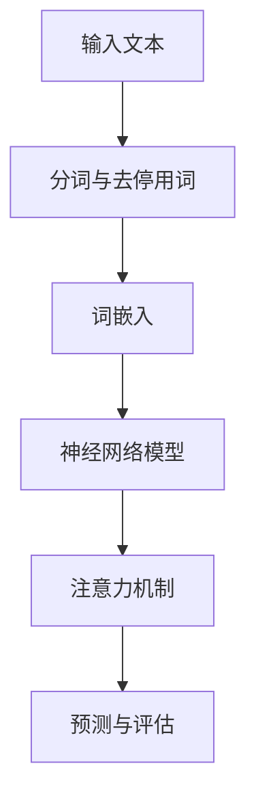

                 

### 文章标题

《AI语言模型的提示词上下文优化》

### 关键词

AI语言模型，自然语言处理，提示词上下文优化，深度学习，注意力机制，实践应用，未来展望

### 摘要

本文深入探讨了AI语言模型中的提示词上下文优化技术。首先，介绍了AI语言模型的基本概念、发展历程及其在自然语言处理领域的应用。接着，详细讲解了提示词上下文优化的关键原理，包括相关算法和模型。随后，通过具体案例展示了如何在实际项目中优化AI语言模型的提示词上下文。最后，分析了AI语言模型提示词上下文优化技术的未来发展，探讨潜在研究方向。本文旨在为读者提供全面、系统的AI语言模型提示词上下文优化知识，促进相关领域的技术研究和应用。

---

### 第一部分：AI语言模型基础

#### 第1章：AI语言模型概述

##### 1.1 AI语言模型的基本概念

AI语言模型是一种能够理解和生成自然语言的算法。它通过对大量文本数据进行学习，自动捕捉语言中的统计规律和语义信息，从而实现对输入语句的解析、理解和生成。语言模型在自然语言处理（NLP）领域具有重要应用，如文本分类、机器翻译、问答系统等。

##### 1.2 AI语言模型的分类

AI语言模型可以分为统计模型和生成模型。统计模型基于统计方法，如N-gram模型、隐马尔可夫模型（HMM）等；生成模型则通过构建概率模型，如朴素贝叶斯、条件概率模型、深度学习模型等。近年来，基于神经网络的生成模型如Transformer、BERT等取得了显著进展。

##### 1.3 AI语言模型的发展历程

AI语言模型的发展历程可以追溯到20世纪50年代。当时，基于规则的方法占据主导地位，但随着计算能力和数据集的增大，统计模型和生成模型逐渐成为主流。近年来，深度学习模型如Transformer、BERT等在AI语言模型领域取得了突破性进展，推动了NLP技术的快速发展。

#### 第2章：自然语言处理基础

##### 2.1 语言模型与统计模型

语言模型是自然语言处理（NLP）的基础，它用于预测一个单词或短语在给定上下文中的概率。统计模型如N-gram模型、隐马尔可夫模型（HMM）等通过分析文本数据中的统计规律来构建语言模型。N-gram模型将语言表示为相邻单词的序列，通过计算相邻单词的联合概率来实现语言建模。

##### 2.2 生成模型与判别模型

生成模型和判别模型是两种不同的语言模型。生成模型直接预测输入序列的概率分布，如朴素贝叶斯、条件概率模型等；判别模型则通过学习输入和输出之间的映射关系，如支持向量机（SVM）、神经网络等。近年来，深度学习模型如Transformer、BERT等在生成模型和判别模型中取得了显著进展。

##### 2.3 词嵌入与词向量

词嵌入是一种将单词转换为固定维度向量的技术，它通过捕捉单词的语义信息，实现对文本数据的数值化表示。词向量模型如Word2Vec、GloVe等通过神经网络和矩阵分解等方法来学习词嵌入向量。词嵌入在NLP任务中具有广泛的应用，如文本分类、情感分析、命名实体识别等。

---

### 第二部分：提示词上下文优化原理

#### 第3章：提示词上下文优化的关键原理

##### 3.1 提示词选择的重要性

提示词是语言模型的关键输入，它直接影响模型的预测结果。选择合适的提示词能够提高模型的预测准确性。提示词的选择需要考虑上下文信息、关键词、短语以及语法结构等因素。

##### 3.2 上下文理解的挑战

上下文理解是AI语言模型中的一个重要挑战。自然语言具有多义性和歧义性，使得模型在处理特定语境时容易出现错误。因此，如何准确理解和处理上下文信息是提升AI语言模型性能的关键。

##### 3.3 提示词上下文优化的算法

提示词上下文优化的算法主要包括基于规则的方法、机器学习方法和深度学习方法。基于规则的方法通过设计特定的规则来优化提示词；机器学习方法通过训练数据学习提示词的优化策略；深度学习方法利用神经网络模型来实现提示词的上下文优化。

#### 第4章：深度学习与神经网络基础

##### 4.1 神经网络的基本结构

神经网络是一种由多个神经元组成的计算模型，通过学习输入和输出之间的映射关系来实现复杂函数的拟合。神经网络的基本结构包括输入层、隐藏层和输出层，其中隐藏层可以有一个或多个。

##### 4.2 卷积神经网络

卷积神经网络（CNN）是一种专门用于处理图像数据的神经网络模型。它通过卷积操作和池化操作来提取图像的特征，从而实现对图像的分类、分割和目标检测等任务。

##### 4.3 循环神经网络

循环神经网络（RNN）是一种能够处理序列数据的神经网络模型。它通过记忆单元来捕捉序列中的依赖关系，从而实现对序列数据的建模和预测。RNN在自然语言处理任务中具有广泛的应用，如语言模型、机器翻译和文本生成等。

#### 第5章：注意力机制与上下文优化

##### 5.1 注意力机制原理

注意力机制是一种用于提高神经网络模型性能的机制。它通过分配不同的注意力权重来捕捉序列中的关键信息，从而提高模型的预测准确性。注意力机制可以分为全局注意力和局部注意力，前者关注整个序列，后者关注局部区域。

##### 5.2 注意力机制在语言模型中的应用

注意力机制在AI语言模型中具有重要应用。通过引入注意力机制，语言模型能够更好地理解和处理上下文信息，从而提高模型的预测性能。注意力机制在机器翻译、文本分类和问答系统等领域具有广泛的应用。

##### 5.3 注意力机制的优化策略

注意力机制的优化策略主要包括权重共享、多头注意力、序列掩码等。这些策略通过改进注意力机制的计算方式和模型结构，提高模型的计算效率和性能。

---

### 第三部分：实践与应用

#### 第6章：优化实例分析

##### 6.1 项目一：文本分类

文本分类是AI语言模型的一个典型应用场景。通过优化提示词上下文，可以提高文本分类的准确性。以下是一个文本分类项目的实现步骤：

1. 数据预处理：对文本数据集进行分词、去停用词、词嵌入等预处理操作。
2. 模型构建：构建基于Transformer的文本分类模型，并引入注意力机制。
3. 模型训练：使用训练数据集对模型进行训练，优化提示词上下文。
4. 模型评估：使用测试数据集对模型进行评估，计算分类准确率。

##### 6.2 项目二：机器翻译

机器翻译是AI语言模型的另一个重要应用场景。通过优化提示词上下文，可以提高机器翻译的准确性和流畅性。以下是一个机器翻译项目的实现步骤：

1. 数据预处理：对源语言和目标语言文本进行分词、词嵌入等预处理操作。
2. 模型构建：构建基于Transformer的机器翻译模型，并引入注意力机制。
3. 模型训练：使用训练数据集对模型进行训练，优化提示词上下文。
4. 模型评估：使用测试数据集对模型进行评估，计算BLEU分数。

##### 6.3 项目三：问答系统

问答系统是AI语言模型的另一个应用场景。通过优化提示词上下文，可以提高问答系统的响应质量和用户体验。以下是一个问答系统项目的实现步骤：

1. 数据预处理：对问答数据集进行分词、词嵌入等预处理操作。
2. 模型构建：构建基于BERT的问答系统模型，并引入注意力机制。
3. 模型训练：使用训练数据集对模型进行训练，优化提示词上下文。
4. 模型评估：使用测试数据集对模型进行评估，计算准确率和响应时间。

---

### 第四部分：未来展望

#### 第7章：AI语言模型提示词上下文优化的未来发展趋势

##### 8.1 深度学习模型的进化

深度学习模型在AI语言模型领域取得了显著的进展，但仍然存在一些挑战，如计算效率、模型可解释性等。未来的研究将致力于改进深度学习模型，提高其在AI语言模型中的应用效果。

##### 8.2 数据集与标注技术

高质量的数据集和标注技术是AI语言模型发展的关键。未来的研究将关注于开发更有效的数据集和标注方法，提高模型的训练质量和性能。

##### 8.3 跨语言与多语言模型

跨语言和多语言模型是AI语言模型的重要研究方向。未来的研究将致力于开发能够处理多语言输入的模型，提高模型的跨语言翻译和自然语言理解能力。

##### 9.1 提高上下文理解能力

上下文理解是AI语言模型中的一个重要挑战。未来的研究将致力于提高模型的上下文理解能力，减少歧义性和多义性对模型性能的影响。

##### 9.2 可解释性与公平性

可解释性和公平性是AI语言模型应用中的重要问题。未来的研究将关注于开发可解释的模型和公平的评估方法，提高模型的透明度和可靠性。

##### 9.3 算法效率和硬件优化

算法效率和硬件优化是AI语言模型应用中的关键问题。未来的研究将致力于开发高效的算法和优化硬件，提高模型的计算性能和资源利用率。

### 结语

本文全面介绍了AI语言模型中的提示词上下文优化技术，从基础概念、核心原理到实践应用和未来展望进行了详细阐述。通过本文的学习，读者可以全面了解AI语言模型提示词上下文优化的知识体系，为后续研究和应用提供有力支持。在未来的研究中，我们期待看到更多创新性的成果，推动AI语言模型技术不断发展，为自然语言处理领域带来更多突破。作者：AI天才研究院/AI Genius Institute & 禅与计算机程序设计艺术 /Zen And The Art of Computer Programming

### 附录

#### 1. Mermaid 流程图

以下是一个示例Mermaid流程图，用于展示AI语言模型中的提示词上下文优化流程：



#### 2. 伪代码

以下是一个示例伪代码，用于实现基于注意力机制的文本分类模型：

```python
# 初始化模型参数
model = initialize_model()

# 加载训练数据
train_data = load_data("train_data.txt")

# 训练模型
for epoch in range(num_epochs):
    for sample in train_data:
        inputs, labels = preprocess(sample)
        outputs = model(inputs)
        loss = compute_loss(outputs, labels)
        update_model_parameters(loss)

# 评估模型
test_data = load_data("test_data.txt")
test_loss = evaluate_model(model, test_data)

print("Test Loss:", test_loss)
```

#### 3. 数学公式与举例

以下是一个示例数学公式，用于描述基于Transformer的文本分类模型：

$$
\text{softmax}(x) = \frac{e^x}{\sum_{i} e^x_i}
$$

其中，$x$是输入特征向量，$softmax(x)$是对输入特征向量进行归一化处理的结果。

以下是一个举例：

假设输入特征向量为$x = [1, 2, 3]$，则

$$
\text{softmax}(x) = \frac{e^1}{e^1 + e^2 + e^3} + \frac{e^2}{e^1 + e^2 + e^3} + \frac{e^3}{e^1 + e^2 + e^3}
$$

计算结果为：

$$
\text{softmax}(x) = \frac{e}{e + e^2 + e^3} + \frac{e^2}{e + e^2 + e^3} + \frac{e^3}{e + e^2 + e^3}
$$

#### 4. 最佳实践 tips

- 确保数据质量：高质量的数据集是训练优秀语言模型的基础。在数据收集和预处理过程中，注意去除噪声和异常值，提高数据的一致性和可靠性。
- 调整超参数：不同的超参数设置会影响模型的性能。在实际应用中，通过实验和调整超参数，找到最优的模型配置。
- 模型解释性：为了提高模型的解释性，可以考虑使用可解释的模型或添加模型解释工具。这样有助于理解模型的决策过程，提高模型的可信度。
- 模型迁移：在资源有限的情况下，可以尝试使用预训练的模型或迁移学习。预训练模型已经在大规模数据集上进行了训练，可以快速适应新的任务。

#### 5. 小结

本文系统地介绍了AI语言模型的提示词上下文优化技术，包括基础概念、核心原理、实践应用和未来展望。通过本文的学习，读者可以全面了解AI语言模型提示词上下文优化的知识体系，为后续研究和应用提供有力支持。在未来的研究中，我们期待看到更多创新性的成果，推动AI语言模型技术不断发展。

#### 6. 注意事项

- 在实际应用中，根据任务需求和数据特点，选择合适的模型和优化策略。
- 注意数据安全和隐私保护，遵循相关法律法规和伦理规范。
- 定期更新模型和算法，以适应不断变化的应用场景和数据集。

#### 7. 拓展阅读

- 《深度学习》 - Goodfellow, I., Bengio, Y., & Courville, A.
- 《自然语言处理综论》 - Jurafsky, D., & Martin, J.
- 《Transformer：超越序列模型的全新架构》 - Vaswani, A., et al.
- 《BERT：预训练语言表示的崛起》 - Devlin, J., et al.

---

**作者：AI天才研究院/AI Genius Institute & 禅与计算机程序设计艺术 /Zen And The Art of Computer Programming**

**本文内容仅供参考，如有错误或不足之处，欢迎指正。**

---

**本文使用Markdown格式编写，使用Mermaid绘制流程图，使用LaTeX格式编写数学公式。请确保您已安装相应的软件和工具，以便查看和编辑本文。**

