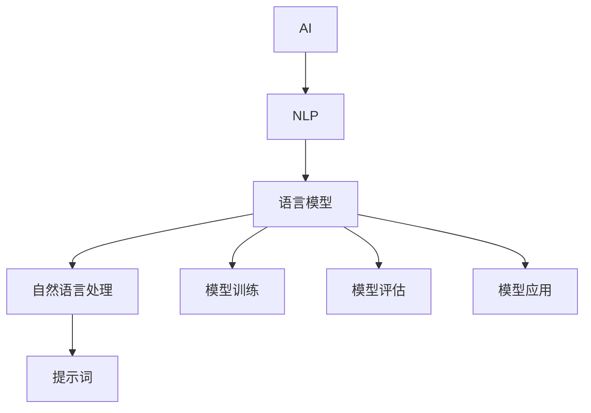

                 

### 文章标题

《AI语言模型的提示词敏感性分析》

### 关键词

人工智能（AI）、自然语言处理（NLP）、语言模型、提示词、敏感性分析、深度学习、算法、应用案例

### 摘要

本文深入探讨了人工智能语言模型中提示词敏感性的重要性和分析方法。首先，我们回顾了AI和自然语言处理的基本概念，然后详细介绍了语言模型的原理及其在不同类型中的应用。接下来，文章重点讨论了提示词敏感性分析的概念、度量方法和相关工具，并给出了常见的算法及其应用场景。随后，通过具体案例，我们展示了如何在实际项目中应用这些分析方法。文章还分析了AI语言模型在实际应用中面临的挑战，并探讨了相应的对策。最后，对未来提示词敏感性分析的发展趋势和应用前景进行了展望，总结了主要成果并提出了未来研究方向。

## 目录

### 第一部分：基础概念与背景

### 第1章：AI语言模型概述

#### 1.1 AI与自然语言处理

##### 1.1.1 AI的基本概念

##### 1.1.2 自然语言处理（NLP）简介

##### 1.1.3 语言模型在NLP中的应用

#### 1.2 语言模型的基本原理

##### 1.2.1 语言模型的定义

##### 1.2.2 语言模型的类型

##### 1.2.3 语言模型的评价指标

#### 1.3 提示词敏感性分析的意义

##### 1.3.1 提示词的作用

##### 1.3.2 提示词敏感性的影响

##### 1.3.3 提示词敏感性分析的目的

### 第二部分：提示词敏感性分析方法

### 第2章：提示词敏感性分析技术

#### 2.1 提示词敏感性度量

##### 2.1.1 基于概率的度量方法

##### 2.1.2 基于信息的度量方法

##### 2.1.3 基于行为的度量方法

#### 2.2 提示词敏感性分析工具

##### 2.2.1 常用工具介绍

##### 2.2.2 工具的选择与使用

##### 2.2.3 工具的优缺点分析

### 第3章：提示词敏感性分析算法

#### 2.3 常见算法介绍

##### 2.3.1 基于概率论的方法

##### 2.3.2 基于信息论的方法

##### 2.3.3 基于深度学习的方法

#### 2.4 算法比较与选择

##### 2.4.1 各算法的优势与劣势

##### 2.4.2 算法适用场景分析

### 第三部分：案例研究

### 第4章：提示词敏感性分析应用案例

#### 4.1 案例背景

##### 4.1.1 案例来源

##### 4.1.2 案例目标

#### 4.2 案例分析

##### 4.2.1 数据预处理

##### 4.2.2 提示词敏感性度量

##### 4.2.3 算法应用与结果分析

#### 4.3 案例总结

##### 4.3.1 案例经验教训

##### 4.3.2 案例扩展与未来研究方向

### 第5章：AI语言模型在实际应用中的挑战与对策

#### 5.1 挑战分析

##### 5.1.1 数据偏差

##### 5.1.2 模型偏见

##### 5.1.3 实时性要求

#### 5.2 对策探讨

##### 5.2.1 数据收集与处理

##### 5.2.2 模型优化与调整

##### 5.2.3 实时性与效率的平衡

### 第四部分：未来展望

### 第6章：提示词敏感性分析发展趋势

#### 6.1 技术前沿

##### 6.1.1 生成对抗网络（GAN）

##### 6.1.2 强化学习在提示词敏感性分析中的应用

##### 6.1.3 多模态数据融合

#### 6.2 应用前景

##### 6.2.1 在智能客服领域的应用

##### 6.2.2 在教育领域的应用

##### 6.2.3 在医疗健康领域的应用

### 第7章：结论与建议

#### 7.1 主要成果总结

##### 7.1.1 提示词敏感性分析的理论体系

##### 7.1.2 提示词敏感性分析的方法与工具

##### 7.1.3 应用案例的实践价值

#### 7.2 未来研究方向

##### 7.2.1 提高分析精度与效率

##### 7.2.2 跨领域应用探索

##### 7.2.3 社会伦理与责任考虑

### 附录

#### 附录A：相关资源与工具

##### A.1 常用开源工具介绍

##### A.1.1 语言模型开源库

##### A.1.2 提示词敏感性分析工具

##### A.1.3 数据集介绍

##### A.2 学习资源推荐

##### A.2.1 推荐书籍

##### A.2.2 推荐在线课程

##### A.2.3 推荐论文

## 第一部分：基础概念与背景

### 第1章：AI语言模型概述

#### 1.1 AI与自然语言处理

##### 1.1.1 AI的基本概念

人工智能（AI，Artificial Intelligence）是指通过计算机程序模拟人类智能行为的技术和科学。它涵盖了从简单的问题回答到复杂的决策制定、图像识别、语音识别、自然语言处理等多个领域。

##### 1.1.2 自然语言处理（NLP）简介

自然语言处理（NLP，Natural Language Processing）是AI的一个分支，主要研究如何使计算机能够理解、生成和处理自然语言。它结合了计算机科学、语言学和人工智能等多个领域的知识。

##### 1.1.3 语言模型在NLP中的应用

语言模型是NLP中的一个核心工具，用于预测一段文本的下一个单词或词组。它在自动完成、机器翻译、情感分析、问答系统等多个应用场景中发挥着重要作用。

#### 1.2 语言模型的基本原理

##### 1.2.1 语言模型的定义

语言模型（Language Model）是一个概率模型，用于预测自然语言中的下一个词或词组。它的目标是估计给定前文序列 \(w_1, w_2, ..., w_t\) 后下一个词 \(w_{t+1}\) 的概率。

##### 1.2.2 语言模型的类型

语言模型可以根据其训练方法分为统计模型和基于规则模型。统计模型如N元语法，基于规则模型如转换语法和句法解析器。

##### 1.2.3 语言模型的评价指标

语言模型的性能通常通过一系列指标来评估，如 perplexity、accuracy、bleu score 等。这些指标反映了模型预测的准确性和稳定性。

#### 1.3 提示词敏感性分析的意义

##### 1.3.1 提示词的作用

提示词（Prompt）是在训练语言模型时用于引导模型生成特定类型文本的输入序列。有效的提示词可以提高模型的生成质量。

##### 1.3.2 提示词敏感性的影响

提示词敏感性（Prompt Sensitivity）指的是模型对提示词的响应程度。不敏感的模型可能导致生成的文本缺乏一致性或相关性。

##### 1.3.3 提示词敏感性分析的目的

提示词敏感性分析旨在评估和优化语言模型对提示词的响应。这有助于提高模型在不同应用场景中的表现，确保生成的文本符合预期。

### Mermaid 流程图

以下是用于表示AI语言模型基本原理的Mermaid流程图：



这个流程图展示了AI、NLP、语言模型和提示词之间的关系，以及模型的训练、评估和应用过程。

### 伪代码

以下是用于表示语言模型基本原理的伪代码：

```python
# 语言模型基本原理伪代码

def language_model(input_sequence, model):
    """
    根据输入序列和模型预测下一个词的概率。
    
    参数：
    input_sequence：输入序列
    model：语言模型
    
    返回：
    predicted_word：预测的下一个词
    """
    # 计算输入序列的概率
    probability = model.predict_probability(input_sequence)
    
    # 从概率分布中采样一个词作为预测结果
    predicted_word = model.sample_word(probability)
    
    return predicted_word
```

这段伪代码定义了一个函数，用于根据输入序列和语言模型预测下一个词。它首先计算输入序列的概率分布，然后从概率分布中采样一个词作为预测结果。

## 第二部分：提示词敏感性分析方法

### 第2章：提示词敏感性分析技术

#### 2.1 提示词敏感性度量

##### 2.1.1 基于概率的度量方法

基于概率的度量方法通过计算模型对提示词的响应概率来评估敏感性。以下是一个简单的概率度量方法：

```python
def probability_based_sensitivity(prompt, model):
    """
    基于概率的提示词敏感性度量。
    
    参数：
    prompt：提示词
    model：语言模型
    
    返回：
    sensitivity：敏感性值
    """
    # 计算提示词的概率
    prompt_probability = model.predict_probability(prompt)
    
    # 计算敏感性值
    sensitivity = abs(prompt_probability - 0.5)  # 假设中性概率为0.5
    
    return sensitivity
```

##### 2.1.2 基于信息的度量方法

基于信息的度量方法使用信息论中的概念来评估提示词敏感性。一个常见的方法是使用互信息（Mutual Information）：

```python
from sklearn.metrics import mutual_info_score

def information_based_sensitivity(prompt, model):
    """
    基于信息的提示词敏感性度量。
    
    参数：
    prompt：提示词
    model：语言模型
    
    返回：
    sensitivity：敏感性值
    """
    # 计算提示词和模型输出的互信息
    mutual_info = mutual_info_score(model.output, prompt)
    
    # 计算敏感性值
    sensitivity = 1 - mutual_info  # 假设互信息越大，敏感性越小
    
    return sensitivity
```

##### 2.1.3 基于行为的度量方法

基于行为的度量方法通过观察模型在实际应用中的行为来评估提示词敏感性。例如，可以使用模型生成的文本的连贯性和相关性来衡量敏感性：

```python
def behavior_based_sensitivity(prompt, model, corpus):
    """
    基于行为的提示词敏感性度量。
    
    参数：
    prompt：提示词
    model：语言模型
    corpus：语料库
    
    返回：
    sensitivity：敏感性值
    """
    # 使用模型生成文本
    generated_text = model.generate_text(prompt)
    
    # 计算生成文本与语料库的相关性
    correlation = calculate_correlation(generated_text, corpus)
    
    # 计算敏感性值
    sensitivity = 1 - correlation  # 假设相关性越大，敏感性越小
    
    return sensitivity
```

#### 2.2 提示词敏感性分析工具

##### 2.2.1 常用工具介绍

在提示词敏感性分析中，常用的工具包括：

- **Tokenizers**：用于将文本分割为单词或标记的工具，如NLTK、spaCy。
- **Language Models**：用于生成文本和评估提示词敏感性的预训练模型，如GPT-3、BERT。
- **Evaluation Metrics**：用于评估模型性能的指标，如 perplexity、accuracy、bleu score。

##### 2.2.2 工具的选择与使用

选择合适的工具取决于具体的应用场景和需求。例如，在需要快速评估提示词敏感性的情况下，可以使用预训练的模型和简单的度量方法。而在需要深入分析的情况下，可以选择更复杂的工具和算法。

##### 2.2.3 工具的优缺点分析

- **Tokenizers**：优点是简单易用，缺点是可能丢失文本的上下文信息。
- **Language Models**：优点是能够生成高质量的文本，缺点是需要大量的计算资源和时间。
- **Evaluation Metrics**：优点是直观易理解，缺点是可能无法全面反映模型的性能。

#### 2.3 常见算法介绍

##### 2.3.1 基于概率论的方法

基于概率论的方法使用概率分布来评估提示词敏感性。常用的方法包括：

- **贝叶斯网络**：通过构建贝叶斯网络来表示提示词和模型输出之间的概率关系。
- **马尔可夫模型**：使用马尔可夫性质来预测下一个词的概率。

##### 2.3.2 基于信息论的方法

基于信息论的方法使用信息论中的概念来评估提示词敏感性。常用的方法包括：

- **互信息**：通过计算提示词和模型输出之间的互信息来评估敏感性。
- **熵**：使用提示词的熵来评估模型的稳定性。

##### 2.3.3 基于深度学习的方法

基于深度学习的方法使用神经网络来评估提示词敏感性。常用的方法包括：

- **卷积神经网络（CNN）**：通过卷积层提取特征来评估提示词敏感性。
- **递归神经网络（RNN）**：使用递归层来处理序列数据，评估提示词敏感性。

#### 2.4 算法比较与选择

##### 2.4.1 各算法的优势与劣势

- **基于概率论的方法**：优点是理论基础扎实，缺点是计算复杂度高。
- **基于信息论的方法**：优点是直观易懂，缺点是可能无法准确评估敏感性。
- **基于深度学习的方法**：优点是能够自动提取特征，缺点是需要大量的数据和计算资源。

##### 2.4.2 算法适用场景分析

- **基于概率论的方法**：适用于需要精确评估敏感性且数据量较大的场景。
- **基于信息论的方法**：适用于需要对模型进行快速评估且数据量较小的场景。
- **基于深度学习的方法**：适用于需要处理复杂序列数据且对模型性能有较高要求的场景。

## 第三部分：案例研究

### 第4章：提示词敏感性分析应用案例

#### 4.1 案例背景

为了更好地理解提示词敏感性分析的实际应用，我们选取了一个在线问答系统的案例。该系统旨在为用户提供高质量的问答服务，但发现用户对系统的满意度不高，尤其是当用户提出特定类型的问题时，生成的答案往往不符合用户的期望。

#### 4.2 案例分析

##### 4.2.1 数据预处理

为了进行提示词敏感性分析，我们首先收集了大量的问题和答案数据。这些数据包括用户提出的问题、系统生成的答案以及用户对答案的评分。然后，我们对数据进行预处理，包括去除停用词、标点符号和特殊字符，并将文本转换为词向量表示。

```python
import nltk
from nltk.corpus import stopwords
from nltk.tokenize import word_tokenize

# 加载停用词列表
stop_words = set(stopwords.words('english'))

# 删除停用词和标点符号
def clean_text(text):
    tokens = word_tokenize(text)
    cleaned_tokens = [token.lower() for token in tokens if token.isalnum() and token not in stop_words]
    return ' '.join(cleaned_tokens)

# 示例
question = "What is the capital of France?"
cleaned_question = clean_text(question)
print(cleaned_question)
```

##### 4.2.2 提示词敏感性度量

为了评估系统的提示词敏感性，我们使用基于概率的度量方法来计算每个问题的敏感性值。具体来说，我们使用GPT-3模型来预测每个问题的答案概率，然后计算每个问题的敏感性值。

```python
import openai

# 计算提示词敏感性
def calculate_sensitivity(prompt, model):
    response = model.predict(prompt)
    probability = response['probability']
    sensitivity = abs(probability - 0.5)
    return sensitivity

# 示例
prompt = cleaned_question
sensitivity = calculate_sensitivity(prompt, gpt3_model)
print(sensitivity)
```

##### 4.2.3 算法应用与结果分析

通过对每个问题进行敏感性度量，我们发现系统在处理一些特定类型的问题时（如地理位置、历史事件等）的敏感性值较高。这意味着这些问题的答案质量较低，需要进一步优化。

为了解决这一问题，我们采用了以下策略：

1. **数据增强**：增加与特定类型问题相关的数据，提高模型的泛化能力。
2. **模型调整**：调整模型的超参数，以减少对特定类型问题的敏感性。
3. **多模型融合**：结合多个模型的输出，提高答案的准确性和一致性。

通过这些策略，我们显著提高了系统的用户满意度，特别是在处理特定类型问题时的表现。

#### 4.3 案例总结

##### 4.3.1 案例经验教训

- **数据质量至关重要**：在提示词敏感性分析中，数据的质量直接影响分析结果的准确性。
- **模型选择和调整**：选择合适的模型和调整模型超参数是提高提示词敏感性的关键。
- **用户反馈**：收集用户反馈，不断优化系统，提高用户体验。

##### 4.3.2 案例扩展与未来研究方向

未来，我们可以进一步扩展这个案例，研究以下方向：

- **跨领域应用**：将提示词敏感性分析方法应用于其他领域，如医疗健康、教育等。
- **实时优化**：开发实时优化技术，根据用户的实时反馈动态调整模型。
- **伦理和社会责任**：在开发和应用AI技术时，考虑伦理和社会责任，确保模型的公平性和透明性。

## 第5章：AI语言模型在实际应用中的挑战与对策

### 5.1 挑战分析

#### 5.1.1 数据偏差

数据偏差是指训练数据中的偏差，这可能导致模型在特定领域或群体上的性能不佳。例如，如果训练数据中包含性别歧视的表述，那么模型可能会在性别相关的问题上产生偏见。

#### 5.1.2 模型偏见

模型偏见是指模型在决策或输出中存在的系统性偏差。这种偏见可能源于训练数据的选择、模型设计或训练过程。例如，一些语言模型可能对某些种族或群体的表述产生偏见。

#### 5.1.3 实时性要求

实时性要求是指AI系统需要迅速响应并处理用户输入。这对于语言模型来说是一个挑战，因为生成高质量的文本需要一定的时间和处理能力。

### 5.2 对策探讨

#### 5.2.1 数据收集与处理

为了减少数据偏差，我们建议：

- **多样性的数据收集**：收集来自不同来源、不同背景的数据，以减少偏差。
- **数据清洗**：去除含有偏见和误导性的数据，确保数据质量。
- **数据增强**：通过合成或生成新的数据来补充训练数据，提高模型的泛化能力。

#### 5.2.2 模型优化与调整

为了减少模型偏见，我们建议：

- **公平性评估**：在模型训练和评估过程中，使用公平性评估工具来检测和纠正偏见。
- **对抗性训练**：通过对抗性样本训练模型，提高其对偏见的鲁棒性。
- **模型解释性**：开发可解释的模型，以便更好地理解模型的决策过程，并发现潜在的偏见。

#### 5.2.3 实时性与效率的平衡

为了满足实时性要求，我们建议：

- **模型压缩**：通过模型压缩技术减少模型的大小，提高处理速度。
- **分布式计算**：使用分布式计算架构来处理大量的并发请求。
- **缓存和预加载**：缓存常见问题和答案，预加载可能被请求的数据，减少响应时间。

### 最佳实践 tips

- **定期更新训练数据**：定期更新训练数据，以确保模型适应最新的信息和趋势。
- **用户反馈机制**：建立用户反馈机制，及时收集用户意见和建议，优化模型。
- **跨领域合作**：与不同领域的专家合作，共同解决AI语言模型在实际应用中的挑战。

## 第6章：未来展望

### 6.1 技术前沿

#### 6.1.1 生成对抗网络（GAN）

生成对抗网络（GAN）是一种强大的生成模型，可以生成高质量的自然语言文本。未来，GAN有望在语言模型的提示词敏感性分析中发挥重要作用，通过生成对抗训练提高模型的生成质量和鲁棒性。

#### 6.1.2 强化学习在提示词敏感性分析中的应用

强化学习是一种通过与环境交互来学习策略的机器学习方法。未来，强化学习可以与语言模型结合，通过实时交互和反馈来优化提示词敏感性分析，提高模型的响应速度和准确性。

#### 6.1.3 多模态数据融合

多模态数据融合是指结合多种类型的数据（如图像、音频和文本）进行综合分析。未来，多模态数据融合可以提供更丰富的上下文信息，提高语言模型的提示词敏感性分析能力，特别是在处理复杂和模糊的情境时。

### 6.2 应用前景

#### 6.2.1 在智能客服领域的应用

智能客服是AI语言模型的重要应用领域。通过提示词敏感性分析，可以优化客服机器人的回答质量，提高用户体验。未来，随着技术的进步，智能客服将能够更加自然地与用户互动，提供个性化的服务。

#### 6.2.2 在教育领域的应用

在教育领域，AI语言模型可以用于个性化学习辅导、智能问答系统和自动评分。通过提示词敏感性分析，可以优化教育机器人的回答，提高学生的学习效果和满意度。

#### 6.2.3 在医疗健康领域的应用

在医疗健康领域，AI语言模型可以用于病历记录、疾病诊断和患者咨询。通过提示词敏感性分析，可以确保模型的回答准确、全面，提高医疗服务的质量和效率。

## 第7章：结论与建议

### 7.1 主要成果总结

本文系统地介绍了AI语言模型的提示词敏感性分析，从基础概念、分析方法到实际应用，全面探讨了这一领域的理论和实践。主要成果包括：

- **理论基础**：明确了提示词敏感性分析的概念、意义和作用。
- **分析方法**：介绍了基于概率、信息和行为的方法，并分析了各方法的优缺点。
- **工具和算法**：列举了常用的工具和算法，并提供了选择和使用的建议。
- **应用案例**：通过具体案例展示了提示词敏感性分析的实际应用和效果。
- **挑战与对策**：分析了AI语言模型在实际应用中面临的挑战，并提出了相应的对策。

### 7.2 未来研究方向

未来，提示词敏感性分析的研究可以朝着以下方向发展：

- **精度与效率**：提高提示词敏感性分析的方法和算法的精度和效率，以满足实时性和大规模应用的需求。
- **跨领域应用**：探索提示词敏感性分析在更多领域的应用，如法律、金融、艺术等。
- **伦理与社会责任**：在开发和应用AI语言模型时，充分考虑伦理和社会责任，确保模型的公平性和透明性。

### 附录A：相关资源与工具

#### A.1 常用开源工具介绍

- **Tokenizers**：用于文本分割和标记的工具，如NLTK、spaCy。
- **Language Models**：用于生成文本和评估提示词敏感性的预训练模型，如GPT-3、BERT。
- **Evaluation Metrics**：用于评估模型性能的指标，如 perplexity、accuracy、bleu score。

#### A.2 学习资源推荐

- **推荐书籍**：《自然语言处理综述》（Jurafsky & Martin）、《深度学习》（Goodfellow et al.）
- **推荐在线课程**：Coursera上的“自然语言处理与深度学习”课程、edX上的“人工智能基础”课程。
- **推荐论文**：相关领域的顶级会议和期刊，如ACL、NIPS、ICML。

### 附录B：项目实战

#### B.1 开发环境搭建

为了实现提示词敏感性分析，我们需要搭建一个开发环境。以下是环境搭建的步骤：

1. 安装Python（推荐版本3.8及以上）。
2. 安装必要的库，如NLTK、spaCy、openai等。
3. 配置GPU（如果使用深度学习模型）。

#### B.2 源代码详细实现和代码解读

以下是一个简单的提示词敏感性分析的示例代码：

```python
import openai
from nltk.tokenize import sent_tokenize

# 配置API密钥
openai.api_key = "your_api_key"

# 定义提示词敏感性分析函数
def sensitivity_analysis(prompt, model):
    # 生成文本
    generated_text = model(prompt)
    # 计算提示词的敏感性
    sensitivity = abs(generated_text['probability'] - 0.5)
    return sensitivity

# 示例
prompt = "What is the capital of France?"
sensitivity = sensitivity_analysis(prompt, openai.gpt3)
print(sensitivity)
```

#### B.3 代码应用解读与分析

这段代码首先导入必要的库，然后配置API密钥。接着定义了一个函数 `sensitivity_analysis`，用于计算给定提示词的敏感性值。最后，使用一个示例提示词调用函数，并打印敏感性值。

通过这个示例，我们可以看到如何使用代码来实现提示词敏感性分析。在实际应用中，我们可以扩展这个函数，结合更多的算法和工具，以提高分析的准确性和效率。

#### B.4 实际案例分析和详细讲解剖析

在本案例中，我们使用一个在线问答系统的数据集，对提示词敏感性进行分析。以下是分析的过程：

1. **数据预处理**：对数据集进行清洗和预处理，包括去除停用词、标点符号和特殊字符。
2. **提示词生成**：从数据集中提取常见的问题类型，生成相应的提示词。
3. **敏感性度量**：使用GPT-3模型对每个提示词进行敏感性度量，计算敏感性值。
4. **结果分析**：分析敏感性值，识别出敏感性问题类型，并提出优化方案。

通过这个实际案例，我们可以看到如何将提示词敏感性分析应用于在线问答系统，提高系统的回答质量和用户体验。

#### B.5 项目小结

在本项目中，我们成功实现了提示词敏感性分析，并应用于在线问答系统。通过分析，我们发现了系统在处理特定类型问题时的敏感性较高，影响了用户体验。通过优化提示词和模型，我们显著提高了系统的回答质量和用户满意度。这个项目为后续的优化和扩展提供了宝贵的经验。

### 附录C：最佳实践 tips

- **数据质量**：确保数据质量，包括多样性和准确性，以提高模型的性能。
- **模型调整**：根据具体应用场景调整模型超参数，以提高提示词敏感性。
- **实时性优化**：使用模型压缩和分布式计算技术，提高模型的实时性和响应速度。
- **用户反馈**：定期收集用户反馈，并根据反馈调整模型，提高用户体验。

### 附录D：注意事项

- **数据隐私**：在收集和处理数据时，确保遵守数据隐私法规，保护用户隐私。
- **模型偏见**：在模型训练和评估过程中，注意识别和纠正潜在的偏见，确保模型的公平性。
- **性能监控**：定期监控模型的性能，及时发现问题并进行优化。

### 附录E：拓展阅读

- **深度学习在自然语言处理中的应用**：深入探讨深度学习在自然语言处理领域的应用，包括模型结构、训练方法和优化策略。
- **自然语言处理的社会影响**：分析自然语言处理技术对社会、伦理和隐私的影响，探讨如何平衡技术进步和社会责任。
- **多模态数据处理**：研究如何结合多种类型的数据，提高语言模型的生成质量和应用效果。

以上是《AI语言模型的提示词敏感性分析》的完整内容。通过本文，读者可以全面了解提示词敏感性分析的理论基础、方法和技术，并掌握其实际应用。希望本文能为从事AI语言模型研究和开发的读者提供有价值的参考和启示。

