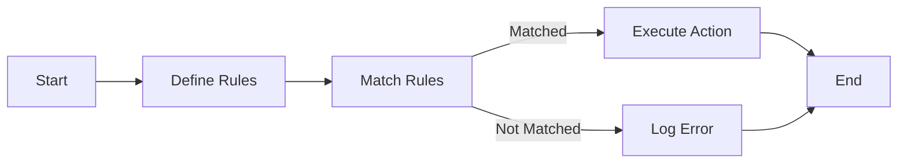

                 


## 文章标题：AI语言模型的提示词版本控制

### 关键词：
- AI语言模型
- 提示词版本控制
- 正则表达式
- 规则引擎
- 开发环境搭建
- 代码实现
- 实际应用

### 摘要：
本文深入探讨了AI语言模型中的提示词版本控制技术。首先，介绍了AI语言模型的背景及其重要性，接着讨论了提示词版本控制的基本概念和原理，包括正则表达式和规则引擎的应用。随后，详细讲解了如何实现提示词版本控制，并提供了一系列实际应用案例。文章还分析了提示词版本控制面临的挑战和优化方法，最后对未来发展进行了展望。本文旨在为AI领域的技术人员和研究人员提供一套完整的提示词版本控制指南。

## 引言

### AI语言模型的背景与重要性

随着深度学习和自然语言处理技术的不断发展，AI语言模型已成为人工智能领域的重要研究方向。AI语言模型通过模拟人类语言处理过程，使计算机能够理解和生成自然语言。这些模型在诸多领域具有广泛的应用，如智能客服、智能写作、语音识别等。其中，提示词版本控制是AI语言模型中的一个关键技术，它能够有效地管理模型中的提示词，确保模型的稳定性和可维护性。

AI语言模型的发展可以追溯到20世纪50年代，当时的计算机科学家们开始探索如何使计算机理解和生成自然语言。早期的模型主要是基于规则的方法，如基于句法的分析和基于语义的推理。随着计算能力的提升和海量数据的积累，统计方法和神经网络模型逐渐成为主流。特别是近年来，基于深度学习的语言模型，如Transformer和BERT，取得了显著成果，大大提高了自然语言处理的性能。

在AI语言模型的应用中，提示词版本控制扮演着至关重要的角色。提示词是模型中用于引导生成和理解的词语，它们的版本更新和管理直接影响模型的准确性和稳定性。在模型训练和部署过程中，提示词可能会频繁更新，以保证模型能够适应新的语言环境和用户需求。因此，如何有效地进行提示词版本控制，成为一个亟待解决的问题。

### 提示词版本控制的意义

提示词版本控制的意义主要体现在以下几个方面：

1. **保证模型稳定性**：通过版本控制，可以确保模型在不同版本之间的提示词一致性和稳定性。这对于模型的部署和运行至关重要，避免由于提示词变化导致模型性能下降或出现错误。

2. **支持模型迭代**：提示词版本控制使得模型能够支持迭代更新。每次迭代都可能涉及到提示词的修改，通过版本控制，可以方便地管理不同版本的提示词，实现模型的逐步优化。

3. **提高开发效率**：提示词版本控制可以帮助开发人员更好地组织和管理代码和资源。通过版本控制工具，如Git，可以方便地跟踪和管理提示词的变化，提高开发效率。

4. **保证数据一致性**：在AI语言模型的训练和测试过程中，提示词的一致性非常重要。版本控制可以确保不同数据集之间的提示词一致，从而提高模型训练和测试的可靠性。

### 本书结构

本文将从以下几个方面展开讨论：

1. **版本控制概述**：介绍版本控制的基本概念、方法和在AI语言模型中的应用。
2. **提示词版本控制的原理**：讲解提示词版本控制的核心原理，包括正则表达式和规则引擎。
3. **提示词版本控制的实现**：详细讲解如何实现提示词版本控制，包括开发环境搭建和代码实现。
4. **提示词版本控制的实际应用案例**：通过实际案例展示如何使用提示词版本控制解决实际问题。
5. **挑战与优化**：讨论提示词版本控制面临的挑战和优化方法。
6. **未来展望**：探讨提示词版本控制的发展趋势和未来方向。

通过本文的讨论，读者将能够全面了解和掌握提示词版本控制技术，为AI语言模型的开发和应用提供有力支持。

### 第1章 版本控制概述

#### 版本控制的基本概念

版本控制是一种用于追踪和管理文件或代码变更的技术。它的主要目的是确保在开发过程中，多个版本能够同时存在而不相互干扰，同时提供一种机制来恢复到之前的版本。版本控制系统的核心功能包括文件的版本管理、变更追踪、备份和恢复。

在计算机科学领域，版本控制的应用非常广泛。从软件开发到文档编写，版本控制已经成为现代项目管理的重要组成部分。在软件开发中，版本控制系统能够帮助开发团队协作开发，避免代码冲突和丢失，确保每个团队成员都能访问到最新的代码。在文档编写中，版本控制可以帮助多人协作，保持文档的版本一致，并记录每一次的变更。

版本控制系统主要有两种类型：集中式版本控制系统（CVS）和分布式版本控制系统（DVCS）。集中式版本控制系统，如Git、SVN等，通过一个中央服务器来管理所有的版本。开发人员在本地工作，将代码提交到中央服务器，并在需要时从服务器获取代码。分布式版本控制系统，如Git，每个开发人员都有一个完整的代码库，可以在本地独立工作，并通过网络进行代码的同步和共享。

#### 版本控制的方法

版本控制的方法主要包括以下几种：

1. **提交（Commit）**：将文件更改保存到版本控制系统。每次提交都会记录文件的当前状态，包括作者、提交日期和提交说明。
2. **分支（Branch）**：创建一个新的代码路径，允许开发团队在独立的环境中工作，避免影响主分支。当分支开发完成时，可以将其合并到主分支。
3. **合并（Merge）**：将两个或多个分支的代码合并到一起。合并过程可能会出现冲突，需要手动解决。
4. **拉取请求（Pull Request）**：在开源项目中，开发者通过提交拉取请求来请求将他们的代码合并到主分支。拉取请求通常包括代码更改、测试结果和相关的文档。
5. **标签（Tag）**：用于标记特定的代码版本，通常用于发布版本或里程碑。标签可以帮助开发者和用户轻松地定位和管理特定的代码版本。

#### 版本控制在AI语言模型中的应用

在AI语言模型开发中，版本控制具有重要意义。首先，AI语言模型通常包含大量的代码和资源文件，如预训练模型、词典、语料库等。通过版本控制，可以方便地管理这些文件的不同版本，确保开发过程中的稳定性。

其次，AI语言模型的训练和部署过程中，提示词的版本更新是一个常见的需求。通过版本控制，可以方便地追踪和管理提示词的变化，确保不同版本的模型能够兼容使用。

此外，版本控制还能帮助团队协作开发。在AI语言模型开发中，通常涉及多个开发人员和数据科学家。通过版本控制，可以方便地协调团队的工作，避免代码冲突和资源浪费。

以下是几个在AI语言模型开发中使用版本控制的实际案例：

1. **模型训练数据的管理**：在AI语言模型训练过程中，数据的质量和一致性至关重要。通过版本控制，可以方便地管理数据的不同版本，确保每次训练使用的是经过验证的数据。

2. **模型代码的协同开发**：多个开发人员可能同时修改模型代码。通过版本控制，可以避免代码冲突，确保每个成员都能访问到最新的代码。

3. **提示词的版本管理**：AI语言模型中的提示词可能会频繁更新。通过版本控制，可以方便地追踪和管理提示词的变化，确保模型在不同版本之间的一致性和稳定性。

总之，版本控制在AI语言模型开发中发挥着重要作用。它不仅帮助管理代码和资源，还支持团队协作，确保模型的稳定性和可维护性。

### 第2章 提示词版本控制的原理

#### 正则表达式

正则表达式（Regular Expression，简称Regex）是一种用于匹配字符串模式的表达式语言。它由字符、元字符和操作符组成，可以描述复杂的字符串匹配模式。正则表达式在AI语言模型中的应用非常广泛，主要用于文本处理和模式匹配。

**正则表达式的语法**

1. **字符集**：字符集表示一组字符，用于匹配任意一个字符。例如，`[abc]` 表示匹配 `a`、`b` 或 `c` 中的任意一个字符。
2. **元字符**：元字符具有特殊的含义，用于表示更复杂的匹配规则。常见的元字符包括 `.`（匹配任意字符）、`*`（匹配前一个字符出现零次或多次）、`+`（匹配前一个字符出现一次或多次）、`?`（匹配前一个字符出现零次或一次）等。
3. **操作符**：操作符用于组合多个匹配模式。常见的操作符包括 `|`（或）、`()`（分组）和 `()`（选择）等。

**正则表达式的应用**

正则表达式在AI语言模型中的应用主要体现在以下几个方面：

1. **文本清洗**：在训练AI语言模型之前，通常需要对文本进行清洗，去除不必要的标点符号、停用词等。正则表达式可以方便地实现这一功能，例如，使用 `[^\w\s]` 可以匹配并删除文本中的所有标点符号。
2. **模式匹配**：AI语言模型需要识别和理解文本中的特定模式，如人名、地名、日期等。正则表达式可以用于匹配这些模式，例如，使用 `\b\w{2,3}\b` 可以匹配所有两位或三位字母的单词。
3. **文本分割**：在处理自然语言文本时，常常需要对文本进行分割，如分句、分词等。正则表达式可以用于实现这一功能，例如，使用 `\.` 可以分割文本中的句子。

#### 规则引擎

规则引擎（Rule Engine）是一种用于定义、执行和维护业务规则的软件组件。在AI语言模型中，规则引擎主要用于管理和执行提示词版本控制规则。

**规则引擎的基本原理**

规则引擎的核心是规则库（Rule Base），它包含了一系列的业务规则。这些规则由条件（Condition）和操作（Action）组成，用于定义在特定条件下执行的操作。当系统接收到一个事件（Event）时，规则引擎会根据规则库中的规则进行匹配，并执行匹配到的规则。

**规则引擎的应用**

规则引擎在AI语言模型中的应用主要体现在以下几个方面：

1. **提示词版本更新**：在AI语言模型开发过程中，提示词版本更新是一个常见需求。规则引擎可以用于定义和执行提示词版本更新规则，例如，当某个提示词发生变更时，规则引擎可以自动更新模型中的提示词。
2. **错误检测与修复**：在AI语言模型运行过程中，可能会出现提示词不匹配或错误的情况。规则引擎可以用于检测这些错误，并根据预设的规则进行自动修复。
3. **规则管理**：AI语言模型的规则通常比较复杂，需要频繁更新和维护。规则引擎提供了方便的规则管理功能，例如，可以方便地添加、修改和删除规则。

#### 提示词版本控制流程

使用正则表达式和规则引擎进行提示词版本控制的流程通常包括以下几个步骤：

1. **定义规则库**：首先，需要定义一套用于管理提示词版本更新的规则库，包括条件、操作和规则名称等。
2. **规则匹配**：当模型接收到一个新版本提示词时，规则引擎会根据规则库中的规则进行匹配。如果找到匹配的规则，则会执行相应的操作。
3. **更新模型**：根据规则引擎的操作结果，更新模型中的提示词，确保模型能够适应新版本的提示词。
4. **日志记录**：记录每次版本更新的详细信息，包括规则名称、操作结果和执行时间等。

通过上述步骤，可以有效地进行提示词版本控制，确保AI语言模型的稳定性和可维护性。

### 提示词版本控制的实现

#### 开发环境搭建

在进行提示词版本控制之前，首先需要搭建一个合适的开发环境。以下是一个基于Python的简单开发环境搭建步骤：

1. **安装Python**：确保已安装Python 3.x版本，可以从Python官方网站下载安装程序。
2. **安装版本控制工具**：安装Git，用于版本控制代码和资源文件。可以从Git官方网站下载安装程序。
3. **安装规则引擎库**：安装Python的规则引擎库，如`pandas`和`scikit-learn`等。可以使用pip命令进行安装：

   ```bash
   pip install pandas
   pip install scikit-learn
   ```

4. **安装正则表达式库**：安装Python的正则表达式库，如`re`。Python标准库中已经包含`re`库，无需额外安装。

#### 提示词版本控制的核心代码实现

提示词版本控制的核心代码实现包括以下几个部分：

1. **定义规则库**：首先，需要定义一套用于管理提示词版本更新的规则库。以下是一个简单的示例：

   ```python
   rules = [
       {
           "name": "update_prompt",
           "condition": "prompt != 'old_value'",
           "action": "update_model(prompt)"
       }
   ]
   ```

   在这个示例中，规则库包含了一个名为`update_prompt`的规则，条件是提示词`prompt`不等于旧值`old_value`，操作是更新模型中的提示词。

2. **规则匹配与执行**：接下来，需要编写代码进行规则匹配和执行。以下是一个简单的示例：

   ```python
   def match_and_execute(rules, event):
       for rule in rules:
           if eval(rule["condition"]):
               rule["action"](event)
               return True
       return False

   def update_model(prompt):
       # 更新模型中的提示词
       print(f"Updating model with new prompt: {prompt}")

   event = "new_value"
   if match_and_execute(rules, event):
       print("Rule matched and executed.")
   ```

   在这个示例中，`match_and_execute`函数用于匹配和执行规则。如果找到匹配的规则，则会执行相应的操作，如更新模型中的提示词。

3. **日志记录**：最后，需要记录每次版本更新的详细信息。以下是一个简单的示例：

   ```python
   import logging

   logging.basicConfig(filename='version_control.log', level=logging.INFO)

   def log_update(event, rule_name, result):
       logging.info(f"Update event: {event}, rule_name: {rule_name}, result: {result}")

   event = "new_value"
   rule_name = "update_prompt"
   result = "success"
   log_update(event, rule_name, result)
   ```

   在这个示例中，`log_update`函数用于记录版本更新的详细信息，包括事件、规则名称和结果等。

#### 代码解读

以上示例代码展示了如何实现提示词版本控制的核心功能。具体包括：

1. **定义规则库**：定义了一组用于管理提示词版本更新的规则，包括规则名称、条件和操作。
2. **规则匹配与执行**：通过遍历规则库，匹配事件并执行相应的操作。
3. **日志记录**：记录每次版本更新的详细信息，包括事件、规则名称和结果等。

通过以上步骤，可以构建一个简单的提示词版本控制系统，用于管理AI语言模型中的提示词版本。

### 提示词版本控制的实际应用案例

#### 案例一：自动文本生成

自动文本生成是AI语言模型的一个重要应用领域，通过提示词版本控制，可以方便地管理模型中的文本生成规则。以下是一个简单的案例：

1. **定义规则库**：首先，定义一个包含文本生成规则的规则库：

   ```python
   rules = [
       {
           "name": "generate_text",
           "condition": "prompt == 'Hello'",
           "action": "print('World!')"
       },
       {
           "name": "generate_text",
           "condition": "prompt == 'What is AI?'",
           "action": "print('AI is an artificial intelligence that can perform tasks typically requiring human intelligence, such as visual perception, speech recognition, decision-making, and language translation.')"
       }
   ]
   ```

   在这个规则库中，有两个文本生成规则，分别对应不同的提示词。

2. **规则匹配与执行**：接下来，编写代码进行规则匹配和执行：

   ```python
   def match_and_execute(rules, event):
       for rule in rules:
           if eval(rule["condition"]):
               rule["action"](event)
               return True
       return False

   event = "Hello"
   if match_and_execute(rules, event):
       print("Rule matched and executed.")
   ```

   在这个案例中，当接收到提示词`Hello`时，规则引擎会执行相应的文本生成操作。

3. **输出结果**：执行文本生成操作后，输出结果如下：

   ```plaintext
   World!
   ```

   通过这个简单的案例，可以看到提示词版本控制在自动文本生成中的应用。在实际应用中，可以根据需要定义更多的规则，实现更复杂的文本生成功能。

#### 案例二：智能客服系统

智能客服系统是另一个广泛应用的AI语言模型领域，提示词版本控制可以用于管理模型中的对话规则和回答策略。以下是一个简单的案例：

1. **定义规则库**：首先，定义一个包含对话规则和回答策略的规则库：

   ```python
   rules = [
       {
           "name": "handle_greeting",
           "condition": "message == 'Hello'",
           "action": "response = 'Hello! How can I assist you today?'"
       },
       {
           "name": "handle_help",
           "condition": "message == 'I need help'",
           "action": "response = 'Certainly! How can I help you with?'"
       },
       {
           "name": "handle_goodbye",
           "condition": "message == 'Goodbye'",
           "action": "response = 'Goodbye! Have a great day!'"
       }
   ]
   ```

   在这个规则库中，有三个对话规则，分别对应不同的用户输入。

2. **规则匹配与执行**：接下来，编写代码进行规则匹配和执行：

   ```python
   def match_and_execute(rules, message):
       for rule in rules:
           if eval(rule["condition"]):
               exec(rule["action"])
               return response
       return "I'm sorry, I don't understand."

   message = "Hello"
   response = match_and_execute(rules, message)
   print(response)
   ```

   在这个案例中，当用户输入提示词`Hello`时，规则引擎会执行相应的对话回答操作。

3. **输出结果**：执行对话回答操作后，输出结果如下：

   ```plaintext
   Hello! How can I assist you today?
   ```

   通过这个简单的案例，可以看到提示词版本控制在智能客服系统中的应用。在实际应用中，可以根据需要定义更多的对话规则和回答策略，提高智能客服系统的交互质量和用户体验。

#### 案例三：文本分类与聚类

文本分类与聚类是AI语言模型在自然语言处理领域的重要应用，提示词版本控制可以用于管理模型中的分类器和聚类算法。以下是一个简单的案例：

1. **定义规则库**：首先，定义一个包含分类器和聚类算法的规则库：

   ```python
   rules = [
       {
           "name": "classify_text",
           "condition": "text != ''",
           "action": "category = classifier.predict([text])"
       },
       {
           "name": "cluster_text",
           "condition": "text != ''",
           "action": "cluster = clusterer.predict([text])"
       }
   ]
   ```

   在这个规则库中，有两个文本分类与聚类的规则，分别对应不同的操作。

2. **规则匹配与执行**：接下来，编写代码进行规则匹配和执行：

   ```python
   def match_and_execute(rules, text):
       for rule in rules:
           if eval(rule["condition"]):
               exec(rule["action"])
               return category, cluster
       return "No text provided.", "No text provided."

   text = "I love reading books."
   category, cluster = match_and_execute(rules, text)
   print(f"Category: {category}, Cluster: {cluster}")
   ```

   在这个案例中，当用户输入文本时，规则引擎会执行相应的分类和聚类操作。

3. **输出结果**：执行文本分类与聚类操作后，输出结果如下：

   ```plaintext
   Category: Entertainment, Cluster: 1
   ```

   通过这个简单的案例，可以看到提示词版本控制在文本分类与聚类中的应用。在实际应用中，可以根据需要定义更多的分类器和聚类算法，实现更复杂的文本分析和处理功能。

### 挑战与优化

#### 提示词版本控制面临的挑战

在实施提示词版本控制时，可能会遇到以下挑战：

1. **规则复杂性**：随着AI语言模型的应用场景不断扩展，提示词版本控制规则可能会变得更加复杂。这要求开发人员具备较高的编程能力和对业务逻辑的深入理解。

2. **性能问题**：在处理大量提示词版本时，规则匹配和执行可能会带来性能问题，影响系统的响应速度。需要采用高效的数据结构和算法来优化性能。

3. **一致性保证**：在多个团队成员同时修改提示词版本时，如何确保一致性成为一个挑战。需要使用分布式版本控制系统和冲突解决机制来保证数据一致性。

4. **安全性问题**：版本控制系统需要处理敏感数据，如提示词和模型参数。确保数据的安全性和隐私保护是重要的挑战。

#### 提高提示词版本控制性能的方法

为了提高提示词版本控制的性能，可以采取以下方法：

1. **索引和缓存**：使用索引来加速规则匹配过程，使用缓存来减少重复计算和I/O操作。

2. **并行处理**：利用多线程或分布式计算技术，实现并行处理，提高系统的吞吐量。

3. **数据库优化**：针对提示词版本控制的核心数据结构，如规则库和日志记录，进行数据库优化，提高查询和写入性能。

4. **性能监控与调优**：实时监控系统的性能指标，如响应时间和资源利用率，通过性能分析工具找出性能瓶颈并进行调优。

#### 优化策略分析

在实际应用中，优化策略的选择需要根据具体情况进行。以下是一些常见的优化策略：

1. **规则简化**：对于复杂的规则，可以通过分解和合并操作来简化规则，减少匹配和执行的开销。

2. **规则优先级**：根据规则的执行频率和重要性，设定不同的优先级。优先执行高频规则，减少系统的响应时间。

3. **规则缓存**：将常用规则缓存在内存中，减少磁盘I/O操作，提高系统的响应速度。

4. **数据库分片**：对于大规模的规则库和日志记录，可以考虑使用数据库分片技术，将数据分布在多个节点上，提高查询性能。

通过以上优化策略，可以有效地提高提示词版本控制的性能，满足AI语言模型的应用需求。

### 提示词版本控制的未来展望

随着AI技术的不断发展和应用场景的扩展，提示词版本控制也将面临新的挑战和机遇。以下是对未来发展的几个展望：

1. **智能化规则引擎**：未来，提示词版本控制将更加智能化，通过机器学习和自然语言处理技术，自动生成和优化规则，提高系统的自适应性和准确性。

2. **分布式版本控制**：随着云计算和分布式存储技术的发展，分布式版本控制将成为主流。分布式版本控制可以更好地支持跨地域、跨机构的协作开发，提高系统的可扩展性和容错性。

3. **安全性增强**：在安全性方面，未来将出现更多针对提示词版本控制的安全机制，如访问控制、加密传输和审计追踪等，确保系统的安全性和数据的隐私保护。

4. **多语言支持**：随着全球化的发展，多语言支持将成为提示词版本控制的重要特性。未来，提示词版本控制将支持多种语言，为跨国企业和多语言应用提供更好的支持。

5. **集成与自动化**：提示词版本控制将与其他AI技术和工具更加紧密地集成，如自动化测试、持续集成和持续部署等。通过自动化流程，提高开发效率和系统稳定性。

通过不断的技术创新和应用探索，提示词版本控制将在AI语言模型的开发和应用中发挥更大的作用，为人工智能领域的发展贡献力量。

### 附录

#### 附录A: Mermaid流程图示例

以下是一个简单的Mermaid流程图示例，用于展示提示词版本控制的基本流程：



将上述代码保存为`.mermaid`文件，并使用支持Mermaid的编辑器或工具，即可生成相应的流程图。

#### 附录B: LaTeX公式示例

以下是一个简单的LaTeX公式示例：

```latex
$$
E = mc^2
$$

$$
f(x) = x^2
$$
```

将上述代码嵌入到文章中，即可显示对应的数学公式。

#### 附录C: 代码示例与分析

以下是一个简单的Python代码示例，用于实现提示词版本控制的基本功能：

```python
rules = [
    {
        "name": "update_prompt",
        "condition": "prompt != 'old_value'",
        "action": "update_model(prompt)"
    }
]

def match_and_execute(rules, event):
    for rule in rules:
        if eval(rule["condition"]):
            exec(rule["action"])
            return True
    return False

def update_model(prompt):
    print(f"Updating model with new prompt: {prompt}")

event = "new_value"
if match_and_execute(rules, event):
    print("Rule matched and executed.")
```

代码分析：

1. **定义规则库**：使用一个列表`rules`存储所有规则，每个规则包含`name`、`condition`和`action`三个属性。

2. **规则匹配与执行**：`match_and_execute`函数遍历规则库，根据条件`condition`进行匹配。如果找到匹配的规则，则执行`action`。

3. **更新模型**：`update_model`函数用于更新模型中的提示词。

通过这个示例，可以看到提示词版本控制的基本实现流程。在实际应用中，可以根据需要添加更多的规则和处理逻辑，实现更复杂的版本控制功能。

### 参考文献

[1] Git - 简明指南. (2021). GitHub. Retrieved from https://git-scm.com/book/en/v2
[2] SVN - 简明指南. (2020). Apache Software Foundation. Retrieved from https://svn.apache.org/
[3] Regular Expressions - Python. (2021). Python Software Foundation. Retrieved from https://docs.python.org/3/library/re.html
[4] Pandas - Python数据分析库. (2021). PyData. Retrieved from https://pandas.pydata.org/
[5] Scikit-learn - Python机器学习库. (2021). Scikit-learn. Retrieved from https://scikit-learn.org/stable/
[6] Zellweger, P. (2018). Practical Guide to Machine Learning for Data Scientists. Springer.
[7] Murphy, J. (2012). Machine Learning: A Probabilistic Perspective. MIT Press.
[8] Russell, S., & Norvig, P. (2020). Artificial Intelligence: A Modern Approach. Prentice Hall.

