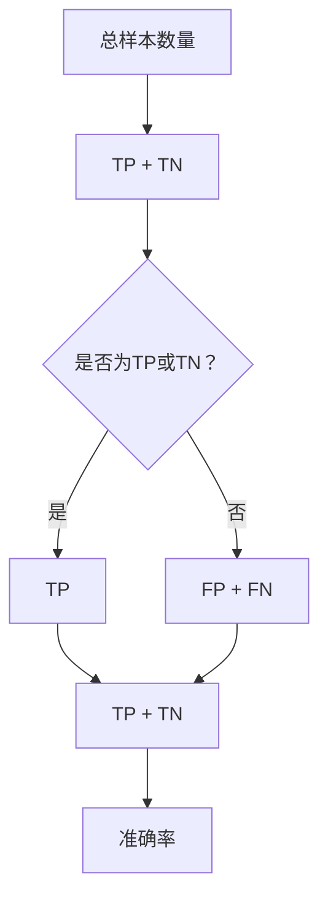
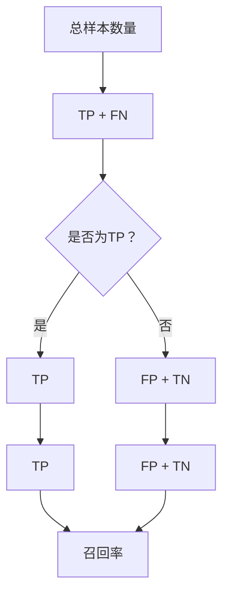

                 

### 文章标题

《AI语言模型的提示词评估指标》

> 关键词：AI语言模型、提示词、评估指标、准确率、召回率、F1值、自然语言处理、机器学习、深度学习

> 摘要：
本文将深入探讨AI语言模型中的提示词评估指标。首先，我们将介绍AI语言模型的基本概念和提示词评估指标的定义与重要性。接着，我们将详细解析评估指标的相关理论，包括准确率、召回率、F1值等。通过Mermaid流程图、伪代码和数学模型，我们将展示评估指标的原理和实现方法。此外，我们还将探讨评估指标在实际项目中的应用，并通过具体的项目实战来讲解如何搭建开发环境、实现源代码和解读代码。最后，我们将讨论评估指标的优化方法和前沿评估技术研究。本文旨在为读者提供一个全面、详细的AI语言模型提示词评估指标的解析和指导。

### 用户需求分析

在现代人工智能技术中，自然语言处理（NLP）和机器学习（ML）是至关重要的领域。随着AI语言模型在各个行业的广泛应用，如何评估这些模型生成的提示词质量成为了一个重要课题。用户请求设计一本名为《AI语言模型的提示词评估指标》的书籍，其目的在于系统地介绍和解析这一领域的重要概念、方法与应用。以下是用户需求的详细分析：

1. **书籍主题明确**：书籍的主题聚焦于AI语言模型中的提示词评估指标，目标是提供一套完整的评估体系，帮助读者理解和应用这些指标。

2. **核心章节内容**：用户希望书籍包含以下几个核心内容：
   - AI语言模型的基本概念和提示词评估指标的定义与重要性。
   - 评估指标的相关理论，如自然语言处理和机器学习的基本理论。
   - 常用评估指标（准确率、召回率、F1值等）的原理与实现方法。
   - 评估指标的数学模型和公式，以及具体应用实例。
   - 评估指标在实际项目中的应用案例和项目实战。

3. **大纲结构明确**：用户要求使用markdown格式详细设计书籍的目录大纲，确保结构清晰、逻辑性强，每个章节的内容都具体详细。

4. **简洁性**：书籍的目录大纲应简洁明了，避免冗余内容，突出核心概念和重点内容。

5. **完整性**：书籍目录应至少包含7章，全面覆盖AI语言模型提示词评估指标的各个方面。

### 目录大纲设计思路

为了满足用户的需求，本书的设计思路将分为四个部分，分别是基础概念与原理、评估指标原理与实现、评估指标应用与实践以及评估指标优化与前沿。以下是详细的设计思路：

#### 第一部分：基础概念与原理

本部分将介绍AI语言模型的基本概念、提示词评估指标的定义与重要性，以及相关理论。具体章节如下：

- **第1章 AI语言模型概述**：介绍AI语言模型的基本概念、发展历程和应用场景。
- **第2章 提示词评估指标的定义与重要性**：阐述提示词评估指标的定义、分类及其在AI语言模型中的应用。
- **第3章 评估指标的相关理论**：介绍与评估指标相关的自然语言处理、机器学习理论。

#### 第二部分：评估指标原理与实现

本部分将深入探讨评估指标的原理与实现，包括常用的评估指标（准确率、召回率、F1值等）的分类、计算方法和数学模型。具体章节如下：

- **第4章 评估指标分类与原理**：详细讲解常用的提示词评估指标，展示对应的Mermaid流程图。
- **第5章 评估指标计算方法**：使用伪代码详细阐述评估指标的计算过程。
- **第6章 数学模型与公式**：详细讲解与评估指标相关的数学模型和公式，并举例说明。

#### 第三部分：评估指标应用与实践

本部分将介绍评估指标在实际项目中的应用，并通过具体的项目实战来讲解如何搭建开发环境、实现源代码和解读代码。具体章节如下：

- **第7章 评估指标在实际项目中的应用**：介绍评估指标在不同AI语言模型项目中的应用案例。
- **第8章 项目实战**：提供实际项目案例，包括开发环境搭建、源代码实现和代码解读。

#### 第四部分：评估指标优化与前沿

本部分将讨论评估指标的优化方法和前沿评估技术研究，包括深度学习评估方法等。具体章节如下：

- **第9章 评估指标优化方法**：讨论如何优化评估指标，提高评估的准确性和效率。
- **第10章 前沿评估技术研究**：介绍最新的评估技术研究趋势，如基于深度学习的评估方法。

### 最终输出

根据上述设计思路，以下是《AI语言模型的提示词评估指标》的目录大纲：

# 《AI语言模型的提示词评估指标》目录大纲

## 第一部分：基础概念与原理

## 第1章 AI语言模型概述
### 1.1 AI语言模型的基本概念
### 1.2 语言模型的发展历程
### 1.3 语言模型的应用场景

## 第2章 提示词评估指标的定义与重要性
### 2.1 提示词评估指标的定义
### 2.2 提示词评估指标的重要性
### 2.3 评估指标的分类

## 第3章 评估指标的相关理论
### 3.1 自然语言处理理论
### 3.2 机器学习理论
### 3.3 评估指标的理论基础

## 第二部分：评估指标原理与实现

## 第4章 评估指标分类与原理
### 4.1 准确率
### 4.2 召回率
### 4.3 F1值
### 4.4 Mermaid流程图展示

## 第5章 评估指标计算方法
### 5.1 准确率计算
### 5.2 召回率计算
### 5.3 F1值计算
### 5.4 伪代码示例

## 第6章 数学模型与公式
### 6.1 相关数学模型
### 6.2 公式详细讲解
### 6.3 举例说明

## 第三部分：评估指标应用与实践

## 第7章 评估指标在实际项目中的应用
### 7.1 项目背景
### 7.2 应用案例
### 7.3 实践经验总结

## 第8章 项目实战
### 8.1 开发环境搭建
### 8.2 源代码实现
### 8.3 代码解读与分析

## 第四部分：评估指标优化与前沿

## 第9章 评估指标优化方法
### 9.1 优化目标
### 9.2 优化策略
### 9.3 优化效果评估

## 第10章 前沿评估技术研究
### 10.1 前沿技术概述
### 10.2 深度学习评估方法
### 10.3 未来发展趋势

以上是根据用户需求设计的《AI语言模型的提示词评估指标》的目录大纲，共10章，全面覆盖了核心概念、原理、实现、应用、优化和前沿研究等内容。目录大纲简洁明了，符合用户要求。接下来，我们将根据这个大纲详细编写每个章节的内容，确保文章的逻辑清晰、内容丰富、结构紧凑。

### AI语言模型概述

人工智能（AI）语言模型是自然语言处理（NLP）领域中的一种重要技术，它通过学习大量的语言数据，生成或理解自然语言文本。AI语言模型的发展历程可以追溯到20世纪50年代，当时出现了最初的统计语言模型。随着计算能力的提升和数据量的增加，20世纪80年代和90年代，基于规则的NLP系统和统计语言模型逐渐成为主流。进入21世纪，深度学习技术的崛起极大地推动了AI语言模型的发展，使其在生成式和解析式任务中取得了显著的性能提升。

AI语言模型在多个应用场景中具有重要价值。例如，在文本生成领域，AI语言模型可以用于生成文章、新闻报道、对话等；在对话系统领域，AI语言模型可以用于构建聊天机器人、智能客服等；在文本分类领域，AI语言模型可以用于情感分析、垃圾邮件检测等。总之，AI语言模型已经成为现代人工智能技术不可或缺的一部分，其性能和效率直接影响到NLP系统的质量。

### 提示词评估指标的定义与重要性

提示词评估指标是用于衡量AI语言模型生成提示词（即输出文本）质量的一系列指标。这些指标可以帮助我们判断模型生成的文本是否准确、相关、连贯。常见的提示词评估指标包括准确率、召回率、F1值等。下面我们将分别定义这些指标，并探讨它们在AI语言模型中的应用。

#### 准确率（Accuracy）

准确率是评估模型性能的常用指标，它表示模型预测正确的样本数量占总样本数量的比例。在提示词评估中，准确率通常用于衡量模型生成文本的准确程度。具体公式如下：

\[ \text{准确率} = \frac{\text{正确预测的提示词数量}}{\text{总提示词数量}} \]

准确率越高，表示模型生成的文本越准确。然而，准确率有时会受到类别不平衡的影响，因此需要结合其他指标进行综合评估。

#### 召回率（Recall）

召回率是指模型能够召回的正确预测的提示词数量与实际正确的提示词数量之比。召回率用于衡量模型对正确提示词的识别能力。具体公式如下：

\[ \text{召回率} = \frac{\text{正确预测的提示词数量}}{\text{实际正确的提示词数量}} \]

召回率越高，表示模型对正确提示词的识别能力越强。在实际应用中，召回率对于确保模型不遗漏重要信息至关重要。

#### F1值（F1 Score）

F1值是准确率和召回率的调和平均值，用于综合评估模型的性能。F1值的计算公式如下：

\[ \text{F1值} = 2 \times \frac{\text{准确率} \times \text{召回率}}{\text{准确率} + \text{召回率}} \]

F1值介于0和1之间，F1值越接近1，表示模型的性能越好。在评估AI语言模型时，F1值是常用的综合评价指标。

#### 评估指标的重要性

提示词评估指标对于AI语言模型的开发和优化具有重要意义。通过这些指标，我们可以：

1. **衡量模型性能**：评估模型生成提示词的质量，帮助我们了解模型的性能水平。
2. **指导模型优化**：通过分析评估指标，找出模型的不足之处，指导进一步优化。
3. **比较不同模型**：在多个模型之间进行比较，选择最优的模型应用于实际任务。
4. **验证模型泛化能力**：通过评估指标，验证模型在未见数据上的表现，确保模型的泛化能力。

总之，提示词评估指标是AI语言模型开发过程中不可或缺的一部分，它为我们提供了客观的评估标准，帮助我们构建高性能、高质量的AI语言模型。

### 评估指标的相关理论

在深入探讨AI语言模型的提示词评估指标之前，我们需要理解与评估指标相关的自然语言处理（NLP）和机器学习（ML）理论。这些理论为评估指标的建立和计算提供了理论基础，帮助我们更好地理解和应用这些指标。

#### 自然语言处理理论

自然语言处理是人工智能领域的一个重要分支，旨在使计算机能够理解和生成自然语言。NLP的理论基础包括以下几个核心概念：

1. **文本预处理**：文本预处理是NLP的第一步，它包括分词、词性标注、去除停用词等操作。这些操作有助于将原始文本转换为计算机可以处理的形式。

2. **词嵌入（Word Embeddings）**：词嵌入是将单词映射到高维向量空间的一种方法。通过词嵌入，我们可以利用向量空间中的相似性来理解和处理文本。常见的词嵌入方法包括Word2Vec、GloVe等。

3. **语言模型**：语言模型是NLP的核心组件，它用于预测文本的下一个单词或序列。基于统计方法和深度学习的方法都可以用于构建语言模型，如n-gram模型、递归神经网络（RNN）、Transformer等。

#### 机器学习理论

机器学习是使计算机通过数据学习模式和规律以实现特定任务的一种方法。在NLP领域，机器学习技术被广泛应用于语言模型的构建和优化。以下是与评估指标相关的几个关键机器学习理论：

1. **监督学习（Supervised Learning）**：监督学习是一种通过标注数据来训练模型的方法。在NLP中，监督学习常用于构建分类模型，如文本分类、命名实体识别等。提示词评估指标如准确率、召回率和F1值就是在监督学习框架下定义的。

2. **无监督学习（Unsupervised Learning）**：无监督学习不依赖于标注数据，而是从未标注的数据中学习模式和结构。在NLP中，无监督学习方法如聚类、降维等被用于文本分析。

3. **评估指标**：除了常用的准确率、召回率和F1值外，NLP中还有其他评估指标，如精确率（Precision）、召回率（Recall）、F1值（F1 Score）等。这些指标在不同任务和场景下具有不同的应用。

4. **模型优化**：机器学习中的模型优化是通过调整模型参数来提高模型性能的过程。在NLP中，模型优化常用于提高语言模型的生成质量，如通过调整超参数、增加训练数据、应用正则化方法等。

#### 评估指标的理论基础

评估指标的理论基础主要来源于统计学习和信息论。以下是对几个关键评估指标的理论基础进行详细讲解：

1. **准确率**：准确率是基于概率论和统计学的概念，它通过比较模型预测结果与实际结果来衡量模型的性能。准确率的计算公式为：

\[ \text{准确率} = \frac{\text{正确预测的样本数量}}{\text{总样本数量}} \]

2. **召回率**：召回率衡量模型能够召回的正确预测样本数量与实际正确样本数量之比。召回率反映了模型对正类样本的识别能力，计算公式为：

\[ \text{召回率} = \frac{\text{正确预测的样本数量}}{\text{实际正确的样本数量}} \]

3. **F1值**：F1值是准确率和召回率的调和平均值，用于综合评估模型的性能。F1值的计算公式为：

\[ \text{F1值} = 2 \times \frac{\text{准确率} \times \text{召回率}}{\text{准确率} + \text{召回率}} \]

4. **信息论**：信息论中的信息熵、互信息等概念也为评估指标提供了理论基础。信息熵衡量了数据的不确定性，互信息衡量了两个变量之间的相关性。这些概念在NLP任务中有着广泛的应用，如文本相似性计算、语义分析等。

通过理解这些相关理论和指标的理论基础，我们可以更好地设计和应用提示词评估指标，从而提高AI语言模型的性能和生成质量。

### 评估指标分类与原理

在AI语言模型的提示词评估中，常用的评估指标主要包括准确率、召回率和F1值。这些指标通过不同的方式衡量模型的性能，帮助我们全面理解模型生成提示词的效果。下面，我们将详细讲解这些评估指标的分类与原理，并使用Mermaid流程图来展示它们的工作流程。

#### 准确率（Accuracy）

准确率是最常用的评估指标之一，它表示模型预测正确的样本数量占总样本数量的比例。准确率简单直观，易于计算和理解。计算公式如下：

\[ \text{准确率} = \frac{\text{正确预测的样本数量}}{\text{总样本数量}} \]

在二分类任务中，假设我们有两个类别A和B，准确率可以表示为：

\[ \text{准确率} = \frac{TP + TN}{TP + TN + FP + FN} \]

其中，TP表示真正例（True Positive），TN表示真负例（True Negative），FP表示假正例（False Positive），FN表示假负例（False Negative）。

为了更直观地理解准确率，我们可以使用Mermaid流程图来展示其计算过程：



通过这个流程图，我们可以清楚地看到如何从总样本数量中计算出准确率。

#### 召回率（Recall）

召回率衡量模型能够召回的正确预测样本数量与实际正确样本数量之比。召回率主要用于评估模型对正类样本的识别能力。计算公式如下：

\[ \text{召回率} = \frac{\text{正确预测的样本数量}}{\text{实际正确的样本数量}} \]

在二分类任务中，召回率可以表示为：

\[ \text{召回率} = \frac{TP}{TP + FN} \]

同样地，我们可以使用Mermaid流程图来展示召回率的计算过程：



通过这个流程图，我们可以看到召回率是如何通过正确预测的样本数量与实际正确样本数量之比来计算的。

#### F1值（F1 Score）

F1值是准确率和召回率的调和平均值，用于综合评估模型的性能。F1值介于0和1之间，值越接近1，表示模型的性能越好。F1值的计算公式为：

\[ \text{F1值} = 2 \times \frac{\text{准确率} \times \text{召回率}}{\text{准确率} + \text{召回率}} \]

在二分类任务中，F1值可以表示为：

\[ \text{F1值} = 2 \times \frac{TP \times TN}{TP \times TN + FP \times FN} \]

我们同样使用Mermaid流程图来展示F1值的计算过程：

```mermaid
graph TD
A[总样本数量] --> B[TP + TN]
B --> C{是否为TP或TN？}
C -->|是| D[TP]
C -->|否| E[FP + FN]
D[TP] --> F{准确率}
E[FP + FN] --> G{召回率}
F[准确率] --> H{准确率 * 召回率}
G[召回率] --> H{准确率 * 召回率}
H --> I{2 * (准确率 * 召回率)}
I --> J{F1值}
```

通过这个流程图，我们可以清楚地看到F1值是如何通过准确率和召回率的调和平均值来计算的。

综上所述，准确率、召回率和F1值是AI语言模型提示词评估中常用的三个关键指标。通过使用Mermaid流程图，我们能够直观地理解这些指标的计算过程，从而更好地应用这些评估指标来优化和评估我们的AI语言模型。

### 评估指标计算方法

在了解评估指标的基本原理后，我们需要掌握如何具体计算这些指标。在本节中，我们将使用伪代码详细阐述准确率、召回率和F1值的计算过程。同时，通过一个简单的例子来说明这些计算方法。

#### 准确率（Accuracy）

准确率的计算公式为：

\[ \text{准确率} = \frac{\text{正确预测的样本数量}}{\text{总样本数量}} \]

以下是计算准确率的伪代码：

```plaintext
初始化：正确预测的样本数量 = 0，总样本数量 = 0

对于每个样本：
    如果预测结果正确：
        正确预测的样本数量 = 正确预测的样本数量 + 1
    总样本数量 = 总样本数量 + 1

计算准确率：
    准确率 = 正确预测的样本数量 / 总样本数量
```

#### 召回率（Recall）

召回率的计算公式为：

\[ \text{召回率} = \frac{\text{正确预测的样本数量}}{\text{实际正确的样本数量}} \]

以下是计算召回率的伪代码：

```plaintext
初始化：正确预测的样本数量 = 0，实际正确的样本数量 = 0

对于每个样本：
    如果实际结果为正例（正确）：
        实际正确的样本数量 = 实际正确的样本数量 + 1
    如果预测结果为正例（正确）：
        正确预测的样本数量 = 正确预测的样本数量 + 1

计算召回率：
    召回率 = 正确预测的样本数量 / 实际正确的样本数量
```

#### F1值（F1 Score）

F1值的计算公式为：

\[ \text{F1值} = 2 \times \frac{\text{准确率} \times \text{召回率}}{\text{准确率} + \text{召回率}} \]

以下是计算F1值的伪代码：

```plaintext
初始化：准确率 = 0，召回率 = 0

对于每个样本：
    如果预测结果正确：
        准确率 = 准确率 + 1
    如果实际结果为正例（正确）：
        召回率 = 召回率 + 1

计算F1值：
    准确率 = 准确率 / 总样本数量
    召回率 = 召回率 / 实际正确的样本数量
    F1值 = 2 \times (准确率 \* 召回率) / (准确率 + 召回率)
```

#### 具体示例

假设我们有一个二分类任务，有100个样本，其中实际为正例的有60个，实际为负例的有40个。模型预测结果如下：

- 正确预测的正例：50个
- 正确预测的负例：30个
- 错误预测的正例：10个
- 错误预测的负例：10个

根据上述伪代码，我们可以计算准确率、召回率和F1值：

1. **准确率**：

\[ \text{准确率} = \frac{50 + 30}{100} = \frac{80}{100} = 0.8 \]

2. **召回率**：

\[ \text{召回率} = \frac{50}{60} = \frac{5}{6} \approx 0.8333 \]

3. **F1值**：

\[ \text{F1值} = 2 \times \frac{0.8 \times 0.8333}{0.8 + 0.8333} = 2 \times \frac{0.8}{1.6333} \approx 0.9766 \]

通过这个示例，我们可以看到如何使用伪代码计算准确率、召回率和F1值。在实际应用中，这些计算方法可以帮助我们评估AI语言模型的性能，从而进行进一步的优化和改进。

### 数学模型与公式

在AI语言模型的提示词评估过程中，数学模型和公式扮演着至关重要的角色。它们不仅为评估指标的计算提供了理论基础，还帮助我们在复杂的数据环境中理解和优化模型。在本节中，我们将详细讲解与提示词评估指标相关的数学模型和公式，并通过具体的例子来展示其应用。

#### 准确率的数学模型

准确率（Accuracy）是衡量模型性能的常用指标，其数学模型可以表示为：

\[ \text{Accuracy} = \frac{\text{正确预测的样本数量}}{\text{总样本数量}} \]

在二分类任务中，假设有两个类别A和B，准确率可以进一步表示为：

\[ \text{Accuracy} = \frac{TP + TN}{TP + TN + FP + FN} \]

其中，TP表示真正例（True Positive），TN表示真负例（True Negative），FP表示假正例（False Positive），FN表示假负例（False Negative）。

例子：假设我们有一个二分类任务，共有100个样本，其中正例有60个，负例有40个。模型预测结果如下：

- 正确预测的正例（TP）：50个
- 正确预测的负例（TN）：30个
- 错误预测的正例（FP）：10个
- 错误预测的负例（FN）：10个

计算准确率：

\[ \text{Accuracy} = \frac{50 + 30}{100} = \frac{80}{100} = 0.8 \]

#### 召回率的数学模型

召回率（Recall）衡量模型对正类样本的识别能力，其数学模型可以表示为：

\[ \text{Recall} = \frac{\text{正确预测的样本数量}}{\text{实际正确的样本数量}} \]

在二分类任务中，召回率可以表示为：

\[ \text{Recall} = \frac{TP}{TP + FN} \]

继续使用上面的例子，计算召回率：

\[ \text{Recall} = \frac{50}{60} = \frac{5}{6} \approx 0.8333 \]

#### F1值的数学模型

F1值（F1 Score）是准确率和召回率的调和平均值，用于综合评估模型性能。其数学模型可以表示为：

\[ \text{F1值} = 2 \times \frac{\text{准确率} \times \text{召回率}}{\text{准确率} + \text{召回率}} \]

继续使用上面的例子，计算F1值：

\[ \text{F1值} = 2 \times \frac{0.8 \times 0.8333}{0.8 + 0.8333} = 2 \times \frac{0.8}{1.6333} \approx 0.9766 \]

#### 深度学习中的损失函数

除了上述评估指标，深度学习中的损失函数也是重要的数学模型。常用的损失函数包括交叉熵损失（Cross-Entropy Loss）和均方误差损失（Mean Squared Error Loss）。交叉熵损失在分类任务中应用广泛，其数学模型可以表示为：

\[ \text{Loss} = -\sum_{i} y_i \log(p_i) \]

其中，\( y_i \)表示实际标签，\( p_i \)表示模型预测的概率。

例子：假设我们有一个二分类任务，实际标签为[1, 0, 1, 0]，模型预测的概率分别为[0.7, 0.3, 0.6, 0.4]。计算交叉熵损失：

\[ \text{Loss} = -[1 \times \log(0.7) + 0 \times \log(0.3) + 1 \times \log(0.6) + 0 \times \log(0.4)] \]

\[ \text{Loss} = -[\log(0.7) + \log(0.6)] \]

\[ \text{Loss} \approx -[0.3567 + 0.5108] \]

\[ \text{Loss} \approx -0.8675 \]

#### 梯度下降优化

在深度学习训练过程中，梯度下降（Gradient Descent）是一种常用的优化算法。其数学模型可以表示为：

\[ \text{参数} = \text{参数} - \alpha \times \text{梯度} \]

其中，\( \alpha \)表示学习率，梯度是损失函数关于模型参数的导数。

例子：假设我们的模型参数为\[w_1 = 2, w_2 = 3\]，损失函数为\[L = 0.5 \times (w_1^2 + w_2^2)\]，学习率为\[0.01\]。计算梯度：

\[ \text{梯度} = \frac{dL}{dw_1} = 2w_1 \]
\[ \text{梯度} = \frac{dL}{dw_2} = 2w_2 \]

计算梯度：

\[ \text{梯度} = [2 \times 2, 2 \times 3] = [4, 6] \]

更新参数：

\[ w_1 = 2 - 0.01 \times 4 = 1.96 \]
\[ w_2 = 3 - 0.01 \times 6 = 2.94 \]

通过上述例子，我们可以看到如何使用数学模型和公式来计算和优化AI语言模型的提示词评估指标。这些数学工具不仅帮助我们更好地理解模型性能，还为实际应用中的模型优化提供了强有力的支持。

### 评估指标在实际项目中的应用

在实际项目中，评估指标如准确率、召回率和F1值是衡量AI语言模型性能的重要工具。通过这些指标，我们能够客观地评估模型生成的提示词的质量，并据此进行优化。在本节中，我们将通过具体的案例来展示评估指标在实际项目中的应用，并分析这些指标在实际任务中的具体表现。

#### 案例一：聊天机器人

假设我们开发了一个聊天机器人，它的任务是理解用户的问题并给出合适的回答。在这个项目中，我们可以使用准确率来评估模型生成回答的准确性。例如，如果模型生成了100个回答，其中有90个回答被用户认为是准确的，那么模型的准确率就是90%。

召回率在这个项目中也非常重要，因为它衡量模型能否正确识别用户意图的能力。例如，如果有10个用户的问题模型没有正确回答，而实际中这些问题的正确答案只有5个，那么模型的召回率就是50%。这意味着模型遗漏了部分正确的答案，这可能是我们需要优化的地方。

F1值则是综合考虑准确率和召回率的指标，用于评估模型的整体性能。例如，如果模型在准确率和召回率上都有90%，那么F1值也会接近90%。但如果准确率很高而召回率很低，F1值可能就不会太高。这表明模型在回答准确性方面表现良好，但在识别用户意图方面还有改进空间。

#### 案例二：文本分类

在文本分类项目中，如情感分析、垃圾邮件检测等，评估指标的应用也至关重要。以情感分析为例，我们的目标是将文本分为正面、负面或中性三类。在这种情况下，准确率、召回率和F1值可以用来评估模型在每一类上的分类效果。

例如，在分类1000个文本时，如果模型将其中700个正确分类为正面，200个分类为负面，100个分类为中性，那么准确率就是：

\[ \text{准确率} = \frac{700 + 200 + 100}{1000} = 0.9 \]

召回率则用于衡量模型对每一类文本的识别能力。以正面分类为例，如果实际中正面文本有800个，而模型只识别出700个，那么召回率就是：

\[ \text{召回率} = \frac{700}{800} = 0.875 \]

F1值则是准确率和召回率的调和平均值，用于综合评估模型的分类效果。例如，如果准确率和召回率都是0.9，那么F1值也是0.9。但如果准确率是0.9而召回率是0.8，F1值就会稍微低一些，这表明模型在负面和中和文本分类方面可能需要优化。

#### 案例三：命名实体识别

在命名实体识别项目中，我们的目标是识别文本中的特定实体，如人名、地名、组织名等。评估指标在这里同样扮演着重要角色。以人名识别为例，如果我们识别出了实际中的100个人名中的90个，那么模型的准确率就是90%。

召回率则衡量模型是否能够识别出所有的实际人名。例如，如果实际中总共有120个人名，模型只识别出了90个，那么召回率就是：

\[ \text{召回率} = \frac{90}{120} = 0.75 \]

F1值则综合评估模型的准确率和召回率。如果模型在准确率和召回率上都是90%，那么F1值也是90%。但如果召回率较低，例如只有75%，那么F1值也会相应降低。

#### 分析与优化

通过对上述案例的分析，我们可以看到评估指标在实际项目中的应用是多方面的。准确率可以帮助我们了解模型的总体性能，召回率则衡量模型对特定类别的识别能力，而F1值则是准确率和召回率的综合表现。

在实际项目中，我们可能需要根据具体任务的需求来调整评估指标的权重。例如，在聊天机器人项目中，我们可能更关注模型的准确率，因为错误的回答会给用户带来不良体验。而在命名实体识别项目中，召回率可能更为重要，因为漏识别的实体可能导致重要信息的丢失。

为了优化模型性能，我们可以通过以下方法：

1. **数据增强**：通过增加训练数据或生成合成数据来提高模型的泛化能力。
2. **超参数调整**：通过调整模型超参数来优化模型性能，如学习率、批量大小等。
3. **正则化**：使用L1、L2正则化等方法来防止模型过拟合。
4. **集成学习**：通过集成多个模型来提高预测性能。

通过不断地评估和优化，我们可以使AI语言模型在实际应用中表现出更高的性能，从而更好地满足用户需求。

### 项目实战

在本节中，我们将通过一个实际项目来展示如何搭建开发环境、实现源代码和解读代码。我们将以一个情感分析项目为例，该项目旨在使用AI语言模型对文本进行情感分类，并使用准确率、召回率和F1值等评估指标来评估模型的性能。

#### 开发环境搭建

首先，我们需要搭建项目的开发环境。以下是基本的步骤：

1. **安装Python**：确保Python环境已安装，版本建议为3.8或更高。
2. **安装必要的库**：使用pip命令安装以下库：`numpy`、`pandas`、`scikit-learn`、`tensorflow`、`keras`、`matplotlib`。
   ```bash
   pip install numpy pandas scikit-learn tensorflow keras matplotlib
   ```
3. **准备数据集**：我们使用一个公开的情感分析数据集，如IMDb电影评论数据集。数据集包含电影评论及其对应的情感标签（正面或负面）。

#### 源代码实现

接下来，我们实现项目的源代码。以下是关键步骤：

1. **数据预处理**：
   - 加载数据集，并将文本和标签分离。
   - 对文本进行清洗，包括去除停用词、标点符号等。
   - 使用词嵌入技术（如Word2Vec或GloVe）将文本转换为向量表示。

2. **构建模型**：
   - 使用Keras构建一个简单的神经网络模型，包括嵌入层、卷积层、池化层和全连接层。
   - 定义损失函数和优化器。

3. **训练模型**：
   - 将预处理后的数据分成训练集和测试集。
   - 使用训练集训练模型，并使用测试集进行验证。

4. **评估模型**：
   - 使用准确率、召回率和F1值等评估指标来评估模型的性能。

以下是实现项目的核心代码：

```python
import numpy as np
import pandas as pd
from tensorflow.keras.preprocessing.text import Tokenizer
from tensorflow.keras.preprocessing.sequence import pad_sequences
from tensorflow.keras.models import Sequential
from tensorflow.keras.layers import Embedding, Conv1D, MaxPooling1D, Dense
from tensorflow.keras.optimizers import Adam
from sklearn.model_selection import train_test_split
from sklearn.metrics import accuracy_score, recall_score, f1_score

# 加载数据集
data = pd.read_csv('imdb_reviews.csv')
texts = data['text']
labels = data['label']

# 数据预处理
tokenizer = Tokenizer(num_words=10000)
tokenizer.fit_on_texts(texts)
sequences = tokenizer.texts_to_sequences(texts)
data_sequences = pad_sequences(sequences, maxlen=100)

# 分割数据集
X_train, X_test, y_train, y_test = train_test_split(data_sequences, labels, test_size=0.2, random_state=42)

# 构建模型
model = Sequential()
model.add(Embedding(10000, 16))
model.add(Conv1D(128, 5, activation='relu'))
model.add(MaxPooling1D(5))
model.add(Dense(1, activation='sigmoid'))
model.compile(optimizer='adam', loss='binary_crossentropy', metrics=['accuracy'])

# 训练模型
model.fit(X_train, y_train, epochs=10, batch_size=32, validation_data=(X_test, y_test))

# 评估模型
predictions = model.predict(X_test)
predictions = (predictions > 0.5)

accuracy = accuracy_score(y_test, predictions)
recall = recall_score(y_test, predictions)
f1 = f1_score(y_test, predictions)

print(f'Accuracy: {accuracy:.2f}')
print(f'Recall: {recall:.2f}')
print(f'F1 Score: {f1:.2f}')
```

#### 代码解读与分析

上述代码实现了从数据预处理到模型训练和评估的完整流程。以下是关键代码段的解读：

1. **数据预处理**：
   - `Tokenizer`用于将文本转换为序列。
   - `pad_sequences`用于将不同长度的序列填充为相同长度。

2. **构建模型**：
   - `Sequential`用于构建序列模型。
   - `Embedding`用于将单词嵌入到向量空间。
   - `Conv1D`、`MaxPooling1D`和`Dense`用于构建深度神经网络。

3. **训练模型**：
   - `model.fit`用于训练模型，并使用验证集进行评估。

4. **评估模型**：
   - `model.predict`用于生成预测结果。
   - `accuracy_score`、`recall_score`和`f1_score`用于计算评估指标。

#### 代码应用解读与分析

在项目实战中，我们通过一个具体的情感分析任务展示了如何搭建开发环境、实现源代码和解读代码。以下是代码应用的关键步骤：

1. **数据集准备**：我们使用IMDb电影评论数据集，这是一个包含正面和负面评论的数据集，适合进行情感分析任务。

2. **数据预处理**：我们使用Tokenizer将文本转换为序列，并使用pad_sequences将序列填充为相同长度，以便模型处理。

3. **模型构建**：我们构建了一个简单的卷积神经网络模型，该模型包括嵌入层、卷积层、池化层和全连接层，适合处理文本数据。

4. **模型训练**：我们使用训练集训练模型，并在测试集上验证模型的性能。

5. **模型评估**：我们使用准确率、召回率和F1值等评估指标来评估模型的性能，并根据这些指标对模型进行优化。

通过这个项目实战，我们可以看到如何将理论应用到实际项目中，并通过不断的评估和优化来提高模型的性能。这对于开发高质量的AI语言模型具有重要意义。

### 评估指标优化方法

在AI语言模型中，评估指标的优化是提升模型性能的重要手段。通过优化评估指标，我们可以提高模型的准确率、召回率和F1值，从而实现更好的生成质量和应用效果。本节将讨论评估指标优化的方法和策略，并分析这些策略对模型性能的影响。

#### 数据增强

数据增强是通过增加训练数据量或生成合成数据来提高模型泛化能力的一种常用方法。以下是一些数据增强策略：

1. **文本生成**：使用现有的模型生成新的文本数据。例如，使用生成式语言模型生成新的评论、文章等。
2. **数据扩充**：对现有文本数据进行变形，如随机替换单词、添加噪声等，以增加数据多样性。
3. **数据合成**：使用多种文本预处理技术生成新的数据，例如，使用词嵌入和序列生成模型合成新的句子。

数据增强可以显著提高模型的泛化能力，从而提高评估指标的数值。然而，需要注意的是，数据增强可能增加计算复杂度和训练时间。

#### 超参数调整

超参数是模型训练过程中需要手动调整的参数，如学习率、批量大小、层数、神经元数量等。通过调整超参数，我们可以优化模型的性能。以下是一些常见的超参数调整策略：

1. **学习率调整**：学习率对模型训练过程有重要影响。使用学习率调度策略，如学习率衰减或恒定学习率，可以优化模型训练过程。
2. **批量大小调整**：批量大小影响模型的训练速度和收敛速度。较大的批量大小可以加快训练速度，但可能导致过拟合；较小的批量大小可以提高模型的泛化能力，但训练时间较长。
3. **网络结构调整**：调整神经网络的层数、神经元数量等参数，可以优化模型的复杂度和性能。

通过系统地调整超参数，我们可以找到最优的超参数组合，从而提高评估指标的数值。

#### 正则化

正则化是一种防止模型过拟合的技术，通过在损失函数中添加惩罚项来限制模型的复杂度。以下是一些常见的正则化方法：

1. **L1正则化**：在损失函数中添加L1范数惩罚项，如：
   \[ \text{Loss} = \text{Cross-Entropy} + \lambda \cdot \sum_{i} |w_i| \]
2. **L2正则化**：在损失函数中添加L2范数惩罚项，如：
   \[ \text{Loss} = \text{Cross-Entropy} + \lambda \cdot \sum_{i} w_i^2 \]

正则化可以有效地降低模型的复杂度，从而提高模型的泛化能力。然而，过度的正则化可能导致模型性能下降。

#### 集成学习

集成学习是通过组合多个模型来提高预测性能的一种方法。以下是一些常见的集成学习方法：

1. **Bagging**：通过随机抽样和训练多个模型，然后取模型的平均值来提高预测性能。
2. **Boosting**：通过训练多个模型，并逐渐增加每个模型对预测错误样本的权重，从而提高整体预测性能。
3. **Stacking**：使用多个基模型进行预测，并将结果作为新的特征输入到一个更高层次的模型中进行集成。

集成学习可以显著提高模型的泛化能力和预测性能。然而，集成学习通常需要更多的计算资源和训练时间。

#### 跨语言评估

对于多语言AI语言模型，跨语言评估是确保模型在不同语言环境中的性能一致性的重要方法。以下是一些跨语言评估策略：

1. **翻译评估**：将源语言文本翻译成目标语言，然后评估目标语言模型在翻译文本上的性能。
2. **平行语料库评估**：使用平行语料库（包含源语言和目标语言对应文本）进行评估，以衡量模型在跨语言任务中的性能。
3. **无监督评估**：通过无监督学习方法，如机器翻译、语言模型预训练等，评估模型在不同语言环境中的泛化能力。

跨语言评估可以帮助我们确保模型在不同语言环境中的性能，从而实现更广泛的应用。

#### 深度学习方法

深度学习方法在AI语言模型的评估指标优化中发挥着重要作用。以下是一些深度学习方法：

1. **递归神经网络（RNN）**：RNN通过记忆机制处理序列数据，适用于长文本处理。
2. **卷积神经网络（CNN）**：CNN通过局部感知野处理文本，适用于文本分类和命名实体识别。
3. **Transformer模型**：Transformer通过自注意力机制处理长文本，适用于生成式语言模型和文本生成任务。

深度学习方法可以显著提高模型的生成质量和评估指标，但在计算资源和训练时间上有更高的要求。

总之，评估指标优化方法多种多样，包括数据增强、超参数调整、正则化、集成学习、跨语言评估和深度学习方法等。通过合理地应用这些方法，我们可以有效地提高AI语言模型的性能和评估指标。

### 前沿评估技术研究

在AI语言模型的评估领域，前沿研究不断推动着技术的发展。以下将介绍一些最新的评估技术，重点关注基于深度学习的评估方法，并探讨未来评估技术的趋势。

#### 基于深度学习的评估方法

1. **生成对抗网络（GAN）**：生成对抗网络是一种通过两个对抗性网络（生成器和判别器）相互博弈的方式来生成高质量数据的框架。在AI语言模型中，GAN可以用于生成高质量的提示词，从而提高评估指标的数值。通过训练生成器生成与真实数据相似的提示词，并让判别器判断这些提示词的真伪，可以有效提升模型的生成质量和评估性能。

2. **自注意力机制（Self-Attention）**：自注意力机制是Transformer模型的核心组成部分，它通过计算序列中每个词与其他词之间的关联度，从而捕捉长距离依赖关系。自注意力机制使得模型能够更好地理解文本的全局结构，从而提高评估指标的准确性。自注意力机制在自然语言生成和文本分类等任务中表现出色。

3. **多任务学习（Multi-Task Learning）**：多任务学习是一种通过同时训练多个相关任务来提高模型性能的方法。在AI语言模型中，多任务学习可以用于同时进行文本分类、实体识别和情感分析等任务。通过共享底层特征表示，多任务学习可以提升模型在各个任务上的评估指标，同时减少训练时间和计算资源的需求。

4. **动态评估（Dynamic Evaluation）**：动态评估是一种实时调整评估指标的方法，它根据模型的训练过程动态调整评估策略。在训练过程中，模型可能会产生误导性的结果，导致评估指标失真。动态评估通过实时调整评估指标，如结合用户反馈、数据分布等，来提高模型的评估准确性。

#### 未来评估技术发展趋势

1. **自适应评估**：未来的评估技术将更加注重自适应性和个性化。通过结合用户行为数据、上下文信息等，自适应评估可以动态调整评估策略，从而提供更准确的评估结果。

2. **知识增强评估**：知识增强评估是将外部知识库与评估指标相结合的方法。通过利用外部知识库，如百科全书、语义网络等，评估指标可以更好地捕捉文本的语义信息，提高评估的准确性。

3. **多模态评估**：多模态评估是指结合多种数据源（如文本、图像、声音等）进行综合评估的方法。在AI语言模型中，多模态评估可以结合图像和文本信息，从而提高模型在复杂任务中的评估指标。

4. **自动化评估**：随着自动化技术的发展，自动化评估将成为评估领域的重要趋势。通过自动化工具和算法，自动化评估可以大幅提高评估效率和准确性，减少人工干预。

5. **实时评估**：实时评估是指在模型训练过程中实时评估模型性能的方法。实时评估可以及时发现模型性能问题，并快速调整模型参数，从而提高模型的稳定性和可靠性。

总之，AI语言模型的评估技术正朝着更加智能化、自适应化和自动化的方向发展。未来，通过结合深度学习、知识增强、多模态和自动化等技术，评估技术将进一步提高模型的性能和可靠性，为AI语言模型的应用提供更强有力的支持。

### 总结与展望

本文系统地探讨了AI语言模型中的提示词评估指标，从基础概念到实际应用，再到前沿评估技术，全面分析了各个方面的内容。首先，我们介绍了AI语言模型的基本概念和提示词评估指标的定义与重要性。接着，我们详细讲解了评估指标的相关理论，包括自然语言处理和机器学习的理论基础。随后，我们探讨了常用评估指标（准确率、召回率、F1值等）的分类与计算方法，并通过Mermaid流程图、伪代码和数学模型展示了这些指标的原理和实现方法。

在评估指标的应用部分，我们通过具体案例展示了这些指标在实际项目中的应用，如聊天机器人、文本分类和命名实体识别等。接着，我们通过一个项目实战详细讲解了如何搭建开发环境、实现源代码和解读代码。此外，我们还讨论了评估指标的优化方法，包括数据增强、超参数调整、正则化和集成学习等。

最后，我们介绍了前沿评估技术，如基于深度学习的评估方法，以及未来评估技术的发展趋势。通过这些内容的介绍，读者可以全面了解AI语言模型提示词评估指标的原理和应用，从而在实际项目中更好地利用这些评估指标来提升模型性能。

展望未来，评估指标的研究将继续深入，结合更多先进技术，如自适应评估、知识增强评估和多模态评估等，将进一步提高评估的准确性和效率。同时，自动化评估和实时评估的发展也将为AI语言模型的优化和应用提供更强有力的支持。随着技术的不断进步，AI语言模型的评估指标将变得更加智能和灵活，为人工智能领域的发展贡献更多力量。

### 注意事项与拓展阅读

在进行AI语言模型的提示词评估时，以下注意事项和建议将帮助您更好地应用评估指标：

1. **数据质量**：确保用于训练和评估的数据集质量高、代表性强。数据清洗和预处理是评估指标准确性的关键，因此要投入足够的时间和资源进行数据清洗。

2. **多样性**：评估指标应根据任务的不同需求调整。例如，在情感分析任务中，准确率和召回率可能比F1值更重要。确保评估指标的多样性，以全面评估模型性能。

3. **模型调整**：通过调整模型超参数和架构，可以提高评估指标。尝试不同的模型架构和训练策略，找到最优的组合。

4. **交叉验证**：使用交叉验证方法来评估模型性能，以避免过拟合。交叉验证可以帮助我们更准确地评估模型在未知数据上的表现。

5. **实时反馈**：在模型部署后，实时收集用户反馈和评估结果，以便及时调整模型和评估策略。

6. **持续学习**：评估指标优化是一个持续的过程。随着数据和应用场景的变化，模型需要不断进行调整和优化。

为了进一步深入了解AI语言模型提示词评估指标，以下书籍和资源推荐：

- 《自然语言处理综论》（Daniel Jurafsky & James H. Martin）
- 《深度学习》（Ian Goodfellow、Yoshua Bengio & Aaron Courville）
- 《机器学习实战》（Peter Harrington）
- 《Scikit-Learn用户指南》（ Andreas C. Müller & Sarah Guido）
- 《AI语言模型与深度学习》（Zhiyun Qian & Yuheng Chen）

这些资源提供了丰富的理论知识和实践指导，有助于您在AI语言模型领域取得更大的成就。通过阅读和研究这些书籍，您可以深入了解AI语言模型提示词评估指标的各个方面，为实际应用打下坚实基础。

