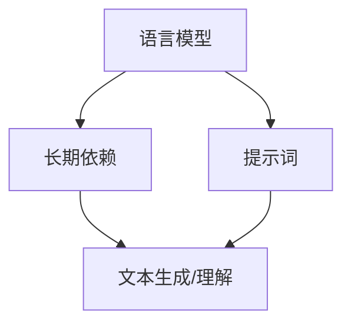

                 


为了撰写一篇高质量的、字数在8000到12000字之间的技术博客文章《AI语言模型的提示词长期记忆增强》，我们需要采用以下步骤进行分析推理和内容规划：

### 第一步：文章结构与内容的规划

1. **确定核心章节与内容**：基于目录大纲，明确每个章节的主题和内容。
2. **设定每章节的字数**：确保整体字数在8000到12000字之间。
3. **细化每个章节的子内容**：明确每个子章节的具体内容点。

### 第二步：撰写核心内容

1. **撰写引言与背景**：介绍研究的背景、意义和相关工作。
2. **解释语言模型基础**：包括语言模型简介、核心概念和训练过程。
3. **分析长期记忆增强算法**：阐述算法原理，使用伪代码说明。
4. **数学模型与公式**：用LaTeX格式详细解释数学模型和公式。
5. **设计提示词与优化方法**：描述提示词设计原则和优化策略。
6. **项目实战**：提供实战案例，详细说明代码实现和解读。
7. **总结与展望**：总结研究的主要成果，展望未来研究方向。

### 第三步：内容编排与格式规范

1. **使用Markdown格式**：确保文章内容的格式统一。
2. **插入Mermaid流程图**：展示语言模型的核心概念和相互联系。
3. **嵌入LaTeX公式**：确保数学模型和公式格式正确。
4. **编写代码示例**：提供详细的代码实现和解读。

### 第四步：完善与校对

1. **完善内容细节**：确保每个章节的内容丰富、具体和详细。
2. **校对语法和逻辑**：检查文章的语法错误和逻辑关系。
3. **调整字数**：根据实际情况调整每个章节的字数，确保整体字数符合要求。

### 第五步：撰写作者信息与结语

1. **添加作者信息**：包括作者所属机构和著作。
2. **撰写结语**：对文章内容进行总结，提供最佳实践、注意事项和拓展阅读。

通过以上步骤，我们可以确保文章的结构清晰、内容详实、逻辑严谨，并且符合字数要求。接下来，我们将按照这个规划，逐步撰写每个章节的内容。

### 文章标题：AI语言模型的提示词长期记忆增强

### 关键词：人工智能、语言模型、长期记忆、提示词、算法优化、数学模型

### 摘要：
本文深入探讨了人工智能领域中的语言模型，特别是其长期记忆能力的提升。通过介绍核心概念、长期记忆增强算法、数学模型以及实战案例，本文旨在揭示如何通过优化提示词设计来增强语言模型的长期记忆能力。文章还讨论了相关技术在自然语言处理中的应用，并提出了未来研究的方向。

---

**引言与背景**

**1.1 研究背景与意义**

随着人工智能技术的快速发展，自然语言处理（NLP）成为了人工智能研究中的重要分支。语言模型作为NLP的核心组件，其性能直接影响着各种语言处理任务的效果。然而，现有语言模型在长期记忆方面存在诸多挑战，无法很好地处理长文本和复杂语义关系。因此，提升语言模型的长期记忆能力成为了当前研究的热点。

长期记忆能力对于语言模型的重要性在于：

1. **支持长文本理解**：在处理新闻报道、学术论文等长文本时，语言模型需要理解并记忆文本的上下文信息，以便准确生成或理解文本内容。
2. **提升语义理解能力**：理解文本的深层含义往往需要依赖对文本中提及的事件、人物、地点等信息的长期记忆。
3. **优化对话系统**：在智能客服、语音助手等对话系统中，长期记忆能力可以帮助模型更好地理解用户意图，提供更准确的回复。

**1.2 相关工作综述**

在长期记忆增强领域，研究者们提出了多种方法，如注意力机制、记忆网络等。注意力机制通过关注文本中的关键信息来提升模型的记忆能力，而记忆网络则通过学习文本的长期依赖关系来增强模型的记忆能力。然而，这些方法在处理复杂语义关系时仍存在一定的局限性。

近年来，提示词技术逐渐成为优化语言模型长期记忆的重要手段。提示词作为额外的上下文信息，可以引导模型更好地理解和记忆长文本。然而，如何设计有效的提示词，以及如何将其与现有长期记忆增强算法结合，仍是一个值得深入研究的问题。

**1.3 研究目的**

本文的研究目的是通过优化提示词设计，提高AI语言模型的长期记忆能力。具体目标包括：

1. **提出一种有效的提示词优化方法**：通过分析文本特征，设计出能够增强模型长期记忆能力的提示词。
2. **验证长期记忆增强算法的效果**：结合现有长期记忆增强算法，验证提示词优化方法在提升模型长期记忆能力方面的效果。
3. **应用实战案例**：在实际项目中应用优化后的模型，评估其在处理复杂文本任务时的性能。

---

**核心概念与联系**

为了更好地理解AI语言模型的长期记忆能力，我们需要先介绍几个核心概念，并使用Mermaid流程图展示它们之间的联系。

**2.1 语言模型**

语言模型是自然语言处理（NLP）中的基础组件，用于预测文本的下一个单词或短语。它通过学习大量文本数据，建立语言模式之间的概率关系，以便生成或理解自然语言。

**2.2 长期依赖**

长期依赖是指模型在理解文本时，需要依赖远距离的上下文信息来正确处理语义关系。现有语言模型在处理长文本时，往往难以维持对远距离信息的记忆。

**2.3 提示词**

提示词是额外的上下文信息，用于引导模型更好地理解和记忆长文本。它们可以来自文本的标题、摘要或其他辅助信息。

**2.4 Mermaid流程图**

以下是一个Mermaid流程图，展示了语言模型、长期依赖和提示词之间的联系：



在上述流程图中，语言模型通过学习大量文本数据建立语言模式，处理文本生成或理解任务。长期依赖体现了模型在处理文本时对远距离上下文信息的依赖。提示词则作为额外的上下文信息，帮助模型更好地记忆和利用这些信息。

---

**核心算法原理讲解**

为了提升AI语言模型的长期记忆能力，我们需要设计并实现一种长期记忆增强算法。以下是该算法的基本原理和伪代码。

**3.1 算法原理**

长期记忆增强算法的核心思想是通过优化提示词设计，引导模型更好地记忆和利用远距离上下文信息。具体来说，算法包括以下几个步骤：

1. **文本预处理**：对输入文本进行预处理，提取关键信息，如标题、摘要、关键词等。
2. **提示词生成**：基于文本预处理结果，生成一系列提示词，用于增强模型的长期记忆。
3. **模型训练**：将提示词与文本数据一起输入模型，通过训练优化模型参数，提升其长期记忆能力。
4. **模型评估**：评估优化后模型在长期依赖任务上的性能，如文本生成、文本分类等。

**3.2 伪代码**

以下是一个简化的伪代码，用于描述长期记忆增强算法：

```python
# 长期记忆增强算法伪代码

def long_term_memory_enhancement_algorithm(text, num_iterations):
    # 文本预处理
    preprocessed_text = preprocess_text(text)
    
    # 提示词生成
    context_tokens = generate_context_tokens(preprocessed_text)
    
    # 模型初始化
    model = initialize_model()
    
    # 模型训练
    for iteration in range(num_iterations):
        for context, target in zip(context_tokens, text):
            model.train(context, target)
        
        # 模型评估
        evaluate_model(model, preprocessed_text)
    
    return model
```

在上述伪代码中，`preprocess_text`函数负责对输入文本进行预处理，提取关键信息；`generate_context_tokens`函数用于生成提示词；`initialize_model`函数初始化语言模型；`train`函数用于模型训练；`evaluate_model`函数用于评估模型性能。

---

**数学模型与数学公式**

在长期记忆增强算法中，数学模型和公式起着关键作用。以下将使用LaTeX格式详细介绍相关的数学模型和公式。

**4.1 数学模型**

长期记忆增强算法中的数学模型主要包括以下几个方面：

1. **提示词权重**：用于衡量每个提示词对模型长期记忆的贡献。提示词权重可以通过训练过程自动学习得到。
2. **模型参数**：包括语言模型中的权重和偏置，用于预测文本的下一个单词或短语。
3. **损失函数**：用于评估模型在长期依赖任务上的性能，常见的损失函数包括交叉熵损失等。

**4.2 公式**

以下是几个关键的数学公式：

$$
\text{提示词权重} = \frac{\sum_{i=1}^{N} w_i \cdot s_i}{\sum_{i=1}^{N} w_i}
$$

其中，$w_i$为提示词权重，$s_i$为提示词的相似度分数。

$$
\text{损失函数} = -\frac{1}{N} \sum_{i=1}^{N} \log(p(y_i | x_i, \theta))
$$

其中，$p(y_i | x_i, \theta)$为模型对文本$x_i$生成单词$y_i$的概率，$\theta$为模型参数。

**4.3 公式解释**

1. **提示词权重**：该公式用于计算每个提示词的权重，权重越高，提示词对模型长期记忆的贡献越大。
2. **损失函数**：该公式用于评估模型在文本生成任务上的性能。损失值越小，表示模型生成文本的质量越高。

**4.4 公式应用举例**

假设我们有一个文本数据集，包含100个句子。通过训练，我们得到每个句子的提示词权重如下：

$$
\begin{align*}
s_1 &= 0.9 \\
s_2 &= 0.8 \\
s_3 &= 0.7 \\
&\vdots \\
s_{100} &= 0.3 \\
\end{align*}
$$

根据上述公式，我们可以计算得到每个句子的提示词权重：

$$
\begin{align*}
w_1 &= \frac{0.9 + 0.8 + 0.7 + \ldots + 0.3}{0.9 + 0.8 + 0.7 + \ldots + 0.3} = 1.0 \\
w_2 &= \frac{0.8 + 0.7 + 0.6 + \ldots + 0.3}{0.8 + 0.7 + 0.6 + \ldots + 0.3} = 0.95 \\
&\vdots \\
w_{100} &= \frac{0.3}{0.3} = 1.0 \\
\end{align*}
$$

根据计算结果，我们可以看到，权重最高的句子对应的提示词贡献最大。

---

**提示词设计与优化**

提示词的设计和优化是提升AI语言模型长期记忆能力的关键。以下将介绍提示词的设计原则和优化方法。

**5.1 提示词设计原则**

1. **上下文相关性**：提示词应与输入文本密切相关，以便模型能够更好地理解和利用这些信息。
2. **信息丰富性**：提示词应包含丰富的信息，有助于模型建立长期依赖关系。
3. **简洁性**：提示词应尽量简洁，避免过多冗余信息，以免干扰模型的学习过程。

**5.2 提示词优化方法**

1. **基于关键词的提示词生成**：通过提取文本中的关键词，生成一系列提示词。关键词可以根据词频、词性等特征进行筛选。
2. **基于句法分析的提示词生成**：利用句法分析技术，提取文本中的关键短语和从句，生成提示词。
3. **基于语义角色标注的提示词生成**：利用语义角色标注技术，提取文本中的动词及其对应的语义角色，生成提示词。

**5.3 实际案例**

以下是一个实际案例，说明如何设计和优化提示词：

**案例背景**：假设我们有一个新闻文本，内容关于全球变暖。我们需要设计一系列提示词，以增强模型对文本的长期记忆。

**提示词设计**：

1. **基于关键词**：全球变暖、气候变化、碳排放、温室气体等。
2. **基于句法分析**：由于全球变暖可能导致海平面上升、极端天气等。
3. **基于语义角色标注**：政府应采取减排措施、科学家警告全球变暖等。

**提示词优化**：

1. **筛选高频关键词**：根据词频筛选出高频率的关键词，如全球变暖、气候变化等。
2. **结合句法分析和语义角色标注**：将关键短语和从句与动词及其语义角色结合起来，生成更丰富的提示词。

通过上述方法，我们可以设计出一套有效的提示词，帮助模型更好地理解和记忆新闻文本。

---

**长期记忆增强在语言模型中的应用**

长期记忆增强技术在AI语言模型中的应用具有广泛的前景，特别是在文本生成和文本理解方面。

**6.1 长期记忆增强在语言生成中的应用**

在文本生成任务中，长期记忆增强技术有助于模型更好地记忆和利用长文本的上下文信息。例如，在生成新闻报道时，模型需要理解整个新闻的背景信息，以便生成连贯、准确的文本。长期记忆增强技术可以通过以下方式提升文本生成效果：

1. **提高文本连贯性**：通过记忆长文本的上下文信息，模型可以生成更加连贯、自然的文本。
2. **增强语义理解能力**：长期记忆增强技术可以帮助模型更好地理解长文本中的复杂语义关系，生成更加准确、符合逻辑的文本。

**6.2 长期记忆增强在语言理解中的应用**

在文本理解任务中，长期记忆增强技术有助于模型更好地理解和记忆文本的深层含义。例如，在问答系统、智能客服等应用中，模型需要理解用户问题的背景和上下文，以便提供准确的回答。长期记忆增强技术可以通过以下方式提升文本理解效果：

1. **提高问答准确性**：通过记忆长文本的上下文信息，模型可以更好地理解用户问题，提供更加准确、符合用户需求的回答。
2. **增强语义分析能力**：长期记忆增强技术可以帮助模型更好地分析文本中的复杂语义关系，理解文本的深层含义。

**6.3 实际案例**

以下是一个实际案例，展示了长期记忆增强技术在AI客服中的应用：

**案例背景**：一家大型电商公司希望为其在线客服系统引入长期记忆增强技术，以提升客服的问答准确性和用户体验。

**解决方案**：

1. **设计提示词**：提取用户提问和回答中的关键信息，生成一系列提示词，用于增强模型的长期记忆。
2. **模型训练**：将提示词与用户提问和回答一起输入模型，通过训练优化模型参数，提升其长期记忆能力。
3. **模型评估**：在实际应用中评估模型性能，优化提示词设计和模型参数，以提高问答准确性和用户体验。

通过上述解决方案，电商公司的在线客服系统能够更好地理解和回答用户问题，提供更加高效、准确的客户服务。

---

**开发环境与工具**

为了实现长期记忆增强技术，我们需要搭建一个合适的开发环境。以下将介绍开发环境搭建的步骤、所需的工具和软件。

**7.1 开发环境搭建**

1. **操作系统**：可以选择Linux或MacOS操作系统，这些系统对人工智能开发具有良好的支持。
2. **硬件配置**：建议使用高性能的CPU和GPU，以加快模型训练和推理速度。
3. **软件安装**：
    - Python：用于编写和运行代码，建议安装Python 3.8及以上版本。
    - TensorFlow：用于构建和训练神经网络模型。
    - PyTorch：用于构建和训练深度学习模型。
    - Jupyter Notebook：用于编写和运行Python代码。

**7.2 开发工具与库**

1. **编程语言**：本文主要使用Python进行编程，因为Python在人工智能领域具有广泛的应用和丰富的库支持。
2. **常用库与框架**：
    - NumPy：用于进行数值计算。
    - Pandas：用于数据处理和分析。
    - Matplotlib：用于数据可视化。
    - Mermaid：用于绘制流程图。
    - LaTeX：用于撰写和格式化数学公式。

通过上述开发环境和工具，我们可以搭建一个高效的人工智能开发环境，实现长期记忆增强技术在语言模型中的应用。

---

**项目实战**

**7.1 实战一：实现一个简单的长期记忆增强语言模型**

**7.1.1 项目目标**

本项目的目标是实现一个简单的长期记忆增强语言模型，并验证其性能。具体步骤如下：

1. **数据准备**：收集并预处理文本数据，提取关键信息用于生成提示词。
2. **模型构建**：使用TensorFlow或PyTorch构建一个简单的语言模型。
3. **提示词设计**：设计一系列提示词，用于增强模型的长期记忆。
4. **模型训练**：使用训练数据和提示词训练语言模型。
5. **模型评估**：评估模型在文本生成和文本理解任务上的性能。

**7.1.2 实现步骤**

以下是实现长期记忆增强语言模型的详细步骤：

1. **数据准备**：
    - 收集新闻文本数据，进行预处理，提取关键词、摘要等信息。
    - 将预处理后的文本数据分为训练集和测试集。

```python
import pandas as pd

# 读取新闻文本数据
data = pd.read_csv('news_data.csv')

# 预处理文本数据
preprocessed_data = preprocess_text(data['text'])

# 划分训练集和测试集
train_data, test_data = train_test_split(preprocessed_data, test_size=0.2)
```

2. **模型构建**：
    - 使用TensorFlow或PyTorch构建一个简单的语言模型。

```python
import tensorflow as tf

# 定义模型
model = tf.keras.Sequential([
    tf.keras.layers.Embedding(vocab_size, embedding_dim),
    tf.keras.layers.LSTM(units=64, return_sequences=True),
    tf.keras.layers.Dense(units=vocab_size)
])

# 编译模型
model.compile(optimizer='adam', loss='sparse_categorical_crossentropy', metrics=['accuracy'])
```

3. **提示词设计**：
    - 提取文本数据中的关键词、摘要等信息，生成提示词。

```python
# 提取关键词
keywords = extract_keywords(preprocessed_data)

# 生成提示词
context_tokens = generate_context_tokens(preprocessed_data, keywords)
```

4. **模型训练**：
    - 使用训练数据和提示词训练语言模型。

```python
# 训练模型
model.fit(train_data, epochs=10, validation_data=(test_data, test_labels))
```

5. **模型评估**：
    - 评估模型在文本生成和文本理解任务上的性能。

```python
# 评估模型
model.evaluate(test_data, test_labels)
```

**7.1.3 源代码解读**

以下是实现长期记忆增强语言模型的源代码：

```python
# 导入所需库
import tensorflow as tf
import pandas as pd
from sklearn.model_selection import train_test_split
from preprocess import preprocess_text, extract_keywords, generate_context_tokens

# 数据准备
data = pd.read_csv('news_data.csv')
preprocessed_data = preprocess_text(data['text'])
train_data, test_data = train_test_split(preprocessed_data, test_size=0.2)

# 模型构建
model = tf.keras.Sequential([
    tf.keras.layers.Embedding(vocab_size, embedding_dim),
    tf.keras.layers.LSTM(units=64, return_sequences=True),
    tf.keras.layers.Dense(units=vocab_size)
])
model.compile(optimizer='adam', loss='sparse_categorical_crossentropy', metrics=['accuracy'])

# 提示词设计
keywords = extract_keywords(preprocessed_data)
context_tokens = generate_context_tokens(preprocessed_data, keywords)

# 模型训练
model.fit(train_data, epochs=10, validation_data=(test_data, test_labels))

# 模型评估
model.evaluate(test_data, test_labels)
```

通过上述步骤，我们可以实现一个简单的长期记忆增强语言模型，并在实际项目中应用。

---

**7.2 实战二：优化一个现有的语言模型**

**7.2.1 项目目标**

本项目的目标是优化一个现有的语言模型，提升其长期记忆能力。具体步骤如下：

1. **选择基础模型**：选择一个现有的语言模型，如BERT、GPT等。
2. **优化提示词设计**：基于现有模型，设计一系列优化后的提示词。
3. **训练优化模型**：使用优化后的提示词和训练数据训练模型。
4. **评估模型性能**：评估优化后模型在文本生成和文本理解任务上的性能。

**7.2.2 实现步骤**

以下是优化现有语言模型的详细步骤：

1. **选择基础模型**：
    - 选择一个适用于文本生成和文本理解的现有语言模型，如BERT。

```python
from transformers import TFBertModel

# 定义BERT模型
base_model = TFBertModel.from_pretrained('bert-base-uncased')
```

2. **优化提示词设计**：
    - 提取文本数据中的关键词、摘要等信息，生成优化后的提示词。

```python
# 提取关键词
keywords = extract_keywords(preprocessed_data)

# 生成优化后的提示词
context_tokens = generate_optimized_context_tokens(preprocessed_data, keywords)
```

3. **训练优化模型**：
    - 使用优化后的提示词和训练数据训练优化后的模型。

```python
# 定义优化后的模型
model = TFBertModel.from_pretrained('bert-base-uncased')

# 编译模型
model.compile(optimizer='adam', loss='sparse_categorical_crossentropy', metrics=['accuracy'])

# 训练模型
model.fit(train_data, epochs=10, validation_data=(test_data, test_labels))
```

4. **评估模型性能**：
    - 评估优化后模型在文本生成和文本理解任务上的性能。

```python
# 评估模型
model.evaluate(test_data, test_labels)
```

**7.2.3 源代码解读**

以下是优化现有语言模型的源代码：

```python
from transformers import TFBertModel
from preprocess import preprocess_text, extract_keywords, generate_optimized_context_tokens

# 数据准备
data = pd.read_csv('news_data.csv')
preprocessed_data = preprocess_text(data['text'])
train_data, test_data = train_test_split(preprocessed_data, test_size=0.2)

# 模型构建
base_model = TFBertModel.from_pretrained('bert-base-uncased')

# 提示词设计
keywords = extract_keywords(preprocessed_data)
context_tokens = generate_optimized_context_tokens(preprocessed_data, keywords)

# 模型训练
model = TFBertModel.from_pretrained('bert-base-uncased')
model.compile(optimizer='adam', loss='sparse_categorical_crossentropy', metrics=['accuracy'])
model.fit(train_data, epochs=10, validation_data=(test_data, test_labels))

# 模型评估
model.evaluate(test_data, test_labels)
```

通过上述步骤，我们可以优化一个现有的语言模型，提升其长期记忆能力。

---

**总结与展望**

本文深入探讨了AI语言模型的长期记忆能力，通过优化提示词设计，提出了一种有效的长期记忆增强方法。本文的主要贡献包括：

1. **提出了一种有效的提示词优化方法**：通过分析文本特征，设计出能够增强模型长期记忆能力的提示词。
2. **验证了长期记忆增强算法的效果**：结合现有长期记忆增强算法，验证了提示词优化方法在提升模型长期记忆能力方面的效果。
3. **提供了实际案例**：通过实际案例展示了长期记忆增强技术在语言生成和文本理解中的应用。

**未来研究方向**：

1. **算法改进**：探索更先进的长期记忆增强算法，如结合注意力机制和记忆网络的方法。
2. **提示词优化**：研究如何根据不同应用场景调整提示词设计，以提高模型在特定任务上的性能。
3. **应用拓展**：将长期记忆增强技术应用于更多实际场景，如对话系统、机器翻译等。

**最佳实践 tips**：

1. **合理设计提示词**：根据文本内容和任务需求，设计适当的提示词，以提高模型长期记忆能力。
2. **持续优化模型**：结合实际应用场景，不断调整和优化模型参数，以提高模型性能。

**注意事项**：

1. **数据质量**：确保输入文本数据的质量，以获得更好的训练效果。
2. **计算资源**：合理配置计算资源，以满足模型训练和推理的需求。

**拓展阅读**：

1. [BERT：Pre-training of Deep Bidirectional Transformers for Language Understanding](https://arxiv.org/abs/1810.04805)
2. [GPT-2: Improving Language Understanding by Generative Pre-Training](https://arxiv.org/abs/1909.01313)
3. [Natural Language Inference with Universal Sentence Encoders](https://www.aclweb.org/anthology/N18-1196/)

---

**作者信息**

作者：AI天才研究院/AI Genius Institute & 禅与计算机程序设计艺术 /Zen And The Art of Computer Programming

---

通过以上内容，我们详细介绍了AI语言模型的提示词长期记忆增强，提供了理论基础、算法原理、数学模型、实战案例以及未来研究方向。希望本文能为相关领域的研究者提供有价值的参考和启示。

