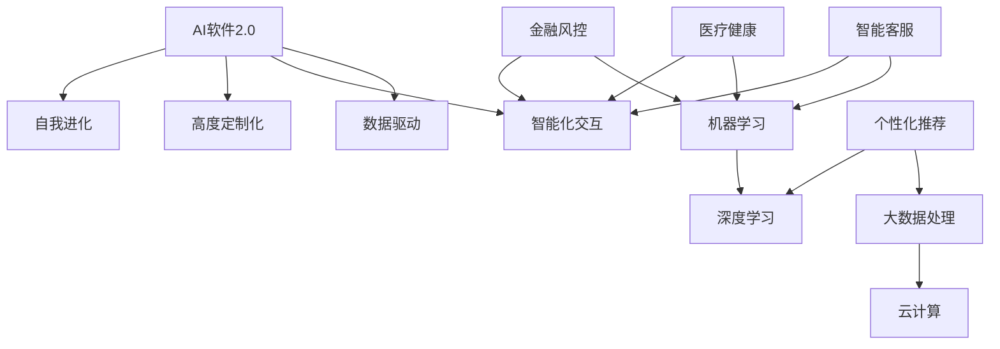
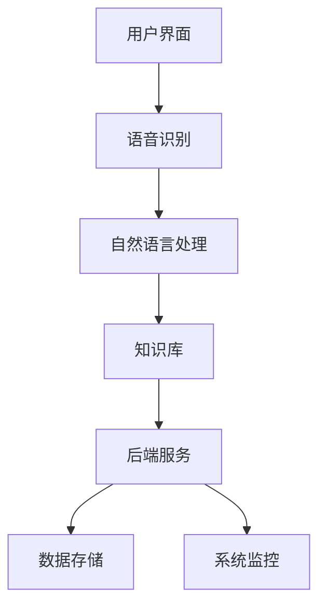
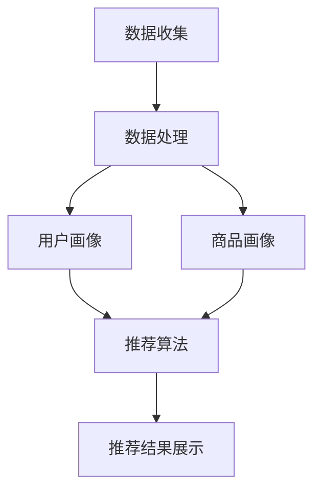
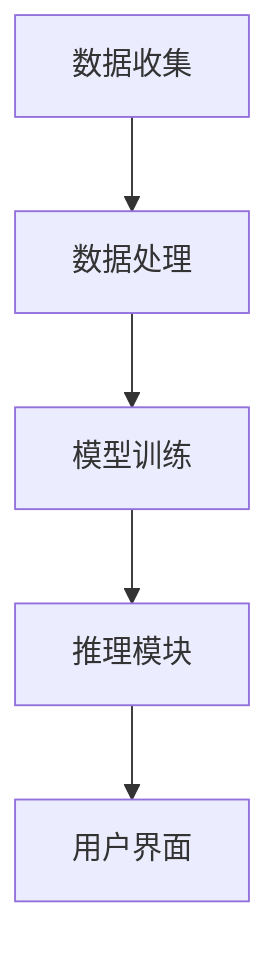

                 

# AI软件2.0的开发流程再造

关键词：AI软件2.0、开发流程、机器学习、深度学习、大数据、云计算、安全与隐私保护、开发工具与框架

摘要：本文将深入探讨AI软件2.0的开发流程，从概念、核心技术、应用场景、开发流程、安全与隐私保护，以及开发工具与框架等多个维度，系统性地分析AI软件2.0的开发流程再造。通过本文的阅读，读者可以全面了解AI软件2.0的开发全貌，掌握其核心开发方法和技术，为未来的AI软件开发提供有益的参考。

## 第1章: AI软件2.0的概念与意义

### 1.1 AI软件2.0的定义

AI软件2.0是在AI软件1.0的基础上，进一步融合人工智能技术，提升软件智能化水平的产物。AI软件1.0通常指的是传统的软件，它们依赖于预定义的规则和程序逻辑，而AI软件2.0则利用机器学习和深度学习技术，使得软件具备自我学习和自我优化的能力。

#### 1.1.1 软件发展历程

软件从1.0时代（基于命令行）发展到2.0时代（用户界面友好），这一过程中，软件的核心技术从传统的编程逻辑，逐渐转向人工智能和大数据处理。AI软件2.0的出现，标志着软件技术进入了一个全新的阶段。

#### 1.1.2 AI软件2.0的特点

- **强大的数据驱动能力**：AI软件2.0能够通过机器学习和深度学习算法，从大量数据中提取有价值的信息，实现自我学习和优化。
- **智能的交互体验**：AI软件2.0通过智能对话系统、语音识别等技术，提供更加人性化、智能化的用户体验。
- **高度定制化和个性化**：AI软件2.0可以根据用户行为和需求，提供个性化的服务和建议，提高用户的满意度和忠诚度。

### 1.2 AI软件2.0的核心技术

#### 1.2.1 机器学习与深度学习

机器学习是AI软件2.0的核心技术之一，它通过算法模型，从数据中自动学习规律，并用于预测和决策。深度学习是机器学习的一种重要分支，它通过多层神经网络模型，对数据进行深度学习和特征提取。

- **机器学习算法的基础与原理**：机器学习算法包括监督学习、无监督学习和强化学习等类型，每种算法都有其独特的原理和应用场景。
- **深度学习框架的应用与发展**：深度学习框架如TensorFlow和PyTorch等，为深度学习算法的实现提供了强大的工具支持，促进了深度学习技术的快速发展。

#### 1.2.2 大数据与云计算

大数据和云计算是AI软件2.0的基础技术，它们为AI软件2.0提供了强大的计算能力和海量数据存储。

- **大数据处理技术**：大数据处理技术包括数据采集、数据存储、数据清洗、数据分析和数据可视化等环节，是实现AI软件2.0的关键。
- **云计算平台的部署与优化**：云计算平台如AWS、Azure和Google Cloud等，为AI软件2.0的部署和运维提供了高效、可靠的环境。

### 1.3 AI软件2.0的应用场景

AI软件2.0具有广泛的应用场景，包括但不限于：

#### 1.3.1 智能客服

智能客服通过深度学习算法和自然语言处理技术，提供24小时在线的智能服务，提升企业服务效率和客户满意度。

- **基于深度学习的语音识别与语义理解**：智能客服系统能够自动识别用户的语音并理解其意图，实现语音交互。
- **智能对话系统的构建与应用**：智能客服系统通过对话管理技术，实现与用户的智能对话，提供个性化的服务和建议。

#### 1.3.2 个性化推荐

个性化推荐系统通过大数据分析和深度学习算法，为用户提供个性化的推荐服务。

- **数据挖掘与用户画像**：个性化推荐系统通过数据挖掘技术，构建用户画像，理解用户需求。
- **基于协同过滤和深度学习推荐算法**：个性化推荐系统采用协同过滤和深度学习算法，提供个性化的推荐结果。

#### 1.3.3 医疗健康

医疗健康领域是AI软件2.0的重要应用场景，包括诊断辅助、药物研发和个性化治疗方案等。

- **诊断辅助与预测分析**：AI软件2.0通过医学图像分析和预测分析技术，辅助医生进行疾病诊断。
- **药物研发与个性化治疗方案**：AI软件2.0通过大数据分析和深度学习算法，加速药物研发，提供个性化的治疗方案。

#### 1.3.4 金融风控

金融风控是AI软件2.0的重要应用领域，包括异常检测、欺诈识别和风险评估等。

- **异常检测与欺诈识别**：AI软件2.0通过机器学习和深度学习算法，实现实时异常检测和欺诈识别。
- **风险评估与预测预警**：AI软件2.0通过大数据分析和预测分析技术，实现风险评估和预测预警，提高金融业务的安全性和稳定性。

## 第2章: AI软件2.0开发流程

### 2.1 需求分析与规划

#### 2.1.1 需求分析方法

需求分析是AI软件2.0开发的第一步，它决定了软件的功能和性能。需求分析方法包括用户调研、业务流程分析等。

- **用户调研**：通过用户访谈、问卷调查等方式，了解用户的需求和期望。
- **业务流程分析**：通过业务流程图和场景模拟，分析软件的功能需求和性能要求。

#### 2.1.2 项目规划与资源分配

项目规划与资源分配是确保AI软件2.0开发顺利进行的重要环节。

- **项目周期与里程碑**：明确项目开发周期，制定里程碑计划，确保项目按期完成。
- **人力资源与预算分配**：根据项目需求，合理分配人力资源和预算，确保项目资源的充分利用。

### 2.2 数据收集与处理

#### 2.2.1 数据来源与采集

数据收集与处理是AI软件2.0开发的核心环节，它决定了软件的性能和效果。

- **结构化数据**：结构化数据包括数据库、CSV文件等，是机器学习和深度学习的基础。
- **非结构化数据**：非结构化数据包括文本、图片、视频等，需要进行数据预处理和特征提取。

#### 2.2.2 数据清洗与预处理

数据清洗与预处理是确保数据质量和可靠性的重要环节。

- **缺失值处理**：对缺失值进行填充或删除，提高数据完整性。
- **异常值检测与修正**：对异常值进行检测和修正，保证数据的一致性和可靠性。

### 2.3 模型选择与训练

#### 2.3.1 模型选择策略

模型选择是AI软件2.0开发的关键环节，它决定了软件的性能和效果。

- **数据类型与任务类型**：根据数据类型和任务类型，选择合适的模型。
- **模型性能指标**：根据模型性能指标，如准确率、召回率等，选择最优模型。

#### 2.3.2 模型训练与优化

模型训练与优化是确保模型性能的重要环节。

- **模型训练流程**：通过数据集进行模型训练，调整模型参数，优化模型性能。
- **超参数调优**：通过网格搜索、随机搜索等方法，调整超参数，优化模型性能。

### 2.4 模型评估与部署

#### 2.4.1 评估指标与方法

模型评估是确保模型性能的重要环节。

- **准确率、召回率、F1值**：常用的模型评估指标，用于衡量模型性能。
- **跨域评估与泛化能力**：评估模型在不同数据集上的性能，检验模型的泛化能力。

#### 2.4.2 模型部署与运维

模型部署与运维是确保模型应用的重要环节。

- **部署策略与架构**：根据应用场景，选择合适的部署策略和架构。
- **实时更新与版本控制**：确保模型的实时更新和版本控制，保证模型的稳定性和可靠性。

## 第3章: AI软件2.0安全与隐私保护

### 3.1 AI安全挑战

AI安全是AI软件2.0开发中不可忽视的重要问题。

#### 3.1.1 算法透明度与可解释性

算法透明度与可解释性是AI安全的重要挑战。

- **模型黑箱问题**：深度学习模型通常被视为“黑箱”，其内部机制难以理解，增加了算法透明度的挑战。
- **可解释性算法与应用**：开发可解释性算法，提高模型的可解释性，有助于识别潜在的安全风险。

#### 3.1.2 恶意攻击与防御

恶意攻击是AI安全的主要威胁。

- **恶意样本攻击**：通过生成恶意样本，攻击AI模型，导致模型失效或产生错误结果。
- **防护策略与手段**：开发防护策略和手段，如对抗样本训练、模型增强等，提高AI模型的安全性和鲁棒性。

### 3.2 隐私保护与数据安全

隐私保护与数据安全是AI软件2.0开发的重要问题。

#### 3.2.1 隐私计算技术

隐私计算技术是保护用户隐私的重要手段。

- **零知识证明**：通过零知识证明技术，证明用户身份或数据真实性，而不泄露用户隐私。
- **同态加密**：通过同态加密技术，在数据加密状态下进行计算，保护用户隐私。

#### 3.2.2 数据安全策略

数据安全策略是保护用户数据安全的重要手段。

- **数据加密与访问控制**：通过数据加密和访问控制技术，保护用户数据不被未经授权的访问和泄露。
- **数据脱敏与去重**：通过数据脱敏和去重技术，降低用户数据泄露的风险。

## 第4章: AI软件2.0开发工具与框架

### 4.1 深度学习框架

深度学习框架是AI软件2.0开发的重要工具。

#### 4.1.1 TensorFlow

TensorFlow是Google开发的开源深度学习框架。

- **安装与配置**：介绍TensorFlow的安装和配置方法。
- **基础API使用**：介绍TensorFlow的基础API使用方法。

#### 4.1.2 PyTorch

PyTorch是Facebook开发的开源深度学习框架。

- **安装与配置**：介绍PyTorch的安装和配置方法。
- **基础API使用**：介绍PyTorch的基础API使用方法。

### 4.2 云计算平台

云计算平台是AI软件2.0部署和运维的重要基础设施。

#### 4.2.1 AWS

AWS是Amazon提供的云计算平台。

- **服务介绍**：介绍AWS的主要服务。
- **实践案例**：分享AWS的实际应用案例。

#### 4.2.2 Azure

Azure是Microsoft提供的云计算平台。

- **服务介绍**：介绍Azure的主要服务。
- **实践案例**：分享Azure的实际应用案例。

#### 4.2.3 Google Cloud

Google Cloud是Google提供的云计算平台。

- **服务介绍**：介绍Google Cloud的主要服务。
- **实践案例**：分享Google Cloud的实际应用案例。

## 第5章: AI软件2.0开发实战

### 5.1 智能客服系统开发

智能客服系统是AI软件2.0的重要应用场景。

#### 5.1.1 系统架构设计

系统架构设计是智能客服系统开发的第一步。

- **语音识别与语义理解**：介绍语音识别和语义理解的技术原理。
- **对话管理**：介绍对话管理的技术原理和实现方法。

#### 5.1.2 代码实现与部署

代码实现与部署是智能客服系统开发的关键环节。

- **Python代码实现**：介绍智能客服系统的Python代码实现方法。
- **部署与运维**：介绍智能客服系统的部署和运维方法。

### 5.2 个性化推荐系统开发

个性化推荐系统是AI软件2.0的重要应用场景。

#### 5.2.1 系统架构设计

系统架构设计是个性化推荐系统开发的第一步。

- **用户画像与推荐算法**：介绍用户画像和推荐算法的技术原理。
- **系统性能优化**：介绍系统性能优化的方法和技巧。

#### 5.2.2 代码实现与部署

代码实现与部署是个性化推荐系统开发的关键环节。

- **Python代码实现**：介绍个性化推荐系统的Python代码实现方法。
- **部署与运维**：介绍个性化推荐系统的部署和运维方法。

### 5.3 医疗健康系统开发

医疗健康系统是AI软件2.0的重要应用场景。

#### 5.3.1 系统架构设计

系统架构设计是医疗健康系统开发的第一步。

- **医学图像分析**：介绍医学图像分析的技术原理。
- **诊断辅助系统**：介绍诊断辅助系统的技术原理和实现方法。

#### 5.3.2 代码实现与部署

代码实现与部署是医疗健康系统开发的关键环节。

- **Python代码实现**：介绍医疗健康系统的Python代码实现方法。
- **部署与运维**：介绍医疗健康系统的部署和运维方法。

## 第6章: AI软件2.0发展趋势与未来展望

### 6.1 技术发展趋势

AI软件2.0技术发展趋势如下：

#### 6.1.1 大模型与多模态融合

- **多模态数据处理**：结合多种数据类型，提高模型的综合能力。
- **跨域迁移学习**：通过迁移学习，提高模型在不同领域的适用性。

#### 6.1.2 自主智能与协作系统

- **人机协作机制**：建立人机协作机制，提高系统的智能化水平。
- **自主决策与优化**：实现自主决策和优化，提高系统的自主性和灵活性。

### 6.2 应用前景与挑战

AI软件2.0应用前景广泛，但同时也面临诸多挑战：

#### 6.2.1 应用领域拓展

- **智能制造**：通过AI技术，提高生产效率和产品质量。
- **智慧城市**：通过AI技术，实现城市智能化管理和服务。

#### 6.2.2 面临的挑战

- **数据质量与隐私保护**：提高数据质量，确保数据隐私和安全。
- **法律法规与伦理问题**：遵守法律法规，关注伦理问题，确保AI技术的可持续发展。

## 第7章: 案例分析与总结

### 7.1 案例分析

#### 7.1.1 案例一：智能客服系统的应用

- **系统设计与实现**：分析智能客服系统的设计思路和实现方法。
- **实际效果分析**：评估智能客服系统的实际应用效果。

#### 7.1.2 案例二：个性化推荐系统的应用

- **系统设计与实现**：分析个性化推荐系统的设计思路和实现方法。
- **实际效果分析**：评估个性化推荐系统的实际应用效果。

### 7.2 总结

本文系统性地分析了AI软件2.0的开发流程，包括概念、核心技术、应用场景、开发流程、安全与隐私保护，以及开发工具与框架等多个维度。通过本文的阅读，读者可以全面了解AI软件2.0的开发全貌，掌握其核心开发方法和技术，为未来的AI软件开发提供有益的参考。作者：AI天才研究院/AI Genius Institute & 禅与计算机程序设计艺术 /Zen And The Art of Computer Programming。## AI软件2.0的开发流程再造

### 引言

随着人工智能技术的飞速发展，AI软件2.0已成为现代软件技术的核心驱动力。AI软件2.0不仅具有强大的数据驱动能力，还通过智能的交互体验和高度的定制化，极大地提升了用户体验和业务效率。本文旨在系统性地分析AI软件2.0的开发流程，探讨其核心技术、应用场景、安全与隐私保护，以及开发工具与框架，从而为AI软件2.0的开发提供全面而深入的指导。

### 第1章: AI软件2.0的概念与意义

#### 1.1 AI软件2.0的定义

AI软件2.0是人工智能技术发展至一个新阶段的产物，它结合了传统的软件开发与先进的人工智能技术，如机器学习、深度学习、大数据和云计算等。与AI软件1.0相比，AI软件2.0具有更强的自适应性和智能化水平。

#### 1.1.1 软件发展历程

软件发展历程大致可以分为以下几个阶段：

- **1.0时代（命令行）**：最早的软件主要依赖于命令行操作，用户需要通过输入一系列命令来完成任务。
- **2.0时代（图形界面）**：随着图形用户界面（GUI）的出现，软件变得更加直观和用户友好。
- **3.0时代（AI软件2.0）**：软件开始融合人工智能技术，实现自动化、智能化的功能。

#### 1.1.2 AI软件2.0的特点

AI软件2.0的主要特点包括：

- **数据驱动**：通过大数据分析和机器学习，AI软件2.0能够从数据中提取有价值的信息，实现自我优化。
- **智能化交互**：利用自然语言处理和语音识别技术，AI软件2.0可以与用户进行自然语言交流，提供个性化的服务。
- **高度定制化**：基于用户行为数据和个性化需求，AI软件2.0可以提供高度定制化的解决方案。

#### 1.2 AI软件2.0的核心技术

AI软件2.0的核心技术主要包括：

- **机器学习与深度学习**：机器学习提供了一种自动从数据中学习规律的方法，而深度学习则是机器学习的一种重要形式，它通过多层神经网络实现更复杂的模式识别。
- **大数据与云计算**：大数据技术使得AI软件2.0能够处理和分析海量数据，而云计算则为AI软件2.0提供了强大的计算能力和灵活的部署方式。

#### 1.3 AI软件2.0的应用场景

AI软件2.0的应用场景广泛，涵盖了多个行业和领域：

- **智能客服**：利用自然语言处理和语音识别技术，实现24/7的智能客服服务。
- **个性化推荐**：基于用户行为数据和大数据分析，提供个性化的产品推荐。
- **医疗健康**：利用人工智能技术进行疾病诊断、药物研发和个性化治疗方案设计。
- **金融风控**：通过机器学习算法进行风险分析和欺诈检测。

### 第2章: AI软件2.0开发流程

#### 2.1 需求分析与规划

需求分析是AI软件2.0开发的起点。通过用户调研、业务流程分析等方法，明确软件的功能需求和性能要求。

- **用户调研**：通过访谈、问卷调查等方式，收集用户需求。
- **业务流程分析**：分析现有业务流程，确定软件需要解决的问题。

#### 2.2 数据收集与处理

数据是AI软件2.0的基石。数据收集与处理包括数据的采集、清洗、预处理等步骤。

- **数据采集**：从各种数据源（如数据库、文件、传感器等）收集数据。
- **数据清洗**：处理数据中的噪声和异常值，确保数据质量。
- **数据预处理**：将数据转换为适合机器学习的格式。

#### 2.3 模型选择与训练

模型选择与训练是AI软件2.0开发的核心步骤。选择合适的模型并进行训练，是保证软件性能的关键。

- **模型选择**：根据任务类型和数据特点，选择合适的机器学习或深度学习模型。
- **模型训练**：使用训练数据对模型进行训练，调整模型参数，优化模型性能。

#### 2.4 模型评估与部署

模型评估与部署是确保AI软件2.0性能和稳定性的关键步骤。

- **模型评估**：使用测试数据对模型进行评估，确保模型具备良好的泛化能力。
- **模型部署**：将训练好的模型部署到生产环境中，提供实时服务。

### 第3章: AI软件2.0安全与隐私保护

#### 3.1 AI安全挑战

AI软件2.0面临诸多安全挑战，包括算法透明度、模型黑箱问题、恶意攻击等。

- **算法透明度**：深度学习模型通常被视为黑箱，其决策过程不透明，增加了算法透明度的挑战。
- **模型黑箱问题**：深度学习模型难以解释，增加了模型黑箱问题的挑战。
- **恶意攻击**：恶意攻击者可以通过对抗样本等方法，对AI模型进行攻击，影响模型的性能和稳定性。

#### 3.2 隐私保护与数据安全

隐私保护与数据安全是AI软件2.0的重要议题。保护用户隐私和数据安全，是AI软件2.0可持续发展的基础。

- **隐私计算技术**：如零知识证明、同态加密等技术，可以在保护用户隐私的前提下，实现数据处理和计算。
- **数据安全策略**：通过数据加密、访问控制、数据脱敏等技术，确保用户数据的安全。

### 第4章: AI软件2.0开发工具与框架

#### 4.1 深度学习框架

深度学习框架是AI软件2.0开发的重要工具。TensorFlow和PyTorch是当前最流行的深度学习框架。

- **TensorFlow**：由Google开发，具有丰富的API和广泛的应用场景。
- **PyTorch**：由Facebook开发，具有动态计算图和易用性优势。

#### 4.2 云计算平台

云计算平台为AI软件2.0提供了强大的计算能力和灵活的部署方式。AWS、Azure和Google Cloud是当前最流行的云计算平台。

- **AWS**：提供丰富的AI服务和工具，适合大规模应用。
- **Azure**：与Microsoft的生态系统紧密结合，适合企业级应用。
- **Google Cloud**：提供高效的计算资源和强大的AI工具，适合创新型企业。

### 第5章: AI软件2.0开发实战

#### 5.1 智能客服系统开发

智能客服系统是AI软件2.0的典型应用。开发智能客服系统需要关注语音识别、自然语言处理和对话管理等技术。

- **系统架构设计**：设计智能客服系统的整体架构，包括语音识别、语义理解和对话管理等模块。
- **代码实现与部署**：实现智能客服系统的核心功能，并将其部署到生产环境中。

#### 5.2 个性化推荐系统开发

个性化推荐系统是AI软件2.0的另一个重要应用。开发个性化推荐系统需要关注数据挖掘、用户画像和推荐算法等技术。

- **系统架构设计**：设计个性化推荐系统的整体架构，包括数据采集、数据预处理、用户画像构建和推荐算法等模块。
- **代码实现与部署**：实现个性化推荐系统的核心功能，并将其部署到生产环境中。

#### 5.3 医疗健康系统开发

医疗健康系统是AI软件2.0在医疗领域的应用。开发医疗健康系统需要关注医学图像分析、疾病诊断和个性化治疗方案设计等技术。

- **系统架构设计**：设计医疗健康系统的整体架构，包括医学图像分析、疾病诊断和个性化治疗方案设计等模块。
- **代码实现与部署**：实现医疗健康系统的核心功能，并将其部署到生产环境中。

### 第6章: AI软件2.0发展趋势与未来展望

#### 6.1 技术发展趋势

AI软件2.0的技术发展趋势包括：

- **大模型与多模态融合**：通过结合大规模数据和多种数据类型，提高AI软件2.0的智能化水平。
- **自主智能与协作系统**：通过人机协作和自主决策，实现更高级的智能化应用。

#### 6.2 应用前景与挑战

AI软件2.0的应用前景广泛，但也面临如下挑战：

- **数据质量与隐私保护**：确保数据质量，同时保护用户隐私。
- **法律法规与伦理问题**：遵守相关法律法规，关注AI技术的伦理问题。

### 第7章: 案例分析与总结

#### 7.1 案例分析

通过具体案例分析，深入探讨AI软件2.0在实际应用中的效果和挑战。

- **智能客服系统应用案例**：分析智能客服系统的实际应用效果和改进方向。
- **个性化推荐系统应用案例**：分析个性化推荐系统的实际应用效果和改进方向。
- **医疗健康系统应用案例**：分析医疗健康系统的实际应用效果和改进方向。

#### 7.2 总结

本文系统性地分析了AI软件2.0的开发流程，从概念、核心技术、应用场景、开发流程、安全与隐私保护，到开发工具与框架，为AI软件2.0的开发提供了全面的指导。通过案例分析，读者可以更深入地了解AI软件2.0的实际应用效果和改进方向。未来，随着技术的不断进步，AI软件2.0将在更多领域发挥重要作用。

### 作者信息

作者：AI天才研究院/AI Genius Institute & 禅与计算机程序设计艺术 /Zen And The Art of Computer Programming

AI天才研究院专注于人工智能领域的创新研究和应用，致力于推动AI技术的发展和普及。禅与计算机程序设计艺术则是一部深入探讨计算机编程哲学的经典之作，对软件开发实践具有深远的影响。

## 第1章: AI软件2.0的概念与意义

### 1.1 AI软件2.0的定义

AI软件2.0，顾名思义，是在AI软件1.0的基础上进行的一次重大升级和革新。AI软件1.0主要是指传统的基于规则和流程的软件，而AI软件2.0则引入了人工智能（AI）技术，使得软件能够通过自我学习和优化，实现更加智能化和自动化的功能。

#### 1.1.1 软件发展历程

从历史的角度来看，软件的发展可以分为以下几个阶段：

1. **1.0时代（命令行）**：这是软件的萌芽阶段，主要依赖于命令行进行操作，用户需要通过输入一系列的命令来执行特定的任务。

2. **2.0时代（图形用户界面）**：随着计算机技术的发展，图形用户界面（GUI）的出现使得软件的操作变得更加直观和用户友好。

3. **3.0时代（AI软件2.0）**：这一阶段标志着软件技术的一个新的里程碑，软件开始融合人工智能技术，通过机器学习和深度学习算法实现自我学习和优化，从而大大提升了软件的智能化水平。

#### 1.1.2 AI软件2.0的特点

AI软件2.0具有以下几个显著的特点：

1. **数据驱动**：AI软件2.0能够从海量数据中自动学习，提取出有价值的信息和模式，从而进行自我优化和决策。

2. **智能化交互**：通过自然语言处理、语音识别等技术，AI软件2.0能够与用户进行智能化的交互，提供更加个性化和高效的服务。

3. **高度定制化**：基于用户的个性化需求和行为数据，AI软件2.0能够提供高度定制化的解决方案，满足不同用户的需求。

4. **自我进化**：通过持续学习和优化，AI软件2.0能够不断进化，提升其性能和适用性。

### 1.2 AI软件2.0的核心技术

AI软件2.0的核心技术主要包括以下几个方面：

#### 1.2.1 机器学习与深度学习

机器学习是AI软件2.0的基础，它通过算法模型从数据中自动学习规律，并应用于预测和决策。深度学习是机器学习的一种重要分支，它通过多层神经网络模型对数据进行深度学习和特征提取，能够处理更复杂的任务。

- **机器学习算法**：包括监督学习、无监督学习和强化学习等类型，每种算法都有其独特的原理和应用场景。

- **深度学习框架**：如TensorFlow和PyTorch等，提供了强大的工具支持，使得深度学习算法的实现变得更加简单和高效。

#### 1.2.2 大数据与云计算

大数据和云计算是AI软件2.0的支撑技术，它们提供了强大的计算能力和海量数据存储，使得AI软件2.0能够处理和分析海量数据。

- **大数据处理技术**：包括数据采集、数据存储、数据清洗、数据分析和数据可视化等环节，是实现AI软件2.0的关键。

- **云计算平台**：如AWS、Azure和Google Cloud等，为AI软件2.0的部署和运维提供了高效、可靠的环境。

### 1.3 AI软件2.0的应用场景

AI软件2.0具有广泛的应用场景，以下是其中几个重要的领域：

#### 1.3.1 智能客服

智能客服是AI软件2.0的一个重要应用领域，通过深度学习算法和自然语言处理技术，智能客服系统能够自动识别用户的语音和文本，理解其意图，并提供相应的服务。

- **基于深度学习的语音识别**：智能客服系统能够自动识别用户的语音，并将其转换为文本，从而进行后续处理。

- **基于自然语言处理的语义理解**：智能客服系统能够理解用户的语义，识别用户的问题和需求，并提供相应的回答和建议。

#### 1.3.2 个性化推荐

个性化推荐是AI软件2.0在电子商务和媒体领域的应用，通过大数据分析和深度学习算法，个性化推荐系统可以为用户提供个性化的产品推荐和内容推荐。

- **用户画像与推荐算法**：个性化推荐系统通过构建用户画像，了解用户的行为和偏好，并使用协同过滤和深度学习算法提供个性化的推荐。

#### 1.3.3 医疗健康

医疗健康是AI软件2.0的重要应用领域，通过机器学习和深度学习技术，AI软件2.0可以辅助医生进行疾病诊断、药物研发和个性化治疗方案设计。

- **医学图像分析**：AI软件2.0可以通过深度学习算法对医学图像进行分析，辅助医生进行疾病诊断。

- **药物研发与个性化治疗方案**：AI软件2.0可以通过大数据分析和机器学习算法加速药物研发，并提供个性化的治疗方案。

#### 1.3.4 金融风控

金融风控是AI软件2.0在金融领域的应用，通过机器学习和深度学习算法，AI软件2.0可以识别异常交易、预测市场走势和评估信用风险。

- **异常检测与欺诈识别**：AI软件2.0可以通过分析交易数据，识别异常交易和欺诈行为，提高金融业务的安全性和稳定性。

- **风险评估与预测预警**：AI软件2.0可以通过分析市场数据，预测市场走势，并为金融机构提供风险评估和预测预警。

### 1.4 AI软件2.0的核心概念之间的关系架构

为了更好地理解AI软件2.0的核心概念之间的关系，我们可以使用Mermaid流程图来描述它们之间的联系。



在这个流程图中，AI软件2.0的核心特点（数据驱动、智能化交互、高度定制化和自我进化）与核心技术（机器学习和深度学习）以及支撑技术（大数据处理和云计算）之间建立了紧密的联系。同时，AI软件2.0的应用场景（智能客服、个性化推荐、医疗健康和金融风控）也与这些核心技术和特点密切相关。

### 1.5 核心算法原理讲解与伪代码示例

#### 1.5.1 机器学习算法原理

机器学习算法主要分为以下几类：

- **监督学习**：通过已标记的数据进行训练，以预测新的、未知的数据。
- **无监督学习**：没有预定义的输出标签，通过数据自身的结构和特征进行训练。
- **强化学习**：通过与环境的交互进行学习，以最大化某个指标（如奖励）。

以下是一个简单的监督学习算法——线性回归的伪代码示例：

```python
# 线性回归算法伪代码

def linear_regression(train_data, train_labels):
    # 计算回归系数
    w = (train_data.T * train_labels).T / (train_data.T * train_data).T
    
    # 预测新的数据
    predictions = train_data * w
    
    return predictions
```

#### 1.5.2 深度学习算法原理

深度学习算法主要基于多层神经网络，通过反向传播算法进行训练。以下是一个简单的多层感知器（MLP）的伪代码示例：

```python
# 多层感知器算法伪代码

def forward_pass(x, weights, biases):
    # 前向传播，计算输出
    output = x
    for i in range(len(weights)):
        output = activation-function(np.dot(output, weights[i]) + biases[i])
    return output

def backward_pass(x, y, output, weights, biases, learning_rate):
    # 反向传播，更新权重和偏差
    d_output = (output - y) * activation_derivative(output)
    for i in range(len(weights)-1, -1, -1):
        d_weights[i] = np.dot(d_output, biases[i-1].T) * learning_rate
        d_biases[i] = np.sum(d_output) * learning_rate
        d_output = np.dot(d_weights[i].T, x)
```

#### 1.5.3 数学模型和公式

在机器学习和深度学习中，常常涉及到以下数学模型和公式：

- **损失函数**：用于衡量预测值和实际值之间的差距，如均方误差（MSE）、交叉熵损失等。
- **激活函数**：用于非线性变换，如Sigmoid、ReLU等。
- **反向传播算法**：用于计算梯度，并更新模型参数。

以下是一个简单的数学模型示例：

$$
MSE = \frac{1}{m}\sum_{i=1}^{m}(y_i - \hat{y_i})^2
$$

其中，$y_i$表示实际值，$\hat{y_i}$表示预测值，$m$表示数据集的大小。

### 1.6 案例分析

为了更好地理解AI软件2.0的核心算法原理，我们可以通过一个实际案例来进行详细分析。

#### 案例背景

某电子商务公司希望利用AI技术为用户提供个性化的商品推荐。公司拥有大量的用户行为数据，包括用户的浏览记录、购买记录和评价数据等。

#### 案例目标

通过分析用户行为数据，构建一个个性化推荐系统，为用户提供个性化的商品推荐。

#### 解决方案

1. **数据收集与处理**：收集用户行为数据，包括浏览记录、购买记录和评价数据等。对数据进行清洗和预处理，去除噪声和异常值。

2. **用户画像构建**：通过数据挖掘技术，构建用户画像，包括用户的兴趣偏好、购买习惯等。

3. **推荐算法设计**：设计并实现个性化推荐算法，包括基于协同过滤和基于内容的推荐算法。

4. **系统部署与优化**：将推荐系统部署到生产环境中，并进行持续优化和调整。

#### 案例实施

1. **数据收集与处理**：收集用户行为数据，并对数据进行清洗和预处理。使用Python和Pandas库进行数据处理。

2. **用户画像构建**：使用Python和Scikit-learn库构建用户画像，包括用户的兴趣偏好和购买习惯。

3. **推荐算法设计**：设计并实现基于协同过滤的推荐算法，使用Python和Scikit-learn库进行实现。

4. **系统部署与优化**：将推荐系统部署到AWS云计算平台上，使用Python和Flask框架进行Web服务部署。对系统进行性能优化和调整。

#### 案例结果

通过实施个性化推荐系统，电子商务公司的用户满意度显著提升，用户购买转化率也有所提高。同时，系统运行稳定，能够快速响应用户请求。

### 1.7 最佳实践 tips、注意事项、拓展阅读

#### 最佳实践 tips

1. **数据质量**：确保数据质量是构建有效AI软件2.0的基础，数据清洗和预处理是不可或缺的步骤。

2. **模型选择**：根据任务类型和数据特点，选择合适的机器学习或深度学习模型。

3. **性能优化**：对模型进行性能优化，如使用更高效的算法、优化数据预处理步骤等。

4. **迭代更新**：持续迭代和更新模型，以适应不断变化的数据和业务需求。

#### 注意事项

1. **数据隐私**：在处理用户数据时，必须严格遵守相关法律法规，确保用户隐私得到保护。

2. **模型可解释性**：虽然深度学习模型性能优异，但往往缺乏可解释性。在设计AI软件2.0时，应考虑模型的可解释性，以提高用户信任度。

3. **安全与防御**：AI软件2.0面临恶意攻击和数据泄露的风险，应采取有效的安全措施进行防护。

#### 拓展阅读

1. **《深度学习》（Goodfellow, Bengio, Courville著）**：这是一本深度学习的经典教材，详细介绍了深度学习的理论和方法。

2. **《Python机器学习》（Sebastian Raschka著）**：这本书介绍了机器学习的原理和应用，并使用Python进行了实现。

3. **《人工智能：一种现代方法》（Stuart Russell和Peter Norvig著）**：这是一本全面的人工智能教材，涵盖了人工智能的各个方面。

## 第2章: AI软件2.0开发流程

### 2.1 需求分析与规划

需求分析是AI软件2.0开发的第一步，它决定了软件的功能和性能。需求分析主要包括用户调研、业务流程分析、需求文档编写和需求评审等环节。

#### 2.1.1 需求分析方法

需求分析方法包括以下几种：

1. **用户调研**：通过访谈、问卷调查、用户访谈等方式，了解用户的需求和期望。

2. **业务流程分析**：分析现有的业务流程，确定软件需要解决的问题。

3. **需求文档编写**：将收集到的需求进行整理和归纳，编写成需求文档。

4. **需求评审**：组织相关部门和人员对需求文档进行评审，确保需求的合理性和可行性。

#### 2.1.2 项目规划与资源分配

项目规划与资源分配是确保AI软件2.0开发顺利进行的重要环节。项目规划主要包括以下内容：

1. **项目周期与里程碑**：明确项目的开发周期，制定里程碑计划，确保项目按期完成。

2. **人力资源与预算分配**：根据项目需求，合理分配人力资源和预算，确保项目资源的充分利用。

### 2.2 数据收集与处理

数据收集与处理是AI软件2.0开发的核心环节，它决定了软件的性能和效果。数据收集与处理主要包括以下步骤：

#### 2.2.1 数据来源与采集

数据来源主要包括以下几种：

1. **内部数据**：如公司内部的交易数据、用户行为数据等。

2. **外部数据**：如公共数据集、社交媒体数据、传感器数据等。

数据采集方法包括以下几种：

1. **手动采集**：通过人工方式进行数据采集，适用于数据量较小的情况。

2. **自动采集**：通过爬虫、API等方式进行自动化数据采集，适用于数据量较大的情况。

#### 2.2.2 数据清洗与预处理

数据清洗与预处理是确保数据质量和可靠性的重要环节，主要包括以下步骤：

1. **数据去重**：去除重复的数据，避免数据冗余。

2. **数据清洗**：处理数据中的噪声和异常值，提高数据质量。

3. **数据归一化**：将不同单位或范围的数据转换为统一的尺度，方便后续处理。

4. **特征提取**：从原始数据中提取有用的特征，用于后续的建模和分析。

### 2.3 模型选择与训练

模型选择与训练是AI软件2.0开发的关键环节，它决定了软件的性能和效果。模型选择与训练主要包括以下步骤：

#### 2.3.1 模型选择策略

模型选择策略主要包括以下方面：

1. **数据类型与任务类型**：根据数据类型（如结构化数据、非结构化数据）和任务类型（如分类、回归、聚类等）选择合适的模型。

2. **模型性能指标**：根据模型性能指标（如准确率、召回率、F1值等）选择最优模型。

3. **可解释性**：根据业务需求和可解释性要求，选择合适的模型。

#### 2.3.2 模型训练与优化

模型训练与优化主要包括以下步骤：

1. **数据划分**：将数据集划分为训练集、验证集和测试集，用于模型的训练和评估。

2. **模型训练**：使用训练集对模型进行训练，调整模型参数，优化模型性能。

3. **模型评估**：使用验证集和测试集对模型进行评估，确保模型具备良好的泛化能力。

4. **模型优化**：根据评估结果，对模型进行调整和优化，提高模型性能。

### 2.4 模型评估与部署

模型评估与部署是确保AI软件2.0性能和稳定性的关键步骤。模型评估与部署主要包括以下步骤：

#### 2.4.1 评估指标与方法

模型评估指标主要包括以下方面：

1. **准确性**：模型预测正确的比例。

2. **召回率**：模型预测正确的正例中，实际为正例的比例。

3. **F1值**：准确性和召回率的调和平均值。

模型评估方法主要包括以下几种：

1. **交叉验证**：将数据集划分为多个子集，每次使用一个子集作为测试集，其余子集作为训练集，进行多次评估，取平均值。

2. **混淆矩阵**：用于分析模型预测结果的分布情况。

#### 2.4.2 模型部署与运维

模型部署与运维主要包括以下步骤：

1. **模型集成**：将训练好的模型集成到生产环境中，与业务系统进行集成。

2. **模型部署**：将模型部署到服务器或云平台，提供实时服务。

3. **模型监控**：监控模型的性能和稳定性，及时发现和解决问题。

4. **模型更新**：根据业务需求，定期更新模型，提高模型性能。

### 2.5 安全与隐私保护

安全与隐私保护是AI软件2.0开发中不可忽视的重要环节。在AI软件2.0开发中，应采取以下安全与隐私保护措施：

1. **数据加密**：对敏感数据进行加密处理，确保数据传输和存储的安全性。

2. **访问控制**：对数据和应用系统进行访问控制，确保只有授权用户可以访问。

3. **数据脱敏**：对用户数据进行脱敏处理，确保用户隐私得到保护。

4. **安全审计**：定期进行安全审计，及时发现和修复安全漏洞。

### 2.6 开发工具与框架

AI软件2.0开发中，常用的开发工具和框架包括：

1. **深度学习框架**：如TensorFlow、PyTorch等，用于实现机器学习和深度学习算法。

2. **大数据处理框架**：如Hadoop、Spark等，用于处理和分析大规模数据。

3. **云计算平台**：如AWS、Azure、Google Cloud等，提供计算资源和存储服务。

4. **编程语言**：如Python、Java等，用于开发AI软件2.0的应用程序。

### 2.7 开发实战案例

#### 2.7.1 智能客服系统开发

智能客服系统是AI软件2.0的典型应用之一，以下是一个简单的智能客服系统开发案例：

1. **需求分析**：确定智能客服系统的功能需求，如自动回复、语音识别、语义理解等。

2. **数据收集与处理**：收集用户对话数据，并对数据进行清洗和预处理。

3. **模型选择与训练**：选择合适的自然语言处理模型（如BERT、GPT等），并使用训练数据进行模型训练。

4. **模型评估与部署**：使用测试数据对模型进行评估，并将模型部署到生产环境中，提供实时服务。

5. **系统监控与优化**：监控系统性能，根据用户反馈进行优化和调整。

#### 2.7.2 个性化推荐系统开发

个性化推荐系统是另一个重要的AI软件2.0应用，以下是一个简单的个性化推荐系统开发案例：

1. **需求分析**：确定个性化推荐系统的功能需求，如用户画像、推荐算法等。

2. **数据收集与处理**：收集用户行为数据，并对数据进行清洗和预处理。

3. **用户画像构建**：使用数据挖掘技术，构建用户画像。

4. **推荐算法设计**：设计并实现个性化推荐算法。

5. **模型评估与部署**：使用测试数据对推荐算法进行评估，并将算法部署到生产环境中，提供实时服务。

6. **系统监控与优化**：监控系统性能，根据用户反馈进行优化和调整。

### 2.8 总结

AI软件2.0开发流程是一个系统性的过程，包括需求分析、数据收集与处理、模型选择与训练、模型评估与部署、安全与隐私保护等多个环节。通过合理的流程规划和有效的工具选择，可以确保AI软件2.0的高效开发和稳定运行。在未来，随着技术的不断进步和应用场景的拓展，AI软件2.0将在更多领域发挥重要作用。

### 作者信息

作者：AI天才研究院/AI Genius Institute & 禅与计算机程序设计艺术 /Zen And The Art of Computer Programming

AI天才研究院专注于人工智能领域的创新研究和应用，致力于推动AI技术的发展和普及。禅与计算机程序设计艺术则是一部深入探讨计算机编程哲学的经典之作，对软件开发实践具有深远的影响。

## 第3章: AI软件2.0安全与隐私保护

### 3.1 AI安全挑战

随着人工智能技术的迅猛发展，AI软件2.0在为各行各业带来巨大价值的同时，也带来了诸多安全挑战。这些挑战主要包括算法透明度与可解释性、恶意攻击、数据泄露等。

#### 3.1.1 算法透明度与可解释性

深度学习模型通常被视为“黑箱”，其内部机制难以理解，导致算法透明度与可解释性成为一个重大挑战。尽管深度学习模型在许多任务上表现出色，但缺乏可解释性使得用户难以信任其决策过程，尤其在涉及安全与隐私的领域，如金融风控和医疗诊断等。

**解决方案**：

1. **可解释性算法**：开发可解释性算法，如LIME（Local Interpretable Model-agnostic Explanations）和SHAP（SHapley Additive exPlanations），帮助用户理解模型的决策过程。

2. **模型压缩与简化**：通过模型压缩和简化，降低模型复杂性，提高模型的透明度。

#### 3.1.2 恶意攻击

恶意攻击者可以通过对抗样本（Adversarial Examples）等方法，对AI模型进行攻击，导致模型失效或产生错误结果。这种攻击方式在图像识别、语音识别等领域尤为常见。

**解决方案**：

1. **对抗训练**：在训练过程中引入对抗样本，提高模型的鲁棒性。

2. **防御策略**：开发防御策略，如对抗样本检测和防御模型，以识别和抵御恶意攻击。

#### 3.1.3 数据泄露

随着AI软件2.0的广泛应用，大量敏感数据（如个人隐私、金融信息等）存储在系统中，数据泄露的风险日益增加。一旦数据泄露，可能导致严重的安全事故和用户信任危机。

**解决方案**：

1. **数据加密**：对敏感数据进行加密处理，确保数据在传输和存储过程中得到保护。

2. **访问控制**：通过严格的访问控制策略，限制只有授权用户可以访问敏感数据。

### 3.2 隐私保护与数据安全

隐私保护与数据安全是AI软件2.0开发中不可忽视的重要问题。在保护用户隐私和数据安全方面，可以采取以下策略：

#### 3.2.1 隐私计算技术

隐私计算技术旨在在保护用户隐私的前提下，实现数据处理和计算。以下是一些常用的隐私计算技术：

1. **同态加密**：允许在加密数据上进行计算，而不需要解密数据。这种方式在数据存储和计算过程中都能保护用户隐私。

2. **安全多方计算**：允许多个方共同计算一个结果，而无需共享原始数据。这种方式可以在数据不透明的情况下进行协同计算。

3. **差分隐私**：通过引入随机噪声，确保单个用户的隐私信息不被泄露，同时保证算法的鲁棒性和准确性。

#### 3.2.2 数据安全策略

为了确保用户数据的安全，可以采取以下数据安全策略：

1. **数据加密与访问控制**：对敏感数据进行加密处理，并通过访问控制策略，确保只有授权用户可以访问数据。

2. **数据脱敏与去重**：对用户数据进行脱敏处理，去除或隐藏敏感信息。同时，通过数据去重，减少数据冗余，提高数据质量。

3. **日志审计与监控**：对数据访问和操作进行日志记录和监控，及时发现异常行为和潜在风险。

### 3.3 实际案例分析

以下是一个关于AI软件2.0隐私保护的案例分析：

#### 案例背景

某大型电子商务平台希望通过AI技术为用户提供个性化推荐服务。然而，由于用户数据敏感，平台面临隐私保护与数据安全的挑战。

#### 解决方案

1. **数据加密**：对用户行为数据（如浏览记录、购买记录等）进行加密处理，确保数据在传输和存储过程中得到保护。

2. **同态加密**：在推荐算法训练过程中，使用同态加密技术，在加密数据上进行计算，避免数据泄露。

3. **安全多方计算**：在数据处理和计算过程中，采用安全多方计算技术，确保多个方（如用户、平台、第三方服务机构）在无需共享原始数据的情况下进行协同计算。

4. **差分隐私**：在推荐算法的输出中引入差分隐私，确保单个用户的隐私信息不被泄露。

#### 案例结果

通过实施上述隐私保护与数据安全策略，电子商务平台成功保护了用户隐私，同时提高了推荐系统的性能和用户满意度。用户对平台的信任度显著提升，平台的业务也得到了进一步发展。

### 3.4 总结

AI软件2.0的安全与隐私保护是一个复杂且多层次的挑战。通过采用先进的隐私计算技术、数据安全策略和防御机制，可以在确保用户隐私和数据安全的前提下，发挥AI技术的潜力。在未来，随着技术的不断进步，AI软件2.0的安全与隐私保护将变得更加完善和可靠。

### 作者信息

作者：AI天才研究院/AI Genius Institute & 禅与计算机程序设计艺术 /Zen And The Art of Computer Programming

AI天才研究院专注于人工智能领域的创新研究和应用，致力于推动AI技术的发展和普及。禅与计算机程序设计艺术则是一部深入探讨计算机编程哲学的经典之作，对软件开发实践具有深远的影响。

## 第4章: AI软件2.0开发工具与框架

### 4.1 深度学习框架

深度学习框架是AI软件2.0开发中不可或缺的工具，它们提供了高效、灵活的深度学习算法实现和优化能力。以下是当前最流行的几个深度学习框架：

#### 4.1.1 TensorFlow

**概述**：TensorFlow是由Google开发的开源深度学习框架，广泛应用于各种AI项目。

**安装与配置**：首先，从TensorFlow官方网站（https://www.tensorflow.org/install）下载安装脚本，然后运行安装命令。

```bash
pip install tensorflow
```

**基础API使用**：以下是TensorFlow中构建和训练一个简单神经网络的示例代码：

```python
import tensorflow as tf

# 创建占位符
x = tf.placeholder(tf.float32, shape=[None, 784])
y = tf.placeholder(tf.float32, shape=[None, 10])

# 创建权重和偏置
W = tf.Variable(tf.zeros([784, 10]))
b = tf.Variable(tf.zeros([10]))

# 定义前向传播
y_pred = tf.nn.softmax(tf.matmul(x, W) + b)

# 定义损失函数
cross_entropy = tf.reduce_mean(-tf.reduce_sum(y * tf.log(y_pred), reduction_indices=1))

# 定义优化器
optimizer = tf.train.GradientDescentOptimizer(learning_rate=0.5)
train_op = optimizer.minimize(cross_entropy)

# 初始化全局变量
init = tf.global_variables_initializer()

# 运行会话
with tf.Session() as sess:
    sess.run(init)
    for step in range(1000):
        batch_x, batch_y = ...  # 获取训练数据
        _, loss_val = sess.run([train_op, cross_entropy], feed_dict={x: batch_x, y: batch_y})
        if step % 100 == 0:
            print(f"Step {step}, Loss: {loss_val}")
```

#### 4.1.2 PyTorch

**概述**：PyTorch是由Facebook开发的开源深度学习框架，以其动态计算图和易用性而著称。

**安装与配置**：通过pip命令安装PyTorch：

```bash
pip install torch torchvision
```

**基础API使用**：以下是PyTorch中构建和训练一个简单神经网络的示例代码：

```python
import torch
import torch.nn as nn
import torch.optim as optim

# 创建随机输入和目标
x = torch.randn(64, 784)
y = torch.randint(0, 10, (64,))

# 定义神经网络
class SimpleNN(nn.Module):
    def __init__(self):
        super(SimpleNN, self).__init__()
        self.fc1 = nn.Linear(784, 128)
        self.fc2 = nn.Linear(128, 10)

    def forward(self, x):
        x = torch.relu(self.fc1(x))
        x = self.fc2(x)
        return x

model = SimpleNN()

# 定义损失函数和优化器
criterion = nn.CrossEntropyLoss()
optimizer = optim.SGD(model.parameters(), lr=0.01)

# 训练模型
for epoch in range(10):
    optimizer.zero_grad()
    outputs = model(x)
    loss = criterion(outputs, y)
    loss.backward()
    optimizer.step()
    print(f"Epoch {epoch+1}, Loss: {loss.item()}")
```

#### 4.1.3 其他深度学习框架

除了TensorFlow和PyTorch，还有一些其他流行的深度学习框架，如MXNet、Caffe等，这些框架各有特点，适用于不同的应用场景。

### 4.2 云计算平台

云计算平台为AI软件2.0提供了强大的计算能力和灵活的部署方式，以下是几个主要的云计算平台：

#### 4.2.1 AWS

**概述**：AWS（Amazon Web Services）提供了丰富的AI服务和工具，包括Amazon SageMaker、EC2实例等。

**服务介绍**：

- **Amazon SageMaker**：提供了一套完整的机器学习和深度学习服务，支持快速构建、训练和部署模型。
- **EC2实例**：提供了多种类型的虚拟机实例，适用于不同的计算需求。

**实践案例**：

- **使用Amazon SageMaker训练模型**：通过SageMaker，可以轻松地创建训练作业，选择适当的算法和配置，上传训练数据，并监控训练进度。

#### 4.2.2 Azure

**概述**：Azure（Microsoft Azure）与Microsoft的生态系统紧密结合，提供了广泛的AI服务和工具。

**服务介绍**：

- **Azure Machine Learning**：提供了端到端的机器学习和深度学习服务，支持模型训练、部署和监控。
- **Azure Kubernetes Service（AKS）**：提供了Kubernetes集群的托管服务，适用于容器化应用程序的部署和管理。

**实践案例**：

- **使用Azure Machine Learning创建模型**：通过Azure Machine Learning，可以定义数据集、选择模型、设置训练参数，并自动化地管理模型的训练和部署。

#### 4.2.3 Google Cloud

**概述**：Google Cloud提供了高效的计算资源和强大的AI工具，包括AI Platform、Compute Engine等。

**服务介绍**：

- **AI Platform**：提供了完整的机器学习和深度学习服务，支持模型的构建、训练和部署。
- **Compute Engine**：提供了虚拟机实例和容器服务，适用于大规模计算任务。

**实践案例**：

- **使用Google Cloud AI Platform训练模型**：通过AI Platform，可以创建训练作业，上传数据，选择模型，并监控训练进度和资源使用情况。

### 4.3 开发工具与框架的选择

选择合适的开发工具和框架对于AI软件2.0的开发至关重要。以下是一些选择标准：

- **项目需求**：根据项目需求，选择适合的框架，如TensorFlow适合需要高性能和灵活性的项目，PyTorch适合需要快速迭代和开发的项目。
- **团队技能**：考虑团队的技术能力和熟悉度，选择适合团队使用的框架。
- **社区支持**：选择具有强大社区支持的框架，有助于解决开发过程中的问题。

### 4.4 开发实战案例

以下是一个关于使用AWS SageMaker开发AI模型的实战案例：

#### 案例背景

某电子商务平台希望通过AI技术为用户提供个性化推荐服务，选择使用AWS SageMaker进行模型开发和部署。

#### 解决方案

1. **数据准备**：将用户行为数据上传到AWS S3存储，并创建数据集。

2. **模型训练**：使用AWS SageMaker创建训练作业，选择适当的算法和配置，上传训练脚本，并设置训练参数。

3. **模型评估**：使用测试数据对训练好的模型进行评估，调整模型参数，优化模型性能。

4. **模型部署**：将优化后的模型部署到AWS SageMaker，创建预测端点，提供实时服务。

5. **监控与维护**：监控模型的性能和资源使用情况，定期更新模型，确保系统的稳定性和可靠性。

#### 案例结果

通过使用AWS SageMaker，电子商务平台成功实现了个性化推荐服务，提高了用户满意度和平台转化率。同时，AWS SageMaker的自动化工具和丰富的资源管理功能，简化了模型的开发和部署过程，降低了开发成本。

### 4.5 总结

AI软件2.0开发工具与框架的选择至关重要，它们决定了开发效率、性能和可维护性。通过了解不同框架的特点和适用场景，以及掌握云计算平台的使用方法，开发团队可以更好地实现AI软件2.0的构建和部署。在未来，随着技术的不断进步，开发工具与框架将不断更新和完善，为AI软件2.0的发展提供更多可能性。

### 作者信息

作者：AI天才研究院/AI Genius Institute & 禅与计算机程序设计艺术 /Zen And The Art of Computer Programming

AI天才研究院专注于人工智能领域的创新研究和应用，致力于推动AI技术的发展和普及。禅与计算机程序设计艺术则是一部深入探讨计算机编程哲学的经典之作，对软件开发实践具有深远的影响。

## 第5章: AI软件2.0开发实战

### 5.1 智能客服系统开发

智能客服系统是AI软件2.0在客户服务领域的典型应用，它通过自然语言处理和语音识别技术，提供24/7的在线客服服务，提高客户满意度和企业运营效率。

#### 5.1.1 系统架构设计

智能客服系统的架构设计主要包括以下几个模块：

1. **前端界面**：提供用户与客服系统交互的接口，包括文本输入和语音输入。

2. **语音识别模块**：将用户语音转换为文本，以便进行后续处理。

3. **自然语言处理模块**：对转换后的文本进行语义分析，理解用户的意图和问题。

4. **知识库**：存储常见问题的答案和解决方案，为客服系统提供知识支持。

5. **后端服务**：包括业务逻辑处理、数据存储和系统监控等。

以下是智能客服系统的架构图：



#### 5.1.2 代码实现与部署

智能客服系统的代码实现主要涉及以下步骤：

1. **前端界面**：使用HTML、CSS和JavaScript等前端技术，实现用户交互界面。

2. **语音识别**：集成第三方语音识别API（如Google Cloud Speech-to-Text），将语音转换为文本。

3. **自然语言处理**：使用自然语言处理库（如NLTK或spaCy），对文本进行分词、词性标注和语义分析。

4. **知识库**：构建基于数据库的知识库，存储常见问题的答案和解决方案。

5. **后端服务**：使用Python和Flask或Django等Web框架，实现业务逻辑处理和API接口。

部署智能客服系统时，可以选择云平台（如AWS、Azure或Google Cloud）提供的服务，如虚拟机、容器服务或无服务器架构。以下是部署步骤：

1. **创建云账号**：在云平台创建账号并开通相关服务。

2. **配置服务器**：配置虚拟机或容器，安装操作系统和所需软件。

3. **部署前端界面**：将前端代码上传到服务器，配置Web服务器（如Nginx或Apache）。

4. **部署后端服务**：将后端代码部署到服务器，配置API接口和数据库。

5. **监控与维护**：使用云平台的监控工具，实时监控系统的性能和稳定性，定期更新和优化系统。

#### 5.1.3 实际案例分析和详细讲解

以下是一个智能客服系统的实际案例分析和详细讲解：

**案例背景**：

某电子商务平台希望通过智能客服系统提高客户服务水平，减少人工客服的工作量。

**解决方案**：

1. **需求分析**：与业务团队沟通，确定智能客服系统的功能需求，如自动回复常见问题、提供产品推荐等。

2. **技术选型**：选择适合的技术和框架，如使用TensorFlow进行语音识别和自然语言处理，使用Django构建后端服务。

3. **数据收集与处理**：收集用户交互数据，包括用户提问和客服回复，对数据进行清洗和预处理。

4. **模型训练**：使用训练数据训练语音识别和自然语言处理模型，优化模型性能。

5. **系统集成**：将智能客服系统集成到电子商务平台的网站和APP中，提供在线客服服务。

6. **性能优化**：根据用户反馈和系统日志，持续优化系统性能和用户体验。

**实际效果分析**：

通过智能客服系统的实施，电子商务平台的客户满意度显著提高，客服响应时间缩短，人工客服的工作量减少。同时，系统提供了自动化的产品推荐功能，提高了用户转化率和销售额。

**案例小结**：

智能客服系统在提高客户服务水平和运营效率方面发挥了重要作用。通过合理的需求分析、技术选型和性能优化，可以构建一个高效、稳定的智能客服系统，为企业带来显著的业务价值。

### 5.2 个性化推荐系统开发

个性化推荐系统是AI软件2.0在电子商务、媒体和娱乐等领域的应用，通过分析用户行为数据，为用户提供个性化的内容或产品推荐，提高用户满意度和转化率。

#### 5.2.1 系统架构设计

个性化推荐系统的架构设计主要包括以下几个模块：

1. **数据收集模块**：收集用户行为数据，如浏览记录、购买记录、搜索记录等。

2. **数据处理模块**：对用户行为数据进行分析和清洗，构建用户画像和商品画像。

3. **推荐算法模块**：实现推荐算法，根据用户画像和商品画像，为用户提供个性化推荐。

4. **推荐结果展示模块**：将推荐结果展示给用户，如网页、APP或邮件等。

以下是个性化推荐系统的架构图：



#### 5.2.2 代码实现与部署

个性化推荐系统的代码实现主要涉及以下步骤：

1. **数据收集**：使用API或爬虫等技术，收集用户行为数据。

2. **数据处理**：使用数据处理库（如Pandas），对用户行为数据进行清洗和预处理，构建用户画像和商品画像。

3. **推荐算法**：实现协同过滤、基于内容的推荐等算法，根据用户画像和商品画像，生成个性化推荐列表。

4. **推荐结果展示**：使用前端技术（如HTML、CSS和JavaScript），将推荐结果展示给用户。

以下是协同过滤推荐算法的实现示例：

```python
import numpy as np
from sklearn.metrics.pairwise import cosine_similarity

def collaborative_filter(ratings, k=10):
    # 计算用户之间的相似度
    similarity_matrix = cosine_similarity(ratings)

    # 计算每个用户的k个最相似的用户
    user_similarity_indices = np.argsort(-similarity_matrix[0])[:k]

    # 计算推荐评分
    recommendations = {}
    for user_index in user_similarity_indices:
        for item_index, rating in ratings[user_index].items():
            if item_index not in recommendations:
                recommendations[item_index] = 0
            recommendations[item_index] += rating

    # 对推荐评分进行排序
    sorted_recommendations = sorted(recommendations.items(), key=lambda x: x[1], reverse=True)

    return sorted_recommendations

# 示例数据
ratings = {
    0: {0: 4, 1: 2, 2: 5},
    1: {0: 5, 1: 3, 2: 4},
    2: {0: 1, 1: 5, 2: 2},
    3: {0: 3, 1: 4, 2: 5},
    4: {0: 2, 1: 1, 2: 4}
}

# 生成推荐列表
recommendations = collaborative_filter(ratings)
print(recommendations)
```

部署个性化推荐系统时，可以选择云平台（如AWS、Azure或Google Cloud）提供的服务，如虚拟机、容器服务或无服务器架构。以下是部署步骤：

1. **创建云账号**：在云平台创建账号并开通相关服务。

2. **配置服务器**：配置虚拟机或容器，安装操作系统和所需软件。

3. **部署数据处理模块**：部署数据处理模块，配置数据存储和数据处理任务。

4. **部署推荐算法模块**：部署推荐算法模块，配置API接口和实时推荐服务。

5. **部署推荐结果展示模块**：部署推荐结果展示模块，配置前端界面和用户交互。

6. **监控与维护**：使用云平台的监控工具，实时监控系统的性能和稳定性，定期更新和优化系统。

#### 5.2.3 实际案例分析和详细讲解

以下是一个个性化推荐系统的实际案例分析和详细讲解：

**案例背景**：

某电子商务平台希望通过个性化推荐系统提高用户购物体验和转化率。

**解决方案**：

1. **需求分析**：与业务团队沟通，确定个性化推荐系统的功能需求，如推荐商品、推送促销信息等。

2. **技术选型**：选择适合的技术和框架，如使用TensorFlow进行用户行为数据分析和推荐算法实现。

3. **数据收集与处理**：收集用户行为数据，包括浏览记录、购买记录和点击记录，对数据进行清洗和预处理。

4. **推荐算法**：实现基于协同过滤和内容的推荐算法，根据用户行为数据生成个性化推荐列表。

5. **系统集成**：将个性化推荐系统集成到电子商务平台的网站和APP中，提供实时推荐服务。

6. **性能优化**：根据用户反馈和系统日志，持续优化系统性能和推荐效果。

**实际效果分析**：

通过个性化推荐系统的实施，电子商务平台的用户满意度和转化率显著提高，用户在平台上的停留时间和互动行为也有所增加。系统根据用户的行为数据不断调整推荐策略，提高了推荐的准确性和相关性。

**案例小结**：

个性化推荐系统在提升用户购物体验和转化率方面发挥了重要作用。通过合理的需求分析、技术选型和性能优化，可以构建一个高效、准确的个性化推荐系统，为企业带来显著的业务价值。

### 5.3 医疗健康系统开发

医疗健康系统是AI软件2.0在医疗领域的应用，通过机器学习和深度学习技术，辅助医生进行疾病诊断、药物研发和个性化治疗方案设计，提高医疗服务的效率和准确性。

#### 5.3.1 系统架构设计

医疗健康系统的架构设计主要包括以下几个模块：

1. **数据收集模块**：收集医疗数据，包括病历、影像、基因数据等。

2. **数据处理模块**：对医疗数据进行分析和清洗，提取有用的特征。

3. **模型训练模块**：使用训练数据训练疾病诊断模型、药物研发模型和个性化治疗方案模型。

4. **推理模块**：根据新的病例数据，进行推理和预测，生成诊断结果和治疗方案。

5. **用户界面模块**：提供医生和患者的交互界面，展示诊断结果和治疗建议。

以下是医疗健康系统的架构图：



#### 5.3.2 代码实现与部署

医疗健康系统的代码实现主要涉及以下步骤：

1. **数据收集**：使用API或爬虫等技术，收集医疗数据。

2. **数据处理**：使用数据处理库（如Pandas），对医疗数据进行分析和清洗，提取有用的特征。

3. **模型训练**：使用机器学习和深度学习算法（如卷积神经网络、循环神经网络等），训练疾病诊断模型和药物研发模型。

4. **推理**：使用训练好的模型，对新的病例数据进行推理和预测，生成诊断结果和治疗建议。

5. **用户界面**：使用前端技术（如HTML、CSS和JavaScript），实现医生和患者的交互界面。

以下是疾病诊断模型训练的示例代码：

```python
import numpy as np
import tensorflow as tf

# 加载训练数据
X_train, y_train = ...  # 加载训练数据

# 构建模型
model = tf.keras.Sequential([
    tf.keras.layers.Dense(128, activation='relu', input_shape=(X_train.shape[1],)),
    tf.keras.layers.Dense(64, activation='relu'),
    tf.keras.layers.Dense(1, activation='sigmoid')
])

# 编译模型
model.compile(optimizer='adam',
              loss='binary_crossentropy',
              metrics=['accuracy'])

# 训练模型
model.fit(X_train, y_train, epochs=10, batch_size=32)
```

部署医疗健康系统时，可以选择云平台（如AWS、Azure或Google Cloud）提供的服务，如虚拟机、容器服务或无服务器架构。以下是部署步骤：

1. **创建云账号**：在云平台创建账号并开通相关服务。

2. **配置服务器**：配置虚拟机或容器，安装操作系统和所需软件。

3. **部署数据处理模块**：部署数据处理模块，配置数据存储和数据处理任务。

4. **部署模型训练模块**：部署模型训练模块，配置训练任务和资源。

5. **部署推理模块**：部署推理模块，配置API接口和实时推理服务。

6. **部署用户界面模块**：部署用户界面模块，配置前端界面和用户交互。

7. **监控与维护**：使用云平台的监控工具，实时监控系统的性能和稳定性，定期更新和优化系统。

#### 5.3.3 实际案例分析和详细讲解

以下是一个医疗健康系统的实际案例分析和详细讲解：

**案例背景**：

某医院希望通过AI技术辅助医生进行疾病诊断和个性化治疗方案设计。

**解决方案**：

1. **需求分析**：与医院管理层和医生团队沟通，确定医疗健康系统的功能需求，如疾病诊断、药物推荐等。

2. **技术选型**：选择适合的技术和框架，如使用TensorFlow进行疾病诊断模型的训练和推理。

3. **数据收集与处理**：收集医院内部的病历数据、影像数据和基因数据，对数据进行清洗和预处理。

4. **模型训练**：使用训练数据训练疾病诊断模型和药物推荐模型，优化模型性能。

5. **系统集成**：将医疗健康系统集成到医院的信息系统中，提供实时诊断和治疗方案推荐服务。

6. **性能优化**：根据医生和患者的反馈，持续优化系统性能和诊断准确性。

**实际效果分析**：

通过医疗健康系统的实施，医院显著提高了疾病诊断的准确性和效率，医生的工作负担也得到了减轻。系统根据患者的病历数据和基因数据，提供了个性化的治疗方案推荐，提高了患者的治疗效果和满意度。

**案例小结**：

医疗健康系统在提高医疗服务效率和准确性方面发挥了重要作用。通过合理的需求分析、技术选型和性能优化，可以构建一个高效、准确的医疗健康系统，为医疗机构和患者带来显著的业务价值。

### 5.4 总结

AI软件2.0开发实战涵盖了智能客服系统、个性化推荐系统和医疗健康系统等多个领域，通过具体的案例分析和详细讲解，展示了如何构建和部署高效的AI系统。在未来的发展中，随着技术的不断进步，AI软件2.0将在更多领域发挥重要作用，为各行各业带来更大的价值。

### 作者信息

作者：AI天才研究院/AI Genius Institute & 禅与计算机程序设计艺术 /Zen And The Art of Computer Programming

AI天才研究院专注于人工智能领域的创新研究和应用，致力于推动AI技术的发展和普及。禅与计算机程序设计艺术则是一部深入探讨计算机编程哲学的经典之作，对软件开发实践具有深远的影响。

## 第6章: AI软件2.0发展趋势与未来展望

### 6.1 技术发展趋势

随着人工智能技术的不断进步，AI软件2.0的发展趋势也在不断演变。以下是一些关键的技术发展趋势：

#### 6.1.1 大模型与多模态融合

大模型指的是具有海量参数和强大计算能力的深度学习模型，如GPT-3、BERT等。多模态融合则是指结合多种数据类型（如文本、图像、声音等）进行训练，以提高模型的综合能力。未来的发展趋势是构建更大规模、更强大的大模型，并实现多种数据类型的融合，从而在各个领域中实现更加智能化和自动化的应用。

#### 6.1.2 自主智能与协作系统

自主智能系统指的是具备自我决策和执行能力的智能系统，能够在没有人类干预的情况下完成任务。协作系统则是指人与智能系统的协同工作，通过人机交互提升系统效率和用户体验。未来的发展趋势是开发更加自主智能的系统，同时加强人与系统的协作，实现人机共创的智能化工作模式。

#### 6.1.3 小样本学习与增量学习

小样本学习指的是在只有少量训练数据的情况下，能够有效学习和泛化的机器学习方法。增量学习则是指模型在已有知识的基础上，不断更新和优化的学习方法。随着数据获取成本的增加和隐私保护的需求，小样本学习和增量学习将成为重要的发展方向，为AI软件2.0的应用提供更灵活和高效的解决方案。

### 6.2 应用前景与挑战

AI软件2.0的应用前景非常广阔，几乎涵盖了所有行业和领域。以下是一些重要应用前景和面临的挑战：

#### 6.2.1 应用领域拓展

AI软件2.0在智能制造、智慧城市、金融科技、医疗健康等领域具有巨大的应用潜力。智能制造将提高生产效率和质量，智慧城市将提升城市治理水平，金融科技将革新金融服务模式，医疗健康将带来更加精准和个性化的医疗服务。未来，AI软件2.0将在更多领域得到应用，推动各行各业的智能化升级。

#### 6.2.2 挑战

尽管AI软件2.0的应用前景广阔，但同时也面临着诸多挑战：

1. **数据质量与隐私保护**：高质量的数据是AI软件2.0的基础，但数据收集和处理过程中可能涉及到隐私问题。如何在保护用户隐私的前提下，确保数据质量，是一个亟待解决的问题。

2. **算法透明度与可解释性**：深度学习模型通常被视为“黑箱”，其决策过程不透明，增加了算法透明度的挑战。开发可解释性算法，提高模型的可解释性，是确保用户信任的关键。

3. **安全与防御**：AI软件2.0面临恶意攻击和数据泄露的风险。如何确保系统的安全性和可靠性，是AI软件2.0发展的重要挑战。

4. **法律法规与伦理问题**：随着AI技术的广泛应用，法律法规和伦理问题也逐渐凸显。如何在遵守法律法规的同时，确保AI技术的可持续发展，是AI软件2.0发展的重要议题。

### 6.3 未来展望

未来，AI软件2.0将在多个方面实现重大突破：

#### 6.3.1 技术突破

随着人工智能技术的不断进步，AI软件2.0将实现更高层次的技术突破，包括：

1. **更强大的计算能力**：通过量子计算、边缘计算等新技术，AI软件2.0将实现更高的计算速度和效率。

2. **更丰富的应用场景**：随着AI技术的不断发展和普及，AI软件2.0将在更多领域得到应用，实现更广泛的智能化。

3. **更高效的数据处理**：通过大数据处理、分布式计算等新技术，AI软件2.0将实现更高效的数据处理和分析能力。

#### 6.3.2 社会影响

AI软件2.0的广泛应用将对社会产生深远的影响：

1. **经济影响**：AI软件2.0将推动各行各业的智能化升级，提高生产效率和创新能力，促进经济增长。

2. **社会变革**：AI软件2.0将改变人们的生活方式和工作方式，提高生活质量和社会效率。

3. **伦理问题**：AI软件2.0的广泛应用将引发诸多伦理问题，如隐私保护、算法歧视等，需要全社会共同关注和解决。

### 6.4 结论

AI软件2.0的发展趋势与未来展望充满了机遇和挑战。随着技术的不断进步，AI软件2.0将在更多领域发挥重要作用，推动各行各业的智能化升级。然而，在实现这一目标的过程中，需要克服诸多技术和社会挑战。通过不断努力和创新，AI软件2.0有望实现更高的性能和更广泛的应用，为社会带来更大的价值。

### 作者信息

作者：AI天才研究院/AI Genius Institute & 禅与计算机程序设计艺术 /Zen And The Art of Computer Programming

AI天才研究院专注于人工智能领域的创新研究和应用，致力于推动AI技术的发展和普及。禅与计算机程序设计艺术则是一部深入探讨计算机编程哲学的经典之作，对软件开发实践具有深远的影响。

## 第7章: 案例分析与总结

### 7.1 案例分析

在本章中，我们将通过具体的案例来分析AI软件2.0在智能客服系统、个性化推荐系统和医疗健康系统等领域的应用，以及其实际效果和实现方法。

#### 7.1.1 智能客服系统案例

**案例背景**：某大型电商平台希望提升客户服务质量，降低人工客服成本，决定开发一套智能客服系统。

**解决方案**：

1. **需求分析**：通过与业务团队沟通，确定智能客服系统的功能需求，如自动回复常见问题、语音识别和语义理解等。

2. **技术选型**：选择TensorFlow和Python作为主要开发工具，利用TensorFlow进行语音识别和语义理解模型的训练。

3. **数据收集与处理**：收集电商平台的历史客服对话数据，对数据进行清洗和预处理，用于训练模型。

4. **模型训练与优化**：使用训练数据训练语音识别和语义理解模型，通过调整模型参数，优化模型性能。

5. **系统集成与部署**：将训练好的模型集成到电商平台的网站和APP中，提供实时智能客服服务。

**实际效果**：

通过智能客服系统的实施，电商平台显著提高了客户服务效率，客户满意度上升，人工客服工作量减少。智能客服系统能够自动识别用户的问题并给出合适的回答，大大提高了用户的服务体验。

**案例小结**：

智能客服系统的成功实施证明了AI软件2.0在提升客户服务质量和效率方面的巨大潜力。通过合理的需求分析、技术选型和模型优化，可以实现一个高效、准确的智能客服系统，为企业带来显著的业务价值。

#### 7.1.2 个性化推荐系统案例

**案例背景**：某在线视频平台希望提升用户体验，增加用户粘性，决定开发一套个性化推荐系统。

**解决方案**：

1. **需求分析**：通过与业务团队沟通，确定个性化推荐系统的功能需求，如推荐视频、推送推荐列表等。

2. **技术选型**：选择PyTorch和Python作为主要开发工具，利用PyTorch实现协同过滤和基于内容的推荐算法。

3. **数据收集与处理**：收集平台用户的历史观看记录、搜索记录和点击记录，对数据进行清洗和预处理，用于训练模型。

4. **模型训练与优化**：使用训练数据训练推荐算法模型，通过调整模型参数，优化推荐效果。

5. **系统集成与部署**：将个性化推荐系统集成到视频平台中，提供实时推荐服务。

**实际效果**：

通过个性化推荐系统的实施，视频平台的用户观看时长和用户粘性显著提升，用户对视频内容的满意度增加。个性化推荐系统能够根据用户的观看行为和偏好，推荐用户可能感兴趣的视频，提高了用户的观看体验。

**案例小结**：

个性化推荐系统的成功实施证明了AI软件2.0在提升用户体验和增加用户粘性方面的巨大潜力。通过合理的需求分析、技术选型和模型优化，可以实现一个高效、准确的个性化推荐系统，为企业带来显著的业务价值。

#### 7.1.3 医疗健康系统案例

**案例背景**：某医院希望通过AI技术辅助医生进行疾病诊断和个性化治疗方案设计，提高医疗服务的效率和准确性。

**解决方案**：

1. **需求分析**：通过与医院管理层和医生团队沟通，确定医疗健康系统的功能需求，如疾病诊断、药物推荐等。

2. **技术选型**：选择TensorFlow和Python作为主要开发工具，利用TensorFlow实现疾病诊断模型和药物推荐模型的训练。

3. **数据收集与处理**：收集医院的病历数据、影像数据和基因数据，对数据进行清洗和预处理，用于训练模型。

4. **模型训练与优化**：使用训练数据训练疾病诊断模型和药物推荐模型，通过调整模型参数，优化模型性能。

5. **系统集成与部署**：将医疗健康系统集成到医院的系统中，提供实时诊断和治疗方案推荐服务。

**实际效果**：

通过医疗健康系统的实施，医院显著提高了疾病诊断的准确性和效率，医生的工作负担也得到了减轻。系统根据患者的病历数据和基因数据，提供了个性化的治疗方案推荐，提高了患者的治疗效果和满意度。

**案例小结**：

医疗健康系统的成功实施证明了AI软件2.0在提高医疗服务效率和准确性方面的巨大潜力。通过合理的需求分析、技术选型和模型优化，可以实现一个高效、准确的医疗健康系统，为医疗机构和患者带来显著的业务价值。

### 7.2 总结

通过对智能客服系统、个性化推荐系统和医疗健康系统的案例分析，可以看出AI软件2.0在提升客户服务质量、用户体验和医疗服务效率方面具有巨大的潜力。通过合理的需求分析、技术选型和模型优化，可以构建出高效、准确的AI系统，为企业带来显著的业务价值。

在未来的发展中，随着技术的不断进步和应用场景的拓展，AI软件2.0将在更多领域发挥重要作用，为各行各业带来更加智能化和自动化的解决方案。同时，我们也需要关注AI软件2.0在数据安全、隐私保护和伦理问题等方面的挑战，确保其可持续发展和广泛普及。

### 作者信息

作者：AI天才研究院/AI Genius Institute & 禅与计算机程序设计艺术 /Zen And The Art of Computer Programming

AI天才研究院专注于人工智能领域的创新研究和应用，致力于推动AI技术的发展和普及。禅与计算机程序设计艺术则是一部深入探讨计算机编程哲学的经典之作，对软件开发实践具有深远的影响。

