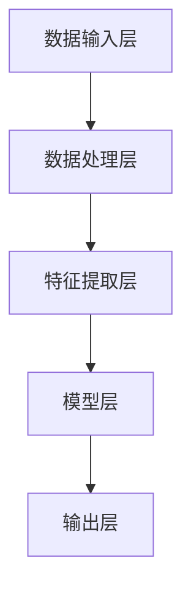
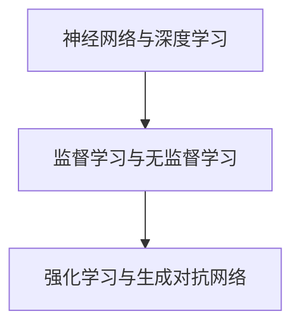

                 

# AI软件2.0的开发环境构建

## 概述

### 文章标题：AI软件2.0的开发环境构建

### 关键词：AI软件2.0，开发环境，构建，神经网络，深度学习，算法，框架，性能优化，安全与隐私

### 摘要：
本文旨在为读者详细解析AI软件2.0的开发环境构建，涵盖从基础概念到具体实践的全过程。我们将首先介绍AI软件2.0的定义与特点，探讨其核心技术与架构。随后，文章将指导开发者如何准备和搭建一个高效的AI开发环境，介绍常用的开发工具与框架。接着，我们将深入讲解AI软件2.0的核心算法原理，并通过数学模型和公式进行阐述。文章后半部分将聚焦于实际应用场景，提供项目开发流程和实战案例。最后，我们将探讨AI软件2.0开发环境的性能优化策略及未来展望。

## 第一部分：AI软件2.0基础概念与环境搭建

### 第1章：AI软件2.0概述

#### 1.1 AI软件2.0的定义与特点

AI软件2.0，是继传统AI（AI 1.0）之后的一种更加智能和自适应的软件形态。它不仅具备AI 1.0的基本能力，如数据分析和模式识别，还能够通过自我学习和不断优化，实现更高效、更智能的决策。AI软件2.0的特点包括：

- **自学习性**：能够从数据中学习并优化自身性能。
- **自适应能力**：能够根据环境和需求的变化进行自我调整。
- **智能决策**：能够进行复杂的决策，具备一定的人类智能水平。

#### 1.2 AI软件2.0的核心技术与架构

AI软件2.0的核心技术主要包括神经网络、深度学习和强化学习等。其架构通常由以下几个关键部分组成：

1. **数据输入层**：接收外部数据，如文本、图像、音频等。
2. **数据处理层**：对输入数据进行预处理，包括去噪、降维等。
3. **特征提取层**：提取数据中的重要特征，用于后续的模型训练。
4. **模型层**：包括神经网络、深度学习模型等，用于处理和决策。
5. **输出层**：生成决策或预测结果，如分类、回归等。

### Mermaid流程图：



#### 1.3 AI软件2.0的发展趋势与挑战

AI软件2.0正处于快速发展阶段，未来趋势包括：

- **智能化水平的提升**：通过不断优化算法和模型，实现更智能的决策。
- **泛在化的应用**：AI软件2.0将在各个领域得到广泛应用，如医疗、金融、交通等。
- **跨学科的融合**：与心理学、认知科学等领域的结合，提升AI的智能水平。

同时，AI软件2.0也面临一些挑战，如：

- **数据隐私与安全**：如何保护用户数据的安全性和隐私性。
- **伦理道德问题**：如何确保AI软件2.0的决策和行为符合伦理和道德标准。

### 第2章：AI软件2.0开发环境准备

#### 2.1 开发环境搭建与配置

搭建一个高效的AI开发环境是顺利进行AI软件2.0项目开发的前提。以下是一个基本的开发环境配置步骤：

1. **硬件环境**：选择具有高性能计算能力的CPU或GPU。
2. **操作系统**：推荐使用Linux或macOS，以获得更好的兼容性和性能。
3. **编程语言**：Python是AI开发的主流语言，推荐学习Python。
4. **开发工具**：使用IDE（如PyCharm、Visual Studio Code）进行代码编写。
5. **版本控制**：使用Git进行代码管理和版本控制。

#### 2.2 开发工具与框架介绍

AI软件2.0开发中常用的工具和框架包括：

- **TensorFlow**：一款开源的深度学习框架，广泛应用于各种AI项目。
- **PyTorch**：另一款流行的深度学习框架，具有动态计算图的优势。
- **Keras**：基于TensorFlow和Theano的简洁、模块化的深度学习库。

#### 2.3 AI软件2.0资源管理策略

资源管理是确保AI开发环境高效运行的关键。以下是一些资源管理策略：

- **内存管理**：合理分配内存，避免内存溢出。
- **计算资源调度**：根据任务需求合理分配计算资源。
- **数据存储**：使用分布式存储系统，提高数据访问速度。

### 第3章：AI软件2.0核心算法原理

#### 3.1 神经网络与深度学习基础

神经网络（Neural Networks）是AI软件2.0的核心组成部分，其基本原理基于生物神经系统的运算机制。深度学习（Deep Learning）则是在神经网络基础上发展起来的，通过多层神经元的堆叠，实现更复杂的特征提取和模式识别。

#### 3.2 监督学习与无监督学习算法

监督学习（Supervised Learning）和无监督学习（Unsupervised Learning）是深度学习中的两种基本学习方式。

- **监督学习**：有标记的数据进行训练，模型根据标记数据调整参数。
- **无监督学习**：没有标记的数据进行训练，模型通过自身探索发现数据中的规律。

#### 3.3 强化学习与生成对抗网络

强化学习（Reinforcement Learning）和生成对抗网络（Generative Adversarial Networks, GAN）是AI软件2.0中的两种高级学习方式。

- **强化学习**：通过奖励机制引导模型学习最优策略。
- **生成对抗网络**：由生成器和判别器组成的对抗性模型，通过不断博弈实现数据生成。

### Mermaid流程图：



### 伪代码：

```python
# 伪代码：AI软件2.0核心算法示例
def ai_software2_0_algorithm(data):
    # 数据预处理
    processed_data = preprocess_data(data)
    
    # 模型训练
    model = train_model(processed_data)
    
    # 模型评估
    evaluate_model(model, processed_data)
    
    # 模型部署
    deploy_model(model)
```

### 数学模型和公式：

$$
y = \sigma(\sum_{i=1}^{n} w_i \cdot x_i + b)
$$

其中，$y$为输出，$x_i$为输入特征，$w_i$为权重，$b$为偏置，$\sigma$为激活函数。

### 第4章：AI软件2.0应用场景分析

#### 4.1 人工智能在企业中的应用

AI软件2.0在企业中的应用非常广泛，如自动化办公、智能客服、供应链管理等。

- **自动化办公**：通过自然语言处理技术实现自动化文档处理、邮件管理等。
- **智能客服**：利用语音识别、自然语言理解等技术，提供7*24小时在线客服服务。
- **供应链管理**：通过预测分析、优化算法等技术，实现供应链的智能管理和优化。

#### 4.2 人工智能在医疗健康领域的应用

AI软件2.0在医疗健康领域的应用前景广阔，如疾病预测、智能诊断、个性化治疗等。

- **疾病预测**：通过分析大量患者数据，预测疾病发生的风险。
- **智能诊断**：利用图像识别、深度学习等技术，辅助医生进行疾病诊断。
- **个性化治疗**：根据患者特征和疾病类型，制定个性化的治疗方案。

#### 4.3 人工智能在金融领域的应用

AI软件2.0在金融领域的应用包括风险管理、量化交易、智能投顾等。

- **风险管理**：通过数据分析、预测模型等技术，评估和预测金融风险。
- **量化交易**：利用机器学习算法，进行高频交易和量化投资。
- **智能投顾**：根据用户风险偏好和投资目标，提供个性化的投资建议。

### 第5章：AI软件2.0项目开发流程

#### 5.1 项目需求分析与规划

项目需求分析是AI软件2.0项目开发的第一步，主要包括：

- **需求收集**：与客户沟通，了解项目需求。
- **需求分析**：分析需求，确定项目的目标、功能和性能要求。
- **规划**：制定项目计划，包括时间表、预算和资源分配。

#### 5.2 数据采集与处理

数据采集与处理是AI软件2.0项目开发的核心环节，主要包括：

- **数据收集**：从各种渠道收集数据，如传感器、网络、数据库等。
- **数据清洗**：去除重复数据、缺失数据和噪声数据，保证数据质量。
- **数据预处理**：对数据进行标准化、归一化等处理，为模型训练做好准备。

#### 5.3 模型训练与优化

模型训练与优化是AI软件2.0项目开发的关键步骤，主要包括：

- **模型选择**：根据项目需求，选择合适的神经网络或深度学习模型。
- **训练**：使用训练数据对模型进行训练，调整模型参数。
- **优化**：通过调整学习率、批量大小等参数，优化模型性能。

#### 5.4 模型部署与维护

模型部署与维护是AI软件2.0项目开发的最后一步，主要包括：

- **模型部署**：将训练好的模型部署到生产环境中，提供服务。
- **模型维护**：定期更新模型，适应新的数据和环境。
- **性能监控**：监控模型性能，确保其稳定运行。

### 第6章：AI软件2.0开发工具与框架应用

#### 6.1 TensorFlow在AI软件2.0中的应用

TensorFlow是AI软件2.0开发中最常用的深度学习框架之一，具有以下特点：

- **动态计算图**：支持动态计算图，方便模型调试和优化。
- **广泛的支持**：支持多种编程语言和操作系统。
- **丰富的库**：提供了丰富的预训练模型和工具库，方便开发者使用。

#### 6.2 PyTorch在AI软件2.0中的应用

PyTorch是另一款流行的深度学习框架，具有以下特点：

- **简洁易用**：代码简洁易懂，易于学习和使用。
- **动态计算图**：支持动态计算图，方便模型调试和优化。
- **良好的社区支持**：拥有庞大的开发者社区，资源丰富。

#### 6.3 其他常用AI开发工具与框架

除了TensorFlow和PyTorch，其他常用的AI开发工具与框架还包括：

- **Keras**：基于TensorFlow和Theano的简洁、模块化的深度学习库。
- **MXNet**：由Apache基金会推出的深度学习框架，支持多种编程语言。
- **Caffe**：专注于图像识别任务的深度学习框架，性能优异。

### 第7章：AI软件2.0性能优化策略

#### 7.1 模型优化与压缩技术

模型优化与压缩技术是提高AI软件2.0性能的有效手段，主要包括：

- **模型剪枝**：通过剪枝无用神经元，减小模型规模。
- **量化**：将模型的浮点数权重转换为低精度数值，降低计算复杂度。
- **蒸馏**：将大模型的知识传递给小模型，提高小模型的性能。

#### 7.2 算法优化与并行计算

算法优化与并行计算是提高AI软件2.0性能的重要手段，主要包括：

- **算法优化**：优化算法的数学公式和计算过程，提高计算效率。
- **并行计算**：利用多核CPU或GPU进行并行计算，提高计算速度。

#### 7.3 硬件加速与分布式计算

硬件加速与分布式计算是提高AI软件2.0性能的关键技术，主要包括：

- **硬件加速**：利用FPGA、ASIC等硬件加速器，提高计算速度。
- **分布式计算**：将计算任务分配到多台机器，实现并行计算，提高计算能力。

### 第8章：AI软件2.0开发环境构建实践

#### 8.1 实践项目案例一：语音识别系统

语音识别系统是AI软件2.0在语音处理领域的一个典型应用。以下是一个简化的开发流程：

1. **需求分析**：确定系统的功能要求，如语音识别准确率、响应速度等。
2. **数据采集**：收集大量的语音数据，进行数据清洗和预处理。
3. **模型训练**：使用深度学习框架（如TensorFlow或PyTorch）训练语音识别模型。
4. **模型评估**：使用测试数据评估模型性能，进行优化调整。
5. **模型部署**：将训练好的模型部署到生产环境中，提供服务。

#### 8.2 实践项目案例二：图像分类系统

图像分类系统是AI软件2.0在计算机视觉领域的一个典型应用。以下是一个简化的开发流程：

1. **需求分析**：确定系统的功能要求，如分类准确率、响应速度等。
2. **数据采集**：收集大量的图像数据，进行数据清洗和预处理。
3. **模型训练**：使用深度学习框架（如TensorFlow或PyTorch）训练图像分类模型。
4. **模型评估**：使用测试数据评估模型性能，进行优化调整。
5. **模型部署**：将训练好的模型部署到生产环境中，提供服务。

#### 8.3 实践项目案例三：推荐系统开发

推荐系统是AI软件2.0在信息过滤和个性化推荐领域的一个典型应用。以下是一个简化的开发流程：

1. **需求分析**：确定系统的功能要求，如推荐准确性、用户满意度等。
2. **数据采集**：收集用户行为数据和商品信息。
3. **模型训练**：使用深度学习框架（如TensorFlow或PyTorch）训练推荐模型。
4. **模型评估**：使用测试数据评估模型性能，进行优化调整。
5. **模型部署**：将训练好的模型部署到生产环境中，提供服务。

### 第9章：AI软件2.0开发环境未来展望

#### 9.1 AI软件2.0的发展方向

AI软件2.0的发展方向主要包括：

- **智能化水平的提升**：通过不断优化算法和模型，实现更智能的决策。
- **跨学科的融合**：与心理学、认知科学等领域的结合，提升AI的智能水平。
- **边缘计算的应用**：将计算任务分配到边缘设备，实现实时响应和低延迟。

#### 9.2 AI软件2.0在各个行业的前景

AI软件2.0在各个行业的前景如下：

- **医疗健康**：通过智能诊断、个性化治疗等技术，提升医疗服务的质量和效率。
- **金融**：通过风险管理、量化交易等技术，提升金融市场的稳定性和收益。
- **交通**：通过智能交通管理、自动驾驶等技术，提升交通的安全性和效率。
- **零售**：通过个性化推荐、智能客服等技术，提升零售行业的用户体验和转化率。

#### 9.3 AI软件2.0的安全与隐私问题

AI软件2.0的安全与隐私问题主要包括：

- **数据隐私**：如何保护用户数据的安全性和隐私性。
- **算法透明度**：如何确保算法的透明度和可解释性。
- **伦理道德**：如何确保AI软件2.0的决策和行为符合伦理和道德标准。

### 总结

AI软件2.0的开发环境构建是一个复杂而关键的过程，涉及从基础概念到具体实践的各个方面。本文系统地介绍了AI软件2.0的基础概念、开发环境准备、核心算法原理、应用场景分析、项目开发流程、工具与框架应用、性能优化策略及未来展望。通过本文的讲解，读者可以全面了解AI软件2.0的开发过程，为实际项目开发提供参考和指导。

### 作者信息

- **作者：** AI天才研究院/AI Genius Institute & 禅与计算机程序设计艺术 /Zen And The Art of Computer Programming
- **联系方式：** [ai_guru@ai-genius-institute.com](mailto:ai_guru@ai-genius-institute.com)
- **版权声明：** 本文版权归AI天才研究院所有，未经授权禁止转载。

### 拓展阅读

- **深度学习入门教程**：[深度学习专题](https://www.deeplearning.net/)
- **TensorFlow官方文档**：[TensorFlow文档](https://www.tensorflow.org/)
- **PyTorch官方文档**：[PyTorch文档](https://pytorch.org/)
- **AI软件2.0相关论文**：[AI软件2.0研究论文](https://ai-genius-institute.com/research/)

