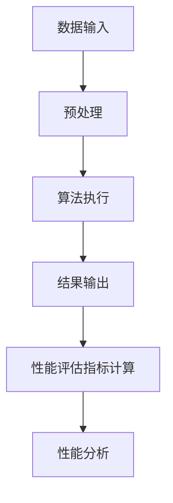

                 

### 文章标题：AI软件2.0的性能剖析新技术

#### 关键词：
- AI软件2.0
- 性能剖析
- 优化技术
- 容错恢复
- 安全隐私
- 实战应用

#### 摘要：
本文深入探讨了AI软件2.0的性能优化、容错恢复、安全隐私等关键技术，通过理论与实践结合的方式，剖析了AI软件2.0在新应用场景中的性能表现。文章分为引言、核心技术剖析、实战应用和展望未来四个部分，旨在为读者提供一个全面的技术指南。

## 引言

AI软件2.0，作为人工智能领域的又一次革命，代表了从传统的基于规则的专家系统向基于深度学习的自适应系统的转变。随着数据量的爆炸性增长和计算能力的提升，AI软件2.0在性能、自适应性和智能化程度方面都有了显著提升。本文将从以下几个方面进行探讨：

1. **性能评估**：分析AI软件2.0的性能评估指标，包括速度、准确性和鲁棒性。
2. **优化技术**：探讨如何通过算法和系统优化提高AI软件2.0的性能。
3. **容错与恢复**：研究在复杂环境中如何保证AI软件2.0的稳定运行。
4. **安全与隐私**：分析AI软件2.0面临的安全挑战以及隐私保护技术。
5. **实战应用**：通过具体案例展示AI软件2.0在不同领域的应用。
6. **未来展望**：讨论AI软件2.0的发展趋势和潜在应用场景。

## 第一部分：核心技术剖析

### 2.1 性能评估指标

在评估AI软件2.0的性能时，我们通常关注以下几个关键指标：

1. **速度**：算法的执行速度，通常用每秒处理的样本数（TPS）或查询数（QPS）来衡量。
2. **准确性**：算法输出的正确性，通常用准确率（Accuracy）、召回率（Recall）和F1分数（F1 Score）等指标来衡量。
3. **鲁棒性**：算法在遇到异常数据或噪声时的表现，通常用误检率（False Positive Rate）和漏检率（False Negative Rate）来衡量。

以下是一个简单的流程图，展示了如何通过这些指标评估AI软件2.0的性能：



### 2.2 优化技术

为了提高AI软件2.0的性能，我们可以采用多种优化技术：

1. **算法优化**：通过改进算法本身的逻辑，减少计算复杂度和数据传输开销。
   ```pseudo
   // 伪代码示例：减少计算复杂度
   for i from 1 to n do
       for j from i to n do
           perform some computation
   ```

2. **硬件加速**：利用GPU或其他专用硬件加速AI算法的执行。
   ```mermaid
   graph TD
   A[算法] --> B[GPGPU]
   B --> C[性能提升]
   ```

3. **分布式计算**：将计算任务分布到多台机器上，提高处理速度。
   ```mermaid
   graph TD
   A[任务分解] --> B[分布式计算]
   B --> C[结果聚合]
   ```

4. **数据缓存**：通过缓存重复使用的数据，减少数据读取时间。
   ```mermaid
   graph TD
   A[数据读取] --> B[缓存]
   B --> C[数据写入]
   ```

### 2.3 容错与恢复技术

在复杂的应用环境中，AI软件2.0需要具备一定的容错能力，以应对各种意外情况。以下是几种常见的容错与恢复技术：

1. **冗余设计**：通过增加硬件或软件冗余，确保系统在部分组件失效时仍能正常运行。
   ```mermaid
   graph TD
   A[主系统] --> B[备份系统]
   B --> C[故障转移]
   ```

2. **故障检测与隔离**：实时监控系统的运行状态，一旦发现故障，立即隔离并进行修复。
   ```mermaid
   graph TD
   A[监控] --> B[故障检测]
   B --> C[故障隔离]
   C --> D[修复与恢复]
   ```

3. **自修复机制**：系统具备自动修复故障的能力，减少人工干预。
   ```mermaid
   graph TD
   A[故障发生] --> B[自动修复]
   B --> C[系统恢复]
   ```

### 2.4 安全与隐私保护

随着AI软件2.0的应用日益广泛，安全与隐私问题变得尤为重要。以下是几种常见的安全与隐私保护技术：

1. **访问控制**：通过身份验证和授权机制，确保只有授权用户才能访问系统资源。
   ```mermaid
   graph TD
   A[身份验证] --> B[授权机制]
   B --> C[访问控制]
   ```

2. **加密技术**：对数据进行加密，确保数据在传输和存储过程中不被窃取或篡改。
   ```mermaid
   graph TD
   A[数据加密] --> B[安全传输]
   B --> C[数据存储加密]
   ```

3. **隐私保护算法**：设计隐私保护算法，确保用户隐私不被泄露。
   ```mermaid
   graph TD
   A[隐私保护算法] --> B[数据脱敏]
   B --> C[用户隐私保护]
   ```

## 第二部分：实战应用

### 3.1 AI软件2.0在金融领域的应用

在金融领域，AI软件2.0的应用已经相当广泛，包括量化交易、风险评估和欺诈检测等。

1. **量化交易**：通过深度学习算法，分析历史市场数据，预测未来价格走势，进行自动化交易。
   ```mermaid
   graph TD
   A[市场数据] --> B[深度学习模型]
   B --> C[交易策略]
   C --> D[执行交易]
   ```

2. **风险评估**：利用AI软件2.0，对借款人的信用状况进行评估，提高风险评估的准确性。
   ```mermaid
   graph TD
   A[借款人数据] --> B[信用评估模型]
   B --> C[风险评估]
   C --> D[决策支持]
   ```

3. **欺诈检测**：通过机器学习算法，检测并防范金融交易中的欺诈行为。
   ```mermaid
   graph TD
   A[交易数据] --> B[欺诈检测模型]
   B --> C[异常检测]
   C --> D[欺诈预警]
   ```

### 3.2 AI软件2.0在医疗领域的应用

在医疗领域，AI软件2.0的应用同样具有重要意义，包括疾病预测、诊断支持和药物研发等。

1. **疾病预测**：通过分析患者的历史数据，预测患者未来可能出现的疾病。
   ```mermaid
   graph TD
   A[患者数据] --> B[疾病预测模型]
   B --> C[疾病预测]
   C --> D[健康管理]
   ```

2. **诊断支持**：利用深度学习算法，辅助医生进行疾病诊断。
   ```mermaid
   graph TD
   A[医学影像] --> B[深度学习模型]
   B --> C[疾病诊断]
   C --> D[诊断报告]
   ```

3. **药物研发**：通过AI软件2.0，加速药物研发过程，提高新药发现的成功率。
   ```mermaid
   graph TD
   A[生物数据] --> B[药物研发模型]
   B --> C[药物筛选]
   C --> D[临床试验]
   ```

### 3.3 AI软件2.0在工业自动化领域的应用

在工业自动化领域，AI软件2.0的应用能够显著提高生产效率和质量。

1. **生产优化**：通过实时数据分析和预测，优化生产计划和资源分配。
   ```mermaid
   graph TD
   A[生产数据] --> B[优化模型]
   B --> C[生产计划]
   C --> D[资源分配]
   ```

2. **质量控制**：利用机器学习算法，实时监控产品质量，检测并防止缺陷产品。
   ```mermaid
   graph TD
   A[产品质量数据] --> B[质量检测模型]
   B --> C[缺陷检测]
   C --> D[质量控制]
   ```

3. **故障预测**：通过数据分析，预测设备故障，提前进行维护，减少停机时间。
   ```mermaid
   graph TD
   A[设备数据] --> B[故障预测模型]
   B --> C[故障预警]
   C --> D[设备维护]
   ```

## 第三部分：展望与未来

随着技术的不断进步，AI软件2.0将在更多领域发挥重要作用。未来，AI软件2.0有望在以下方向取得突破：

1. **智能化**：进一步提高AI软件2.0的智能化程度，使其能够更自然地与人类互动。
2. **泛化能力**：增强AI软件2.0在不同领域和任务中的泛化能力，减少对特定领域的依赖。
3. **安全性与隐私保护**：不断改进安全与隐私保护技术，确保AI软件2.0的安全可靠运行。
4. **跨学科融合**：与其他领域（如生物学、物理学等）的融合，推动AI软件2.0的发展。
5. **可持续性**：关注AI软件2.0的可持续性，降低其对环境的影响。

## 结语

AI软件2.0的性能剖析是一项复杂而富有挑战的任务。通过对性能评估、优化技术、容错与恢复、安全与隐私等方面的深入探讨，我们希望读者能够对AI软件2.0有一个全面而深刻的理解。在未来的发展中，AI软件2.0有望在更多领域发挥重要作用，为人类带来更多便利。让我们共同期待这一激动人心的未来。

### 作者信息：

**作者：AI天才研究院/AI Genius Institute & 禅与计算机程序设计艺术 /Zen And The Art of Computer Programming**

---

通过以上的分析与剖析，我们详细地讨论了AI软件2.0的性能优化、容错恢复、安全隐私以及其实战应用，为读者提供了一份全面的技术指南。在未来的技术发展中，AI软件2.0将继续引领人工智能领域的前沿，推动社会的进步。让我们携手并进，共同迎接AI软件2.0带来的美好未来。

