                 


### 文章标题

# AI软件2.0的提示词驱动需求追踪

> 关键词：AI软件2.0，提示词驱动，需求追踪，人工智能，软件工程

> 摘要：本文深入探讨了AI软件2.0的提示词驱动需求追踪技术，详细阐述了其背景、核心概念、算法原理、应用案例和未来发展趋势，旨在为读者提供全面的技术理解和实践指导。

## 引言

随着人工智能技术的迅猛发展，软件工程领域迎来了革命性的变革。AI软件2.0作为下一代人工智能软件的代表，它不仅能够实现高效的数据处理和智能决策，还能够通过提示词驱动的方式实现需求追踪。这一技术不仅提高了软件开发的效率，还极大地提升了软件的质量。

### AI软件2.0的概念

AI软件2.0，即第二代人工智能软件，它在第一代人工智能软件的基础上，进一步融合了深度学习和自然语言处理技术，使得软件能够更加智能地理解和处理复杂任务。AI软件2.0的核心特点在于其高度自主性和灵活性，能够根据用户的需求和场景动态调整其行为。

### 提示词驱动需求追踪的概念

提示词驱动需求追踪是一种基于人工智能技术的需求管理方法。它通过分析用户输入的提示词，自动识别并追踪软件需求的变化，从而实现需求的动态管理和优化。这种方法不仅能够提高开发效率，还能够确保软件需求的准确性和完整性。

### 书籍结构概述

本文将分为六个部分进行详细探讨。第一部分是引言，介绍AI软件2.0的概念和提示词驱动需求追踪技术。第二部分和第三部分分别讲解AI软件2.0的技术原理和提示词驱动需求追踪技术。第四部分通过实际案例研究展示如何应用提示词驱动需求追踪技术。第五部分介绍市场上常用的需求追踪工具和平台。第六部分探讨需求追踪的最佳实践和未来发展趋势。

## AI软件2.0基础

在深入探讨提示词驱动需求追踪之前，我们需要先了解AI软件2.0的技术原理。AI软件2.0的核心在于其深度学习和自然语言处理技术，这使得它能够高效地处理复杂数据和实现智能决策。

### 深度学习基础

深度学习是一种基于多层神经网络的人工智能技术，它能够通过学习大量数据来提取特征和模式。深度学习的核心组成部分包括神经网络、激活函数、反向传播算法等。以下是深度学习的一些基本概念和原理：

#### 神经网络

神经网络是由大量神经元组成的计算模型，每个神经元都与其他神经元相连。神经网络的输入经过加权处理，并通过激活函数转换为输出。多层神经网络能够实现更复杂的特征提取和模式识别。

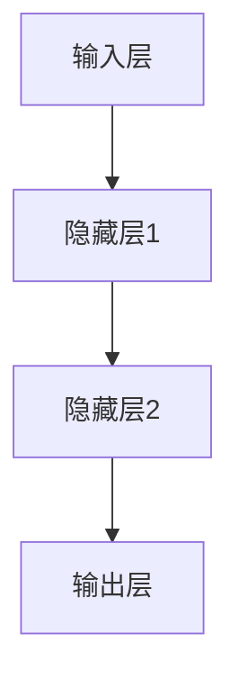

#### 激活函数

激活函数是神经网络中的一个关键组件，它决定了神经元的激活状态。常见的激活函数包括 sigmoid、ReLU 和 tanh 等。

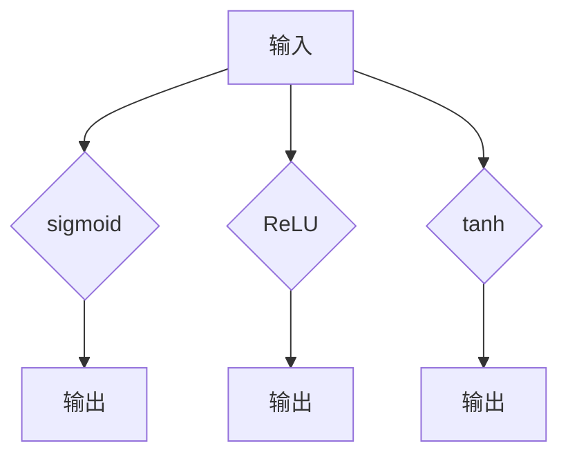

#### 反向传播算法

反向传播算法是深度学习训练过程中的一种优化方法。它通过计算误差梯度来更新网络权重，从而提高模型的准确性。

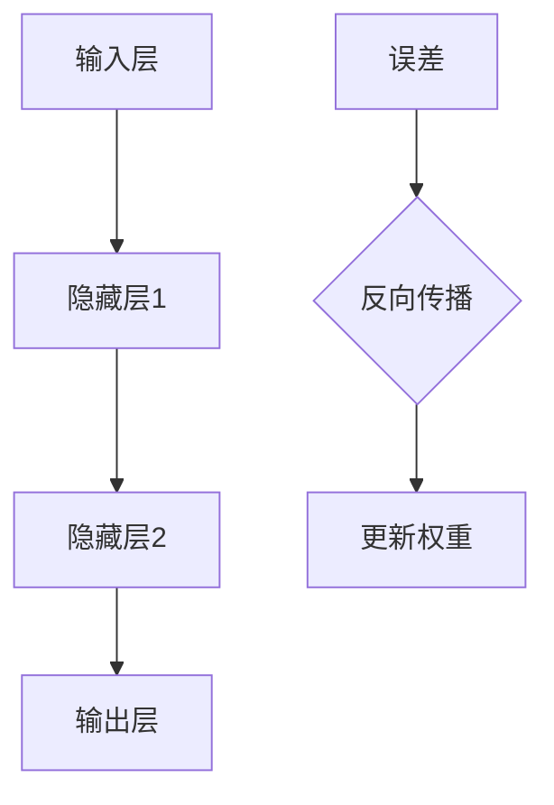

### 自然语言处理基础

自然语言处理（NLP）是人工智能的一个重要分支，它致力于使计算机理解和处理人类自然语言。NLP的核心任务包括文本分类、情感分析、命名实体识别、机器翻译等。以下是NLP的一些基本概念和原理：

#### 文本分类

文本分类是将文本数据分为预定义的类别的一种任务。常见的文本分类方法包括朴素贝叶斯、支持向量机、深度学习等。

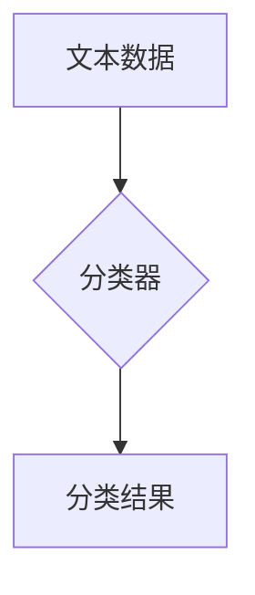

#### 情感分析

情感分析是评估文本数据的情感倾向的一种任务。常见的情感分析模型包括基于规则的方法、机器学习方法、深度学习方法等。

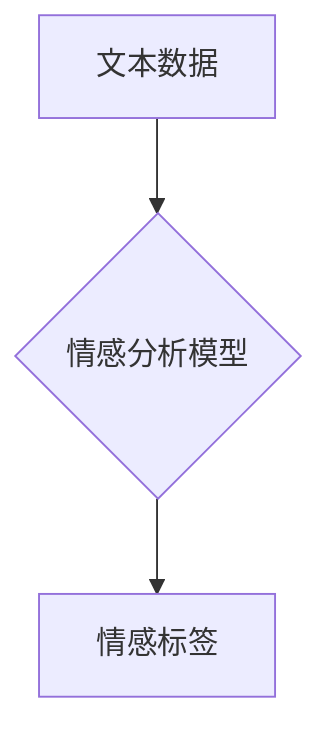

#### 命名实体识别

命名实体识别是从文本中识别出具有特定意义的实体，如人名、地名、组织名等。

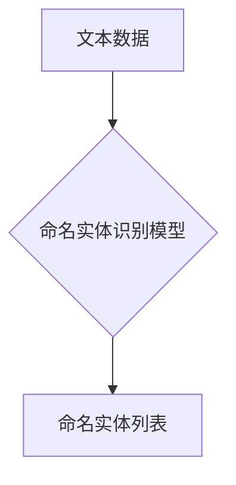

#### 机器翻译

机器翻译是将一种语言的文本翻译成另一种语言的一种任务。常见的机器翻译模型包括基于规则的模型、统计模型、神经机器翻译模型等。

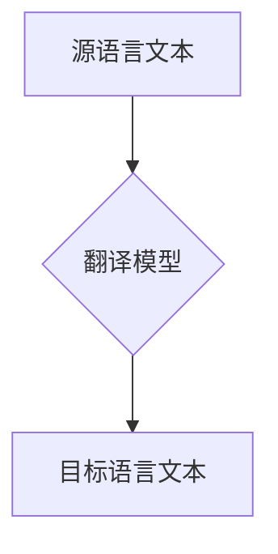

### 大模型训练与优化

大模型训练与优化是AI软件2.0的一个重要环节。它涉及到如何设计高效的训练算法、选择合适的训练数据集、调整模型参数等。以下是几个关键点：

#### 数据预处理

数据预处理是训练数据集的重要步骤，包括数据清洗、数据归一化、数据扩充等。

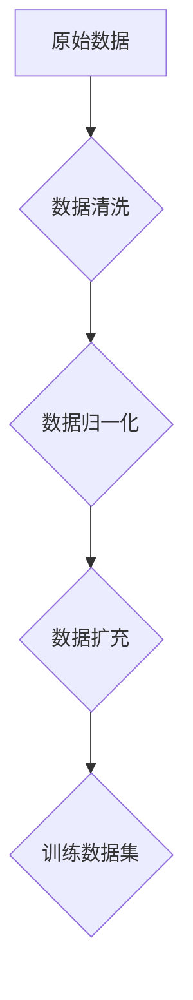

#### 训练算法

常见的训练算法包括梯度下降、随机梯度下降、Adam优化器等。每种算法都有其优缺点，选择合适的算法对于模型的训练效率至关重要。

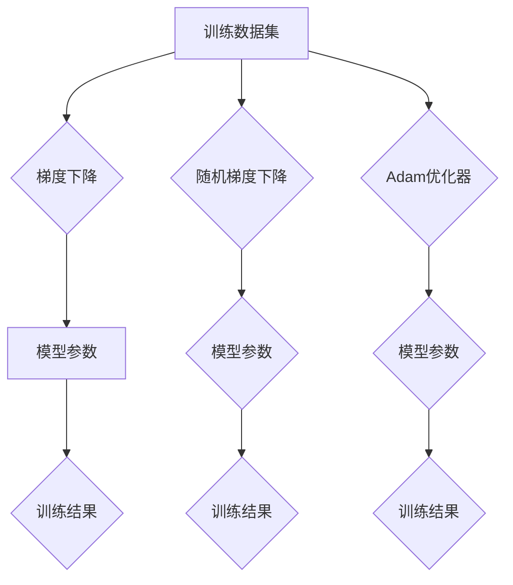

#### 模型优化

模型优化是通过调整模型参数来提高模型性能的过程。常见的优化方法包括正则化、dropout、学习率调整等。

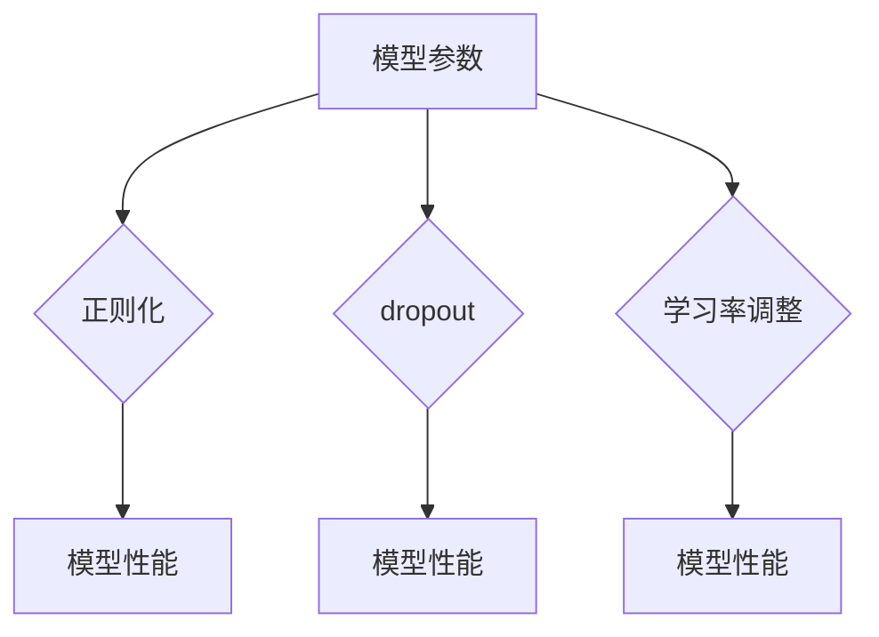

## 提示词驱动需求追踪技术

提示词驱动需求追踪是一种基于人工智能技术的需求管理方法，它通过分析用户输入的提示词，自动识别并追踪软件需求的变化。这种技术不仅能够提高开发效率，还能够确保软件需求的准确性和完整性。

### 提示词的生成与优化

提示词是驱动需求追踪的关键，它需要具备高度的准确性和可理解性。以下是提示词生成和优化的一些关键步骤：

#### 提示词生成

提示词生成是通过自然语言处理技术从用户输入的文本中提取关键信息的过程。常见的生成方法包括关键词提取、命名实体识别、语义分析等。

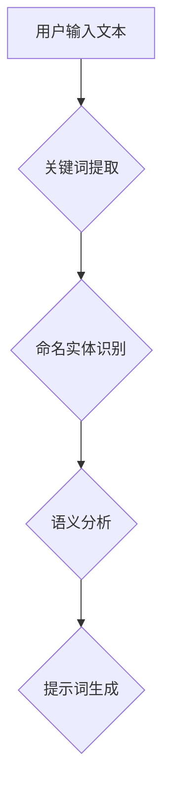

#### 提示词优化

提示词优化是通过调整提示词的长度、复杂度、准确性等参数来提高需求追踪的效率。优化方法包括提示词筛选、提示词权重调整等。

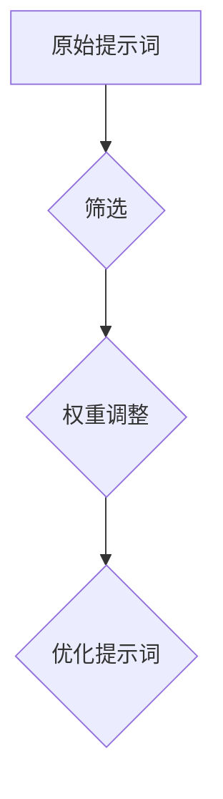

### 需求追踪算法原理

需求追踪算法是提示词驱动需求追踪的核心，它负责分析提示词并识别需求的变化。以下是需求追踪算法的一些基本原理：

#### 需求识别

需求识别是通过分析提示词中的关键词和语义信息，识别出潜在的需求。

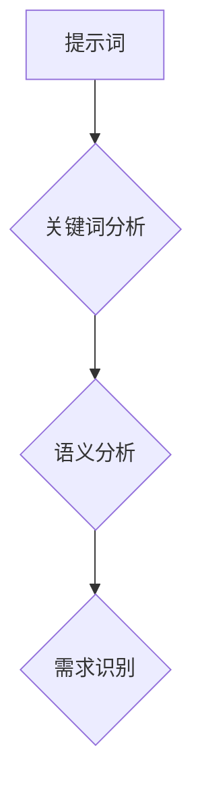

#### 需求分类

需求分类是将识别出的需求按照类型和优先级进行分类，以便更好地管理和分配。

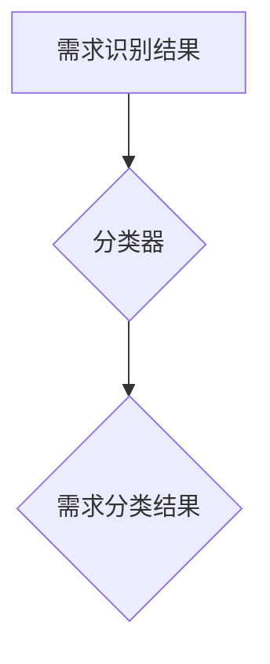

#### 需求追踪

需求追踪是通过持续分析用户输入的提示词，实时更新需求的动态变化。

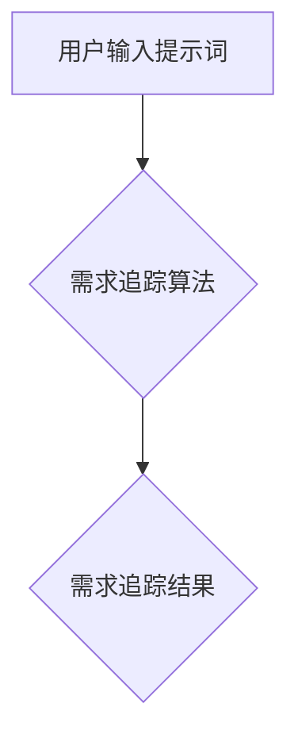

### 提示词驱动的需求分析

提示词驱动的需求分析是通过分析用户输入的提示词，深入了解用户需求的过程。以下是需求分析的一些基本步骤：

#### 需求理解

需求理解是通过自然语言处理技术，理解用户输入的提示词所表达的需求。

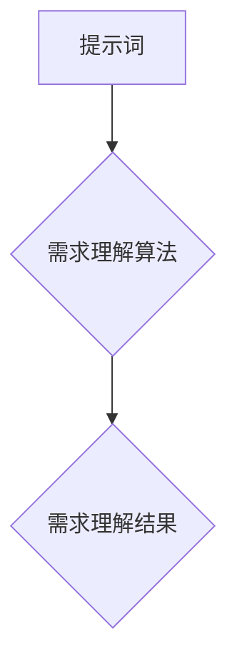

#### 需求确认

需求确认是通过与用户进行交互，验证需求理解的准确性。

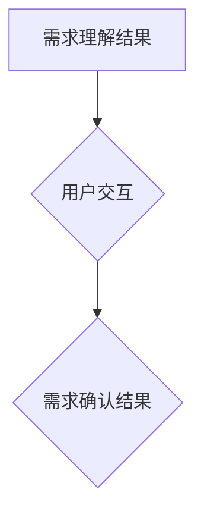

#### 需求优化

需求优化是通过分析需求确认结果，对需求进行优化和调整。

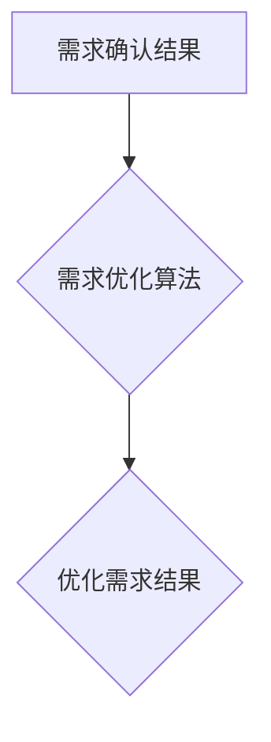

## 需求追踪案例研究

为了更好地理解提示词驱动需求追踪技术，我们通过实际案例来展示其应用过程。以下是一个产品需求管理的实际案例。

### 案例背景

某公司开发一款在线教育平台，产品经理希望通过提示词驱动需求追踪技术，实时了解用户的需求变化，以便快速响应并优化产品功能。

### 案例步骤

#### 1. 数据收集

产品经理通过用户反馈、市场调研等方式收集用户需求数据。

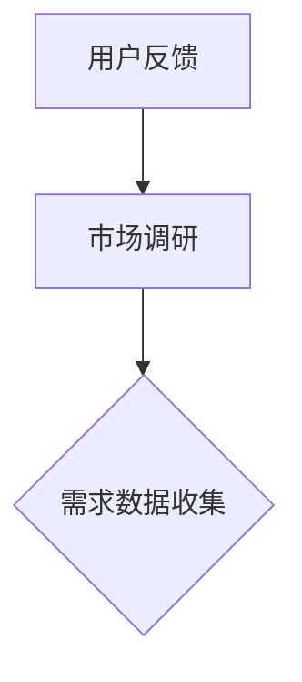

#### 2. 提示词生成

通过自然语言处理技术，从用户反馈和市场调研数据中提取关键词和语义信息，生成提示词。

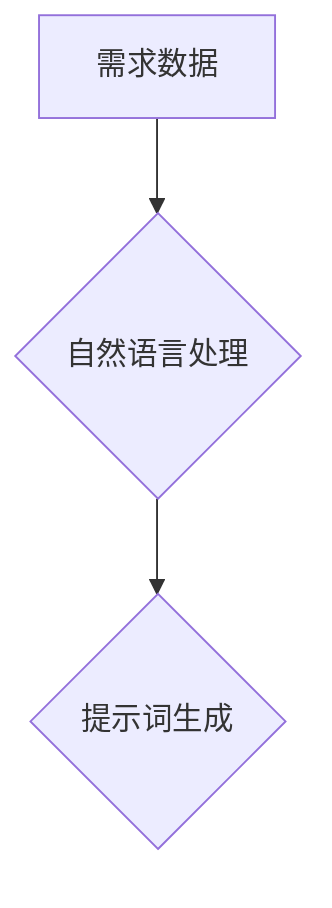

#### 3. 需求识别

通过需求追踪算法，分析提示词中的关键词和语义信息，识别出潜在的需求。

```mermaid
graph TD
A[提示词] --> B{需求追踪算法}
B --> C{需求识别结果}
```

#### 4. 需求分类

将识别出的需求按照类型和优先级进行分类，以便更好地管理和分配。

```mermaid
graph TD
A[需求识别结果] --> B{分类器}
B --> C{需求分类结果}
```

#### 5. 需求确认

通过与用户进行交互，验证需求理解的准确性。

```mermaid
graph TD
A[需求分类结果] --> B{用户交互}
B --> C{需求确认结果}
```

#### 6. 需求优化

通过分析需求确认结果，对需求进行优化和调整。

```mermaid
graph TD
A[需求确认结果] --> B{需求优化算法}
B --> C{优化需求结果}
```

#### 7. 需求追踪

持续分析用户输入的提示词，实时更新需求的动态变化。

```mermaid
graph TD
A[用户输入提示词] --> B{需求追踪算法}
B --> C{需求追踪结果}
```

### 案例结果

通过提示词驱动需求追踪技术，产品经理能够快速识别和确认用户需求，及时响应并优化产品功能，从而提升了产品竞争力。

## 需求追踪工具与平台

在市场上有多种需求追踪工具和平台可供选择，这些工具和平台提供了丰富的功能和便利性，以帮助开发团队更好地管理需求。以下是几个常用的需求追踪工具和平台：

### JIRA

JIRA 是 Atlassian 公司开发的一款流行的项目管理工具，它提供了强大的需求追踪功能。JIRA 支持多种项目管理方法，如敏捷、看板、瀑布等，用户可以根据项目需求自由选择。JIRA 的主要特点包括：

- 实时需求追踪：JIRA 提供了实时更新功能，用户可以随时查看需求的状态和进展。
- 灵活的工作流：JIRA 允许用户自定义工作流，以满足不同类型项目的需求。
- 高度可定制：JIRA 提供了丰富的插件和扩展功能，用户可以根据项目需求进行个性化定制。

### Trello

Trello 是一款基于看板（Kanban）方法的需求追踪工具，它以其直观的用户界面和简单的操作流程而受到广泛欢迎。Trello 的主要特点包括：

- 直观的界面设计：Trello 的界面设计简洁明了，用户可以轻松拖放卡片来管理需求。
- 多功能面板：Trello 提供了多种面板，如看板、列表、卡片等，用户可以根据需求选择最合适的面板。
- 协作功能强大：Trello 支持多人协作，用户可以添加成员、分配任务，并实时跟踪项目进度。

### Asana

Asana 是一款功能全面的项目管理工具，它适用于各种规模和类型的团队。Asana 的主要特点包括：

- 整合需求管理：Asana 提供了强大的需求管理功能，用户可以创建、跟踪和分配需求，确保需求得到有效管理。
- 实时通知：Asana 支持实时通知，用户可以随时了解项目进展和需求状态。
- 灵活的视图模式：Asana 提供了多种视图模式，如列表、看板、日历等，用户可以根据需求选择最合适的视图模式。

### 其他工具简介

除了上述三个工具，市场上还有许多其他需求追踪工具和平台，如 Microsoft Project、Zoho Projects、Redmine 等。这些工具和平台都提供了丰富的功能，用户可以根据项目需求和团队特点选择合适的工具。

## 需求追踪的最佳实践

在需求追踪过程中，遵循最佳实践可以显著提高效率和质量。以下是几个关键的最佳实践：

### 1. 提前规划

在项目开始前，进行详细的需求规划，明确需求范围和优先级，确保项目团队对需求有清晰的认识。

### 2. 持续沟通

保持与用户的持续沟通，及时收集反馈和需求变化，确保需求追踪的准确性。

### 3. 透明度

确保需求追踪过程的透明度，让所有团队成员都能随时了解需求的状态和进展。

### 4. 自动化

利用工具和自动化技术来简化需求追踪过程，提高效率和准确性。

### 5. 定期回顾

定期回顾需求追踪的结果，总结经验教训，不断优化需求管理流程。

## 未来展望

随着人工智能技术的不断进步，提示词驱动需求追踪技术有望在未来得到更广泛的应用。以下是几个可能的发展趋势：

### 1. 智能化

提示词驱动需求追踪将更加智能化，通过深度学习和自然语言处理技术，实现更精准的需求识别和分析。

### 2. 个性化

根据用户需求和项目特点，提供个性化的需求追踪方案，提高需求的准确性和效率。

### 3. 融合技术

将提示词驱动需求追踪与其他人工智能技术（如机器学习、数据挖掘等）相结合，实现更全面的需求管理。

### 4. 开放生态

建立开放的需求追踪生态系统，支持多种工具和平台的集成，提高协同效率。

## 附录

### 1. 提示词驱动需求追踪的参考资料

- 《人工智能与软件工程》
- 《自然语言处理：实战指南》
- 《深度学习：原理与实现》

### 2. AI软件2.0相关的最新研究进展

- 《AI软件2.0：下一代人工智能软件的发展》
- 《人工智能在软件工程中的应用》
- 《AI驱动的软件开发：挑战与机遇》

### 3. 需求追踪工具与平台的详细使用指南

- 《JIRA官方指南》
- 《Trello用户手册》
- 《Asana操作手册》

## 作者信息

作者：AI天才研究院/AI Genius Institute & 禅与计算机程序设计艺术 /Zen And The Art of Computer Programming

## 文章小结

本文详细介绍了AI软件2.0的提示词驱动需求追踪技术，包括其背景、核心概念、算法原理、应用案例和未来发展趋势。通过本文的阅读，读者可以全面了解这一先进技术，并掌握其在实际项目中的应用方法。希望本文能为读者在人工智能和软件工程领域提供有价值的参考和指导。

