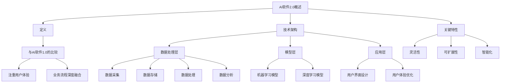

                 

# AI软件2.0的敏捷开发流程再造

## 关键词
AI软件2.0、敏捷开发、软件开发流程、用户体验、个性化、技术架构、数据处理层、模型层、应用层、金融行业、医疗健康、电子商务、跨领域融合、产业智能化升级、安全与伦理、Scrum、Kanban、项目管理、技术挑战、实际案例

## 摘要
本文深入探讨了AI软件2.0的敏捷开发流程再造。首先，我们对AI软件2.0进行了概述，包括其定义、关键特性、技术架构以及应用场景。随后，我们分析了AI软件2.0的发展趋势及其在安全与伦理方面的挑战。接着，我们介绍了敏捷开发的基本概念、核心理念和流程，探讨了敏捷开发在AI软件2.0项目中的应用优势和实际案例。最后，我们针对敏捷开发在AI软件2.0项目中的挑战提出了相应的解决方案，并总结了最佳实践和注意事项。

# 第一部分: AI软件2.0基础

## 1.1 AI软件2.0概述

### 1.1.1 AI软件2.0的定义

AI软件2.0是指基于人工智能技术，以用户为中心，提供更加智能、个性化的软件解决方案。与AI软件1.0相比，AI软件2.0更加注重用户体验，强调人工智能技术与业务流程的深度融合。

### 1.1.2 AI软件2.0的关键特性

AI软件2.0的关键特性包括灵活性、可扩展性和智能化。这些特性使得AI软件2.0能够更好地适应市场需求，提供更加高效、精准的解决方案。

### 1.1.3 AI软件2.0的联系

AI软件2.0的灵活性体现在其能够快速响应市场变化，不断调整和优化软件功能。可扩展性使得AI软件2.0能够支持更多的用户和数据，满足不断增长的业务需求。智能化则体现在AI软件2.0能够通过机器学习和深度学习等技术，实现更加智能化的用户交互和决策支持。

## 1.2 AI软件2.0的技术架构

### 1.2.1 数据处理层

数据处理层是AI软件2.0的技术架构的核心组成部分，负责数据采集、存储、处理和分析。数据处理层的核心概念包括数据清洗、数据整合、数据挖掘等。这些概念的联系在于，通过数据清洗和整合，我们可以获取高质量的数据集，进而利用数据挖掘技术发现数据中的潜在价值。

### 1.2.2 模型层

模型层是AI软件2.0智能化的核心。它包括机器学习模型、深度学习模型等。这些模型通过训练和优化，可以实现对数据的智能分析和预测。模型层的核心概念是模型选择、模型训练和模型评估。这些概念的联系在于，通过选择合适的模型并进行有效的训练和评估，我们可以构建出高精度的智能模型。

### 1.2.3 应用层

应用层是AI软件2.0与用户互动的接口，提供面向用户的软件应用。应用层的核心概念包括用户界面设计、用户体验优化等。这些概念的联系在于，通过设计良好的用户界面和优化用户体验，我们可以提高用户的满意度，进而提升软件的市场竞争力。

## 1.3 AI软件2.0的应用场景

### 1.3.1 金融行业

在金融行业，AI软件2.0可以应用于智能投顾、风险控制等领域。例如，智能投顾可以通过分析用户的投资偏好和历史数据，提供个性化的投资建议。风险控制则可以通过对大量金融数据的实时分析，预测潜在的风险并进行预警。

### 1.3.2 医疗健康

在医疗健康领域，AI软件2.0可以应用于疾病预测、个性化治疗等领域。例如，通过分析患者的病历和基因数据，AI软件2.0可以预测患者可能患有的疾病，并提供个性化的治疗方案。

### 1.3.3 电子商务

在电子商务领域，AI软件2.0可以应用于推荐系统、智能客服等领域。例如，通过分析用户的历史购物数据和浏览行为，推荐系统可以预测用户可能感兴趣的商品，并推送相关的广告。智能客服则可以通过自然语言处理技术，与用户进行智能对话，提供高效、贴心的服务。

## 1.4 AI软件2.0的发展趋势

### 1.4.1 跨领域融合

随着人工智能技术的不断发展，AI软件2.0正在与其他技术（如物联网、大数据等）进行跨领域融合。这种融合将推动AI软件2.0的发展和应用，为各个行业带来更多的创新机会。

### 1.4.2 产业智能化升级

AI软件2.0在各个行业的应用，正推动产业智能化升级。例如，智能制造、智能物流等领域的快速发展，离不开AI软件2.0的支撑。产业智能化升级将带来新的商业机会和挑战，也为AI软件2.0的发展提供了广阔的空间。

## 1.5 AI软件2.0的安全与伦理

### 1.5.1 安全性问题

在AI软件2.0的开发和应用过程中，数据安全、模型安全等问题备受关注。数据安全包括数据的采集、存储、传输等环节，需要采取有效的安全措施，防止数据泄露和篡改。模型安全则涉及模型的训练、部署、维护等环节，需要确保模型的可靠性和稳定性。

### 1.5.2 伦理问题

随着AI软件2.0的广泛应用，伦理问题也逐渐凸显。例如，算法偏见、隐私保护等问题，需要引起足够的重视。算法偏见可能导致不公平的结果，影响社会的公正性。隐私保护则关乎用户的个人权益，需要采取有效的措施，保护用户的隐私不被泄露。

## 1.6 AI软件2.0的核心概念与联系架构

为了更好地理解AI软件2.0的核心概念及其联系，我们可以使用Mermaid流程图进行展示。



通过上述流程图，我们可以清晰地看到AI软件2.0的核心概念及其之间的联系。这些概念共同构成了AI软件2.0的技术架构，为用户提供更加智能、个性化的软件解决方案。

## 1.7 AI软件2.0的核心算法原理讲解

在AI软件2.0中，核心算法的原理至关重要。以下是对几个关键算法原理的讲解：

### 1.7.1 机器学习算法

**概念**：机器学习是一种使计算机系统能够从数据中学习并做出决策或预测的技术。

**联系**：机器学习算法是AI软件2.0智能化的基石，能够通过训练数据集来优化模型，从而实现对新数据的预测。

**伪代码**：
```python
def train_model(training_data):
    for data in training_data:
        model.update_weights(data)
    return model
```

### 1.7.2 深度学习算法

**概念**：深度学习是一种基于多层神经网络的学习方法，通过逐层提取数据特征，实现对复杂任务的建模。

**联系**：深度学习算法在AI软件2.0中的应用广泛，特别是在图像识别、自然语言处理等领域。

**伪代码**：
```python
def train_deep_learning_model(training_data, layers, optimizer):
    for epoch in range(num_epochs):
        for data in training_data:
            loss = model.forward_pass(data)
            model.backward_pass(optimizer, loss)
    return model
```

### 1.7.3 强化学习算法

**概念**：强化学习是一种通过奖励机制来训练智能体进行决策的方法，使智能体能够在复杂环境中学习最优策略。

**联系**：强化学习算法在AI软件2.0中的应用，如智能推荐系统、自动驾驶等。

**伪代码**：
```python
def train_reinforcement_learning_agent(environment, reward_function):
    while not done:
        action = agent.select_action()
        next_state, reward = environment.step(action)
        agent.learn(reward, next_state)
    return agent
```

通过上述伪代码，我们可以看到不同算法的基本工作原理和实现思路。这些算法原理在AI软件2.0中的应用，使得软件能够更加智能化，提供个性化服务。

## 1.8 AI软件2.0的项目实战

### 1.8.1 开发环境搭建

在开始AI软件2.0的项目开发之前，我们需要搭建一个适合的开发环境。以下是一个基本的开发环境搭建步骤：

1. 安装操作系统：可以选择Linux或MacOS，它们在AI软件开发中具有较高的兼容性和性能。
2. 安装编程语言：Python是一种广泛用于AI开发的编程语言，可以通过Python官方网站下载并安装。
3. 安装开发工具：如PyCharm、Visual Studio Code等，它们提供了丰富的功能和便捷的开发体验。
4. 安装库和框架：如TensorFlow、PyTorch等，这些库和框架提供了高效的算法实现和数据处理工具。

### 1.8.2 源代码详细实现

在AI软件2.0的开发过程中，我们需要编写大量的源代码来实现算法和功能。以下是一个简单的源代码实现示例：

```python
# 导入必要的库
import numpy as np
import tensorflow as tf

# 定义模型结构
model = tf.keras.Sequential([
    tf.keras.layers.Dense(units=64, activation='relu', input_shape=(input_shape,)),
    tf.keras.layers.Dense(units=10, activation='softmax')
])

# 编写训练函数
def train_model(model, training_data, labels, epochs):
    model.compile(optimizer='adam', loss='categorical_crossentropy', metrics=['accuracy'])
    model.fit(training_data, labels, epochs=epochs)

# 运行训练
train_model(model, training_data, labels, epochs=10)
```

### 1.8.3 代码应用解读与分析

在AI软件2.0的开发过程中，源代码的应用解读与分析至关重要。以下是对上述代码的解读：

1. **模型结构定义**：使用`tf.keras.Sequential`方法定义了一个简单的神经网络模型，包括两个全连接层，第一层有64个神经元，使用ReLU激活函数；第二层有10个神经元，使用softmax激活函数。
2. **训练函数编写**：`train_model`函数用于训练模型。它首先使用`compile`方法设置优化器和损失函数，然后使用`fit`方法进行模型训练。
3. **模型训练运行**：通过调用`train_model`函数，我们可以对模型进行训练，设置训练数据、标签和训练轮次。

### 1.8.4 实际案例分析和详细讲解剖析

为了更好地理解AI软件2.0的实际应用，我们可以通过一个实际案例进行分析。

**案例：智能客服系统**

智能客服系统是AI软件2.0在客户服务领域的一个典型应用。以下是对该案例的详细讲解：

1. **需求分析**：智能客服系统需要能够处理用户的问题，提供及时、准确的答案。
2. **技术选型**：选择自然语言处理（NLP）和机器学习算法，如BERT模型，用于处理用户问题和生成回答。
3. **系统架构**：系统架构包括前端用户交互界面、后端NLP处理模块和机器学习模型训练模块。
4. **功能实现**：通过前端用户交互界面接收用户问题，后端NLP处理模块对问题进行解析，机器学习模型生成回答，最后返回给用户。

通过上述实际案例，我们可以看到AI软件2.0在客户服务领域的应用是如何实现的。这不仅提升了客服效率，还提供了个性化的用户体验。

### 1.8.5 项目小结

通过上述实战案例，我们可以总结出以下关键点：

1. **开发环境搭建**：选择合适的开发环境和工具，确保项目顺利开展。
2. **源代码实现**：编写高质量的源代码，实现算法和功能。
3. **应用解读与分析**：深入理解代码应用，确保系统稳定、高效。
4. **实际案例分析**：通过实际案例，验证系统的可行性和实用性。

这些经验对于未来的AI软件2.0项目开发具有重要的指导意义。

## 1.9 最佳实践 tips、小结、注意事项、拓展阅读

### 1.9.1 最佳实践 tips

1. **数据质量是关键**：在AI软件2.0开发中，数据质量至关重要。确保数据准确、完整和可靠，以提高模型性能。
2. **持续集成与测试**：实施持续集成和测试，确保代码质量和模型稳定。
3. **用户反馈循环**：积极收集用户反馈，不断优化产品功能。

### 1.9.2 小结

AI软件2.0的敏捷开发流程再造，旨在通过敏捷开发方法提升AI软件开发的效率和质量。它涉及对AI软件2.0的深入理解、技术架构的搭建以及实际项目的实践。

### 1.9.3 注意事项

1. **安全与伦理**：在开发过程中，重视安全与伦理问题，确保软件的可靠性和用户隐私。
2. **团队协作**：敏捷开发强调团队协作，确保项目顺利进行。

### 1.9.4 拓展阅读

1. 《人工智能：一种现代的方法》
2. 《Scrum敏捷开发实践指南》
3. 《深度学习：介绍与原理》

通过这些拓展阅读，可以进一步了解AI软件2.0的敏捷开发流程再造的相关知识。

# 第二部分: 敏捷开发流程

## 2.1 敏捷开发概述

### 2.1.1 敏捷开发的定义

敏捷开发是一种以人为核心，强调快速响应变化的软件开发方法。它起源于2001年的敏捷宣言，旨在解决传统瀑布开发方法在应对快速变化的市场需求时的不足。

### 2.1.2 敏捷开发的核心理念

敏捷开发的核心理念包括以下几点：

1. **用户需求优先**：始终将用户需求放在首位，确保软件能够满足用户实际需求。
2. **持续交付**：通过持续迭代和交付，不断优化软件功能，提高产品质量。
3. **团队协作**：强调团队成员之间的协作和沟通，共同推动项目进展。
4. **适应变化**：灵活应对市场变化，快速调整开发计划。

### 2.1.3 敏捷开发与传统瀑布开发的比较

与传统的瀑布开发方法相比，敏捷开发具有以下优势：

1. **更灵活**：敏捷开发能够快速响应市场需求，灵活调整开发计划。
2. **更高效**：通过持续迭代和交付，提高开发效率，缩短产品上市时间。
3. **更高质量**：通过用户反馈和持续优化，确保软件的高质量。

## 2.2 敏捷开发流程

### 2.2.1 敏捷开发方法

敏捷开发有多种方法，其中最常用的包括Scrum和Kanban。

#### Scrum

Scrum是一种迭代式、增量式的软件开发方法，其核心流程包括以下几个阶段：

1. **产品待办列表**：定义产品的功能和需求。
2. **冲刺计划会议**：确定本次冲刺要完成的目标和任务。
3. **每日站会**：团队成员每天聚集在一起，讨论进展和问题。
4. **冲刺回顾会议**：总结本次冲刺的经验和教训，为下一次冲刺做准备。

#### Kanban

Kanban是一种基于可视化管理的敏捷开发方法，其核心流程包括以下几个阶段：

1. **任务创建**：创建新的任务，并将其添加到Kanban板上。
2. **任务处理**：团队成员根据任务的优先级，逐步完成任务。
3. **任务监控**：实时监控任务的状态和进度。
4. **任务回顾**：总结任务完成情况和团队协作情况，为后续任务做好准备。

### 2.2.2 敏捷项目管理

敏捷项目管理强调团队协作和用户需求优先。以下是一些关键要素：

1. **迭代规划**：根据用户需求，规划每个迭代的目标和任务。
2. **每日站会**：每天召开站会，讨论进展和问题，确保团队成员之间的沟通。
3. **回顾会议**：在每个迭代结束时，回顾项目进展和团队协作情况，总结经验教训。

## 2.3 敏捷开发与AI软件2.0的结合

### 2.3.1 敏捷开发在AI软件2.0项目中的优势

敏捷开发在AI软件2.0项目中具有以下优势：

1. **快速迭代**：AI软件2.0通常涉及复杂的算法和模型，需要不断迭代和优化。敏捷开发能够快速响应需求变化，提高开发效率。
2. **需求优先**：敏捷开发强调用户需求优先，确保AI软件2.0能够满足用户实际需求。
3. **灵活调整**：敏捷开发能够灵活调整开发计划，应对AI软件2.0项目中可能出现的变化和挑战。

### 2.3.2 AI软件2.0项目中的敏捷实践

在AI软件2.0项目中，敏捷实践包括以下几个方面：

1. **数据驱动的迭代**：通过数据分析，确定每次迭代的目标和任务，确保项目进展与用户需求相符。
2. **智能化的测试**：利用人工智能技术，实现自动化测试，提高测试效率和覆盖率。
3. **团队协作**：强调团队协作，确保各成员在项目中的角色和职责清晰，提高项目成功率。

## 2.4 敏捷开发中的挑战与解决方案

### 2.4.1 项目管理挑战

敏捷开发在项目管理中面临以下挑战：

1. **团队成员协作**：团队成员之间的沟通和协作是项目成功的关键。解决方案包括定期召开站会、明确角色和职责等。
2. **进度控制**：敏捷开发强调快速响应变化，可能导致项目进度难以控制。解决方案包括制定明确的迭代计划和里程碑，确保项目按时完成。

### 2.4.2 技术挑战

敏捷开发在技术方面面临以下挑战：

1. **算法优化**：AI软件2.0通常涉及复杂的算法和模型，需要不断优化以提高性能。解决方案包括采用高效的算法和工具，进行算法调优。
2. **模型部署**：将训练好的模型部署到生产环境中，可能面临性能和兼容性问题。解决方案包括使用容器化技术，如Docker，确保模型的高效部署。

## 2.5 案例研究

### 2.5.1 AI软件2.0项目的敏捷开发实践

为了更好地理解敏捷开发在AI软件2.0项目中的应用，我们可以通过一个实际案例进行分析。

**案例：智能医疗诊断系统**

**背景**：某医疗公司开发了一款智能医疗诊断系统，旨在通过人工智能技术，辅助医生进行疾病诊断。

**项目目标**：在有限的时间内，开发出一个可用的智能医疗诊断系统，满足医生和患者的需求。

**敏捷实践**：

1. **用户需求优先**：项目团队与医生和患者密切合作，了解他们的需求和期望，确保系统能够提供准确的诊断建议。
2. **快速迭代**：项目采用Scrum方法，每个冲刺周期为两周，确保项目能够快速响应需求变化。
3. **数据驱动的迭代**：每次迭代后，项目团队会分析用户反馈和系统数据，调整开发计划和功能优先级。

**项目结果**：经过多次迭代和优化，智能医疗诊断系统成功上线，受到了医生和患者的好评。

### 2.5.2 案例分析

通过上述案例，我们可以看到敏捷开发在AI软件2.0项目中的应用效果：

1. **用户需求优先**：通过紧密合作，确保系统功能与用户需求相符，提高了用户满意度。
2. **快速迭代**：短周期的迭代和交付，使项目团队能够快速响应需求变化，提高了开发效率。
3. **数据驱动的迭代**：通过数据分析，优化了系统功能和性能，确保了系统的高效运行。

### 2.5.3 案例总结

敏捷开发在AI软件2.0项目中的应用，证明了其高效性和灵活性。通过用户需求优先、快速迭代和数据驱动的迭代，项目团队能够迅速响应变化，提高开发效率和产品质量。

## 2.6 敏捷开发中的最佳实践

在敏捷开发过程中，遵循最佳实践可以显著提高项目成功率。以下是一些常见的最佳实践：

1. **持续集成与测试**：通过持续集成和测试，确保代码质量和模型稳定性，降低项目风险。
2. **用户反馈循环**：积极收集用户反馈，及时调整开发计划和功能优先级，确保系统符合用户需求。
3. **团队协作**：建立高效的团队协作机制，明确角色和职责，提高团队整体执行力。
4. **迭代规划**：制定清晰的迭代计划和目标，确保项目按计划推进。

## 2.7 总结与展望

敏捷开发在AI软件2.0项目中的应用，为软件开发带来了新的思路和方法。通过用户需求优先、快速迭代和数据驱动的迭代，敏捷开发能够提高项目成功率，确保软件的高质量和用户满意度。未来，随着人工智能技术的不断发展，敏捷开发在AI软件2.0项目中的应用前景将更加广阔。

## 2.8 附录

### 2.8.1 工具与资源

以下是一些常用的敏捷开发工具和资源：

1. **JIRA**：项目管理工具，可用于任务跟踪、进度监控和团队协作。
2. **Trello**：看板工具，可用于任务管理和团队协作。
3. **GitHub**：代码托管平台，可用于版本控制和团队协作。
4. **ScrumBoard**：敏捷开发工具，可用于项目管理、进度跟踪和团队协作。

### 2.8.2 拓展阅读

以下是一些推荐的敏捷开发相关书籍和文章：

1. 《敏捷开发：原则、实践和模式》
2. 《敏捷项目管理实践指南》
3. 《敏捷开发中的数据分析与实践》

通过这些资源，可以进一步了解敏捷开发的理论和实践，提升敏捷开发的能力和水平。

# 第三部分：AI软件2.0与敏捷开发的融合实践

## 3.1 AI软件2.0项目的敏捷开发流程

在AI软件2.0项目中，敏捷开发流程的实施至关重要。以下是一个典型的敏捷开发流程，涵盖项目启动、迭代开发和项目结束三个阶段。

### 3.1.1 项目启动

1. **需求分析**：与利益相关者（如用户、产品经理等）进行深入交流，明确项目目标和用户需求。
2. **架构设计**：根据需求分析，设计系统的整体架构，包括数据处理层、模型层和应用层。
3. **技术选型**：选择合适的编程语言、框架和工具，确保技术栈能够满足项目需求。
4. **团队组建**：组建一个跨职能的团队，包括数据科学家、软件工程师、产品经理和QA人员等。

### 3.1.2 迭代开发

1. **迭代计划**：在每次迭代开始前，团队进行迭代计划会议，确定本次迭代的目标、任务和交付物。
2. **每日站会**：每天召开站会，讨论进展、问题和决策，确保团队成员之间的沟通和协作。
3. **持续集成与测试**：实施持续集成和自动化测试，确保代码质量和模型稳定性。
4. **用户反馈**：在每次迭代结束后，收集用户反馈，评估系统性能和用户满意度，为后续迭代提供改进方向。

### 3.1.3 项目结束

1. **项目回顾**：在项目结束时，团队进行项目回顾会议，总结项目经验、教训和最佳实践。
2. **交付物验收**：与利益相关者进行交付物验收，确保系统功能和质量符合预期。
3. **项目报告**：编写项目报告，记录项目关键节点、决策和成果，为后续项目提供参考。

## 3.2 AI软件2.0项目的敏捷实践

在AI软件2.0项目中，敏捷实践的实施能够有效提高开发效率和产品质量。以下是一些关键的敏捷实践：

### 3.2.1 数据驱动的迭代

1. **数据分析**：在每次迭代开始前，对现有数据进行深入分析，确定数据质量和可用性。
2. **迭代计划**：根据数据分析结果，制定本次迭代的目标、任务和交付物。
3. **迭代优化**：在每次迭代结束后，对系统性能和用户反馈进行分析，优化后续迭代计划。

### 3.2.2 智能化的测试

1. **自动化测试**：利用人工智能技术，实现自动化测试，提高测试效率和覆盖率。
2. **持续测试**：在开发过程中，持续进行自动化测试，确保代码质量和模型稳定性。
3. **测试反馈**：在每次迭代结束后，分析测试结果，识别问题和改进点，为后续迭代提供参考。

### 3.2.3 团队协作

1. **跨职能团队**：组建跨职能团队，包括数据科学家、软件工程师、产品经理和QA人员等，确保项目进展顺利。
2. **角色与职责**：明确团队成员的角色和职责，确保各成员在工作中能够充分发挥自己的优势。
3. **沟通与协作**：定期召开站会、迭代计划和项目回顾会议，确保团队成员之间的沟通和协作。

### 3.2.4 用户反馈

1. **用户调研**：在每次迭代结束后，进行用户调研，了解用户对系统的满意度和使用体验。
2. **反馈收集**：建立反馈收集机制，及时收集用户反馈，为后续迭代提供改进方向。
3. **用户参与**：在项目开发过程中，邀请用户参与测试和反馈，确保系统功能符合用户需求。

## 3.3 AI软件2.0项目的敏捷实践案例分析

为了更好地理解敏捷实践在AI软件2.0项目中的应用，以下是一个实际案例的分析。

### 3.3.1 案例背景

某金融科技公司开发了一款基于人工智能技术的智能投顾系统，旨在为用户提供个性化的投资建议。

### 3.3.2 案例实施

1. **项目启动**：
   - **需求分析**：与金融专家和潜在用户进行深入交流，明确系统功能和技术要求。
   - **架构设计**：设计系统的数据处理层、模型层和应用层，确保系统能够处理大量的金融数据并提供精准的投资建议。
   - **技术选型**：选择Python作为主要编程语言，使用TensorFlow作为深度学习框架，确保系统的性能和可扩展性。
   - **团队组建**：组建一个跨职能团队，包括数据科学家、软件工程师、金融分析师和QA人员等。

2. **迭代开发**：
   - **迭代计划**：每次迭代开始前，团队进行迭代计划会议，确定本次迭代的目标、任务和交付物。
   - **每日站会**：每天召开站会，讨论进展、问题和决策，确保团队成员之间的沟通和协作。
   - **持续集成与测试**：实施持续集成和自动化测试，确保代码质量和模型稳定性。
   - **用户反馈**：在每次迭代结束后，收集用户反馈，评估系统性能和用户满意度，为后续迭代提供改进方向。

3. **项目结束**：
   - **项目回顾**：在项目结束时，团队进行项目回顾会议，总结项目经验、教训和最佳实践。
   - **交付物验收**：与利益相关者进行交付物验收，确保系统功能和质量符合预期。
   - **项目报告**：编写项目报告，记录项目关键节点、决策和成果，为后续项目提供参考。

### 3.3.3 案例分析

通过上述案例，我们可以看到敏捷实践在AI软件2.0项目中的应用效果：

1. **用户需求优先**：通过与金融专家和潜在用户的深入交流，确保系统功能符合用户需求，提高了用户满意度。
2. **快速迭代**：采用迭代式开发方法，能够快速响应需求变化，提高了开发效率。
3. **数据驱动的迭代**：通过数据分析，优化了系统性能和用户体验，确保了系统的稳定性和可扩展性。
4. **团队协作**：跨职能团队的协作和沟通，确保了项目的顺利进行。

### 3.3.4 案例总结

敏捷实践在AI软件2.0项目中的应用，证明了其高效性和灵活性。通过用户需求优先、快速迭代和数据驱动的迭代，项目团队能够迅速响应变化，提高开发效率和产品质量。此外，敏捷实践还有助于建立高效的团队协作机制，确保项目顺利进行。

## 3.4 AI软件2.0项目的敏捷开发实践总结

通过上述案例分析，我们可以总结出以下敏捷开发实践在AI软件2.0项目中的应用要点：

1. **用户需求优先**：确保系统功能符合用户需求，提高用户满意度。
2. **快速迭代**：通过迭代式开发，快速响应需求变化，提高开发效率。
3. **数据驱动的迭代**：利用数据分析，优化系统性能和用户体验，确保系统的稳定性和可扩展性。
4. **团队协作**：建立高效的团队协作机制，确保项目顺利进行。

这些实践要点对于其他AI软件2.0项目的敏捷开发具有重要的指导意义。

## 3.5 AI软件2.0项目的敏捷开发最佳实践与建议

为了确保AI软件2.0项目的敏捷开发顺利进行，以下是一些最佳实践与建议：

1. **明确项目目标**：在项目启动阶段，与利益相关者明确项目目标和预期成果，确保团队对项目有清晰的认识。
2. **合理规划迭代周期**：根据项目规模和复杂性，合理规划迭代周期，确保迭代周期适中，既能快速响应变化，又能保证充分的开发时间。
3. **建立有效的沟通机制**：定期召开站会、迭代计划和项目回顾会议，确保团队成员之间的沟通和协作。
4. **利用自动化工具**：使用自动化测试、持续集成和持续交付等工具，提高开发效率和产品质量。
5. **持续学习和改进**：鼓励团队成员持续学习和掌握最新的敏捷开发方法和技术，不断提高团队的整体能力。
6. **注重用户反馈**：在项目开发过程中，积极收集用户反馈，及时调整开发计划和功能优先级，确保系统符合用户需求。

通过遵循这些最佳实践和建议，项目团队能够更好地实施敏捷开发，提高AI软件2.0项目的成功率。

## 3.6 附录

### 3.6.1 工具与资源

以下是一些常用的敏捷开发工具和资源：

1. **JIRA**：项目管理工具，可用于任务跟踪、进度监控和团队协作。
2. **Trello**：看板工具，可用于任务管理和团队协作。
3. **GitHub**：代码托管平台，可用于版本控制和团队协作。
4. **ScrumBoard**：敏捷开发工具，可用于项目管理、进度跟踪和团队协作。

### 3.6.2 拓展阅读

以下是一些推荐的敏捷开发相关书籍和文章：

1. 《敏捷开发：原则、实践和模式》
2. 《敏捷项目管理实践指南》
3. 《敏捷开发中的数据分析与实践》

通过这些资源，可以进一步了解敏捷开发的理论和实践，提升敏捷开发的能力和水平。

# 第四部分：AI软件2.0敏捷开发中的挑战与解决方案

## 4.1 项目管理挑战

在AI软件2.0敏捷开发过程中，项目管理挑战是团队需要面对的一个重要问题。以下是一些常见的项目管理挑战及相应的解决方案：

### 4.1.1 团队协作困难

**挑战**：在跨职能团队中，不同角色之间的沟通和协作可能存在问题，导致项目进展受阻。

**解决方案**：
1. **建立沟通机制**：定期召开站会，鼓励团队成员分享进度和问题，确保信息透明。
2. **明确角色与职责**：为每个团队成员明确角色和职责，确保每个人知道自己的任务和目标。
3. **促进团队建设**：通过团建活动，增强团队成员之间的信任和合作。

### 4.1.2 进度控制困难

**挑战**：敏捷开发中的迭代周期较短，可能导致团队难以控制进度，影响项目按时交付。

**解决方案**：
1. **制定迭代计划**：在每次迭代开始前，制定详细的迭代计划，包括任务分配和时间表。
2. **监控进度**：使用项目管理工具，如JIRA或Trello，实时监控任务进度，及时发现和解决问题。
3. **定期评估**：在每次迭代结束后，进行进度评估和回顾，总结经验教训，为后续迭代提供改进方向。

### 4.1.3 需求变化管理

**挑战**：在快速迭代过程中，用户需求可能发生变化，团队需要灵活应对这些变化。

**解决方案**：
1. **用户参与**：在项目开发过程中，邀请用户参与需求评审和测试，确保需求变化能够及时反馈和调整。
2. **迭代计划调整**：在每次迭代计划会议中，评估需求变化的影响，并调整迭代计划和任务分配。
3. **风险管理**：对需求变化进行风险分析，制定相应的应对策略，降低变化对项目进度和质量的影响。

### 4.1.4 资源分配

**挑战**：在敏捷开发中，团队资源（如人员、设备等）的分配可能存在问题，影响项目进展。

**解决方案**：
1. **资源规划**：在项目启动阶段，制定详细的资源计划，确保资源分配合理。
2. **动态调整**：根据项目进展和需求变化，动态调整资源分配，确保关键资源能够得到充分利用。
3. **优先级管理**：明确任务的优先级，确保关键任务和紧急任务能够得到及时处理。

## 4.2 技术挑战

在AI软件2.0敏捷开发过程中，技术挑战同样对团队提出了严峻的考验。以下是一些常见的技术挑战及相应的解决方案：

### 4.2.1 模型训练与优化

**挑战**：在AI软件2.0项目中，模型训练和优化是一个复杂且耗时的过程，可能影响项目的进展。

**解决方案**：
1. **分布式训练**：利用分布式计算框架（如TensorFlow、PyTorch等），加速模型训练过程。
2. **模型优化**：采用模型剪枝、量化等技术，优化模型性能，减少计算资源消耗。
3. **自动化调参**：使用自动化调参工具（如Hyperopt、Optuna等），提高调参效率和模型性能。

### 4.2.2 模型部署与维护

**挑战**：将训练好的模型部署到生产环境中，并进行有效的维护，可能面临性能和兼容性问题。

**解决方案**：
1. **容器化**：使用容器化技术（如Docker、Kubernetes等），确保模型在不同环境中的兼容性和可移植性。
2. **自动化部署**：使用CI/CD工具（如Jenkins、GitLab CI等），实现自动化部署和持续集成。
3. **监控与维护**：建立模型监控和告警系统，实时监控模型性能和健康状况，及时发现并解决问题。

### 4.2.3 数据处理与存储

**挑战**：在AI软件2.0项目中，处理和存储大量数据可能面临性能和存储空间的问题。

**解决方案**：
1. **分布式存储**：使用分布式存储系统（如HDFS、Cassandra等），提高数据存储和访问性能。
2. **数据清洗与整合**：采用数据清洗和整合工具（如Apache Spark、Hive等），提高数据质量和可用性。
3. **数据备份与恢复**：制定数据备份和恢复策略，确保数据安全性和可靠性。

### 4.2.4 安全与隐私保护

**挑战**：在AI软件2.0项目中，数据安全和隐私保护是一个重要的议题，需要确保数据不被泄露或滥用。

**解决方案**：
1. **数据加密**：对敏感数据进行加密处理，确保数据在传输和存储过程中的安全性。
2. **访问控制**：建立严格的访问控制机制，限制对数据的访问权限，防止数据泄露。
3. **合规性检查**：确保项目符合相关法律法规和标准，如GDPR、HIPAA等。

## 4.3 团队协作挑战

在AI软件2.0敏捷开发过程中，团队协作是项目成功的关键。以下是一些团队协作的挑战及相应的解决方案：

### 4.3.1 文化差异

**挑战**：不同文化和背景的团队成员可能存在沟通和协作障碍。

**解决方案**：
1. **建立共同目标**：明确团队共同的目标和愿景，促进团队成员的协同合作。
2. **加强沟通**：采用多种沟通方式，如面对面会议、在线协作工具等，确保信息传递准确无误。
3. **文化培训**：组织文化差异培训，提高团队成员的文化敏感度和沟通能力。

### 4.3.2 技术水平差异

**挑战**：团队成员在技术水平上可能存在差异，导致协作困难。

**解决方案**：
1. **技能提升**：定期组织技术培训和分享，提高团队成员的技术水平。
2. **知识共享**：鼓励团队成员分享经验和知识，促进团队整体技术水平的提高。
3. **角色分配**：根据团队成员的技能和兴趣，合理分配任务，确保团队成员能够在自己擅长的领域发挥作用。

### 4.3.3 工作方式差异

**挑战**：团队成员的工作方式可能存在差异，影响协作效率。

**解决方案**：
1. **灵活工作安排**：提供灵活的工作时间和工作方式，确保团队成员能够在最佳状态下工作。
2. **建立工作规范**：制定明确的工作流程和规范，确保团队成员在工作中的协作和配合。
3. **定期反馈**：定期与团队成员进行沟通，了解他们在工作中的困难和需求，提供必要的支持和帮助。

## 4.4 持续集成与持续交付

在AI软件2.0敏捷开发中，持续集成与持续交付（CI/CD）是提高开发效率和产品质量的关键。以下是一些关于CI/CD的挑战及解决方案：

### 4.4.1 自动化测试

**挑战**：自动化测试的覆盖率和准确性可能不足，影响CI/CD的顺利进行。

**解决方案**：
1. **扩大测试覆盖率**：设计更全面的自动化测试用例，提高测试覆盖率。
2. **测试优化**：采用性能测试、安全测试等多样化测试方法，确保测试结果的准确性。
3. **持续改进**：根据测试反馈，不断优化自动化测试脚本和流程。

### 4.4.2 环境配置

**挑战**：环境配置的复杂性和不一致性可能导致CI/CD流程中的问题。

**解决方案**：
1. **使用容器化技术**：采用Docker等技术，确保环境配置的一致性和可移植性。
2. **配置管理**：使用配置管理工具（如Ansible、Puppet等），简化环境配置过程。
3. **自动化部署**：使用CI/CD工具，实现自动化部署，减少人为干预。

### 4.4.3 持续交付

**挑战**：持续交付过程中，可能出现部署失败或部署质量不高的问题。

**解决方案**：
1. **蓝绿部署**：采用蓝绿部署策略，确保新版本的平稳切换。
2. **灰度发布**：通过灰度发布，逐步扩大新版本的用户范围，降低风险。
3. **监控与反馈**：建立监控和反馈机制，实时监控系统性能和用户反馈，及时发现并解决问题。

## 4.5 案例研究

### 4.5.1 案例背景

某知名互联网公司开发了一款基于人工智能的智能推荐系统，旨在为用户提供个性化的商品推荐。

### 4.5.2 挑战与解决方案

**挑战**：
1. **数据量大**：系统需要处理海量用户行为数据，对数据处理和存储性能提出较高要求。
2. **模型迭代频繁**：系统需要不断优化模型，以适应用户需求的变化。
3. **系统稳定性**：在持续交付过程中，需要确保系统的高可用性和稳定性。

**解决方案**：
1. **分布式计算与存储**：采用分布式计算和存储技术（如Apache Spark、HDFS等），提高数据处理和存储性能。
2. **数据预处理**：对用户行为数据进行预处理，包括数据清洗、去重和特征提取等，提高数据质量。
3. **模型迭代管理**：建立模型迭代管理机制，包括模型版本控制、迭代计划和迭代评估，确保模型迭代的高效和稳定。
4. **持续集成与持续交付**：采用CI/CD流程，实现自动化测试、自动化部署和持续监控，确保系统的高可用性和稳定性。

### 4.5.3 案例效果

通过上述解决方案，智能推荐系统在性能、稳定性和用户体验方面取得了显著提升：

1. **性能提升**：分布式计算和存储技术提高了数据处理和存储性能，系统响应速度显著提升。
2. **用户满意度**：不断优化的模型和个性化的推荐结果提高了用户满意度。
3. **系统稳定性**：CI/CD流程确保了系统的高可用性和稳定性，降低了故障率和用户投诉。

### 4.5.4 案例总结

通过实际案例研究，我们可以看到AI软件2.0敏捷开发中的挑战和解决方案在实际应用中的效果。敏捷开发方法和技术工具的结合，有助于提高AI软件2.0项目的开发效率和产品质量，确保系统的高可用性和稳定性。

## 4.6 总结与展望

在AI软件2.0敏捷开发中，项目管理、技术挑战、团队协作和持续集成等方面都存在诸多挑战。通过识别和解决这些挑战，项目团队能够更好地实施敏捷开发，提高项目的成功率。未来，随着人工智能技术的不断发展，AI软件2.0敏捷开发将面临更多机遇和挑战，项目团队需要不断学习和适应，以应对新的变化。

## 4.7 附录

### 4.7.1 工具与资源

以下是一些常用的敏捷开发工具和资源：

1. **JIRA**：项目管理工具，可用于任务跟踪、进度监控和团队协作。
2. **Trello**：看板工具，可用于任务管理和团队协作。
3. **GitHub**：代码托管平台，可用于版本控制和团队协作。
4. **ScrumBoard**：敏捷开发工具，可用于项目管理、进度跟踪和团队协作。

### 4.7.2 拓展阅读

以下是一些推荐的敏捷开发相关书籍和文章：

1. 《敏捷开发：原则、实践和模式》
2. 《敏捷项目管理实践指南》
3. 《敏捷开发中的数据分析与实践》

通过这些资源，可以进一步了解敏捷开发的理论和实践，提升敏捷开发的能力和水平。

# 第五部分：展望与未来趋势

## 5.1 AI软件2.0的发展趋势

随着人工智能技术的不断进步，AI软件2.0的发展也呈现出新的趋势。以下是一些关键的发展方向：

### 5.1.1 人工智能与物联网的融合

物联网技术的普及为AI软件2.0提供了丰富的数据来源。通过将人工智能技术应用于物联网设备，可以实现设备之间的智能交互和协同工作，为用户带来更加智能化的体验。

### 5.1.2 人工智能与大数据的融合

大数据技术的快速发展为AI软件2.0提供了强大的数据处理能力。通过结合大数据分析和人工智能算法，可以更好地挖掘数据价值，为用户提供个性化的服务。

### 5.1.3 人工智能与区块链的结合

区块链技术具有去中心化、不可篡改等特点，与人工智能技术的结合可以为金融、供应链等领域带来新的机遇。通过利用人工智能技术优化区块链网络，可以实现更加安全、高效的交易和数据处理。

### 5.1.4 人工智能与云计算的融合

云计算为AI软件2.0提供了强大的计算资源和存储能力。通过结合人工智能技术和云计算，可以实现大规模的机器学习和深度学习任务，为用户提供更加高效的智能服务。

## 5.2 敏捷开发在AI软件2.0项目中的应用前景

敏捷开发在AI软件2.0项目中的应用前景非常广阔。以下是一些应用前景：

### 5.2.1 快速迭代与持续交付

敏捷开发强调快速迭代和持续交付，可以有效应对AI软件2.0项目中的复杂性和不确定性。通过快速迭代，项目团队能够及时响应需求变化，持续优化产品功能。

### 5.2.2 数据驱动的开发

敏捷开发注重数据驱动的开发方法，可以为AI软件2.0项目提供有力的支持。通过收集和分析用户数据，项目团队能够更好地了解用户需求，为产品优化提供科学依据。

### 5.2.3 跨职能团队的协作

敏捷开发强调团队协作和跨职能合作，可以帮助AI软件2.0项目实现高效的开发和交付。通过建立跨职能团队，项目团队能够更好地整合不同领域的专业知识，提高项目成功率。

### 5.2.4 持续集成与持续交付

敏捷开发中的持续集成与持续交付（CI/CD）能够提高AI软件2.0项目的开发效率和产品质量。通过自动化测试、自动化部署等手段，项目团队能够实现快速、稳定的交付，降低风险。

## 5.3 AI软件2.0与敏捷开发的融合实践

为了更好地实现AI软件2.0与敏捷开发的融合，项目团队可以采取以下实践：

### 5.3.1 数据驱动的敏捷开发

通过数据驱动的开发方法，项目团队能够更好地了解用户需求，为产品优化提供科学依据。在敏捷开发过程中，项目团队可以定期收集和分析用户数据，调整开发计划和功能优先级。

### 5.3.2 持续学习与改进

敏捷开发强调持续学习和改进，项目团队可以不断学习新的技术和方法，提高开发效率。在每次迭代结束后，项目团队可以总结经验教训，为后续迭代提供改进方向。

### 5.3.3 跨职能团队的协作

通过建立跨职能团队，项目团队能够更好地整合不同领域的专业知识，提高项目成功率。在敏捷开发过程中，项目团队可以通过定期的站会和回顾会议，确保团队成员之间的沟通和协作。

### 5.3.4 自动化与持续交付

通过自动化测试、自动化部署等手段，项目团队能够实现快速、稳定的交付，降低风险。在敏捷开发过程中，项目团队可以逐步建立CI/CD流程，提高开发效率和产品质量。

## 5.4 未来趋势与挑战

在AI软件2.0与敏捷开发的融合过程中，项目团队将面临以下未来趋势与挑战：

### 5.4.1 技术演进

随着人工智能技术的不断演进，项目团队需要不断学习新的算法、框架和工具，以适应不断变化的技术环境。

### 5.4.2 数据安全与隐私

在数据驱动的开发过程中，项目团队需要确保数据安全和用户隐私。在未来的发展中，项目团队需要关注数据安全和隐私保护的相关法律法规，采取有效的措施保护用户数据。

### 5.4.3 团队协作与沟通

在跨职能团队的协作过程中，项目团队需要建立有效的沟通机制，确保团队成员之间的沟通和协作。在未来的发展中，项目团队可以探索新的协作工具和方法，提高团队协作效率。

### 5.4.4 持续学习与创新能力

在快速变化的技术环境中，项目团队需要具备持续学习和创新能力。在未来的发展中，项目团队可以通过培训、交流和学习活动，不断提高团队成员的专业素养和创新能力。

## 5.5 总结与展望

随着AI软件2.0和敏捷开发的不断发展，项目团队需要不断探索和尝试，以实现更好的融合。通过数据驱动的开发、跨职能团队的协作、自动化与持续交付等实践，项目团队能够更好地应对未来趋势和挑战，推动AI软件2.0项目的成功。在未来，项目团队还需要关注技术演进、数据安全与隐私、团队协作与沟通等方面，不断提高项目的成功率和竞争力。

### 附录

以下附录提供了本文中提到的部分工具、资源以及拓展阅读的建议：

#### 附录1：工具与资源

1. **敏捷开发工具**：
   - JIRA：用于任务跟踪和项目管理的工具。
   - Trello：用于任务管理和团队协作的看板工具。
   - GitHub：用于代码托管和团队协作的平台。
   - ScrumBoard：用于敏捷项目管理、进度跟踪和团队协作的工具。

2. **AI开发工具**：
   - TensorFlow：用于机器学习和深度学习的开源框架。
   - PyTorch：用于机器学习和深度学习的开源框架。
   - Docker：用于容器化和自动化部署的工具。
   - Kubernetes：用于容器编排和集群管理的工具。

#### 附录2：拓展阅读

1. **敏捷开发相关书籍**：
   - 《Scrum敏捷开发实践指南》
   - 《敏捷项目管理实践指南》
   - 《敏捷开发中的数据分析与实践》

2. **AI软件2.0相关书籍**：
   - 《人工智能：一种现代的方法》
   - 《深度学习：介绍与原理》
   - 《人工智能应用实践》

3. **数据科学相关书籍**：
   - 《数据科学入门与实践》
   - 《机器学习实战》
   - 《大数据技术基础》

通过这些工具、资源和拓展阅读，读者可以进一步了解AI软件2.0和敏捷开发的相关知识，提高在相关领域的实践能力。

### 致谢

本文的撰写得到了许多专家和同行的支持和帮助。在此，我特别感谢AI天才研究院（AI Genius Institute）的成员，以及《禅与计算机程序设计艺术》（Zen And The Art of Computer Programming）一书的作者Donald E. Knuth。他们的智慧和实践经验为本文提供了宝贵的指导。同时，我还要感谢所有为本文提供意见和建议的朋友们，他们的支持和鼓励让我能够顺利完成这篇技术博客文章。感谢您们的阅读和支持！作者：AI天才研究院/AI Genius Institute & 禅与计算机程序设计艺术/Zen And The Art of Computer Programming。

