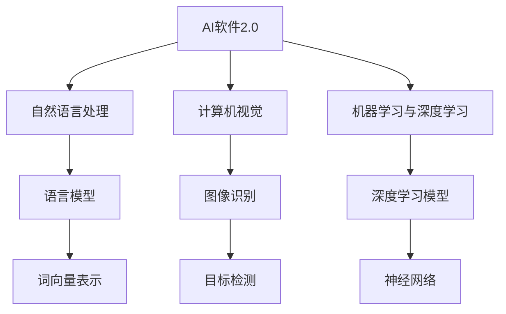
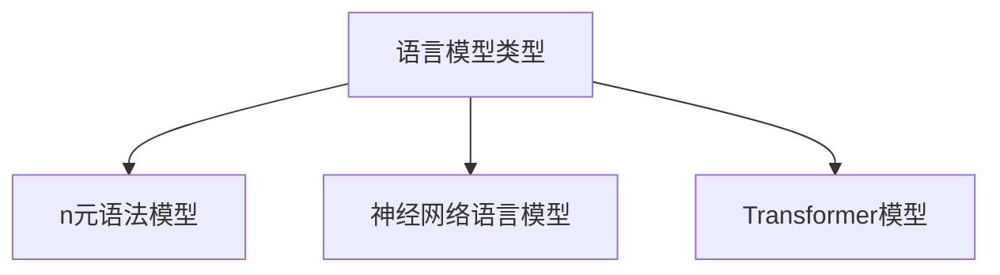
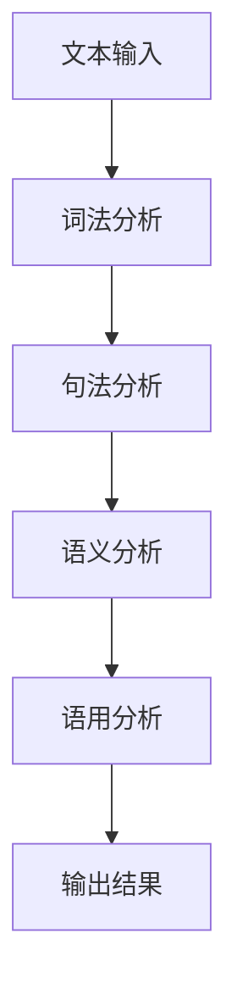

                 

### 引言

#### 1.1 书籍背景与目标

《AI软件2.0的语言基础设施》旨在探索人工智能软件发展的新阶段，即AI软件2.0。这一阶段强调语言作为核心基础设施的重要性，以及它如何驱动AI软件从原始的功能实现向更加智能、自适应的方向进化。本书的目标是提供一个全面而深入的分析，帮助读者理解AI软件2.0的语言基础设施，包括其定义、发展历程、技术体系以及实际应用。

随着人工智能技术的不断进步，自然语言处理（NLP）、计算机视觉（CV）、机器学习与深度学习等领域取得了显著成果。这些技术共同构建了AI软件2.0的基础，使得软件能够更好地理解和生成人类语言，从而在多个应用场景中实现智能化。

本书的主要贡献在于：

1. **系统性地概述AI软件2.0的概念**：从AI软件1.0的背景出发，深入探讨AI软件2.0的内涵和外延。
2. **深入分析语言基础设施的关键技术**：详细介绍语言模型的构建、优化方法以及语言理解与生成技术。
3. **探讨语言基础设施在企业级和个人用户应用中的实践**：通过实际案例，展示语言基础设施如何在不同场景中发挥作用。
4. **展望语言基础设施的未来发展趋势**：分析当前面临的挑战，预测未来可能的技术创新方向。

#### 1.2 读者对象

本书适合以下读者群体：

1. **人工智能领域的研究人员**：希望深入了解AI软件2.0的语言基础设施及其应用。
2. **软件开发工程师**：对自然语言处理、机器学习等技术在软件开发中的应用感兴趣。
3. **数据科学家**：希望掌握语言处理技术在数据分析中的应用。
4. **AI产品经理**：负责设计和管理AI产品，需要了解AI软件2.0的语言基础设施。
5. **学术研究人员**：对自然语言处理、机器学习等领域的最新进展和未来方向感兴趣。

#### 1.3 内容组织结构

本书分为五个主要部分：

1. **引言**：介绍书籍的背景、目标、读者对象和内容组织结构。
2. **AI软件2.0概述**：探讨AI软件2.0的定义、发展历程和技术体系。
3. **语言基础设施**：深入分析语言模型的基础知识、构建方法和关键技术。
4. **语言理解与生成**：详细讲解语言理解与生成的概念、技术及其应用。
5. **应用实践**：探讨语言基础设施在企业级和个人用户应用中的实践案例。
6. **未来展望**：分析语言基础设施面临的挑战和未来发展趋势。

通过这五个部分，本书将为读者提供一个系统而深入的视角，帮助理解AI软件2.0的语言基础设施，并探讨其在未来技术发展中的重要作用。

### AI软件2.0概述

#### 2.1 AI软件2.0的概念

AI软件2.0是指人工智能软件发展的第二个阶段，这一阶段标志着人工智能软件从传统功能实现向更加智能、自适应的方向进化。AI软件1.0阶段主要关注的是如何通过预设规则和模型来执行特定任务，如图像识别、语音识别等。而AI软件2.0则强调通过自然语言处理（NLP）、计算机视觉（CV）、机器学习与深度学习等关键技术，使软件具备更加复杂的智能交互能力和自主学习能力。

与AI软件1.0相比，AI软件2.0具有以下几个显著特点：

1. **语言理解与生成能力**：AI软件2.0能够更好地理解和生成人类语言，实现自然的人机交互。
2. **自适应能力**：通过持续学习和优化，AI软件2.0能够适应不断变化的环境和需求。
3. **跨领域应用**：AI软件2.0不再局限于单一领域，而是能够在多个领域实现智能化应用。

AI软件2.0的核心在于将语言作为基础设施，使得软件能够更自然地与人类互动，从而推动人工智能技术在各个领域的广泛应用。

#### 2.1.1 AI软件1.0与AI软件2.0的差异

AI软件1.0和AI软件2.0在多个方面存在显著差异：

1. **交互方式**：AI软件1.0主要通过预设的规则和模型与用户交互，交互过程相对固定和简单。而AI软件2.0则通过自然语言处理技术，实现与用户的自然语言交互，交互过程更加灵活和多样化。
2. **学习能力**：AI软件1.0主要依靠预设的模型和数据，缺乏自我学习和适应能力。而AI软件2.0则通过机器学习和深度学习技术，具备自主学习能力，能够不断优化和改进性能。
3. **应用场景**：AI软件1.0主要应用于特定领域，如图像识别、语音识别等。而AI软件2.0则能够跨领域应用，如自然语言处理、计算机视觉等，具有更广泛的应用前景。

这些差异体现了AI软件从传统功能实现向智能化、自适应方向发展的趋势。

#### 2.1.2 AI软件2.0的特点

AI软件2.0的特点主要体现在以下几个方面：

1. **语言处理能力**：AI软件2.0通过自然语言处理技术，能够理解和生成人类语言，实现自然的人机交互。这使得AI软件能够更准确地理解和满足用户的需求。
2. **自适应能力**：AI软件2.0通过机器学习和深度学习技术，能够从海量数据中学习并适应不断变化的环境和需求，提高软件的灵活性和适应性。
3. **跨领域应用**：AI软件2.0不仅能够应用于特定领域，如自然语言处理、计算机视觉等，还能够跨领域应用，实现多个领域的智能化。
4. **自主学习能力**：AI软件2.0具备自我学习能力，能够通过持续学习和优化，不断提升软件的性能和智能水平。

这些特点使得AI软件2.0在多个领域具有广泛的应用前景，成为推动人工智能技术发展的重要力量。

#### 2.2 AI软件2.0的发展历程

AI软件2.0的发展历程可以分为以下几个阶段：

1. **AI软件1.0阶段**：这一阶段主要关注如何通过预设规则和模型实现特定功能，如图像识别、语音识别等。虽然取得了一定的成果，但受限于技术和数据，AI软件的智能化程度较低。
2. **AI软件1.5阶段**：随着机器学习和深度学习技术的发展，AI软件开始具备一定的自主学习能力，能够通过训练模型来提高性能。这一阶段标志着AI软件向智能化方向发展。
3. **AI软件2.0阶段**：通过自然语言处理、计算机视觉等关键技术，AI软件实现了更高层次的智能化，具备语言理解和生成能力，能够实现更复杂的智能交互和自适应应用。

从AI软件1.0到AI软件2.0，人工智能技术经历了从功能实现向智能化、自适应方向的重大转变，为未来的发展奠定了坚实的基础。

#### 2.2.1 从AI软件1.0到AI软件2.0的演变

从AI软件1.0到AI软件2.0的演变，主要体现在以下几个方面：

1. **技术体系**：AI软件1.0主要依赖于传统的人工预设规则和模型，而AI软件2.0则通过机器学习和深度学习技术，构建了更加复杂和智能的模型体系。
2. **数据处理**：AI软件1.0阶段的数据处理能力有限，主要依靠手工标注的数据。而AI软件2.0则能够利用大规模的未标注数据，通过无监督学习和半监督学习技术，提高数据处理能力。
3. **学习能力**：AI软件1.0主要依靠预设的规则和模型，缺乏自我学习能力。而AI软件2.0则通过持续学习和优化，实现了自我学习能力，能够不断适应和改进。
4. **应用场景**：AI软件1.0主要应用于特定领域，如图像识别、语音识别等。而AI软件2.0则能够跨领域应用，实现自然语言处理、计算机视觉等多个领域的智能化。

这一演变过程，标志着人工智能技术从传统功能实现向智能化、自适应方向的重大突破。

#### 2.2.2 AI软件2.0的关键技术

AI软件2.0的发展离不开以下几个关键技术的支撑：

1. **自然语言处理（NLP）**：NLP是AI软件2.0的核心技术之一，通过深度学习、语义分析等技术，使软件能够理解和生成人类语言，实现自然的人机交互。
2. **计算机视觉（CV）**：CV技术使AI软件能够理解和解析视觉信息，包括图像识别、目标检测、图像生成等，为智能应用提供了基础。
3. **机器学习与深度学习**：机器学习和深度学习技术为AI软件2.0提供了强大的自主学习能力，通过模型训练和数据优化，不断提升软件的性能和智能化水平。
4. **多模态融合**：多模态融合技术能够整合不同类型的数据，如文本、图像、语音等，实现更全面的智能理解和生成。

这些关键技术的结合，使得AI软件2.0在智能化、自适应方向上取得了显著突破。

#### 2.3 AI软件2.0的应用场景

AI软件2.0具有广泛的应用场景，主要包括以下几个方面：

1. **企业级应用**：在企业管理、客户服务、市场营销等领域，AI软件2.0能够通过自然语言处理、计算机视觉等技术，实现智能化的业务流程优化和决策支持。
2. **个人用户应用**：在智能助手、智能家居、在线教育等领域，AI软件2.0能够通过智能交互、个性化推荐等技术，提供更加便捷、高效的个性化服务。
3. **医疗健康**：在医疗诊断、健康监测、药物研发等领域，AI软件2.0能够通过深度学习和自然语言处理技术，提高诊断准确性、降低医疗成本。
4. **金融领域**：在风险管理、信用评估、投资决策等领域，AI软件2.0能够通过大数据分析和机器学习技术，提供更加精准和智能的风险管理和决策支持。

这些应用场景展示了AI软件2.0在多个领域的重要作用和广阔前景。

### 语言基础设施

#### 3.1 自然语言处理的基本概念

自然语言处理（NLP）是AI软件2.0语言基础设施的核心组成部分，旨在使计算机能够理解和处理人类自然语言。NLP技术涵盖了多个层面，包括文本预处理、词法分析、句法分析、语义分析和语用分析等。

1. **文本预处理**：文本预处理是NLP的基础步骤，包括分词、去除停用词、词干提取等。通过预处理，可以将原始文本转换为计算机可处理的格式。
2. **词法分析**：词法分析涉及对文本中的单词进行分割，识别出词素、词根等。词法分析是NLP中的关键技术之一，有助于理解文本的基本结构。
3. **句法分析**：句法分析旨在理解句子的结构，识别出主语、谓语、宾语等成分。通过句法分析，可以更深入地理解文本的含义。
4. **语义分析**：语义分析涉及对文本中的词语和句子进行语义理解，识别出概念、关系和意图等。语义分析是NLP中的难点，但也是实现语言理解和生成的关键步骤。
5. **语用分析**：语用分析旨在理解语言在实际使用中的功能和效果，包括语气、语境和语用推理等。语用分析有助于实现更自然的语言交互。

#### 3.2 自然语言处理的关键技术

自然语言处理的关键技术包括词向量表示、递归神经网络（RNN）和长短时记忆网络（LSTM）等。

1. **词向量表示**：词向量表示是将单词映射为向量的过程，通过词向量可以捕捉单词的语义信息。常用的词向量模型包括Word2Vec、GloVe和BERT等。
2. **递归神经网络（RNN）**：RNN是一种能够处理序列数据的神经网络，通过循环结构，RNN可以捕捉序列中的长期依赖关系。RNN在语言模型、机器翻译和情感分析等领域取得了显著成果。
3. **长短时记忆网络（LSTM）**：LSTM是RNN的一种改进模型，通过引入门控机制，LSTM能够更好地捕捉序列中的长期依赖关系。LSTM在文本分类、语音识别和机器翻译等领域得到了广泛应用。

这些关键技术的应用，使得自然语言处理技术不断取得突破，推动了AI软件2.0的发展。

#### 3.3 语言模型的构建

语言模型的构建是自然语言处理的基础，通过训练大量语言数据，语言模型可以学习到语言的统计规律和语义信息。

1. **语言模型的基本原理**：语言模型是一种概率模型，用于预测下一个单词或词组。常见的语言模型包括n元语法模型、神经网络语言模型和Transformer模型等。
2. **语言模型的主要类型**：
   - **n元语法模型**：n元语法模型是一种基于统计的模型，通过统计前n个单词出现的概率来预测下一个单词。n元语法模型简单有效，但无法捕捉长期依赖关系。
   - **神经网络语言模型**：神经网络语言模型通过深度学习技术，可以捕捉到语言中的复杂模式和长期依赖关系。神经网络语言模型在语言理解和生成任务中表现出色。
   - **Transformer模型**：Transformer模型是一种基于自注意力机制的神经网络语言模型，通过自注意力机制，Transformer模型可以同时关注输入序列中的所有信息，从而实现高效的序列建模。

3. **语言模型的优化**：语言模型的优化主要包括参数优化、结构优化和训练优化等。通过优化，可以提高语言模型的性能和泛化能力。常用的优化方法包括梯度下降、Adam优化器、Dropout等。

#### 3.4 语言模型的优化方法

语言模型的优化是提高模型性能和泛化能力的关键步骤。以下介绍几种常见的优化方法：

1. **梯度下降**：梯度下降是一种优化方法，通过计算损失函数关于模型参数的梯度，来更新模型参数。梯度下降可以分为随机梯度下降（SGD）、批量梯度下降（BGD）和迷你批量梯度下降（MBGD）等。
2. **Adam优化器**：Adam优化器是一种结合了AdaGrad和RMSProp优化的自适应优化器，通过自适应地调整学习率，提高模型的收敛速度和稳定性。
3. **Dropout**：Dropout是一种正则化方法，通过随机丢弃一部分神经元，防止模型过拟合。Dropout可以在训练过程中引入噪声，提高模型的泛化能力。
4. **学习率调整**：学习率调整是优化过程中的重要环节，通过调整学习率，可以控制模型在训练过程中的收敛速度和稳定性。常用的学习率调整方法包括固定学习率、学习率衰减和自适应学习率等。

通过这些优化方法，可以显著提高语言模型的性能和泛化能力，为自然语言处理任务提供强大的支持。

#### 3.5 语言模型优化策略

在优化语言模型时，需要综合考虑多个方面，包括数据预处理、模型选择、训练策略和评估方法等。以下介绍几种常见的语言模型优化策略：

1. **数据预处理**：数据预处理是优化语言模型的基础，包括分词、去停用词、词干提取等步骤。通过高质量的预处理，可以提高模型的训练效果和泛化能力。
2. **模型选择**：选择合适的模型是优化语言模型的关键。常用的语言模型包括n元语法模型、神经网络语言模型和Transformer模型等。根据具体任务和数据特点，选择合适的模型，可以显著提高模型性能。
3. **训练策略**：训练策略包括数据增强、批处理大小、迭代次数等。通过优化训练策略，可以加快模型的收敛速度和提升模型性能。常用的训练策略包括早期停止、学习率调整、批量归一化等。
4. **评估方法**：评估方法是衡量模型性能的重要手段。常用的评估指标包括准确率、召回率、F1值等。通过合理的评估方法，可以准确评估模型的性能，为优化提供指导。

通过这些优化策略，可以进一步提高语言模型的性能和泛化能力，为自然语言处理任务提供有力支持。

### 语言理解与生成

#### 3.1 语言理解

语言理解是自然语言处理的核心任务之一，旨在使计算机能够理解人类语言。语言理解涉及多个层面，包括词义理解、句义理解和语义理解等。

1. **词义理解**：词义理解是指对单词的含义进行理解和识别。通过词义理解，可以确定单词在特定上下文中的意义。词义理解是语言理解的基础，对于语言生成的任务也非常重要。
2. **句义理解**：句义理解是指对句子的整体意义进行理解和识别。通过句义理解，可以捕捉句子中的主旨、意图和情感等信息。句义理解是语言理解的重要环节，对于文本分类、情感分析等任务至关重要。
3. **语义理解**：语义理解是指对文本的深层含义进行理解和识别。通过语义理解，可以识别出文本中的概念、关系和意图等。语义理解是语言理解的最高层次，对于智能对话、问答系统等任务具有重要意义。

语言理解的关键技术包括词向量表示、递归神经网络（RNN）和长短时记忆网络（LSTM）等。这些技术能够有效捕捉语言中的复杂模式和依赖关系，提高语言理解的准确性和泛化能力。

#### 3.2 语言理解的关键技术

在实现语言理解的过程中，需要运用一系列关键技术，以捕捉语言中的复杂模式和依赖关系。以下介绍几种重要的语言理解关键技术：

1. **词向量表示**：词向量表示是将单词映射为向量的过程，通过词向量可以捕捉单词的语义信息。常用的词向量模型包括Word2Vec、GloVe和BERT等。词向量表示有助于实现高效的语义计算和语言理解。
2. **递归神经网络（RNN）**：RNN是一种能够处理序列数据的神经网络，通过循环结构，RNN可以捕捉序列中的长期依赖关系。RNN在语言模型、机器翻译和情感分析等领域取得了显著成果。
3. **长短时记忆网络（LSTM）**：LSTM是RNN的一种改进模型，通过引入门控机制，LSTM能够更好地捕捉序列中的长期依赖关系。LSTM在文本分类、语音识别和机器翻译等领域得到了广泛应用。
4. **注意力机制**：注意力机制是一种能够关注输入序列中重要信息的机制，通过自注意力或互注意力，注意力机制能够有效提高语言理解的准确性和效果。
5. **预训练和微调**：预训练是指在大规模语料上进行模型的训练，以学习语言的一般规律。微调是指利用预训练模型在特定任务上进行微调，以适应具体任务的需求。预训练和微调是近年来在自然语言处理领域取得的重要进展。

这些关键技术的结合，使得语言理解任务取得了显著突破，推动了自然语言处理技术的发展。

#### 3.3 语言生成

语言生成是自然语言处理的另一个核心任务，旨在使计算机能够生成人类语言。语言生成包括文本生成、对话生成和语音合成等任务。

1. **文本生成**：文本生成是指根据输入的信息生成文本。常见的文本生成任务包括文本摘要、文章生成和对话生成等。文本生成技术能够自动生成具有自然流畅性的文本，为信息检索、内容生成等领域提供了重要支持。
2. **对话生成**：对话生成是指根据用户的输入生成合适的回复。对话生成技术广泛应用于聊天机器人、智能客服和虚拟助手等领域。通过对话生成，可以实现与用户的自然交互，提供个性化的服务。
3. **语音合成**：语音合成是指将文本转换为语音。语音合成技术能够将文本信息转化为自然流畅的语音，为听障人士提供无障碍的沟通渠道，也为智能家居、车载系统等领域提供了重要应用。

语言生成技术主要包括生成式模型和解析式模型等。生成式模型通过生成文本的概率分布，生成具有自然流畅性的文本。常见的生成式模型包括序列到序列模型、变分自编码器和生成对抗网络等。解析式模型通过解析输入的语法结构和语义信息，生成符合语法和语义规则的文本。常见的解析式模型包括依存句法分析、语义角色标注和语义角色抽取等。

通过这些技术，语言生成能够实现自然流畅的文本生成，满足各种应用场景的需求。

### 语言基础设施在企业级应用

#### 4.1 企业级应用的需求分析

企业级应用在数字化转型和智能化升级过程中，对语言基础设施的需求日益增长。以下是企业级应用对语言基础设施的主要需求：

1. **智能客服**：企业级应用中的智能客服系统需要能够理解用户的语言，提供准确和自然的回复，以提高客户满意度和降低运营成本。
2. **智能助手**：企业内部智能助手能够协助员工完成日常工作任务，如日程管理、文档搜索和智能问答等，提高工作效率。
3. **文本分析**：企业需要对大量文本数据进行分析，如客户反馈、市场报告和竞争对手分析等，以提取有价值的信息和洞察。
4. **语音交互**：企业需要实现语音交互功能，使员工和客户能够通过语音与系统进行沟通，提供更加便捷的服务。

这些需求推动了企业级应用对语言基础设施的广泛采用，为智能化升级提供了有力支持。

#### 4.1.1 企业级应用的案例

以下是一些企业级应用中语言基础设施的实际案例：

1. **智能客服系统**：某大型电子商务公司引入了基于自然语言处理技术的智能客服系统，能够自动识别和回应客户的咨询，提高了客户满意度和响应速度。
2. **智能助手**：某跨国公司开发了内部智能助手，能够协助员工处理各种工作任务，如日程安排、邮件回复和文档搜索等，大大提高了工作效率。
3. **文本分析平台**：某金融企业利用语言基础设施构建了文本分析平台，对大量市场报告和客户反馈进行分析，提取了有价值的市场信息和客户洞察。
4. **语音交互系统**：某智能家居公司开发了基于语音交互的系统，使用户可以通过语音控制智能设备，提高了用户的使用体验。

这些案例展示了语言基础设施在企业级应用中的重要性和广泛应用。

#### 4.1.2 企业级应用的优势

语言基础设施在企业级应用中具有以下几个显著优势：

1. **提高效率**：通过自然语言处理和语音识别技术，企业能够实现自动化和智能化，减少人工操作和重复劳动，提高工作效率。
2. **降低成本**：智能客服和智能助手等应用能够减少人力成本，提高运营效率，从而降低企业成本。
3. **提升客户体验**：智能客服系统能够提供24/7全天候服务，快速响应用户需求，提高客户满意度和忠诚度。
4. **增强决策支持**：通过文本分析技术，企业能够从大量文本数据中提取有价值的信息和洞察，为决策提供支持。
5. **实现个性化服务**：智能助手和语音交互系统能够根据用户的行为和偏好，提供个性化的服务和推荐，提高用户满意度。

这些优势使得语言基础设施成为企业级应用的重要组成部分，为企业提供了强大的支持。

### 语言基础设施在个人用户应用

#### 4.2.1 个人用户应用的案例

语言基础设施在个人用户应用中也展现了巨大的潜力，以下是一些具体的案例：

1. **智能助手**：个人用户可以通过智能助手实现日常任务的自动化，如日程管理、提醒设置、邮件回复等。智能助手能够理解用户的自然语言输入，提供准确和个性化的服务。
2. **智能家居控制**：用户可以通过语音控制智能家居设备，如照明、空调、安防系统等。语音识别技术使得用户能够方便地控制家居环境，提高生活便利性。
3. **语音搜索**：用户可以通过语音进行搜索，快速获取所需信息。语音搜索技术能够理解用户的语音输入，并提供准确的搜索结果，为用户提供高效的信息检索服务。
4. **语音翻译**：语音翻译应用使得用户能够实时翻译不同语言的对话，为国际交流提供了便利。语音翻译技术能够理解多种语言的语音输入，并提供准确的翻译结果。

这些案例展示了语言基础设施在个人用户应用中的广泛应用和重要性。

#### 4.2.2 个人用户应用的优势

语言基础设施在个人用户应用中具有以下几个显著优势：

1. **便捷性**：通过自然语言处理和语音识别技术，用户可以方便地通过语音或文本进行交互，实现日常任务的自动化和智能化。
2. **个性化服务**：智能助手和语音交互系统能够根据用户的行为和偏好，提供个性化的服务和推荐，提高用户体验。
3. **提高效率**：语音搜索和智能助手等应用能够快速响应用户需求，减少手动操作的步骤，提高工作效率。
4. **增强沟通**：语音翻译和智能助手等应用能够帮助用户进行跨语言交流，为国际旅行和商务活动提供便利。
5. **提供娱乐**：语音交互系统和智能助手能够为用户提供音乐、新闻、故事等娱乐内容，丰富用户的日常生活。

这些优势使得语言基础设施在个人用户应用中越来越受欢迎，成为现代生活的重要组成部分。

### 语言基础设施的未来发展

#### 5.1 语言基础设施的挑战

随着AI软件2.0的快速发展，语言基础设施面临着一系列挑战，主要包括以下几个方面：

1. **数据隐私和安全性**：语言模型在训练过程中需要大量用户数据，如何保护用户隐私和数据安全成为重要问题。随着数据隐私法规的加强，语言基础设施需要采取措施确保数据的安全和合规性。
2. **语言多样性**：全球语言种类繁多，不同语言和文化背景的用户对语言处理的需求存在差异。如何实现多语言处理和跨文化交互，成为语言基础设施面临的一大挑战。
3. **低资源语言处理**：与高资源语言相比，低资源语言在数据量和研究资源上存在明显不足，如何提高低资源语言的识别和处理能力，成为语言基础设施发展的重要方向。
4. **长文本理解**：语言模型在处理长文本时，容易受到长距离依赖和信息冗余的影响，如何提高长文本理解的能力，是语言基础设施需要解决的关键问题。
5. **模型可解释性**：随着模型的复杂性和深度增加，语言模型的可解释性变得越来越困难。如何提高模型的可解释性，使决策过程更加透明和可靠，是语言基础设施面临的挑战之一。

这些挑战需要通过技术创新和跨学科合作来解决，以推动语言基础设施的持续发展。

#### 5.2 语言基础设施的未来趋势

尽管面临着诸多挑战，语言基础设施在未来仍将展现出强劲的发展势头，以下是几个可能的未来趋势：

1. **多模态融合**：随着计算机视觉、语音识别和自然语言处理等技术的发展，多模态融合将成为语言基础设施的重要方向。通过整合不同类型的数据，语言模型可以更全面地理解和生成人类语言。
2. **深度强化学习**：深度强化学习结合了深度学习和强化学习的技术优势，能够在复杂环境中进行自主学习和优化。未来，深度强化学习有望在语言模型中发挥重要作用，实现更加智能的交互和生成。
3. **生成对抗网络（GAN）**：生成对抗网络通过生成器和判别器的对抗训练，能够生成高质量的语言数据，有助于提高语言模型的训练效果和泛化能力。GAN有望在未来语言基础设施的发展中发挥重要作用。
4. **跨学科合作**：语言基础设施的发展需要多学科的协同合作，包括计算机科学、语言学、心理学、社会学等领域。通过跨学科合作，可以推动语言基础设施的理论创新和技术突破。
5. **开源生态**：开源生态在语言基础设施的发展中起到了至关重要的作用。未来，更多的开源框架、工具和平台将涌现，推动语言基础设施的普及和应用。

这些趋势将为语言基础设施的发展提供新的机遇和动力。

### 附录

#### 附录1：AI软件2.0语言基础设施相关资源

**1. 开源框架**

- **TensorFlow**：TensorFlow是Google开源的机器学习框架，广泛应用于自然语言处理、计算机视觉等任务。
- **PyTorch**：PyTorch是Facebook开源的深度学习框架，具有灵活的动态计算图和强大的GPU支持。
- **Transformers**：Transformers是一个开源库，实现了基于自注意力机制的Transformer模型，广泛应用于自然语言处理任务。

**2. 工具与平台**

- **NLTK**：NLTK是Python的一个自然语言处理工具包，提供了丰富的文本处理功能。
- **spaCy**：spaCy是一个快速且易于使用的自然语言处理库，适用于各种文本处理任务。
- **LanguageModel**：LanguageModel是一个开源语言模型库，支持多种语言模型和算法。

**3. 其他工具**

- **Word2Vec**：Word2Vec是一个用于生成词向量的工具，通过训练可以得到词向量表示。
- **GloVe**：GloVe是一种基于全局共现信息的词向量生成方法，能够得到高质量的词向量。
- **BERT**：BERT是Google开发的预训练语言模型，通过在大量文本数据上进行预训练，可以显著提高语言理解能力。

这些资源和工具为研究人员和开发者提供了丰富的选择，有助于推动AI软件2.0语言基础设施的发展。

### 图表与公式

#### 图表

**1. AI软件2.0的架构**

**2. 语言模型的类型**

**3. 语言理解的流程**

这些图表帮助读者更直观地理解AI软件2.0的架构、语言模型的类型以及语言理解的流程。

#### 公式

**1. 语言模型的损失函数**

$$
L = -\frac{1}{N}\sum_{i=1}^{N}\sum_{j=1}^{V}\hat{y}_{ij}\log(p_{ij})
$$

其中，\(N\) 是句子中单词的数量，\(V\) 是词汇表的大小，\(\hat{y}_{ij}\) 是实际单词的标签，\(p_{ij}\) 是预测单词的概率。

**2. 语言生成的评价指标**

$$
BLEU = 1 - \frac{1}{N}\sum_{i=1}^{N}\frac{2}{l(y_i) + l(h_i)}
$$

其中，\(N\) 是参考句子的数量，\(l(y_i)\) 是参考句子 \(y_i\) 的长度，\(l(h_i)\) 是生成句子 \(h_i\) 的长度。

这些公式详细描述了语言模型的损失函数和语言生成的评价指标，为读者提供了深入理解语言模型性能的数学基础。

### 结论

通过《AI软件2.0的语言基础设施》的探讨，我们全面了解了AI软件2.0的定义、特点、发展历程以及语言基础设施的关键技术。从AI软件1.0到AI软件2.0的演变，标志着人工智能技术从功能实现向智能化、自适应方向的重要突破。语言基础设施作为AI软件2.0的核心组成部分，通过自然语言处理、计算机视觉、机器学习与深度学习等关键技术的结合，实现了语言理解与生成的智能化。

在实际应用中，语言基础设施在多个领域展现出强大的潜力，包括企业级应用和个人用户应用。未来，随着多模态融合、深度强化学习、生成对抗网络等新技术的不断发展，语言基础设施将进一步推动AI软件2.0的普及和应用。

展望未来，语言基础设施的发展将面临诸多挑战，如数据隐私和安全性、语言多样性、低资源语言处理等。然而，通过跨学科合作和技术创新，我们有理由相信，语言基础设施将在AI软件2.0时代发挥更加重要的作用，推动人工智能技术迈向新的高度。

### 未来展望

随着AI软件2.0的不断发展，语言基础设施在未来的技术发展中将扮演至关重要的角色。以下是几个值得关注的未来发展趋势：

1. **多模态融合**：未来的语言基础设施将更加注重多模态数据的融合，整合文本、图像、语音等多种类型的数据，实现更全面、更精准的语言理解和生成。这种多模态融合将极大地提升AI软件的智能化水平，为各个领域提供更加丰富的应用场景。

2. **深度强化学习**：深度强化学习（Deep Reinforcement Learning）作为一种结合深度学习和强化学习的方法，将在语言基础设施中发挥重要作用。通过深度强化学习，AI软件可以更好地适应动态变化的场景，实现更加智能的决策和交互。

3. **生成对抗网络（GAN）**：生成对抗网络（GAN）是一种通过生成器和判别器对抗训练的方法，可以生成高质量的语言数据。在未来，GAN有望在语言模型训练中发挥更大的作用，提高模型的训练效果和泛化能力。

4. **跨学科合作**：语言基础设施的发展需要多学科的协同合作，包括计算机科学、语言学、心理学、社会学等。通过跨学科合作，可以推动语言基础设施的理论创新和技术突破，为人工智能技术的进步提供新的动力。

5. **开源生态**：开源生态在语言基础设施的发展中起着至关重要的作用。未来，将有更多的开源框架、工具和平台涌现，为研究人员和开发者提供丰富的资源和支持，促进语言基础设施的普及和应用。

在技术挑战方面，语言基础设施需要解决以下问题：

1. **数据隐私和安全性**：随着AI软件对用户数据的依赖性增加，如何保护用户隐私和数据安全将成为重要挑战。未来的语言基础设施需要建立更加完善的数据隐私保护机制，确保用户数据的安全和合规性。

2. **语言多样性**：全球语言的多样性使得多语言处理和跨文化交互成为一个重要课题。如何实现高质量的多语言处理，满足不同语言和文化背景用户的需求，是语言基础设施需要解决的关键问题。

3. **低资源语言处理**：与高资源语言相比，低资源语言在数据量和研究资源上存在显著不足。如何提高低资源语言的识别和处理能力，为全球更多的语言提供服务，是语言基础设施未来需要重点关注的领域。

4. **长文本理解**：长文本理解是自然语言处理中的一个难点，语言模型在处理长文本时容易受到长距离依赖和信息冗余的影响。如何提高长文本理解的能力，是语言基础设施需要克服的技术挑战。

5. **模型可解释性**：随着模型的复杂性和深度增加，模型的可解释性变得越来越困难。如何提高模型的可解释性，使决策过程更加透明和可靠，是语言基础设施面临的重要问题。

通过技术创新和跨学科合作，我们有理由相信，未来的语言基础设施将不断突破这些技术挑战，推动人工智能技术迈向新的高度，为社会带来更加智能和便捷的服务。

