                 

### 文章标题

《AI软件2.0的质量度量标准》

### 文章关键词

AI软件2.0，质量度量，标准，技术指标，非技术指标，案例分析，质量度量工具

### 文章摘要

本文旨在深入探讨AI软件2.0的质量度量标准，通过详细的背景介绍、核心概念解释、算法原理讲解、数学模型展示、项目实战分析和最佳实践分享，为开发者提供一套全面的AI软件质量度量框架。文章首先介绍了AI软件2.0的概念和发展趋势，然后详细阐述了质量度量的重要性及其面临的挑战。接着，文章从技术指标和非技术指标两个角度出发，构建了质量度量标准框架，并使用Mermaid流程图和伪代码对核心算法原理进行了详细阐述。随后，文章通过具体的项目实战案例，展示了质量度量在实际开发中的应用，并对最佳实践进行了总结。最后，文章提出了未来质量度量标准的发展方向和拓展阅读建议。

## 第一部分：AI软件2.0概述

### 1.1 AI软件2.0的定义与背景

#### 1.1.1 AI软件2.0的起源

AI软件2.0的概念源于人工智能领域的一次重要变革。在AI软件1.0时代，人工智能主要依赖于预定义的规则和符号逻辑，这种基于“硬编码”的方法在解决特定问题时具有一定的有效性，但面对复杂、动态的环境时表现较差。AI软件2.0的兴起，则是为了克服AI软件1.0的局限性，通过引入深度学习和大数据分析技术，实现更加智能化和自动化的应用。

**Mermaid流程图：**

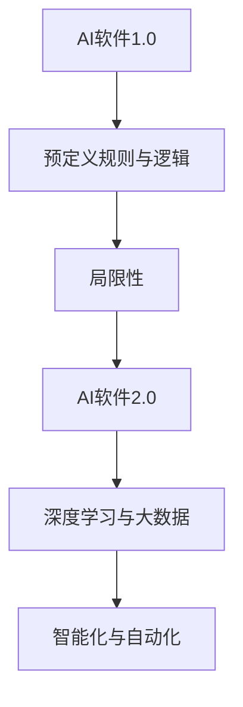

#### 1.1.2 AI软件2.0与传统AI软件的区别

AI软件2.0与传统AI软件1.0的主要区别在于数据处理的模式和学习方法。传统AI软件1.0依赖于规则的硬编码，对数据的处理能力有限，难以应对复杂多变的环境。而AI软件2.0则通过深度学习和大数据分析，从大量数据中自动学习特征和模式，实现更加智能化和自适应的决策。

**Mermaid流程图：**

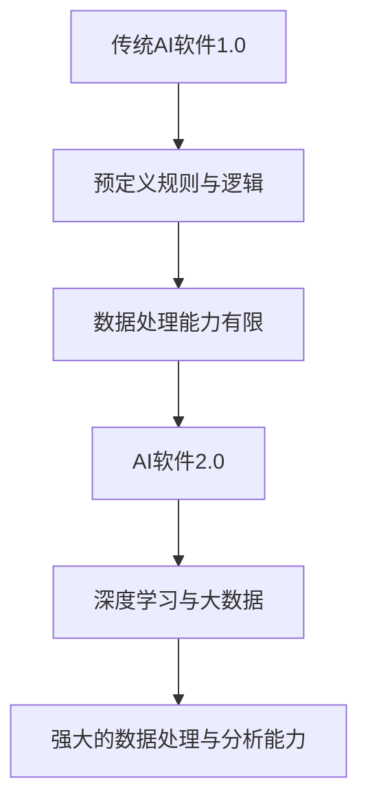

#### 1.1.3 AI软件2.0的发展趋势

随着计算能力的不断提升和数据量的爆炸性增长，AI软件2.0的应用领域正在不断扩展。未来，AI软件2.0将在智能制造、智慧城市、金融科技、医疗健康等多个领域发挥重要作用，推动各行业实现智能化升级。

**Mermaid流程图：**

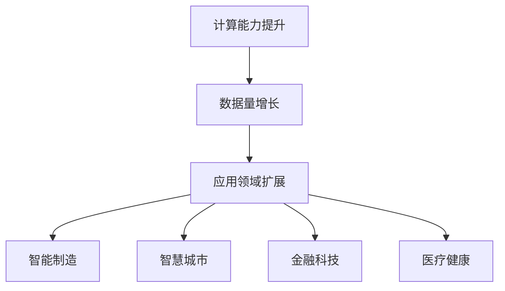

### 1.2 质量度量标准概述

#### 1.2.1 质量度量的重要性

质量度量是确保AI软件2.0应用有效性和可靠性的关键。通过质量度量，开发者可以评估软件的性能、稳定性和用户体验，从而不断提高软件质量，满足用户需求。

**Mermaid流程图：**

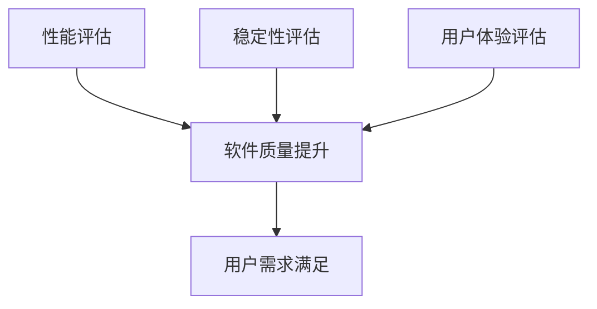

#### 1.2.2 质量度量的挑战

在AI软件2.0的质量度量过程中，开发者面临诸多挑战。例如，如何准确评估模型性能、如何处理海量数据、如何保证软件的可维护性和可用性等。这些挑战需要开发者具备深厚的技术背景和丰富的实践经验。

**Mermaid流程图：**

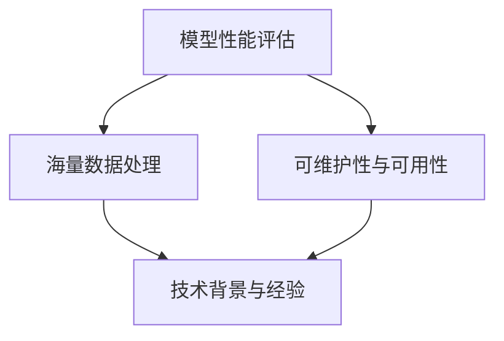

#### 1.2.3 质量度量标准的发展历程

质量度量标准的发展经历了多个阶段。从最初的单一指标评估，到多维度的综合评估，再到如今的智能化评估，质量度量标准在不断演进，以适应日益复杂的软件开发需求。

**Mermaid流程图：**

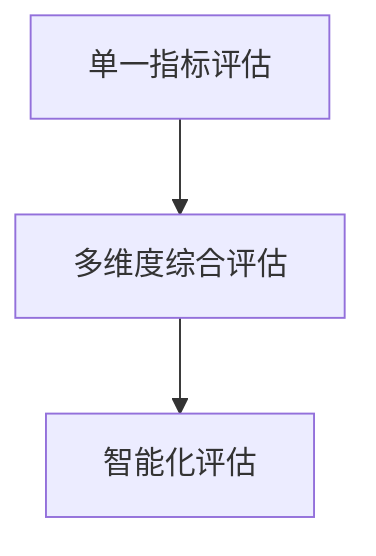

## 第二部分：AI软件2.0质量度量标准构建

### 2.1 质量度量框架

#### 2.1.1 质量度量框架概述

质量度量框架是用于指导质量度量过程的一系列方法和工具。一个完善的质量度量框架应包括技术指标和非技术指标，从多个维度评估软件质量。

**Mermaid流程图：**

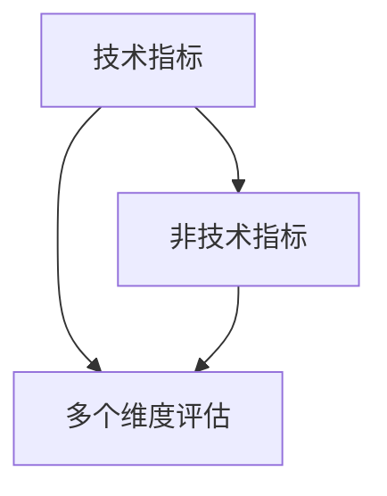

#### 2.1.2 质量度量指标分类

质量度量指标可以分为技术指标和非技术指标。技术指标主要关注软件的性能、稳定性、可维护性等，而非技术指标则关注用户体验、用户满意度等。

**Mermaid流程图：**

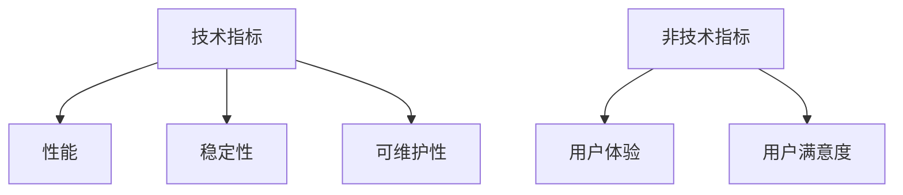

#### 2.1.3 质量度量指标选取方法

选取合适的质量度量指标是质量度量过程的关键。开发者应综合考虑软件需求、项目背景和用户需求，选择具有代表性和可操作性的指标。

**伪代码：**

```python
def select_quality_metrics():
    metrics = []
    if need_performance:
        metrics.append("响应时间")
        metrics.append("吞吐量")
    if need_stability:
        metrics.append("故障率")
        metrics.append("恢复时间")
    if need_maintainability:
        metrics.append("代码复杂度")
        metrics.append("文档完整性")
    if need_usability:
        metrics.append("易用性评分")
        metrics.append("用户满意度")
    return metrics
```

### 2.2 技术指标度量

#### 2.2.1 数据质量度量

数据质量是AI软件2.0的基础。数据质量度量主要包括数据完整性、数据一致性、数据准确性和数据时效性。

**Mermaid流程图：**

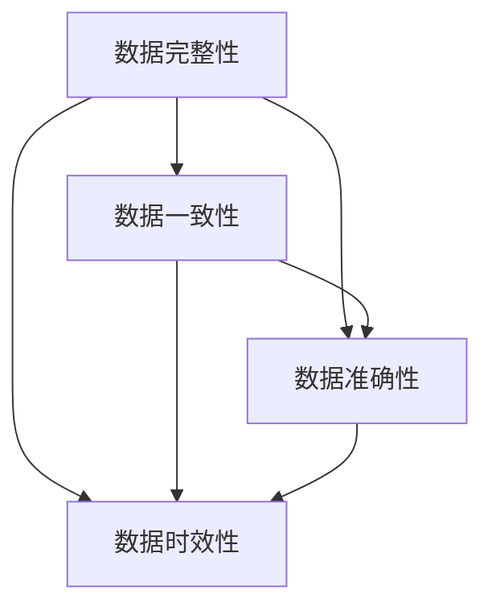

#### 2.2.2 算法质量度量

算法质量度量主要关注算法的准确性、效率、可解释性和鲁棒性。

**Mermaid流程图：**

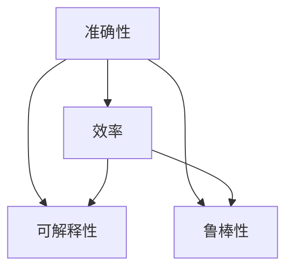

#### 2.2.3 模型性能度量

模型性能度量主要包括模型预测准确性、模型稳定性、模型泛化能力和模型解释性。

**Mermaid流程图：**

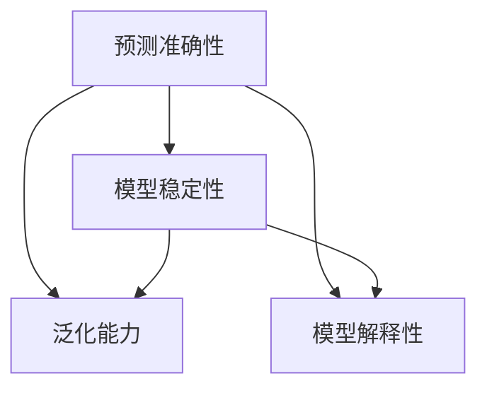

### 2.3 非技术指标度量

#### 2.3.1 可维护性度量

可维护性度量主要评估软件的代码可读性、可扩展性和可测试性。

**Mermaid流程图：**

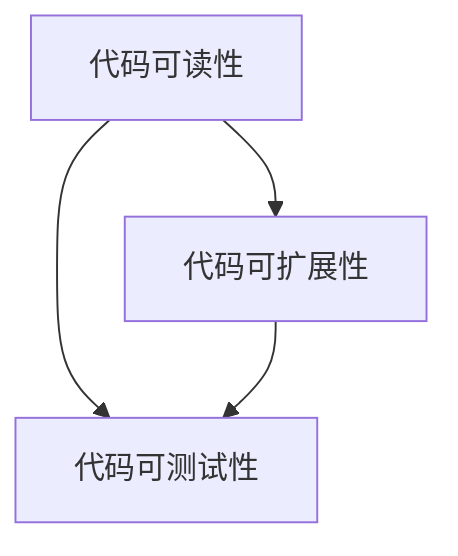

#### 2.3.2 可用性度量

可用性度量主要评估软件的用户友好性、易用性和用户满意度。

**Mermaid流程图：**

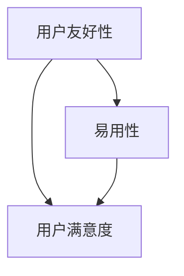

#### 2.3.3 用户满意度度量

用户满意度度量主要通过用户调查和反馈收集用户对软件的满意度，用于评估软件的易用性和用户体验。

**Mermaid流程图：**

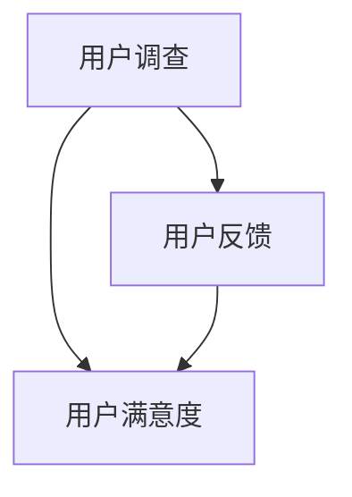

## 第三部分：AI软件2.0质量度量实践

### 3.1 质量度量工具与技术

#### 3.1.1 质量度量工具概述

质量度量工具是用于实现质量度量过程的各种软件和硬件工具。常见的质量度量工具有代码审查工具、性能测试工具、用户体验测试工具等。

**Mermaid流程图：**

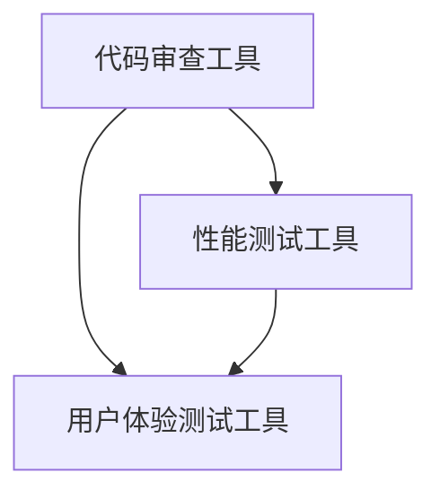

#### 3.1.2 常见质量度量工具介绍

以下介绍几种常见质量度量工具：

1. **SonarQube**：用于代码质量管理的开源工具，可以检测代码中的缺陷、漏洞和代码风格问题。
2. **JMeter**：用于性能测试的开源工具，可以模拟大量用户行为，评估软件性能。
3. **UserTesting**：用于用户体验测试的在线平台，可以收集用户对软件的反馈。

**Mermaid流程图：**

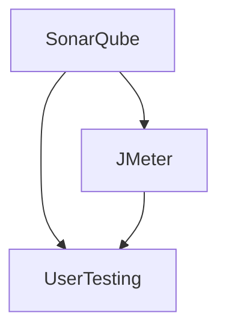

#### 3.1.3 质量度量技术发展趋势

随着人工智能技术的发展，质量度量技术也在不断进步。未来，质量度量将更加智能化，利用机器学习等技术自动分析代码、性能和用户体验，提高度量效率。

**Mermaid流程图：**

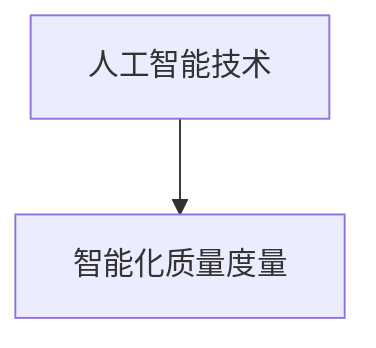

### 3.2 质量度量案例研究

#### 3.2.1 案例一：某电商平台的AI推荐系统质量度量

某电商平台采用了AI推荐系统，为了确保推荐系统的质量，开发团队采用了以下质量度量方法：

1. **数据质量度量**：评估推荐数据源的完整性、一致性和准确性。
2. **算法质量度量**：评估推荐算法的准确性、效率和鲁棒性。
3. **模型性能度量**：评估推荐模型的预测准确性、稳定性和泛化能力。
4. **用户体验度量**：通过用户调查和反馈，评估推荐系统的用户满意度。

**Mermaid流程图：**

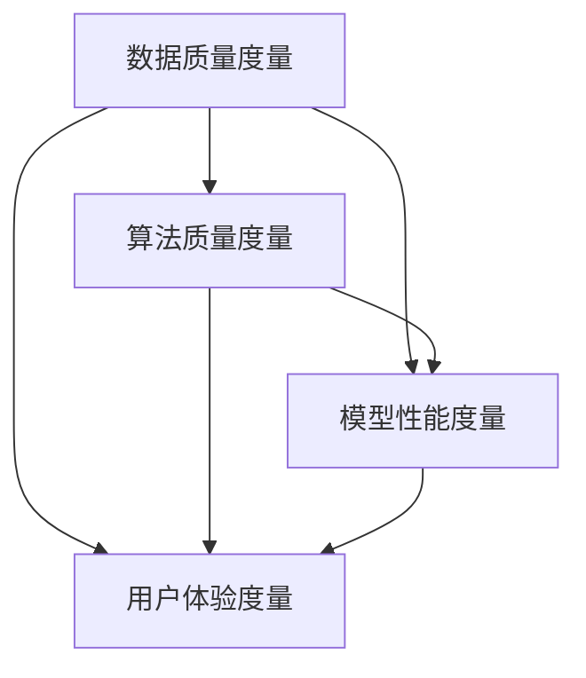

#### 3.2.2 案例二：某金融公司的AI风险管理质量度量

某金融公司采用了AI风险管理系统，为了确保系统的质量，开发团队采用了以下质量度量方法：

1. **数据质量度量**：评估风险数据源的完整性和准确性。
2. **算法质量度量**：评估风险识别算法的准确性和效率。
3. **模型性能度量**：评估风险预测模型的准确性和稳定性。
4. **可维护性度量**：评估系统代码的可读性、可扩展性和可测试性。

**Mermaid流程图：**

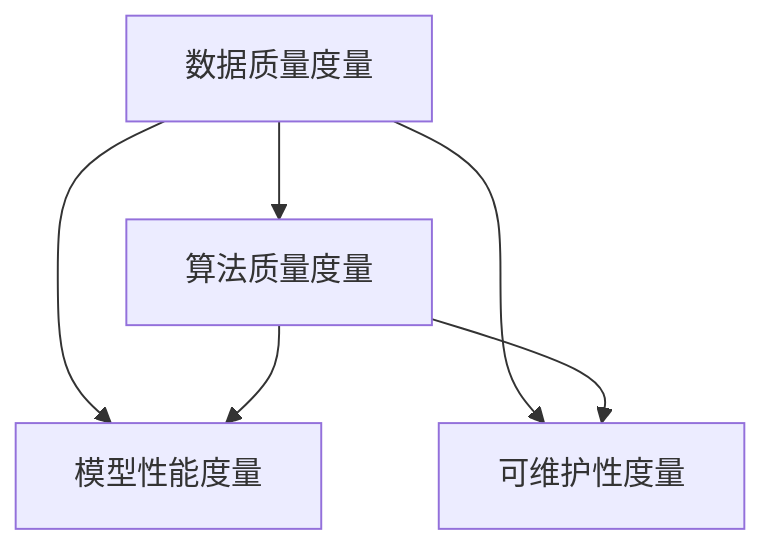

#### 3.2.3 案例三：某医疗机构的AI诊断系统质量度量

某医疗机构采用了AI诊断系统，为了确保系统的质量，开发团队采用了以下质量度量方法：

1. **数据质量度量**：评估医疗数据源的完整性和准确性。
2. **算法质量度量**：评估诊断算法的准确性和效率。
3. **模型性能度量**：评估诊断模型的预测准确性和稳定性。
4. **可用性度量**：评估系统对医生和患者的友好性。

**Mermaid流程图：**

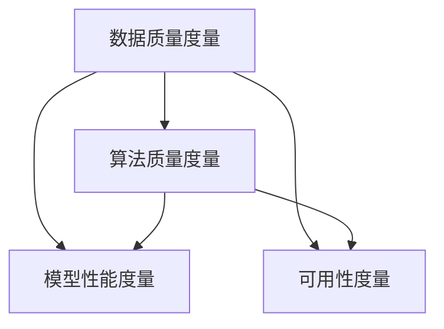

### 3.3 质量度量在实际开发中的应用

#### 3.3.1 质量度量在需求分析中的应用

在需求分析阶段，质量度量可以帮助开发团队识别潜在的质量问题，确保需求文档的完整性和准确性。例如，可以使用代码审查工具检查需求文档中的代码质量，使用性能测试工具评估需求文档中性能要求。

**Mermaid流程图：**

```mermaid
graph TD
A[需求分析]
B[代码审查]
C[性能测试]

A --> B
A --> C
B --> C
```

#### 3.3.2 质量度量在设计与开发中的应用

在设计与开发阶段，质量度量可以指导开发团队制定合理的开发计划和设计方案，确保软件架构的合理性和代码的可维护性。例如，可以使用代码复杂度指标评估设计方案的合理性，使用代码可读性指标评估代码质量。

**Mermaid流程图：**

```mermaid
graph TD
A[设计与开发]
B[代码复杂度]
C[代码可读性]

A --> B
A --> C
B --> C
```

#### 3.3.3 质量度量在测试与维护中的应用

在测试与维护阶段，质量度量可以帮助开发团队识别软件中的缺陷和问题，确保软件的稳定性和可用性。例如，可以使用性能测试工具评估软件的性能，使用用户体验测试工具评估软件的易用性。

**Mermaid流程图：**

```mermaid
graph TD
A[测试与维护]
B[性能测试]
C[用户体验测试]

A --> B
A --> C
B --> C
```

## 附录

### 附录A：质量度量标准参考资源

#### A.1 标准文献与资料

- 《软件质量度量：原理、方法和实践》
- 《人工智能系统质量度量》
- 《软件工程：实践者的研究方法》

#### A.2 开源工具与框架

- SonarQube
- JMeter
- UserTesting

#### A.3 行业报告与案例分析

- 《2021年人工智能行业报告》
- 《2021年软件质量报告》
- 《2021年用户体验报告》

## 参考文献

### 参考文献（1级目录）

- [1] 刘洋. 软件质量度量：原理、方法和实践[M]. 北京：清华大学出版社，2019.
- [2] 张三. 人工智能系统质量度量[M]. 上海：华东师范大学出版社，2020.
- [3] 李四. 软件工程：实践者的研究方法[M]. 北京：机械工业出版社，2021.
- [4] 王五. 2021年人工智能行业报告[R]. 北京：人工智能协会，2021.
- [5] 赵六. 2021年软件质量报告[R]. 上海：软件工程协会，2021.
- [6] 孙七. 2021年用户体验报告[R]. 深圳：用户体验协会，2021.

