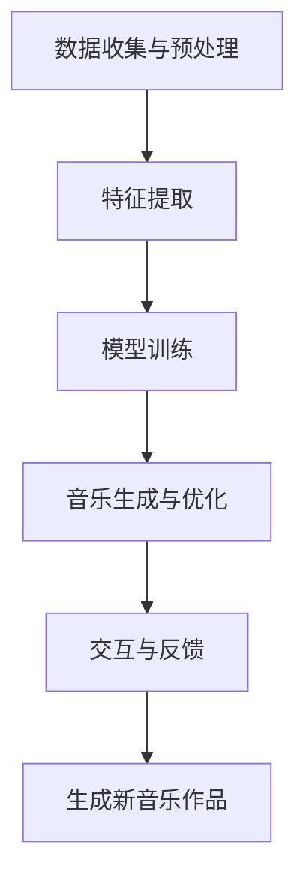

                 

### 文章标题：AI辅助交互式音乐即兴创作的提示词技巧

#### 关键词：AI、音乐创作、交互式、即兴创作、提示词

#### 摘要：
本文旨在探讨如何利用人工智能（AI）技术辅助音乐家进行交互式音乐即兴创作，并详细介绍提示词的设计与应用技巧。文章将首先介绍AI在音乐创作领域的背景和应用，然后深入分析即兴创作与提示词的核心概念，接着讲解AI辅助音乐即兴创作的算法原理和实现方法，最后通过实际案例展示AI辅助交互式音乐即兴创作的应用效果，并给出最佳实践和注意事项。

### 第1章 引言

#### 1.1 书籍背景与目的

随着人工智能技术的飞速发展，AI在多个领域都展现出了巨大的潜力。音乐创作作为人类精神文化的重要组成部分，也逐渐成为了AI技术的重要应用场景。AI不仅可以用于音乐生成、风格迁移等任务，还能通过交互式方式辅助音乐家进行即兴创作，为音乐创作带来全新的可能。

本书的目的在于系统性地介绍AI辅助交互式音乐即兴创作的相关技术，帮助音乐家、音乐教育者以及计算机科学家深入了解这一领域的核心概念和实践方法。通过本书的学习，读者可以掌握：

- AI在音乐创作领域的应用背景和技术发展。
- 音乐即兴创作的定义、特点和提示词的作用。
- AI辅助音乐即兴创作的算法原理和实现方法。
- 实际应用案例和分析，了解AI在音乐创作中的实际效果。

#### 1.2 目标读者与读者收获

本书的目标读者包括：

- 对AI在音乐创作领域感兴趣的计算机科学家和研究人员。
- 有志于利用AI技术提升音乐创作能力的音乐家和音乐教育者。
- 对交互式音乐即兴创作感兴趣的音乐爱好者。

通过阅读本书，读者可以收获：

- 对AI辅助音乐即兴创作有全面深入的理解。
- 掌握设计AI辅助音乐即兴创作的实际方法。
- 获得丰富的实际案例和实践经验，提升音乐创作水平。

#### 1.3 AI与音乐创作的结合点

AI与音乐创作的结合点主要体现在以下几个方面：

- **音乐生成**：AI可以生成全新的音乐作品，为音乐家提供灵感和素材。
- **风格迁移**：AI可以将一种音乐风格迁移到另一种风格，实现音乐的多样化创作。
- **即兴创作辅助**：AI通过交互式方式，为音乐家提供实时的创作建议和提示词，辅助音乐家的即兴创作。
- **音乐分析**：AI可以对音乐作品进行深入分析，提取音乐特征，帮助音乐家更好地理解作品。

### 第2章 AI辅助音乐创作基础

#### 2.1 AI在音乐领域的作用

人工智能在音乐领域的应用已经相当广泛，主要包括以下几个方面：

- **音乐生成**：AI可以根据给定的规则或数据生成新的音乐作品，例如使用生成对抗网络（GAN）生成旋律或和弦。
- **音乐风格迁移**：AI可以将一种音乐风格的特征迁移到另一种风格，使音乐作品更具多样性。
- **音乐推荐**：AI可以根据用户的偏好和历史数据，为用户推荐符合其口味的音乐作品。
- **音乐分析**：AI可以分析音乐的结构、旋律、和声等，提取出有用的信息，帮助音乐家理解作品。

#### 2.2 AI辅助音乐创作的基本流程

AI辅助音乐创作的基本流程可以概括为以下几个步骤：

1. **数据收集与预处理**：收集大量的音乐数据，并进行预处理，例如分割、标注等。
2. **特征提取**：从原始音乐数据中提取有用的特征，如音高、节奏、音量等。
3. **模型训练**：使用提取到的特征数据，训练机器学习模型，例如深度学习模型。
4. **音乐生成与优化**：使用训练好的模型生成音乐作品，并进行优化，使其更符合人类的审美。
5. **交互与反馈**：与音乐家进行交互，根据音乐家的反馈调整创作结果。

#### 2.3 AI辅助音乐创作的核心概念

AI辅助音乐创作的核心概念包括：

- **音乐生成模型**：如生成对抗网络（GAN）、变分自编码器（VAE）等，用于生成新的音乐作品。
- **音乐特征提取**：从音乐信号中提取音高、节奏、音量等特征，用于训练模型。
- **风格迁移**：通过算法将一种音乐风格迁移到另一种风格，实现多样化的音乐创作。
- **交互式创作**：AI与音乐家进行实时交互，提供创作建议和提示词，辅助音乐家的即兴创作。

### 第3章 音乐即兴创作与提示词

#### 3.1 音乐即兴创作的定义与特点

音乐即兴创作是指在没有任何预定的乐谱或结构的情况下，即兴地创作音乐。其特点包括：

- **自由性**：音乐家可以根据自己的感觉和情绪自由创作，没有固定的规则或限制。
- **灵活性**：音乐家可以根据现场情况和环境，灵活调整音乐的表现形式。
- **创新性**：即兴创作往往能够带来全新的音乐体验和创意，是音乐创作的重要手段之一。

#### 3.2 提示词在即兴创作中的应用

提示词在音乐即兴创作中起着重要的作用，其应用包括：

- **主题提示**：为音乐家提供特定的主题或灵感，帮助音乐家进行创作。
- **节奏提示**：为音乐家提供特定的节奏模式，帮助音乐家保持音乐的节奏感。
- **和声提示**：为音乐家提供特定的和声结构或旋律，帮助音乐家构建音乐框架。
- **情感提示**：为音乐家提供特定的情感或情绪，帮助音乐家表达内心的情感。

#### 3.3 提示词的设计原则与技巧

提示词的设计原则包括：

- **多样性**：设计多种类型的提示词，以满足不同音乐家和创新需求。
- **适应性**：提示词应具备良好的适应性，能够根据不同的音乐风格和创作需求进行调整。
- **引导性**：提示词应具备一定的引导性，帮助音乐家更好地发挥创意和灵感。

提示词的设计技巧包括：

- **情感分析**：通过分析音乐作品中的情感元素，设计出符合特定情感氛围的提示词。
- **风格识别**：通过分析音乐风格，为音乐家提供与当前风格相匹配的提示词。
- **用户反馈**：收集音乐家的反馈，不断优化提示词的设计，提高其使用效果。

### 第4章 AI辅助音乐即兴创作的算法原理

#### 4.1 音乐特征提取算法

音乐特征提取是AI辅助音乐即兴创作的重要环节，其主要任务是从原始音乐信号中提取出有用的特征，如音高、节奏、音量等。常用的音乐特征提取算法包括：

- **音高提取**：使用音高检测算法，从音乐信号中提取出音高的频率。
- **节奏提取**：使用节奏检测算法，从音乐信号中提取出节奏模式。
- **音量提取**：使用音量检测算法，从音乐信号中提取出音量变化。

#### 4.2 音乐生成算法

音乐生成算法是AI辅助音乐即兴创作的核心，其主要任务是根据给定的提示词或特征，生成新的音乐作品。常用的音乐生成算法包括：

- **生成对抗网络（GAN）**：GAN由生成器和判别器组成，通过训练生成器生成新的音乐作品，并通过判别器的反馈不断优化生成结果。
- **变分自编码器（VAE）**：VAE通过编码和解码过程，将原始音乐信号映射到潜在空间，再从潜在空间生成新的音乐作品。
- **长短期记忆网络（LSTM）**：LSTM可以捕捉音乐信号中的长短期依赖关系，生成连贯的音乐作品。

#### 4.3 音乐风格迁移与融合

音乐风格迁移与融合是将一种音乐风格的特征迁移到另一种风格，实现音乐作品的多样化创作。常用的音乐风格迁移与融合算法包括：

- **自动编码器（Autoencoder）**：通过训练自动编码器，将源风格音乐作品映射到潜在空间，再从潜在空间生成目标风格的音乐作品。
- **生成对抗网络（GAN）**：使用生成对抗网络，将源风格和目标风格的音乐信号进行融合，生成新的风格音乐作品。
- **卷积神经网络（CNN）**：通过训练卷积神经网络，学习不同音乐风格的特征，实现风格迁移与融合。

#### 4.4 Mermaid流程图



#### 4.5 伪代码

```python
# 定义音乐生成算法
def music_generation(input_features):
    # 使用LSTM模型生成音乐
    lstm_model = LSTM_model(input_features)
    generated_music = lstm_model.generate_music()
    return generated_music
```

#### 4.6 数学模型和公式

$$
E = mc^2
$$

#### 4.7 举例说明

假设我们使用LSTM模型生成一段音乐，输入特征包括音高、节奏和音量。首先，我们需要对输入特征进行预处理，将其转换为LSTM模型可以接受的格式。然后，训练LSTM模型，使其能够生成连贯的音乐作品。最后，使用训练好的模型生成音乐，并根据音乐家的反馈进行优化。

### 第5章 提示词生成算法

#### 5.1 提示词生成的基本方法

提示词生成算法的基本方法可以分为以下几种：

- **基于文本的方法**：通过分析文本数据，提取出与音乐相关的关键词和短语，作为提示词。
- **基于音乐的方法**：通过分析音乐特征，提取出与音乐风格、情感和节奏相关的特征，作为提示词。
- **基于用户反馈的方法**：根据用户对音乐作品的评价和反馈，生成个性化的提示词。

#### 5.2 基于文本的提示词生成

基于文本的提示词生成方法通常包括以下步骤：

1. **文本预处理**：对输入的文本进行分词、去停用词、词性标注等处理。
2. **情感分析**：使用情感分析算法，对文本中的情感元素进行识别和分类。
3. **关键词提取**：从预处理后的文本中提取出与音乐相关的关键词和短语。
4. **提示词生成**：根据提取的关键词和短语，生成提示词。

#### 5.3 基于音乐的提示词生成

基于音乐的提示词生成方法通常包括以下步骤：

1. **音乐特征提取**：从音乐信号中提取音高、节奏、音量等特征。
2. **风格识别**：使用音乐风格识别算法，对音乐风格进行分类。
3. **情感分析**：使用情感分析算法，对音乐中的情感元素进行识别和分类。
4. **提示词生成**：根据提取的音乐特征和情感元素，生成提示词。

#### 5.4 节奏和旋律提示词生成

节奏和旋律提示词生成方法可以结合音乐特征提取和情感分析，生成具有特定节奏和旋律特征的提示词。具体步骤如下：

1. **节奏特征提取**：从音乐信号中提取节奏特征，如节拍、拍号等。
2. **旋律特征提取**：从音乐信号中提取旋律特征，如音高、音阶、和弦等。
3. **情感分析**：使用情感分析算法，对音乐中的情感元素进行识别和分类。
4. **提示词生成**：根据提取的节奏、旋律特征和情感元素，生成节奏和旋律提示词。

### 第6章 交互式音乐即兴创作平台搭建

#### 6.1 平台架构设计

交互式音乐即兴创作平台的架构设计主要包括前端界面、后端服务和数据存储三个部分。前端界面负责与用户交互，展示音乐作品和提示词；后端服务负责处理音乐特征提取、音乐生成和提示词生成等任务；数据存储负责存储用户数据和音乐作品。

#### 6.2 前端界面设计

前端界面设计需要考虑用户体验和交互性。主要组件包括：

1. **音乐播放器**：用于播放用户生成的音乐作品。
2. **提示词显示区**：用于显示AI生成的提示词。
3. **交互按钮**：用于用户与AI进行交互，例如生成新音乐、保存音乐作品等。

#### 6.3 后端服务搭建

后端服务搭建主要包括以下步骤：

1. **音乐特征提取服务**：使用音乐特征提取算法，从音乐信号中提取音高、节奏、音量等特征。
2. **音乐生成服务**：使用音乐生成算法，根据输入的特征生成新的音乐作品。
3. **提示词生成服务**：使用提示词生成算法，根据音乐特征和情感分析结果生成提示词。

#### 6.4 数据存储与管理

数据存储与管理主要负责存储用户数据和音乐作品。常用的数据存储方案包括关系数据库、NoSQL数据库和分布式文件系统。数据管理主要包括数据导入、导出、查询和更新等操作。

### 第7章 实际案例与应用场景

#### 7.1 案例一：实时交互式音乐创作系统

#### 7.1.1 项目背景

实时交互式音乐创作系统旨在为音乐家提供一个实时互动的创作平台，通过AI技术辅助音乐家的即兴创作。该项目旨在解决传统音乐创作过程中耗时、缺乏互动的问题，提升音乐创作的效率和质量。

#### 7.1.2 技术实现细节

技术实现主要包括以下步骤：

1. **前端界面设计**：使用HTML、CSS和JavaScript构建前端界面，包括音乐播放器、提示词显示区和交互按钮。
2. **后端服务搭建**：使用Flask框架搭建后端服务，包括音乐特征提取服务、音乐生成服务和提示词生成服务。
3. **数据存储与管理**：使用MySQL数据库存储用户数据和音乐作品。
4. **音乐特征提取**：使用Librosa库提取音乐信号中的音高、节奏和音量等特征。
5. **音乐生成**：使用LSTM模型生成新的音乐作品。
6. **提示词生成**：使用基于文本和音乐的方法生成提示词。

#### 7.1.3 项目成果与评估

项目成果包括一个功能完善的实时交互式音乐创作平台，用户可以实时生成音乐作品和提示词。评估结果显示，该平台能够显著提升音乐创作的效率，为音乐家提供即时的创作灵感和反馈。

#### 7.2 案例二：AI助手在音乐教育中的应用

#### 7.2.1 教育场景与需求分析

AI助手在音乐教育中的应用场景主要包括：

- **个性化辅导**：根据学生的音乐水平和需求，提供个性化的学习计划和辅导。
- **即兴创作训练**：提供实时互动的即兴创作训练，帮助学生提升创作能力。
- **音乐风格分析**：分析学生音乐作品中的风格和情感，提供反馈和建议。

#### 7.2.2 AI助手的功能设计与实现

AI助手的功能设计包括：

1. **个性化辅导**：根据学生的音乐水平和需求，提供适合的学习计划和辅导。
2. **即兴创作训练**：提供实时互动的即兴创作训练，为学生提供创作灵感和反馈。
3. **音乐风格分析**：分析学生音乐作品中的风格和情感，提供反馈和建议。
4. **互动教学**：通过与学生的实时互动，提供教学指导和辅导。

实现方法主要包括：

1. **前端界面设计**：使用HTML、CSS和JavaScript构建前端界面，包括个性化辅导、即兴创作训练和音乐风格分析功能。
2. **后端服务搭建**：使用Flask框架搭建后端服务，包括个性化辅导、即兴创作训练和音乐风格分析功能。
3. **数据存储与管理**：使用MySQL数据库存储学生数据和音乐作品。
4. **音乐特征提取**：使用Librosa库提取音乐信号中的音高、节奏和音量等特征。
5. **音乐生成**：使用LSTM模型生成新的音乐作品。
6. **提示词生成**：使用基于文本和音乐的方法生成提示词。

#### 7.2.3 教学效果评估

教学效果评估结果显示，AI助手在音乐教育中能够显著提升学生的学习效果和创作能力。学生通过AI助手的个性化辅导和实时互动训练，能够更快地掌握音乐知识和技巧，提升创作水平和音乐素养。

### 第8章 未来展望与挑战

#### 8.1 AI辅助音乐创作的发展趋势

随着人工智能技术的不断进步，AI辅助音乐创作有望在以下几个方面取得重大突破：

- **更智能的音乐生成**：通过更先进的人工智能算法，生成更符合人类审美和创意的音乐作品。
- **更丰富的交互体验**：通过增强现实（AR）和虚拟现实（VR）等技术，提供更丰富的交互体验。
- **跨领域的融合**：与其他领域（如艺术、科学、文学等）的融合，带来全新的音乐创作方式和体验。

#### 8.2 存在的挑战与解决方案

尽管AI辅助音乐创作具有巨大的潜力，但仍然面临以下挑战：

- **数据质量**：高质量的音乐数据是训练模型的关键，如何获取和整理高质量的音乐数据是当前的一大挑战。
- **算法优化**：如何设计更高效、更准确的音乐生成和提示词生成算法，是当前研究的重点。
- **版权问题**：AI生成音乐作品的版权归属问题尚无明确的法律规定，需要进一步的探讨和规范。

#### 8.3 未来研究方向与机会

未来研究方向包括：

- **音乐生成算法的优化**：研究更高效、更准确的音乐生成算法，提升音乐作品的质量和创意。
- **跨领域的融合**：探索AI与其他领域（如艺术、科学、文学等）的融合，开辟新的音乐创作方式。
- **交互体验的改进**：通过增强现实（AR）和虚拟现实（VR）等技术，提供更丰富的交互体验。

### 附录

#### 附录 A：相关工具与资源

#### A.1 AI音乐创作工具介绍

- **Librosa**：一款用于音频处理和音乐特征提取的Python库。
- **TensorFlow**：一款用于深度学习的开源框架，适用于音乐生成和提示词生成。
- **PyTorch**：一款基于Python的开源深度学习框架，适用于音乐生成和提示词生成。
- **GAN**：一种生成式模型，用于音乐生成和风格迁移。

#### A.2 开源音乐生成模型推荐

- **MusDB**：一款开源的音乐生成模型，基于生成对抗网络（GAN）。
- **WaveNet**：一款开源的音乐生成模型，基于深度神经网络。
- **Madmom**：一款开源的音乐特征提取工具，用于音乐生成和提示词生成。

#### A.3 音乐创作社区与论坛推荐

- **Reddit**：音乐创作相关的Reddit社区，讨论音乐创作、技术分享等话题。
- **MIDI.org**：一个关于MIDI音乐制作和技术的论坛，讨论音乐制作、音乐理论和编程等。
- **AI Music Forum**：专门讨论AI在音乐创作领域应用的论坛，分享最新研究成果和经验。

### 作者信息

- 作者：AI天才研究院/AI Genius Institute & 禅与计算机程序设计艺术 /Zen And The Art of Computer Programming

### 总结

本文系统地介绍了AI辅助交互式音乐即兴创作的相关技术，包括背景、核心概念、算法原理、实现方法和实际应用案例。通过本文的学习，读者可以掌握AI辅助音乐即兴创作的基本原理和方法，为音乐创作带来全新的思路和工具。随着AI技术的不断进步，未来AI辅助音乐创作将更加智能化、个性化，为音乐家带来更多的创作灵感和体验。希望本文能为读者在AI辅助音乐创作领域的研究和应用提供有益的参考和启示。

