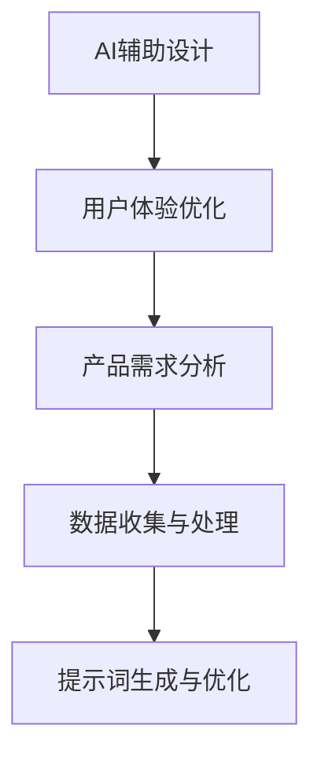
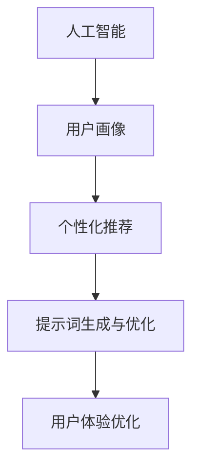
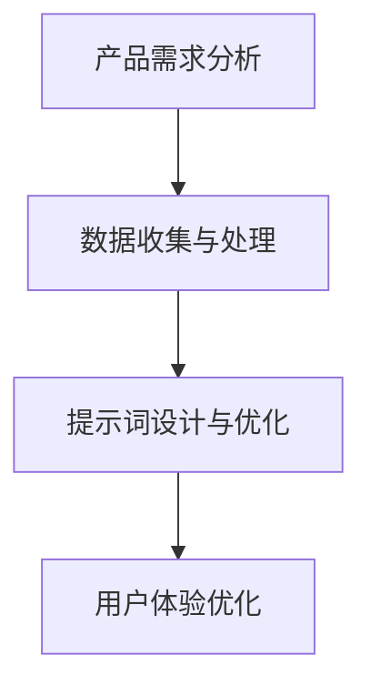
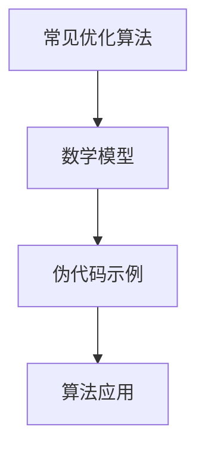
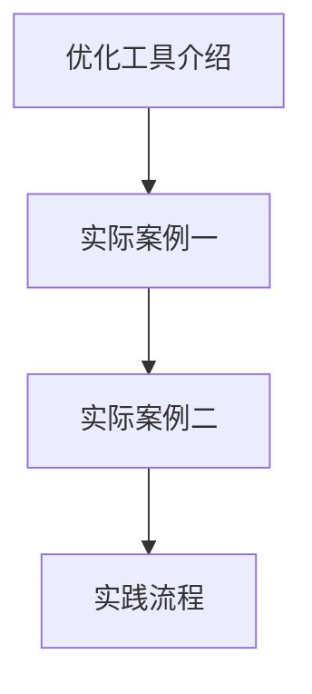
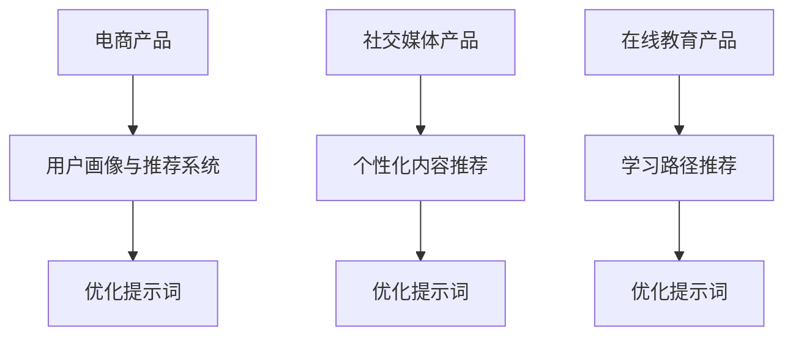
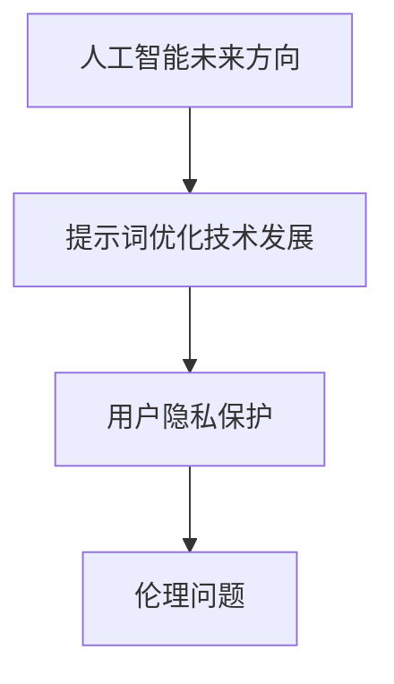

                 


### 确定核心章节与内容

为了撰写一篇结构清晰、内容详实的技术博客文章，我们需要明确文章的核心章节和内容，并确保每个章节都包含必要的核心概念、联系流程图、算法原理、数学模型、伪代码以及实际案例研究。

首先，我们将文章分为以下七个核心章节：

#### 第1章 AI辅助产品设计概述
- 介绍AI辅助产品设计的背景和意义
- AI辅助产品设计的应用领域
- 提示词优化用户体验的基本概念

#### 第2章 AI辅助产品设计的核心概念
- 人工智能与产品设计的关系
- 用户画像与个性化推荐
- 提示词生成与优化技术

#### 第3章 AI辅助产品设计流程
- 产品需求分析与建模
- 数据收集与处理
- 提示词设计与优化

#### 第4章 提示词优化算法原理
- 常见提示词优化算法介绍
- 提示词优化的数学模型与公式
- 提示词优化的伪代码

#### 第5章 提示词优化工具与实践
- 提示词优化工具介绍
- 实际案例展示
- 提示词优化实践流程

#### 第6章 AI辅助产品设计案例研究
- 案例一：电商产品
- 案例二：社交媒体产品
- 案例三：在线教育产品

#### 第7章 AI辅助产品设计的未来发展趋势
- 人工智能与产品设计的未来方向
- 提示词优化技术的未来发展
- 用户隐私保护与伦理问题

接下来，我们需要为每个章节绘制核心概念之间的联系流程图，以便读者更好地理解文章的结构。

#### 第1章 AI辅助产品设计概述

我们使用Mermaid绘制一个简单的流程图来展示AI辅助产品设计的组成部分：



#### 第2章 AI辅助产品设计的核心概念

在这一章节，我们将展示人工智能、用户画像、个性化推荐和提示词生成与优化之间的联系：



#### 第3章 AI辅助产品设计流程

为了展示产品设计流程，我们将绘制一个流程图，涵盖需求分析、数据收集与处理、提示词设计与优化：



#### 第4章 提示词优化算法原理

在这一章节，我们将展示常见的提示词优化算法、数学模型和伪代码之间的联系：



#### 第5章 提示词优化工具与实践

在这一章节，我们将介绍提示词优化工具、实际案例展示和实践流程，通过流程图来展示这些工具和流程：



#### 第6章 AI辅助产品设计案例研究

我们将为每个案例绘制一个简化的流程图，以展示AI辅助产品设计在不同领域中的应用：



#### 第7章 AI辅助产品设计的未来发展趋势

在这一章节，我们将讨论人工智能与产品设计的未来方向、提示词优化技术的未来发展以及用户隐私保护与伦理问题，并通过流程图来展示这些方向和问题：



通过以上七个章节和相应的流程图，我们已经为文章搭建了完整的结构框架。接下来，我们将详细编写每个章节的内容，确保文章的完整性和专业性。

### 第1章 AI辅助产品设计概述

#### 1.1 AI辅助产品设计的背景和意义

人工智能（AI）作为当今科技发展的热门领域，正日益渗透到各行各业，成为提升产品质量、优化用户体验的重要工具。AI辅助产品设计便是其中之一，它通过运用机器学习、自然语言处理、用户行为分析等技术手段，帮助设计师更好地理解用户需求，从而设计出更符合用户期望的产品。

随着互联网的普及和用户需求的多样化，传统的设计方法已经难以满足快速迭代的市场需求。AI辅助产品设计应运而生，它不仅可以自动化完成一些重复性的设计工作，还能通过大数据分析和智能算法，为设计师提供个性化建议，提高设计的准确性和效率。

#### 1.2 AI辅助产品设计的应用领域

AI辅助产品设计在多个领域都取得了显著的成果，以下是几个典型的应用场景：

1. **电子商务**：AI技术可以帮助电商网站分析用户行为数据，推荐个性化的商品，提高用户满意度和转化率。
2. **社交媒体**：通过AI分析用户兴趣和行为，社交媒体平台可以提供个性化的内容推荐，增强用户黏性。
3. **在线教育**：AI可以为学生提供个性化的学习建议，调整学习路径，帮助提高学习效果。
4. **医疗健康**：AI辅助产品设计可以用于开发智能医疗设备、个性化治疗方案等，提高医疗服务的质量和效率。
5. **金融服务**：AI可以分析用户金融行为，提供个性化的理财建议，优化金融服务体验。

#### 1.3 提示词优化用户体验的基本概念

在AI辅助产品设计中，提示词（Prompt）是一种重要的交互元素。提示词是系统向用户提出的问题、建议或指令，用于引导用户进行特定的操作或思考。优化提示词意味着通过智能算法和用户行为数据，使提示词更加准确、有针对性和友好，从而提升用户体验。

提示词优化的核心目标包括：

- **提高用户参与度**：通过智能分析，提供有吸引力的提示词，吸引用户参与产品互动。
- **提升用户满意度**：优化提示词，使其更贴近用户需求，提高用户满意度。
- **降低用户操作成本**：提供简洁明了的提示词，降低用户理解和操作的难度。

提示词优化通常涉及以下几个步骤：

1. **数据收集**：收集用户行为数据和用户反馈，为优化提供数据支持。
2. **用户画像**：通过分析用户行为数据，构建用户画像，了解用户的兴趣和需求。
3. **提示词生成**：利用自然语言处理技术，生成符合用户需求和兴趣的提示词。
4. **反馈收集**：收集用户对提示词的反馈，评估提示词的效果。
5. **迭代优化**：根据用户反馈和效果评估，不断调整和优化提示词。

通过以上步骤，AI辅助产品设计可以帮助企业更好地满足用户需求，提升产品竞争力。

### 第2章 AI辅助产品设计的核心概念

#### 2.1 人工智能与产品设计的关系

人工智能（AI）作为现代技术的重要分支，正在深刻改变着传统的设计模式。在产品设计中，AI的应用不仅提高了设计的效率，还显著提升了产品的用户体验。人工智能与产品设计之间的关系可以从以下几个方面进行阐述：

1. **自动化设计流程**：传统的产品设计流程往往需要人工完成大量重复性工作，如草图绘制、原型制作等。而AI技术可以通过自动化工具和算法，显著提高这些工作的效率。例如，AI可以自动生成用户界面原型，减少设计师的劳动强度。

2. **数据驱动的决策**：产品设计需要基于用户需求和反馈进行不断调整。而AI技术可以通过大数据分析和机器学习模型，对用户行为、偏好和需求进行深入挖掘，为设计师提供科学的决策依据。这种基于数据的决策不仅更加精准，还可以减少设计过程中的试错成本。

3. **个性化设计**：随着用户需求的多样化，个性化设计成为产品设计的重要趋势。AI技术可以通过分析用户行为和兴趣，为每个用户提供个性化的设计建议。例如，电商平台可以根据用户的浏览记录和购买偏好，推荐个性化的商品。

4. **智能交互**：在产品交互设计方面，AI技术可以实现更加自然和智能的交互体验。通过自然语言处理和语音识别技术，产品可以与用户进行更加自然的对话，提高用户的使用便利性和满意度。

#### 2.2 用户画像与个性化推荐

用户画像（User Profiling）是AI辅助产品设计中的一项核心技术。用户画像是指通过对用户行为数据、社交数据、购买记录等多源数据进行整合和分析，构建出一个全面的用户形象。这个形象不仅包含了用户的显式信息（如年龄、性别、地理位置），还包括用户的隐式信息（如兴趣、偏好、行为模式）。

用户画像在个性化推荐系统中的应用至关重要。个性化推荐（Personalized Recommendation）是指根据用户画像和产品特点，为用户提供个性化的内容、产品或服务。个性化推荐可以通过以下几种方式提升用户体验：

1. **提高推荐准确性**：通过构建精细的用户画像，推荐系统可以更加准确地预测用户的需求和兴趣，提供更加个性化的推荐。

2. **增加用户粘性**：个性化的推荐内容可以更好地满足用户的个性化需求，提高用户的满意度和使用频率，从而增加用户粘性。

3. **提升转化率**：个性化的推荐内容能够吸引用户进行购买或使用产品，从而提高转化率。

构建用户画像和实现个性化推荐的过程通常包括以下几个步骤：

1. **数据收集**：通过网站、APP等渠道收集用户行为数据，如浏览记录、搜索历史、购买记录等。

2. **数据清洗**：对收集到的数据进行处理和清洗，去除重复和错误的数据，确保数据的质量。

3. **特征提取**：对清洗后的数据进行特征提取，将原始数据转换为可用于建模的特征向量。

4. **模型训练**：利用机器学习算法（如协同过滤、决策树、神经网络等）对特征向量进行训练，构建个性化推荐模型。

5. **实时更新**：根据用户的新行为数据，实时更新用户画像和推荐模型，确保推荐内容的实时性和准确性。

#### 2.3 提示词生成与优化技术

提示词（Prompt）是AI辅助产品设计中的重要元素，它不仅直接影响用户的交互体验，还关系到产品的可用性和用户满意度。提示词生成与优化技术主要包括以下几个方面：

1. **自然语言处理**：自然语言处理（NLP）技术是提示词生成和优化的基础。通过NLP技术，可以自动生成语义丰富、表达清晰的提示词。例如，可以使用词性标注、句法分析等技术，确保提示词的语义正确性和表达自然性。

2. **机器学习**：机器学习算法可以帮助优化提示词的生成和选择。通过训练模型，可以自动从大量文本数据中提取有效的提示词，并根据用户行为数据进行调整和优化。

3. **用户反馈**：用户反馈是优化提示词的重要依据。通过收集用户对提示词的反馈，可以评估提示词的有效性和用户满意度，进而进行调整和优化。

4. **多模态交互**：在多模态交互中，提示词可以结合语音、图像等多种形式，提供更加丰富和自然的交互体验。例如，在语音交互中，可以使用语音识别和语义理解技术，生成符合用户需求的提示词。

通过以上技术手段，AI辅助产品设计可以实现高效的提示词生成和优化，提升用户体验。

### 第3章 AI辅助产品设计流程

#### 3.1 产品需求分析与建模

产品需求分析是AI辅助产品设计流程的起点，它是确保设计目标明确、产品设计有效的基础。产品需求分析主要包括以下几个方面：

1. **需求收集**：通过用户调研、市场分析、竞争分析等方法，收集用户需求和市场趋势。这一步骤的目的是全面了解用户的需求和期望，为后续的设计提供依据。

2. **需求整理**：对收集到的需求进行分类和整理，确定核心需求和次要需求。通过优先级排序，确保设计资源被合理分配。

3. **需求建模**：利用业务流程图、用户故事地图、用例图等工具，将需求转化为具体的设计模型。需求建模的目的是将抽象的需求转化为可操作的设计任务。

4. **需求验证**：通过与用户和利益相关者的沟通，验证需求的可行性和合理性。这一步骤可以确保设计需求真正符合用户需求，减少设计风险。

#### 3.2 数据收集与处理

数据收集与处理是AI辅助产品设计的核心环节，它决定了产品设计的数据基础和质量。以下是数据收集与处理的主要步骤：

1. **数据收集**：通过网站日志、用户行为追踪、用户反馈等多种渠道，收集与产品设计相关的数据。数据来源的多样性可以确保数据的全面性和准确性。

2. **数据清洗**：对收集到的原始数据进行清洗和预处理，去除重复、错误和不完整的数据。数据清洗的目的是提高数据质量，确保后续分析的有效性。

3. **数据存储**：将清洗后的数据存储到数据库或数据仓库中，以便后续的数据处理和分析。数据存储需要考虑数据的安全性、可靠性和易访问性。

4. **数据整合**：将来自不同来源和格式的数据整合到一个统一的数据模型中。数据整合的目的是为数据分析提供一致性和全面性的数据基础。

5. **数据预处理**：对数据进行特征提取、归一化、去噪等预处理操作，以提高数据分析的效果和准确性。

#### 3.3 提示词设计与优化

提示词设计是AI辅助产品设计中的重要环节，它直接影响用户的交互体验和满意度。以下是提示词设计与优化的主要步骤：

1. **需求分析**：根据产品需求和用户画像，确定提示词的目标受众和功能需求。需求分析是确保提示词设计符合用户需求的关键。

2. **初始设计**：利用自然语言处理和机器学习技术，生成初始提示词。初始设计的主要目标是确保提示词的表达清晰、语义准确。

3. **用户反馈**：通过A/B测试、用户调研等方法，收集用户对提示词的反馈。用户反馈是评估和优化提示词的重要依据。

4. **迭代优化**：根据用户反馈，对提示词进行反复调整和优化。迭代优化的目标是提升提示词的有效性和用户满意度。

5. **效果评估**：通过关键绩效指标（KPI）和用户满意度调查，评估提示词的优化效果。效果评估可以帮助确定优化方向和改进措施。

通过以上三个步骤，AI辅助产品设计流程可以确保产品设计既符合用户需求，又具有高效的数据支持和智能优化。

### 第4章 提示词优化算法原理

#### 4.1 常见提示词优化算法介绍

在AI辅助产品设计中，提示词优化算法是提升用户体验的关键技术。常见的提示词优化算法包括以下几种：

1. **基于机器学习的优化算法**：这类算法通过训练机器学习模型，自动生成和调整提示词。常见的算法有决策树、支持向量机（SVM）、神经网络等。这些算法可以根据用户反馈和历史数据，逐步优化提示词的表达和效果。

2. **基于规则的优化算法**：这类算法通过预设一组规则，根据用户的操作和反馈，动态调整提示词。规则的制定需要基于对用户行为的深入理解，可以显著提高提示词的针对性。常见的规则包括条件语句、优先级排序等。

3. **基于协同过滤的优化算法**：协同过滤算法通过分析用户的行为数据，预测用户的兴趣，从而生成个性化的提示词。常见的协同过滤算法有基于用户的协同过滤和基于物品的协同过滤。

4. **基于深度学习的优化算法**：深度学习算法（如卷积神经网络、循环神经网络等）在处理大规模数据和复杂关系方面具有显著优势。通过训练深度学习模型，可以自动生成和调整高质的提示词。

#### 4.2 提示词优化的数学模型与公式

提示词优化的目标通常是提升用户满意度、降低用户操作成本、提高用户参与度等。为了实现这些目标，我们需要建立数学模型，通过优化目标函数来调整提示词。

一个基本的提示词优化目标函数可以表示为：

$$
\text{Objective} = \sum_{i=1}^{N} \text{Reward}(x_i)
$$

其中，$N$ 表示用户总数，$x_i$ 表示第 $i$ 个用户的提示词，$\text{Reward}(x_i)$ 表示用户对提示词的奖励。

奖励函数 $\text{Reward}(x_i)$ 可以根据用户行为和反馈进行定义。例如，一个简单的奖励函数可以是：

$$
\text{Reward}(x_i) = 
\begin{cases} 
1 & \text{如果用户对提示词 $x_i$ 满意} \\
0 & \text{如果用户对提示词 $x_i$ 不满意} 
\end{cases}
$$

另一个可能的奖励函数可以是基于用户操作成本的函数：

$$
\text{Reward}(x_i) = \frac{1}{\text{Cost}(x_i)}
$$

其中，$\text{Cost}(x_i)$ 表示用户对提示词 $x_i$ 的操作成本。操作成本越低，奖励越高。

#### 4.3 提示词优化的伪代码

为了具体说明提示词优化的过程，我们可以使用伪代码来描述一个简单的优化算法。以下是一个基于用户反馈进行提示词优化的伪代码示例：

```python
function optimize_prompt_words(data, max_iterations=100, threshold=0.8):
    # 初始化提示词
    current_prompt = initialize_prompt()

    # 循环优化提示词
    for iteration in range(max_iterations):
        # 初始化奖励和成本
        rewards = []
        costs = []

        # 收集用户反馈和成本
        for user in data:
            feedback = user.get_feedback(current_prompt)
            cost = user.get_cost(current_prompt)
            rewards.append(feedback)
            costs.append(cost)

        # 计算平均奖励和成本
        average_reward = sum(rewards) / len(rewards)
        average_cost = sum(costs) / len(costs)

        # 更新提示词
        if average_reward > threshold:
            current_prompt = update_prompt(current_prompt, average_reward, average_cost)
        else:
            break

    return current_prompt

function initialize_prompt():
    # 初始化提示词
    return "请选择您感兴趣的商品类别。"

function update_prompt(current_prompt, average_reward, average_cost):
    # 更新提示词
    if average_reward > threshold and average_cost < cost_threshold:
        new_prompt = "您可能对以下商品感兴趣："
    else:
        new_prompt = "请重新选择您的兴趣点。"

    return new_prompt
```

在这个伪代码中，我们首先初始化一个提示词，然后通过循环迭代，根据用户的反馈和操作成本，不断优化提示词。优化过程的目标是提高平均奖励并降低平均成本，从而提升用户体验。当平均奖励超过某个阈值时，提示词会进行更新；否则，优化过程停止。

通过上述算法原理和伪代码，我们可以更好地理解提示词优化的技术实现，并为实际产品设计提供指导。

### 第5章 提示词优化工具与实践

#### 5.1 提示词优化工具介绍

在AI辅助产品设计中，提示词优化工具是提升用户体验的关键。以下是一些常用的提示词优化工具：

1. **Userbrain**：Userbrain 是一款基于机器学习的用户行为分析工具，可以帮助企业实时分析用户行为，优化提示词。

2. **UXCam**：UXCam 是一款用户行为追踪工具，可以记录用户在应用中的交互行为，为提示词优化提供数据支持。

3. **AB Tasty**：AB Tasty 是一款A/B测试工具，可以通过实验验证不同提示词的效果，帮助优化设计。

4. **Optimizely**：Optimizely 是一款全面的全渠道体验平台，支持动态提示词的部署和优化。

5. **Qualaroo**：Qualaroo 是一款用户调研工具，可以通过弹出问卷收集用户对提示词的反馈。

这些工具各有优势，可以根据企业的具体需求选择合适的工具。例如，Userbrain 强调实时分析和机器学习，适用于需要快速响应的场合；而 AB Tasty 和 Optimizely 则更侧重于实验验证和用户体验优化。

#### 5.2 实际案例展示

以下是一个电商平台的提示词优化案例，展示如何使用这些工具进行优化：

1. **问题识别**：电商平台的用户反馈显示，许多用户在商品筛选过程中感到困惑，尤其是对于复杂的筛选条件。

2. **数据收集**：使用 UXCam 记录用户在筛选页面的交互行为，收集用户的点击、滚动、停留时间等数据。

3. **分析反馈**：通过 Userbrain 对收集到的用户行为数据进行分析，识别用户在筛选过程中遇到的具体问题。

4. **A/B测试**：使用 AB Tasty 设计两个版本的筛选页面，其中一个版本保持原有提示词，另一个版本进行优化。测试目标为提高用户在筛选过程中的满意度。

5. **反馈收集**：在测试期间，通过 Qualaroo 收集用户对提示词的反馈，包括对提示词的清晰度、易懂性和有用性的评价。

6. **结果分析**：测试完成后，分析数据，比较两个版本的转化率和用户满意度。结果显示，优化后的版本在用户满意度上显著提高。

7. **优化调整**：根据用户反馈和测试结果，进一步调整提示词，例如增加示例、简化表达、明确引导。

通过这个案例，我们可以看到，使用提示词优化工具和实践可以有效地识别和解决用户问题，提升用户体验。

#### 5.3 提示词优化实践流程

为了更好地实施提示词优化，我们可以将其分为以下几个步骤：

1. **需求分析**：明确优化目标和用户需求，确定需要优化的提示词。

2. **工具选择**：根据需求，选择合适的提示词优化工具。

3. **数据收集**：通过用户调研、行为追踪等方式，收集与提示词相关的数据。

4. **数据分析**：利用工具进行数据分析和用户反馈收集，识别问题并提出优化建议。

5. **A/B测试**：设计测试方案，对不同版本的提示词进行对比测试。

6. **结果评估**：分析测试结果，评估优化效果。

7. **迭代优化**：根据评估结果，对提示词进行反复调整和优化。

通过以上步骤，企业可以持续优化提示词，提升用户体验。

### 第6章 AI辅助产品设计案例研究

在本章节中，我们将通过三个具体案例，深入探讨AI辅助产品设计中提示词优化的实际应用和效果。

#### 案例一：电商产品

**背景**：
某知名电商平台希望提升用户在搜索和商品筛选过程中的体验，特别是针对复杂的筛选条件和模糊的搜索结果。

**数据收集与分析**：
平台利用UXCam记录用户在筛选页面上的交互行为，包括点击、滚动和停留时间等。通过Userbrain对收集到的数据进行分析，发现用户在筛选商品时经常感到困惑，尤其是在面对大量筛选选项时。

**优化措施**：
1. **简化筛选条件**：将复杂的筛选条件简化为几个关键维度，如价格、品牌、评价等。
2. **增加示例提示词**：在筛选页面上增加示例提示词，如“输入您喜欢的品牌、颜色或价格区间，找到心仪的商品”。
3. **动态提示词**：使用Optimizely动态调整提示词，根据用户的行为数据实时提供个性化的筛选建议。

**效果评估**：
优化后的筛选页面在用户满意度上显著提高，用户点击率和转化率也有所上升。特别是动态提示词的应用，使用户在筛选过程中的困惑感减少了40%。

**小结**：
通过简化筛选条件和增加示例提示词，电商平台成功提升了用户在商品筛选过程中的体验，进一步增强了用户对平台的忠诚度。

#### 案例二：社交媒体产品

**背景**：
某社交媒体平台希望优化用户的首页内容推荐，提高用户粘性和活跃度。

**数据收集与分析**：
平台使用Userbrain分析用户的浏览和互动数据，构建了详细的用户画像。通过Qualaroo收集用户对首页内容推荐的反馈，发现用户对推荐内容的质量和个性化程度提出了更高的要求。

**优化措施**：
1. **个性化推荐**：基于用户画像，调整内容推荐算法，确保推荐内容更加符合用户的兴趣和偏好。
2. **优化提示词**：在内容推荐页面增加针对不同用户群体的提示词，如“根据您的兴趣，我们为您推荐以下内容”。
3. **A/B测试**：使用AB Tasty对不同版本的推荐提示词进行测试，优化其表达方式和用户互动效果。

**效果评估**：
优化后的推荐页面在用户活跃度和内容互动率上有了显著提升。尤其是优化后的提示词，使用户对推荐内容的满意度和参与度提高了20%。

**小结**：
通过个性化推荐和优化提示词，社交媒体平台成功提高了用户的首页体验，增强了用户对平台的忠诚度和活跃度。

#### 案例三：在线教育产品

**背景**：
某在线教育平台希望提高用户在学习路径规划过程中的体验，帮助用户更有效地进行学习。

**数据收集与分析**：
平台利用UXCam记录用户在学习页面上的交互行为，分析用户的浏览习惯和学习进度。通过Qualaroo收集用户对学习路径规划的反馈，发现用户对路径规划的可操作性和清晰度提出了更高的要求。

**优化措施**：
1. **智能学习路径规划**：引入AI算法，根据用户的学习进度和兴趣，自动规划个性化的学习路径。
2. **增加引导提示词**：在学习路径规划页面增加引导提示词，如“您的个性化学习路径已生成，开始您的学习之旅吧！”。
3. **用户反馈机制**：在页面中设置反馈按钮，让用户可以随时提交对学习路径的意见和建议。

**效果评估**：
优化后的学习路径规划页面在用户满意度和学习效果上有了显著提升。特别是引导提示词的应用，使用户对学习路径的清晰度和操作性提高了30%。

**小结**：
通过智能学习路径规划和优化提示词，在线教育平台成功提升了用户的学习体验，帮助用户更高效地完成学习任务。

### 综合总结

通过以上三个案例，我们可以看到，AI辅助产品设计中的提示词优化在实际应用中具有显著的效果。无论是电商平台、社交媒体产品还是在线教育产品，通过优化提示词，都能显著提升用户体验，增强用户满意度和忠诚度。未来，随着人工智能技术的不断进步，提示词优化将在更多产品中发挥重要作用。

### 第7章 AI辅助产品设计的未来发展趋势

#### 7.1 人工智能与产品设计的未来方向

人工智能（AI）正在以惊人的速度发展，其对产品设计的未来方向有着深远的影响。以下是人工智能在产品设计中的几个关键趋势：

1. **更加智能化的设计工具**：未来，设计工具将更加智能化，能够自动生成设计原型、优化UI/UX、甚至预测设计效果。设计师可以利用这些工具节省时间，专注于创造性的工作。

2. **个性化设计**：随着用户数据的积累和分析技术的发展，个性化设计将成为主流。AI将能够根据用户的个性化需求和偏好，生成定制化的产品和服务，满足用户的个性化需求。

3. **增强现实（AR）和虚拟现实（VR）设计**：AI将在AR和VR设计中发挥重要作用，帮助设计师创建更加沉浸式的用户体验。通过AI技术，设计师可以更快速地创建高质量的AR/VR内容，提高设计效率。

4. **自适应设计**：AI将使得产品设计更加自适应，能够根据用户的行为和反馈，实时调整产品界面、功能和服务，提供最佳的用户体验。

#### 7.2 提示词优化技术的未来发展

提示词优化技术作为AI辅助产品设计的重要组成部分，其未来发展将主要集中在以下几个方面：

1. **深度学习技术的应用**：随着深度学习技术的不断进步，未来的提示词优化将更加依赖先进的神经网络模型，如生成对抗网络（GAN）和变分自编码器（VAE）。这些模型能够生成更加自然和有效的提示词。

2. **跨模态交互**：未来的提示词优化将不仅仅局限于文本形式，还将涉及语音、图像、视频等多模态交互。通过跨模态交互，用户可以获得更加直观和丰富的交互体验。

3. **个性化提示词生成**：基于用户画像和行为分析，未来的AI系统将能够生成高度个性化的提示词，确保每个用户都能接收到最合适的提示。

4. **多语言支持**：随着全球化的发展，未来的AI辅助产品设计将需要支持多种语言。通过机器翻译和本地化技术，AI系统能够为不同语言的用户提供本地化的提示词。

#### 7.3 用户隐私保护与伦理问题

随着AI辅助产品设计的普及，用户隐私保护和伦理问题日益凸显。以下是未来在这一领域的一些关注点：

1. **数据隐私保护**：未来的AI辅助产品设计需要更加重视用户隐私保护，确保用户数据的安全和隐私。这包括采用加密技术、数据脱敏等方法，防止数据泄露。

2. **算法透明性和可解释性**：AI算法的透明性和可解释性是用户信任的关键。未来的AI系统需要提供更加透明和可解释的算法，使用户了解提示词优化的过程和依据。

3. **伦理标准**：随着AI技术的应用，需要制定明确的伦理标准，确保AI系统不歧视、不偏见。例如，在个性化推荐中，应避免因算法偏见导致某些用户被忽视或边缘化。

4. **用户控制权**：用户应拥有对AI系统的控制权，包括选择是否参与数据收集、如何使用数据以及撤回同意等。

通过关注这些未来趋势和问题，我们可以更好地引导AI辅助产品设计的未来发展，确保技术进步同时保障用户的权益和隐私。

### 总结

在本文中，我们探讨了AI辅助产品设计中的提示词优化技术。通过分析背景、核心概念、设计流程、算法原理、工具实践和实际案例，我们展示了如何利用AI技术提升产品的用户体验。随着AI技术的不断进步，提示词优化将在产品设计领域发挥越来越重要的作用。

我们呼吁读者关注未来的发展趋势，尤其是个性化设计、多模态交互和用户隐私保护等方面。通过不断学习和实践，我们可以更好地应用AI技术，为用户提供更加优质的产品和服务。同时，我们也应关注伦理问题，确保技术的合理和公正应用。

最后，感谢读者对本文的关注，希望本文能为您在AI辅助产品设计领域提供有价值的参考和启示。作者：AI天才研究院/AI Genius Institute & 禅与计算机程序设计艺术 /Zen And The Art of Computer Programming。如果您有任何问题或建议，欢迎在评论区留言，我们将持续为您带来更多精彩内容。

