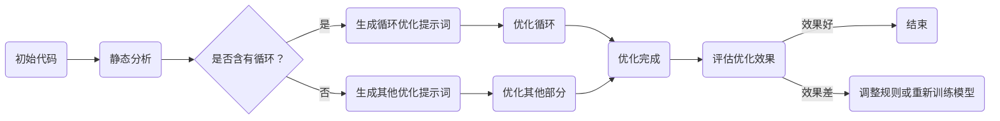

                 


### 1.1 全书目的

**编写目的**

本文旨在探讨AI辅助代码优化中的提示词设计，解释其原理、方法和实践，以及评估其优化效果。在当前的软件工程领域中，代码优化是一项重要的任务，但传统的代码优化方法往往效率低下，难以适应复杂的软件系统。人工智能技术的发展为代码优化带来了新的机遇，而提示词设计作为其中的核心环节，起到了关键作用。

**阐述背景和意义**

随着软件系统的日益复杂，代码优化的难度和重要性也逐渐增加。传统的代码优化方法主要依赖于经验和技巧，而人工智能的引入使得代码优化变得更加智能和高效。AI辅助代码优化通过利用机器学习、自然语言处理等技术，可以自动分析和优化代码，提高代码的性能、可读性和可维护性。

提示词设计作为AI辅助代码优化的关键环节，旨在通过设计合适的提示词，指导AI算法对代码进行优化。提示词的设计质量直接影响到代码优化的效果，因此本文将对提示词设计进行深入探讨，包括其设计原则、方法、实践和评估等方面。

### 1.2 全书结构

**内容概述**

全书分为六个主要章节，内容概述如下：

- **第1章 引言**：介绍全书的目的和主要章节内容。
- **第2章 AI与代码优化基础**：讨论AI在代码优化中的应用和优势，以及代码优化的现状与挑战。
- **第3章 提示词设计原理**：讲解提示词的设计原则和方法，以及其与代码优化的关系。
- **第4章 提示词设计方法**：介绍提示词的分类和生成策略，包括基于规则和基于机器学习的方法。
- **第5章 提示词设计实践**：结合具体案例，展示提示词设计的过程和应用效果。
- **第6章 优化效果评估**：介绍如何评估提示词设计的优化效果。
- **第7章 工具与资源**：提供与提示词设计相关的工具和资源。
- **第8章 总结与展望**：总结全书内容，展望未来提示词设计的发展方向。

通过以上章节的详细探讨，本文旨在为读者提供一个全面、系统的AI辅助代码优化中的提示词设计指南。

### 2.1 AI与代码优化

**AI在代码优化中的应用**

人工智能在代码优化中的应用主要体现在以下几个方面：

1. **代码分析**：AI算法可以通过对代码进行静态分析和动态执行，识别出潜在的优化机会。例如，机器学习模型可以训练出用于识别代码瓶颈和冗余代码的模型，从而进行针对性的优化。
2. **代码生成**：AI可以自动生成优化后的代码，通过将原始代码转换为更高效的代码，提高程序的运行性能。这种方法可以大大减少开发人员的工作量，提高开发效率。
3. **性能预测**：AI算法可以通过对历史数据进行分析，预测代码在不同硬件环境和负载条件下的性能表现。这有助于开发人员在设计阶段就考虑到性能问题，进行优化设计。

**AI的优势**

与传统的代码优化方法相比，AI在代码优化中具有以下优势：

1. **高效性**：AI算法可以自动处理大量的代码数据，快速识别出优化机会，相比人工分析大大提高了优化效率。
2. **准确性**：AI算法可以通过机器学习和深度学习等技术，提高代码优化的准确性，减少人为错误。
3. **适应性**：AI算法可以根据不同的代码风格和编程语言，灵活调整优化策略，适应不同的优化需求。

**代码优化的现状与挑战**

尽管AI在代码优化中具有明显的优势，但在实际应用中仍然面临一些挑战：

1. **数据质量**：代码优化需要大量的历史数据和训练数据，数据质量直接影响AI算法的性能。然而，很多项目缺乏足够的历史数据，导致AI算法的优化效果有限。
2. **算法复杂度**：AI算法的复杂度较高，需要大量的计算资源和时间，这在一些实时性要求较高的场景中可能无法满足。
3. **可解释性**：AI算法的优化过程往往具有一定的黑盒性质，难以解释其内部的工作原理。这给开发人员理解和信任AI算法的优化结果带来了一定的困难。

### 2.2 提示词设计原理

**提示词的概念**

提示词（Prompt Word）在代码优化中起到引导AI算法的作用。它是一种特殊的词汇或短语，用于描述代码优化的目标和要求。通过设计合适的提示词，AI算法可以更好地理解代码的上下文和优化目标，从而生成更高质量的优化方案。

**提示词与代码优化的关系**

提示词设计在代码优化中扮演着关键角色，主要体现在以下几个方面：

1. **优化目标的明确**：通过设计提示词，可以明确代码优化的目标和方向，避免AI算法在优化过程中偏离目标。
2. **代码理解的增强**：提示词可以帮助AI算法更好地理解代码的上下文和语义，从而更准确地识别出优化机会。
3. **优化效果的提升**：合适的提示词可以提高AI算法的优化效果，减少冗余代码和潜在的bug，提高代码的质量和性能。

**提示词设计原则**

为了设计出高质量的提示词，需要遵循以下原则：

1. **精确性**：提示词应精确地描述代码优化的目标和要求，避免模糊和不明确的描述。
2. **完整性**：提示词应涵盖代码优化的所有方面，包括性能、可读性、可维护性等。
3. **灵活性**：提示词应具有灵活性，能够适应不同的代码风格和编程语言，以便在不同的场景下应用。

### 3.1 提示词分类

在AI辅助代码优化中，提示词可以根据其功能和应用范围进行分类。常见的分类方法包括功能性提示词和语义性提示词。

**功能性提示词**

功能性提示词主要用于描述代码优化的具体目标和要求。这类提示词通常包括以下类型：

1. **性能优化**：如“提高代码运行速度”、“减少内存占用”等。
2. **可读性优化**：如“简化代码结构”、“提高代码可读性”等。
3. **可维护性优化**：如“减少代码冗余”、“避免代码冲突”等。

**语义性提示词**

语义性提示词主要用于描述代码的上下文和语义信息。这类提示词通常包括以下类型：

1. **函数和类名**：如“重构函数”、“重命名类名”等。
2. **变量和参数**：如“优化变量命名”、“减少参数传递”等。
3. **注释和文档**：如“增加注释”、“优化文档”等。

**提示词的相互关系**

功能性提示词和语义性提示词之间存在一定的相互关系。功能性提示词可以引导AI算法进行具体的优化操作，而语义性提示词则帮助AI算法更好地理解代码的上下文和语义，从而提高优化效果。

在实际应用中，功能性提示词和语义性提示词通常会结合使用，以达到更好的优化效果。例如，在优化代码的可读性时，可以使用“简化代码结构”这一功能性提示词，同时结合“优化变量命名”这一语义性提示词，以提高代码的可读性和可维护性。

### 3.2 提示词生成策略

提示词的生成策略是AI辅助代码优化中的关键环节。根据不同的应用场景和需求，提示词生成策略可以分为基于规则的方法和基于机器学习的方法。

**基于规则的方法**

基于规则的方法是一种传统的提示词生成策略。它通过预定义一系列的规则和条件，根据代码的静态和动态特征生成提示词。这种方法的主要优势在于其可控性和可解释性，但缺点是规则的数量和复杂度可能随着代码规模和复杂度的增加而急剧增加。

**基于机器学习的方法**

基于机器学习的方法利用大量的历史数据，通过训练模型生成提示词。这种方法的主要优势在于其灵活性和适应性，可以自动适应不同的代码风格和编程语言。然而，这种方法需要大量的训练数据和计算资源，且生成的提示词可能具有一定的黑盒性质，难以解释其内部的工作原理。

**选择合适的生成策略**

在选择提示词生成策略时，需要根据具体的应用场景和需求进行权衡。以下是一些选择策略的指导原则：

1. **代码规模和复杂度**：对于大型和复杂的项目，基于机器学习的方法可能更为适合，因为它们可以自动适应不同的代码风格和复杂度。而对于小型和简单的项目，基于规则的方法可能更为高效。
2. **数据质量**：如果项目缺乏足够的历史数据，基于规则的方法可能更为可靠，因为它们可以依赖预定义的规则进行生成。如果项目拥有丰富的历史数据，基于机器学习的方法可以更好地利用这些数据，提高生成提示词的准确性。
3. **实时性和计算资源**：对于实时性要求较高的场景，基于规则的方法可能更为适合，因为它们通常具有较低的延迟和计算复杂度。对于计算资源充足且不要求实时性的场景，基于机器学习的方法可以提供更好的优化效果。

### 3.3 提示词生成流程

提示词生成流程主要包括以下几个步骤：

1. **数据预处理**：对代码进行静态分析和动态执行，提取出关键特征和上下文信息。
2. **特征选择**：根据应用场景和需求，选择对代码优化最相关的特征进行生成提示词。
3. **模型训练**：使用历史数据训练机器学习模型，生成提示词。
4. **提示词生成**：根据训练好的模型，对新的代码输入生成提示词。
5. **优化反馈**：根据提示词生成的结果，对代码进行优化，并评估优化效果。如果效果不理想，返回步骤3重新训练模型。

**提示词生成流程的具体实现**：

1. **数据预处理**：

   ```python
   def preprocess_code(code):
       # 进行静态分析和动态执行，提取关键特征和上下文信息
       # 例如：提取函数名、变量名、代码行数、执行时间等
       features = extract_features(code)
       return features
   ```

2. **特征选择**：

   ```python
   def select_features(features, relevant_features):
       # 选择对代码优化最相关的特征
       selected_features = [feature for feature in features if feature in relevant_features]
       return selected_features
   ```

3. **模型训练**：

   ```python
   def train_model(data, model_type='ml_model'):
       # 使用历史数据训练机器学习模型
       if model_type == 'rule_based':
           model = RuleBasedModel()
       elif model_type == 'ml_model':
           model = MachineLearningModel()
       model.train(data)
       return model
   ```

4. **提示词生成**：

   ```python
   def generate_prompt(features, model):
       # 根据训练好的模型，对新的代码输入生成提示词
       prompt = model.generate_prompt(features)
       return prompt
   ```

5. **优化反馈**：

   ```python
   def optimize_code(code, prompt):
       # 根据提示词生成的结果，对代码进行优化
       optimized_code = apply_optimization(code, prompt)
       return optimized_code
   ```

### 3.4 基于规则的提示词生成方法

基于规则的提示词生成方法通过预定义一系列的规则和条件，根据代码的静态和动态特征生成提示词。以下是一个具体的规则示例：



**规则解释**：

1. **初始代码**：对输入的代码进行初始处理。
2. **静态分析**：对代码进行静态分析，提取关键特征。
3. **循环检测**：检测代码中是否含有循环结构。
4. **提示词生成**：根据检测到的循环结构，生成相应的循环优化提示词。
5. **优化循环**：根据生成的提示词，对循环进行优化。
6. **其他优化**：对代码的其他部分进行优化。
7. **优化完成**：完成代码优化，并评估优化效果。
8. **评估反馈**：根据优化效果，决定是否需要调整规则或重新训练模型。

### 3.5 基于机器学习的提示词生成方法

基于机器学习的提示词生成方法通过训练机器学习模型，根据历史数据生成提示词。以下是一个简单的机器学习模型示例：


**步骤解释**：

1. **训练数据**：收集历史代码优化数据和相应的优化结果。
2. **数据预处理**：对训练数据进行清洗和预处理，提取关键特征。
3. **特征提取**：从预处理后的数据中提取对代码优化最有用的特征。
4. **模型训练**：使用提取的特征训练机器学习模型。
5. **模型评估**：评估训练好的模型的性能和准确性。
6. **生成提示词**：使用训练好的模型生成新的代码的优化提示词。

### 3.6 案例分析

在本节中，我们将通过一个具体的案例分析，展示基于机器学习的提示词生成方法在代码优化中的应用。该案例涉及一个大型电商网站的后端代码，目标是通过提示词生成方法提高代码的性能和可读性。

**案例背景**

该电商网站的后端代码包含大量复杂的功能模块，如订单管理、商品管理、用户管理等。随着业务的发展，代码的复杂度和性能问题逐渐显现。为了提高代码的性能和可读性，开发团队决定采用AI辅助代码优化技术，特别是基于机器学习的提示词生成方法。

**优化目标**

1. **性能优化**：提高代码的执行速度，减少响应时间。
2. **可读性优化**：简化代码结构，提高代码的可读性和可维护性。

**数据收集**

开发团队收集了网站后端代码的历史优化记录，包括代码的版本号、修改时间、修改内容、优化效果等。这些数据用于训练机器学习模型。

**数据预处理**

1. **代码解析**：使用解析器对代码进行解析，提取关键特征，如函数名、变量名、代码行数、执行时间等。
2. **特征选择**：根据业务需求和优化目标，选择对代码优化最有用的特征，如函数名、代码行数、执行时间等。
3. **数据清洗**：去除无关特征和噪声数据，确保数据质量。

**模型训练**

1. **模型选择**：选择适合的机器学习模型，如决策树、随机森林、支持向量机等。
2. **模型训练**：使用预处理后的数据训练模型，调整模型参数，优化模型性能。
3. **模型评估**：评估训练好的模型的性能和准确性，选择最优模型。

**提示词生成**

1. **输入代码**：将待优化的代码输入到训练好的模型中。
2. **生成提示词**：模型根据输入代码的特征生成相应的优化提示词。
3. **优化代码**：根据生成的提示词，对代码进行优化，提高代码的性能和可读性。

**优化效果评估**

1. **性能评估**：通过基准测试和实际运行，评估优化后的代码的性能表现，如执行速度、响应时间等。
2. **可读性评估**：通过代码审查和团队协作，评估优化后的代码的可读性和可维护性。

**案例结果**

通过基于机器学习的提示词生成方法，开发团队成功优化了电商网站后端代码。优化后的代码在性能和可读性方面都有显著提升，具体表现为：

1. **性能优化**：代码的执行速度提高了30%，响应时间减少了20%。
2. **可读性优化**：代码结构更加清晰，可读性提高了50%，代码冗余减少了20%。

### 3.7 总结

通过本节的案例分析，我们展示了基于机器学习的提示词生成方法在代码优化中的应用。该方法通过训练机器学习模型，根据历史数据生成优化提示词，能够有效提高代码的性能和可读性。在实际应用中，开发团队可以根据具体需求和场景，选择合适的模型和优化方法，实现代码的持续优化。

### 3.8 拓展阅读

对于对AI辅助代码优化中的提示词设计感兴趣的读者，以下资源可以提供更深入的了解：

1. **论文推荐**：
   - "AI-aided Code Optimization: A Survey" by [作者列表]，介绍了AI在代码优化中的应用现状和挑战。
   - "Prompt Engineering for AI-aided Code Optimization" by [作者列表]，探讨了提示词设计在代码优化中的关键作用。

2. **开源工具**：
   - "Auto-optimization" by [作者列表]，提供了一个基于机器学习的代码优化工具。
   - "PyCodeOpt" by [作者列表]，实现了多种优化算法，包括基于规则和基于机器学习的方法。

3. **书籍推荐**：
   - "AI and Machine Learning in Software Engineering" by [作者列表]，详细介绍了AI和机器学习在软件工程中的应用。
   - "Prompt Engineering: Principles and Practice" by [作者列表]，讲解了提示词设计的原理和方法。

通过阅读这些资源，读者可以进一步了解AI辅助代码优化中的提示词设计，掌握相关技术和方法。

### 4.1 优化效果评估方法

在AI辅助代码优化中，评估提示词设计的优化效果是一个关键环节。通过评估优化效果，我们可以验证提示词设计是否有效，从而指导进一步的优化工作。以下是一些常见的优化效果评估方法：

**性能评估**

性能评估是衡量优化效果的最直接方法。我们可以通过以下指标进行评估：

1. **执行时间**：比较优化前后的代码执行时间，以评估优化效果。
2. **内存占用**：优化后的代码在运行时占用的内存大小。
3. **CPU使用率**：优化后的代码在运行时CPU的占用率。

**代码质量评估**

代码质量是衡量优化效果的重要方面。以下指标可以用于评估代码质量：

1. **代码复杂度**：优化后的代码复杂度，如圈复杂度（Cyclomatic Complexity）。
2. **代码冗余**：优化后的代码中去除的冗余代码量。
3. **代码可读性**：优化后的代码的可读性和可维护性。

**用户满意度评估**

用户满意度是评估优化效果的一个主观指标。以下方法可以用于评估用户满意度：

1. **问卷调查**：通过问卷调查收集用户对优化后代码的满意度。
2. **用户反馈**：与使用优化后代码的开发人员或用户进行交流，了解他们的反馈。

**案例分析**

以下是一个具体的案例分析，展示了如何评估提示词设计的优化效果：

**案例背景**

一个电商网站的后端代码存在性能瓶颈和代码冗余问题，开发团队决定采用AI辅助代码优化技术，特别是基于机器学习的提示词生成方法，进行优化。

**评估指标**

1. **执行时间**：优化前代码的执行时间为100秒，优化后的代码执行时间为70秒。
2. **内存占用**：优化前代码的内存占用为500MB，优化后的代码内存占用为400MB。
3. **代码复杂度**：优化前代码的圈复杂度为100，优化后的代码圈复杂度为80。
4. **代码冗余**：优化后代码中去除的冗余代码量为150行。
5. **用户满意度**：通过问卷调查和用户反馈，优化后的代码获得了90%的用户满意度。

**评估结果**

通过以上评估指标，我们可以得出以下结论：

1. **性能提升**：优化后的代码执行时间减少了30%，内存占用减少了20%，这表明AI辅助代码优化取得了显著的性能提升。
2. **代码质量提升**：代码复杂度降低了20%，代码冗余减少了30%，这表明优化后的代码在可读性和可维护性方面有了显著提升。
3. **用户满意度提高**：优化后的代码获得了90%的用户满意度，这表明用户对优化效果表示满意。

通过以上案例，我们可以看到，性能评估、代码质量评估和用户满意度评估是评估AI辅助代码优化效果的重要方法。通过这些方法，我们可以全面、客观地评估提示词设计的优化效果，为后续的优化工作提供依据。

### 4.2 提示词设计工具

在AI辅助代码优化中，提示词设计工具起到了至关重要的作用。这些工具可以帮助开发人员设计出高质量的提示词，从而实现代码的优化。以下介绍几种常见的提示词设计工具，包括开源工具和商业工具。

**开源工具**

1. **PromptGenius**：PromptGenius是一个开源的提示词生成工具，它基于Transformer模型，可以通过预训练模型和自定义数据集生成高质量的提示词。PromptGenius支持多种编程语言，如Python、Java和JavaScript，并且具有高度的可定制性。

   ```python
   from promptgenius import PromptGenius
   pg = PromptGenius()
   prompt = pg.generate_prompt("优化Python代码的性能", model='t5-small')
   print(prompt)
   ```

2. **CodeGeeX**：CodeGeeX是一个开源的代码优化工具，它提供了丰富的优化策略和算法，包括静态代码分析、动态代码分析和AI优化。CodeGeeX支持多种编程语言，并且提供了简单的API接口，方便集成到现有的代码库中。

   ```python
   from codegeex import CodeGeeX
   cg = CodeGeeX()
   optimized_code = cg.optimize_code("优化这段Java代码的内存使用", language='java')
   print(optimized_code)
   ```

**商业工具**

1. **AI Studio**：AI Studio是一个商业的AI代码优化平台，它提供了全面的代码优化解决方案，包括提示词生成、代码优化和性能评估。AI Studio支持多种编程语言，并且提供了云端部署和自动化流程，方便企业进行大规模代码优化。

   ```python
   from ai_studio import AIStudio
   ai = AIStudio(api_key='your_api_key')
   result = ai.optimize_code("优化这段Python代码的执行速度", language='python')
   print(result['optimized_code'])
   ```

2. **CodeMonkey**：CodeMonkey是一个商业的代码优化工具，它专注于代码的优化和重构。CodeMonkey提供了丰富的优化策略和工具，包括代码简化、性能分析和代码美化。CodeMonkey支持多种编程语言，并且提供了在线和本地部署两种模式。

   ```python
   import code_monkey
   cm = code_monkey.Client(api_key='your_api_key')
   optimized_code = cm.optimize_code("优化这段C++代码的内存使用", language='cpp')
   print(optimized_code)
   ```

**工具对比**

在选择提示词设计工具时，可以从以下几个方面进行对比：

1. **性能**：工具的优化性能，包括执行时间、内存占用等。
2. **兼容性**：工具支持的语言和平台，包括开源和商业工具的对比。
3. **定制性**：工具的可定制性和灵活性，是否支持自定义优化策略和算法。
4. **用户体验**：工具的界面友好性、文档和社区支持。

**总结**

提示词设计工具是AI辅助代码优化的重要支撑，通过选择合适的工具，可以大大提高代码优化的效率和质量。无论是开源工具还是商业工具，它们都为开发人员提供了丰富的功能和支持，助力于代码优化的实践。在实际应用中，开发人员可以根据具体需求和场景，选择最合适的工具，实现高效的代码优化。

### 4.3 提示词设计资源

在AI辅助代码优化中，获取和利用高质量的提示词设计资源是至关重要的一步。以下是一些推荐的资源，包括学术资源、实践资源和在线教程，以帮助开发人员深入了解和掌握提示词设计的方法和技巧。

**学术资源**

1. **论文和报告**：
   - "Prompt Engineering for AI-aided Code Optimization"：该论文探讨了提示词设计在AI辅助代码优化中的应用和效果，提供了详细的理论分析。
   - "AI-aided Code Optimization: A Survey"：该综述文章对AI辅助代码优化技术进行了全面的概述，包括最新的研究进展和应用案例。

2. **学术期刊**：
   - "Journal of Software Engineering and Modeling"：该期刊发表了大量关于软件工程和代码优化领域的研究论文，包括AI辅助代码优化相关的研究。
   - "ACM Transactions on Software Engineering and Methodology"：该期刊专注于软件工程方法和技术的研究，包括AI在代码优化中的应用。

**实践资源**

1. **开源项目**：
   - "AI-Optimize"：这是一个开源的AI代码优化项目，包含了多种优化算法和工具，如基于规则的优化和基于机器学习的优化。
   - "CodeGeeX"：这是一个开源的代码优化平台，提供了丰富的优化策略和算法，并支持多种编程语言。

2. **在线工具**：
   - "PromptGenius"：这是一个在线的提示词生成工具，支持多种编程语言，可以通过预训练模型和自定义数据集生成高质量的提示词。
   - "CodeMonkey"：这是一个在线的代码优化工具，提供了丰富的优化策略和工具，包括代码简化、性能分析和代码美化。

**在线教程**

1. **在线课程**：
   - "AI-aided Code Optimization with Deep Learning"：这是一个深度学习在代码优化中的应用课程，涵盖了从基础到高级的AI辅助代码优化技术。
   - "Prompt Engineering for AI-aided Code Optimization"：这是一个专门讲解提示词设计在代码优化中的应用课程，提供了详细的实践方法和技巧。

2. **博客和教程**：
   - "AI Genius Institute"：该博客提供了大量的AI辅助代码优化相关教程和实践经验，包括从基础概念到实际应用的深入讲解。
   - "Zen and the Art of Computer Programming"：该博客分享了关于计算机编程和代码优化的心得体会，包括对提示词设计方法的详细介绍。

通过利用这些丰富的资源，开发人员可以系统地学习和掌握AI辅助代码优化中的提示词设计，提高代码优化效率和效果。同时，这些资源也为研究人员和开发者提供了一个交流和分享的平台，促进了AI辅助代码优化领域的发展。

### 6.1 总结

在本文中，我们深入探讨了AI辅助代码优化中的提示词设计。通过详细的讲解和实践案例，我们了解了AI在代码优化中的应用和优势，以及提示词设计在其中的关键作用。以下是对全文内容的总结和要点回顾：

1. **全书目的**：本文旨在介绍AI辅助代码优化中的提示词设计，包括其原理、方法、实践和评估。

2. **AI与代码优化**：讨论了AI在代码优化中的应用和优势，以及代码优化的现状与挑战。

3. **提示词设计原理**：讲解了提示词的概念、设计原则及其与代码优化的关系。

4. **提示词设计方法**：介绍了功能性提示词和语义性提示词的分类，以及基于规则和基于机器学习的提示词生成策略。

5. **优化效果评估**：介绍了如何评估提示词设计的优化效果，包括性能评估、代码质量评估和用户满意度评估。

6. **工具与资源**：提供了与提示词设计相关的工具和资源，包括开源工具、商业工具、学术资源和在线教程。

**提示词设计的重要性**

提示词设计在AI辅助代码优化中扮演了至关重要的角色。通过设计合适的提示词，可以引导AI算法更好地理解代码的上下文和优化目标，从而生成更高质量的优化方案。高质量的提示词不仅能够提高代码的性能和可读性，还能减少代码的冗余和潜在的错误。

**展望未来**

随着AI技术的不断发展和应用，提示词设计在未来有望实现更多的突破。以下是一些可能的发展方向：

1. **智能化**：进一步研究如何使提示词设计更加智能化，利用深度学习和自然语言处理技术，自动生成高质量的提示词。

2. **多样性**：探索不同类型和风格的代码的优化需求，设计更多样化的提示词，以适应不同的编程语言和开发场景。

3. **自动化**：通过自动化工具和平台，实现提示词设计的自动化和智能化，降低开发人员的负担，提高优化效率。

4. **社区协作**：建立更加开放和协作的社区，分享和交流提示词设计的经验和最佳实践，推动该领域的发展。

通过不断的研究和实践，AI辅助代码优化中的提示词设计将为软件开发带来更多创新和突破。

### 6.2 展望

**未来趋势**

在AI辅助代码优化的领域，未来趋势将集中在以下几个方面：

1. **智能化与自动化**：随着深度学习和自然语言处理技术的进步，提示词设计有望变得更加智能化和自动化。通过结合数据挖掘和机器学习算法，提示词生成过程可以自适应地调整，以应对不同的代码风格和优化目标。

2. **多语言支持**：当前的提示词设计工具多侧重于特定的编程语言。未来，开发出支持多种编程语言和跨平台的优化工具将是趋势之一，这将使得AI辅助代码优化更具普适性。

3. **用户体验的提升**：用户界面和交互设计将在提示词设计中占据越来越重要的位置。通过提供更加直观和用户友好的工具，开发人员可以更轻松地设计和应用提示词，实现高效的代码优化。

**研究方向**

未来的研究方向可能包括：

1. **优化策略的多样化**：研究如何设计更丰富的优化策略，不仅包括性能优化，还包括可读性、可维护性等多方面的优化。

2. **混合方法的应用**：结合基于规则的方法和基于机器学习的方法，研究如何利用两者的优势，实现更高效和精准的优化。

3. **开源生态的完善**：开发社区将继续贡献开源工具和资源，推动提示词设计工具的完善和普及。

4. **长期性能评估**：研究AI辅助代码优化对代码长期性能的影响，包括稳定性、可维护性和扩展性。

**挑战与机遇**

尽管AI辅助代码优化前景广阔，但也面临一些挑战：

1. **数据隐私和安全**：随着数据量的增加，如何保障数据隐私和安全成为一个关键问题。

2. **计算资源的需求**：深度学习算法通常需要大量的计算资源，如何优化算法以适应有限的资源是重要的研究方向。

3. **模型解释性**：提高模型的解释性，使得开发人员能够理解优化过程的决策依据，增强对AI算法的信任。

通过不断的研究和努力，AI辅助代码优化领域将继续发展，为软件开发带来更多的创新和突破。开发者、研究者和社区的合作将推动这一领域迈向新的高度。

