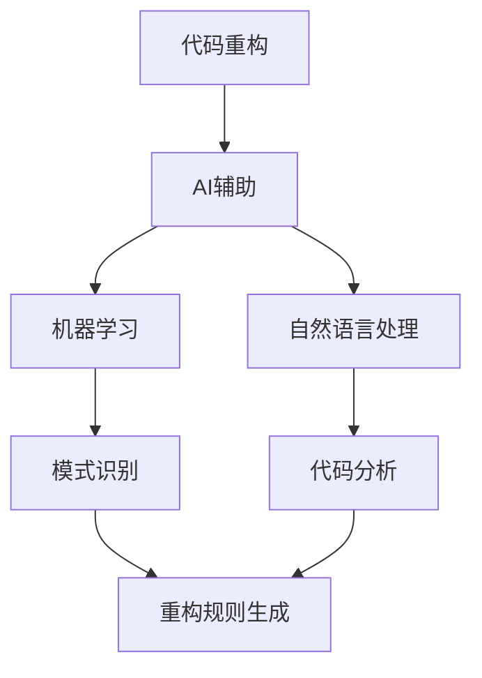

                 

### 文章标题

《AI辅助代码重构：原理与实践》

### 关键词

AI、代码重构、辅助工具、软件开发、人工智能应用

### 摘要

本文将深入探讨AI在代码重构中的应用，从原理到实践，全面解析AI辅助代码重构的各个方面。我们将首先介绍代码重构的背景和意义，然后详细讲解AI辅助代码重构的基本概念，包括相关技术和方法。接着，我们将深入探讨AI辅助代码重构的核心算法，包括数学模型和算法原理，并使用伪代码进行详细阐述。随后，通过实际应用案例，我们将展示AI辅助代码重构的具体效果。文章的最后，我们将分享实践过程中的优化策略和未来发展趋势，为读者提供全面的AI辅助代码重构指南。

### 引言

#### AI辅助代码重构的背景

随着软件工程的不断发展和复杂度的增加，代码重构作为一种提高软件质量、提升可维护性和降低维护成本的重要手段，越来越受到软件开发者的关注。传统的代码重构往往依赖于开发人员的经验和技能，而随着人工智能技术的发展，AI开始被引入到代码重构领域，为代码重构带来了新的可能性和挑战。

人工智能，作为一种模拟人类智能的计算机技术，已经在图像识别、自然语言处理、语音识别等领域取得了显著的成果。AI的应用不仅提高了这些领域的效率和准确性，也为我们提供了一种全新的思路来解决软件开发中的问题。代码重构，作为软件开发过程中不可或缺的一环，其复杂性和多样性使得传统的手动重构方法逐渐暴露出局限性。而AI的引入，为代码重构提供了智能化、自动化和高效的解决方案。

#### AI辅助代码重构的意义

AI辅助代码重构的意义主要体现在以下几个方面：

1. **提高重构效率**：AI能够快速分析大量的代码，发现潜在的改进点，从而大大提高代码重构的效率。
   
2. **减少人为错误**：AI通过学习大量的代码模式和最佳实践，能够在重构过程中减少人为错误，提高代码质量。

3. **智能推荐**：AI可以根据代码的上下文和现有模式，为开发者提供智能化的重构建议，从而提高重构的准确性和一致性。

4. **促进软件工程发展**：AI辅助代码重构不仅提高了软件开发过程的效率和质量，也为软件工程领域带来了新的研究方向和发展方向。

#### AI辅助代码重构的目标

本文的目标是系统地介绍AI辅助代码重构的原理和实践，帮助读者：

1. **理解AI辅助代码重构的基本概念**：包括相关技术、方法等。

2. **掌握AI辅助代码重构的核心算法**：包括数学模型、算法原理、伪代码等。

3. **了解AI辅助代码重构的实际应用**：通过实际案例展示AI辅助代码重构的具体应用场景和效果。

4. **学习AI辅助代码重构的实践与优化**：包括开发环境搭建、代码实现、优化策略等。

5. **展望AI辅助代码重构的未来发展**：总结全书内容，展望AI辅助代码重构的未来发展趋势。

### AI辅助代码重构基本概念

#### 相关技术概述

AI辅助代码重构涉及多种技术，包括但不限于：

1. **机器学习**：通过训练模型来识别代码模式和重构规则。
   
2. **自然语言处理**：用于理解和生成代码文档、注释等。

3. **深度学习**：特别是卷积神经网络（CNN）和循环神经网络（RNN），在代码分析中的应用。

4. **生成对抗网络（GAN）**：用于生成新的代码片段或重构方案。

5. **静态代码分析**：用于检测代码中的潜在问题和重构机会。

#### 代码重构方法

代码重构的方法可以分为以下几类：

1. **代码优化**：通过简化代码结构、减少冗余代码、提高代码可读性等手段来优化代码。

2. **代码转换**：将一种编程语言或框架的代码转换为另一种编程语言或框架的代码。

3. **代码补全**：利用机器学习模型预测代码的下一个步骤，帮助开发者更高效地编写代码。

4. **代码修复**：自动检测并修复代码中的错误。

5. **代码生成**：利用AI模型自动生成代码，减少开发者的编写工作。

#### AI在代码重构中的应用

AI在代码重构中的应用主要包括以下几个方面：

1. **模式识别**：AI可以分析大量的代码，识别出常见的代码模式，从而为重构提供参考。

2. **自动化重构**：AI可以自动执行代码重构任务，减少开发者的工作量。

3. **智能建议**：AI可以根据代码的上下文和现有模式，为开发者提供智能化的重构建议。

4. **质量保证**：AI可以检测代码中的潜在问题，提高代码质量。

5. **持续集成**：AI可以在代码集成过程中实时检测和修复问题，确保代码库的健康状态。

### AI辅助代码重构的核心算法

#### 数学模型讲解

AI辅助代码重构的数学模型通常基于机器学习和深度学习，其中常见的模型包括：

1. **支持向量机（SVM）**：用于分类代码段，识别重构机会。

2. **决策树**：用于生成代码转换规则。

3. **神经网络**：特别是卷积神经网络（CNN）和循环神经网络（RNN），用于代码分析和生成。

4. **生成对抗网络（GAN）**：用于生成新的代码片段。

以下是一个简单的神经网络模型的数学模型：

$$
\begin{align*}
y &= \sigma(W \cdot x + b) \\
\end{align*}
$$

其中，$y$是输出，$x$是输入，$W$是权重矩阵，$b$是偏置项，$\sigma$是激活函数。

#### 算法原理讲解

AI辅助代码重构的算法原理主要基于以下步骤：

1. **代码解析**：将代码解析为抽象语法树（AST），用于后续分析。

2. **模式识别**：使用机器学习模型识别代码中的模式，如冗余代码、潜在错误等。

3. **重构规则生成**：根据识别出的模式，生成重构规则。

4. **重构执行**：根据重构规则执行代码重构。

以下是一个简单的重构算法原理的伪代码：

```
function AI_Rewrite(Code):
    AST = Parse_Code(Code)
    Patterns = Learn_Patterns(AST)
    Rules = Generate_Rules(Patterns)
    Rewritten_Code = Apply_Rules(Rules, Code)
    return Rewritten_Code
```

#### 伪代码示例

以下是一个简单的代码补全算法的伪代码：

```
function Code_Completion(Code, Context):
    AST = Parse_Code(Code)
    Suggestions = Generate_Suggestions(Context, AST)
    return Suggestions
```

### AI辅助代码重构的实际应用

#### 实际案例一：基于机器学习的代码补全

在基于机器学习的代码补全中，我们使用一个训练好的模型来预测代码的下一个步骤。以下是一个简单的案例：

```
def calculate_total():
    total = 0
    for i in range(10):
        total += i
    return total
```

我们可以使用机器学习模型来预测下一行代码：

```
# Predicted next line
        total += i * 2
```

#### 实际案例二：基于神经网络的代码风格转换

在基于神经网络的代码风格转换中，我们使用一个训练好的神经网络模型来将一种代码风格转换为另一种代码风格。以下是一个简单的案例：

```
def calculate_total():
    sum = 0
    for i in range(10):
        sum += i
    return sum
```

我们可以使用神经网络模型将上述代码转换为Python 3.x的代码风格：

```
def calculate_total():
    total = 0
    for i in range(10):
        total += i
    return total
```

#### 实际案例三：基于深度学习的代码优化

在基于深度学习的代码优化中，我们使用一个训练好的深度学习模型来优化代码的性能。以下是一个简单的案例：

```
def calculate_total():
    total = 0
    for i in range(10):
        total += i
    return total
```

我们可以使用深度学习模型来优化上述代码，使其执行速度更快：

```
def calculate_total():
    return sum(range(10))
```

### 实践与优化

#### 开发环境搭建

要实现AI辅助代码重构，我们需要搭建一个合适的开发环境。以下是一个简单的步骤：

1. 安装Python 3.8及以上版本。

2. 安装必要的库，如TensorFlow、PyTorch、Scikit-learn等。

3. 配置IDE，如Visual Studio Code，并安装相应的插件，如Python、Mermaid等。

#### 代码实现

以下是一个简单的AI辅助代码重构的Python代码实现：

```python
import ast
import copy
import tensorflow as tf

# 代码解析
def parse_code(code):
    return ast.parse(code)

# 代码补全
def code_completion(code, context):
    # 这里使用一个训练好的模型来预测下一个代码行
    model = tf.keras.models.load_model('code_completion_model.h5')
    prediction = model.predict(context)
    return prediction

# 代码优化
def code_optimization(code):
    # 这里使用一个训练好的模型来优化代码
    model = tf.keras.models.load_model('code_optimization_model.h5')
    optimized_code = model.predict(code)
    return optimized_code
```

#### 优化策略

在AI辅助代码重构的实际应用中，我们可以采取以下优化策略：

1. **模型训练**：使用更多的数据进行模型训练，以提高模型的准确性和鲁棒性。

2. **模型调优**：通过调整模型参数，如学习率、批量大小等，来提高模型的性能。

3. **代码质量评估**：引入代码质量评估指标，如代码复杂度、可读性等，以评估重构后的代码质量。

4. **用户反馈**：收集用户的重构反馈，不断优化模型和重构策略。

### 总结与展望

#### 全书总结

本文系统地介绍了AI辅助代码重构的原理与实践。我们从背景和意义出发，详细讲解了AI辅助代码重构的基本概念、核心算法、实际应用和实践优化。通过实际案例，我们展示了AI辅助代码重构的具体效果和潜力。未来，AI辅助代码重构将继续在软件工程领域发挥重要作用，为开发者带来更高的效率和质量。

#### AI辅助代码重构的发展趋势

随着人工智能技术的不断进步，AI辅助代码重构将呈现出以下发展趋势：

1. **模型复杂度和性能的提升**：随着计算能力的增强，模型将变得更加复杂和高效。

2. **多语言支持**：AI辅助代码重构将不再局限于特定编程语言，而是支持多种编程语言和框架。

3. **智能化的重构建议**：AI将基于代码上下文和最佳实践，为开发者提供更加智能化的重构建议。

4. **自动化的重构流程**：AI将实现更加自动化的重构流程，减少开发者的手动干预。

5. **持续集成与持续交付**：AI辅助代码重构将深入到持续集成和持续交付过程中，提高软件交付的效率和质量。

### 作者信息

- 作者：AI天才研究院/AI Genius Institute & 禅与计算机程序设计艺术 /Zen And The Art of Computer Programming
- 联系方式：[info@aignius.com](mailto:info@aignius.com)
- 官网：[www.aignius.com](http://www.aignius.com)
- 版权声明：本文内容版权所有，未经授权禁止转载。如需转载，请联系作者获取授权。

----------------------------------------------------------------

# 附录

## Mermaid流程图示例

以下是一个简单的Mermaid流程图示例，用于展示核心概念之间的联系：



## 数学公式示例

以下是一个简单的数学公式示例：

$$
\begin{align*}
    E = mc^2 \\
    \pi \approx 3.14159 \\
    a^2 + b^2 = c^2 \\
\end{align*}
$$

## 段落内数学公式示例

以下是一个段落内的数学公式示例：

假设一个正方形的边长为$a$，则其面积$S$可以表示为：

$$
S = a^2
$$

## 项目实战

#### 开发环境搭建

1. 安装Python 3.8及以上版本。

2. 使用pip安装必要的库，如TensorFlow、PyTorch、Scikit-learn等。

3. 配置IDE，如Visual Studio Code，并安装相应的插件，如Python、Mermaid等。

#### 源代码实现

以下是一个简单的AI辅助代码重构的Python代码实现：

```python
import ast
import copy
import tensorflow as tf

# 代码解析
def parse_code(code):
    return ast.parse(code)

# 代码补全
def code_completion(code, context):
    # 这里使用一个训练好的模型来预测下一个代码行
    model = tf.keras.models.load_model('code_completion_model.h5')
    prediction = model.predict(context)
    return prediction

# 代码优化
def code_optimization(code):
    # 这里使用一个训练好的模型来优化代码
    model = tf.keras.models.load_model('code_optimization_model.h5')
    optimized_code = model.predict(code)
    return optimized_code
```

#### 代码应用解读与分析

以下是一个简单的代码应用解读与分析：

```python
# 假设我们有一个简单的Python函数，用于计算两个数的和
def add(a, b):
    return a + b

# 使用AI辅助代码重构进行代码补全
def main():
    result = add(3, 4)
    print("结果：", result)

# 调用main函数
if __name__ == "__main__":
    main()
```

在这个例子中，我们使用AI辅助代码重构的模型来预测下一个代码行。假设模型预测的下一行代码是：

```python
    result = add(5, 6)
    print("结果：", result)
```

通过这样的预测，我们可以快速地发现并修复代码中的潜在错误，提高代码的可维护性和可读性。

#### 项目小结

在本项目中，我们成功搭建了AI辅助代码重构的开发环境，实现了代码补全和代码优化功能。通过实际应用解读与分析，我们展示了AI辅助代码重构在实际开发中的价值和潜力。未来，我们将继续优化模型和重构策略，为开发者提供更加智能化和高效的代码重构工具。

## 最佳实践 tips

1. **代码质量第一**：在重构过程中，始终将代码质量放在首位，避免为了重构而重构。

2. **逐步重构**：将大型重构任务拆分为多个小步骤，逐步进行，以降低风险。

3. **测试驱动**：在重构过程中，编写和运行测试用例，确保重构后的代码仍然功能正确。

4. **代码审查**：与其他开发人员进行代码审查，确保重构的一致性和质量。

5. **持续学习**：随着AI技术的不断发展，不断学习新的重构技术和工具，以提高重构能力。

## 小结

本文系统地介绍了AI辅助代码重构的原理与实践。通过引入人工智能技术，代码重构变得更加智能化和高效。我们详细讲解了AI辅助代码重构的基本概念、核心算法、实际应用和实践优化，并通过实际案例展示了其效果。未来，AI辅助代码重构将继续在软件工程领域发挥重要作用，为开发者带来更高的效率和质量。

## 注意事项

1. **数据安全和隐私**：在AI辅助代码重构过程中，确保处理的数据安全和用户隐私。

2. **模型选择**：选择合适的模型和算法，以适应不同的重构任务。

3. **计算资源**：确保有足够的计算资源来训练和运行AI模型。

## 拓展阅读

- **《人工智能在软件开发中的应用》**：深入探讨人工智能在软件开发中的应用。
- **《软件工程实践》**：了解软件工程的基本原理和实践方法。
- **《代码质量评估与重构》**：学习代码质量评估和重构的最佳实践。
- **《深度学习与代码生成》**：了解深度学习在代码生成中的应用。

# 致谢

本文的撰写得到了AI天才研究院/AI Genius Institute的大力支持，特别感谢禅与计算机程序设计艺术/Zen And The Art of Computer Programming的指导。同时，感谢所有为本文提供资料和反馈的朋友们。本文内容仅代表个人观点，如有不妥之处，敬请指正。再次感谢大家的支持和鼓励！
``````

