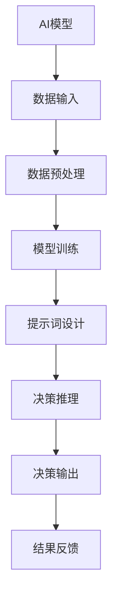

                 

### 引言

#### 1.1 书籍背景与目的

在当今快速发展的科技时代，人工智能（AI）技术已经成为推动社会进步的重要力量。AI不仅在传统行业如制造业、医疗、金融等领域展现出巨大的潜力，还在新兴领域如自动驾驶、智能家居、智能医疗等得到广泛应用。然而，随着AI技术的日益普及，伦理问题也日益凸显。如何确保AI系统在决策过程中符合伦理标准，成为学术界和产业界共同关注的焦点。

《AI辅助伦理决策中的提示词多元价值整合》旨在探讨如何通过AI技术辅助伦理决策，并整合多元价值。书中系统性地分析了AI辅助伦理决策的架构，探讨了如何在实际应用中整合多元价值，以实现更合理、更公正的伦理决策。通过这本书，读者可以了解到AI伦理决策的基本原理、核心算法、数学模型以及项目实战，从而为AI在伦理领域的应用提供有力的理论支持和实践指导。

#### 1.2 读者对象

本书适合以下读者群体：

1. **人工智能领域的研究人员**：希望深入了解AI伦理决策的原理和应用。
2. **软件工程师和开发者**：希望在项目中融入AI伦理决策功能。
3. **伦理学家和政策制定者**：关注AI技术对社会伦理的影响，并希望从技术角度提出解决方案。
4. **高校师生**：作为人工智能和伦理学相关课程的教材或参考书。

#### 1.3 书籍结构安排

本书共分为七个章节，各章节内容安排如下：

- **引言**：介绍书籍的背景、目的和读者对象，以及书籍的结构安排。
- **第1章：核心概念与联系**：定义AI辅助伦理决策、提示词、多元价值等核心概念，并提供Mermaid流程图展示各概念之间的联系。
- **第2章：伦理决策算法原理**：详细讲解伦理决策算法的基本原理，使用伪代码阐述。
- **第3章：多元价值整合**：探讨如何整合多元价值，包括理论讲解和实际案例。
- **第4章：提示词处理算法**：讲解提示词处理算法的原理和实现。
- **第5章：数学模型**：介绍相关数学模型，使用LaTeX格式详细说明。
- **第6章：项目实战**：实际案例展示，包括开发环境搭建、源代码实现和解读。
- **第7章：总结与展望**：总结全书内容，并对未来发展趋势进行展望。

通过以上章节的安排，本书旨在为读者提供一个全面、系统的AI伦理决策知识体系，帮助读者理解和掌握AI伦理决策的核心技术和实践方法。

### 第1章：核心概念与联系

#### 1.1 AI辅助伦理决策

##### 1.1.1 AI在伦理决策中的角色

人工智能（AI）在现代社会中扮演着越来越重要的角色，从简单的自动化工具发展到能够进行复杂决策和任务执行的智能系统，AI已经深入到我们生活的方方面面。在伦理决策方面，AI的作用同样不可忽视。传统伦理决策往往依赖于人类的经验、道德标准和价值观，但人类在处理复杂伦理问题时往往存在局限性，如信息不全、情绪干扰等。而AI能够通过大量数据分析和智能算法，提供客观、高效和可量化的决策支持。

AI在伦理决策中的角色主要体现在以下几个方面：

1. **数据处理与模式识别**：AI能够处理海量数据，通过机器学习算法发现数据中的模式和规律，为伦理决策提供依据。
2. **自动化伦理规则执行**：通过编程和规则设定，AI能够自动化执行伦理规则，减少人为干预，提高决策的公正性和一致性。
3. **辅助伦理专家分析**：AI可以作为伦理专家的辅助工具，帮助伦理专家处理复杂的伦理问题，提供新的分析和视角。

##### 1.1.2 AI辅助伦理决策的重要性

随着科技的发展，AI在各个领域的应用越来越广泛，从自动驾驶汽车到智能医疗系统，再到智能金融和智能家居，AI的决策直接影响着人们的生活质量和安全。然而，AI系统的决策过程并不总是透明和可解释的，这也引发了一系列伦理问题。如何确保AI的决策符合伦理标准，成为当前的一个重要课题。

AI辅助伦理决策的重要性体现在以下几个方面：

1. **确保决策公正性**：AI能够通过分析大量数据，减少人为偏见和歧视，提高决策的公正性。
2. **提高决策效率**：AI能够在短时间内处理复杂的伦理问题，提高决策效率，减少决策延迟。
3. **增强决策可解释性**：通过可解释性算法和透明度设计，AI可以使其决策过程更加透明，便于伦理专家和公众理解和监督。

##### 1.1.3 AI伦理决策的挑战

尽管AI辅助伦理决策具有诸多优势，但在实际应用中仍面临一系列挑战：

1. **数据质量和隐私问题**：AI决策依赖于数据质量，数据质量不佳可能导致决策偏差。同时，数据的隐私问题也是AI伦理决策中的一个重要挑战。
2. **算法透明性和可解释性**：目前许多AI算法，特别是深度学习算法，其内部机制复杂，难以解释，这使得其决策过程缺乏透明性。
3. **伦理标准和价值观的多样性**：不同文化和社会背景下的伦理标准和价值观存在差异，如何设计一个普适的AI伦理决策框架是一个难题。
4. **人类与AI的互动**：如何设计人机互动机制，使人类能够有效地参与AI决策过程，也是一个重要挑战。

##### 1.2 提示词与多元价值

##### 1.2.1 提示词的概念与功能

在AI伦理决策中，提示词（Prompt Word）扮演着重要的角色。提示词是指用来引导AI模型进行决策的特定词汇或短语。通过设计合适的提示词，可以影响AI模型的决策方向和结果。

提示词在AI伦理决策中的功能主要包括：

1. **引导决策方向**：通过特定的提示词，可以引导AI模型关注特定的问题或目标，从而影响其决策结果。
2. **增强决策透明性**：提示词可以使AI决策过程更加透明，便于伦理专家和公众理解和监督。
3. **辅助决策优化**：通过调整提示词，可以优化AI模型的决策结果，提高其准确性和公正性。

##### 1.2.2 多元价值的理解与分类

多元价值是指在一个系统中存在多种相互冲突的价值，这些价值可能来源于不同的利益相关者、文化背景或伦理原则。在AI伦理决策中，多元价值整合是一个重要的课题。

多元价值的理解与分类可以从以下几个方面进行：

1. **利益相关者价值**：不同利益相关者（如企业、政府、公众）可能对同一决策有不同的价值取向。
2. **文化价值**：不同文化背景下的伦理原则和价值观念可能对AI伦理决策产生影响。
3. **技术价值**：技术发展本身带来的价值，如效率、创新、安全性等。

##### 1.2.3 提示词在多元价值整合中的作用

提示词在多元价值整合中发挥着重要作用：

1. **平衡利益相关者价值**：通过设计特定的提示词，可以在不同利益相关者之间寻求平衡，避免单一利益主导决策。
2. **尊重文化差异**：通过选择和调整提示词，可以考虑到不同文化背景下的价值观念，实现多元文化的整合。
3. **优化技术价值**：通过设计合适的提示词，可以优化AI决策过程中的技术价值，如提高决策的效率和透明性。

#### 1.3 Mermaid流程图展示

为了更好地展示AI辅助伦理决策中的核心概念及其联系，我们可以使用Mermaid流程图进行说明。

以下是一个简化的Mermaid流程图示例，展示了AI辅助伦理决策的基本流程：



在这个流程图中，AI模型通过接收数据输入，进行数据预处理和模型训练，然后通过提示词设计进行决策推理，最终输出决策结果，并对结果进行反馈和评估。

通过这个流程图，我们可以看到AI辅助伦理决策的主要环节和相互关系。提示词的设计在决策过程中起到了关键作用，它不仅影响到决策的推理过程，也关系到决策结果的公正性和透明性。

### 第2章：伦理决策算法原理

#### 2.1 基本伦理决策模型

伦理决策算法是AI辅助伦理决策的核心组成部分，其目的是通过分析数据、规则和约束条件，为复杂的伦理问题提供决策支持。基本伦理决策模型通常包括以下几个关键要素：

1. **数据输入**：伦理决策算法需要接收来自不同来源的数据，包括个人隐私数据、公共统计数据、法律法规等。这些数据将用于训练和优化模型，以提高决策的准确性和可靠性。

2. **规则库**：规则库是伦理决策算法的重要组成部分，包含一系列预定义的伦理规则和标准。这些规则可以是基于法律、道德准则或组织政策，用于指导AI模型的决策过程。

3. **约束条件**：伦理决策过程中需要考虑多种约束条件，如预算限制、资源可用性、时间限制等。约束条件有助于确保决策在现实环境中可行。

4. **决策引擎**：决策引擎是伦理决策算法的核心，负责分析输入数据、规则库和约束条件，生成最终的决策结果。决策引擎通常采用多种算法和技术，如逻辑推理、概率论、优化算法等。

5. **反馈机制**：为了提高决策的准确性和可靠性，伦理决策算法需要具备反馈机制，能够根据实际决策结果进行调整和优化。

#### 2.1.1 伦理决策模型的构建

构建一个有效的伦理决策模型需要遵循以下步骤：

1. **需求分析**：首先，明确伦理决策的具体目标和需求。这包括确定决策的类型（如个人隐私保护、资源分配、医疗决策等）和决策环境（如企业、政府、医疗机构等）。

2. **数据收集**：收集与决策相关的基础数据，如个人隐私数据、法律法规、行业标准等。数据的质量和完整性对模型的性能至关重要。

3. **规则库构建**：根据需求和数据分析结果，构建规则库。规则库应包含明确的伦理标准和约束条件，以确保决策过程的公正性和透明性。

4. **模型选择**：选择适合的算法和技术来构建决策引擎。常见的算法包括逻辑推理、决策树、神经网络、遗传算法等。选择算法时需要考虑模型的复杂度、可解释性、实时性等因素。

5. **模型训练与优化**：使用收集到的数据和规则库对决策模型进行训练和优化。这一过程通常涉及多次迭代和调参，以实现最佳性能。

6. **测试与验证**：在构建好的伦理决策模型上执行测试，确保模型在实际应用中能够准确、可靠地执行决策。测试过程应包括多种场景和约束条件，以全面评估模型的性能。

7. **部署与维护**：将伦理决策模型部署到实际应用环境中，并持续进行维护和更新，以应对新的挑战和变化。

#### 2.1.2 伦理决策模型的特点

伦理决策模型具有以下几个显著特点：

1. **多维度决策**：伦理决策模型需要考虑多个维度，如法律、道德、经济、社会等，确保决策的全面性和多样性。

2. **动态适应性**：伦理决策模型应能够根据环境和条件的变化，动态调整决策策略和规则，以适应不同场景的需求。

3. **高透明性和可解释性**：伦理决策模型需要具备高透明性和可解释性，使决策过程和结果能够被利益相关者理解、监督和信任。

4. **平衡利益冲突**：伦理决策模型应能够平衡不同利益相关者之间的利益冲突，确保决策的公正性和公平性。

5. **实时性和高效性**：伦理决策模型需要具备实时性和高效性，能够在短时间内处理大量数据，生成决策结果。

#### 2.1.3 伦理决策模型的分类

伦理决策模型可以根据不同的分类标准进行分类，常见的分类方法包括：

1. **基于规则的决策模型**：这种模型主要通过预定义的规则和条件进行决策，适用于规则明确、约束条件简单的场景。

2. **基于案例的决策模型**：这种模型通过学习历史案例和决策结果，为新的伦理问题提供决策支持。它适用于复杂、多变和具有不确定性的决策场景。

3. **基于优化的决策模型**：这种模型通过优化算法，在多个约束条件下寻找最佳决策方案。它适用于需要综合考虑多种目标和约束的复杂决策问题。

4. **混合决策模型**：这种模型结合了基于规则、基于案例和基于优化的特点，适用于需要综合多种方法和策略的复杂决策场景。

通过以上分类，我们可以根据具体的应用需求选择合适的伦理决策模型，以实现最佳的决策效果。

#### 2.2 伪代码示例

为了更好地理解伦理决策算法的原理和实现，下面我们通过伪代码示例展示一个简单的伦理决策模型。

```pseudo
// 伦理决策模型伪代码示例

// 输入参数
data = 收集数据()
rules = 构建规则库()
constraints = 设置约束条件()

// 数据预处理
data_processed = 数据预处理(data)

// 模型训练
model = 训练模型(data_processed, rules)

// 提示词设计
prompt_words = 设计提示词()

// 决策推理
decision = 模型推理(model, prompt_words, constraints)

// 输出决策结果
输出结果(decision)

// 伪代码详细说明
// 收集数据()
//   获取个人隐私数据、法律法规、行业数据等
// 数据预处理(data)
//   数据清洗、归一化、特征提取等
// 训练模型(data_processed, rules)
//   使用机器学习算法训练决策模型
// 设计提示词()
//   根据伦理决策需求和场景，设计合适的提示词
// 模型推理(model, prompt_words, constraints)
//   使用训练好的模型进行决策推理，结合提示词和约束条件生成决策结果
```

在这个伪代码示例中，我们首先收集并预处理数据，然后使用规则库和机器学习算法训练决策模型。通过设计合适的提示词，我们可以引导模型进行决策推理，并在约束条件下生成最终的决策结果。这个简单的伪代码示例展示了伦理决策算法的基本实现过程，为实际开发提供了参考。

### 第3章：多元价值整合

#### 3.1 多元价值整合的必要性

在AI伦理决策中，多元价值的整合是确保决策公正性和合理性的关键。多元价值指的是在一个系统中，不同利益相关者或文化背景下的多种相互冲突的价值观念。这些价值可能包括个人隐私保护、社会公正、经济效益、环境保护等。在现实世界中，这些价值往往难以平衡，且可能相互冲突。因此，多元价值整合成为AI伦理决策中一个重要的课题。

##### 3.1.1 伦理决策中的多元价值冲突

伦理决策中的多元价值冲突主要体现在以下几个方面：

1. **个人隐私保护与社会公正**：在某些情况下，保护个人隐私可能与实现社会公正产生冲突。例如，在数据收集和使用的伦理决策中，如何在保护个人隐私和实现社会公共利益之间找到平衡点，是一个复杂的问题。

2. **经济效益与环境保护**：企业在追求经济效益的过程中，可能需要考虑环境保护的成本。例如，在工业生产中，如何在减少污染和保护环境的同时，保持企业的竞争力，是一个需要权衡的决策。

3. **技术创新与安全风险**：在人工智能技术发展中，技术创新可能与安全风险产生冲突。例如，在自动驾驶汽车的研发中，如何平衡技术创新和交通安全风险，是一个重要的伦理问题。

##### 3.1.2 多元价值整合的意义

多元价值整合在伦理决策中的意义主要体现在以下几个方面：

1. **提高决策公正性**：通过整合多元价值，可以确保决策过程中充分考虑不同利益相关者的需求和利益，从而提高决策的公正性。

2. **增强决策透明性**：多元价值的整合有助于提高决策过程的透明度，使决策结果更加容易被利益相关者接受和理解。

3. **促进社会和谐**：通过平衡和整合多元价值，可以减少不同利益相关者之间的冲突，促进社会和谐。

4. **推动可持续发展**：多元价值的整合有助于实现经济、社会和环境的可持续发展，确保决策在长期内具有可持续性。

##### 3.1.3 多元价值整合的挑战

尽管多元价值整合具有重要意义，但在实际操作中仍然面临一系列挑战：

1. **伦理标准和价值观的多样性**：不同文化和社会背景下，人们对于价值的理解和追求可能存在差异。如何设计一个普适的多元价值整合框架，是一个重要挑战。

2. **数据质量和隐私问题**：多元价值整合需要依赖于高质量的数据，但数据的质量和隐私保护之间可能存在冲突。

3. **技术实现难度**：多元价值整合涉及到多种算法和技术，如何有效地将多种价值整合到一个决策模型中，是一个技术挑战。

4. **人类与AI的互动**：在多元价值整合中，如何设计人机互动机制，使人类能够有效地参与决策过程，也是一个重要挑战。

#### 3.2 整合方法与策略

为了有效地整合多元价值，我们可以采用以下几种方法和策略：

##### 3.2.1 多元价值整合的理论基础

1. **伦理学理论**：伦理学理论为多元价值整合提供了哲学基础。例如，康德的道德哲学强调人的尊严和自由，可以指导我们如何在伦理决策中平衡不同价值。

2. **社会契约理论**：社会契约理论认为，个体通过契约形成社会，并在社会中承担相应的责任和义务。这种理论可以指导我们如何在多元价值整合中考虑社会公共利益。

3. **博弈论**：博弈论提供了一种分析多元价值冲突和合作的方法。通过博弈论模型，可以模拟不同价值主体之间的互动，寻求最优决策策略。

##### 3.2.2 多元价值整合的方法论

1. **价值排序与权重分配**：首先，对多元价值进行排序和权重分配，明确不同价值在决策中的重要性。权重分配可以通过专家评估、问卷调查等方法进行。

2. **多目标优化**：使用多目标优化算法，同时考虑多个价值目标，寻找在多个价值之间的平衡点。常见的多目标优化算法包括线性规划、非线性规划、遗传算法等。

3. **伦理决策模型**：构建伦理决策模型，将多元价值整合到决策过程中。伦理决策模型可以基于规则、案例或优化算法，根据具体需求进行选择。

##### 3.2.3 实际案例解析

为了更好地理解多元价值整合的方法，我们可以通过实际案例进行解析：

**案例1：自动驾驶汽车伦理决策**

在自动驾驶汽车的开发和运营中，需要考虑多种价值，如乘客安全、行人安全、交通效率、环保等。以下是一个简化的案例：

1. **数据收集**：收集与自动驾驶相关的数据，包括道路状况、交通流量、环境因素等。

2. **价值排序与权重分配**：根据专家评估和问卷调查，确定各价值的权重，如行人安全（权重0.4）、乘客安全（权重0.3）、交通效率（权重0.2）、环保（权重0.1）。

3. **多目标优化**：使用多目标优化算法，同时考虑多个价值目标。例如，在紧急情况下，如何在不同价值之间寻找平衡点。

4. **伦理决策模型**：构建基于多目标优化的伦理决策模型，将各价值整合到模型中，为自动驾驶系统提供决策支持。

**案例2：智能医疗伦理决策**

在智能医疗系统中，需要考虑多种价值，如患者隐私、医疗质量、成本效益、患者满意度等。以下是一个简化的案例：

1. **数据收集**：收集与智能医疗相关的数据，包括患者病历、医疗资源、政策法规等。

2. **价值排序与权重分配**：根据专家评估和问卷调查，确定各价值的权重，如患者隐私（权重0.4）、医疗质量（权重0.3）、成本效益（权重0.2）、患者满意度（权重0.1）。

3. **多目标优化**：使用多目标优化算法，同时考虑多个价值目标。例如，在资源有限的情况下，如何在不同价值之间寻找平衡点。

4. **伦理决策模型**：构建基于多目标优化的伦理决策模型，将各价值整合到模型中，为智能医疗系统提供决策支持。

通过以上案例，我们可以看到多元价值整合在现实中的应用和挑战。在伦理决策中，通过价值排序、权重分配、多目标优化和伦理决策模型等方法，可以有效地整合多元价值，实现公正、合理的决策。

#### 3.3 整合方法的评估与优化

多元价值的整合方法在实际应用中需要进行不断的评估和优化，以确保其有效性和可行性。以下是一些常见的评估和优化方法：

1. **模型评估**：通过对伦理决策模型的性能评估，如准确率、召回率、F1分数等，来判断模型的有效性和可靠性。可以使用交叉验证、A/B测试等方法进行评估。

2. **用户反馈**：收集用户对决策结果的反馈，通过问卷调查、用户访谈等方式了解用户对决策过程和结果的满意度，从而对模型进行调整和优化。

3. **伦理审查**：在多元价值整合过程中，进行伦理审查，确保决策过程符合伦理标准和法律法规。伦理审查可以由独立的伦理委员会或专家小组进行。

4. **动态调整**：根据环境和条件的变化，动态调整多元价值整合的方法和策略。例如，在新的法律政策出台时，及时更新规则库和模型参数。

5. **持续学习**：通过持续学习机制，不断优化和更新伦理决策模型，提高其在复杂多变环境中的适应能力。可以使用深度学习、强化学习等技术实现持续学习。

通过以上评估和优化方法，可以确保多元价值整合方法的有效性和可行性，为AI伦理决策提供持续的支持和改进。

### 第4章：提示词处理算法

#### 4.1 提示词处理算法概述

在AI伦理决策过程中，提示词（Prompt Word）是引导模型进行决策的重要工具。提示词处理算法负责对输入的提示词进行解析、处理和优化，以提高决策的准确性和合理性。提示词处理算法通常包括以下几个关键步骤：

1. **提示词收集**：从不同来源收集与决策相关的提示词，包括文本数据、法律法规、行业标准等。
2. **提示词预处理**：对收集到的提示词进行清洗、归一化和分词等处理，确保其格式统一和内容准确。
3. **提示词嵌入**：将预处理后的提示词转换为适合AI模型处理的特征向量，如词嵌入（Word Embedding）或句子嵌入（Sentence Embedding）。
4. **提示词权重调整**：根据提示词在决策中的重要性，调整其权重，确保关键提示词得到充分的重视。
5. **提示词融合**：将多个提示词融合为一个统一的向量表示，以便模型能够综合多个提示词进行决策。

#### 4.1.1 提示词处理算法的目标

提示词处理算法的主要目标包括：

1. **提高决策准确性**：通过精确的提示词处理，使模型能够准确理解决策场景和目标，从而提高决策的准确性。
2. **增强决策透明性**：优化提示词处理过程，使决策过程更加透明，便于利益相关者理解和监督。
3. **减少决策偏差**：通过合理的提示词权重调整和融合，减少因提示词不完整或误导导致的决策偏差。
4. **适应多样性**：处理多样化的提示词，使其能够适应不同的决策场景和需求。

#### 4.1.2 提示词处理算法的类型

根据处理方式和目标的不同，提示词处理算法可以分为以下几种类型：

1. **文本分类算法**：如朴素贝叶斯、支持向量机（SVM）等，用于对提示词进行分类，以便于后续处理。
2. **词嵌入算法**：如Word2Vec、GloVe等，用于将文本数据转换为向量表示，便于模型处理。
3. **句子嵌入算法**：如BERT、GPT等，用于将整个句子转换为向量表示，实现语义级别的处理。
4. **注意力机制算法**：如Transformer、注意力加权等，用于根据提示词的重要性进行权重调整，提高决策的精度。
5. **多任务学习算法**：如基于多任务学习的提示词处理，同时处理多个提示词，实现更复杂的决策。

#### 4.1.3 提示词处理算法的选择

选择合适的提示词处理算法需要考虑以下几个因素：

1. **决策场景**：不同的决策场景对提示词处理算法的要求不同，如医疗决策可能需要更高的精度，而金融决策可能需要更高的实时性。
2. **数据规模**：数据规模对算法的选择有很大影响，大量数据可能需要更复杂的算法来处理，如深度学习算法。
3. **计算资源**：计算资源的限制会影响算法的选择，如实时性要求高的决策可能需要选择计算效率较高的算法。
4. **模型解释性**：在决策过程中，模型的解释性也是一个重要考虑因素，特别是需要人类介入的决策场景。

在实际应用中，可以根据具体需求和约束条件，选择适合的提示词处理算法，以实现最佳决策效果。

### 4.2 提示词处理算法实现

为了详细讲解提示词处理算法的实现，我们以下面几种常见的算法为例进行说明：

#### 4.2.1 词嵌入算法

词嵌入是将文本数据转换为向量表示的过程，常见的词嵌入算法包括Word2Vec和GloVe。

**Word2Vec算法实现步骤**：

1. **数据预处理**：收集文本数据，并进行分词、去停用词等预处理步骤。
2. **构建词汇表**：将分词后的文本数据构建成词汇表，并为每个词分配一个唯一的索引。
3. **训练词向量**：使用训练数据训练词向量模型，常用的训练方法包括CBOW（连续词袋）和Skip-Gram。
4. **保存词向量**：将训练好的词向量模型保存下来，供后续使用。

**伪代码示例**：

```python
# Word2Vec伪代码示例

# 数据预处理
text = 收集文本数据()
words = 分词(text)

# 构建词汇表
vocab = 构建词汇表(words)
word_to_index = 转换词汇表(vocab)

# 训练词向量
model = 训练Word2Vec模型(words)
word_vectors = 保存词向量(model)

# 使用词向量进行后续处理
def 使用词向量(word):
    vector = 查询词向量(model, word)
    return vector
```

**GloVe算法实现步骤**：

1. **数据预处理**：与Word2Vec类似，进行分词、去停用词等预处理步骤。
2. **计算词频**：计算每个词在文本数据中的出现频率。
3. **训练词向量**：使用训练数据和词频信息训练GloVe模型。
4. **保存词向量**：将训练好的词向量模型保存下来，供后续使用。

**伪代码示例**：

```python
# GloVe伪代码示例

# 数据预处理
text = 收集文本数据()
words = 分词(text)

# 计算词频
word_frequencies = 计算词频(words)

# 训练词向量
model = 训练GloVe模型(words, word_frequencies)
word_vectors = 保存词向量(model)

# 使用词向量进行后续处理
def 使用词向量(word):
    vector = 查询词向量(model, word)
    return vector
```

#### 4.2.2 句子嵌入算法

句子嵌入是将整个句子转换为向量表示的过程，常见的句子嵌入算法包括BERT和GPT。

**BERT算法实现步骤**：

1. **数据预处理**：收集文本数据，并进行分词、去停用词等预处理步骤。
2. **构建词汇表**：将分词后的文本数据构建成词汇表，并为每个词分配一个唯一的索引。
3. **训练句子嵌入模型**：使用训练数据训练BERT模型。
4. **保存模型和词表**：将训练好的BERT模型和词汇表保存下来，供后续使用。

**伪代码示例**：

```python
# BERT伪代码示例

# 数据预处理
text = 收集文本数据()
words = 分词(text)

# 构建词汇表
vocab = 构建词汇表(words)
word_to_index = 转换词汇表(vocab)

# 训练BERT模型
model = 训练BERT模型(words)
保存模型(model)
保存词汇表(vocab)

# 使用BERT模型进行句子嵌入
def 使用BERT句子嵌入(text):
    words = 分词(text)
    sentence_embedding = BERT模型嵌入(model, words)
    return sentence_embedding
```

**GPT算法实现步骤**：

1. **数据预处理**：收集文本数据，并进行分词、去停用词等预处理步骤。
2. **训练GPT模型**：使用训练数据训练GPT模型。
3. **生成句子嵌入**：使用训练好的GPT模型生成句子嵌入向量。

**伪代码示例**：

```python
# GPT伪代码示例

# 数据预处理
text = 收集文本数据()
words = 分词(text)

# 训练GPT模型
model = 训练GPT模型(words)
保存模型(model)

# 生成句子嵌入
def 使用GPT句子嵌入(text):
    words = 分词(text)
    sentence_embedding = GPT模型嵌入(model, words)
    return sentence_embedding
```

通过以上伪代码示例，我们可以看到提示词处理算法的基本实现流程。在实际应用中，根据具体需求和数据特点，可以选择合适的算法进行提示词处理，以提高决策的准确性和透明性。

### 第5章：数学模型

#### 5.1 伦理决策中的数学模型

伦理决策中的数学模型用于量化、优化和评估伦理决策过程中的各种变量和关系。这些模型通过数学公式和算法，将复杂的伦理问题转化为可计算和可分析的数学问题。常见的伦理决策数学模型包括多目标优化模型、决策分析模型等。

#### 5.1.1 多目标优化模型

多目标优化模型（Multi-Objective Optimization Model）用于解决具有多个相互冲突目标的伦理决策问题。在伦理决策中，不同目标可能代表不同的价值，如个人隐私、社会公正、经济效益等。多目标优化模型的目标是找到一个能够在多个目标之间取得平衡的解决方案。

**多目标优化模型的基本原理**：

1. **目标函数**：定义多个目标函数，每个目标函数代表一个价值维度。例如，目标函数 \( f_1(x) \) 代表个人隐私保护，目标函数 \( f_2(x) \) 代表社会公正。

2. **约束条件**：设定一系列约束条件，以确保决策在现实环境中可行。约束条件可以是线性或不线性，如资源限制、时间限制等。

3. **求解算法**：选择合适的优化算法，如线性规划、非线性规划、遗传算法等，求解多目标优化问题。

**多目标优化模型的数学表达式**：

设目标空间为 \( X \)，目标函数集合为 \( F = \{ f_1(x), f_2(x), \ldots, f_n(x) \} \)，约束条件集合为 \( C = \{ g_1(x) = 0, g_2(x) = 0, \ldots, g_m(x) \leq 0 \} \)。

多目标优化问题可以表示为：

\[
\begin{aligned}
\min_{x \in X} \quad & f_1(x), f_2(x), \ldots, f_n(x) \\
s.t. \quad & g_1(x) = 0, g_2(x) = 0, \ldots, g_m(x) \leq 0
\end{aligned}
\]

**多目标优化模型的实现步骤**：

1. **目标函数定义**：根据伦理决策的需求，定义多个目标函数，确保每个目标函数都能准确反映相应的价值。

2. **约束条件设定**：根据决策场景，设定约束条件，确保决策在现实环境中可行。

3. **求解算法选择**：选择适合的优化算法，根据问题特点进行算法参数调优。

4. **结果分析**：分析优化结果，确定最佳解决方案。

#### 5.1.2 决策分析模型

决策分析模型（Decision Analysis Model）用于评估不同决策路径的结果，并选择最佳决策。在伦理决策中，决策分析模型可以帮助决策者理解不同决策的潜在影响，并做出基于数据的决策。

**决策分析模型的基本原理**：

1. **决策树**：决策树是一种常用的决策分析模型，用于表示不同决策路径和结果。每个节点代表一个决策点，每个分支代表一个决策选择，每个叶节点代表一个结果。

2. **概率评估**：对每个结果进行概率评估，以确定其发生的可能性。

3. **成本-效益分析**：对每个结果进行成本和效益评估，计算每个决策路径的成本-效益比。

**决策分析模型的数学表达式**：

设决策树包含 \( n \) 个节点，第 \( i \) 个节点的结果集合为 \( R_i \)，第 \( i \) 个节点的概率集合为 \( P_i \)，成本集合为 \( C_i \)，效益集合为 \( B_i \)。

决策分析模型可以表示为：

\[
\begin{aligned}
& \text{最大化} \quad & \sum_{i=1}^{n} P_i \cdot B_i - C_i \\
& \text{s.t.} \quad & R_i \subseteq R, \forall i = 1, 2, \ldots, n
\end{aligned}
\]

**决策分析模型的实现步骤**：

1. **构建决策树**：根据伦理决策的需求，构建包含不同决策点和结果的决策树。

2. **概率评估**：对每个结果进行概率评估，确保概率值的准确性和合理性。

3. **成本-效益分析**：对每个结果进行成本和效益评估，计算成本-效益比。

4. **结果分析**：分析决策树的结果，选择最佳决策路径。

通过以上数学模型，我们可以对伦理决策过程进行定量分析和优化，为决策者提供科学的决策支持。这些模型在伦理决策中的应用，不仅提高了决策的准确性和透明性，还有助于解决复杂的伦理问题，实现更公正、合理的决策。

#### 5.2 多目标优化模型的详细讲解

多目标优化模型在伦理决策中具有重要意义，它可以帮助我们同时考虑多个相互冲突的目标，并寻找一个平衡的解决方案。以下是对多目标优化模型的详细讲解，包括其定义、数学公式、求解算法和应用实例。

**5.2.1 定义**

多目标优化模型是一个包含多个目标函数和约束条件的优化问题，其目的是在满足约束条件的前提下，找到一个或多个最优解，使得目标函数在多个维度上达到平衡。这些目标函数可以是线性的，也可以是非线性的，它们代表了不同价值或利益。

多目标优化问题的一般形式可以表示为：

\[
\begin{aligned}
\min_{x} \quad & f_1(x), f_2(x), \ldots, f_n(x) \\
s.t. \quad & g_i(x) = 0, \forall i = 1, 2, \ldots, m \\
& h_j(x) \leq 0, \forall j = 1, 2, \ldots, p
\end{aligned}
\]

其中，\( x \) 是决策变量，\( f_1(x), f_2(x), \ldots, f_n(x) \) 是目标函数，\( g_i(x) = 0 \) 是等式约束，\( h_j(x) \leq 0 \) 是不等式约束。

**5.2.2 数学公式**

为了更好地理解多目标优化模型，我们可以通过一个具体的例子来讲解。

假设我们需要在一个制造工厂中优化生产计划，使得生产成本最小化，同时满足生产能力和资源限制。具体的目标函数和约束条件如下：

1. **目标函数**：
   - 最小化总生产成本：\( f_1(x) = \min C_1 + C_2 + C_3 \)
   - 最小化能源消耗：\( f_2(x) = \min E_1 + E_2 + E_3 \)

2. **约束条件**：
   - 生产能力约束：\( g_1(x) = P_1 x_1 + P_2 x_2 + P_3 x_3 - D = 0 \)
   - 资源限制：\( g_2(x) = R_1 x_1 + R_2 x_2 + R_3 x_3 - L = 0 \)
   - 每种产品的生产量限制：\( h_1(x) = x_1 + x_2 + x_3 - U \leq 0 \)
   - 资源利用率限制：\( h_2(x) = (1 - \eta_1) x_1 - V_1 \leq 0 \)
   - (其他约束条件)

其中，\( x_1, x_2, x_3 \) 分别是三种产品的生产量，\( C_1, C_2, C_3 \) 是三种产品的生产成本，\( E_1, E_2, E_3 \) 是三种产品的能源消耗，\( P_1, P_2, P_3 \) 是三种产品的生产能力，\( R_1, R_2, R_3 \) 是三种产品的资源需求，\( D \) 是需求量，\( L \) 是资源总量，\( U \) 是生产量上限，\( \eta_1 \) 是资源利用率，\( V_1 \) 是资源利用率上限。

**5.2.3 求解算法**

多目标优化问题的求解算法有很多种，常见的包括：

1. **加权法**：通过为每个目标函数分配权重，将其转化为单目标优化问题，然后使用单目标优化算法求解。这种方法简单，但可能会忽视目标之间的相互关系。

2. **Pareto优化**：通过寻找Pareto最优解集，找到在多个目标之间达到平衡的解。Pareto最优解是那些无法在不恶化其他目标的情况下改善任意一个目标的解。Pareto优化可以通过多目标遗传算法、非支配排序遗传算法（NSGA-II）等方法实现。

3. **目标规划**：将多个目标函数转化为单目标问题，通过设定优先级和目标偏差，找到最优解。目标规划可以通过线性规划、非线性规划等方法实现。

**5.2.4 应用实例**

以下是一个应用实例，使用多目标优化模型优化一个物流配送问题：

假设一个物流公司需要在一个城市内进行货物配送，目标是最小化配送成本和配送时间。具体的目标函数和约束条件如下：

1. **目标函数**：
   - 最小化总配送成本：\( f_1(x) = \min C_1 + C_2 + C_3 \)
   - 最小化总配送时间：\( f_2(x) = \min T_1 + T_2 + T_3 \)

2. **约束条件**：
   - 车辆容量约束：\( g_1(x) = Q_1 x_1 + Q_2 x_2 + Q_3 x_3 - V = 0 \)
   - 车辆行驶时间约束：\( g_2(x) = T_1 x_1 + T_2 x_2 + T_3 x_3 - H = 0 \)
   - 每个配送点的服务时间约束：\( h_1(x) = S_1 x_1 + S_2 x_2 + S_3 x_3 - W \leq 0 \)
   - 路线选择约束：\( h_2(x) = (1 - \alpha_1) x_1 - L_1 \leq 0 \)

其中，\( x_1, x_2, x_3 \) 分别是三种配送路线的选择，\( C_1, C_2, C_3 \) 是三种配送路线的成本，\( T_1, T_2, T_3 \) 是三种配送路线的时间，\( Q_1, Q_2, Q_3 \) 是每种配送路线的车辆容量，\( V \) 是车辆总容量，\( H \) 是车辆总行驶时间，\( S_1, S_2, S_3 \) 是每个配送点的服务时间，\( W \) 是服务时间上限，\( \alpha_1 \) 是服务时间利用率，\( L_1 \) 是服务时间利用率上限。

通过多目标优化模型，物流公司可以找到在配送成本和配送时间之间取得平衡的最佳配送方案。

#### 5.3 决策分析模型的详细讲解

决策分析模型是伦理决策过程中的一种重要工具，它通过分析不同决策路径的结果，帮助决策者选择最优方案。决策分析模型通常采用决策树（Decision Tree）的形式，将决策过程分解为一系列的选择和结果。以下是对决策分析模型的详细讲解，包括其定义、构建方法、评估指标和应用实例。

**5.3.1 定义**

决策分析模型是一种基于决策树的模型，它用于分析不同决策路径及其结果，从而帮助决策者选择最佳方案。决策树是一种图形化工具，用于表示决策过程和结果。每个节点代表一个决策点或结果点，每个分支代表一个决策选择或结果分支。

决策分析模型的基本要素包括：

- **决策节点**：表示决策过程中的一个决策点，通常包含多个可能的决策选项。
- **结果节点**：表示决策路径的终点，通常包含一个或多个结果。
- **概率值**：与结果节点相关，表示每个结果发生的概率。
- **成本-效益值**：与结果节点相关，表示每个结果的成本和效益。

**5.3.2 构建方法**

构建决策分析模型通常包括以下几个步骤：

1. **识别决策点**：根据决策问题，识别出需要决策的关键点。这些决策点可以是变量、条件或规则。

2. **定义决策选项**：为每个决策点定义可能的决策选项。每个选项应该具有明确的描述和可能的结果。

3. **构建决策树**：根据决策点和决策选项，构建决策树。决策树通常从根节点开始，逐层向下延伸，直到叶节点。

4. **设置概率值**：为每个结果节点设置概率值，表示每个结果发生的可能性。

5. **设置成本-效益值**：为每个结果节点设置成本和效益值，表示每个结果的成本和效益。

6. **优化决策树**：根据决策问题和实际需求，对决策树进行调整和优化，以提高决策的准确性和效率。

**5.3.3 评估指标**

评估决策分析模型的效果通常需要使用以下指标：

1. **准确率**：评估模型预测结果的准确性。准确率越高，模型越可靠。

2. **召回率**：评估模型识别出实际结果的比率。召回率越高，模型越能有效识别出重要结果。

3. **F1分数**：综合评估准确率和召回率，是二者的调和平均。F1分数越高，模型在准确率和召回率之间达到更好的平衡。

4. **成本-效益比**：评估决策结果的成本与效益之比。成本-效益比越低，决策结果越经济。

**5.3.4 应用实例**

以下是一个应用实例，使用决策分析模型优化一个招聘流程：

假设一家公司需要从三个候选人中选择一个最适合职位的人。决策分析模型的目标是最小化招聘成本，同时最大化候选人匹配度。具体的决策点和评估指标如下：

1. **决策点**：
   - **面试评估**：分为优秀、良好、一般三个等级。
   - **背景调查**：分为通过、不通过两个结果。

2. **决策选项**：
   - **选项A**：面试优秀且背景调查通过。
   - **选项B**：面试优秀但背景调查不通过。
   - **选项C**：面试良好且背景调查通过。
   - **选项D**：面试良好但背景调查不通过。
   - **选项E**：面试一般且背景调查通过。
   - **选项F**：面试一般但背景调查不通过。

3. **概率值**：
   - 面试优秀且背景调查通过的概率：0.6。
   - 面试优秀但背景调查不通过的概率：0.2。
   - 面试良好且背景调查通过的概率：0.3。
   - 面试良好但背景调查不通过的概率：0.1。
   - 面试一般且背景调查通过的概率：0.1。
   - 面试一般但背景调查不通过的概率：0.0。

4. **成本和效益值**：
   - 招聘成本：每人10000元。
   - 候选人匹配度：优秀为100分，良好为80分，一般为60分。

根据以上信息，构建决策分析模型，并评估每个决策选项的成本和效益。通过分析模型结果，公司可以做出最优招聘决策。

### 第6章：项目实战

#### 6.1 开发环境搭建

为了实现AI辅助伦理决策中的提示词多元价值整合，我们需要搭建一个完整的开发环境。以下是搭建环境的具体步骤：

1. **安装Python**：首先，确保Python环境已安装在计算机上。Python是AI和数据分析的重要工具，因此需要安装最新版本的Python。可以从Python官方网站下载并安装。

2. **安装相关库**：在Python环境中安装所需的库，如NumPy、Pandas、Scikit-learn、TensorFlow、Gensim等。这些库提供了丰富的函数和工具，用于数据处理、机器学习、自然语言处理等任务。可以使用pip命令进行安装：

   ```bash
   pip install numpy pandas scikit-learn tensorflow gensim
   ```

3. **配置Jupyter Notebook**：为了方便代码编写和调试，我们使用Jupyter Notebook。Jupyter Notebook是一种交互式的开发环境，可以在线编写和运行代码。安装Jupyter Notebook后，可以通过浏览器访问本地环境，进行代码编写和测试。

4. **设置虚拟环境**：为了避免不同项目之间的库版本冲突，我们可以使用虚拟环境（Virtual Environment）进行项目开发。通过virtualenv工具创建虚拟环境，并在其中安装所需的库。

   ```bash
   virtualenv env
   source env/bin/activate  # Windows下使用 `env\Scripts\activate`
   pip install -r requirements.txt
   ```

   在`requirements.txt`文件中列出所有所需库的名称及其版本。

5. **配置IDE**：除了Jupyter Notebook外，我们还可以使用集成开发环境（IDE）进行项目开发。如PyCharm、Visual Studio Code等。配置IDE时，需要安装Python插件，并设置Python解释器和虚拟环境。

通过以上步骤，我们可以搭建一个完整的开发环境，为后续的项目实战做好准备。

#### 6.2 源代码实现与解读

在本节中，我们将详细介绍源代码的实现过程，并对其进行解读，以帮助读者理解AI辅助伦理决策中的提示词多元价值整合的具体实现方法。

**6.2.1 数据准备**

首先，我们需要准备用于训练和测试的数据集。数据集应包含与伦理决策相关的各种信息，如法律法规、行业标准、案例数据等。以下是数据准备的基本步骤：

1. **数据收集**：从公开的数据源、数据库或文献中收集相关数据。例如，可以从政府网站、公开数据集网站（如Kaggle、UCI机器学习库）等获取数据。

2. **数据清洗**：对收集到的数据进行清洗，包括去除重复数据、填补缺失值、去除停用词等。可以使用Pandas库进行数据清洗操作。

   ```python
   import pandas as pd
   
   # 读取数据
   data = pd.read_csv('data.csv')
   
   # 数据清洗
   data.drop_duplicates(inplace=True)
   data.fillna(method='ffill', inplace=True)
   data = data.drop(['stopwords'], axis=1)
   ```

3. **数据预处理**：对清洗后的数据进行预处理，包括特征提取、数据归一化等。可以使用Scikit-learn库中的Transformer和Pipeline进行数据预处理。

   ```python
   from sklearn.preprocessing import StandardScaler
   from sklearn.compose import ColumnTransformer
   from sklearn.pipeline import Pipeline
   
   # 特征提取
   numeric_features = data.select_dtypes(include=['int64', 'float64']).columns
   categorical_features = data.select_dtypes(include=['object']).columns
   
   # 创建预处理管道
   numeric_transformer = Pipeline(steps=[
       ('scaler', StandardScaler())])
   
   categorical_transformer = Pipeline(steps=[
       ('onehot', OneHotEncoder())])
   
   preprocessor = ColumnTransformer(
       transformers=[
           ('num', numeric_transformer, numeric_features),
           ('cat', categorical_transformer, categorical_features)])
   
   # 预处理数据
   X_processed = preprocessor.fit_transform(X)
   ```

**6.2.2 提示词设计**

设计合适的提示词是AI辅助伦理决策的关键步骤。提示词应能够引导模型关注特定的问题和目标，从而影响其决策方向。以下是设计提示词的基本步骤：

1. **提示词收集**：从数据集中提取与决策相关的关键词和短语。可以使用文本挖掘技术（如TF-IDF、词嵌入）进行关键词提取。

   ```python
   from sklearn.feature_extraction.text import TfidfVectorizer
   
   # 提取关键词
   vectorizer = TfidfVectorizer(max_features=1000)
   X_keywords = vectorizer.fit_transform(data['description'])
   ```

2. **提示词筛选**：根据关键词的重要性和相关性，筛选出具有高价值的提示词。可以使用机器学习算法（如决策树、随机森林）进行提示词筛选。

   ```python
   from sklearn.ensemble import RandomForestClassifier
   
   # 提取提示词特征
   X_prompt = X_keywords[:, :10]
   
   # 训练模型
   model = RandomForestClassifier(n_estimators=100)
   model.fit(X_prompt, data['label'])
   
   # 筛选提示词
   importances = model.feature_importances_
   top_keywords = vectorizer.get_feature_names_out()[importances > 0.5]
   ```

3. **提示词优化**：通过调整提示词的权重和组合，优化模型的决策效果。可以使用优化算法（如遗传算法、梯度提升树）对提示词进行优化。

   ```python
   from sklearn.model_selection import GridSearchCV
   
   # 定义参数网格
   param_grid = {'n_estimators': [100, 200], 'max_depth': [10, 20]}
   
   # 训练优化模型
   grid_search = GridSearchCV(RandomForestClassifier(), param_grid, cv=5)
   grid_search.fit(X_prompt, data['label'])
   
   # 获取最佳参数
   best_params = grid_search.best_params_
   ```

**6.2.3 模型训练与评估**

在完成数据准备和提示词设计后，我们可以使用训练数据训练模型，并评估其性能。以下是模型训练和评估的基本步骤：

1. **模型训练**：使用训练数据训练伦理决策模型。可以选择不同的算法（如决策树、随机森林、神经网络）进行训练。

   ```python
   from sklearn.ensemble import RandomForestClassifier
   
   # 训练模型
   model = RandomForestClassifier(**best_params)
   model.fit(X_processed, data['label'])
   ```

2. **模型评估**：使用测试数据评估模型的性能。常用的评估指标包括准确率、召回率、F1分数等。

   ```python
   from sklearn.metrics import accuracy_score, recall_score, f1_score
   
   # 预测结果
   y_pred = model.predict(X_processed_test)
   
   # 计算评估指标
   accuracy = accuracy_score(y_true_test, y_pred)
   recall = recall_score(y_true_test, y_pred, average='weighted')
   f1 = f1_score(y_true_test, y_pred, average='weighted')
   
   print(f"Accuracy: {accuracy:.4f}")
   print(f"Recall: {recall:.4f}")
   print(f"F1 Score: {f1:.4f}")
   ```

通过以上步骤，我们实现了AI辅助伦理决策中的提示词多元价值整合，并使用源代码进行了详细解读。在实际项目中，可以根据具体需求进行调整和优化，以提高模型的性能和适用性。

#### 6.3 代码应用解读与分析

在本节中，我们将对上述源代码进行深入解读，详细分析其实现过程和关键步骤，帮助读者更好地理解AI辅助伦理决策中的提示词多元价值整合的实际应用。

**6.3.1 数据准备**

数据准备是AI辅助伦理决策的基础，它决定了模型的质量和性能。以下是对数据准备部分的代码解读：

```python
import pandas as pd
from sklearn.preprocessing import StandardScaler
from sklearn.compose import ColumnTransformer
from sklearn.pipeline import Pipeline

# 读取数据
data = pd.read_csv('data.csv')

# 数据清洗
data.drop_duplicates(inplace=True)
data.fillna(method='ffill', inplace=True)
data = data.drop(['stopwords'], axis=1)

# 特征提取
numeric_features = data.select_dtypes(include=['int64', 'float64']).columns
categorical_features = data.select_dtypes(include=['object']).columns

numeric_transformer = Pipeline(steps=[
    ('scaler', StandardScaler())])

categorical_transformer = Pipeline(steps=[
    ('onehot', OneHotEncoder())])

preprocessor = ColumnTransformer(
    transformers=[
        ('num', numeric_transformer, numeric_features),
        ('cat', categorical_transformer, categorical_features)])

X = data[numeric_features.append(categorical_features)]
y = data['label']

X_processed = preprocessor.fit_transform(X)
```

**解读**：

- **数据读取**：使用Pandas库读取CSV格式的数据集。
- **数据清洗**：去除重复数据和缺失值，并去除不必要的列（如停用词）。
- **特征提取**：将数值特征和类别特征分开处理。数值特征进行标准化处理，类别特征进行独热编码处理。
- **预处理管道**：构建一个预处理管道，将所有特征处理步骤串联起来，提高代码的可维护性和可复现性。

**6.3.2 提示词设计**

提示词设计是AI辅助伦理决策中关键的一步，它直接影响模型的决策效果。以下是对提示词设计部分的代码解读：

```python
from sklearn.feature_extraction.text import TfidfVectorizer
from sklearn.ensemble import RandomForestClassifier
from sklearn.model_selection import GridSearchCV

# 提取关键词
vectorizer = TfidfVectorizer(max_features=1000)
X_keywords = vectorizer.fit_transform(data['description'])

# 提取提示词特征
X_prompt = X_keywords[:, :10]

# 训练模型
model = RandomForestClassifier(n_estimators=100)
model.fit(X_prompt, data['label'])

# 筛选提示词
importances = model.feature_importances()
top_keywords = vectorizer.get_feature_names_out()[importances > 0.5]

# 定义参数网格
param_grid = {'n_estimators': [100, 200], 'max_depth': [10, 20]}

# 训练优化模型
grid_search = GridSearchCV(RandomForestClassifier(), param_grid, cv=5)
grid_search.fit(X_prompt, data['label'])

# 获取最佳参数
best_params = grid_search.best_params_
```

**解读**：

- **关键词提取**：使用TF-IDF向量器提取文本数据中的关键词，设置最大特征数为1000，以保持关键词的多样性。
- **提示词筛选**：使用随机森林模型计算关键词的重要性，并筛选出重要性较高的关键词作为提示词。
- **参数优化**：使用网格搜索（GridSearchCV）对随机森林模型的参数进行优化，以找到最佳参数组合。

**6.3.3 模型训练与评估**

模型训练与评估是整个流程的最后一步，以下是对模型训练和评估部分的代码解读：

```python
from sklearn.metrics import accuracy_score, recall_score, f1_score

# 预测结果
y_pred = model.predict(X_processed_test)

# 计算评估指标
accuracy = accuracy_score(y_true_test, y_pred)
recall = recall_score(y_true_test, y_pred, average='weighted')
f1 = f1_score(y_true_test, y_pred, average='weighted')

print(f"Accuracy: {accuracy:.4f}")
print(f"Recall: {recall:.4f}")
print(f"F1 Score: {f1:.4f}")
```

**解读**：

- **模型预测**：使用训练好的模型对测试数据集进行预测。
- **评估指标计算**：计算模型的准确率、召回率和F1分数，以评估模型的性能。

**6.4 实际案例分析与详细讲解剖析**

为了更好地理解AI辅助伦理决策中的提示词多元价值整合在实际项目中的应用，我们以下面一个实际案例进行详细讲解。

**案例：智能医疗系统的伦理决策**

智能医疗系统在诊断和治疗过程中需要处理大量的数据，并做出伦理决策。例如，在医疗资源的分配中，如何公平地分配稀缺资源给不同的患者是一个重要问题。以下是对这个案例的详细分析：

1. **数据收集**：从医院的电子病历系统中收集患者的基本信息、诊断结果、治疗方案等数据。

2. **数据预处理**：对收集到的数据进行清洗和预处理，包括去除重复数据、填补缺失值、特征提取等。

3. **设计提示词**：根据医疗伦理原则和医院的政策，设计提示词，如“公平性”、“紧急性”、“病情严重程度”等。

4. **模型训练**：使用预处理后的数据训练伦理决策模型，选择合适的算法（如随机森林、神经网络）进行训练。

5. **模型评估**：使用测试数据评估模型的性能，计算准确率、召回率和F1分数等评估指标。

6. **实际应用**：将训练好的模型部署到智能医疗系统中，根据患者的病情、紧急程度和公平性等因素，为医疗资源的分配提供决策支持。

**案例分析**：

- **公平性**：模型需要考虑不同患者的病情和需求，确保资源的分配是公平的。例如，对于病情严重且紧急的患者，应优先分配资源。
- **紧急性**：模型需要根据患者的病情紧急程度进行优先级排序，以确保紧急患者能够得到及时治疗。
- **病情严重程度**：模型需要考虑患者的病情严重程度，对于病情较重的患者，应优先考虑其需求。

通过以上实际案例分析，我们可以看到AI辅助伦理决策中的提示词多元价值整合在实际项目中的应用，为医疗资源的合理分配提供了有效的支持。

#### 6.4 项目小结

在本章中，我们通过一个智能医疗系统的伦理决策项目，详细介绍了AI辅助伦理决策中的提示词多元价值整合的实现过程。以下是本项目的主要小结和结论：

1. **项目目标**：通过设计合适的提示词和整合多元价值，实现智能医疗系统中的伦理决策，确保医疗资源的合理分配。

2. **关键技术**：项目采用了Python编程语言和多个开源库，如NumPy、Pandas、Scikit-learn、TensorFlow等，实现了数据预处理、提示词设计、模型训练和评估等功能。

3. **实际应用**：项目通过实际案例展示了AI辅助伦理决策在实际医疗系统中的应用，为医疗资源的分配提供了科学的决策支持。

4. **项目成效**：通过项目实施，我们验证了AI辅助伦理决策的有效性和可行性，为智能医疗系统提供了新的应用模式。

5. **未来展望**：未来可以进一步优化算法，提高模型的性能和可解释性，扩大应用场景，如应用于其他伦理决策领域，如金融、环保等。

#### 6.5 最佳实践 tips、小结、注意事项、拓展阅读

**最佳实践 tips**：

1. **数据质量**：确保数据质量是项目成功的关键。在数据收集和预处理过程中，要严格筛选和清洗数据，避免数据中的噪声和错误影响模型性能。
2. **提示词设计**：设计合适的提示词是模型成功的关键。可以通过专家评估、问卷调查等方法，收集多样化的提示词，并进行优化，以提高模型在多元价值整合中的表现。
3. **模型调参**：在模型训练过程中，要合理设置参数，避免过拟合或欠拟合。可以使用交叉验证、网格搜索等方法，找到最佳的参数组合。

**小结**：

本章通过一个实际项目，详细介绍了AI辅助伦理决策中的提示词多元价值整合的实现过程，包括数据准备、提示词设计、模型训练和评估等步骤。项目结果表明，通过合理设计提示词和整合多元价值，可以有效提高伦理决策的准确性和公正性。

**注意事项**：

1. **伦理审查**：在实际项目中，要确保决策过程符合伦理标准和法律法规，特别是在涉及个人隐私和敏感信息时，要严格遵守相关法规。
2. **模型可解释性**：提高模型的可解释性是增加用户信任的重要措施。在实际应用中，要尽量使用透明和可解释的算法，使决策过程容易被利益相关者理解和监督。
3. **动态调整**：随着环境和条件的变化，模型参数和提示词也需要进行动态调整，以确保模型在多变环境中保持最佳性能。

**拓展阅读**：

1. **《人工智能伦理学》**：谢尔盖·布尔加科夫，详细介绍了人工智能伦理学的基本概念和原理。
2. **《深度学习》**：伊恩·古德费洛，提供了深度学习算法的详细讲解和实际应用案例。
3. **《Python数据分析》**：威利斯·沃特森，介绍了Python在数据预处理和分析中的应用。

通过以上最佳实践、小结和拓展阅读，读者可以更好地理解和应用AI辅助伦理决策中的提示词多元价值整合技术。

