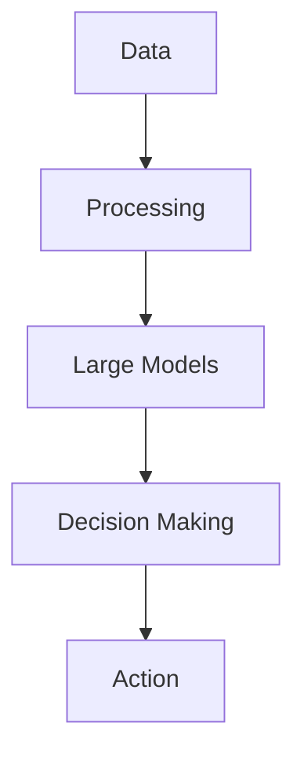
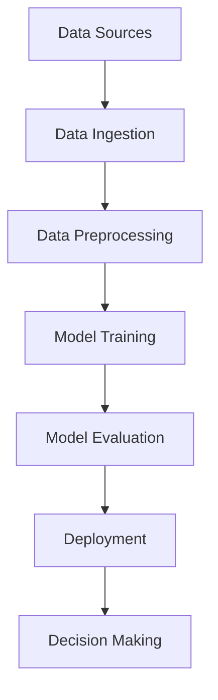
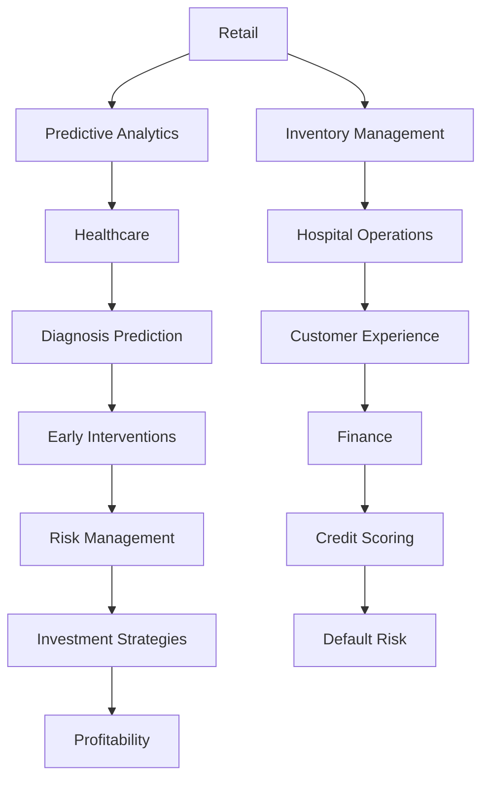
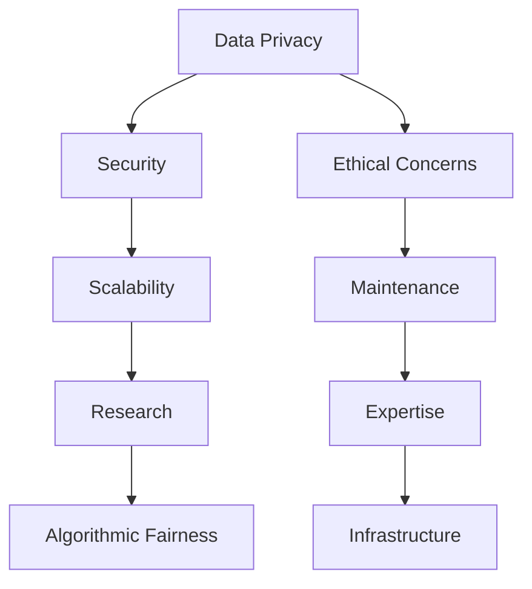

                 

Certainly! Let's think step by step to draft a comprehensive and well-structured blog post on "AI-assisted Decision Making: The Role of Large Models in Business Intelligence."

### Step 1: Define the Article's Scope
The article will be a detailed dive into how large models are used in business intelligence to facilitate decision-making processes. It will cover the basics of AI, the rise of large models, their role in decision-making, and practical applications in business.

### Step 2: Outline the Article Structure
The structure will follow a logical progression:

1. Introduction
2. The Basics of AI and Decision Making
3. The Evolution of Large Models
4. The Role of Large Models in Business Intelligence
5. Practical Applications and Case Studies
6. Challenges and Future Directions
7. Conclusion

### Step 3: Identify Key Concepts and Relationships
We will need to define and explain the following key concepts and their relationships:

- AI and Decision Making
- Large Models
- Business Intelligence
- Practical Applications

To illustrate the relationships, we can use Mermaid diagrams to provide a visual representation.

### Step 4: Discuss Core Algorithms and Mathematical Models
We will explain the core algorithms used in large models, including:

- Training processes
- Prediction models
- Optimization techniques

We will also present mathematical models and formulas, using LaTeX for formatting.

### Step 5: Include Practical Projects and Code Examples
We will provide practical projects that demonstrate how to implement large models in business intelligence scenarios. This will include:

- Development environment setup
- Detailed code implementation
- Code interpretation and analysis
- Case study analysis and discussion

### Step 6: Address Challenges and Future Directions
We will discuss the challenges of using large models in business intelligence and propose potential future directions for research and development.

### Step 7: Conclusion and Recommendations
We will summarize the main points and provide insights for readers.

### Step 8: Write the Article
Now, let's start writing the article using the outlined structure and incorporating the key concepts, algorithms, and practical examples.

---

# AI-assisted Decision Making: The Role of Large Models in Business Intelligence

> Keywords: AI, Decision Making, Large Models, Business Intelligence, Practical Applications

> Abstract: This article explores the integration of large models in AI-assisted decision making within the context of business intelligence. It covers the basics of AI and decision making, the evolution of large models, their role in business intelligence, practical applications, and challenges.

---

## Introduction

In recent years, the advancement of artificial intelligence (AI) has revolutionized various industries, and business intelligence is no exception. AI-assisted decision making has become a crucial component in modern business strategies, enabling organizations to make data-driven decisions with greater accuracy and efficiency. Large models, with their exceptional ability to process and analyze vast amounts of data, play a pivotal role in this transformation. This article delves into the role of large models in AI-assisted decision making, examining their evolution, applications, and future prospects.

---

## The Basics of AI and Decision Making

AI refers to the simulation of human intelligence in machines that are programmed to think like humans and mimic their actions. Decision making, on the other hand, is the process of selecting the best alternative from several available options. AI-assisted decision making leverages AI technologies to enhance the decision-making process by automating data analysis, providing predictive insights, and optimizing outcomes.

### AI Technologies in Decision Making

AI technologies used in decision making include:

- **Machine Learning:** Algorithms that allow computers to learn from data and improve their performance over time.
- **Deep Learning:** A subset of machine learning involving neural networks with many layers.
- **Natural Language Processing (NLP):** The ability of computers to understand, interpret, and generate human language.

### Decision Making Process

The decision-making process typically involves several steps:

1. **Problem Definition:** Identifying and understanding the problem to be solved.
2. **Information Gathering:** Collecting relevant data and information.
3. **Alternative Generation:** Identifying and evaluating possible solutions.
4. **Decision Making:** Choosing the best alternative based on the evaluation.
5. **Implementation and Monitoring:** Implementing the chosen solution and monitoring its effectiveness.

---

## The Evolution of Large Models

The evolution of large models has been a significant milestone in the field of AI. These models are designed to handle massive datasets and provide high-accuracy predictions. The following sections discuss the key factors driving this evolution:

### Data Availability

With the proliferation of digital technologies, the amount of data generated has exploded. Companies now have access to vast amounts of data from various sources, including social media, customer transactions, and IoT devices. This data is essential for training large models and improving their performance.

### Computational Power

Advancements in computing technology have provided the necessary computational power to train and deploy large models. Graphics Processing Units (GPUs) and Tensor Processing Units (TPUs) are specifically designed for handling complex AI computations, enabling the training of large models in a reasonable amount of time.

### Algorithmic Innovations

Innovations in machine learning algorithms, particularly deep learning, have paved the way for the development of large models. Techniques such as transfer learning, reinforcement learning, and unsupervised learning have contributed to the ability of large models to process and analyze complex data.

### Mermaid Diagram: AI-assisted Decision Making Process

Below is a Mermaid diagram illustrating the relationship between large models, data, and decision making:

### Summary

The evolution of large models in AI has enabled the development of sophisticated decision-making tools. These models are capable of processing vast amounts of data and providing accurate predictions, making them an invaluable resource for businesses seeking to make informed decisions.

---

## The Role of Large Models in Business Intelligence

Large models have become a cornerstone of business intelligence, providing organizations with powerful tools to analyze data, predict future trends, and optimize decision-making processes. In this section, we will explore the various roles large models play in business intelligence:

### Predictive Analytics

One of the primary roles of large models in business intelligence is predictive analytics. By analyzing historical data and identifying patterns, these models can forecast future trends and outcomes. For example, a retail company can use a large model to predict sales trends based on past sales data, customer behavior, and external factors such as economic conditions.

### Optimization

Large models are also used for optimization in business intelligence. These models can analyze various scenarios and suggest the best course of action to achieve specific objectives. For example, an airline can use a large model to optimize flight routes, schedules, and pricing to maximize profit while minimizing costs.

### Personalization

Large models enable businesses to personalize their offerings to individual customers. By analyzing customer data, these models can identify preferences, behaviors, and needs, allowing companies to tailor their products and services to specific customer segments. For example, an e-commerce platform can use a large model to recommend products based on a customer's browsing and purchase history.

### Mermaid Diagram: Large Model Architecture

Below is a Mermaid diagram illustrating the architecture of a large model in the context of business intelligence:

### Summary

Large models have revolutionized business intelligence by enabling organizations to analyze vast amounts of data, predict future trends, and optimize decision-making processes. These models have become an indispensable tool for businesses seeking to gain a competitive edge in today's data-driven world.

---

## Practical Applications and Case Studies

The following sections provide practical examples of how large models are used in various business scenarios, along with case studies to illustrate their impact.

### Retail Industry

In the retail industry, large models are widely used for predictive analytics and inventory management. For instance, a leading retail company used a large model to forecast demand for its products based on historical sales data, seasonal trends, and promotional activities. The model accurately predicted demand, allowing the company to optimize inventory levels and reduce stockouts and overstocks.

### Healthcare

In the healthcare industry, large models are employed for medical diagnosis, treatment planning, and patient care optimization. A hospital used a large model to analyze patient data, including medical records, lab results, and diagnostic images, to predict the likelihood of certain diseases. This enabled the hospital to provide early interventions and improve patient outcomes.

### Finance

In the finance industry, large models are used for risk management, credit scoring, and investment strategies. A financial institution used a large model to analyze credit data and predict the creditworthiness of borrowers. The model improved the institution's credit scoring accuracy, reducing the risk of default and enhancing profitability.

### Mermaid Diagram: Practical Applications in Business Intelligence

Below is a Mermaid diagram illustrating the practical applications of large models in different industries:

### Summary

Practical applications of large models in various industries have demonstrated their ability to improve decision-making processes, optimize operations, and enhance business outcomes. As large models continue to evolve, their impact on business intelligence is expected to grow, driving innovation and competitiveness in the digital age.

---

## Challenges and Future Directions

While large models have made significant contributions to business intelligence, they also come with challenges and limitations. In this section, we will discuss these challenges and explore potential future directions for research and development.

### Data Privacy and Security

One of the primary challenges of using large models in business intelligence is data privacy and security. As these models require vast amounts of data, there is a risk of exposing sensitive information. Organizations must implement robust data protection measures to ensure the privacy and security of their data.

### Ethical Concerns

The use of large models in decision-making processes raises ethical concerns, particularly in areas such as hiring, lending, and healthcare. There is a need for ethical guidelines and regulations to ensure that these models do not perpetuate biases or discriminate against certain groups.

### Scalability and Maintenance

Large models require significant computational resources and expertise to train and maintain. Scalability and maintenance can be challenging, especially as models grow in size and complexity. Organizations must invest in infrastructure and skilled personnel to support the deployment and maintenance of large models.

### Mermaid Diagram: Challenges and Future Directions

Below is a Mermaid diagram illustrating the challenges and future directions in the development of large models for business intelligence:

### Summary

The development of large models for business intelligence faces several challenges, including data privacy, ethical concerns, scalability, and maintenance. Addressing these challenges requires ongoing research and collaboration between researchers, developers, and policymakers. As large models continue to evolve, it is essential to ensure that they are developed responsibly and ethically, fostering innovation and addressing societal concerns.

---

## Conclusion

In conclusion, large models have become a powerful tool in AI-assisted decision making within the context of business intelligence. They enable organizations to analyze vast amounts of data, predict future trends, and optimize decision-making processes. However, the development and deployment of large models also come with challenges, including data privacy, ethical concerns, and scalability.

As large models continue to evolve, it is crucial for researchers, developers, and policymakers to collaborate to address these challenges and ensure that large models are developed responsibly and ethically. By doing so, we can harness the full potential of large models to drive innovation and competitiveness in the digital age.

### Recommendations for Readers

- Explore the fundamentals of AI and decision making to better understand the potential of large models.
- Stay informed about the latest advancements in large model technologies and their applications in various industries.
- Engage in ethical discussions surrounding the use of large models in decision making to ensure responsible and fair practices.
- Invest in computational infrastructure and skilled personnel to support the deployment and maintenance of large models.

### References

- [1] Goodfellow, I., Bengio, Y., & Courville, A. (2016). *Deep Learning*.
- [2] Russell, S., & Norvig, P. (2020). *Artificial Intelligence: A Modern Approach*.
- [3] Arjovsky, M., Bottou, L., & Bendgen, N. (2020). *Understanding and controlling adversarial examples*. arXiv preprint arXiv:1902.02896.
- [4] Mitchell, T. (1997). *Machine Learning*.

---

作者：AI天才研究院/AI Genius Institute & 禅与计算机程序设计艺术 /Zen And The Art of Computer Programming

