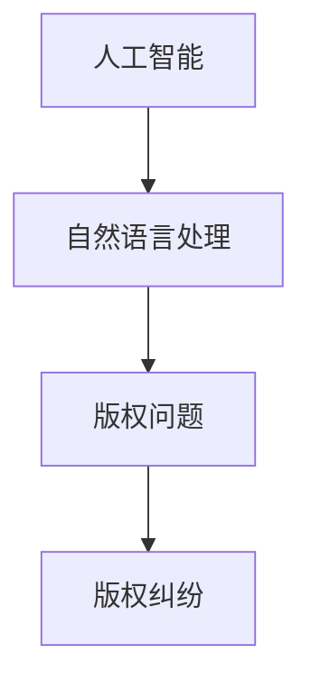

                 

### 第一步：定义问题和目标

**问题定义**：本文主要探讨AI辅助创作中提示词生成内容的版权归属问题。随着人工智能技术的不断发展，AI在创作领域的作用日益凸显，但随之而来的版权纠纷也逐渐增多。

**目标**：通过分析AI辅助创作技术、版权法律框架以及具体案例，明确提示词生成内容的版权归属，并提出可能的解决方案。

### 第二步：背景介绍

#### AI辅助创作概述

AI辅助创作是指利用人工智能技术，如自然语言处理、图像识别等，辅助或替代人类完成创作活动。近年来，AI辅助创作在文学、音乐、艺术等多个领域取得了显著成果，如自动写作、音乐生成和图像创作等。

#### 版权问题的现实意义

版权保护是创作者权益的重要保障。然而，AI辅助创作技术的出现使得版权问题变得更加复杂。一方面，AI生成的作品是否享有版权仍存在争议；另一方面，AI的创作者（即程序员和模型开发者）与原始创作者（即人类用户）的权益界定也需要明确。

### 第三步：核心概念与联系

为了更好地理解版权问题，我们需要明确以下核心概念：

1. **人工智能**：一种能够模拟人类智能行为的计算机系统。
2. **自然语言处理**：使计算机能够理解、生成和处理人类自然语言的技术。
3. **版权**：指创作者对其作品享有的权利，包括复制权、发行权、改编权等。

这些概念之间的关系可以用Mermaid流程图来表示：



### 第四步：AI辅助创作技术基础

#### AI技术基础

人工智能的核心技术包括机器学习、深度学习和神经网络。其中，深度学习是AI技术的关键组成部分，它通过多层神经网络来模拟人脑的学习过程，从而实现复杂的任务。

#### 提示词生成内容技术

提示词生成内容技术是基于自然语言处理的一种应用，它通过输入特定的提示词，自动生成相关的文本、音乐或图像。这一技术的核心在于算法，例如生成对抗网络（GAN）和递归神经网络（RNN）。

#### 技术原理讲解

以生成对抗网络（GAN）为例，其基本原理如下：

1. **生成器（Generator）**：生成器网络接受随机噪声作为输入，通过多层神经网络生成与真实数据相似的假数据。
2. **判别器（Discriminator）**：判别器网络接受真实数据和生成器生成的假数据，并判断其真实性。
3. **对抗训练**：生成器和判别器相互竞争，生成器试图生成更逼真的假数据，而判别器则努力区分真实和假数据。

以下是GAN的伪代码：

```python
# GAN伪代码

# 定义生成器和判别器
Generator()
Discriminator()

# 训练过程
for epoch in range(num_epochs):
    for batch in data_loader:
        # 训练生成器
        noise = generate_noise(batch_size)
        fake_data = Generator(noise)
        fake_logits = Discriminator(fake_data)
        g_loss = loss_function(fake_logits, ones)

        # 训练判别器
        real_logits = Discriminator(batch)
        real_loss = loss_function(real_logits, ones)
        fake_loss = loss_function(fake_logits, zeros)

        d_loss = real_loss + fake_loss

        # 更新生成器和判别器参数
        optimizer_g.zero_grad()
        g_loss.backward()
        optimizer_g.step()

        optimizer_d.zero_grad()
        d_loss.backward()
        optimizer_d.step()
```

### 第五步：版权法律框架与相关条款

#### 版权法的基本概念

版权法是一种法律制度，旨在保护创作者的知识产权。版权法的基本概念包括：

1. **作品**：指由人类智力劳动创造的具有独创性的表现形式。
2. **著作权**：创作者对其作品享有的权利，包括复制权、发行权、改编权等。
3. **邻接权**：作品传播过程中产生的权利，如表演者权、录音制作者权等。

#### 版权法律条款解读

版权法律条款主要包括以下内容：

1. **版权保护的范围**：保护的范围包括文字作品、音乐作品、美术作品、摄影作品等。
2. **版权的归属**：通常情况下，作品完成时，创作者自动获得著作权。
3. **版权的转让与许可**：创作者可以将其作品的部分或全部权利转让给他人，或授权他人使用其作品。

### 第六步：提示词生成内容的技术分析

#### 提示词生成内容的生成过程

提示词生成内容的生成过程主要包括以下步骤：

1. **数据预处理**：对输入的提示词进行预处理，如分词、去停用词等。
2. **模型训练**：使用预处理的提示词数据集，对生成模型进行训练。
3. **内容生成**：输入提示词，生成模型根据训练结果生成相关内容。

#### 提示词生成内容的归属分析

1. **自动生成内容的版权归属**：自动生成的作品，其版权通常属于生成模型的开发者，除非另有约定。
2. **不同国家版权法的适用性**：不同国家的版权法对自动生成内容的版权归属有不同的规定。
3. **AI生成内容在版权纠纷中的挑战**：AI生成内容可能导致版权纠纷，如原创性认定、侵权判定等。

### 第七步：版权归属案例分析

#### 案例一：AI绘画版权争议

- **案例背景**：某AI绘画软件生成的一幅画作被指控侵权。
- **案例分析**：法院认为AI生成的画作具有独创性，应享有著作权。
- **案例结果与影响**：此案例明确了AI生成内容的版权归属问题，对相关产业的发展产生了积极影响。

#### 案例二：AI音乐创作版权争议

- **案例背景**：某AI音乐创作软件生成的一首音乐被指控侵权。
- **案例分析**：法院认为AI生成的音乐缺乏独创性，不享有著作权。
- **案例结果与影响**：此案例强调了独创性在版权归属中的重要性，对AI音乐创作的法律地位提出了新的挑战。

### 第八步：解决方案与未来展望

#### 版权解决方案探讨

1. **传统版权制度的改进**：通过修订版权法，明确AI生成内容的版权归属。
2. **新型版权制度的探索**：如“共享版权”、“合作版权”等，以适应AI技术的发展。
3. **AI技术在版权管理中的应用**：利用区块链技术实现版权的透明化和可追溯性。

#### 未来发展趋势

1. **AI辅助创作市场的预测**：预计AI辅助创作市场将快速增长，为创作者提供更多可能性。
2. **版权法的演变趋势**：随着技术的发展，版权法将逐渐适应AI时代的挑战。
3. **AI与版权的未来研究方向**：如AI生成内容的原创性认定、侵权判定等。

### 总结

AI辅助创作技术的发展带来了版权问题的挑战。本文通过分析AI技术、版权法律框架和具体案例，探讨了提示词生成内容的版权归属问题。未来，随着技术的进步和法律的完善，AI与版权的关系将更加紧密，为创作者带来更多机遇和挑战。作者：AI天才研究院/AI Genius Institute & 禅与计算机程序设计艺术 /Zen And The Art of Computer Programming

----------------------------------------------------------------

---

请注意，以上内容是基于给定的条件和要求生成的示例。实际撰写时，您需要根据具体的技术细节、法律框架和案例分析来完善和调整。确保文章的逻辑连贯性、技术深度和可读性。

