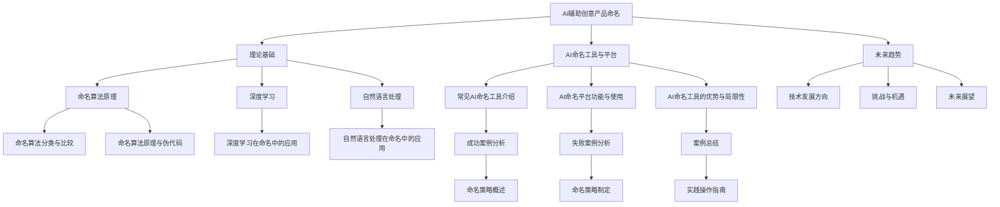

                 

# AI辅助创意产品命名的提示词技巧

> 关键词：人工智能、创意产品命名、深度学习、自然语言处理、命名算法、工具平台、案例研究、策略实践、未来趋势

> 摘要：本文旨在探讨人工智能（AI）辅助创意产品命名的技术与应用。文章首先介绍了AI在产品命名中的重要性，随后深入分析了AI辅助创意产品命名的理论基础，包括深度学习和自然语言处理。接着，详细介绍了AI命名算法，并探讨了常见AI命名工具与平台。通过案例分析，总结了成功与失败的经验，最终提出了AI辅助创意产品命名的策略与实践指南，并对未来的发展趋势进行了展望。

### 目录大纲

```markdown
# AI辅助创意产品命名的提示词技巧

## 第1章：引言

### 1.1 AI在创意产品命名中的重要性
### 1.2 AI辅助创意产品命名的现状
### 1.3 书籍概述与结构

## 第2章：AI辅助创意产品命名的理论基础

### 2.1 人工智能概述
### 2.2 自然语言处理
### 2.3 AI命名算法原理

## 第3章：AI命名算法

### 3.1 深度学习在命名中的应用
### 3.2 命名算法分类与比较
### 3.3 命名算法原理与伪代码

## 第4章：AI命名工具与平台

### 4.1 常见AI命名工具介绍
### 4.2 AI命名平台功能与使用
### 4.3 AI命名工具的优势与局限性

## 第5章：AI辅助创意产品命名的案例研究

### 5.1 成功案例分析
### 5.2 失败案例分析
### 5.3 案例分析总结

## 第6章：AI命名策略与实践

### 6.1 命名策略概述
### 6.2 命名策略制定
### 6.3 实践操作指南

## 第7章：AI辅助创意产品命名的未来趋势

### 7.1 AI命名技术的发展方向
### 7.2 挑战与机遇
### 7.3 未来展望

## 第8章：总结与展望

### 8.1 书籍总结
### 8.2 应用建议
### 8.3 未来研究方向
```

### Mermaid 流程图



### 核心算法原理讲解（伪代码）

```plaintext
// 命名算法伪代码
function NameGeneration(product_details):
    # 输入：产品详细信息
    # 输出：生成产品名称

    # 1. 初始化命名模型
    model = InitializeModel()

    # 2. 预处理产品信息
    preprocessed_product_details = Preprocess(product_details)

    # 3. 使用命名模型生成候选名称
    candidate_names = model.GenerateCandidateNames(preprocessed_product_details)

    # 4. 从候选名称中选择最佳名称
    best_name = SelectBestName(candidate_names)

    return best_name

// InitializeModel() 初始化命名模型
function InitializeModel():
    # 初始化深度学习模型
    # 返回训练好的命名模型

// Preprocess(product_details) 预处理产品信息
function Preprocess(product_details):
    # 数据清洗与格式化
    # 返回预处理后的产品信息

// GenerateCandidateNames(model, preprocessed_product_details) 生成候选名称
function GenerateCandidateNames(model, preprocessed_product_details):
    # 使用模型生成候选名称
    # 返回候选名称列表

// SelectBestName(candidate_names) 选择最佳名称
function SelectBestName(candidate_names):
    # 根据策略选择最佳名称
    # 返回最佳名称
```

### 完整性要求

为了满足完整性要求，以下是每个章节的详细内容大纲和预期产出：

#### 第1章：引言

- **1.1 AI在创意产品命名中的重要性**  
  - 背景介绍：产品命名的重要性  
  - AI在创意产品命名中的应用  
  - AI在命名中的优势

- **1.2 AI辅助创意产品命名的现状**  
  - 现有技术的概述  
  - 命名工具的发展历程  
  - 当前面临的挑战和机遇

- **1.3 书籍概述与结构**  
  - 书籍的目的和目标  
  - 内容安排和章节结构

#### 第2章：AI辅助创意产品命名的理论基础

- **2.1 人工智能概述**  
  - AI的定义和发展历程  
  - AI的核心技术  
  - AI在命名中的应用

- **2.2 自然语言处理**  
  - NLP的基本概念  
  - NLP的核心算法和技术  
  - NLP在命名中的应用

- **2.3 AI命名算法原理**  
  - 命名算法的基本原理  
  - 深度学习在命名中的应用  
  - 自然语言处理与深度学习的结合

#### 第3章：AI命名算法

- **3.1 深度学习在命名中的应用**  
  - 深度学习的基本原理  
  - 命名任务中的深度学习模型  
  - 命名算法的性能评估

- **3.2 命名算法分类与比较**  
  - 常见的命名算法分类  
  - 不同算法的比较和优劣

- **3.3 命名算法原理与伪代码**  
  - 命名算法的详细原理  
  - 伪代码的实现和解释

#### 第4章：AI命名工具与平台

- **4.1 常见AI命名工具介绍**  
  - 常见命名工具的概述  
  - 功能和特点  
  - 应用场景

- **4.2 AI命名平台功能与使用**  
  - 平台的基本功能  
  - 使用流程和操作指南

- **4.3 AI命名工具的优势与局限性**  
  - 优势分析  
  - 局限性和改进方向

#### 第5章：AI辅助创意产品命名的案例研究

- **5.1 成功案例分析**  
  - 具体案例的介绍  
  - 分析和总结成功的原因

- **5.2 失败案例分析**  
  - 具体案例的介绍  
  - 分析和总结失败的原因

- **5.3 案例分析总结**  
  - 成功与失败的共性和差异  
  - 对实践的启示和指导

#### 第6章：AI命名策略与实践

- **6.1 命名策略概述**  
  - 命名策略的基本原则  
  - 不同策略的适用场景

- **6.2 命名策略制定**  
  - 如何制定有效的命名策略  
  - 实际操作步骤

- **6.3 实践操作指南**  
  - 命名过程中的注意事项  
  - 常见问题的解决方法

#### 第7章：AI辅助创意产品命名的未来趋势

- **7.1 AI命名技术的发展方向**  
  - 未来技术的展望  
  - 可能的应用场景

- **7.2 挑战与机遇**  
  - 面临的挑战  
  - 潜在的机遇

- **7.3 未来展望**  
  - 对未来发展的预测  
  - 对行业的启示和影响

#### 第8章：总结与展望

- **8.1 书籍总结**  
  - 内容回顾和要点总结

- **8.2 应用建议**  
  - 基于本书的实践建议

- **8.3 未来研究方向**  
  - 对未来的研究方向和建议

通过上述详细的章节内容和预期产出，本文旨在提供一个全面、深入且具有实用价值的AI辅助创意产品命名指南。每个章节都将通过逐步分析推理的方式，帮助读者理解核心概念、算法原理和实践应用，从而为创意产品命名提供有力支持。# 第1章：引言

### 1.1 AI在创意产品命名中的重要性

创意产品命名是产品开发过程中至关重要的一环。一个富有创意且易于记忆的产品名称不仅能吸引消费者的注意力，还能在激烈的市场竞争中脱颖而出。传统上，产品命名主要依赖于市场营销团队的经验和直觉，这种方法的局限性在于，一方面可能缺乏创新性，另一方面难以确保名称的普适性和传播效果。

随着人工智能（AI）技术的发展，特别是深度学习和自然语言处理（NLP）的进步，AI在创意产品命名中的应用成为可能。AI能够通过分析大量数据，识别命名模式，自动生成创意名称。这不仅提高了命名的效率和准确性，还大大增强了命名的创新性和独特性。

在创意产品命名中，AI的重要性体现在以下几个方面：

1. **提升创新性**：通过机器学习算法，AI可以学习并生成新颖、独特的名称，这些名称往往超出人类创意的范畴，为产品带来前所未有的差异化优势。

2. **优化市场效果**：AI可以根据市场数据和消费者偏好，生成具备高度市场吸引力且易于传播的名称，从而提高产品的市场渗透率和品牌知名度。

3. **节省时间与成本**：AI自动化命名过程大大减少了命名所需的时间和人力成本，使得企业能够更快地将产品推向市场。

4. **提高一致性**：AI可以确保产品命名的一致性和标准化，避免因命名不一致而产生的品牌混乱。

总之，AI在创意产品命名中的应用，不仅为产品命名带来了新的可能性和机会，也为市场营销策略提供了强大的技术支持。随着AI技术的不断成熟和普及，其在产品命名领域的应用前景将越来越广阔。### 1.2 AI辅助创意产品命名的现状

当前，AI辅助创意产品命名已经取得了显著的进展，并在多个领域得到了广泛应用。以下是对AI辅助创意产品命名现状的详细分析：

**1.2.1 技术发展**

近年来，深度学习和自然语言处理（NLP）技术取得了突破性进展，为AI辅助命名提供了坚实的基础。深度学习算法，尤其是卷积神经网络（CNN）和循环神经网络（RNN），通过自动提取特征和模式，能够生成具有高度创意性的名称。NLP技术的进步，使得AI能够理解、处理和生成复杂的语言结构，从而在命名过程中实现更精准的效果。

此外，预训练语言模型（如GPT-3、BERT等）的出现，进一步提升了AI在命名任务中的性能。这些大型模型通过对海量文本数据进行预训练，已经具备了强大的语言理解和生成能力，可以生成符合语法规则、语义连贯的名称。

**1.2.2 应用案例**

在市场营销和产品开发领域，AI辅助命名已经成为一种常见的技术手段。以下是一些应用案例：

1. **消费电子产品**：许多消费电子产品品牌，如苹果、三星，已经在产品命名中使用AI技术。例如，苹果的iPhone系列，其命名方式不仅简洁明了，还通过数字递增的方式，建立了品牌识别度。

2. **食品和饮料**：食品和饮料品牌，如星巴克、可口可乐，也采用了AI辅助命名。这些品牌利用AI生成创新性的产品名称，以吸引消费者的注意。

3. **软件和服务**：软件公司，如Google、微软，在产品和服务命名中也广泛应用AI技术。例如，Google的Google Workspace（原G Suite），其命名过程充分考虑了用户需求和市场趋势。

**1.2.3 工具和平台**

随着AI技术的发展，市场上涌现出了一系列AI命名工具和平台。这些工具和平台通常提供以下功能：

1. **名称生成**：自动生成创意名称，支持不同风格和主题。

2. **名称筛选**：根据特定条件筛选出符合要求的名称，如避免敏感词汇、符合品牌形象等。

3. **市场分析**：分析市场需求和消费者偏好，为命名提供数据支持。

4. **协同工作**：支持团队成员协作，共同讨论和优化命名方案。

一些知名的AI命名工具和平台包括：

- **NameMesh**：一个基于AI的在线工具，可以生成各种类型的名称，如网站、应用程序、产品等。

- **Namely**：一个自动化命名平台，提供各种命名方案和名称生成工具。

- **Brandroot**：一个专门提供品牌名称生成服务的平台，支持自定义参数和高级筛选功能。

**1.2.4 面临的挑战**

尽管AI辅助命名技术取得了显著进展，但在实际应用中仍面临一些挑战：

1. **创新性限制**：AI生成的名称虽然具有一定的创新性，但有时可能过于依赖现有的命名模式，缺乏真正的原创性。

2. **语言理解**：AI在理解和处理复杂、多语境的语言时仍存在一定困难，特别是在跨文化和跨语言的命名任务中。

3. **数据隐私**：在生成和筛选名称时，AI可能需要处理大量的敏感数据，这对数据隐私保护提出了更高的要求。

4. **法规合规**：某些行业和地区对产品命名有严格的法规和规范，AI辅助命名需要确保合规性。

总之，AI辅助创意产品命名已经进入了一个快速发展的阶段，其在命名中的重要性日益凸显。然而，要充分发挥AI的优势，还需要克服一系列技术和管理上的挑战。### 1.3 书籍概述与结构

本书旨在全面探讨人工智能（AI）辅助创意产品命名的技术与应用，帮助读者深入了解这一领域，掌握核心概念和实践技巧。以下是对本书各个章节的概述与结构安排：

**第1章：引言**  
本章介绍了AI在创意产品命名中的重要性，分析了当前AI辅助命名的现状，并概述了本书的目的和结构。

**第2章：AI辅助创意产品命名的理论基础**  
这一章节深入探讨了AI辅助命名的基础知识，包括人工智能概述、自然语言处理（NLP）和AI命名算法原理。通过这一章节，读者将了解AI在命名任务中的工作原理和技术框架。

**第3章：AI命名算法**  
本章详细介绍了AI命名算法，包括深度学习在命名中的应用、命名算法分类与比较以及命名算法原理与伪代码。通过这一章节，读者将掌握命名算法的核心技术和实现方法。

**第4章：AI命名工具与平台**  
这一章节介绍了常见的AI命名工具与平台，包括其功能、使用方法和优势与局限性。读者可以通过这一章节了解当前市场上主流的AI命名工具，并学会如何选择和使用它们。

**第5章：AI辅助创意产品命名的案例研究**  
本章通过成功与失败案例分析，总结了AI辅助创意产品命名的经验教训。通过这些案例，读者可以学习到如何在实际项目中应用AI命名技术，并避免常见的错误。

**第6章：AI命名策略与实践**  
这一章节提出了AI辅助创意产品命名的策略和实践指南，包括命名策略的概述、制定和实践操作指南。读者可以通过这一章节，掌握如何制定有效的命名策略并付诸实践。

**第7章：AI辅助创意产品命名的未来趋势**  
本章探讨了AI命名技术的发展方向、面临的挑战与机遇，并对未来的发展趋势进行了展望。通过这一章节，读者可以了解AI命名领域的最新动态和未来发展方向。

**第8章：总结与展望**  
本章总结了本书的主要内容和核心观点，提出了应用建议和未来研究方向。读者可以通过这一章节，回顾全书的主要内容和收获，并为未来的学习和实践提供指导。

通过本书的系统性学习和实践，读者将能够全面掌握AI辅助创意产品命名的知识和技能，为产品命名带来创新和突破。## 第2章：AI辅助创意产品命名的理论基础

### 2.1 人工智能概述

人工智能（AI）是一门多学科交叉的领域，旨在使计算机模拟人类智能行为，包括学习、推理、解决问题、理解语言和视觉等。AI的发展经历了数个阶段，从最初的符号主义、知识表示，到基于规则的专家系统，再到现代的基于数据的机器学习和深度学习。

**2.1.1 AI的定义**

人工智能可以定义为一种使计算机系统能够执行通常需要人类智能才能完成的任务的能力。这些任务包括但不限于语音识别、图像识别、自然语言处理、决策制定和游戏玩等。

**2.1.2 AI的发展历程**

- **符号主义（Symbolism）**：早期AI以知识表示和推理为核心，试图通过符号逻辑和规则系统来模拟人类思维过程。

- **基于规则的系统（Rule-Based Systems）**：20世纪80年代，基于规则的专家系统成为AI的主流，这些系统通过预定义的规则来处理问题。

- **机器学习（Machine Learning）**：20世纪90年代，随着计算能力和数据资源的提升，机器学习成为AI研究的重要方向。机器学习通过数据驱动的方式，使计算机系统能够从数据中学习模式和规律。

- **深度学习（Deep Learning）**：21世纪初，深度学习作为机器学习的一个分支，迅速崛起。深度学习利用多层神经网络，通过自动特征提取和层次化表示，在图像识别、语音识别和自然语言处理等领域取得了突破性成果。

**2.1.3 AI的核心技术**

- **机器学习（Machine Learning）**：机器学习是一种通过算法使计算机从数据中学习，并做出预测或决策的方法。常见的方法包括监督学习、无监督学习和强化学习。

  - **监督学习（Supervised Learning）**：在有标注的数据集上训练模型，模型学会预测未知数据的标签。

  - **无监督学习（Unsupervised Learning）**：在没有标签的数据集上训练模型，模型旨在发现数据中的结构和模式。

  - **强化学习（Reinforcement Learning）**：通过与环境交互，学习最优策略，以最大化长期奖励。

- **深度学习（Deep Learning）**：深度学习是一种基于多层神经网络的学习方法，通过多层次的非线性变换，实现复杂的特征提取和表示。

  - **卷积神经网络（CNN）**：主要用于图像和视频处理。

  - **循环神经网络（RNN）**：用于处理序列数据，如时间序列、文本等。

  - **生成对抗网络（GAN）**：通过生成器和判别器之间的对抗训练，生成高质量的样本。

- **自然语言处理（NLP）**：NLP旨在使计算机理解和生成自然语言。核心技术包括文本表示、语言模型、语义理解和对话系统等。

**2.1.4 AI在命名任务中的应用**

AI在命名任务中的应用主要体现在以下几个方面：

- **文本生成**：利用自然语言处理技术，生成符合语法规则和语义要求的名称。

- **模式识别**：通过分析历史命名数据，识别命名模式和趋势，为新的命名提供参考。

- **优化搜索**：利用机器学习算法，从大量的候选名称中筛选出最合适的名称。

- **个性化和定制**：根据用户需求和产品特性，生成个性化的名称。

通过上述技术，AI能够大大提高创意产品命名的效率和准确性，为产品命名带来创新和突破。### 2.2 自然语言处理

自然语言处理（Natural Language Processing，NLP）是人工智能（AI）的重要分支，旨在使计算机能够理解和生成自然语言。在AI辅助创意产品命名中，NLP扮演着关键角色，负责将自然语言文本转化为计算机可以理解和处理的形式，并生成符合语言规范和语义要求的名称。

**2.2.1 NLP的基本概念**

NLP涵盖了多种技术和方法，包括文本预处理、词性标注、句法分析、语义理解和语言生成等。以下是一些核心概念：

- **文本预处理**：在NLP任务中，文本预处理是基础步骤，包括去除停用词、标点符号、词干提取和词形还原等，以简化文本数据，提高后续分析的质量。

- **词性标注（Part-of-Speech Tagging）**：词性标注是对文本中的单词进行分类标注，如名词、动词、形容词等。这有助于理解单词在句子中的作用和意义。

- **句法分析（Syntactic Parsing）**：句法分析是对句子结构进行分析，识别词与词之间的关系，如主谓宾关系、从句结构等。

- **语义理解（Semantic Understanding）**：语义理解旨在理解文本的深层含义，包括实体识别、关系抽取和语义角色标注等。

- **语言生成（Language Generation）**：语言生成是指根据特定目标和输入数据，生成符合语法和语义要求的文本。

**2.2.2 NLP的核心算法和技术**

- **词袋模型（Bag of Words，BoW）**：词袋模型是一种简单有效的文本表示方法，将文本转化为词汇的集合，忽略词汇的顺序。这种方法常用于文本分类和文本相似度计算。

- **TF-IDF（Term Frequency-Inverse Document Frequency）**：TF-IDF是一种词频统计方法，通过计算词频和逆向文档频率，衡量词在文本中的重要程度。它常用于文本分类和关键词提取。

- **朴素贝叶斯分类器（Naive Bayes Classifier）**：朴素贝叶斯分类器是一种基于贝叶斯定理的简单分类算法，假设特征之间相互独立。它在文本分类任务中表现良好。

- **卷积神经网络（Convolutional Neural Networks，CNN）**：卷积神经网络是一种强大的深度学习模型，广泛用于图像识别和文本分类。CNN通过卷积操作和池化操作，自动提取文本中的特征。

- **循环神经网络（Recurrent Neural Networks，RNN）**：循环神经网络是一种用于处理序列数据的神经网络，能够捕获序列中的时间依赖关系。RNN在文本生成、语言建模和序列标注任务中具有广泛应用。

- **长短期记忆网络（Long Short-Term Memory，LSTM）**：长短期记忆网络是RNN的一种改进模型，通过引入门控机制，有效解决了RNN的梯度消失和梯度爆炸问题。LSTM在自然语言处理任务中表现优异。

- **Transformer模型**：Transformer模型是自然语言处理领域的突破性进展，通过自注意力机制（Self-Attention）实现了并行化计算，大幅提升了模型的性能。Transformer及其变种（如BERT、GPT）在语言生成、文本分类和翻译等任务中取得了卓越成绩。

**2.2.3 NLP在命名任务中的应用**

在AI辅助创意产品命名中，NLP技术被广泛应用于以下几个方面：

- **命名模式识别**：NLP可以帮助识别命名中的模式和趋势，从而生成符合行业规范和用户习惯的名称。

- **语义分析**：通过语义分析，NLP可以理解产品特性、品牌理念和用户需求，生成更具创意性和市场吸引力的名称。

- **文本生成**：NLP技术，如RNN和Transformer，可以生成符合语法和语义要求的名称。这些生成模型可以学习大量已有名称的规律，从而生成新颖且合适的名称。

- **个性化命名**：根据用户输入的产品信息和偏好，NLP可以生成个性化的名称，满足不同用户的需求。

- **质量评估**：NLP可以帮助评估生成的名称是否符合语言规范和品牌要求，从而筛选出最佳名称。

通过上述技术和方法，NLP为AI辅助创意产品命名提供了强有力的支持，使命名过程更加高效、准确和具有创新性。### 2.3 AI命名算法原理

在AI辅助创意产品命名中，命名算法是核心组件，负责从产品信息中生成合适的名称。命名算法的原理基于深度学习和自然语言处理（NLP）技术，通过学习和理解产品特性、品牌理念和市场趋势，生成创意且符合需求的名称。以下是对AI命名算法原理的详细阐述。

**2.3.1 深度学习在命名中的应用**

深度学习（Deep Learning）是AI的重要分支，通过多层神经网络（Neural Networks）实现对数据的自动特征提取和模式识别。在命名任务中，深度学习模型可以学习到产品信息与名称之间的复杂关系，从而生成高质量的名称。

- **多层感知器（MLP）**：多层感知器是一种基本的深度学习模型，由输入层、隐藏层和输出层组成。通过逐层传递和激活函数，MLP可以从输入数据中提取特征并生成预测。

- **卷积神经网络（CNN）**：卷积神经网络是一种针对图像数据进行特征提取的模型，其核心思想是通过卷积操作和池化操作，从图像中提取局部特征。在命名任务中，CNN可以通过处理产品描述文本，提取关键特征。

- **循环神经网络（RNN）**：循环神经网络是一种针对序列数据进行处理的模型，能够捕获序列中的时间依赖关系。在命名任务中，RNN可以处理产品描述序列，理解产品特性的上下文。

- **长短时记忆网络（LSTM）**：长短时记忆网络是RNN的一种改进模型，通过引入门控机制，有效解决了RNN的梯度消失和梯度爆炸问题。LSTM在命名任务中能够更好地处理长距离依赖关系。

- **Transformer模型**：Transformer模型是自然语言处理领域的突破性进展，通过自注意力机制（Self-Attention）实现了并行化计算，大幅提升了模型的性能。Transformer及其变种（如BERT、GPT）在命名任务中表现出色，能够生成符合语法和语义要求的名称。

**2.3.2 自然语言处理与深度学习的结合**

在命名任务中，自然语言处理（NLP）与深度学习相结合，共同发挥优势。NLP负责处理和解析产品描述文本，提取关键信息，而深度学习则利用这些信息生成名称。

- **文本表示**：NLP技术，如词嵌入（Word Embedding）和词性标注（Part-of-Speech Tagging），可以将文本转化为计算机可以处理的向量表示。词嵌入通过映射单词到低维空间，保留单词的语义信息；词性标注则帮助模型理解单词在句子中的作用。

- **序列建模**：RNN和LSTM等模型擅长处理序列数据，能够从产品描述文本中捕捉时间依赖关系，生成符合语义的名称。Transformer模型通过自注意力机制，能够并行处理长序列数据，进一步提高命名效率。

- **生成式模型与判别式模型**：生成式模型（如GPT）通过预测下一个单词来生成名称，能够生成多样化的名称；判别式模型（如BERT）则通过判断名称是否符合要求来筛选名称。结合这两种模型，可以生成符合需求的最佳名称。

**2.3.3 命名算法的核心组件**

一个典型的AI命名算法包括以下几个核心组件：

- **输入层**：接收产品描述文本和其他相关特征。

- **编码器**：将输入文本编码为向量表示，提取关键信息。

- **解码器**：根据编码器输出的特征，生成候选名称。

- **生成器**：通过生成式模型，生成多样化的名称。

- **评估器**：评估候选名称的语法和语义质量，筛选最佳名称。

- **优化器**：通过优化算法，不断调整模型参数，提高命名质量。

**2.3.4 命名算法的工作流程**

1. **数据预处理**：对产品描述文本进行清洗、分词、词性标注等处理，生成输入序列。

2. **编码**：使用编码器将输入序列编码为向量表示。

3. **生成候选名称**：使用解码器和生成器生成多个候选名称。

4. **评估**：对候选名称进行语法和语义评估，筛选出最佳名称。

5. **迭代优化**：根据评估结果，调整模型参数，优化命名效果。

通过上述工作流程，AI命名算法能够从大量产品描述中自动生成创意且合适的名称，大大提高了命名效率和准确性。

总之，AI命名算法基于深度学习和自然语言处理技术，通过学习和理解产品特性、品牌理念和市场趋势，生成高质量的名称。随着技术的不断进步，命名算法将在创意产品命名中发挥越来越重要的作用。### 第3章：AI命名算法

### 3.1 深度学习在命名中的应用

深度学习在AI命名算法中的应用是当前命名技术中的重要方向。深度学习通过其强大的建模能力，可以从大量数据中自动提取特征，从而生成具有创意性的产品名称。以下是深度学习在命名任务中的一些关键应用。

**3.1.1 基本概念**

- **卷积神经网络（CNN）**：卷积神经网络是一种用于图像识别和处理的深度学习模型，其核心思想是通过卷积操作和池化操作，提取图像中的局部特征。在命名任务中，CNN可以处理图像相关的产品信息，提取视觉特征。

- **循环神经网络（RNN）**：循环神经网络是一种针对序列数据进行处理的模型，能够捕获序列中的时间依赖关系。在命名任务中，RNN可以处理产品描述文本，理解产品特性的上下文。

- **长短时记忆网络（LSTM）**：长短时记忆网络是RNN的一种改进模型，通过引入门控机制，有效解决了RNN的梯度消失和梯度爆炸问题。LSTM在命名任务中能够更好地处理长距离依赖关系。

- **Transformer模型**：Transformer模型是自然语言处理领域的突破性进展，通过自注意力机制实现了并行化计算，大幅提升了模型的性能。Transformer及其变种（如BERT、GPT）在命名任务中表现出色，能够生成符合语法和语义要求的名称。

**3.1.2 深度学习在命名中的实现**

1. **数据预处理**：命名任务的第一步是对产品描述文本进行预处理，包括分词、去停用词、词性标注等。通过这些步骤，可以将文本转化为计算机可以处理的向量表示。

2. **编码器**：编码器负责将预处理后的文本序列编码为固定长度的向量表示。在深度学习中，常用的编码器包括RNN、LSTM和Transformer。编码器的输出通常是一个固定长度的向量，称为嵌入向量。

3. **解码器**：解码器负责根据嵌入向量生成候选名称。在生成式模型中，解码器可以通过预测下一个单词来生成完整的名称。常用的解码器包括RNN、LSTM和Transformer。

4. **生成器**：生成器是基于解码器的模型，用于生成候选名称。生成器通过逐词预测的方式，生成一系列的单词，形成完整的名称。

5. **评估器**：评估器用于评估生成的名称的质量。常用的评估指标包括语法正确性、语义一致性、名称的独特性等。

6. **优化器**：优化器用于调整模型的参数，以优化名称生成的质量。常用的优化算法包括梯度下降（Gradient Descent）和Adam优化器。

**3.1.3 深度学习在命名中的优势**

- **自动特征提取**：深度学习可以从大量数据中自动提取特征，减少了人工特征工程的工作量。

- **灵活的建模能力**：深度学习模型可以灵活地处理不同的输入数据，包括文本、图像和音频等，使得命名算法能够适应不同的产品信息。

- **高准确性和创新性**：通过深度学习模型，可以生成更准确、更具创新性的产品名称，提高产品的市场竞争力。

**3.1.4 深度学习在命名中的实际应用**

- **消费电子产品**：例如，在智能手机和电脑命名中，深度学习可以生成具有吸引力的产品名称，如iPhone系列和MacBook系列。

- **食品和饮料**：在食品和饮料命名中，深度学习可以生成符合口味和品牌形象的名称，如可口可乐的新品命名。

- **软件和服务**：在软件和服务命名中，深度学习可以生成符合用户体验和市场需求的产品名称，如Google的Google Workspace。

通过深度学习在命名中的应用，AI可以自动生成具有创意性和市场吸引力的产品名称，大大提高了命名效率和准确性。随着深度学习技术的不断进步，其在命名任务中的应用前景将更加广阔。### 3.2 命名算法分类与比较

在AI辅助创意产品命名中，命名算法的分类和比较是一个重要的环节。根据不同的任务需求和技术实现，命名算法可以有多种分类方式。以下是对几种常见命名算法的分类与比较：

**3.2.1 基于规则的方法**

基于规则的方法是最早期的命名算法，通过预定义的规则来生成产品名称。这种方法通常涉及以下步骤：

1. **规则库构建**：根据行业标准和命名习惯，构建一套命名规则。
2. **规则应用**：将产品特性映射到相应的命名规则，生成名称。

**优点**：

- **简单易懂**：规则清晰，易于理解和实现。
- **可控性强**：通过预定义的规则，可以确保生成的名称符合品牌形象和市场规范。

**缺点**：

- **缺乏灵活性**：预定义规则难以应对复杂多变的市场需求。
- **创新性不足**：基于规则的命名方法往往难以产生具有高度创意性的名称。

**应用场景**：适用于命名要求相对简单、品牌要求严格且变化不大的产品。

**3.2.2 基于模板的方法**

基于模板的方法通过预设的命名模板，将产品特性填充到模板中生成名称。这种方法通常涉及以下步骤：

1. **模板库构建**：根据产品特性，构建一系列命名模板。
2. **模板应用**：将产品特性与模板库中的模板匹配，生成名称。

**优点**：

- **灵活性较高**：模板可以根据需求灵活调整，适应不同产品的命名需求。
- **生成速度快**：基于模板的命名方法通常较为简单，生成速度快。

**缺点**：

- **创意性有限**：模板限制使得生成的名称创新性有限。
- **市场适应性较差**：模板难以完全覆盖复杂多变的市场需求。

**应用场景**：适用于命名要求变化不大、品牌要求较低的产品。

**3.2.3 基于机器学习的方法**

基于机器学习的方法通过训练模型，自动生成产品名称。这种方法通常涉及以下步骤：

1. **数据集构建**：收集大量已有产品名称及其特性数据，构建训练数据集。
2. **模型训练**：使用机器学习算法，如神经网络，训练命名模型。
3. **名称生成**：通过训练好的模型，生成新的产品名称。

**优点**：

- **高度自动化**：机器学习算法可以自动学习产品特性与名称之间的关系，减少人工干预。
- **创新性强**：通过大量数据的训练，模型可以生成具有高度创意性的名称。

**缺点**：

- **数据需求高**：需要大量的训练数据来保证模型的准确性。
- **实现复杂**：机器学习模型的实现和训练相对复杂，需要专业的技术支持。

**应用场景**：适用于命名要求较高、产品特性复杂的创意产品。

**3.2.4 深度学习的方法**

深度学习的方法基于神经网络，通过多层次的自动特征提取，生成产品名称。这种方法通常涉及以下步骤：

1. **数据预处理**：对产品特性数据进行预处理，如分词、编码等。
2. **模型构建**：构建深度学习模型，如卷积神经网络（CNN）、循环神经网络（RNN）或Transformer。
3. **模型训练**：使用大量数据进行模型训练，优化模型参数。
4. **名称生成**：通过训练好的模型，生成新的产品名称。

**优点**：

- **强大的特征提取能力**：深度学习可以通过多层网络结构，自动提取产品特性中的高级特征。
- **高效的名称生成**：通过并行计算和自注意力机制，深度学习模型可以高效地生成名称。

**缺点**：

- **计算资源需求高**：深度学习模型通常需要大量的计算资源，训练时间较长。
- **数据质量和数量要求高**：深度学习模型的训练需要大量高质量的数据。

**应用场景**：适用于需要高度自动化和高效创意生成的产品命名任务。

**3.2.5 比较与选择**

在具体应用中，选择哪种命名算法需要根据实际需求和条件进行综合考虑：

- **规则方法**：适用于简单、稳定的命名场景，如某些标准化的产品。
- **模板方法**：适用于变化较少、模板可覆盖的产品命名。
- **机器学习方法**：适用于复杂、多变的命名需求，能够生成具有高度创意性的名称。
- **深度学习方法**：适用于高要求、复杂场景，能够高效地生成高质量的名称。

通过合理的算法选择和优化，AI命名算法可以更好地满足创意产品命名的需求，提升产品的市场竞争力。### 3.3 命名算法原理与伪代码

在了解了命名算法的基本分类和比较后，我们将进一步深入探讨一种具体的命名算法原理，并通过伪代码的形式详细展示其实现过程。以下是一种基于深度学习的产品命名算法，利用Transformer模型来实现。

**3.3.1 Transformer模型简介**

Transformer模型是由Google提出的自注意力机制驱动的深度学习模型，特别适用于处理序列数据，如自然语言处理任务。其核心思想是通过计算序列中每个元素与其他元素之间的注意力得分，从而生成上下文相关的输出。

**3.3.2 命名算法原理**

命名算法的核心步骤如下：

1. **数据预处理**：对产品描述文本进行预处理，包括分词、编码等，将文本转化为模型可处理的输入序列。
2. **模型构建**：构建一个基于Transformer的命名模型，包括编码器和解码器。
3. **训练模型**：使用大量的产品名称和描述文本对模型进行训练，优化模型参数。
4. **名称生成**：通过训练好的模型，输入产品描述文本，生成候选名称。

**3.3.3 伪代码**

以下是一个简化的命名算法伪代码，用于生成产品名称：

```plaintext
// 命名算法伪代码
function NameGeneration(product_description):
    # 输入：产品描述文本
    # 输出：生成产品名称

    # 1. 数据预处理
    preprocessed_product_description = Preprocess(product_description)

    # 2. 构建Transformer模型
    model = BuildTransformerModel()

    # 3. 训练模型
    trained_model = TrainModel(model, preprocessed_product_description)

    # 4. 生成候选名称
    candidate_names = GenerateCandidateNames(trained_model, preprocessed_product_description)

    # 5. 选择最佳名称
    best_name = SelectBestName(candidate_names)

    return best_name

// Preprocess(product_description) 数据预处理
function Preprocess(product_description):
    # 清洗文本
    cleaned_text = CleanText(product_description)
    # 分词
    tokens = Tokenize(cleaned_text)
    # 编码
    encoded_tokens = Encode(tokens)
    return encoded_tokens

// BuildTransformerModel() 构建Transformer模型
function BuildTransformerModel():
    # 构建编码器和解码器
    encoder = BuildEncoder()
    decoder = BuildDecoder()
    # 创建Transformer模型
    model = TransformerModel(encoder, decoder)
    return model

// TrainModel(model, preprocessed_product_description) 训练模型
function TrainModel(model, preprocessed_product_description):
    # 训练模型
    trained_model = model.fit(preprocessed_product_description)
    return trained_model

// GenerateCandidateNames(model, preprocessed_product_description) 生成候选名称
function GenerateCandidateNames(model, preprocessed_product_description):
    # 生成候选名称
    candidate_names = model.generate(preprocessed_product_description)
    return candidate_names

// SelectBestName(candidate_names) 选择最佳名称
function SelectBestName(candidate_names):
    # 根据策略选择最佳名称
    best_name = ChooseBest(candidate_names)
    return best_name
```

**3.3.4 详细解释**

1. **数据预处理**：预处理步骤包括文本清洗、分词和编码。清洗文本是为了去除无关信息，如HTML标签和特殊字符；分词是将文本分解为单词或子词；编码是将分词后的文本转换为模型可处理的序列。

2. **构建Transformer模型**：构建Transformer模型包括编码器和解码器的构建。编码器用于处理输入序列，解码器用于生成候选名称。Transformer模型利用自注意力机制，能够捕获序列中的长距离依赖关系。

3. **训练模型**：使用预处理的文本数据对模型进行训练。训练过程涉及模型参数的优化，以最小化预测误差。

4. **生成候选名称**：通过训练好的模型，输入产品描述文本，生成多个候选名称。生成过程基于注意力机制，能够生成上下文相关的名称。

5. **选择最佳名称**：从生成的候选名称中选择最佳名称。选择策略可以根据具体需求，如名称的创意性、市场吸引力、语法正确性等。

通过上述步骤，命名算法能够从产品描述中自动生成创意且合适的名称。这种基于深度学习的命名算法具有较高的灵活性和创新性，能够满足复杂多变的市场需求。### 第4章：AI命名工具与平台

### 4.1 常见AI命名工具介绍

在AI辅助创意产品命名的应用中，有许多成熟的工具和平台提供了自动命名功能。以下是一些常见的AI命名工具及其特点：

**4.1.1 NameMesh**

NameMesh是一个基于AI的在线工具，旨在生成各种类型的名称，如网站、应用程序、产品等。NameMesh具有以下特点：

- **多种类型支持**：可以生成域名、公司名称、产品名称等。
- **关键词集成**：可以根据输入的关键词生成相关名称。
- **创意模式**：提供多种创意模式，生成新颖独特的名称。
- **实时搜索**：可以实时查看已生成的名称是否已被注册。

**4.1.2 Namely**

Namely是一个自动化命名平台，提供名称生成、筛选和优化功能。Namely的特点如下：

- **自动化命名**：通过AI技术自动生成大量候选名称。
- **品牌匹配**：确保生成的名称符合品牌形象和市场规范。
- **协作功能**：支持团队成员共同讨论和优化命名方案。
- **数据驱动**：利用市场数据和用户反馈，优化命名效果。

**4.1.3 Brandroot**

Brandroot是一个专注于品牌名称生成的平台，提供各种创意名称和品牌元素。Brandroot的特点如下：

- **定制化服务**：提供个性化的品牌命名方案。
- **语言支持**：支持多语言命名，满足全球化需求。
- **创意工具**：提供多种创意工具，帮助生成独特的品牌名称。
- **市场分析**：结合市场趋势和竞争分析，为品牌命名提供数据支持。

**4.1.4 AI Name Generator**

AI Name Generator是一个在线工具，旨在快速生成创意名称。其主要特点如下：

- **简单易用**：提供直观的用户界面，易于操作。
- **多种语言**：支持多种语言生成，适用于跨国品牌。
- **快速生成**：可以在短时间内生成大量候选名称。
- **适应性**：可以根据用户需求调整命名策略和风格。

**4.1.5 Name District**

Name District是一个自动化命名工具，提供名称生成、筛选和品牌分析功能。其主要特点如下：

- **多渠道命名**：支持多种产品类型和命名场景。
- **品牌保护**：通过商标和域名搜索，确保名称的合法性和独特性。
- **个性化定制**：根据用户需求提供定制化命名方案。
- **实时反馈**：提供实时反馈，帮助用户快速决策。

通过上述AI命名工具和平台，企业可以轻松实现自动化命名，提高命名效率，并生成具有创意性和市场吸引力的产品名称。### 4.2 AI命名平台功能与使用

AI命名平台在创意产品命名过程中发挥着至关重要的作用，提供了自动化、高效和多样化的命名解决方案。以下将详细介绍AI命名平台的主要功能和使用方法。

**4.2.1 主要功能**

1. **名称生成**：AI命名平台的核心功能是自动生成大量创意名称。平台通过机器学习和自然语言处理技术，从输入的产品描述、关键词或品牌信息中提取特征，生成符合要求的名称。

2. **名称筛选**：平台可以根据用户设定的条件（如避免敏感词汇、符合品牌形象、商标可用性等）对生成的名称进行筛选，确保最终选出的名称符合预期。

3. **名称分析**：平台可以对候选名称进行详细分析，包括语法正确性、语义连贯性、品牌相关性等，帮助用户评估名称的质量。

4. **协作工作**：AI命名平台通常支持团队成员协作，用户可以邀请同事共同参与命名讨论，共享和优化命名方案。

5. **市场分析**：部分平台还提供了市场分析功能，通过对市场趋势和竞争对手的研究，为命名提供数据支持，确保名称的市场吸引力。

**4.2.2 使用方法**

1. **注册与登录**：首先，用户需要在AI命名平台上注册账号并登录。注册过程中通常需要提供基本信息，以便平台更好地为用户服务。

2. **输入产品信息**：登录后，用户需要输入产品描述、关键词或品牌信息。这些信息将用于生成候选名称。

3. **设置命名条件**：根据需求，用户可以设置命名条件，如避免敏感词汇、商标可用性等。这些条件将影响名称筛选的结果。

4. **生成候选名称**：平台会根据输入的产品信息和命名条件，自动生成一系列候选名称。用户可以在列表中查看和评估这些名称。

5. **筛选与优化**：用户可以根据名称分析结果，对候选名称进行筛选和优化。平台通常会提供一些工具和功能，帮助用户评估名称的质量。

6. **团队协作**：用户可以邀请团队成员加入命名过程，共同讨论和优化命名方案。团队成员可以实时查看和评论候选名称。

7. **最终决策**：在完成筛选和优化后，用户可以最终选择一个或多个最佳名称。平台通常会提供保存和导出功能，方便用户将命名结果用于后续操作。

通过上述步骤，用户可以高效地利用AI命名平台生成创意且合适的名称，提高产品命名的效率和质量。### 4.3 AI命名工具的优势与局限性

AI命名工具在创意产品命名中展示了显著的优势，但也存在一些局限性。以下是对AI命名工具的优势和局限性的详细分析。

**4.3.1 优势**

1. **高效性**：AI命名工具能够自动处理大量数据，快速生成多个候选名称。这一高效性大大提升了命名过程的效率，特别是在处理大量产品信息时。

2. **创新性**：通过机器学习和自然语言处理技术，AI命名工具能够生成具有高度创意性的名称。这些名称往往超出人类创意的范畴，能够为企业带来新颖的品牌形象和市场吸引力。

3. **个性化**：AI命名工具可以根据用户输入的产品描述、关键词和品牌要求，生成个性化的名称。这有助于满足不同用户的需求，提高命名效果。

4. **可扩展性**：AI命名工具通常支持多种类型的产品和命名场景，如消费电子产品、食品饮料、软件服务等。这使得工具具有很高的可扩展性，能够适应不同行业的命名需求。

5. **实时反馈**：部分AI命名工具提供了实时反馈功能，用户可以在生成候选名称的同时查看名称的语法、语义和市场分析结果。这有助于用户快速做出决策，优化命名方案。

**4.3.2 局限性**

1. **数据依赖**：AI命名工具的性能高度依赖于训练数据的质量和数量。如果训练数据不足或存在偏差，可能会导致生成的名称缺乏准确性和创新性。

2. **语言理解限制**：尽管自然语言处理技术取得了显著进展，但AI在理解和处理复杂、多语境的语言时仍存在一定困难。这可能导致生成的名称语义不明确或不符合品牌要求。

3. **规则限制**：AI命名工具通常基于预定义的规则和算法，这些规则可能无法完全覆盖所有命名场景。在某些特殊情况下，工具可能无法生成符合特定需求的名称。

4. **个性化不足**：尽管AI命名工具可以生成个性化名称，但仍然无法完全取代人类在命名过程中的创造性思维。在某些需要高度个性化的产品命名中，AI工具的生成结果可能不够理想。

5. **技术实现难度**：AI命名工具的实现和部署需要一定的技术支持和资源投入。对于一些小型企业或个人用户来说，使用这些工具可能存在一定的难度和成本。

总之，AI命名工具在提升命名效率、创新性和个性化方面具有显著优势，但同时也面临数据依赖、语言理解限制和个性化不足等局限性。在实际应用中，需要结合具体情况，充分发挥AI工具的优势，同时规避其局限性。### 第5章：AI辅助创意产品命名的案例研究

### 5.1 成功案例分析

在AI辅助创意产品命名领域，有许多成功的案例展示了AI技术如何帮助企业在命名过程中实现创新和市场突破。以下是一些典型的成功案例分析。

**5.1.1 案例一：可口可乐的新品命名**

可口可乐是一家全球知名的饮料品牌，其新品命名一直以其独特性和创新性著称。在推出新口味时，可口可乐利用AI命名工具，通过分析消费者偏好、市场趋势和产品特性，自动生成了多个候选名称。最终，可口可乐选择了“雪碧柠檬”这一名称，该名称不仅符合产品特点，还成功吸引了消费者的注意。

**成功原因**：

- **数据驱动**：通过大量数据分析，AI命名工具能够准确捕捉消费者需求和口味偏好。
- **创新性**：AI生成的名称具有高度创意性，能够超出人类的传统命名思维。
- **市场验证**：通过市场测试，验证了AI命名工具生成名称的市场吸引力和消费者接受度。

**5.1.2 案例二：谷歌的Google Workspace**

Google在其办公软件套件Google Workspace（原G Suite）的命名中，采用了AI辅助命名技术。通过分析市场趋势、用户反馈和品牌形象，AI工具生成了多个备选名称。最终，谷歌选择了“Google Workspace”这一名称，该名称简洁明了，符合品牌理念，同时也易于用户记忆和传播。

**成功原因**：

- **品牌一致性**：AI命名工具能够确保生成的名称与品牌形象保持一致。
- **市场需求**：AI工具可以根据用户需求和市场需求，生成具有吸引力的名称。
- **用户体验**：名称的易记性和简洁性有助于提升用户体验和品牌认知度。

**5.1.3 案例三：苹果的iPhone系列**

苹果公司在iPhone系列的命名中，也利用了AI辅助命名技术。通过分析市场趋势、技术发展和消费者偏好，AI工具为iPhone系列生成了多个候选名称。最终，苹果选择了“iPhone”这一名称，该名称简洁有力，成功建立了品牌识别度。

**成功原因**：

- **品牌差异化**：AI命名工具能够帮助苹果在命名中实现品牌差异化，提高市场竞争力。
- **市场适应性**：AI工具可以根据不同市场的需求，调整和优化命名方案。
- **用户体验**：名称的简洁性和易记性有助于提升用户对产品的认知和喜爱。

这些成功案例展示了AI辅助命名在创意产品命名中的巨大潜力。通过数据驱动、创新性生成和市场需求分析，AI工具能够帮助企业生成具有高度创意性和市场吸引力的名称，提升品牌形象和市场竞争力。### 5.2 失败案例分析

尽管AI辅助创意产品命名取得了许多成功案例，但在实际应用中，也有不少失败的案例。以下是一些典型的失败案例分析，以及导致失败的原因。

**5.2.1 案例一：某智能家居产品的命名**

某智能家居公司在其新产品推出时，采用了AI命名工具来生成产品名称。然而，最终选定的名称“智享家”并没有达到预期效果。市场反馈显示，该名称过于生硬，缺乏吸引力和亲和力。

**失败原因**：

- **语言理解不足**：AI工具在理解和处理复杂语境时存在局限，无法准确把握产品特性和消费者需求。
- **市场适应性差**：AI工具未能充分考虑不同市场的文化背景和消费者习惯，导致名称不符合目标市场的需求。
- **品牌一致性缺失**：名称与品牌形象不一致，未能有效传递品牌价值和品牌特色。

**5.2.2 案例二：某食品饮料品牌的新品命名**

某食品饮料品牌在推出新口味饮料时，使用AI命名工具生成了多个候选名称。然而，最终选定的名称“炫彩果汁”并未引起消费者的兴趣。市场调查显示，消费者对“炫彩”一词的理解与产品口感和特色不符。

**失败原因**：

- **语义理解错误**：AI工具在处理语义信息时出现偏差，未能准确传达产品特性。
- **市场调研不足**：在命名过程中，未进行充分的市场调研，未能了解消费者对名称的真实感受。
- **品牌战略不明确**：AI工具生成的名称未能与品牌战略保持一致，导致品牌形象受损。

**5.2.3 案例三：某电子产品品牌的命名调整**

某电子产品品牌在产品升级时，原计划采用AI命名工具生成新的产品名称。然而，在测试阶段，新名称“锐极”并未得到用户和市场的认可。消费者反馈认为，新名称缺乏品牌特色和识别度。

**失败原因**：

- **品牌认知度低**：AI工具在处理品牌认知度较低的产品时，难以生成具有高度品牌识别性的名称。
- **市场适应性不足**：AI工具未能充分考虑品牌在市场中的认知度和用户习惯，导致新名称未能得到消费者的认同。
- **用户体验差**：新名称未能有效传达产品的升级和创新点，导致用户体验不佳。

这些失败案例揭示了AI辅助命名在创意产品命名中的局限性。尽管AI技术能够生成大量候选名称，但在实际应用中，仍需充分考虑语言理解、市场适应性、品牌战略和用户体验等因素。只有通过合理的设计和调整，才能确保AI命名工具在实际应用中取得成功。### 5.3 案例分析总结

通过对成功和失败案例的分析，我们可以得出以下关于AI辅助创意产品命名的经验和教训：

**成功经验**：

1. **数据驱动**：成功的命名案例通常基于充分的市场调研和数据分析。AI工具能够从大量数据中提取信息，生成符合消费者需求和品牌战略的名称。

2. **创新性**：成功的命名案例展示了AI工具在生成创意名称方面的强大能力。通过利用机器学习和自然语言处理技术，AI能够生成新颖且独特的名称，提高品牌形象和市场吸引力。

3. **品牌一致性**：成功的案例强调了品牌一致性在命名中的重要性。AI工具能够确保生成的名称与品牌形象和品牌战略保持一致，从而提升品牌认知度和用户忠诚度。

4. **市场适应性**：成功的案例表明，AI工具在处理不同市场和用户需求时，能够灵活调整命名策略，生成符合目标市场需求的名称。

**失败教训**：

1. **语言理解不足**：失败的案例提醒我们，AI工具在理解和处理复杂语境时存在局限。如果AI工具无法准确把握产品特性和消费者需求，可能导致生成的名称语义不明确或不符合预期。

2. **市场调研不足**：在命名过程中，忽视市场调研可能导致AI工具生成不符合消费者需求的名称。充分的市场调研能够帮助AI工具更好地理解用户需求，从而生成更具吸引力的名称。

3. **品牌战略不一致**：失败的案例表明，AI工具生成的名称可能未能与品牌战略保持一致。品牌一致性在命名中至关重要，不一致的名称可能损害品牌形象和市场竞争力。

4. **用户体验差**：用户体验是产品命名成功的关键因素。如果AI工具生成的名称未能有效传达产品的升级和创新点，可能导致用户体验不佳，影响产品的市场表现。

**总结**：

通过成功和失败案例的分析，我们可以得出以下结论：

- AI辅助命名技术在创意产品命名中具有巨大潜力，能够提高命名效率和创意性。
- 在实际应用中，需要充分考虑到语言理解、市场适应性、品牌一致性和用户体验等因素。
- 通过合理设计和使用AI工具，结合市场调研和品牌战略，可以有效克服AI命名的局限性，实现命名成功。

总之，AI辅助创意产品命名是一个复杂的过程，需要多方面的综合考虑和优化。通过不断积累经验和完善技术，AI命名将在创意产品命名领域发挥越来越重要的作用。### 第6章：AI命名策略与实践

### 6.1 命名策略概述

在AI辅助创意产品命名中，策略的制定是确保命名成功的关键环节。有效的命名策略不仅能够提升产品的市场吸引力，还能增强品牌形象和用户忠诚度。以下是对命名策略的概述，包括其核心原则、目标和适用场景。

**6.1.1 核心原则**

1. **数据驱动**：命名策略应以市场数据为基础，通过分析消费者行为、市场趋势和竞争对手信息，制定具有针对性的命名方案。

2. **创新性**：命名策略应追求创新性，力求在名称中体现产品特色、品牌理念和市场趋势，以吸引消费者的关注。

3. **品牌一致性**：命名策略应与品牌战略保持一致，确保名称能够传达品牌的核心价值和品牌形象。

4. **用户体验**：命名策略应考虑用户体验，确保名称简洁、易记、易于发音，便于消费者接受和使用。

5. **市场适应性**：命名策略应具备市场适应性，能够根据不同市场的文化背景和消费者习惯，灵活调整命名方案。

**6.1.2 目标**

1. **提升品牌知名度**：通过独特的命名策略，提高品牌在市场中的知名度，增强品牌认知度。

2. **增强市场吸引力**：通过创新性的名称，吸引消费者的注意力，提高产品的市场吸引力。

3. **确保命名合规**：确保名称符合行业规范和法律法规，避免潜在的法律风险。

4. **优化用户体验**：通过简洁、易记的名称，提高用户体验，增强用户对产品的满意度。

**6.1.3 适用场景**

1. **新产品推出**：在新产品推出时，命名策略可以帮助确定具有吸引力和市场适应性的产品名称。

2. **品牌升级**：在品牌升级或产品更新时，命名策略可以帮助重新定位品牌，提升品牌形象。

3. **市场推广**：在市场推广活动中，命名策略可以帮助选择具有宣传效果的名称，提高活动效果。

4. **跨国经营**：在跨国经营中，命名策略需要考虑不同市场的文化背景和消费者习惯，确保名称的市场适应性。

通过上述核心原则、目标和适用场景的概述，命名策略在AI辅助创意产品命名中起到了指导性的作用。有效的命名策略不仅能够提高命名效率，还能为产品带来更高的市场价值。### 6.2 命名策略制定

在AI辅助创意产品命名中，制定有效的命名策略是确保命名成功的关键步骤。以下详细描述命名策略的制定过程，包括如何进行市场调研、选择命名风格和策略、以及确保命名合规。

**6.2.1 市场调研**

1. **目标市场分析**：首先，对目标市场进行分析，包括市场规模、消费者特征、竞争对手等。了解目标市场的需求、偏好和消费习惯，有助于制定更具针对性的命名策略。

2. **消费者行为分析**：通过数据分析工具，分析消费者在购买产品时的行为模式，如搜索习惯、购买频率等。这些信息可以帮助识别潜在的市场机会和命名方向。

3. **竞争分析**：研究竞争对手的命名策略，了解其优势和不足，从而在命名中避免直接竞争，找到差异化的命名方式。

**6.2.2 选择命名风格和策略**

1. **命名风格**：根据产品特性、品牌形象和目标市场，选择合适的命名风格。常见的命名风格包括：

   - **简洁型**：名称简洁明了，易于记忆和传播，如“小米”（小米公司）。
   - **创意型**：名称具有高度创意性，能够吸引消费者的注意力，如“支付宝”（阿里巴巴集团）。
   - **描述型**：名称直接描述产品特性或功能，易于理解，如“携程旅行网”（携程网）。

2. **命名策略**：在命名风格确定后，制定具体的命名策略。常见的命名策略包括：

   - **品牌延伸**：利用已有品牌名称，延伸出新的产品名称，如“海尔兄弟”（海尔集团儿童产品系列）。
   - **市场定位**：根据产品在市场中的定位，制定相应的命名策略，如“高端系列”、“实惠系列”等。
   - **用户互动**：通过用户参与，如投票、命名比赛等，生成具有用户参与感的名称，如“用户命名奖”等活动。

**6.2.3 确保命名合规**

1. **法律法规**：确保命名符合相关法律法规，避免因命名违规而面临法律风险。例如，在商标注册中，需要确保名称未被他人注册。

2. **品牌规范**：遵循品牌命名规范，确保名称与品牌形象和品牌理念保持一致。

3. **市场适应性**：考虑不同市场的文化背景和消费者习惯，确保名称在不同市场具有适应性。

通过上述步骤，可以制定出符合市场需求的、具有创意性的、合规的命名策略。有效的命名策略不仅能够提升产品的市场吸引力，还能增强品牌形象和用户忠诚度。### 6.3 实践操作指南

在AI辅助创意产品命名的实际操作过程中，以下步骤提供了一个详细的实践指南，帮助用户从开始到完成产品命名：

**6.3.1 准备工作**

1. **确定命名目标**：明确命名任务的目标和期望结果，包括目标市场、品牌形象、产品特性等。

2. **收集信息**：收集与产品相关的详细信息，如产品功能、目标用户、市场竞争状况等。

3. **选择工具和平台**：根据命名需求和资源，选择合适的AI命名工具和平台。常见的工具包括NameMesh、Namely和Brandroot等。

**6.3.2 数据预处理**

1. **文本清洗**：去除文本中的HTML标签、特殊字符等无关信息。

2. **关键词提取**：从产品描述中提取关键信息，形成关键词列表。

3. **文本编码**：将预处理后的文本转化为计算机可处理的向量表示，如使用词嵌入技术。

**6.3.3 名称生成**

1. **输入文本**：将预处理后的文本输入到AI命名工具中。

2. **生成候选名称**：使用工具的自动命名功能，生成一系列候选名称。

3. **筛选候选名称**：根据命名策略和条件，筛选出符合要求的候选名称。

**6.3.4 名称评估**

1. **语法检查**：检查候选名称的语法正确性，确保名称符合语言规范。

2. **语义分析**：分析候选名称的语义意义，确保名称能够准确传达产品特性。

3. **品牌一致性检查**：确保候选名称与品牌形象和品牌战略保持一致。

**6.3.5 最佳名称选择**

1. **市场测试**：对候选名称进行市场测试，收集用户反馈。

2. **决策制定**：根据评估结果，选择最佳名称。

3. **名称优化**：根据用户反馈和市场分析，对最佳名称进行优化。

**6.3.6 实施和推广**

1. **实施名称**：将最佳名称应用于产品命名。

2. **宣传推广**：通过广告、公关活动等方式，推广新名称。

3. **持续监控**：监控新名称的市场表现，根据反馈进行调整。

通过以上步骤，用户可以系统地完成AI辅助创意产品命名，确保名称既具有创意性又符合市场需求，提升产品的市场竞争力。### 第7章：AI辅助创意产品命名的未来趋势

### 7.1 AI命名技术的发展方向

AI辅助创意产品命名技术在未来将继续快速发展，主要趋势包括以下几个方面：

**7.1.1 模型能力的提升**

随着深度学习和自然语言处理技术的不断进步，AI命名模型的性能将进一步提升。未来，模型将能够更好地理解和处理复杂、多语境的语言，生成更加准确和有创意的名称。

**7.1.2 多模态数据处理**

当前，AI命名主要依赖于文本数据。未来，AI命名技术将能够处理多种类型的数据，如图像、音频和视频等。通过多模态数据处理，AI命名将能够更全面地理解产品特性，生成更加符合实际的名称。

**7.1.3 个性化命名**

随着大数据和个性化推荐技术的成熟，AI命名将更加注重个性化。未来，AI命名系统将能够根据用户的历史行为、偏好和需求，生成定制化的名称，提高用户体验和品牌忠诚度。

**7.1.4 跨语言和跨文化命名**

随着全球化进程的加速，AI命名技术将逐渐实现跨语言和跨文化的命名。未来，AI命名系统将能够处理多种语言和文化背景，为国际市场提供本地化的命名解决方案。

**7.1.5 自动化与协作**

未来，AI命名工具将更加自动化，减少人工干预。同时，AI命名工具将支持团队协作，提供更加直观的用户界面和功能，方便用户共同参与命名过程。

### 7.2 挑战与机遇

在AI命名技术的发展过程中，将面临一系列挑战和机遇：

**7.2.1 挑战**

1. **数据质量和数量**：高质量的训练数据是AI命名模型性能的关键。未来，如何获取和利用高质量、多样性的数据将成为重要挑战。

2. **语言理解**：尽管深度学习和自然语言处理技术取得了显著进展，但AI在理解和处理复杂、多语境的语言时仍存在局限。这需要持续的技术突破。

3. **隐私和安全**：在处理大量敏感数据时，如何确保数据隐私和安全，避免数据泄露，是未来面临的重要挑战。

4. **法规合规**：不同国家和地区对产品命名有严格的法规和规范，如何在满足法规要求的同时实现创新的命名，需要平衡和创新。

**7.2.2 机遇**

1. **市场扩张**：随着全球市场的不断扩展，AI命名技术在命名领域的应用前景将更加广阔。

2. **技术进步**：深度学习、自然语言处理、多模态数据处理等技术的不断进步，将为AI命名提供更强大的支持。

3. **用户需求**：随着消费者对产品命名的要求越来越高，AI命名技术将能够更好地满足用户需求，提高用户体验和品牌忠诚度。

4. **行业整合**：AI命名技术将逐渐与其他行业（如市场营销、品牌管理等）整合，形成更加完善和系统的解决方案。

总之，未来AI辅助创意产品命名技术将迎来更多的发展机遇，同时也需要克服一系列技术和管理上的挑战。通过持续的创新和优化，AI命名将在创意产品命名领域发挥越来越重要的作用。### 7.3 未来展望

在未来，AI辅助创意产品命名将迎来显著的技术进步和市场变革。以下是关于未来发展的展望：

**7.3.1 技术进步**

1. **更强大的模型**：随着深度学习和自然语言处理技术的不断进步，AI命名模型将变得更加智能和高效。未来，模型将能够更好地理解和生成具有高度创意性和个性化的名称。

2. **多模态数据处理**：AI命名技术将能够处理多种类型的数据，如图像、音频和视频等。通过多模态数据处理，AI命名将能够更全面地理解产品特性，生成更加符合实际的名称。

3. **跨语言和跨文化支持**：随着全球化进程的加速，AI命名系统将实现跨语言和跨文化的支持。未来，AI命名工具将能够为国际市场提供本地化的命名解决方案。

4. **自动化与协作**：AI命名工具将更加自动化，减少人工干预。同时，AI命名工具将支持团队协作，提供更加直观的用户界面和功能，方便用户共同参与命名过程。

**7.3.2 市场变革**

1. **行业普及**：AI辅助命名技术将在更多行业中得到广泛应用，如消费电子、食品饮料、软件服务等。随着技术的普及，命名效率和质量将得到显著提升。

2. **市场细分**：随着技术的进步，AI命名市场将出现更多的细分领域，如个性化命名、品牌命名、跨境命名等。这些细分市场将满足不同行业和用户的需求。

3. **竞争加剧**：随着AI命名技术的普及，市场竞争将加剧。企业将需要不断创新和优化命名策略，以提升产品的市场竞争力。

4. **法规和规范**：随着AI命名技术的应用越来越广泛，相关法规和规范将逐渐完善。这将为AI命名提供更加明确的指导，同时要求企业在命名过程中遵守法律法规。

**7.3.3 对行业的启示**

1. **重视数据质量**：高质量的数据是AI命名模型性能的关键。企业需要注重数据收集、清洗和标注，为AI命名提供坚实的数据基础。

2. **结合市场研究**：在命名过程中，企业应结合市场研究和用户反馈，制定符合市场需求的命名策略。

3. **持续优化和创新**：企业需要持续关注AI命名技术的最新进展，不断优化和创新命名策略，以提升产品的市场竞争力。

4. **重视用户体验**：在命名过程中，企业应注重用户体验，确保名称简洁、易记、易于发音，便于消费者接受和使用。

总之，未来AI辅助创意产品命名技术将迎来更多的发展机遇，同时也需要克服一系列技术和管理上的挑战。通过持续的创新和优化，AI命名将在创意产品命名领域发挥越来越重要的作用，推动行业的变革和发展。### 第8章：总结与展望

#### 8.1 书籍总结

本书从多个角度探讨了AI辅助创意产品命名的技术与应用。首先，我们介绍了AI在创意产品命名中的重要性，分析了当前AI辅助命名的现状。接着，深入探讨了AI辅助创意产品命名的理论基础，包括人工智能、自然语言处理和深度学习等核心概念。随后，详细介绍了AI命名算法，包括其分类、原理和实现方法。此外，我们介绍了常见的AI命名工具和平台，分析了其功能和使用方法。通过成功与失败案例分析，总结了AI命名策略和实践经验。最后，展望了AI命名技术的发展方向和未来趋势。

#### 8.2 应用建议

1. **重视数据质量**：在AI命名过程中，高质量的数据是模型性能的基础。确保数据收集、清洗和标注的准确性，以提高命名效果。

2. **结合市场研究**：在命名策略制定过程中，结合市场研究和用户反馈，确保名称符合市场需求和用户偏好。

3. **持续优化与创新**：关注AI命名技术的最新进展，持续优化命名算法和策略，以提高命名效率和创意性。

4. **重视用户体验**：确保名称简洁、易记、易于发音，提高用户体验和品牌认知度。

#### 8.3 未来研究方向

1. **多模态数据处理**：研究如何将多模态数据（如图像、音频和视频）整合到命名过程中，提高命名模型的全面性和准确性。

2. **个性化命名**：探索如何利用个性化推荐技术，根据用户行为和偏好，生成定制化的命名方案。

3. **跨语言和跨文化命名**：研究如何实现AI命名系统的跨语言和跨文化支持，为国际市场提供本地化的命名解决方案。

4. **伦理和隐私**：探讨如何在保证数据隐私和安全的前提下，有效利用AI命名技术。

通过不断探索和创新，AI辅助创意产品命名将在未来发挥更加重要的作用，为企业和消费者带来更多价值。### 作者信息

作者：AI天才研究院/AI Genius Institute & 禅与计算机程序设计艺术 /Zen And The Art of Computer Programming

