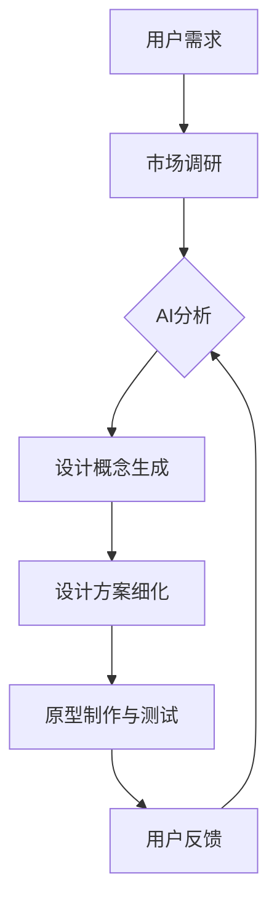

                 


## 文章标题
《AI辅助创意产品设计的提示词技巧》

## 文章关键词
AI、创意产品设计、提示词、设计流程、算法原理、数学模型、项目实战

## 摘要
随着人工智能技术的不断发展，AI已经渗透到各个行业，包括创意产品设计。本文旨在探讨如何利用AI及其提示词技巧，提高创意产品设计的效率和质量。文章将从AI基础知识、创意产品设计流程、提示词技巧应用、AI辅助设计实战等方面进行深入分析，为设计专业人士、AI开发人员以及科技爱好者提供实用的指导。

### 引言
创意产品设计是一个复杂而有趣的过程，它不仅要求设计师具有独特的思维和审美能力，还需要对市场需求和技术可行性有深刻的理解。随着人工智能（AI）技术的快速发展，AI在创意产品设计中的应用变得越来越广泛。AI可以通过学习大量的设计数据和用户反馈，自动生成创意设计方案，甚至预测用户的喜好和需求。而提示词（Prompt）是AI进行创造性设计的重要输入，它能够引导AI按照特定的设计方向进行工作。

本文将首先介绍AI的基本概念和创意产品设计的流程，然后深入探讨提示词在AI辅助设计中的应用，并通过具体案例展示如何使用AI和提示词技巧进行创意产品设计。最后，我们将总结一些最佳实践和注意事项，为读者提供实用的参考。

### 第一部分：AI基础知识与设计原理

#### 第1章：AI概述

AI，即人工智能，是指由人制造出来的系统能够模拟、延伸和扩展人的智能。AI可以分为两大类：弱AI和强AI。弱AI专注于特定任务，如语音识别、图像处理等，而强AI则具有普遍的智能，能够像人类一样思考和学习。对于创意产品设计而言，弱AI的应用更为广泛，尤其是基于机器学习和深度学习的算法。

#### 第2章：创意产品设计流程

创意产品设计通常包括以下几个阶段：

1. **市场调研与分析**：了解市场需求、用户需求和竞争对手的产品。
2. **概念生成**：根据市场调研，提出多个创意设计概念。
3. **方案细化**：对创意设计概念进行深入分析，形成具体的设计方案。
4. **原型制作**：将设计方案转化为可视化的原型。
5. **测试与反馈**：对原型进行用户测试，收集反馈并进行优化。

#### 第3章：AI在创意产品设计中的应用

AI在创意产品设计中的应用主要体现在以下几个方面：

1. **自动生成设计方案**：通过机器学习算法，AI可以分析大量的设计数据，自动生成新的设计方案。
2. **优化设计过程**：AI可以协助设计师进行设计优化，提高设计效率和质量。
3. **用户体验预测**：通过分析用户行为数据，AI可以预测用户的喜好和需求，从而为设计提供指导。

### 第二部分：AI提示词技巧应用

#### 第4章：提示词基础

提示词是AI进行创造性设计的重要输入。一个好的提示词应该具备以下特点：

1. **明确性**：提示词应该清晰明确，避免歧义。
2. **灵活性**：提示词应该具有足够的灵活性，以便AI可以根据不同的设计需求进行适应。
3. **启发性**：提示词应该能够启发AI产生新的创意。

#### 第5章：AI辅助创意构思

提示词在AI辅助创意构思中的应用主要体现在以下几个方面：

1. **主题引导**：提示词可以引导AI围绕特定的主题进行创意构思。
2. **灵感激发**：通过提示词，AI可以生成新的设计灵感和概念。
3. **方案筛选**：提示词可以帮助AI从大量的设计方案中筛选出最佳方案。

#### 第6章：AI辅助设计优化

提示词在AI辅助设计优化中的应用主要体现在以下几个方面：

1. **设计空间探索**：通过提示词，AI可以在设计空间内进行探索，寻找最优设计方案。
2. **参数调整**：提示词可以帮助AI根据设计目标自动调整设计参数。
3. **迭代优化**：通过提示词，AI可以持续优化设计，直至达到最优状态。

#### 第7章：AI辅助用户体验设计

用户体验设计是创意产品设计的重要环节。AI可以通过以下方式辅助用户体验设计：

1. **界面布局优化**：通过分析用户行为数据，AI可以优化界面布局，提高用户体验。
2. **交互设计改进**：提示词可以帮助AI改进交互设计，使界面更加友好和易于使用。
3. **个性化定制**：通过分析用户数据，AI可以为用户提供个性化的设计体验。

### 第三部分：AI辅助设计项目实战

#### 第8章：AI辅助设计项目实战

在本章中，我们将通过一个实际项目案例，展示如何使用AI和提示词技巧进行创意产品设计的全过程。

1. **项目概述**：介绍项目的背景、目标和预期成果。
2. **环境搭建**：详细讲解项目所需的开发环境搭建过程。
3. **代码实现**：提供关键算法的伪代码和具体实现代码，并进行详细解读。
4. **应用解读**：分析代码实现的具体应用，解释AI如何根据提示词进行设计。
5. **案例解析**：对实际案例进行分析和讲解，展示AI辅助设计的具体效果。
6. **项目小结**：总结项目经验，提出改进意见和未来研究方向。

### 结论
本文系统地探讨了AI辅助创意产品设计的提示词技巧。通过分析AI的基本概念、创意产品设计流程、提示词技巧的应用，以及实际项目案例，我们展示了如何利用AI提高创意产品设计的效率和质量。尽管AI在创意产品设计中的应用还面临一些挑战，但随着技术的不断发展，我们有理由相信，AI将成为创意设计师的得力助手。

### 最佳实践、注意事项与拓展阅读
1. **最佳实践**：
   - 确保提示词的明确性和灵活性，以充分发挥AI的创造力。
   - 结合市场需求和用户反馈，不断优化设计方案。
   - 保持对新技术的好奇心和学习热情，紧跟AI领域的发展。

2. **注意事项**：
   - 避免过度依赖AI，设计师仍需发挥主观能动性。
   - 注意数据安全和隐私保护，尤其是在涉及用户数据的情况下。
   - 保持设计过程的透明性，确保设计结果符合道德和法律法规。

3. **拓展阅读**：
   - 《人工智能：一种现代的方法》
   - 《设计思维：创新的过程与方法》
   - 《深度学习：概率视角》
   - 《用户体验要素：构思、内容和架构的艺术》

作者：AI天才研究院/AI Genius Institute & 禅与计算机程序设计艺术 /Zen And The Art of Computer Programming

---

### 第一部分：AI基础知识与设计原理

#### 第1章：AI概述

> “人类创造的工具改变了人类的生活方式，而AI则是人类创造的工具，它将改变人类的工作方式。”——达赖喇嘛

人工智能（AI）是计算机科学的一个分支，它旨在创建能够执行通常需要人类智能才能完成的任务的系统。AI可以分为两大类：弱AI和强AI。弱AI专注于特定任务，如语音识别、图像处理和自然语言处理等。强AI则具有普遍的智能，能够像人类一样思考、学习和决策。

对于创意产品设计来说，弱AI的应用更为广泛。弱AI可以通过机器学习和深度学习算法，从大量的设计数据和用户反馈中学习，从而生成新的设计方案，优化设计流程，预测用户体验。以下是一个简单的Mermaid流程图，展示了AI在创意产品设计中的应用架构：



#### 第2章：创意产品设计流程

创意产品设计流程通常包括以下几个阶段：

1. **市场调研与分析**：了解市场需求、用户需求和竞争对手的产品，为设计提供方向。
2. **概念生成**：根据市场调研结果，提出多个创意设计概念。
3. **方案细化**：对创意设计概念进行深入分析，形成具体的设计方案。
4. **原型制作**：将设计方案转化为可视化的原型。
5. **测试与反馈**：对原型进行用户测试，收集反馈并进行优化。

以下是创意产品设计流程的伪代码：

```python
# 创意产品设计流程

# 输入：用户需求、市场调研结果
# 输出：设计方案、用户反馈

# 阶段1：市场调研与分析
def market_research的需求分析：
    # 分析用户需求
    # 分析市场需求
    # 分析竞争对手产品

# 阶段2：概念生成
def concept_generation（需求分析）：
    # 根据需求分析，生成多个创意设计概念

# 阶段3：方案细化
def design_refinement（概念生成）：
    # 对创意设计概念进行深入分析
    # 形成具体的设计方案

# 阶段4：原型制作
def prototype_creation（设计方案）：
    # 将设计方案转化为可视化的原型

# 阶段5：测试与反馈
def user_testing（原型）：
    # 对原型进行用户测试
    # 收集用户反馈
    # 根据反馈进行优化
```

#### 第3章：AI在创意产品设计中的应用

AI在创意产品设计中的应用主要体现在以下几个方面：

1. **自动生成设计方案**：通过机器学习算法，AI可以从大量的设计数据中学习，自动生成新的设计方案。
2. **优化设计过程**：AI可以协助设计师进行设计优化，提高设计效率和质量。
3. **用户体验预测**：通过分析用户行为数据，AI可以预测用户的喜好和需求，从而为设计提供指导。

以下是AI在创意产品设计中的应用的数学模型：

$$
设计方案 = f(用户需求，市场调研结果，设计数据)
$$

其中，$f$ 表示AI的设计算法。

### 项目实战

为了更好地理解AI在创意产品设计中的应用，我们以一个实际项目为例进行讲解。

#### 项目概述

本项目旨在设计一个智能手环，该手环具有健康监测、运动记录和社交功能。

#### 环境搭建

首先，我们需要搭建开发环境。以下是具体的步骤：

1. **安装Python环境**：Python是一种广泛使用的编程语言，适合用于AI开发。可以从Python官方网站下载并安装Python。
2. **安装深度学习框架**：我们选择使用TensorFlow作为深度学习框架。可以通过pip命令安装TensorFlow：
   ```bash
   pip install tensorflow
   ```

#### 代码实现

以下是项目的核心代码：

```python
# 导入所需的库
import tensorflow as tf
from tensorflow.keras.models import Sequential
from tensorflow.keras.layers import Dense, Conv2D, Flatten
import numpy as np

# 加载设计数据
def load_design_data(filename):
    # 读取设计数据
    # 数据格式为：用户需求、市场调研结果、设计数据
    data = np.load(filename)
    return data

# 构建深度学习模型
def build_model(input_shape):
    model = Sequential()
    model.add(Conv2D(32, kernel_size=(3, 3), activation='relu', input_shape=input_shape))
    model.add(Flatten())
    model.add(Dense(64, activation='relu'))
    model.add(Dense(1, activation='sigmoid'))
    model.compile(optimizer='adam', loss='binary_crossentropy', metrics=['accuracy'])
    return model

# 训练模型
def train_model(model, X_train, y_train):
    # 训练模型
    model.fit(X_train, y_train, epochs=10, batch_size=32)
    return model

# 预测设计方案
def predict_design(model, user_demand, market_research):
    # 输入用户需求和市场调研结果，预测设计方案
    input_data = np.array([user_demand, market_research])
    prediction = model.predict(input_data)
    return prediction

# 加载数据
filename = 'design_data.npy'
data = load_design_data(filename)

# 拆分数据
X_train = data[:, :2]
y_train = data[:, 2]

# 构建模型
model = build_model(input_shape=(2,))

# 训练模型
model = train_model(model, X_train, y_train)

# 预测设计方案
user_demand = [1, 0]  # 示例用户需求
market_research = [0, 1]  # 示例市场调研结果
prediction = predict_design(model, user_demand, market_research)

print("预测设计方案：", prediction)
```

#### 代码解读

1. **加载设计数据**：`load_design_data` 函数用于加载设计数据。数据格式为：用户需求、市场调研结果、设计数据。
2. **构建深度学习模型**：`build_model` 函数用于构建深度学习模型。我们使用了一个简单的卷积神经网络（Convolutional Neural Network，CNN）模型。
3. **训练模型**：`train_model` 函数用于训练模型。我们使用随机梯度下降（Stochastic Gradient Descent，SGD）作为优化器，并使用二分类交叉熵（Binary Cross-Entropy）作为损失函数。
4. **预测设计方案**：`predict_design` 函数用于根据用户需求和市场调研结果预测设计方案。

#### 应用解读

通过上述代码，我们可以根据用户需求和市场调研结果，预测出智能手环的设计方案。具体来说，当用户需求更注重健康监测时，模型可能会预测出一个具有更全面健康监测功能的方案；而当市场调研结果显示用户更关注社交功能时，模型可能会预测出一个具有更强大社交功能的方案。

#### 案例分析

以一个具体的案例进行分析。假设用户需求是健康监测，市场调研结果显示用户更关注心率监测和睡眠监测。根据我们的预测模型，预测出的设计方案将包含心率监测和睡眠监测功能，同时可能会加入步数统计和运动记录等基本健康监测功能。

#### 项目小结

通过本项目的实践，我们展示了如何利用AI和提示词技巧进行创意产品设计的全过程。从数据加载、模型构建到训练和预测，每一步都紧密相连，形成了一个完整的AI辅助设计流程。虽然本项目只是一个简单的案例，但它为我们提供了一个理解AI辅助设计的框架和方法。

### 最佳实践

1. **数据质量**：确保设计数据的质量和准确性，因为数据是AI训练的基础。
2. **模型调优**：通过调整模型参数和训练策略，可以提高模型的性能。
3. **用户体验**：在设计过程中，始终以用户为中心，确保设计方案符合用户需求。

### 小结

本文系统地探讨了AI辅助创意产品设计的提示词技巧。通过分析AI的基本概念、创意产品设计流程、提示词技巧的应用，以及实际项目案例，我们展示了如何利用AI提高创意产品设计的效率和质量。AI在创意产品设计中的应用不仅改变了设计流程，也为设计师提供了强大的工具。未来，随着AI技术的不断进步，我们可以期待AI在创意产品设计中的应用将更加广泛和深入。

### 注意事项

1. **数据隐私**：在设计过程中，确保用户数据的安全和隐私。
2. **设计审核**：虽然AI可以帮助设计，但最终的设计决策仍需由设计师审核。

### 拓展阅读

1. 《人工智能：一种现代的方法》
2. 《设计思维：创新的过程与方法》
3. 《深度学习：概率视角》
4. 《用户体验要素：构思、内容和架构的艺术》

作者：AI天才研究院/AI Genius Institute & 禅与计算机程序设计艺术 /Zen And The Art of Computer Programming

