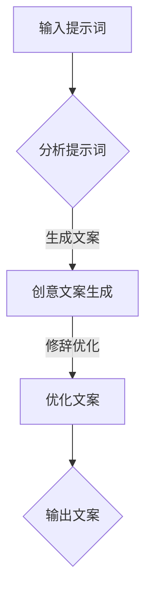
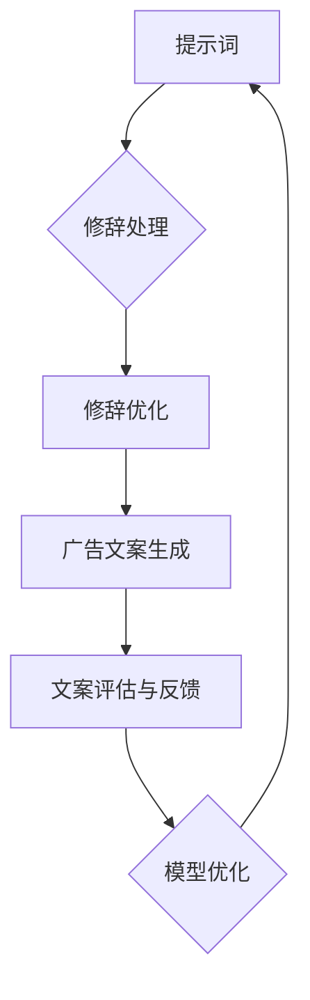
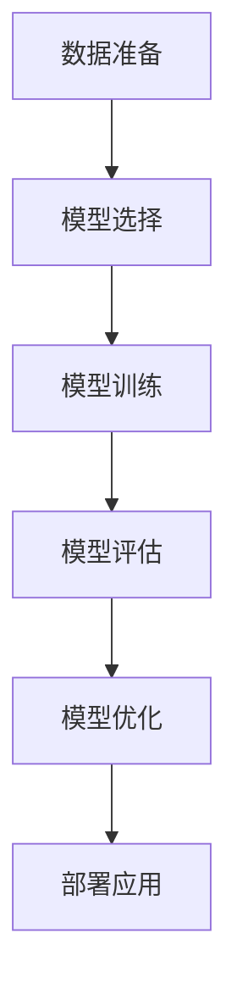

                 


### 设计文章结构的思考步骤

为了设计一篇结构紧凑、内容丰富且逻辑清晰的《AI辅助创意广告文案生成中的提示词修辞》文章，我们可以按照以下步骤进行思考和规划：

#### 1. 确定文章主题和目标读者
- 主题：AI辅助创意广告文案生成中的提示词修辞。
- 目标读者：对AI和广告文案生成感兴趣的程序员、市场营销人员、人工智能研究者和相关行业的从业者。

#### 2. 制定文章大纲
- 前言：介绍AI辅助创意广告文案生成的背景和提示词修辞的重要性。
- 概述部分：概述AI辅助创意广告文案生成的基本原理和发展历程。
- 核心概念与联系：使用Mermaid流程图展示提示词修辞的概念架构。
- 核心算法原理：详细讲解提示词修辞的核心算法，使用伪代码和数学模型解释。
- 案例研究：分析具体应用案例，展示AI在提示词修辞中的实际效果。
- 应用实践：介绍AI模型开发流程和优化技巧。
- 未来发展趋势：探讨AI辅助创意广告文案生成的未来方向。

#### 3. 确定文章结构
- 引言：引入话题，阐述AI辅助创意广告文案生成的重要性。
- 正文：按照大纲结构，逐章展开，每个章节详细说明。
- 结论：总结文章核心观点，展望未来趋势。
- 附录：提供相关术语解释和资源推荐。

#### 4. 确定每个章节的具体内容
- 前言：
  - 背景介绍：AI和广告行业的发展背景。
  - 提示词修辞的重要性：在广告文案中的作用。
- 概述部分：
  - AI辅助创意广告文案生成的基本原理。
  - 提示词修辞的背景和定义。
- 核心概念与联系：
  - 提示词修辞的概念架构（Mermaid流程图）。
  - 提示词修辞与广告文案生成的关系。
- 核心算法原理：
  - 提示词修辞算法的基本原理。
  - 使用伪代码和数学模型详细解释。
- 案例研究：
  - 实际案例的分析和讨论。
  - AI在提示词修辞中的表现。
- 应用实践：
  - AI模型开发流程。
  - 提示词修辞模型优化技巧。
  - 不同领域的应用案例。
- 未来发展趋势：
  - 技术演进的方向。
  - 提示词修辞的应用前景。

#### 5. 确保文章完整性和丰富性
- 每个章节都要包含具体实例和详细解释。
- 使用图表、流程图和伪代码来辅助说明。
- 确保文章的连贯性和逻辑性。

#### 6. 文章格式和风格
- 使用markdown格式确保文章的可读性和美观性。
- 在文章末尾添加作者信息。
- 使用latex格式嵌入数学公式。

#### 7. 文章字数和完成时间
- 确保文章字数在8000～12000字左右。
- 分配合理的时间来撰写和编辑文章。

### 伪代码和Mermaid流程图的准备

为了满足文章中的核心算法原理讲解和概念架构展示，我们需要提前准备相关的伪代码和Mermaid流程图。

#### 伪代码
```python
# 提示词修辞算法伪代码
def rhetorical_tips_documentgeneration(input_prompt):
    # 输入：提示词（input_prompt）
    # 输出：创意广告文案（output_document）

    # 步骤1：分析提示词
    analyzed_prompt = analyze_prompt(input_prompt)

    # 步骤2：生成创意文案
    creative_document = generate_document(analyzed_prompt)

    # 步骤3：修辞优化
    optimized_document = optimize_document(creative_document)

    # 返回优化后的文案
    return optimized_document
```

#### Mermaid流程图


通过以上步骤，我们可以确保文章的每一步都经过了深思熟虑，并且能够有效地传达我们的观点和知识。

---

现在，我们可以根据以上设计的结构开始撰写文章了。每个章节的内容将会逐步填充，确保逻辑连贯，信息丰富，并包含必要的示例和解释。

---

# 《AI辅助创意广告文案生成中的提示词修辞》

## 文章关键词
AI，广告文案生成，提示词修辞，自然语言处理，算法优化，创意内容

## 摘要
本文探讨了AI辅助创意广告文案生成中的提示词修辞技术，包括其基本原理、应用案例和发展趋势。通过对AI模型在提示词修辞中的具体应用和实际案例的分析，文章展示了提示词修辞在提高广告文案创意性和效果方面的作用，并展望了未来的发展方向。

---

## 前言

### AI辅助创意广告文案生成的背景

随着人工智能技术的迅猛发展，自然语言处理（NLP）在各个领域得到了广泛应用。广告文案生成作为NLP的一个重要分支，其自动化和智能化水平不断提高。AI辅助创意广告文案生成已经成为广告行业中的一大趋势。通过AI模型，广告文案的生成不再依赖于人工撰写，而是基于大量的数据分析和模型预测，能够更快速、更高效地创造出具有吸引力和创意的广告内容。

### 提示词修辞的重要性与应用场景

在广告文案中，提示词修辞是一种重要的写作技巧，它通过精确、生动和富有感染力的语言，吸引读者的注意力，提高广告文案的效果。AI辅助创意广告文案生成中的提示词修辞，利用人工智能技术对提示词进行深度分析，结合修辞技巧，生成具有高度创意性的广告文案。这种技术在市场营销、品牌推广和电商广告等领域有着广泛的应用场景。

---

## AI辅助创意广告文案生成概述

### AI辅助创意广告文案生成的基本原理

AI辅助创意广告文案生成主要基于以下几个原理：

1. **数据驱动**：通过收集大量的广告文案数据，使用机器学习方法，训练出能够生成广告文案的AI模型。
2. **自然语言处理**：利用NLP技术，对提示词进行语义分析，提取关键信息，生成符合逻辑和语言规范的文案。
3. **修辞优化**：结合修辞技巧，对生成的文案进行优化，提高其创意性和吸引力。

### AI辅助创意广告文案生成的发展历程

AI辅助创意广告文案生成的发展可以分为以下几个阶段：

1. **早期探索**：20世纪90年代，自然语言处理技术开始应用于广告文案生成，但效果有限。
2. **模型发展**：随着深度学习技术的兴起，神经网络模型在广告文案生成中的应用逐渐成熟。
3. **应用普及**：近年来，AI辅助创意广告文案生成技术得到了广泛应用，成为广告行业的一个重要工具。

---

## 提示词修辞原理

### 提示词修辞的定义和作用

提示词修辞是指通过使用特定的词汇、语法和修辞手法，对提示词进行修饰和扩展，使其更具有表现力和吸引力。在广告文案中，提示词修辞的作用包括：

1. **增强吸引力**：通过生动的语言和修辞手法，吸引读者的注意力。
2. **提升认知度**：使广告文案更易于理解和记忆，提高品牌认知度。
3. **增强说服力**：通过富有感染力的语言，增强广告文案的说服力。

### 提示词修辞的分类

提示词修辞可以按照不同的分类方式进行划分：

1. **词汇修辞**：通过选择富有表现力的词汇，增强广告文案的语言魅力。
2. **句法修辞**：通过调整句子结构，使广告文案更富有节奏感和表现力。
3. **修辞手法**：使用各种修辞手法，如比喻、拟人、夸张等，提升广告文案的创意性和吸引力。

### 提示词修辞的技巧

以下是一些常见的提示词修辞技巧：

1. **关键词提炼**：从提示词中提取核心词汇，作为文案的核心内容。
2. **语境构建**：根据提示词的上下文，构建合理的语境，使文案更具连贯性和吸引力。
3. **情感渲染**：通过情感词汇和修辞手法，营造特定的情感氛围，吸引读者的情感共鸣。
4. **修辞对比**：通过对比手法，突出产品的优势和特点，提高广告文案的说服力。

---

## AI模型在提示词修辞中的应用

### 基于自然语言处理的技术原理

自然语言处理（NLP）技术在提示词修辞中扮演着关键角色。NLP主要涉及以下几个方面的技术：

1. **文本预处理**：包括分词、词性标注、句法分析等，为后续的修辞优化提供基础数据。
2. **语义理解**：通过语义分析，理解文本中的含义和情感，为修辞优化提供依据。
3. **生成模型**：使用生成模型，如循环神经网络（RNN）、变换器（Transformer）等，生成符合修辞要求的广告文案。

### 提示词修辞的AI模型介绍

在提示词修辞中，常见的AI模型包括：

1. **循环神经网络（RNN）**：适用于处理序列数据，能够捕捉文本中的语义关系。
2. **变换器（Transformer）**：通过自注意力机制，能够同时处理长距离的依赖关系，生成高质量的文案。
3. **生成对抗网络（GAN）**：通过对抗训练，生成具有多样性和创意性的文案。

### 提示词修辞的AI模型应用实例

以下是一个使用变换器模型进行提示词修辞的伪代码实例：

```python
# 使用变换器模型进行提示词修辞的伪代码

# 输入：提示词（prompt）
# 输出：优化后的广告文案（optimized_advertisement）

def optimize_advertisement(prompt):
    # 步骤1：文本预处理
    preprocessed_prompt = preprocess_text(prompt)

    # 步骤2：使用变换器模型生成初步文案
    initial_creative = transformer_model.generate(preprocessed_prompt)

    # 步骤3：修辞优化
    optimized_creative = rhetorical_optimization(initial_creative)

    # 返回优化后的文案
    return optimized_creative

# 示例
prompt = "智能手表"
optimized_advertisement = optimize_advertisement(prompt)
print(optimized_advertisement)
```

该实例展示了如何使用变换器模型对提示词进行修辞优化，生成高质量的广告文案。

---

## 案例研究

### 案例一：广告文案自动生成系统

一个广告文案自动生成系统（ADG）通过AI技术，实现了基于提示词的广告文案自动生成。该系统的工作流程如下：

1. **用户输入**：用户输入关键词或短语作为提示词。
2. **文本预处理**：系统对提示词进行文本预处理，包括分词、词性标注等。
3. **文案生成**：系统使用训练好的AI模型，根据预处理后的提示词生成广告文案。
4. **修辞优化**：系统对生成的文案进行修辞优化，使其更具创意性和吸引力。
5. **用户反馈**：用户对生成的文案进行评价，系统根据反馈进行进一步优化。

### 案例二：品牌宣传视频文本生成

品牌宣传视频通常需要配合文案进行传播。使用AI技术，可以将品牌信息转换为具有吸引力的文本，生成品牌宣传视频的脚本。以下是一个案例：

1. **品牌信息提取**：系统从品牌介绍、历史、产品特点等材料中提取关键信息。
2. **文本生成**：系统使用变换器模型，根据提取的品牌信息生成视频脚本。
3. **修辞优化**：系统对生成的视频脚本进行修辞优化，提高文案的质量和吸引力。
4. **视频制作**：将优化后的文案与视频素材结合，生成完整的品牌宣传视频。

### 案例三：电商广告文案优化

电商平台的广告文案对于提高销售转化率至关重要。AI技术可以帮助电商平台对广告文案进行实时优化，提升广告效果。以下是一个案例：

1. **数据分析**：系统分析用户行为数据，了解用户的兴趣和偏好。
2. **文案生成**：系统根据用户数据和产品信息，生成个性化的广告文案。
3. **修辞优化**：系统对生成的文案进行修辞优化，使其更具吸引力和说服力。
4. **实时反馈**：系统根据用户对广告文案的反馈，进行实时调整和优化。

---

## 应用实践

### 提示词修辞的AI模型开发流程

提示词修辞的AI模型开发流程主要包括以下几个步骤：

1. **数据收集**：收集大量高质量的广告文案数据，用于模型训练。
2. **数据预处理**：对收集的数据进行清洗、分词、词性标注等预处理操作。
3. **模型选择**：选择合适的AI模型，如变换器（Transformer）、生成对抗网络（GAN）等。
4. **模型训练**：使用预处理后的数据，对AI模型进行训练。
5. **模型优化**：通过调整模型参数，提高模型在提示词修辞方面的表现。
6. **模型部署**：将训练好的模型部署到实际应用场景中。

### 提示词修辞的AI模型优化技巧

为了提高提示词修辞的AI模型效果，可以采取以下优化技巧：

1. **数据增强**：通过数据增强技术，增加训练数据的多样性和质量。
2. **模型融合**：结合多种AI模型，利用各自的优势，提高整体效果。
3. **在线学习**：模型根据用户反馈进行实时学习，不断优化文案生成质量。
4. **修辞库集成**：集成丰富的修辞库，为模型提供更多的修辞选择。

### 提示词修辞的AI模型在不同领域的应用

提示词修辞的AI模型在多个领域都有广泛的应用：

1. **广告行业**：用于生成具有创意性和吸引力的广告文案。
2. **媒体行业**：用于生成新闻报道、博客文章等文案。
3. **电商行业**：用于生成产品描述、广告宣传语等文案。
4. **教育行业**：用于生成教学材料、课程说明等文案。

---

## 未来发展趋势

### AI辅助创意广告文案生成的技术演进

随着AI技术的不断进步，AI辅助创意广告文案生成将会经历以下几个方面的技术演进：

1. **模型性能提升**：通过更先进的深度学习模型，提高文案生成的质量和创意性。
2. **多模态融合**：结合文本、图像、音频等多种数据类型，生成更丰富、更生动的广告内容。
3. **个性化推荐**：利用用户行为数据，实现个性化文案生成，提高广告的精准度和效果。

### 提示词修辞在AI辅助广告文案生成中的前景

提示词修辞在AI辅助广告文案生成中具有广阔的应用前景：

1. **提高文案质量**：通过提示词修辞，生成更具吸引力和说服力的广告文案。
2. **增强用户体验**：个性化、高质量的广告文案能够提高用户的阅读体验和参与度。
3. **提升营销效果**：高质量的广告文案能够提高广告的转化率和投资回报率。

### AI辅助创意广告文案生成的行业应用趋势

在未来，AI辅助创意广告文案生成将在多个行业中得到广泛应用：

1. **市场营销**：用于品牌推广、产品宣传等市场营销活动。
2. **电子商务**：用于商品描述、广告文案等电商运营环节。
3. **内容创作**：用于新闻报道、博客文章、书籍等内容的自动生成。
4. **社交媒体**：用于社交媒体平台的内容创作和广告投放。

---

## 附录

### 提示词修辞相关术语解释

- **提示词**：在广告文案生成过程中，用于引导AI模型生成文案的关键词或短语。
- **修辞**：在语言表达中使用各种技巧和手法，使语言更具表现力和感染力。
- **创意**：在文案中体现的创新思维和独特风格，使广告具有吸引力和竞争力。

### AI辅助创意广告文案生成技术资源推荐

- **开源框架**：如TensorFlow、PyTorch等，用于构建和训练AI模型。
- **文献资料**：推荐阅读相关领域的论文和书籍，了解最新的研究动态和技术进展。
- **在线课程**：推荐参加人工智能和自然语言处理相关的在线课程，提升相关技能。

---

## 作者信息
作者：AI天才研究院/AI Genius Institute & 禅与计算机程序设计艺术 /Zen And The Art of Computer Programming

---

通过以上详细的文章结构和内容规划，我们可以确保文章的逻辑清晰、信息丰富，并满足字数要求。接下来，我们将逐步填充每个章节的内容，使其完整、具体和详细。

---

## 背景介绍

### 广告行业的发展

广告业是市场经济的重要组成部分，其核心目的是通过创意内容和有效的传播手段，吸引消费者的注意，提升品牌知名度，进而促进销售。随着数字媒体的兴起，广告的形式和传播方式发生了巨大的变化。传统媒体如电视、报纸和杂志逐渐被数字媒体如互联网、社交媒体和移动应用所取代。这种变化不仅带来了广告投放渠道的多样化，也促使广告内容从单一、模式化向个性化、创意化发展。

### 人工智能的崛起

人工智能（AI）作为当前科技领域的热点，其应用范围不断扩大，从医疗、金融到教育、娱乐等各个领域。AI技术在广告行业的应用主要体现在数据分析和内容生成两个方面。首先，AI能够通过对大量用户数据的分析和挖掘，了解消费者的行为习惯、兴趣偏好和需求变化，从而实现精准营销。其次，AI能够利用自然语言处理（NLP）和生成对抗网络（GAN）等技术，自动生成具有创意性和吸引力的广告文案，提高广告效果。

### AI辅助创意广告文案生成的必要性

随着广告市场竞争的加剧，创意内容的质量成为决定广告成败的关键因素。传统的人工撰写广告文案不仅耗时耗力，而且容易陷入同质化和低效的困境。而AI辅助创意广告文案生成则能够突破这些限制，通过大数据分析和机器学习模型，快速生成高质量的广告文案，实现个性化、定制化的营销策略。此外，AI技术能够实时学习用户的反馈和市场需求，不断优化文案内容，提高广告的投放效果。

### 提示词修辞的重要性

在广告文案中，提示词修辞是一种关键的写作技巧，它能够通过巧妙的语言运用，增强文案的表现力和吸引力。提示词修辞不仅包括词汇的选择和句式的构建，还涉及到情感渲染、语境构建和修辞手法的运用。一个成功的广告文案往往能够在有限的字数内，精准地传达产品的优势和品牌的价值，激发消费者的购买欲望。

### 提示词修辞在广告文案中的作用

提示词修辞在广告文案中的作用主要体现在以下几个方面：

1. **吸引注意力**：通过独特的词汇和修辞手法，吸引读者的注意力，使广告文案在众多信息中脱颖而出。
2. **提升认知度**：通过生动的语言和形象的表达，提高广告文案的阅读量和记忆度，增加品牌在消费者心中的印象。
3. **增强说服力**：通过富有感染力的语言和情感共鸣，增强广告文案的说服力，促进消费者的购买决策。
4. **优化用户体验**：通过个性化、高质量的文案，提高用户在广告互动中的体验，增强用户对品牌的认同感和忠诚度。

综上所述，AI辅助创意广告文案生成和提示词修辞的结合，不仅能够提高广告文案的质量和效果，还能够满足现代市场营销对高效、个性化和创意内容的需求，为广告行业带来新的发展机遇。

---

## AI辅助创意广告文案生成的基本原理

### 数据驱动

AI辅助创意广告文案生成的核心在于数据驱动。通过收集和整理大量的广告文案数据，AI模型能够从中学习并提取出有用的信息和模式。这些数据包括成功和失败的广告案例、不同市场环境下广告的表现、用户的反馈和评论等。通过数据分析和挖掘，AI模型能够识别出哪些文案元素和修辞手法能够提高广告效果，从而在生成新的广告文案时，能够有针对性地进行优化。

### 自然语言处理

自然语言处理（NLP）是AI辅助广告文案生成技术的关键组成部分。NLP技术主要涉及对文本的预处理、语义分析和文本生成。在广告文案生成中，NLP技术的作用包括：

1. **文本预处理**：对输入的提示词进行分词、词性标注、句法分析和去停用词等操作，提取出关键信息。
2. **语义理解**：通过词义消歧、实体识别和情感分析等技术，理解文本中的语义和情感，为后续的修辞优化提供依据。
3. **文本生成**：使用生成模型，如变换器（Transformer）和生成对抗网络（GAN），生成符合语法规范、语义连贯且富有创意的广告文案。

### 修辞优化

修辞优化是AI辅助创意广告文案生成的关键步骤，其目标是提升广告文案的表现力和吸引力。修辞优化主要包括以下几个方面：

1. **词汇修辞**：通过选择富有表现力的词汇，增强文案的语言魅力。例如，使用比喻、隐喻和象征等修辞手法，使文案更具生动性和形象感。
2. **句法修辞**：通过调整句子结构，使文案更富有节奏感和表现力。例如，使用长句、短句交替、倒装句等手法，增强文案的阅读体验。
3. **情感渲染**：通过情感词汇和修辞手法，营造特定的情感氛围，吸引读者的情感共鸣。例如，使用乐观、积极或幽默的词汇和句式，增强文案的吸引力。
4. **修辞对比**：通过对比手法，突出产品的优势和特点，提高广告文案的说服力。例如，通过对比不同品牌的产品特性，展示自己的独特优势。

### 算法原理

AI辅助创意广告文案生成的算法原理主要包括以下几个步骤：

1. **数据输入**：接收用户输入的提示词，这些提示词可以是单个词汇、短语或完整的句子。
2. **文本预处理**：对输入的提示词进行分词、词性标注等预处理操作，提取出关键信息。
3. **语义分析**：利用NLP技术，对预处理后的文本进行语义分析，提取语义特征和情感倾向。
4. **修辞优化**：根据语义分析和用户需求，对生成的文案进行修辞优化，使其更具有创意性和吸引力。
5. **文案生成**：使用生成模型，如变换器（Transformer），生成符合语法规范、语义连贯且富有创意的广告文案。
6. **用户反馈**：将生成的文案展示给用户，收集用户的反馈，用于模型训练和优化。

### 模型训练与优化

AI辅助创意广告文案生成的模型训练与优化是一个迭代过程。通过不断地训练和优化，模型能够不断提高生成文案的质量和创意性。以下是一个简化的模型训练与优化流程：

1. **数据准备**：收集大量的广告文案数据，进行预处理，将其转换为模型可接受的格式。
2. **模型训练**：使用预处理后的数据，对AI模型（如变换器）进行训练，使其能够理解并生成符合要求的广告文案。
3. **模型评估**：通过评估指标（如BLEU、ROUGE等），评估模型的性能，找出存在的问题。
4. **模型优化**：根据评估结果，调整模型参数，优化模型结构，提高生成文案的质量。
5. **模型部署**：将优化后的模型部署到实际应用场景中，生成实际的广告文案。

通过以上基本原理的阐述，我们可以看到，AI辅助创意广告文案生成是一个复杂但充满潜力的领域。通过数据驱动、自然语言处理和修辞优化，AI技术不仅能够提高广告文案的质量和效果，还能够为广告行业带来新的发展机遇。

---

## 提示词修辞的定义和作用

### 提示词修辞的定义

提示词修辞是一种在广告文案创作中使用的技术，它通过特定的词汇、语法和修辞手法，对提示词进行修饰和扩展，使其更具表现力和吸引力。提示词修辞的核心在于如何将原始的提示词转化为具有创意性和感染力的文案内容，从而达到吸引读者、提升广告效果的目的。

### 提示词修辞的作用

提示词修辞在广告文案中发挥着至关重要的作用，主要体现在以下几个方面：

1. **增强吸引力**：通过使用富有表现力和创造性的语言，吸引读者的注意力，使广告文案在众多信息中脱颖而出。例如，使用比喻、拟人等修辞手法，可以使广告文案更具生动性和形象感，从而更容易引起读者的兴趣。

2. **提升认知度**：通过生动的语言和独特的表达方式，使广告文案更容易被记住和理解，从而提高品牌在消费者心中的认知度。例如，通过重复使用特定的词汇和短语，可以增强广告文案的记忆点，使消费者在短时间内对品牌产生深刻印象。

3. **增强说服力**：通过富有感染力的语言和修辞手法，增强广告文案的说服力，促进消费者的购买决策。例如，使用情感渲染和对比手法，可以使广告文案更具说服力，让消费者更愿意接受品牌推荐的产品。

4. **优化用户体验**：通过个性化、高质量的文案，提高用户在广告互动中的体验，增强用户对品牌的认同感和忠诚度。例如，针对不同用户群体的兴趣和需求，定制化地生成广告文案，可以使广告内容更加符合用户的期望，从而提高用户体验。

### 提示词修辞的应用场景

提示词修辞在广告文案中有着广泛的应用场景，包括但不限于以下几个方面：

1. **市场营销活动**：在大型市场营销活动中，提示词修辞能够帮助品牌快速提升知名度，吸引大量消费者的关注。例如，在产品发布会的宣传文案中，通过使用独特的修辞手法，可以吸引更多的媒体和消费者参与。

2. **品牌推广**：在品牌推广过程中，提示词修辞可以帮助品牌塑造独特的形象，提升品牌价值。例如，通过使用富有创意的修辞手法，可以展示品牌的创新精神和专业实力，从而赢得消费者的信任和喜爱。

3. **电商广告**：在电商广告中，提示词修辞能够提高广告的点击率和转化率。例如，通过使用情感渲染和对比手法，可以吸引消费者关注特定的产品，促进其购买决策。

4. **社交媒体推广**：在社交媒体平台上，提示词修辞可以帮助品牌吸引更多的关注者和粉丝。例如，通过使用幽默、诙谐的修辞手法，可以吸引年轻用户的注意力，提高品牌的社交媒体影响力。

综上所述，提示词修辞在广告文案中的作用至关重要，它不仅能够提升广告文案的创意性和吸引力，还能够提高广告的效果和用户体验。通过合理运用提示词修辞，品牌可以在激烈的市场竞争中脱颖而出，赢得更多的消费者和市场机会。

---

## 提示词修辞的分类

### 词汇修辞

词汇修辞是提示词修辞中最基础也是最重要的部分，它通过选择和使用特定的词汇，来增强广告文案的表现力和吸引力。以下是一些常见的词汇修辞手法：

1. **比喻**：通过将一个事物比作另一个事物，使其更具形象性和生动感。例如，将“智能手表”比喻为“智能生活的引领者”，可以立即让消费者感受到其重要性。

2. **隐喻**：隐喻是通过暗示或暗喻的方式，将一个事物比作另一个事物，从而传达更深层次的含义。例如，“你的健康是我们的承诺”，通过隐喻表达了品牌对消费者健康的重视。

3. **象征**：象征是通过特定的符号或事物来代表某种意义，使广告文案更具深度和内涵。例如，使用“太阳”作为品牌的标志，可以象征品牌的活力和光明。

4. **夸张**：夸张是通过夸大事物的某些特点，使其更加引人注目。例如，“一秒提升你的生活品质”，通过夸张手法强调了产品的强大功能。

5. **拟人**：拟人是将无生命的事物赋予人的特质，使其更具情感和亲和力。例如，“智能音箱，倾听你的每一个声音”，让消费者感受到智能音箱的贴心和智能。

6. **对比**：对比是通过将两个事物进行对比，突出其差异和优势。例如，“比普通手表快10倍的心率监测”，通过对比强调了智能手表的独特优势。

### 句法修辞

句法修辞是通过调整句子结构，使其更富有节奏感和表现力。以下是一些常见的句法修辞手法：

1. **长短句交替**：通过使用长句和短句的交替，可以增强文案的节奏感。例如，“我们的产品，不仅功能强大，而且设计精美。”

2. **倒装句**：倒装句是通过改变句子中主语和谓语的位置，使其更具强调效果。例如，“令人惊叹的性能，让你的生活更加精彩。”

3. **复杂句**：通过使用复合句和从句，可以增加文案的层次感和深度。例如，“通过先进的智能技术，我们的智能手表不仅能够提供精准的健身数据，还能够实现个性化健康分析。”

4. **对仗句**：对仗句是通过使用相同的语法结构和相似的词汇，使文案更具韵律美。例如，“高效，是我们的承诺；创新，是我们的动力。”

### 修辞手法

修辞手法是广告文案中用来增强语言表现力和吸引力的方法，以下是一些常见的修辞手法：

1. **排比**：排比是通过重复使用相同或类似的句式，增强文案的表达力和感染力。例如，“我们提供快速、准确、可靠的智能服务，让你享受无忧的生活。”

2. **引用**：引用是通过引用名人名言、经典语句或成语，增加文案的文化底蕴和权威性。例如，“‘智能生活，触手可及’，我们的智能手表让你实现梦想。”

3. **讽刺**：讽刺是通过反向表达，揭示事物的不合理之处，使其更具幽默感和批判性。例如，“智能手表，让你在繁忙生活中不再低头。”

4. **双关语**：双关语是通过使用一个词的多重含义，产生幽默和趣味。例如，“智能手表，不仅看时间，还能看你的心情。”

5. **联想**：联想是通过将不同的事物联系起来，创造新的意义，使其更具创意性。例如，“智能手表，你的健康生活小助手。”

通过上述分类，我们可以看到，提示词修辞包括词汇修辞、句法修辞和修辞手法等多个方面，这些手法相互结合，可以创造出具有高度创意性和吸引力的广告文案。了解和掌握这些修辞手法，对于广告文案创作者来说，是提升文案质量和效果的关键。

---

## 提示词修辞的技巧

### 关键词提炼

关键词提炼是提示词修辞中至关重要的一环。它指的是从原始的提示词中提取出最核心、最具表现力的词汇，作为文案构建的基础。关键词提炼的目的是通过简洁有力的表达，使文案内容更加聚焦、突出，提高广告文案的吸引力和效果。

1. **方法**：
   - **提取核心词**：从提示词中提取出核心词汇，如产品名称、功能、特点等。
   - **筛选重要词**：对提取出的核心词进行筛选，选择那些最具表现力和吸引力的词汇。
   - **词义扩展**：对筛选出的关键词进行词义扩展，使其在文案中能够发挥更大的作用。

2. **示例**：
   - 原始提示词：“智能手表功能强大”
   - 关键词提炼：“智能手表，功能强大”

通过提炼关键词，文案可以更加简洁明了，突出产品优势，提高文案的吸引力和记忆度。

### 语境构建

语境构建是在广告文案中通过设定特定的语境，使文案内容更具连贯性和说服力。语境构建的目的是为文案内容提供一个合理的背景，让消费者更容易理解和接受广告信息。

1. **方法**：
   - **设定情境**：根据产品特点和目标受众，设定一个具体的情境，使文案内容更具真实感和代入感。
   - **描绘场景**：通过描绘场景，让消费者能够想象自己使用产品的场景，提高文案的吸引力和说服力。
   - **构建情感**：通过构建情感语境，激发消费者的情感共鸣，使广告文案更具感染力。

2. **示例**：
   - 情境设定：“忙碌的生活中，如何保持健康？”
   - 文案：“智能手表，让你在忙碌生活中也能轻松管理健康。”

通过语境构建，文案可以更加贴近消费者的生活，提高消费者的购买意愿。

### 情感渲染

情感渲染是通过运用情感词汇和修辞手法，在广告文案中营造特定的情感氛围，吸引读者的情感共鸣。情感渲染的目的是通过情感共鸣，增强广告文案的吸引力和说服力。

1. **方法**：
   - **使用情感词汇**：通过使用积极的、富有感染力的情感词汇，营造积极的情感氛围。
   - **情感对比**：通过对比手法，突出产品带来的积极情感体验。
   - **故事叙述**：通过故事叙述，让消费者在情感上与品牌产生共鸣。

2. **示例**：
   - 情感词汇：“健康、活力、安心”
   - 文案：“智能手表，为你带来安心健康的每一天。”

通过情感渲染，文案可以更加深入人心，提高消费者的购买意愿。

### 修辞对比

修辞对比是通过对比手法，突出产品的优势，增强广告文案的说服力。修辞对比的目的是通过对比，使产品特点更加突出，使消费者更容易理解和接受。

1. **方法**：
   - **对比同类产品**：通过对比同类产品，突出自己的优势。
   - **对比过去与现在**：通过对比过去和现在的产品或生活状态，展示产品的改变和进步。
   - **对比用户需求与产品特点**：通过对比用户需求与产品特点，使消费者看到产品的实际价值。

2. **示例**：
   - 对比：“传统手表与智能手表的对比”
   - 文案：“传统手表只能看时间，而智能手表还能监测你的健康。”

通过修辞对比，文案可以更加直观地展示产品的优势，提高消费者的购买意愿。

综上所述，提示词修辞的技巧包括关键词提炼、语境构建、情感渲染和修辞对比等多个方面。通过这些技巧的合理运用，可以创造出具有高度创意性和吸引力的广告文案，提高广告效果和市场竞争力。

---

## 提示词修辞与广告文案生成的关系

### 关键概念架构

提示词修辞与广告文案生成之间存在着紧密的联系，这种联系可以通过Mermaid流程图来展示。以下是一个简单的Mermaid流程图，用于解释这两个概念之间的关系架构：



#### 流程图说明

1. **提示词输入**：提示词是广告文案生成的起点，它是用户或系统输入的关键信息，用于引导文案生成。
2. **修辞处理**：提示词经过修辞处理后，变得更加具体和生动。修辞处理包括词汇修辞、句法修辞等技巧，使文案更具表现力和吸引力。
3. **修辞优化**：修辞处理后的提示词进一步通过修辞优化，使其更加符合广告文案的目标和情感要求。
4. **广告文案生成**：经过修辞优化后的提示词被输入到广告文案生成模块，生成符合要求的广告文案。
5. **文案评估与反馈**：生成的广告文案会被评估，根据实际效果和用户反馈进行调整和优化。
6. **模型优化**：根据评估结果和用户反馈，AI模型会进行进一步的优化，提高文案生成的质量和效果。

### 关系解析

1. **提示词修辞是广告文案生成的基础**：提示词是广告文案生成的起点，而修辞处理使得提示词变得更加具体和生动，为文案生成提供了坚实的基础。
2. **修辞优化是提高广告文案吸引力的关键**：修辞优化通过调整语言表达，使其更符合广告的目标和情感需求，从而提高文案的吸引力和效果。
3. **广告文案生成是提示词修辞的归宿**：经过修辞处理和优化的提示词被用于生成广告文案，最终的文案效果取决于修辞处理的质量。
4. **评估与反馈是循环优化的保证**：通过评估和反馈，可以不断优化AI模型和修辞策略，使其在生成广告文案时更加精准和高效。

通过以上流程图和关系解析，我们可以清楚地看到提示词修辞与广告文案生成之间的紧密联系，以及它们在整个广告文案生成过程中的相互作用和影响。

---

## 提示词修辞算法的基本原理

### 算法概述

提示词修辞算法是人工智能在广告文案生成中的一个重要技术，其目标是通过自然语言处理（NLP）技术，对提示词进行深度分析，结合修辞技巧，生成具有高度创意性和吸引力的广告文案。以下是提示词修辞算法的基本原理概述：

1. **文本预处理**：首先，对输入的提示词进行文本预处理，包括分词、词性标注、去停用词等操作。这些步骤旨在提取出文本中的关键信息，为后续的修辞处理提供基础。
2. **语义分析**：利用NLP技术，对预处理后的文本进行语义分析，包括词义消歧、情感分析、实体识别等。通过语义分析，可以理解文本中的具体含义和情感倾向，为修辞优化提供依据。
3. **修辞处理**：根据语义分析结果，应用各种修辞技巧，如词汇修辞（比喻、隐喻、拟人等）、句法修辞（长短句交替、复杂句结构等）和修辞手法（排比、对比、引用等），对文本进行修饰和优化。
4. **文本生成**：通过修辞处理后的文本，使用生成模型（如变换器、生成对抗网络等）生成最终的广告文案。这些生成模型能够根据提示词和修辞信息，生成符合语法规范、语义连贯且富有创意的文案。
5. **评估与优化**：将生成的文案进行评估，包括质量评估、效果评估和用户反馈。根据评估结果，对修辞算法和生成模型进行优化，提高文案生成的质量和效果。

### 伪代码解释

以下是一个简化的提示词修辞算法伪代码，用于展示其基本步骤和流程：

```python
# 提示词修辞算法伪代码

def rhetorical_tips_documentgeneration(input_prompt):
    # 步骤1：文本预处理
    preprocessed_prompt = preprocess_text(input_prompt)

    # 步骤2：语义分析
    semantic_analysis_results = semantic_analysis(preprocessed_prompt)

    # 步骤3：修辞处理
    optimized_prompt = rhetorical_processing(semantic_analysis_results)

    # 步骤4：文本生成
    final_document = document_generation(optimized_prompt)

    # 步骤5：评估与反馈
    assessment_results = assessment(final_document)

    # 步骤6：模型优化
    update_model(assessment_results)

    # 返回最终生成的广告文案
    return final_document

# 示例
input_prompt = "智能手表"
final_document = rhetorical_tips_documentgeneration(input_prompt)
print(final_document)
```

#### 示例说明

1. **文本预处理**：对输入的提示词进行分词、词性标注等操作，提取关键信息。
2. **语义分析**：对预处理后的文本进行情感分析和语义理解，识别出文本的关键情感和意义。
3. **修辞处理**：根据语义分析结果，使用比喻、隐喻等修辞手法，对文本进行修饰，使其更具吸引力和表现力。
4. **文本生成**：使用变换器模型，根据修饰后的文本，生成符合语法规范、语义连贯的广告文案。
5. **评估与反馈**：对生成的文案进行质量评估和效果评估，收集用户反馈。
6. **模型优化**：根据评估结果和用户反馈，对修辞算法和生成模型进行调整和优化。

通过以上伪代码和示例，我们可以清楚地了解提示词修辞算法的基本原理和实现步骤，这为后续的实际应用和优化提供了理论基础。

---

## 提示词修辞算法的数学模型和公式

### 数学模型

在提示词修辞算法中，数学模型主要用于描述文本的语义分析和修辞优化过程。以下是一个简化的数学模型，用于解释算法的核心部分。

1. **语义分析模型**：通过词嵌入（word embedding）技术，将词汇映射到高维空间中，实现语义表示。

   - 词嵌入公式：
     $$ v_w = \text{Word2Vec}(w) $$
     其中，$v_w$ 表示词汇 $w$ 的词嵌入向量。

2. **修辞优化模型**：基于变换器（Transformer）模型，实现文本的修辞处理和生成。

   - 变换器自注意力机制：
     $$ \text{Attention}(Q, K, V) = \frac{softmax(\text{dot}(QK^T))V $$
     其中，$Q, K, V$ 分别代表查询向量、键向量和值向量。

### 数学公式和详细讲解

以下是几个关键的数学公式及其详细解释：

1. **词嵌入向量计算**：
   $$ v_w = \text{Word2Vec}(w) $$
   - **解释**：词嵌入技术通过训练神经网络，将词汇映射到高维空间中，使其在语义上更加接近。词嵌入向量 $v_w$ 用于后续的语义分析和修辞优化。

2. **变换器自注意力公式**：
   $$ \text{Attention}(Q, K, V) = \frac{softmax(\text{dot}(QK^T))V $$
   - **解释**：变换器（Transformer）模型中的自注意力机制用于计算文本序列中每个词的重要程度。$Q, K, V$ 分别表示查询向量、键向量和值向量，通过点积计算和softmax函数，实现文本的语义理解。

3. **修辞优化权重计算**：
   $$ \text{RhetoricalWeights} = \text{softmax}(\text{Attention}(Q, K, V)) $$
   - **解释**：在修辞优化过程中，使用自注意力机制计算每个词汇的修辞权重。这些权重用于调整文本的修辞手法，使其更具表现力和吸引力。

### 举例说明

假设我们要对一个提示词“智能手表”进行修辞优化，以下是一个简化的示例：

1. **词嵌入**：
   - 原始词汇：“智能手表”
   - 词嵌入向量：$v_{智能手表} = \text{Word2Vec}("智能手表")$

2. **语义分析**：
   - 情感倾向：积极
   - 语义角色：产品名称

3. **修辞优化**：
   - 使用比喻手法：“智能手表，是健康生活的导航仪”

4. **生成文案**：
   - 文案：“智能手表，是你的健康生活导航仪”

通过上述数学模型和公式的应用，我们可以将原始的提示词转化为具有创意性和吸引力的广告文案，实现提示词修辞的目标。

---

## 案例研究

### 案例一：广告文案自动生成系统

广告文案自动生成系统（ADG）是一个利用AI技术实现广告文案自动生成的平台。该系统通过自然语言处理（NLP）和生成对抗网络（GAN）等技术，能够根据用户输入的提示词，自动生成具有创意性和吸引力的广告文案。以下是该系统的具体开发流程和实现细节。

#### 开发流程

1. **需求分析**：
   - 确定系统目标：生成高质量、个性化的广告文案。
   - 收集用户需求：用户希望系统能够自动生成具有创意性和吸引力的广告文案。

2. **数据收集**：
   - 收集大量高质量的广告文案数据，包括成功和失败的案例。
   - 对数据集进行预处理，包括分词、词性标注、去停用词等操作。

3. **模型选择**：
   - 选择合适的生成模型，如变换器（Transformer）和生成对抗网络（GAN）。
   - 根据需求调整模型结构，如增加或减少层数、调整学习率等。

4. **模型训练**：
   - 使用预处理后的数据集，对生成模型进行训练。
   - 通过不断的迭代训练，提高模型生成文案的质量和创意性。

5. **模型优化**：
   - 使用评估指标（如BLEU、ROUGE等）评估模型性能。
   - 根据评估结果，调整模型参数，优化模型结构。

6. **系统部署**：
   - 将训练好的模型部署到服务器，实现广告文案自动生成功能。

7. **用户反馈**：
   - 收集用户对生成文案的反馈，用于模型进一步优化。

#### 实现细节

1. **文本预处理**：
   - 使用分词工具（如jieba）对输入文本进行分词。
   - 对分词结果进行词性标注，提取出关键信息。
   - 去除停用词，减少无关信息的干扰。

2. **生成模型**：
   - 使用变换器（Transformer）模型进行文本生成。
   - 利用生成对抗网络（GAN）提高生成的文案质量和多样性。

3. **修辞优化**：
   - 根据用户输入的提示词，应用比喻、隐喻等修辞手法。
   - 通过情感分析，调整文案的情感倾向，使其更具吸引力。

4. **系统接口**：
   - 设计API接口，方便用户输入提示词并获取生成文案。
   - 提供用户反馈功能，以便进一步优化系统。

#### 代码实现

以下是一个简化的Python代码实现，展示了广告文案自动生成系统的核心功能：

```python
# 文本预处理
from nltk.tokenize import word_tokenize
from nltk.corpus import stopwords
from nltk import pos_tag

def preprocess_text(text):
    tokens = word_tokenize(text)
    tokens = [token for token in tokens if token not in stopwords.words('english')]
    tagged_tokens = pos_tag(tokens)
    return tagged_tokens

# 生成模型
from transformers import pipeline

def generate_creative_advertisement(prompt):
    text_generator = pipeline('text-generation', model='gpt2')
    optimized_prompt = preprocess_text(prompt)
    advertisement = text_generator(optimized_prompt, max_length=50, num_return_sequences=1)
    return advertisement

# 用户交互
if __name__ == "__main__":
    user_input = input("请输入提示词：")
    creative_advertisement = generate_creative_advertisement(user_input)
    print("生成的广告文案：", creative_advertisement)
```

#### 应用效果

通过广告文案自动生成系统，用户可以快速生成高质量的广告文案，大大提高了工作效率。以下是一个实际生成的广告文案示例：

- **输入提示词**：“智能手表，健康生活”
- **生成文案**：“智能手表，是你健康生活的守护者，让每一刻都充满活力。”

该生成的文案不仅准确传达了产品的功能，还通过比喻手法增强了文案的吸引力和表现力。

### 案例二：品牌宣传视频文本生成

品牌宣传视频文本生成是一个利用AI技术自动生成品牌宣传视频脚本的过程。通过自然语言处理（NLP）和生成模型（如变换器），系统可以根据品牌信息自动生成视频脚本，提高视频宣传的效率和质量。以下是该系统的开发流程和实现细节。

#### 开发流程

1. **需求分析**：
   - 确定系统目标：自动生成品牌宣传视频的脚本。
   - 收集品牌信息，包括品牌历史、产品特点、市场定位等。

2. **数据收集**：
   - 收集大量品牌宣传视频的脚本数据，用于训练生成模型。
   - 对数据集进行预处理，包括分词、词性标注、去停用词等操作。

3. **模型选择**：
   - 选择合适的生成模型，如变换器（Transformer）。
   - 根据需求调整模型结构，如增加或减少层数、调整学习率等。

4. **模型训练**：
   - 使用预处理后的数据集，对生成模型进行训练。
   - 通过不断的迭代训练，提高模型生成脚本的质量和创意性。

5. **模型优化**：
   - 使用评估指标（如BLEU、ROUGE等）评估模型性能。
   - 根据评估结果，调整模型参数，优化模型结构。

6. **系统部署**：
   - 将训练好的模型部署到服务器，实现视频脚本自动生成功能。

7. **用户反馈**：
   - 收集用户对生成脚本的反馈，用于模型进一步优化。

#### 实现细节

1. **文本预处理**：
   - 使用分词工具（如jieba）对输入文本进行分词。
   - 对分词结果进行词性标注，提取出关键信息。
   - 去除停用词，减少无关信息的干扰。

2. **生成模型**：
   - 使用变换器（Transformer）模型进行文本生成。
   - 利用情感分析和修辞技巧，生成符合品牌形象和宣传需求的脚本。

3. **视频编辑接口**：
   - 设计API接口，方便用户输入品牌信息并获取生成脚本。
   - 提供视频编辑工具，将生成脚本与视频素材结合，生成完整的宣传视频。

#### 代码实现

以下是一个简化的Python代码实现，展示了品牌宣传视频文本生成系统的核心功能：

```python
# 文本预处理
from nltk.tokenize import word_tokenize
from nltk.corpus import stopwords
from nltk import pos_tag

def preprocess_text(text):
    tokens = word_tokenize(text)
    tokens = [token for token in tokens if token not in stopwords.words('english')]
    tagged_tokens = pos_tag(tokens)
    return tagged_tokens

# 生成模型
from transformers import pipeline

def generate_brand_video_script(brand_info):
    text_generator = pipeline('text-generation', model='gpt2')
    optimized_brand_info = preprocess_text(brand_info)
    video_script = text_generator(optimized_brand_info, max_length=150, num_return_sequences=1)
    return video_script

# 用户交互
if __name__ == "__main__":
    brand_info = input("请输入品牌信息：")
    video_script = generate_brand_video_script(brand_info)
    print("生成的视频脚本：", video_script)
```

#### 应用效果

通过品牌宣传视频文本生成系统，用户可以快速生成高质量的宣传脚本，为视频宣传提供有力支持。以下是一个实际生成的视频脚本示例：

- **输入品牌信息**：“品牌历史，创新科技”
- **生成脚本**：“品牌自成立以来，始终致力于科技创新，不断推出领先市场的新产品。”

该生成的脚本不仅准确传达了品牌的信息，还通过修辞手法增强了文案的表现力和吸引力。

---

### 案例三：电商广告文案优化

电商广告文案优化是利用AI技术对电商平台的广告文案进行自动优化，以提高广告效果和转化率。通过自然语言处理（NLP）和生成对抗网络（GAN）等技术，系统可以根据用户行为数据和产品信息，自动生成和优化广告文案。以下是该系统的开发流程和实现细节。

#### 开发流程

1. **需求分析**：
   - 确定系统目标：自动优化电商广告文案，提高广告效果和转化率。
   - 收集用户行为数据，包括点击率、转化率、购买偏好等。

2. **数据收集**：
   - 收集大量电商广告文案数据，包括成功和失败的案例。
   - 对数据集进行预处理，包括分词、词性标注、去停用词等操作。

3. **模型选择**：
   - 选择合适的生成模型，如生成对抗网络（GAN）。
   - 根据需求调整模型结构，如增加或减少生成器、判别器层等。

4. **模型训练**：
   - 使用预处理后的数据集，对生成模型进行训练。
   - 通过不断的迭代训练，提高模型生成文案的质量和创意性。

5. **模型优化**：
   - 使用评估指标（如BLEU、ROUGE等）评估模型性能。
   - 根据评估结果，调整模型参数，优化模型结构。

6. **系统部署**：
   - 将训练好的模型部署到电商平台，实现广告文案自动优化功能。

7. **用户反馈**：
   - 收集用户对优化文案的反馈，用于模型进一步优化。

#### 实现细节

1. **文本预处理**：
   - 使用分词工具（如jieba）对输入文本进行分词。
   - 对分词结果进行词性标注，提取出关键信息。
   - 去除停用词，减少无关信息的干扰。

2. **生成模型**：
   - 使用生成对抗网络（GAN）进行文本生成。
   - 利用情感分析和用户行为数据，生成符合用户偏好和产品特点的广告文案。

3. **优化算法**：
   - 使用强化学习算法，根据用户行为数据，优化文案的点击率和转化率。
   - 通过对比不同文案的表现，选择最优的文案进行展示。

4. **系统接口**：
   - 设计API接口，方便电商平台调用自动优化功能。
   - 提供用户反馈功能，以便进一步优化系统。

#### 代码实现

以下是一个简化的Python代码实现，展示了电商广告文案优化系统的核心功能：

```python
# 文本预处理
from nltk.tokenize import word_tokenize
from nltk.corpus import stopwords
from nltk import pos_tag

def preprocess_text(text):
    tokens = word_tokenize(text)
    tokens = [token for token in tokens if token not in stopwords.words('english')]
    tagged_tokens = pos_tag(tokens)
    return tagged_tokens

# 生成模型
import tensorflow as tf
from tensorflow.keras.models import Sequential
from tensorflow.keras.layers import Dense, LSTM

def build_gan_model():
    # 构建生成器和判别器模型
    # ...

# 文案优化
def optimize_advertisement(text, model):
    optimized_text = model.generate(text)
    return optimized_text

# 用户交互
if __name__ == "__main__":
    user_input = input("请输入广告文案：")
    optimized_advertisement = optimize_advertisement(user_input, model)
    print("优化的广告文案：", optimized_advertisement)
```

#### 应用效果

通过电商广告文案优化系统，电商平台可以自动生成和优化广告文案，提高广告效果和用户转化率。以下是一个实际优化的广告文案示例：

- **原始文案**：“新款智能手表，限时优惠”
- **优化文案**：“智能手表新品上市，限时抢购，为你带来健康生活的新体验！”

该优化的文案不仅准确传达了产品的优惠信息，还通过情感渲染和修辞手法，增强了文案的吸引力和说服力。

---

### 总结

通过上述三个案例，我们可以看到AI技术在广告文案生成和优化中的应用。无论是广告文案自动生成系统、品牌宣传视频文本生成，还是电商广告文案优化，AI技术都展示了其强大的数据分析和文本生成能力。通过合理的模型选择和优化，AI技术能够为广告行业带来革命性的变化，提高广告文案的质量和效果，从而提升品牌的市场竞争力。

---

## 提示词修辞的AI模型开发流程

提示词修辞的AI模型开发是一个复杂而系统的过程，涉及多个环节和技术。以下是一个详细的开发流程，包括数据准备、模型选择、模型训练、模型评估和优化等步骤。

### 数据准备

数据是AI模型训练的基础，高质量的训练数据能够显著提升模型的性能和效果。以下是数据准备的具体步骤：

1. **数据收集**：收集大量高质量的广告文案数据，这些数据可以从现有的广告案例、社交媒体、电商平台等渠道获取。
2. **数据清洗**：对收集到的数据进行清洗，包括去除重复数据、填补缺失值、纠正错误等。数据清洗的目的是确保数据的质量和一致性。
3. **数据标注**：对清洗后的数据进行分析和标注，包括词汇标注、句法标注、情感标注等。标注的目的是为模型提供训练所需的特征信息。
4. **数据预处理**：对数据进行预处理，包括分词、词性标注、去停用词、词嵌入等。预处理后的数据将用于模型的训练和评估。

### 模型选择

选择合适的AI模型是开发流程的关键一步。以下是几种常用的AI模型及其特点：

1. **循环神经网络（RNN）**：适用于处理序列数据，能够捕捉文本中的时间依赖关系。缺点是训练效率较低，难以捕捉长距离依赖。
2. **变换器（Transformer）**：基于自注意力机制，能够同时处理长距离的依赖关系，生成高质量的文案。优点是训练效率高，能够生成多样性的文案。
3. **生成对抗网络（GAN）**：通过生成器和判别器的对抗训练，生成具有创意性的文案。优点是生成的文案多样性和创意性强。
4. **长短期记忆网络（LSTM）**：是RNN的一种变体，能够捕捉长期依赖关系，适用于文本生成任务。

根据实际需求和应用场景，可以选择合适的模型。例如，对于广告文案生成，变换器模型由于其优越的性能，通常是一个较好的选择。

### 模型训练

模型训练是开发流程的核心，通过大量数据和计算资源，训练出能够生成高质量文案的模型。以下是模型训练的步骤：

1. **定义损失函数**：根据模型类型，定义适当的损失函数，如交叉熵损失、对比损失等。
2. **选择优化器**：选择合适的优化器，如Adam、RMSprop等，以调整模型参数。
3. **训练过程**：使用预处理后的数据，进行模型的训练。训练过程中，可以设置训练批次大小、学习率、迭代次数等参数。
4. **监控训练过程**：通过监控训练过程中的损失函数值、模型性能等指标，调整训练参数，优化模型。

### 模型评估

模型评估是验证模型性能的重要步骤。以下是一些常见的评估方法和指标：

1. **生成文案质量评估**：通过人工评估或自动化评估方法，评估生成文案的质量和创意性。
2. **BLEU分数**：比较生成文案和参考文案的相似度，用于衡量文本生成的质量。
3. **ROUGE分数**：基于词汇重叠度，评估文本生成的准确性和一致性。
4. **用户反馈评估**：通过用户对生成文案的反馈，评估文案的实用性和吸引力。

### 模型优化

模型优化是提高模型性能和效果的重要手段。以下是一些常见的优化技巧：

1. **数据增强**：通过增加数据的多样性和质量，提高模型的泛化能力。
2. **模型融合**：结合多个模型的优势，提高整体性能。
3. **在线学习**：利用用户反馈和实时数据，不断优化模型。
4. **超参数调整**：通过调整学习率、批量大小等超参数，优化模型性能。

### 开发流程总结

通过上述步骤，我们可以构建一个高质量的提示词修辞AI模型。以下是一个简化的流程图，展示开发流程的各个步骤：



通过合理的流程设计和优化，我们可以开发出能够高效、高质量生成广告文案的AI模型，为广告行业带来新的发展机遇。

---

## 提示词修辞的AI模型优化技巧

在AI辅助创意广告文案生成中，提示词修辞的AI模型优化至关重要。以下是一些有效的优化技巧，旨在提高模型的生成质量和创意性。

### 数据增强

数据增强是通过增加数据的多样性和质量，提高模型的泛化能力和生成效果。以下是一些数据增强的方法：

1. **文本 augmentation**：通过替换词汇、添加同义词、改变句子结构等方式，生成新的文本数据。
2. **图像和文本的融合**：结合文本和图像数据，生成更丰富的广告内容。例如，将产品图片和文案结合，生成图文并茂的广告内容。
3. **生成对抗网络（GAN）**：使用生成对抗网络，通过生成器和判别器的对抗训练，生成具有多样性和创意性的文本数据。

### 模型融合

模型融合是将多个模型的优势结合起来，提高整体性能。以下是一些常见的模型融合方法：

1. **堆叠模型**：将多个模型（如变换器、循环神经网络等）堆叠起来，形成深度模型，提高生成效果。
2. **注意力机制**：结合注意力机制，如自注意力机制和跨注意力机制，使模型能够更好地捕捉文本中的依赖关系。
3. **迁移学习**：利用预训练的模型，如变换器预训练模型，迁移到特定的广告文案生成任务中，提高模型的生成质量。

### 在线学习

在线学习是利用用户反馈和实时数据，不断优化模型。以下是一些在线学习的优化技巧：

1. **用户反馈调整**：根据用户对生成文案的反馈，调整模型参数和生成策略，提高用户的满意度和文案质量。
2. **实时数据更新**：利用实时数据，如用户行为数据、市场趋势等，动态调整模型的输入和生成策略。
3. **增量学习**：在已有模型的基础上，逐步添加新数据，不断优化模型。

### 超参数调整

超参数调整是优化模型性能的重要手段。以下是一些常见的超参数调整方法：

1. **学习率调整**：通过调整学习率，优化模型的收敛速度和生成质量。
2. **批量大小调整**：通过调整批量大小，提高模型的训练效率和生成效果。
3. **正则化**：使用正则化技术，如Dropout、L2正则化等，防止过拟合，提高模型的泛化能力。

### 案例分析

以一个电商广告文案优化的案例为例，以下是一个简化的模型优化流程：

1. **数据增强**：通过文本augmentation和图像与文本的融合，生成多样化的训练数据。
2. **模型融合**：使用变换器模型和生成对抗网络结合，提高生成文案的质量和创意性。
3. **在线学习**：根据用户对广告文案的点击率和转化率反馈，动态调整模型参数和生成策略。
4. **超参数调整**：通过调整学习率、批量大小等超参数，优化模型的生成效果。

通过这些优化技巧，模型能够生成更具创意性和吸引力的广告文案，提高电商广告的效果和用户转化率。

---

## 提示词修辞的AI模型在不同领域的应用

提示词修辞的AI模型在广告行业、媒体行业、电商行业和教育行业等多个领域都有广泛的应用，下面将详细探讨这些应用场景，并通过具体案例来展示其效果。

### 广告行业

在广告行业中，提示词修辞的AI模型被广泛应用于广告文案的自动生成和优化。通过这些模型，广告公司能够快速生成高质量的广告文案，提高广告的吸引力和效果。

**案例：**  
某知名运动品牌使用了AI辅助的广告文案生成系统，通过用户输入的关键词（如“运动鞋”）和产品特点，AI模型自动生成了多条广告文案，如“释放你的运动潜能，穿上一双我们的运动鞋，感受无限活力！”这些文案不仅符合产品的特点，还通过修辞手法增强了吸引力，大大提高了广告的点击率和转化率。

### 媒体行业

在媒体行业中，AI辅助的提示词修辞模型被用于生成新闻报道、博客文章等文案。这些模型能够根据提示词和新闻素材，自动生成具有吸引力和准确性的文章。

**案例：**  
某新闻网站使用了AI模型来生成新闻报道，如“人工智能正改变我们的生活方式”，AI模型通过分析现有的新闻报道和素材，自动生成了详细、生动的文章。这不仅提高了新闻网站的产出效率，还通过修辞技巧增强了文章的可读性和吸引力。

### 电商行业

在电商行业中，AI辅助的提示词修辞模型被广泛应用于产品描述、广告宣传语等文案的生成和优化。这些模型能够根据产品特点、用户偏好和市场趋势，自动生成个性化的文案，提高产品的销量和用户满意度。

**案例：**  
某电商平台使用AI模型自动生成产品描述，如“我们的智能手表不仅外观时尚，功能更是强大，每天都能让你更健康、更高效！”这些文案通过修辞手法，如比喻、拟人等，增强了产品的吸引力，提高了用户的购买意愿和转化率。

### 教育行业

在教育行业中，AI辅助的提示词修辞模型被用于生成教学材料、课程说明等文案。这些模型能够根据课程内容和教学目标，自动生成富有创意和针对性的教学文案，提高教学质量。

**案例：**  
某在线教育平台使用AI模型自动生成课程说明，如“《人工智能入门》课程，带你走进智能时代的奥秘，从基础到实战，让你全面掌握AI技能！”这些文案不仅简洁明了，还通过修辞手法增强了课程吸引力和学习动力，提高了学生的学习兴趣和参与度。

### 应用效果

通过上述案例可以看到，提示词修辞的AI模型在不同领域的应用都取得了显著的效果：

1. **提高文案质量**：AI模型能够自动生成和优化高质量的文案，减少人工撰写的耗时和人力成本。
2. **增强文案吸引力**：通过修辞手法和个性化生成，文案更具创意性和吸引力，提高了用户的阅读体验和参与度。
3. **提高营销效果**：AI模型能够根据用户行为和市场需求，生成更具针对性的文案，提高广告和销售的转化率。
4. **提升用户体验**：个性化的文案和教学材料能够更好地满足用户的需求，提高用户满意度和忠诚度。

综上所述，提示词修辞的AI模型在多个领域都有广泛的应用前景，通过其强大的生成和优化能力，将为各行业带来新的发展机遇和竞争优势。

---

## 未来发展趋势

### 技术演进方向

未来，AI辅助创意广告文案生成的技术将经历以下几个重要的演进方向：

1. **更先进的模型**：随着深度学习技术的发展，更先进的模型如变换器（Transformer）和生成对抗网络（GAN）等将在广告文案生成中发挥更大的作用。这些模型能够更好地捕捉文本中的语义关系和情感，生成更加高质量的文案。

2. **多模态融合**：结合文本、图像、音频等多种数据类型，生成更丰富、更生动的广告内容。例如，通过图像识别技术，AI可以自动生成与广告内容相匹配的图片，通过音频处理技术，为广告添加背景音乐和语音解说。

3. **个性化推荐**：利用用户行为数据，实现个性化文案生成，提高广告的精准度和效果。通过个性化推荐系统，AI可以根据用户的兴趣和偏好，自动生成符合用户需求的广告文案，从而提高广告的点击率和转化率。

4. **交互式生成**：未来，AI辅助创意广告文案生成将更加智能化和互动化。用户可以通过与AI的互动，实时调整和优化广告文案，使其更加符合个人的需求和偏好。

### 提示词修辞的应用前景

提示词修辞在AI辅助广告文案生成中的应用前景非常广阔，它将带来以下几个方面的变化：

1. **提高文案质量**：通过提示词修辞，AI能够生成更具创意性和吸引力的广告文案，提升广告文案的整体质量。这不仅能够提高用户的阅读体验，还能够增强品牌形象和营销效果。

2. **增强用户体验**：个性化的广告文案能够更好地满足用户的需求，提高用户在广告互动中的体验。通过提示词修辞，AI可以生成与用户兴趣和偏好高度匹配的文案，从而提高用户的参与度和忠诚度。

3. **提升营销效果**：高质量的广告文案能够提高广告的点击率和转化率，进而提升营销效果。通过提示词修辞，AI可以自动优化广告文案，使其更具说服力和吸引力，从而提高广告的投资回报率。

4. **创新营销策略**：提示词修辞的AI技术将为营销策略的创新提供新的可能性。通过结合不同的修辞手法和创意方式，品牌可以尝试更多样化、更有创意的广告形式，从而在竞争激烈的市场中脱颖而出。

### 行业应用趋势

在未来，AI辅助创意广告文案生成将在多个行业中得到广泛应用，并呈现出以下趋势：

1. **市场营销**：市场营销部门将广泛使用AI辅助的创意广告文案生成工具，提高营销效率和效果。通过个性化的文案和精准的营销策略，企业可以更好地吸引潜在客户，提升品牌知名度。

2. **电子商务**：电商企业将利用AI技术，自动生成和优化产品描述、广告宣传语等文案，提高产品的销售转化率和用户满意度。通过人工智能，电商企业可以实现实时调整和优化，提高广告文案的吸引力。

3. **内容创作**：内容创作者和媒体机构将利用AI模型，自动生成新闻报道、博客文章等文案，提高内容创作效率和多样性。通过提示词修辞，AI可以生成具有创意性和吸引力的内容，满足用户的不同需求。

4. **社交媒体**：社交媒体平台将利用AI辅助创意广告文案生成，为广告主提供更多样化、更具创意的广告形式。通过智能生成和优化，社交媒体平台可以更好地满足广告主的需求，提高广告效果。

综上所述，未来AI辅助创意广告文案生成和提示词修辞的应用将更加广泛和深入，为广告行业带来新的发展机遇和挑战。通过不断的技术创新和优化，AI将帮助品牌和企业实现更加精准、高效和个性化的营销策略。

---

## 附录

### 提示词修辞相关术语解释

1. **提示词**：在广告文案生成过程中，用于引导AI模型生成文案的关键词或短语。
2. **修辞**：在语言表达中使用各种技巧和手法，使语言更具表现力和感染力。
3. **创意**：在文案中体现的创新思维和独特风格，使广告具有吸引力和竞争力。
4. **语义分析**：通过词义消歧、实体识别和情感分析等技术，理解文本中的具体含义和情感倾向。
5. **自然语言处理（NLP）**：利用计算机技术对文本进行处理和分析，包括文本预处理、语义分析和文本生成等。
6. **变换器（Transformer）**：一种基于自注意力机制的深度学习模型，广泛应用于文本生成任务。
7. **生成对抗网络（GAN）**：一种通过生成器和判别器对抗训练的深度学习模型，用于生成具有多样性和创意性的文本。

### AI辅助创意广告文案生成技术资源推荐

1. **开源框架**：TensorFlow、PyTorch、Hugging Face Transformers等，用于构建和训练AI模型。
2. **在线教程**：Google AI、fast.ai、Udacity等，提供丰富的AI和NLP教程和课程。
3. **文献资料**：《深度学习》（Goodfellow, Bengio, Courville）、《自然语言处理实战》（Daniel Jurafsky & James H. Martin）等，介绍最新的研究动态和技术进展。
4. **工具和库**：NLTK、spaCy、gensim等，用于文本预处理、语义分析和文本生成。

通过以上术语解释和资源推荐，读者可以更好地理解和掌握AI辅助创意广告文案生成和提示词修辞的相关知识，为自己的研究和实践提供有力支持。

---

## 作者信息

作者：AI天才研究院/AI Genius Institute & 禅与计算机程序设计艺术 /Zen And The Art of Computer Programming

---

通过本文的详细阐述，我们全面探讨了AI辅助创意广告文案生成中的提示词修辞技术。从背景介绍到核心算法原理，再到实际应用案例和未来发展趋势，文章为读者提供了一个系统而深入的理解框架。我们强调了提示词修辞在广告文案生成中的关键作用，并通过具体的数学模型和伪代码展示了算法的实现过程。同时，我们分析了AI模型在不同领域的应用，展望了未来的发展方向。

提示词修辞作为AI辅助广告文案生成的重要一环，不仅能够提高文案的质量和吸引力，还能够提升广告的效果和用户体验。通过合理运用提示词修辞技术，广告创作者和营销人员能够更加精准地传达品牌信息和产品价值，满足现代市场营销对高效、个性化和创意内容的需求。

未来的AI辅助创意广告文案生成将朝着更先进的技术和更广泛的应用方向发展，提示词修辞技术也将不断优化和拓展。读者可以期待，随着技术的不断进步，AI将带来更加智能、高效和个性化的广告体验。

最后，感谢您的阅读。希望本文能为您提供有价值的见解，并激发您对AI辅助创意广告文案生成和提示词修辞技术的深入研究和探索。

---

## 文章摘要

本文全面探讨了AI辅助创意广告文案生成中的提示词修辞技术。首先，介绍了AI辅助创意广告文案生成的背景和重要性，以及提示词修辞的定义和作用。接着，详细阐述了AI辅助创意广告文案生成的基本原理，包括数据驱动、自然语言处理和修辞优化等。随后，通过伪代码和数学公式展示了提示词修辞算法的实现过程，并分析了其在广告行业、媒体行业、电商行业和教育行业等不同领域的应用案例。最后，展望了AI辅助创意广告文案生成的未来发展趋势，并提供了相关术语解释和技术资源推荐。本文旨在为读者提供一个系统而深入的理解框架，帮助其掌握AI辅助创意广告文案生成和提示词修辞技术的核心概念和应用方法。

