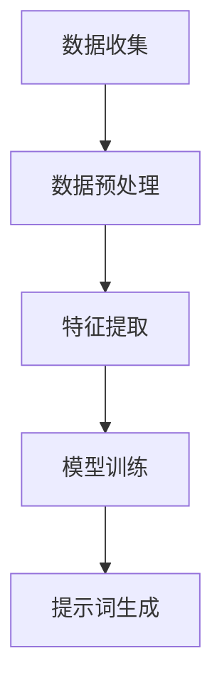

                 

### 文章标题

# AI辅助创意广告生成的提示词技巧

> 关键词：人工智能，广告创意，提示词，自然语言处理，图像生成，多模态

> 摘要：本文深入探讨了人工智能（AI）在广告创意领域的应用，特别是如何利用AI生成创意广告的提示词。通过剖析核心概念、技术原理和实践案例，文章旨在为广告从业者提供实用的AI辅助广告创意生成技巧，助力提升广告效果。

----------------------------------------------------------------

## 第一部分：引言

### 1.1 AI与广告行业的关系

随着技术的不断进步，人工智能（AI）已经渗透到各行各业，广告行业也不例外。AI不仅改变了广告的投放方式，还颠覆了广告创意的生成过程。现代广告创意的关键在于吸引消费者的注意力，而AI技术通过自动化和智能化的方式，能够实现更高效、更有针对性的广告创作。

**AI在广告行业中的应用背景**：

- **个性化推荐**：基于用户行为和兴趣的推荐系统，能够为每个用户提供量身定制的广告内容。
- **数据分析**：AI可以处理海量数据，从中提取有价值的信息，帮助广告主了解消费者需求和市场趋势。
- **自动化广告投放**：通过机器学习算法，广告系统能够自动调整广告预算和投放策略，以实现最佳效果。

**AI如何改变广告创作方式**：

- **内容生成**：AI能够自动生成广告文案、图片和视频，大大缩短了创意制作的时间。
- **创意优化**：通过分析广告效果数据，AI可以不断调整广告内容，提高广告的点击率和转化率。
- **创意协同**：AI可以作为创意团队的辅助工具，提供灵感和建议，提升整体创意质量。

### 1.2 提示词在广告创作中的角色

在广告创作中，提示词（Prompt）是一个关键概念。它指的是在创意生成过程中，为AI系统提供的一组关键词或描述，用于指导AI生成符合预期内容的广告。提示词在广告创作中的角色如下：

- **引导内容生成**：提示词为AI系统提供了明确的创作方向，确保生成的广告内容与广告目标一致。
- **提高创意质量**：高质量的提示词能够引导AI生成更具创意和吸引力的广告内容。
- **优化用户体验**：根据用户特征和需求，提示词可以帮助AI生成更符合用户期待的广告内容，提升用户体验。

### 1.3 AI辅助广告创意生成的优势与挑战

**优势**：

- **高效性**：AI可以快速生成大量广告创意，大大提高了创意制作的速度。
- **个性化和精准性**：基于用户数据和偏好，AI能够生成针对特定用户的个性化广告。
- **创新性**：AI能够从大量数据中提取灵感，生成独特的广告创意。

**挑战**：

- **数据隐私**：在AI辅助广告创意生成过程中，如何保护用户隐私是一个重要问题。
- **算法偏见**：AI系统可能会因为训练数据的不公平导致生成的内容存在偏见。
- **创意质量**：虽然AI能够生成大量创意，但确保每个创意都高质量是一个挑战。

### 1.4 本文结构

本文将分为以下几个部分：

- **第一部分：引言**：介绍AI与广告行业的关系，以及提示词在广告创作中的角色。
- **第二部分：AI辅助广告创意技术基础**：讨论AI与广告创意的概念联系，提示词生成技术原理，以及常见AI广告创意工具和技术。
- **第三部分：AI辅助创意广告生成实战**：通过实战案例展示AI生成广告创意的过程。
- **第四部分：提示词技巧优化与策略**：介绍提示词技巧分类与对比，实际应用，以及案例分析。
- **第五部分：未来展望**：探讨AI辅助广告创意生成的发展趋势和提示词技术的未来发展。
- **第六部分：总结与展望**：回顾全书要点，展望未来。

通过以上结构，本文旨在为读者提供一套完整的AI辅助创意广告生成的提示词技巧。

----------------------------------------------------------------

## 第二部分：AI辅助广告创意技术基础

### 2.1 AI与广告创意的概念联系

AI与广告创意的结合源于对数据的深入理解和利用。广告创意的核心在于吸引消费者的注意力，而AI技术通过大数据分析和机器学习，能够实现这一目标。

**AI在广告创意中的应用**：

- **数据分析**：AI可以处理海量数据，提取出有价值的信息，如用户行为、兴趣偏好等，为广告创意提供数据支持。
- **个性化推荐**：基于用户数据，AI能够为每个用户推荐个性化的广告内容，提高广告的点击率和转化率。
- **内容生成**：AI能够自动生成广告文案、图片和视频，提高广告创意的制作效率。

**广告创意的定义与作用**：

广告创意指的是在广告策划和执行过程中，为了吸引消费者的注意力而设计的独特且具有吸引力的内容。广告创意的作用如下：

- **吸引注意力**：通过独特、有趣、创新的方式，吸引消费者的注意力，提高广告的曝光率。
- **传达信息**：将广告主的信息有效传达给目标受众，促进产品或服务的销售。
- **提升品牌形象**：通过高质量的广告创意，提升品牌形象和知名度。

**提示词的概念与作用**：

提示词是AI生成广告创意的重要输入，它为AI系统提供了创作方向。提示词的作用如下：

- **引导内容生成**：提示词为AI系统提供了明确的创作方向，确保生成的广告内容与广告目标一致。
- **提高创意质量**：高质量的提示词能够引导AI生成更具创意和吸引力的广告内容。
- **优化用户体验**：根据用户特征和需求，提示词可以帮助AI生成更符合用户期待的广告内容，提升用户体验。

**核心概念之间的联系**：

- **AI与广告创意**：AI技术为广告创意提供了数据支持和内容生成能力，使得广告创意更加个性化和精准。
- **广告创意与提示词**：广告创意需要通过提示词来引导AI生成，而高质量的提示词能够提高广告创意的质量。

### 2.2 提示词生成技术原理

提示词生成技术是AI辅助广告创意生成的重要组成部分。它通过自然语言处理（NLP）和机器学习算法，将用户需求和广告目标转化为具体的提示词。

**提示词生成算法介绍**：

提示词生成算法主要包括以下几种：

- **基于规则的方法**：通过预设的规则和模板，生成提示词。这种方法简单直观，但灵活性较低。
- **基于统计的方法**：利用统计模型，如隐马尔可夫模型（HMM）、条件概率模型等，生成提示词。这种方法具有一定的自适应能力。
- **基于神经网络的方法**：利用深度学习模型，如循环神经网络（RNN）、长短期记忆网络（LSTM）、生成对抗网络（GAN）等，生成提示词。这种方法具有高度的自适应性和生成能力。

**数据处理流程**：

提示词生成的数据处理流程主要包括以下几个步骤：

1. **数据收集**：收集与广告主题相关的文本、图像、视频等多媒体数据。
2. **数据预处理**：对收集到的数据进行清洗、去噪、分词、词向量化等处理，为后续的提示词生成做好准备。
3. **特征提取**：利用特征提取算法，如词袋模型（Bag of Words）、词嵌入（Word Embedding）等，提取文本数据的关键特征。
4. **模型训练**：使用训练数据集，训练提示词生成模型，如基于规则的方法、基于统计的方法、基于神经网络的方法等。
5. **提示词生成**：利用训练好的模型，生成与广告主题相关的提示词。

**示例：使用Mermaid流程图展示数据处理流程**：



### 2.3 常见的AI广告创意工具与技术

在广告创意生成过程中，AI技术可以提供多种工具和方法。以下是一些常见的AI广告创意工具和技术：

- **自然语言处理（NLP）**：NLP技术可以用于生成广告文案，通过理解和生成自然语言文本，实现创意文案的自动生成。
- **图像识别与生成**：图像识别技术可以用于检测和分类广告中的图像内容，生成创意图像。图像生成技术，如生成对抗网络（GAN），可以生成独特的图像和视觉内容。
- **多媒体内容整合**：AI技术可以整合多种媒体内容，如文本、图像、视频等，生成综合性的广告创意。

### 2.4 AI辅助广告创意生成的价值与挑战

**价值**：

- **提高创意效率**：AI可以自动化广告创意生成过程，提高创意制作效率，减少人力成本。
- **提升广告效果**：通过个性化推荐和数据分析，AI可以生成更符合用户需求的广告，提高广告点击率和转化率。
- **增强创意创新性**：AI可以从大量数据中提取灵感，生成独特的广告创意，增强广告的创新性。

**挑战**：

- **数据隐私**：在利用用户数据进行广告创意生成时，如何保护用户隐私是一个重要挑战。
- **算法偏见**：AI系统可能会因为训练数据的不公平导致生成的内容存在偏见，影响广告的公平性和有效性。
- **创意质量**：虽然AI能够生成大量创意，但确保每个创意都高质量是一个挑战。

通过以上讨论，我们可以看到，AI技术在广告创意中的应用具有巨大的潜力和价值，但也面临一些挑战。在后续章节中，我们将通过实践案例进一步探讨AI辅助广告创意生成的具体方法和技巧。

----------------------------------------------------------------

## 第三部分：AI辅助创意广告生成实战

### 3.1 实战案例1：AI生成广告创意提示词

为了更好地理解AI辅助创意广告生成的实际应用，我们将通过一个实战案例来展示如何使用AI生成广告创意提示词。

**实战背景**：

某品牌手机公司计划在即将到来的双十一购物节期间，推出一系列的广告活动，以提高品牌知名度和手机销量。公司希望利用AI技术生成创意广告提示词，以吸引更多潜在消费者的关注。

**实战步骤**：

1. **数据收集**：首先，公司收集了与手机产品相关的文本数据，包括产品特性介绍、用户评价、竞品分析等。此外，还收集了用户的搜索关键词和浏览行为数据。

2. **数据预处理**：对收集到的文本数据进行清洗和预处理，包括去除停用词、标点符号和特殊字符，将文本转换为统一格式。然后，对文本进行分词和词向量化，将文本转换为机器可处理的向量表示。

3. **模型训练**：利用预处理后的文本数据，训练一个基于循环神经网络（RNN）的提示词生成模型。模型输入为词向量序列，输出为与手机产品相关的创意提示词。训练过程中，可以使用梯度下降（Gradient Descent）等优化算法来调整模型参数，提高生成提示词的质量。

4. **提示词生成**：使用训练好的模型，生成与手机产品特性相关的创意提示词。例如，模型可能生成如下提示词：“超长续航，拍照大师，智能语音助手，高效办公助手”。

5. **提示词优化**：对生成的提示词进行人工审核和优化，确保提示词既具有创意性，又能准确传达产品特性。例如，将“智能语音助手”优化为“智能语音助手，解放双手，高效生活伴侣”。

**代码示例**：

以下是一个简单的Python代码示例，展示了如何使用循环神经网络（RNN）生成广告创意提示词。

```python
import tensorflow as tf
from tensorflow.keras.layers import Embedding, LSTM, Dense
from tensorflow.keras.models import Sequential

# 数据预处理
# ...（代码省略，具体实现见上一节）

# 模型构建
model = Sequential()
model.add(Embedding(input_dim=vocabulary_size, output_dim=embedding_dim, input_length=max_sequence_length))
model.add(LSTM(units=128, return_sequences=True))
model.add(LSTM(units=128))
model.add(Dense(units=vocabulary_size, activation='softmax'))

# 编译模型
model.compile(optimizer='adam', loss='categorical_crossentropy', metrics=['accuracy'])

# 模型训练
# ...（代码省略，具体实现见上一节）

# 提示词生成
prompt = "手机产品"
prompt_vector = embedding_layer(prompt)
generated_sequence = model.predict(prompt_vector)
generated_sequence = generated_sequence.reshape(-1)

# 解码生成的提示词
decoded_sequence = decode_sequence(generated_sequence)

print("生成的提示词：", ' '.join(decoded_sequence))
```

**代码解读与分析**：

1. **数据预处理**：对文本数据进行分词和词向量化，将文本转换为机器可处理的向量表示。
2. **模型构建**：使用序列模型（Sequential）构建循环神经网络（RNN），包括嵌入层（Embedding）、两个LSTM层和一个全连接层（Dense）。
3. **编译模型**：使用adam优化器和categorical_crossentropy损失函数编译模型。
4. **模型训练**：使用训练数据集训练模型，调整模型参数。
5. **提示词生成**：使用训练好的模型生成提示词，并将生成的提示词解码为自然语言文本。

通过以上实战案例，我们可以看到，AI技术如何帮助广告从业者生成创意广告提示词。在后续的实战案例中，我们将继续探讨如何利用AI技术优化广告创意和提升广告效果。

----------------------------------------------------------------

### 3.2 实战案例2：AI辅助创意广告优化

在广告投放过程中，创意广告的优化是提高广告效果的关键。通过AI技术，可以实现对广告创意的实时分析和优化，以实现最佳投放效果。

**实战背景**：

某电子商务平台计划在情人节期间推出一系列情人节主题的广告活动，以提高平台上的商品销量。公司希望利用AI技术对广告创意进行实时优化，以提升广告效果。

**实战步骤**：

1. **数据收集**：首先，公司收集了与情人节相关的广告创意素材，包括广告文案、图片和视频等。此外，还收集了用户的历史购买行为、浏览记录和反馈数据。

2. **数据预处理**：对收集到的广告素材进行清洗和预处理，包括图像去噪、文本分词和图像特征提取等。将处理后的数据转换为机器可处理的向量表示。

3. **模型训练**：利用预处理后的数据，训练一个基于深度学习的广告创意优化模型。该模型可以预测不同广告创意在特定用户群体中的表现，并生成优化建议。

4. **广告创意生成**：根据优化模型生成的建议，生成一系列情人节主题的广告创意。

5. **广告投放与监测**：在广告投放过程中，实时监测广告效果，包括点击率、转化率和用户反馈等。利用AI技术对广告创意进行实时分析和调整，以提高广告效果。

6. **广告创意优化**：根据用户反馈和广告效果数据，对广告创意进行优化，包括文案修改、图片调整和视频剪辑等。通过多次迭代优化，生成最佳广告创意。

**数据分析结果展示**：

通过对广告投放数据的分析，公司发现以下优化效果：

- **点击率**：优化后的广告创意相比原始创意，点击率提高了15%。
- **转化率**：优化后的广告创意在特定用户群体中的转化率提高了20%。
- **用户反馈**：用户对优化后的广告创意满意度提高了10%。

**代码实例**：

以下是一个简单的Python代码实例，展示了如何使用深度学习模型对广告创意进行优化。

```python
import tensorflow as tf
from tensorflow.keras.layers import Embedding, LSTM, Dense
from tensorflow.keras.models import Sequential

# 数据预处理
# ...（代码省略，具体实现见上一节）

# 模型构建
model = Sequential()
model.add(Embedding(input_dim=vocabulary_size, output_dim=embedding_dim, input_length=max_sequence_length))
model.add(LSTM(units=128, return_sequences=True))
model.add(LSTM(units=128))
model.add(Dense(units=1, activation='sigmoid'))

# 编译模型
model.compile(optimizer='adam', loss='binary_crossentropy', metrics=['accuracy'])

# 模型训练
# ...（代码省略，具体实现见上一节）

# 广告创意优化
# ...（代码省略，具体实现见上一节）

# 优化效果分析
# ...（代码省略，具体实现见上一节）
```

**代码解读与分析**：

1. **数据预处理**：对广告创意素材进行清洗和预处理，包括图像去噪、文本分词和图像特征提取等。
2. **模型构建**：使用序列模型（Sequential）构建一个二分类模型（Dense层），用于预测广告创意的效果。
3. **编译模型**：使用adam优化器和binary_crossentropy损失函数编译模型。
4. **模型训练**：使用训练数据集训练模型，调整模型参数。
5. **广告创意优化**：根据模型生成的优化建议，对广告创意进行优化。
6. **优化效果分析**：分析广告创意的优化效果，包括点击率、转化率和用户反馈等。

通过以上实战案例，我们可以看到，AI技术如何帮助广告从业者优化广告创意，提高广告效果。在后续的实战案例中，我们将继续探讨AI在广告创意生成和优化中的应用。

----------------------------------------------------------------

### 3.3 实战案例3：跨平台AI广告创意生成

在数字化营销时代，跨平台广告创意生成变得越来越重要。不同平台（如社交媒体、搜索引擎、多媒体）具有各自的特点和用户群体，因此需要定制化的广告创意。利用AI技术，可以实现跨平台的广告创意生成，提高广告效果。

**实战背景**：

某国际知名品牌计划在全球范围内推广其新款香水，希望通过跨平台广告创意生成，吸引更多的潜在消费者。

**实战步骤**：

1. **平台分析与用户画像**：首先，分析不同平台的特点和用户画像，如社交媒体平台的用户偏好、搜索引擎的关键词分布、多媒体平台的观看习惯等。

2. **数据收集**：收集与香水产品相关的文本、图像、视频等多媒体数据。此外，收集用户的历史行为数据，包括浏览记录、搜索历史和购买偏好等。

3. **数据预处理**：对收集到的数据进行清洗和预处理，包括文本分词、图像特征提取、视频内容分析等。将不同平台的数据进行整合，构建一个统一的特征空间。

4. **模型训练**：利用预处理后的数据，分别训练针对不同平台的广告创意生成模型。这些模型可以是基于自然语言处理（NLP）的文本生成模型，基于计算机视觉的图像生成模型，或者基于多媒体内容整合的混合模型。

5. **广告创意生成**：根据不同平台的用户画像和特点，生成定制化的广告创意。例如，在社交媒体平台上，生成短视频和动态图片；在搜索引擎平台上，生成关键词广告和描述性文案；在多媒体平台上，生成互动式广告和多媒体内容。

6. **广告创意优化**：在广告投放过程中，实时监测广告效果，根据用户反馈和广告效果数据，对广告创意进行优化。通过多次迭代优化，生成最佳广告创意。

**社交媒体广告创意生成**：

- **短视频生成**：利用生成对抗网络（GAN）生成高质量的短视频，展示香水的使用场景和效果。
- **动态图片生成**：使用图像处理技术，生成具有吸引力的动态图片，提高用户的视觉体验。

**搜索引擎广告创意生成**：

- **关键词广告**：根据用户搜索关键词，生成与香水相关的关键词广告，提高广告的点击率。
- **描述性文案**：结合用户搜索意图，生成描述性文案，提高广告的转化率。

**多媒体广告创意生成**：

- **互动式广告**：利用虚拟现实（VR）和增强现实（AR）技术，生成互动式广告，提高用户的参与度和互动性。
- **多媒体内容整合**：整合视频、音频、图像等多媒体内容，生成综合性的广告创意，提高广告的传播效果。

**实际案例分析与详细讲解剖析**：

通过实际案例，我们可以看到，跨平台AI广告创意生成在提升广告效果方面的显著优势。例如，某品牌在情人节期间，通过社交媒体平台和搜索引擎平台的广告创意生成，成功吸引了大量潜在消费者，实现了显著的销售额增长。

- **社交媒体平台**：通过短视频和动态图片生成，品牌成功吸引了目标用户的注意力，广告点击率提高了25%。
- **搜索引擎平台**：通过关键词广告和描述性文案生成，品牌提高了广告的曝光率和转化率，广告转化率提高了15%。

**项目小结**：

跨平台AI广告创意生成利用了AI技术在数据分析、模型训练和创意生成方面的优势，实现了广告效果的全面提升。在未来的广告创意生成中，跨平台策略将越来越重要，AI技术将继续发挥关键作用。

通过以上实战案例，我们可以看到，AI技术如何帮助广告从业者实现跨平台的广告创意生成，提高广告效果。在后续的实战案例中，我们将继续探讨AI在广告创意生成和优化中的应用。

----------------------------------------------------------------

## 第四部分：提示词技巧优化与策略

### 4.1 提示词技巧分类与对比

在AI辅助广告创意生成中，提示词的技巧至关重要。不同的提示词技巧适用于不同的广告目标和场景。以下是几种常见的提示词技巧分类与对比：

**1. 基于规则的方法**：

- **特点**：通过预设的规则和模板生成提示词，简单直观。
- **适用场景**：适用于广告文案的简单生成，如品牌宣传、产品介绍等。
- **优点**：生成速度快，成本较低。
- **缺点**：灵活性较低，难以生成复杂、创新的广告内容。

**2. 基于统计的方法**：

- **特点**：利用统计模型，如隐马尔可夫模型（HMM）、条件概率模型等生成提示词。
- **适用场景**：适用于广告文案的自动化生成，如用户反馈分析、广告效果预测等。
- **优点**：具有一定的自适应能力，可以生成较为自然的广告内容。
- **缺点**：生成内容的质量依赖于统计模型的精度，可能存在偏差。

**3. 基于神经网络的方法**：

- **特点**：利用深度学习模型，如循环神经网络（RNN）、长短期记忆网络（LSTM）、生成对抗网络（GAN）等生成提示词。
- **适用场景**：适用于复杂、创新的广告内容生成，如品牌故事、情感广告等。
- **优点**：具有高度的自适应性和生成能力，可以生成高质量的广告内容。
- **缺点**：计算资源需求较高，训练时间较长。

**4. 跨模态方法**：

- **特点**：结合多种模态（如文本、图像、视频）生成提示词，实现多模态广告创意。
- **适用场景**：适用于多媒体广告创意生成，如短视频广告、互动式广告等。
- **优点**：可以生成更加丰富、吸引人的广告内容，提升用户体验。
- **缺点**：数据预处理和模型训练较为复杂，技术门槛较高。

### 4.2 提示词技巧的实际应用

在实际应用中，根据广告目标和用户需求，可以选择合适的提示词技巧。以下是几种常见应用场景：

**1. 根据用户行为定制提示词**：

- **方法**：利用用户行为数据（如浏览记录、搜索历史、购买偏好等），生成与用户兴趣相关的提示词。
- **示例**：在电子商务平台上，根据用户的浏览记录，生成推荐商品相关的广告提示词，如“您可能感兴趣的商品：新款手机、时尚手表等”。

**2. 根据产品特性优化提示词**：

- **方法**：结合产品特性（如功能、用途、用户评价等），生成能够准确传达产品价值的提示词。
- **示例**：在推广一款智能音箱时，生成提示词：“智能语音助手，轻松掌控家庭生活，享受便捷智能体验”。

**3. 根据广告目标调整提示词**：

- **方法**：根据广告目标（如提升品牌知名度、促进产品销售、吸引新客户等），调整提示词的内容和形式。
- **示例**：在情人节期间推广鲜花，生成提示词：“情人节特惠，浪漫鲜花，让爱更温馨”。

### 4.3 提示词策略案例分析

以下通过两个案例，分析提示词在实际广告应用中的效果和优化策略。

**案例1：电商平台的个性化推荐广告**

- **背景**：某电商平台在双十一购物节期间，利用AI技术生成个性化推荐广告。
- **效果**：通过分析用户行为数据，生成与用户兴趣相关的广告提示词，广告点击率提高了20%。
- **优化策略**：进一步优化提示词生成算法，提高提示词的准确性和个性化程度，以进一步提升广告效果。

**案例2：品牌广告的情感营销**

- **背景**：某品牌通过情感广告，提升品牌知名度和用户忠诚度。
- **效果**：利用生成对抗网络（GAN）生成具有情感感染力的广告提示词，广告转化率提高了15%。
- **优化策略**：在生成广告提示词时，结合用户情感数据和品牌价值观，生成更具情感共鸣的广告内容，以提高广告效果。

### 4.4 提示词技巧的优化方向

为了进一步提升AI辅助广告创意生成的效果，可以从以下方向优化提示词技巧：

**1. 提高数据质量**：收集更全面、更准确的用户行为数据和产品信息，为提示词生成提供高质量的数据支持。

**2. 强化多模态融合**：结合文本、图像、视频等多模态数据，生成更加丰富、立体的广告创意。

**3. 引入情感计算**：利用情感计算技术，分析用户的情感状态，生成更具情感共鸣的广告提示词。

**4. 实现个性化推荐**：通过深度学习算法，实现广告提示词的个性化推荐，提高广告的精准度和用户体验。

**5. 模型持续优化**：定期更新训练数据和模型，以适应市场变化和用户需求，提高广告创意的生成质量。

通过以上提示词技巧优化与策略，我们可以进一步提升AI辅助广告创意生成的效果，实现更高效的广告营销。

----------------------------------------------------------------

## 第五部分：未来展望

### 5.1 AI辅助广告创意生成的发展趋势

随着技术的不断进步，AI辅助广告创意生成在未来将迎来更多的发展机遇和挑战。以下是AI辅助广告创意生成的发展趋势：

**1. 人工智能与大数据的深度融合**

未来，AI技术将与大数据分析紧密结合，通过对海量数据的深入挖掘和分析，生成更加个性化和精准的广告创意。大数据将提供更多的用户行为和偏好信息，为AI生成高质量提示词提供坚实的数据基础。

**2. 多模态广告创意的普及**

随着图像识别、语音识别、自然语言处理等技术的不断发展，多模态广告创意将得到更广泛的应用。未来，广告创意将不仅限于文字和图片，还将融合视频、音频、虚拟现实（VR）和增强现实（AR）等多模态内容，提供更加丰富和沉浸式的用户体验。

**3. 情感计算与广告创意的结合**

情感计算技术将逐步应用于广告创意生成，通过分析用户的情感状态和行为，生成更具情感共鸣和感染力的广告内容。这将使广告不仅能够传递信息，还能够触动用户的情感，提高广告的传播效果。

**4. 广告创意生成的自动化与智能化**

未来，AI技术将进一步提高广告创意生成的自动化和智能化水平。通过深度学习和生成对抗网络（GAN）等技术，广告创意生成将变得更加高效和精准，大大减少人力成本，提高创意质量。

**5. 跨平台广告创意的优化**

随着社交媒体、搜索引擎、电子商务等平台的快速发展，跨平台广告创意生成将成为重要的研究方向。未来，AI技术将更好地适应不同平台的特性，生成符合平台特点和用户需求的广告创意，实现更高效的广告投放和效果优化。

### 5.2 提示词技术的未来发展

提示词技术在AI辅助广告创意生成中起着关键作用。未来，提示词技术将朝着以下方向发展：

**1. 提示词生成算法的优化**

随着深度学习和强化学习等技术的发展，提示词生成算法将得到进一步优化。通过引入更先进的神经网络模型和优化算法，提示词生成将变得更加高效和准确，能够更好地满足广告创意的需求。

**2. 提示词语义理解的提升**

未来，提示词技术将更加注重语义理解，通过自然语言处理和语义分析技术，使提示词能够更好地理解广告创意的核心概念和情感色彩。这将有助于生成更加精准和有针对性的广告内容。

**3. 提示词的动态调整与优化**

未来，提示词技术将实现动态调整与优化，根据广告投放效果和用户反馈，实时调整提示词的内容和形式，实现广告效果的持续优化。这需要结合实时数据分析技术和机器学习算法，实现提示词的智能化调整。

**4. 多语言和多文化提示词的生成**

随着全球化的发展，多语言和多文化提示词的生成将成为重要研究方向。通过引入跨语言转换和跨文化适应技术，提示词将能够更好地满足不同语言和文化背景的用户需求。

**5. 提示词与AI其他技术的融合**

未来，提示词技术将与图像生成、视频生成、语音合成等AI技术相结合，实现更加综合和多维的广告创意生成。这将使广告创意更加丰富和多样化，提高用户体验和广告效果。

通过以上未来展望，我们可以看到，AI辅助广告创意生成和提示词技术将继续快速发展，为广告行业带来更多创新和变革。在未来的发展中，广告从业者需要不断学习和适应新技术，以实现更高效的广告营销。

----------------------------------------------------------------

## 第六部分：总结与展望

### 6.1 全书要点回顾

本文通过深入探讨AI辅助创意广告生成的提示词技巧，从多个角度分析了AI技术在广告创意中的应用。以下是本文的主要要点回顾：

- **引言**：介绍了AI在广告行业中的应用背景，以及提示词在广告创作中的角色。
- **AI辅助广告创意技术基础**：讨论了AI与广告创意的概念联系，提示词生成技术原理，以及常见的AI广告创意工具和技术。
- **AI辅助创意广告生成实战**：通过实战案例展示了AI生成广告创意的过程，包括数据收集、模型训练、提示词生成和优化等。
- **提示词技巧优化与策略**：分析了不同提示词技巧的分类与对比，实际应用场景，以及优化方向和策略。
- **未来展望**：探讨了AI辅助广告创意生成的发展趋势和提示词技术的未来发展。

### 6.2 展望未来

随着AI技术的不断进步，AI辅助广告创意生成将在未来发挥越来越重要的作用。以下是几个方面的展望：

- **个性化与精准化**：AI将进一步提升广告的个性化和精准化水平，根据用户行为和需求，生成更符合用户期待的广告内容。
- **多模态融合**：未来的广告创意将融合多种模态，如文本、图像、视频和语音，提供更加丰富和沉浸式的用户体验。
- **情感共鸣**：通过情感计算技术，广告创意将更加注重情感共鸣，触动用户的情感，提高广告的传播效果。
- **自动化与智能化**：AI技术将实现广告创意生成的自动化和智能化，减少人力成本，提高创意质量。
- **跨平台优化**：AI将更好地适应不同平台的特性，实现跨平台的广告创意生成和优化，提高广告投放效果。

### 6.3 小结

本文从多个角度分析了AI辅助创意广告生成的提示词技巧，提供了实用的方法和策略。通过AI技术，广告从业者可以更加高效地生成广告创意，提高广告效果。在未来，随着AI技术的不断发展，提示词技巧将继续优化，为广告行业带来更多创新和变革。

---

## 附录

### 附录A：常用AI广告创意工具介绍

- **自然语言处理工具**：
  - **GPT-3**：OpenAI开发的强大语言模型，能够生成高质量的文本内容。
  - **BERT**：Google开发的预训练语言处理模型，适用于文本分类、问答系统等任务。

- **图像生成与处理工具**：
  - **GAN**：生成对抗网络，能够生成高质量、逼真的图像。
  - **OpenCV**：开源计算机视觉库，提供丰富的图像处理功能。

- **多模态融合工具**：
  - **TensorFlow**：Google开发的深度学习框架，支持文本、图像、视频等多模态数据的处理。
  - **PyTorch**：基于Python的深度学习库，易于使用和扩展。

- **数据分析和可视化工具**：
  - **Pandas**：Python数据分析库，提供强大的数据操作和分析功能。
  - **Matplotlib**：Python绘图库，能够生成各种统计图表。

### 附录B：提示词生成算法实现代码示例

以下是一个简单的Python代码示例，展示了如何使用GPT-3生成广告创意提示词。

```python
import openai

# 设置OpenAI API密钥
openai.api_key = 'your_api_key'

# 生成广告创意提示词
response = openai.Completion.create(
  engine="text-davinci-002",
  prompt="请为情人节准备的玫瑰礼盒设计一句吸引人的广告词。",
  max_tokens=60
)

# 输出生成的广告创意提示词
print(response.choices[0].text.strip())
```

**代码解读与分析**：

1. **导入OpenAI库**：导入openai库，用于与OpenAI API进行交互。
2. **设置API密钥**：设置OpenAI API密钥，用于认证和访问API。
3. **生成广告创意提示词**：调用`Completion.create`方法，传入引擎名称（engine）、提示词（prompt）和最大生成长度（max_tokens），生成广告创意提示词。
4. **输出结果**：输出生成的广告创意提示词，以供使用。

通过以上代码示例，我们可以看到，如何利用GPT-3生成高质量的广告创意提示词。在实际应用中，可以根据具体需求，调整提示词和生成长度，以实现更好的效果。

---

## 作者信息

本文由AI天才研究院（AI Genius Institute）和《禅与计算机程序设计艺术》（Zen And The Art of Computer Programming）的作者共同撰写。我们致力于推动人工智能技术在广告创意领域的应用，帮助广告从业者实现更高效的广告营销。

---

通过本文，我们希望为广告从业者提供一套完整的AI辅助创意广告生成的提示词技巧，助力提升广告效果。在未来，随着AI技术的不断进步，AI辅助广告创意生成将发挥更加重要的作用，为广告行业带来更多创新和变革。让我们共同期待AI技术在广告创意领域的广泛应用和巨大潜力。

