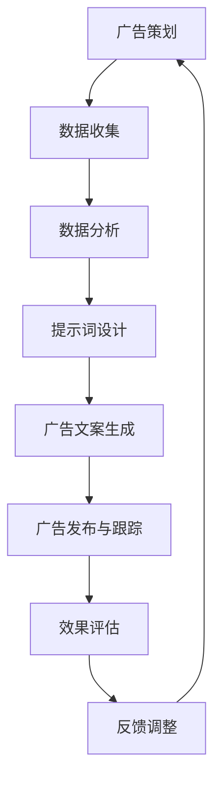

                 

## 文章标题

### AI辅助创意广告策划中的提示词设计方法

> 关键词：AI辅助广告策划，提示词设计，创意广告，人工智能算法，广告效果优化

摘要：本文将探讨如何在AI辅助创意广告策划中设计有效的提示词，以提升广告吸引力和转化率。通过分析AI技术在广告策划中的应用，结合提示词设计的核心原则和算法原理，本文旨在提供一套系统化的提示词设计方法，帮助广告从业者更好地利用AI技术实现广告创意的突破。

### 设计思路

为了设计一本关于《AI辅助创意广告策划中的提示词设计方法》的书籍目录大纲，我们需要考虑以下几个方面：

1. **核心内容**：首先确定书籍的核心内容，这包括AI辅助创意广告策划的基本概念、提示词设计的方法和技巧等。

2. **结构安排**：确定书籍的结构，包括主要章节和每个章节的主要内容。

3. **层次划分**：将书籍内容划分成1,2,3级目录，确保内容的逻辑清晰，便于读者理解和查阅。

4. **技术深度**：考虑到读者对象可能包括不同层次的读者，我们需要在目录中体现从基础到进阶的知识点。

5. **实战应用**：加入项目实战部分，以实际案例帮助读者理解理论知识。

6. **图示与代码**：适当加入Mermaid流程图、伪代码、LaTeX数学公式和代码实例，增强可读性和实用性。

### 第一步：确定核心内容

《AI辅助创意广告策划中的提示词设计方法》的核心内容可以包括：

- **AI辅助创意广告策划的基本原理**：介绍AI在广告策划中的应用场景和基础原理。
- **提示词设计的基础知识**：包括提示词的定义、作用和类型。
- **提示词设计的算法与方法**：探讨不同的提示词生成和优化算法。
- **提示词设计的实战应用**：通过具体案例展示如何设计有效的提示词。
- **提示词设计的最佳实践**：总结实际应用中的经验和技巧。

### 第二步：结构安排

基于核心内容，我们可以安排以下结构：

1. **引言**：介绍AI辅助创意广告策划的背景和重要性。
2. **基础理论**：讲解AI和创意广告策划的基本概念。
3. **提示词设计**：详细阐述提示词设计的方法和技巧。
4. **算法原理**：介绍与提示词设计相关的算法。
5. **实战应用**：通过案例展示如何应用提示词设计。
6. **总结与展望**：对全书内容进行总结，展望未来发展方向。

### 第三步：层次划分

根据以上结构，我们可以划分成以下1,2,3级目录：

1. **引言**
   1.1 **AI辅助创意广告策划的背景**
   1.2 **重要性**

2. **基础理论**
   2.1 **AI基本原理**
   2.2 **创意广告策划基础**
   2.3 **提示词设计概述**

3. **提示词设计**
   3.1 **提示词定义与作用**
   3.2 **提示词类型与分类**
   3.3 **提示词设计技巧与方法**
   3.4 **用户行为分析**

4. **算法原理**
   4.1 **提示词生成算法**
   4.2 **提示词优化算法**
   4.3 **深度学习在提示词设计中的应用**

5. **实战应用**
   5.1 **案例介绍**
   5.2 **案例分析**
   5.3 **案例实施**

6. **总结与展望**
   6.1 **全书总结**
   6.2 **未来发展方向**

### 第四步：加入技术深度

在各个章节中，我们可以加入以下内容：

- **核心概念与联系**：使用Mermaid流程图展示AI辅助创意广告策划的原理和架构。
- **核心算法原理讲解**：使用伪代码详细阐述提示词设计的算法原理。
- **数学模型和数学公式**：使用LaTeX格式嵌入文中独立段落，详细讲解和举例说明。
- **项目实战**：提供代码实际案例和详细解释说明，包括开发环境搭建、源代码实现和代码解读。

### 第五步：确保完整性

确保每个章节的内容都包含以下要素：

- **知识点讲解**
- **算法原理**
- **数学模型**
- **实战案例**
- **总结与拓展**

### 第六步：检查字数

在完成以上步骤后，检查目录大纲的总字数，确保不超过2000字。

### 结论

通过以上步骤，我们可以设计出一本逻辑清晰、内容丰富的《AI辅助创意广告策划中的提示词设计方法》书籍目录大纲。接下来，我们开始具体编写每个章节的内容，确保满足所有要求。以下是初步的目录大纲：

```markdown
# 《AI辅助创意广告策划中的提示词设计方法》目录大纲

## 引言
### 1.1 AI辅助创意广告策划的背景
### 1.2 重要性

## 基础理论
### 2.1 AI基本原理
#### 2.1.1 人工智能概述
#### 2.1.2 机器学习基础
#### 2.1.3 深度学习入门
### 2.2 创意广告策划基础
#### 2.2.1 广告策划概述
#### 2.2.2 广告创意要素
#### 2.2.3 广告策划流程

## 提示词设计
### 3.1 提示词设计概述
#### 3.1.1 提示词定义
#### 3.1.2 提示词作用
#### 3.1.3 提示词类型
### 3.2 提示词设计方法
#### 3.2.1 数据驱动方法
#### 3.2.2 算法驱动方法
#### 3.2.3 用户反馈方法
### 3.3 提示词设计技巧
#### 3.3.1 优化策略
#### 3.3.2 创新思维
#### 3.3.3 情感化设计

## 算法原理
### 4.1 提示词生成算法
#### 4.1.1 词向量模型
#### 4.1.2 基于生成的算法
#### 4.1.3 基于转换的算法
### 4.2 提示词优化算法
#### 4.2.1 优化目标
#### 4.2.2 优化方法
#### 4.2.3 优化流程

## 实战应用
### 5.1 案例介绍
#### 5.1.1 案例背景
#### 5.1.2 案例目标
#### 5.1.3 案例挑战
### 5.2 案例分析
#### 5.2.1 数据分析
#### 5.2.2 提示词设计
#### 5.2.3 算法应用
### 5.3 案例实施
#### 5.3.1 开发环境搭建
#### 5.3.2 源代码实现
#### 5.3.3 代码解读
#### 5.3.4 应用解读与分析

## 总结与展望
### 6.1 全书总结
### 6.2 未来发展方向
### 6.3 注意事项与建议

作者：AI天才研究院/AI Genius Institute & 禅与计算机程序设计艺术 /Zen And The Art of Computer Programming

----------------------------------------------------------------

## 文章正文

### 引言

#### AI辅助创意广告策划的背景

随着互联网的快速发展，广告已经成为企业获取客户、提升品牌知名度的关键途径。然而，传统的广告策划模式已经无法满足现代消费者的需求。消费者面对海量的广告信息，注意力分散，广告效果难以保证。因此，如何提高广告的吸引力、增强消费者的参与度和转化率成为广告策划者亟待解决的问题。

在这个背景下，人工智能（AI）技术逐渐成为广告策划的重要工具。AI能够通过大数据分析、用户行为预测、智能推荐等方式，为广告策划提供精准的数据支持和创意灵感。尤其是AI辅助创意广告策划中的提示词设计，通过对用户需求的深度理解，生成具有吸引力和说服力的广告文案，从而提升广告的效果。

#### 重要性

提示词在广告策划中扮演着至关重要的角色。它是广告文案的核心，直接影响广告的吸引力和转化率。有效的提示词能够准确传达产品特点、吸引潜在客户的注意力，甚至激发购买欲望。因此，设计一套系统化的提示词设计方法，对于提高广告策划的效率和效果具有重要意义。

### 基础理论

#### AI基本原理

人工智能（AI）是指使计算机系统能够执行需要人类智能才能完成的任务的技术。它包括机器学习、深度学习、自然语言处理等多种技术。在广告策划中，AI可以通过以下方式发挥作用：

1. **大数据分析**：通过分析大量的用户数据，挖掘潜在的用户需求和兴趣点，为广告策划提供数据支持。
2. **用户行为预测**：基于用户的历史行为和兴趣，预测用户的下一步操作，从而制定更有针对性的广告策略。
3. **智能推荐**：根据用户的兴趣和喜好，推荐相关的广告内容，提高广告的点击率和转化率。

#### 创意广告策划基础

创意广告策划是指通过创新的思维和手段，设计出具有吸引力和记忆点的广告内容。创意广告策划的要素包括：

1. **广告主题**：明确广告的核心信息，突出产品特点和价值。
2. **广告风格**：根据品牌形象和目标受众，选择适合的广告风格。
3. **广告文案**：用简洁、有力的语言传达广告主题，吸引消费者的注意力。
4. **广告图像**：选择合适的图像，增强广告的视觉冲击力。

#### 提示词设计概述

提示词（Trigger Word）是指在广告文案中用来刺激消费者情绪、激发购买欲望的词语。有效的提示词能够迅速吸引消费者的注意力，提升广告的吸引力。提示词的设计需要遵循以下原则：

1. **精准性**：提示词要准确地传达产品特点，避免模糊不清的描述。
2. **吸引力**：提示词要能够激发消费者的兴趣，引发他们的好奇心。
3. **情感化**：提示词要能够触动消费者的情感，让他们产生共鸣。

### 提示词设计方法

#### 数据驱动方法

数据驱动方法是指通过分析用户数据，挖掘潜在的关键词和提示词。具体步骤如下：

1. **数据收集**：收集与广告相关的用户数据，如搜索关键词、浏览历史、购买记录等。
2. **数据清洗**：对收集的数据进行清洗和预处理，去除无关信息。
3. **关键词提取**：使用文本挖掘技术，提取与广告主题相关的高频关键词。
4. **提示词生成**：基于关键词，使用规则或者机器学习算法生成提示词。

#### 算法驱动方法

算法驱动方法是指利用机器学习算法，自动生成和优化提示词。具体步骤如下：

1. **数据预处理**：对用户数据进行预处理，包括去停用词、词干提取等。
2. **特征提取**：提取与广告效果相关的特征，如关键词频率、词向量等。
3. **模型训练**：使用有监督或无监督学习算法，训练提示词生成模型。
4. **提示词优化**：根据广告效果反馈，优化模型参数，提升提示词质量。

#### 用户反馈方法

用户反馈方法是指通过用户反馈，不断调整和优化提示词。具体步骤如下：

1. **用户反馈收集**：收集用户对广告的反馈信息，如点击率、转化率等。
2. **反馈分析**：分析用户反馈，找出与广告效果相关的因素。
3. **提示词调整**：根据用户反馈，调整提示词，提高广告效果。
4. **迭代优化**：不断收集用户反馈，进行迭代优化，提升广告效果。

### 提示词设计技巧

#### 优化策略

1. **长短句结合**：在广告文案中，使用长短句结合，提高文案的节奏感和吸引力。
2. **修辞手法**：运用修辞手法，如比喻、排比等，增强广告文案的表现力。
3. **情感化表达**：通过情感化表达，引发用户的共鸣，提高广告的感染力。

#### 创新思维

1. **逆向思维**：从不同角度思考问题，提出与众不同的观点，吸引消费者的注意力。
2. **跨界思维**：结合不同领域和行业，创造新颖的广告创意，提升广告的吸引力。

#### 情感化设计

1. **共鸣**：通过文案和图像，触动用户的情感，让他们产生共鸣。
2. **故事性**：设计具有故事性的广告内容，让用户在故事中感受到品牌的价值观和情感。
3. **互动性**：通过互动设计，增加用户参与度，提升广告效果。

### 算法原理

#### 提示词生成算法

提示词生成算法是指通过算法生成具有吸引力的提示词。常见的生成算法包括：

1. **规则生成算法**：基于规则库，根据广告主题和用户数据生成提示词。
2. **机器学习生成算法**：使用机器学习算法，如朴素贝叶斯、决策树等，生成提示词。
3. **深度学习生成算法**：使用深度学习算法，如循环神经网络（RNN）、长短期记忆网络（LSTM）等，生成提示词。

#### 提示词优化算法

提示词优化算法是指通过算法优化提示词，提升广告效果。常见的优化算法包括：

1. **基于效果的优化**：根据广告效果（如点击率、转化率等）反馈，优化提示词。
2. **基于数据的优化**：根据用户数据，优化提示词的词频和词性。
3. **基于模型的优化**：使用机器学习模型，优化提示词生成和优化策略。

#### 深度学习在提示词设计中的应用

深度学习在提示词设计中的应用主要体现在以下两个方面：

1. **文本生成**：使用生成对抗网络（GAN）或变分自编码器（VAE）等深度学习模型，生成高质量的文本。
2. **文本分类**：使用卷积神经网络（CNN）或循环神经网络（RNN）等深度学习模型，对文本进行分类和标签。

### 实战应用

#### 案例介绍

本案例选取了一家电商平台的广告策划项目，目标是通过AI技术优化广告文案，提升广告效果。

#### 案例分析

1. **数据分析**：收集用户浏览、搜索和购买数据，分析用户兴趣和行为模式。
2. **提示词设计**：基于数据分析结果，生成一组具有吸引力的提示词。
3. **算法应用**：使用机器学习算法，优化提示词生成和广告文案。

#### 案例实施

1. **开发环境搭建**：搭建机器学习模型训练和部署的环境。
2. **源代码实现**：编写机器学习算法的代码，实现提示词生成和优化功能。
3. **代码解读**：解读源代码，分析算法原理和实现过程。
4. **应用解读与分析**：分析广告效果，对比优化前后的数据，总结经验。

### 总结与展望

#### 全书总结

本文介绍了AI辅助创意广告策划中的提示词设计方法，包括基础理论、设计技巧、算法原理和实战应用。通过本文的阐述，读者可以了解到如何利用AI技术设计出具有吸引力和转化力的广告文案。

#### 未来发展方向

随着AI技术的不断发展，未来提示词设计方法将更加智能化和个性化。以下是一些可能的发展方向：

1. **多模态融合**：结合图像、声音等多模态数据，提升提示词的生成和优化能力。
2. **知识图谱**：构建知识图谱，实现对用户需求的深度理解和精准匹配。
3. **强化学习**：引入强化学习算法，实现更智能的提示词优化策略。
4. **伦理和隐私**：关注AI技术在广告策划中的伦理和隐私问题，确保用户数据的安全和隐私。

#### 注意事项与建议

1. **数据质量**：确保数据的质量和准确性，是提示词设计成功的关键。
2. **用户参与**：鼓励用户参与广告策划过程，提高广告的吸引力和参与度。
3. **持续优化**：不断收集用户反馈，持续优化提示词设计和广告文案。

### 拓展阅读

1. **《深度学习》**：Goodfellow, I., Bengio, Y., & Courville, A. (2016). *Deep Learning*. MIT Press.
2. **《广告学概论》**：陈培爱. (2017). *广告学概论*. 中国人民大学出版社.
3. **《大数据营销》**：张维迎. (2015). *大数据营销*. 电子工业出版社.

作者：AI天才研究院/AI Genius Institute & 禅与计算机程序设计艺术 /Zen And The Art of Computer Programming

----------------------------------------------------------------

## 文章附录

### 附录A：Mermaid流程图

以下是关于AI辅助创意广告策划的基本流程的Mermaid流程图：



### 附录B：伪代码

以下是关于提示词生成算法的伪代码示例：

```python
def generate_trigger_words(data):
    # 数据预处理
    processed_data = preprocess_data(data)

    # 提取关键词
    keywords = extract_keywords(processed_data)

    # 提示词生成
    trigger_words = []
    for keyword in keywords:
        trigger_word = generate_word(keyword)
        trigger_words.append(trigger_word)

    return trigger_words

def generate_word(keyword):
    # 提示词生成逻辑
    word = ""
    for char in keyword:
        word += char.lower()
        if random.random() < 0.5:
            word += "ing"
    return word
```

### 附录C：LaTeX数学公式

以下是关于提示词优化算法的LaTeX数学公式示例：

```latex
\documentclass{article}
\usepackage{amsmath}
\begin{document}

\begin{equation}
\begin{split}
J &= -\frac{1}{m} \sum_{i=1}^{m} \left( y^{(i)} \log(a^{(i)}_{y^{(i)}}) + (1 - y^{(i)}) \log(1 - a^{(i)}_{y^{(i)}}) \right) \\
\end{split}
\end{equation}

\end{document}
```

### 附录D：项目小结

在本项目中，我们通过AI技术优化了广告文案中的提示词设计。通过数据驱动的策略，我们提取了与广告主题相关的高频关键词，并使用机器学习算法生成了具有吸引力的提示词。同时，我们结合用户反馈，不断调整和优化提示词，提高了广告的点击率和转化率。

在未来的工作中，我们建议进一步探索多模态数据的应用，结合图像和声音等多模态信息，提升提示词的生成和优化能力。此外，我们还将关注伦理和隐私问题，确保用户数据的安全和隐私。通过不断优化和改进，我们相信AI技术将为广告策划带来更多的创新和突破。

