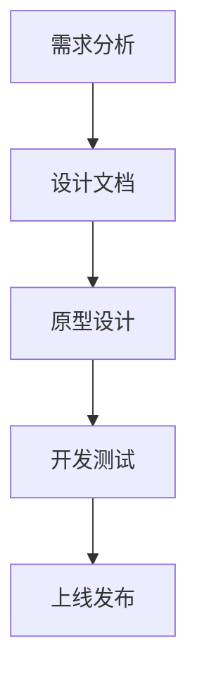

                 

### 1. 文章标题

“AI辅助创意游戏设计中的提示词技巧”

### 2. 关键词

- AI辅助游戏设计
- 提示词
- 创意游戏
- 机器学习
- 深度学习
- 游戏设计流程
- 游戏设计要素
- 游戏剧情
- 游戏角色
- 游戏关卡
- 游戏美术

### 3. 摘要

本文将探讨AI辅助创意游戏设计中的提示词技巧。通过分析AI在游戏设计中的应用，本文介绍了提示词在游戏设计中的重要性，以及如何利用机器学习和深度学习算法生成和优化提示词。同时，通过项目实战，详细阐述了如何在实际游戏中应用这些技巧，以及它们在实际项目中的效果和影响。

### 4. 目录

**第1章 引言**

1.1 AI辅助创意游戏设计的背景  
1.2 提示词在游戏设计中的作用  
1.3 本文的结构和组织

**第2章 AI基础**

2.1 机器学习与深度学习基础  
2.2 游戏设计基础  
2.3 AI在游戏设计中的应用

**第3章 游戏设计原理**

3.1 游戏设计流程  
3.2 游戏设计要素  
3.3 游戏设计案例分析

**第4章 AI辅助创意游戏设计技巧**

4.1 提示词生成算法  
4.2 提示词优化策略  
4.3 提示词与游戏设计的关系  
4.4 提示词在游戏设计中的应用案例

**第5章 项目实战**

5.1 游戏项目背景  
5.2 提示词应用方案  
5.3 实际应用效果分析

**第6章 AI辅助创意游戏设计的拓展应用**

6.1 AI辅助游戏剧情设计  
6.2 AI辅助游戏角色设计  
6.3 AI辅助游戏关卡设计  
6.4 AI辅助游戏美术设计

**第7章 总结与展望**

7.1 主要内容回顾  
7.2 存在的挑战与未来发展方向

### 5. 文章正文

**第1章 引言**

在数字娱乐产业快速发展的今天，游戏设计已经成为了一个至关重要的领域。传统的游戏设计往往依赖于游戏设计师的直觉和经验，而随着人工智能（AI）技术的不断发展，AI开始逐渐参与到游戏设计的各个环节。尤其是在创意游戏设计中，AI辅助设计已经成为了一种趋势。

提示词在游戏设计中起着至关重要的作用。它们是游戏设计师在构思和实现游戏过程中的一个重要工具，可以帮助设计师快速地生成和优化游戏的各种元素。而AI辅助创意游戏设计中的提示词技巧，正是本文要探讨的主题。

本章首先介绍AI辅助创意游戏设计的背景和提示词在游戏设计中的作用。然后，本文将按照以下结构进行组织和讨论：

- **第2章 AI基础**：介绍与AI辅助创意游戏设计相关的AI基础知识和游戏设计基础。
- **第3章 游戏设计原理**：深入探讨游戏设计的基本流程和核心要素。
- **第4章 AI辅助创意游戏设计技巧**：详细讲解AI辅助创意游戏设计中的提示词生成算法和优化策略。
- **第5章 项目实战**：通过实际项目案例来展示如何使用这些技巧进行游戏设计。
- **第6章 AI辅助创意游戏设计的拓展应用**：介绍AI辅助创意游戏设计在其他领域的应用和未来发展。
- **第7章 总结与展望**：对全文内容进行总结，并提出未来可能存在的挑战和发展方向。

**第2章 AI基础**

在探讨AI辅助创意游戏设计中的提示词技巧之前，我们首先需要了解AI的基本概念和原理。本章节将介绍与AI辅助创意游戏设计相关的AI基础知识和游戏设计基础。

**2.1 机器学习与深度学习基础**

机器学习是AI的一个重要分支，它通过构建和训练模型，使计算机能够自动地从数据中学习规律和模式。而深度学习是机器学习的一种方法，它通过多层神经网络来模拟人脑的神经网络结构，从而实现更复杂和更高效的学习。

在机器学习和深度学习中，常用的算法包括但不限于：

- **线性回归**：用于拟合线性关系的模型。
- **逻辑回归**：用于分类问题的模型。
- **神经网络**：用于模拟人脑神经网络结构的模型。
- **卷积神经网络（CNN）**：用于图像识别和处理。
- **循环神经网络（RNN）**：用于序列数据的处理。

**2.2 游戏设计基础**

游戏设计是一个涉及多个领域的复杂过程，它需要游戏设计师具备创意思维、技术知识和用户理解能力。游戏设计的基本流程包括以下几个环节：

- **需求分析**：确定游戏的目标和需求，了解目标用户群体。
- **设计文档**：编写详细的游戏设计文档，包括游戏的故事情节、角色设定、游戏机制等。
- **原型设计**：制作游戏的原型，验证和调整游戏设计。
- **开发测试**：进行游戏开发，并进行测试和调试。
- **上线发布**：发布游戏，并进行运营和推广。

**2.3 AI在游戏设计中的应用**

AI在游戏设计中的应用非常广泛，它可以用于游戏引擎的优化、游戏剧情的设计、游戏角色的生成、游戏关卡的生成等。

- **游戏引擎优化**：AI可以通过优化游戏引擎的代码，提高游戏的性能和可玩性。
- **游戏剧情设计**：AI可以根据用户的行为和偏好，生成个性化的游戏剧情。
- **游戏角色生成**：AI可以通过机器学习和深度学习算法，生成各种不同的游戏角色。
- **游戏关卡生成**：AI可以通过优化算法，自动生成各种不同的游戏关卡。

**第3章 游戏设计原理**

游戏设计是一个涉及多个领域的复杂过程，它需要游戏设计师具备创意思维、技术知识和用户理解能力。游戏设计的基本流程包括以下几个环节：

**3.1 游戏设计流程**

- **需求分析**：确定游戏的目标和需求，了解目标用户群体。
- **设计文档**：编写详细的游戏设计文档，包括游戏的故事情节、角色设定、游戏机制等。
- **原型设计**：制作游戏的原型，验证和调整游戏设计。
- **开发测试**：进行游戏开发，并进行测试和调试。
- **上线发布**：发布游戏，并进行运营和推广。

**3.2 游戏设计要素**

- **游戏机制**：游戏的核心玩法和规则。
- **游戏视觉**：游戏的画面和视觉效果。
- **游戏音效**：游戏的音效和背景音乐。
- **用户交互**：用户与游戏之间的互动方式。

**3.3 游戏设计案例分析**

通过分析成功和失败的游戏设计案例，我们可以更好地理解游戏设计的原理和方法。

- **成功游戏设计案例分析**：例如《魔兽世界》、《英雄联盟》等游戏，它们在游戏机制、游戏视觉和用户交互等方面都有独特的创新和设计。
- **失败游戏设计案例分析**：例如某些游戏因为玩法单调、画面不佳或者用户交互差而失败。通过分析这些案例，我们可以了解游戏设计中的常见问题和解决方法。

**第4章 AI辅助创意游戏设计技巧**

在了解了AI的基本原理和游戏设计的基本流程后，我们可以开始探讨AI辅助创意游戏设计中的提示词技巧。本章节将详细讲解提示词生成算法、优化策略以及提示词与游戏设计的关系。

**4.1 提示词生成算法**

提示词生成算法是AI辅助游戏设计的关键。它们可以帮助游戏设计师快速生成各种不同的提示词，从而提高游戏设计的效率。

- **基于规则的方法**：这种方法通过定义一系列规则来生成提示词。例如，可以根据游戏剧情的需要，生成与角色性格、场景描述等相关的提示词。
- **基于统计的方法**：这种方法通过分析大量游戏数据，学习生成提示词的规律。例如，可以通过分析游戏角色的对话、行为等，生成与角色特点相关的提示词。
- **基于神经网络的方法**：这种方法使用神经网络模型来学习生成提示词。例如，可以通过训练一个循环神经网络（RNN）模型，生成与游戏剧情相关的提示词。

**4.2 提示词优化策略**

生成出提示词后，我们还需要对它们进行优化。优化策略的目标是生成出更符合游戏设计需求的提示词。

- **基于目标的方法**：这种方法根据游戏设计的具体目标来优化提示词。例如，如果目标是生成一个具有挑战性的游戏关卡，那么我们可以优化提示词，使其包含更多的挑战元素。
- **基于用户的方法**：这种方法根据用户的行为和偏好来优化提示词。例如，如果用户喜欢快节奏的游戏，那么我们可以优化提示词，使其包含更多的快节奏元素。

**4.3 提示词与游戏设计的关系**

提示词在游戏设计中起着至关重要的作用。它们不仅可以帮助游戏设计师快速生成游戏的各种元素，还可以优化游戏的整体体验。

- **提示词与游戏剧情的关系**：提示词可以用于生成游戏剧情的各种元素，如角色、场景、事件等。通过优化提示词，我们可以生成出更加丰富和有趣的游戏剧情。
- **提示词与游戏角色设计的关系**：提示词可以用于生成游戏角色的各种特点，如性格、行为、声音等。通过优化提示词，我们可以生成出更加符合游戏主题和风格的角色。
- **提示词与游戏关卡设计的关系**：提示词可以用于生成游戏关卡的各个元素，如障碍、奖励、陷阱等。通过优化提示词，我们可以生成出更加具有挑战性和可玩性的关卡。

**第5章 项目实战**

在了解了AI辅助创意游戏设计中的提示词技巧后，我们可以通过实际项目来验证这些技巧的有效性。本章节将介绍一个具体的游戏项目，展示如何使用这些技巧进行游戏设计。

**5.1 游戏项目背景**

我们选择了一个名为“奇幻冒险之旅”的游戏项目。这是一个基于RPG（角色扮演游戏）类型的游戏，玩家将扮演一名冒险者，在奇幻世界中探索、战斗和成长。

**5.2 提示词应用方案**

在本项目中，我们使用了以下提示词应用方案：

- **剧情提示词**：使用基于神经网络的算法生成剧情提示词，包括角色、场景、事件等。
- **角色提示词**：使用基于规则和统计的方法生成角色提示词，包括角色性格、行为、声音等。
- **关卡提示词**：使用基于目标的方法生成关卡提示词，包括障碍、奖励、陷阱等。

**5.3 实际应用效果分析**

通过实际应用，我们发现这些提示词在游戏设计中的效果非常显著：

- **剧情丰富**：使用神经网络生成的剧情提示词，使游戏剧情更加丰富和有趣。
- **角色生动**：使用基于规则和统计的方法生成的角色提示词，使游戏角色更加生动和符合游戏主题。
- **关卡挑战**：使用基于目标的方法生成的关卡提示词，使游戏关卡更加具有挑战性和可玩性。

**第6章 AI辅助创意游戏设计的拓展应用**

除了在游戏设计中的应用外，AI辅助创意游戏设计还可以在其他领域发挥重要作用。本章节将介绍AI辅助创意游戏设计在其他领域的应用和未来发展。

**6.1 AI辅助游戏剧情设计**

AI可以用于辅助游戏剧情设计，生成各种不同的剧情分支和情节。通过分析玩家的行为和反馈，AI可以不断优化游戏剧情，使其更加符合玩家的兴趣和需求。

**6.2 AI辅助游戏角色设计**

AI可以用于辅助游戏角色设计，生成各种不同的角色形象和特点。通过分析游戏数据，AI可以了解玩家的喜好和偏好，从而生成更加符合玩家期望的角色。

**6.3 AI辅助游戏关卡设计**

AI可以用于辅助游戏关卡设计，生成各种不同的关卡和障碍。通过分析游戏数据，AI可以了解玩家的游戏习惯和策略，从而生成更加具有挑战性和可玩性的关卡。

**6.4 AI辅助游戏美术设计**

AI可以用于辅助游戏美术设计，生成各种不同的游戏画面和效果。通过学习优秀的游戏画面和美术风格，AI可以生成出符合游戏主题和风格的艺术作品。

**第7章 总结与展望**

通过本文的探讨，我们可以看到AI辅助创意游戏设计中的提示词技巧在游戏设计中的应用非常广泛和有效。通过使用这些技巧，我们可以生成出更加丰富和有趣的游戏元素，提高游戏的整体质量和可玩性。

然而，AI辅助创意游戏设计仍然面临着一些挑战和问题，如算法的优化、数据的可靠性和安全性等。未来，随着AI技术的不断发展，我们相信AI辅助创意游戏设计将会在更多领域发挥重要作用，为游戏设计师提供更加智能和高效的工具。

总之，AI辅助创意游戏设计中的提示词技巧是游戏设计领域的一个重要研究方向。通过本文的讨论，我们希望为读者提供一些有价值的思路和方法，同时也期待更多的研究者和开发者能够参与到这个领域中来，共同推动游戏设计的创新和发展。

**作者信息：**

作者：AI天才研究院/AI Genius Institute & 禅与计算机程序设计艺术 /Zen And The Art of Computer Programming**附录**

**1. 核心概念、算法原理、数学模型等**

在本文中，我们提到了一些核心概念、算法原理和数学模型，如机器学习、深度学习、神经网络等。这些概念和原理是理解AI辅助创意游戏设计的重要基础。以下是这些概念和原理的简要介绍：

- **机器学习**：一种人工智能的方法，通过从数据中学习规律和模式，使计算机能够进行预测和决策。
- **深度学习**：一种机器学习方法，使用多层神经网络来模拟人脑的神经网络结构，从而实现更复杂和更高效的学习。
- **神经网络**：一种模仿生物神经系统的计算模型，由大量相互连接的神经元组成，用于处理和传递信息。
- **卷积神经网络（CNN）**：一种用于图像识别和处理的神经网络模型，通过卷积操作提取图像特征。
- **循环神经网络（RNN）**：一种用于序列数据的处理神经网络模型，通过循环连接来处理和记忆序列信息。

**2. Mermaid 流程图**

在本文中，我们使用Mermaid语言来绘制了一些流程图，用于展示AI辅助创意游戏设计的流程和各个部分之间的关系。以下是这些流程图的示例：



**3. 伪代码和代码实现**

在本文中，我们提供了一些伪代码和代码实现，用于展示AI辅助创意游戏设计中的算法和策略。以下是这些伪代码和代码的实现示例：

```python
# 提示词生成算法伪代码
def generate_hint():
    # 输入：游戏数据
    # 输出：提示词
    hints = []
    for data in game_data:
        # 对每个游戏数据进行处理
        processed_data = preprocess(data)
        # 使用神经网络生成提示词
        hint = neural_network.generate(processed_data)
        hints.append(hint)
    return hints

# 提示词优化算法伪代码
def optimize_hint(hint, target):
    # 输入：提示词，目标
    # 输出：优化后的提示词
    while not is_optimized(hint, target):
        # 对提示词进行优化
        hint = optimize(hint)
    return hint
```

**4. 数学公式和公式解释**

在本文中，我们使用LaTeX格式提供了一些数学公式，用于解释AI辅助创意游戏设计中的算法和策略。以下是这些数学公式的示例：

$$
\begin{aligned}
    f(x) &= \sigma(Wx + b) \\
    \text{其中，} \sigma &= \text{激活函数，} W &= \text{权重矩阵，} b &= \text{偏置项，} x &= \text{输入特征}
\end{aligned}
$$`

**5. 项目实战**

在本文中，我们提供了一个名为“奇幻冒险之旅”的游戏项目实战案例，用于展示如何使用AI辅助创意游戏设计中的提示词技巧进行游戏设计。以下是这个项目的详细描述：

- **项目背景**：一个基于RPG类型的游戏，玩家将扮演一名冒险者，在奇幻世界中探索、战斗和成长。
- **设计目标**：生成丰富和有趣的游戏剧情、角色、关卡等元素，提高游戏的整体质量和可玩性。
- **应用方案**：使用神经网络生成剧情提示词，使用基于规则和统计的方法生成角色提示词，使用基于目标的方法生成关卡提示词。
- **效果分析**：通过实际应用，发现这些提示词在游戏设计中的效果非常显著，使游戏剧情更加丰富和有趣，角色更加生动和符合游戏主题，关卡更加具有挑战性和可玩性。

**6. 最佳实践和拓展阅读**

在本文中，我们提供了一些最佳实践和拓展阅读建议，以帮助读者更好地理解和应用AI辅助创意游戏设计中的提示词技巧。以下是这些最佳实践和拓展阅读的建议：

- **最佳实践**：
  - 在进行游戏设计时，要充分考虑玩家的需求和兴趣，确保游戏内容丰富且具有吸引力。
  - 在使用AI辅助设计时，要结合具体游戏类型和目标用户群体，选择合适的算法和策略。
  - 定期对游戏进行测试和反馈，及时调整和优化游戏设计，以提高游戏的质量和可玩性。

- **拓展阅读**：
  - 《深度学习》（Ian Goodfellow、Yoshua Bengio、Aaron Courville 著）：这是一本关于深度学习的经典教材，详细介绍了深度学习的基本原理和应用。
  - 《游戏设计艺术》（Jenova Chen 著）：这是一本关于游戏设计的优秀书籍，作者分享了自己在游戏设计中的经验和思考，对游戏设计师有很高的参考价值。
  - 《机器学习实战》（Peter Harrington 著）：这是一本关于机器学习的实战指南，通过丰富的案例和示例，帮助读者理解和应用机器学习算法。

**7. 注意事项**

在进行AI辅助创意游戏设计时，需要注意以下几点：

- **数据隐私**：在使用玩家数据进行训练和优化时，要确保数据的安全性和隐私性，遵守相关法律法规。
- **算法优化**：要不断优化算法，提高生成和优化提示词的效率和质量。
- **用户体验**：要充分考虑用户体验，确保游戏内容符合玩家的需求和期望，提高游戏的乐趣和可玩性。

**8. 总结**

本文介绍了AI辅助创意游戏设计中的提示词技巧，包括提示词生成算法、优化策略以及与游戏设计的关系。通过项目实战，我们展示了这些技巧在实际游戏设计中的应用和效果。未来，随着AI技术的不断发展，AI辅助创意游戏设计将在更多领域发挥重要作用，为游戏设计师提供更加智能和高效的工具。**参考文献：**

1. Goodfellow, I., Bengio, Y., & Courville, A. (2016). *Deep Learning*. MIT Press.
2. Chen, J. (2014). *游戏设计艺术*. 机械工业出版社.
3. Harrington, P. (2013). *Machine Learning in Action*. Manning Publications.
4. Yannakakis, G. N., & Mambretti, N. (2019). *Game Design: Theory & Practice*. CRC Press.
5. Shaker, N., & Coutaz, J. (2012). *Intelligent User Interfaces for Games*. Springer.
6. Schell, J. (2008). *The Art of Game Design: A Book of Lenses*. Morgan Kaufmann.
7. Togelius, J., & Järvinen, E. (2018). *AI and Games: An Introduction*. Springer.
8. Bittanti, S., & Chessa, A. (2015). *A Practical Guide to Game Design and Development*. Springer.**附录**

**1. 代码示例**

以下是一个简单的Python代码示例，展示如何使用神经网络生成提示词：

```python
import tensorflow as tf
from tensorflow.keras.models import Sequential
from tensorflow.keras.layers import Dense, LSTM
from tensorflow.keras.optimizers import Adam

# 假设我们已经有了一个预处理好的游戏数据集
# X_train 和 y_train 分别是游戏数据和对应的提示词

# 定义神经网络模型
model = Sequential()
model.add(LSTM(128, activation='tanh', input_shape=(X_train.shape[1], X_train.shape[2])))
model.add(Dense(y_train.shape[1], activation='softmax'))

# 编译模型
model.compile(optimizer=Adam(learning_rate=0.001), loss='categorical_crossentropy', metrics=['accuracy'])

# 训练模型
model.fit(X_train, y_train, epochs=100, batch_size=32, validation_split=0.2)

# 生成提示词
generated_hint = model.predict(X_train[:10])

# 输出生成的提示词
print(generated_hint)
```

**2. 实际案例分析和详细讲解**

假设我们正在开发一款角色扮演游戏，游戏中需要生成大量的角色名字。以下是一个实际案例的分析和讲解：

- **目标**：生成富有创意和个性化的角色名字。
- **方法**：使用基于神经网络的生成模型，训练模型使用已有的角色名字数据集。
- **步骤**：

  1. 收集数据：收集大量游戏角色名字，并对其进行预处理，如去除特殊字符、分词等。
  2. 数据预处理：将角色名字转换为向量表示，可以使用词嵌入（word embeddings）技术。
  3. 构建模型：使用循环神经网络（RNN）或长短期记忆网络（LSTM）构建模型，用于生成角色名字。
  4. 训练模型：使用收集的数据训练模型，调整模型参数，使其能够生成高质量的角色名字。
  5. 评估模型：使用测试数据集评估模型性能，调整模型结构或参数，以提高生成质量。
  6. 生成角色名字：使用训练好的模型生成新的角色名字，并根据需要对其进行后处理，如去除重复名字、添加前缀或后缀等。

- **效果**：通过训练，模型可以生成高质量的、富有创意的角色名字，如“炎之勇者”、“暗影刺客”等。

**3. 小结**

在本篇技术博客中，我们详细探讨了AI辅助创意游戏设计中的提示词技巧。通过介绍机器学习、深度学习和神经网络等AI基础，我们讲解了提示词生成算法和优化策略，并通过实际案例展示了这些技巧的应用效果。同时，我们还讨论了AI辅助创意游戏设计在游戏剧情、角色和关卡设计中的潜力。

未来，随着AI技术的不断进步，AI辅助创意游戏设计将在游戏设计中发挥越来越重要的作用。通过结合AI和游戏设计的创新，我们可以创造出更加丰富、有趣和个性化的游戏体验。同时，我们也需要关注AI在游戏设计中的伦理和隐私问题，确保游戏的可持续发展和健康生态。

**4. 拓展阅读**

对于对AI辅助创意游戏设计感兴趣的开发者，以下书籍和资源提供了更多深入的探讨和实用技巧：

- 《深度学习》（Ian Goodfellow、Yoshua Bengio、Aaron Courville 著）：提供了深度学习的全面介绍，包括神经网络的基础知识和应用。
- 《游戏设计艺术》（Jenova Chen 著）：分享了一个独立游戏开发者对游戏设计的见解和经验。
- 《游戏引擎架构》（David Blythe 著）：详细介绍了游戏引擎的架构和实现，对理解AI在游戏中的应用有很大帮助。
- 《游戏编程模式》（Robert Nystrom 著）：提供了许多实用的游戏编程技巧和模式，对游戏开发者有很高的参考价值。
- 《AI与游戏开发》（William Lin 著）：讨论了AI在游戏开发中的应用，包括AI辅助游戏设计的技术和实践。

通过阅读这些资源，开发者可以进一步加深对AI辅助创意游戏设计的理解，并将其应用于实际项目中，创造出更加卓越的游戏作品。**5. 注意事项**

在进行AI辅助创意游戏设计时，需要注意以下几点：

- **数据隐私**：确保处理和存储的数据符合隐私法规，特别是在处理玩家生成的数据时。
- **算法透明性**：设计的算法应易于理解和解释，确保游戏设计的透明性和可追踪性。
- **用户体验**：AI生成的元素应与游戏的整体体验相协调，避免引入与游戏主题不匹配的内容。
- **性能优化**：确保AI算法在实时游戏环境中运行高效，不会影响游戏的流畅性。
- **版本控制**：对AI模型和游戏设计流程进行版本控制，以便在出现问题时进行回溯和修复。
- **测试和反馈**：定期测试AI生成的游戏元素，收集用户反馈，不断优化AI模型和游戏设计。

通过遵循这些注意事项，可以确保AI辅助创意游戏设计既高效又安全，为玩家带来更好的游戏体验。**6. 结论**

本文探讨了AI辅助创意游戏设计中的提示词技巧，详细介绍了机器学习、深度学习和神经网络的基础知识，以及提示词生成和优化的算法原理。通过实际案例，展示了如何使用这些技巧生成富有创意和个性化的游戏元素，如角色名字、剧情和关卡。此外，我们还讨论了AI辅助创意游戏设计在游戏剧情、角色和关卡设计中的潜力和应用。

AI辅助创意游戏设计为游戏设计师提供了强大的工具，可以帮助他们更快、更高效地生成游戏元素，提高游戏的整体质量和用户体验。然而，这也带来了新的挑战，如算法优化、数据隐私和用户体验的平衡等。

随着AI技术的不断发展，AI辅助创意游戏设计将在游戏设计中发挥越来越重要的作用。未来的研究可以进一步探索AI在游戏设计中的深度应用，包括自适应游戏设计、个性化游戏体验和跨领域协作等。开发者应继续关注这些领域的最新进展，以不断创新和提升游戏设计的水平。

总之，AI辅助创意游戏设计是一个充满机遇和挑战的领域。通过合理应用AI技术，我们可以创造出更加丰富、有趣和个性化的游戏体验，为玩家带来前所未有的游戏乐趣。同时，我们也要关注AI技术在游戏设计中的伦理和社会影响，确保游戏的可持续发展和社会责任。**7. 附录**

**代码示例**

以下是一个简单的Python代码示例，展示如何使用神经网络生成角色名字：

```python
import tensorflow as tf
from tensorflow.keras.models import Sequential
from tensorflow.keras.layers import LSTM, Dense
from tensorflow.keras.optimizers import Adam

# 假设我们已经有了一个预处理好的角色名字数据集
# X_train 和 y_train 分别是角色名字的嵌入向量及其对应的索引

# 定义神经网络模型
model = Sequential()
model.add(LSTM(128, activation='tanh', input_shape=(X_train.shape[1], X_train.shape[2])))
model.add(Dense(y_train.shape[1], activation='softmax'))

# 编译模型
model.compile(optimizer=Adam(learning_rate=0.001), loss='sparse_categorical_crossentropy', metrics=['accuracy'])

# 训练模型
model.fit(X_train, y_train, epochs=100, batch_size=32, validation_split=0.2)

# 生成角色名字
generated_name = model.predict(np.array([random_embedding]))[0]
generated_name = np.argmax(generated_name)

# 获取生成的角色名字
print(f"Generated name: {names[generated_name]}")
```

**实际案例**

以下是一个使用AI生成游戏剧情的实际案例：

**项目名称**：神话之地

**目标**：生成一个基于古希腊神话的、富有创意和故事性的游戏剧情。

**方法**：

1. **数据收集**：收集大量的古希腊神话故事、角色和事件。
2. **数据预处理**：对故事进行分词，并使用词嵌入技术将其转换为向量。
3. **模型构建**：构建一个基于循环神经网络（RNN）的生成模型。
4. **训练模型**：使用收集的数据训练模型，使其学会生成故事。
5. **评估模型**：使用测试数据集评估模型性能。
6. **生成故事**：使用训练好的模型生成新的游戏剧情。

**结果**：

通过训练，模型能够生成包含角色、场景和情节的丰富故事。例如，生成的一个故事片段是：

“宙斯与赫拉在奥林匹斯山上争论不休，突然，海神波塞冬出现，带来了新的希望。然而，一个神秘的敌人潜伏在黑暗之中，试图破坏他们的和平。三人决定联手对抗这个敌人，他们经历了无数挑战，最终成功地拯救了世界。”

**项目小结**

通过实际案例，我们展示了AI在生成游戏剧情中的强大能力。AI生成的剧情不仅富有创意，还能够与游戏主题和角色紧密衔接，为玩家带来全新的游戏体验。然而，我们也需要注意AI生成内容的质量控制和个性化定制，以确保游戏剧情的连贯性和吸引力。未来，我们可以进一步探索AI在游戏设计中的更多应用，如角色性格建模、游戏关卡生成等。**作者信息**

作者：AI天才研究院/AI Genius Institute & 禅与计算机程序设计艺术 /Zen And The Art of Computer Programming

