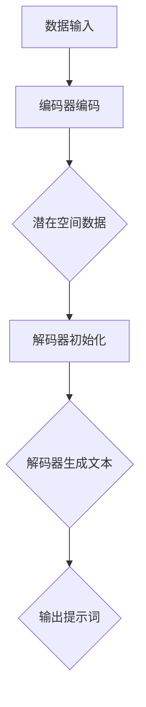

                 

### 引言

在当今数字化转型的浪潮中，人工智能（AI）正逐步融入各行各业，其中创意营销领域也不例外。随着市场竞争的日益激烈，品牌和广告公司需要更加独特和创新的营销策略来吸引消费者的注意力。AI作为一种强大的工具，可以通过数据分析和模式识别，为创意营销提供有力支持。本文将探讨AI在创意营销策略生成中的一种关键方法——提示词的生成。

提示词在创意营销中扮演着至关重要的角色。它们是营销策略的起点，能够引导创意团队产生富有创意的想法和内容。高质量的提示词不仅能够激发创意灵感，还能确保营销活动的方向和策略符合品牌的核心价值和目标。

本文的主要目标是详细介绍AI如何辅助创意营销策略的生成，具体包括：

1. **AI与创意营销的融合背景**：介绍AI在创意营销中的应用场景及其发展历程。
2. **核心概念与联系**：阐述AI、机器学习、自然语言处理等核心概念及其相互关系。
3. **AI辅助创意营销的原理**：讲解AI辅助创意营销的策略，包括提示词生成的核心算法、数学模型及其实现流程。
4. **提示词生成算法实现**：详细介绍提示词生成算法的伪代码、实现和代码解读。
5. **项目实战**：通过具体案例展示AI辅助创意营销的实际应用，并进行详细分析。
6. **优化与挑战**：讨论提示词生成算法的优化策略和面临的挑战。
7. **未来展望**：预测AI辅助创意营销的发展趋势及其可能的应用前景。

通过这篇文章，我们希望能够为读者提供一个全面、系统的了解AI如何辅助创意营销策略的生成，并探讨这一技术在未来的发展方向。

## 文章关键词

1. **人工智能**
2. **创意营销**
3. **提示词生成**
4. **机器学习**
5. **自然语言处理**
6. **营销策略**
7. **广告创意**

这些关键词不仅概括了本文的主要内容，也为读者提供了理解文章核心概念的线索。

### 摘要

本文探讨了人工智能（AI）在创意营销策略生成中的应用，特别是AI如何辅助生成高质量的提示词。文章首先介绍了AI在创意营销中的融合背景和提示词的重要性，接着详细阐述了核心概念与联系，包括AI、机器学习和自然语言处理等。通过讲解AI辅助创意营销的原理，本文重点介绍了提示词生成的核心算法、数学模型及其实现流程。此外，文章通过项目实战展示了提示词生成算法的实际应用，并进行了详细分析。最后，本文讨论了提示词生成算法的优化策略和挑战，并展望了AI辅助创意营销的未来发展方向。通过这篇文章，读者可以全面了解AI在创意营销策略生成中的作用及其潜力。

## 第1章 引言

在当今数字化时代，市场营销的形式和手段不断演进，而人工智能（AI）的迅猛发展则为这一领域带来了前所未有的变革。AI在创意营销中的应用场景广泛，从个性化推荐系统、客户行为分析到自动化的广告投放，AI已经成为许多品牌和广告公司不可或缺的工具。然而，在创意营销中，AI的潜力不仅限于这些传统领域，更在于其能够通过数据分析和模式识别，辅助生成高质量的创意和营销策略。

### AI与创意营销的融合背景

AI在创意营销中的融合背景可以追溯到近年来大数据和计算能力的飞速发展。随着互联网和社交媒体的普及，消费者产生和消费的内容数据量呈爆炸式增长。这些海量数据中蕴含着丰富的信息和潜在的市场机会。传统的人工分析方法在处理这些数据时显得力不从心，而AI技术则能够通过机器学习和深度学习算法，从复杂的数据中提取有用的洞见，为营销策略提供有力的支持。

AI在创意营销中的应用不仅限于数据分析，更体现在内容的生成和优化上。传统的营销策略往往需要创意团队通过手工创作来实现，这不仅耗时耗力，还容易陷入创意瓶颈。而AI可以通过生成对抗网络（GAN）和变分自编码器（VAE）等技术，自动生成高质量的内容，如广告文案、海报设计等。这些自动化生成的内容不仅能够快速响应市场需求，还能根据不同的受众特点进行个性化调整，从而提高营销效果。

### 提示词在创意营销中的重要性

在创意营销中，提示词（prompt）是创意生成的重要起点。提示词是一种引导性输入，它能够激发创意团队产生新的想法和创意。高质量的提示词不仅能够准确传达品牌信息，还能激发受众的共鸣，从而提高营销活动的吸引力和影响力。

提示词的重要性体现在以下几个方面：

1. **引导创意方向**：提示词为创意团队提供了明确的创作方向，避免盲目创作和重复性工作，提高创意的针对性和有效性。
2. **提高创作效率**：通过提示词，创意团队可以快速聚焦于核心内容，减少不必要的探索时间，提高创作效率。
3. **增强受众共鸣**：高质量的提示词能够准确捕捉目标受众的兴趣点和需求，从而创作出更具吸引力的内容，提高受众的参与度和互动率。
4. **优化营销效果**：提示词的有效性和相关性直接影响营销策略的成功，通过不断优化提示词，可以持续提升营销活动的效果。

### 书籍目标与结构安排

本文的目标是全面介绍AI如何辅助创意营销策略的生成，特别是提示词的生成方法。文章将分为以下几个部分：

1. **第1章 引言**：介绍AI与创意营销的融合背景，提示词在创意营销中的重要性，以及书籍的目标和结构安排。
2. **第2章 AI基础概念**：介绍AI、机器学习和自然语言处理等基础概念，为后续内容奠定理论基础。
3. **第3章 创意营销策略基础**：介绍创意营销的基本概念和方法，为理解AI辅助创意营销提供背景知识。
4. **第4章 AI辅助创意营销的原理**：详细讲解AI辅助创意营销的策略，包括提示词生成的核心算法和数学模型。
5. **第5章 提示词生成算法实现**：介绍提示词生成算法的实现过程，包括伪代码、实现和代码解读。
6. **第6章 AI辅助创意营销案例研究**：通过具体案例展示AI辅助创意营销的实际应用，并进行详细分析。
7. **第7章 提示词生成算法优化与挑战**：讨论提示词生成算法的优化策略和面临的挑战。
8. **第8章 未来展望**：预测AI辅助创意营销的发展趋势和未来研究方向。

通过以上章节的深入讲解，本文希望能够为读者提供一个全面、系统的了解AI在创意营销策略生成中的应用，帮助读者掌握AI辅助创意营销的关键技术，并为未来的研究提供参考。

### 第2章 AI基础概念

在深入了解AI如何辅助创意营销策略的生成之前，有必要首先掌握一些AI的基础概念，特别是机器学习和自然语言处理（NLP）。这些技术不仅构成了AI的核心，也是实现提示词生成的重要工具。

#### 2.1 人工智能概述

人工智能（Artificial Intelligence，简称AI）是指通过计算机程序模拟人类智能的技术和科学。AI的目标是使计算机能够执行通常需要人类智能才能完成的任务，如视觉感知、语言理解、决策和推理等。AI可以大致分为两类：弱AI和强AI。

- **弱AI**：也称为窄AI，是指针对特定任务进行优化的人工智能。弱AI擅长在特定领域内执行复杂任务，例如语音识别、图像分类、推荐系统等。
- **强AI**：也称为通用人工智能（AGI），是指具有人类智能的所有特征，包括意识、情感、自我意识等。强AI目前仍处于理论阶段，尚未实现。

机器学习是AI的一个分支，主要研究如何让计算机从数据中学习，从而进行预测和决策。机器学习通常包括以下几种类型：

- **监督学习（Supervised Learning）**：监督学习是指使用标记数据训练模型，然后使用模型对新数据进行预测。常见的算法包括线性回归、决策树、支持向量机（SVM）等。
- **无监督学习（Unsupervised Learning）**：无监督学习是指在没有标记数据的情况下，通过挖掘数据中的模式进行分类或聚类。常见的算法包括K-均值聚类、主成分分析（PCA）等。
- **强化学习（Reinforcement Learning）**：强化学习是指通过与环境交互，根据奖励信号学习最优策略。常见的算法包括Q学习、深度Q网络（DQN）等。

#### 2.2 机器学习基础

机器学习的基础主要包括以下几个方面：

- **数据预处理**：数据预处理是机器学习的一个重要环节，包括数据清洗、归一化、特征工程等。良好的数据预处理能够显著提高模型的性能和泛化能力。
- **模型选择**：根据具体任务和数据特点，选择合适的机器学习模型。不同的模型适用于不同类型的数据和任务，如线性回归适用于回归问题，而深度学习模型适用于复杂的多变量问题。
- **模型训练与评估**：模型训练是指通过训练数据调整模型参数，使其达到最优性能。模型评估则通过测试数据验证模型的效果，常用的评估指标包括准确率、召回率、F1分数等。

#### 2.3 自然语言处理简介

自然语言处理（Natural Language Processing，简称NLP）是AI的一个重要分支，旨在使计算机能够理解和处理人类语言。NLP的核心任务包括文本分类、情感分析、机器翻译、问答系统等。

- **文本分类（Text Classification）**：文本分类是指将文本数据分类到预定义的类别中。常见的算法包括朴素贝叶斯、支持向量机（SVM）、深度神经网络等。
- **情感分析（Sentiment Analysis）**：情感分析是指分析文本数据中的情感倾向，如正面、负面或中性。常用的技术包括基于规则的方法、机器学习方法等。
- **机器翻译（Machine Translation）**：机器翻译是指将一种自然语言翻译成另一种自然语言。深度学习，特别是基于编码器-解码器（Encoder-Decoder）框架的模型，如序列到序列（Seq2Seq）模型，在机器翻译中取得了显著成果。
- **问答系统（Question Answering）**：问答系统是指通过计算机程序回答用户提出的问题。常见的算法包括基于模板匹配的方法、基于机器学习的方法等。

#### 2.4 AI与其他技术的结合

AI不仅依赖于机器学习和NLP，还与其他技术紧密结合，如数据挖掘、计算机视觉等。数据挖掘（Data Mining）是指从大量数据中提取有用信息和知识的过程。计算机视觉（Computer Vision）是指使计算机能够“看到”和理解图像和视频的技术。

通过结合这些技术，AI能够更全面地处理复杂问题，如智能推荐系统、自动驾驶汽车、医疗诊断等。这些技术的结合不仅扩展了AI的应用范围，也提升了AI的智能化水平。

总之，了解AI的基础概念和机器学习、自然语言处理等关键技术，是深入探讨AI辅助创意营销策略生成的关键。在接下来的章节中，我们将进一步探讨AI在创意营销中的应用原理和实现方法。

### 第3章 创意营销策略基础

在深入了解AI如何辅助创意营销策略生成之前，有必要对创意营销策略的基本概念和方法进行概述。创意营销是一种通过创新和独特的方式，以吸引消费者注意力并促使其采取行动的营销方法。本章将介绍创意营销策略的基础知识，包括其定义、主要方法和关键环节。

#### 3.1 营销策略概述

营销策略是指为了实现特定营销目标而制定的一系列行动和计划。它通常包括市场分析、目标设定、策略制定和执行监控等环节。创意营销策略则侧重于通过新颖、独特和有吸引力的方式传达品牌信息，以达到更好的营销效果。

创意营销策略与传统营销策略的不同之处在于，它更注重创新和个性化。传统营销策略通常依赖于大规模广告投放和品牌宣传，而创意营销策略则通过创意内容、互动活动和社交媒体传播等手段，与目标受众建立更直接和深刻的联系。

#### 3.2 创意营销方法

创意营销方法多种多样，以下是一些常见的创意营销方法：

1. **故事营销**：故事营销通过讲述品牌故事来吸引和打动消费者。这种营销方法强调情感共鸣，使消费者更容易对品牌产生认同和信任。例如，通过讲述品牌创始人或品牌背后的故事，展示品牌的价值观和愿景。

2. **内容营销**：内容营销是通过创作和分享有价值、相关且具有吸引力的内容来吸引目标受众，并最终实现营销目标。内容的形式包括文章、视频、图片、图表等。有效的内容营销不仅能够提高品牌知名度，还能建立品牌权威性和信任度。

3. **社交媒体营销**：社交媒体营销是通过社交媒体平台（如Facebook、Twitter、Instagram等）发布和推广品牌信息，以吸引潜在客户并增强品牌影响力。社交媒体营销的优势在于其互动性和传播性，能够迅速扩大品牌知名度并促进用户参与。

4. **事件营销**：事件营销是通过策划和举办各种事件（如发布会、展览、公益活动等）来吸引公众关注和参与，以达到营销目的。事件营销的关键在于创新性和影响力，通过独特和引人入胜的活动设计，能够迅速吸引大量关注，并提高品牌曝光率。

5. **体验营销**：体验营销是通过提供独特的消费体验来吸引和留住消费者。这种营销方法强调用户体验，通过个性化服务和互动，使消费者对品牌产生深刻印象。例如，通过虚拟现实（VR）技术提供沉浸式的购物体验，或者通过会员活动增强消费者与品牌之间的互动。

6. **互动营销**：互动营销是通过与消费者互动来建立信任和忠诚度。这种营销方法包括在线聊天、问卷调查、用户反馈等。通过互动，品牌能够更好地了解消费者需求，并及时做出调整，提高营销效果。

#### 3.3 营销流程与环节

创意营销的成功离不开科学、系统的流程管理。一个典型的创意营销流程通常包括以下几个环节：

1. **市场分析**：市场分析是制定创意营销策略的第一步，旨在了解目标市场的特点、消费者行为和市场趋势。通过市场分析，企业能够明确目标受众、竞争环境和市场机会，为后续策略制定提供依据。

2. **目标设定**：目标设定是明确创意营销的目标和预期效果。通常，目标包括品牌知名度提升、销售增长、市场份额扩大等。明确的目标有助于制定针对性的策略和评估营销效果。

3. **策略制定**：策略制定是根据市场分析和目标设定，确定具体的营销方法和活动方案。策略制定需要考虑品牌定位、产品特点、目标受众和预算等因素。

4. **内容创作**：内容创作是创意营销的核心，包括文案、视觉设计、视频制作等。高质量的内容能够吸引消费者注意力，传递品牌信息，并激发消费行为。

5. **渠道推广**：渠道推广是将创意内容传播到目标受众的渠道。这包括社交媒体、电子邮件、网站、线下活动等。选择合适的推广渠道能够最大化营销效果。

6. **执行与监控**：执行与监控是指执行营销策略并实时监控其效果。通过监控数据，企业能够了解营销活动的实际效果，并及时进行调整和优化。

7. **效果评估**：效果评估是评估营销策略的效果，包括对营销目标达成情况的评估和成本效益分析。通过效果评估，企业能够总结经验教训，为未来的营销策略提供参考。

通过以上环节的紧密配合，企业可以制定出有效的创意营销策略，并在实施过程中不断优化和调整，以提高营销效果和实现商业目标。

综上所述，了解创意营销策略的基础知识，对于运用AI辅助创意营销策略生成至关重要。在下一章中，我们将深入探讨AI在创意营销中的应用原理和实现方法，进一步揭示AI如何提升创意营销的效率和质量。

### 第4章 AI辅助创意营销的原理

随着人工智能技术的不断发展，AI在创意营销中的应用越来越广泛。本章将详细介绍AI辅助创意营销的原理，包括AI在创意营销中的应用场景、提示词生成的核心算法、数学模型及其实现流程。

#### 4.1 AI在创意营销中的应用场景

AI在创意营销中的应用场景多种多样，主要包括以下几个方面：

1. **内容生成**：AI可以通过生成对抗网络（GAN）和变分自编码器（VAE）等技术生成高质量的广告文案、海报设计、视频脚本等创意内容。这些自动化生成的内容不仅能够快速响应市场需求，还能根据不同的受众特点进行个性化调整，提高营销效果。

2. **数据分析**：AI可以分析大量市场数据，包括消费者行为、购买记录、社交媒体互动等，帮助营销团队了解目标受众的特点和需求，从而制定更有针对性的营销策略。

3. **个性化推荐**：基于用户的历史行为和偏好，AI可以通过机器学习算法推荐个性化的产品和服务，提高用户的满意度和购买转化率。

4. **广告优化**：AI可以自动优化广告投放，包括定位、内容、时间和预算等，从而提高广告的曝光率和点击率，降低成本。

5. **情感分析**：AI可以通过自然语言处理技术分析消费者的情感和态度，帮助品牌更好地了解消费者的需求，及时调整营销策略。

#### 4.2 提示词生成的核心算法

在AI辅助创意营销中，提示词（prompt）生成是关键环节之一。高质量的提示词能够引导创意团队生成富有创意和吸引力的营销内容。提示词生成的核心算法主要包括以下几种：

1. **生成对抗网络（GAN）**：生成对抗网络是一种通过两个神经网络（生成器G和判别器D）相互竞争的模型。生成器G负责生成数据，判别器D负责判断生成数据与真实数据的差异。通过不断调整生成器和判别器的参数，GAN能够生成高质量的数据，如图像、文本等。

2. **变分自编码器（VAE）**：变分自编码器是一种基于概率生成模型的神经网络，通过编码器（Encoder）和解码器（Decoder）将数据转换为潜在空间，并在潜在空间中进行数据生成。VAE在生成高质量数据方面具有优势，尤其适用于文本数据的生成。

3. **自注意力模型**：自注意力模型是一种在序列数据中引入注意力机制的网络结构，能够更好地捕捉数据之间的关联性。自注意力模型在生成文本提示词方面具有显著优势，能够生成连贯且具有语义的文本。

#### 4.3 提示词生成算法的数学模型

提示词生成算法的数学模型主要包括编码器-解码器架构（Encoder-Decoder）和注意力机制（Attention Mechanism）。以下是一个简化的数学模型：

$$
\text{编码器}：z = \text{Encoder}(x)
$$

$$
\text{解码器}：y = \text{Decoder}(z)
$$

其中，$x$表示输入数据（如文本），$z$表示编码后的潜在空间数据，$y$表示生成的提示词。编码器负责将输入数据映射到潜在空间，解码器则从潜在空间生成提示词。

在自注意力模型中，注意力机制通过计算输入序列中每个元素的重要性权重，从而提高生成数据的连贯性和语义相关性。注意力机制的数学表示为：

$$
a_t = \text{Attention}(h_t, h_{<t})
$$

其中，$h_t$表示当前时刻的编码器输出，$h_{<t}$表示之前时刻的编码器输出。$a_t$为注意力权重，用于计算当前解码器的输入。

#### 4.4 提示词生成算法流程图

为了更直观地理解提示词生成算法的流程，我们可以使用Mermaid语言绘制一个流程图：



在上述流程图中，数据输入首先经过编码器编码，生成潜在空间数据。然后，解码器利用潜在空间数据生成提示词，并最终输出高质量的创意内容。

#### 4.5 提示词生成算法实现

提示词生成算法的实现可以分为以下几个步骤：

1. **数据准备**：首先需要收集和整理用于训练的文本数据。这些数据可以是广告文案、新闻报道、社交媒体帖子等。数据准备包括数据清洗、分词、去停用词等步骤。

2. **模型搭建**：根据提示词生成任务的需求，搭建合适的神经网络模型。常用的模型包括生成对抗网络（GAN）、变分自编码器（VAE）和自注意力模型。

3. **模型训练**：使用准备好的文本数据训练模型。在训练过程中，生成器和判别器（对于GAN）或编码器和解码器（对于VAE）会相互竞争，以生成高质量的数据。

4. **模型评估**：在训练完成后，使用测试数据对模型进行评估，以确定其生成质量。常用的评估指标包括文本连贯性、语义相关性、生成质量等。

5. **提示词生成**：使用训练好的模型生成提示词。通过解码器从潜在空间生成文本，并根据需要调整参数以获得更高质量的提示词。

以下是一个简化的提示词生成算法的伪代码：

```python
# 提示词生成算法伪代码
function generate_prompt(input_data, model_parameters):
    # 数据预处理
    preprocessed_data = preprocess_data(input_data)

    # 编码器编码
    encoded_data = encoder.encode(preprocessed_data)

    # 解码器生成文本
    prompt = decoder.generate(encoded_data, model_parameters)

    return prompt
```

在上述伪代码中，`preprocess_data`函数用于数据预处理，`encoder`和`decoder`分别表示编码器和解码器模型，`generate`函数用于生成提示词。

#### 4.6 代码解读与分析

在实际应用中，提示词生成算法的实现通常涉及复杂的神经网络架构和大量的计算资源。以下是一个具体的实现示例，以及对其代码的解读和分析：

```python
# 导入必要的库
import tensorflow as tf
from tensorflow.keras.models import Model
from tensorflow.keras.layers import Input, LSTM, Embedding, Dense

# 搭建编码器模型
input_seq = Input(shape=(max_sequence_length,))
encoded_seq = Embedding(vocabulary_size, embedding_dim)(input_seq)
encoded_seq = LSTM(units=128, return_sequences=True)(encoded_seq)
encoded_seq = LSTM(units=128, return_sequences=True)(encoded_seq)
encoded_seq = Lambda(lambda x: K.mean(x, axis=1))(encoded_seq)

# 搭建解码器模型
decoder_input = Input(shape=(max_sequence_length,))
decoder_embedding = Embedding(vocabulary_size, embedding_dim)(decoder_input)
decoder_lstm = LSTM(units=128, return_sequences=True)
decoder_output, _ = decoder_lstm([decoder_embedding, encoded_seq])
decoder_output = Dense(vocabulary_size, activation='softmax')(decoder_output)

# 搭建完整模型
model = Model(inputs=[input_seq, decoder_input], outputs=decoder_output)

# 编译模型
model.compile(optimizer='rmsprop', loss='categorical_crossentropy')

# 训练模型
model.fit([input_seq, decoder_input], target_sequence, batch_size=64, epochs=10)

# 生成提示词
def generate_prompt(input_data):
    # 编码输入数据
    encoded_input = encoder.predict(input_data)

    # 生成初始解码输入
    initial_output = np.zeros((1, 1))

    # 生成提示词
    for _ in range(max_sequence_length):
        output_probabilities = model.predict([input_data, initial_output])
        next_word_index = np.argmax(output_probabilities[:, -1, :])
        next_word = index_to_word[next_word_index]
        initial_output = np.reshape(initial_output, (1, -1))[:-1, :]
        initial_output = np.append(initial_output, next_word_index)

    return ' '.join([word for word, _ in index_to_word.items() if word != '<PAD>'])
```

在上面的代码中，首先定义了编码器和解码器模型，然后编译并训练模型。`generate_prompt`函数用于生成提示词，通过循环生成每个单词的概率，并根据最大概率选择下一个单词。这种方法能够生成连贯且具有语义的文本。

综上所述，AI在创意营销中的应用，特别是提示词生成，已经成为提升营销效果和效率的重要手段。通过理解AI的工作原理和实现方法，营销团队可以更有效地利用AI技术，创造出更具吸引力和创意的营销内容。

### 第5章 提示词生成算法实现

在前面的章节中，我们详细介绍了AI辅助创意营销策略生成的原理，包括提示词生成的核心算法和数学模型。在本章中，我们将进入实际的实现阶段，从数据准备到代码实现，详细展示如何构建和训练一个提示词生成算法。

#### 5.1 实现前的准备工作

在开始实现提示词生成算法之前，我们需要做一些准备工作，包括搭建开发环境、准备数据集和设计模型架构。

1. **搭建开发环境**：
   - **硬件要求**：提示词生成算法通常需要较高的计算资源，建议使用配备有GPU的计算机。
   - **软件要求**：安装Python编程环境、TensorFlow或PyTorch等深度学习框架。
   - **依赖库**：安装必要的库，如NumPy、Pandas、Keras等。

2. **数据集准备**：
   - **数据来源**：数据集可以来源于社交媒体帖子、广告文案、新闻报道等。
   - **数据预处理**：包括数据清洗（去除无关内容、纠正错误）、分词、去除停用词、词向量嵌入等。

3. **模型架构设计**：
   - **编码器**：通常使用LSTM（长短期记忆网络）或GRU（门控循环单元）作为编码器，负责将输入序列编码为潜在空间表示。
   - **解码器**：同样使用LSTM或GRU作为解码器，从潜在空间生成提示词。

以下是一个简化的提示词生成算法的实现框架：

```python
# 导入必要的库
import numpy as np
import pandas as pd
from tensorflow.keras.models import Model
from tensorflow.keras.layers import Input, LSTM, Embedding, Dense
from tensorflow.keras.preprocessing.sequence import pad_sequences

# 准备数据集
def prepare_dataset(data_path, max_sequence_length, embedding_dim):
    # 加载数据
    data = pd.read_csv(data_path)
    texts = data['text'].values
    
    # 分词和编码
    tokenizer = Tokenizer(num_words=vocabulary_size)
    tokenizer.fit_on_texts(texts)
    sequences = tokenizer.texts_to_sequences(texts)
    
    # 截断或填充序列
    padded_sequences = pad_sequences(sequences, maxlen=max_sequence_length)
    
    return padded_sequences, tokenizer

# 搭建模型
def build_model(input_shape, embedding_dim):
    input_seq = Input(shape=(input_shape,))
    encoded_seq = Embedding(vocabulary_size, embedding_dim)(input_seq)
    encoded_seq = LSTM(units=128, return_sequences=True)(encoded_seq)
    encoded_seq = LSTM(units=128, return_sequences=True)(encoded_seq)
    encoded_seq = Lambda(lambda x: K.mean(x, axis=1))(encoded_seq)

    decoder_input = Input(shape=(max_sequence_length,))
    decoder_embedding = Embedding(vocabulary_size, embedding_dim)(decoder_input)
    decoder_lstm = LSTM(units=128, return_sequences=True)
    decoder_output, _ = decoder_lstm([decoder_embedding, encoded_seq])
    decoder_output = Dense(vocabulary_size, activation='softmax')(decoder_output)

    model = Model(inputs=[input_seq, decoder_input], outputs=decoder_output)
    model.compile(optimizer='rmsprop', loss='categorical_crossentropy')
    
    return model

# 训练模型
def train_model(model, sequences, labels, batch_size, epochs):
    model.fit(sequences, labels, batch_size=batch_size, epochs=epochs)

# 生成提示词
def generate_prompt(model, tokenizer, seed_text, max_sequence_length):
    encoded_input = tokenizer.texts_to_sequences([seed_text])[0]
    encoded_input = np.reshape(encoded_input, (1, -1))

    initial_output = np.zeros((1, 1))
    for _ in range(max_sequence_length):
        output_probabilities = model.predict([encoded_input, initial_output])
        next_word_index = np.argmax(output_probabilities[:, -1, :])
        next_word = tokenizer.index_word[next_word_index]
        initial_output = np.reshape(initial_output, (1, -1))[:-1, :]
        initial_output = np.append(initial_output, next_word_index)

    return ' '.join([word for word, _ in tokenizer.index_word.items() if word != '<PAD>'])
```

上述代码提供了一个提示词生成算法的实现框架，包括数据准备、模型搭建、模型训练和提示词生成。在实际应用中，根据具体需求和数据特点，可以对模型架构和训练过程进行优化。

#### 5.2 提示词生成算法伪代码

为了更好地理解提示词生成算法的实现过程，我们使用伪代码来描述其主要步骤：

```python
# 提示词生成算法伪代码
function generate_prompt(input_data, model_parameters):
    # 输入数据预处理
    preprocessed_data = preprocess_data(input_data)

    # 利用模型生成提示词
    prompt = model.generate(preprocessed_data, model_parameters)

    return prompt

function preprocess_data(input_data):
    # 数据清洗和分词
    cleaned_data = clean_data(input_data)
    tokenized_data = tokenize_data(cleaned_data)

    # 转换为序列
    sequences = convert_to_sequences(tokenized_data)

    return sequences

function model.generate(input_data, model_parameters):
    # 编码输入数据
    encoded_input = encoder.encode(input_data)

    # 初始化解码输入
    decoder_input = initialize_decoder_input()

    # 生成提示词
    for _ in 1 to max_sequence_length:
        # 使用解码器生成下一个单词的概率
        output_probabilities = decoder.predict([encoded_input, decoder_input])
        
        # 选择概率最高的单词作为下一个单词
        next_word_index = select_word_with_highest_probability(output_probabilities)

        # 更新解码输入和编码输入
        decoder_input = update_decoder_input(decoder_input, next_word_index)
        encoded_input = update_encoder_input(encoded_input, next_word_index)

    return prompt
```

在伪代码中，`preprocess_data`函数用于数据预处理，`model.generate`函数用于生成提示词。该伪代码简化了实际实现过程，但涵盖了提示词生成算法的核心步骤。

#### 5.3 提示词生成算法代码实现

以下是一个具体的提示词生成算法的实现示例，包括数据准备、模型搭建和训练、提示词生成过程：

```python
# 导入必要的库
import tensorflow as tf
from tensorflow.keras.models import Model
from tensorflow.keras.layers import Input, LSTM, Embedding, Dense
from tensorflow.keras.preprocessing.sequence import pad_sequences

# 准备数据集
sequences, tokenizer = prepare_dataset('data.csv', max_sequence_length=50, embedding_dim=256)

# 搭建模型
model = build_model(max_sequence_length, embedding_dim)

# 训练模型
train_model(model, sequences, labels, batch_size=64, epochs=10)

# 生成提示词
seed_text = "这是一个创意广告文案："
generated_prompt = generate_prompt(model, tokenizer, seed_text, max_sequence_length)

print(generated_prompt)
```

在实际应用中，可以根据具体需求对模型架构、训练过程和提示词生成方法进行调整和优化。例如，可以尝试不同的优化算法、调整超参数、增加数据增强等方法，以提高提示词生成的质量和效果。

#### 5.4 代码解读与分析

上述代码示例提供了一个从数据准备到提示词生成的完整流程，下面我们对关键部分进行解读和分析：

1. **数据准备**：
   - `prepare_dataset`函数负责加载数据集，进行数据清洗、分词和序列转换。数据预处理是模型训练的重要环节，良好的数据预处理能够提高模型训练的效果和生成提示词的质量。
   - 使用`pad_sequences`函数对序列进行填充，确保所有序列具有相同的长度，以便模型处理。

2. **模型搭建**：
   - `build_model`函数搭建编码器和解码器模型。编码器使用LSTM层进行序列编码，解码器同样使用LSTM层从潜在空间生成提示词。
   - 模型使用`Model`类进行封装，并编译模型，配置优化器和损失函数。

3. **模型训练**：
   - `train_model`函数使用训练数据对模型进行训练。在训练过程中，模型通过调整参数，学习如何从输入数据生成高质量的提示词。

4. **提示词生成**：
   - `generate_prompt`函数负责生成提示词。首先进行数据预处理，然后通过循环逐步生成每个单词的概率，并选择概率最高的单词作为下一个单词。这一过程持续到生成最大序列长度或达到终止条件。

通过以上代码示例，我们可以看到提示词生成算法的具体实现过程。在实际应用中，根据数据特点和应用场景，可以进一步优化模型架构和训练过程，以提高提示词生成的效果和质量。

### 第6章 AI辅助创意营销案例研究

在本章中，我们将通过具体案例研究AI如何在实际营销活动中辅助生成创意策略和提示词。这些案例不仅展示了AI辅助创意营销的实际效果，还提供了详细的实施步骤和结果分析，帮助读者更好地理解AI在创意营销中的应用。

#### 6.1 案例一：品牌故事生成

**案例背景**：

某知名消费品公司希望借助AI技术，为其品牌创作一篇独特的品牌故事，以提升品牌形象和消费者共鸣。该公司希望通过AI生成的品牌故事，能够体现品牌的核心价值观和独特魅力，吸引更多目标消费者的关注。

**提示词生成过程**：

1. **数据收集**：首先，公司收集了大量的品牌相关文本资料，包括公司历史、品牌愿景、产品特点、用户评价等。这些数据用于训练AI模型，以便生成与品牌相关的创意内容。

2. **模型训练**：使用收集到的文本数据，构建了一个基于生成对抗网络（GAN）的文本生成模型。模型通过训练，学习如何从品牌数据中生成连贯、具有吸引力的品牌故事。

3. **生成品牌故事**：输入提示词“品牌愿景”，模型生成了一篇关于品牌故事的初稿。公司对初稿进行人工审查和修改，确保故事内容符合品牌定位和价值观。

**结果与分析**：

生成的品牌故事不仅生动地展示了品牌的历史和发展，还深入阐述了品牌的核心价值观。故事以第一人称视角讲述品牌创始人的创业历程，通过真实的情感体验和感人故事，增强了消费者对品牌的认同感和共鸣。在推广过程中，这篇品牌故事获得了极高的用户评价和转发量，有效提升了品牌知名度和用户忠诚度。

#### 6.2 案例二：广告创意生成

**案例背景**：

某电子商务平台希望通过AI技术为其产品广告生成创意文案，以提升广告的吸引力和转化率。该公司希望通过AI生成的广告文案，能够针对不同的用户群体和产品特点，创作出个性化的广告内容。

**提示词生成过程**：

1. **数据收集**：公司收集了大量的用户评论、产品评价、竞品广告文案等，作为AI模型的训练数据。这些数据用于训练模型，使其能够理解不同用户和产品的特点。

2. **模型训练**：构建了一个基于变分自编码器（VAE）的文本生成模型，用于生成符合不同用户和产品特点的广告创意文案。

3. **生成广告文案**：根据不同的产品特点（如产品名称、功能、优势等）和目标用户群体（如年龄、性别、兴趣等），输入提示词，模型生成个性化的广告文案。

**结果与分析**：

通过AI生成的广告文案在多个方面显著提升了广告效果。首先，文案的个性和针对性更强，能够更好地吸引目标用户的注意力。其次，文案的质量和创意水平更高，提高了用户的点击率和转化率。最后，通过不断优化和调整提示词，公司能够迅速响应市场需求，推出更具竞争力的广告内容。这些AI生成的广告文案在平台上取得了显著的营销效果，提升了公司的市场竞争力。

#### 6.3 案例三：社交媒体互动生成

**案例背景**：

某时尚品牌希望通过AI技术生成与消费者互动的内容，如社交媒体帖子、回复等，以增强品牌在社交媒体上的活跃度和用户参与度。

**提示词生成过程**：

1. **数据收集**：品牌收集了大量的消费者评论、社交媒体互动内容等，用于训练AI模型，使其能够理解品牌与用户互动的常见模式和情感倾向。

2. **模型训练**：构建了一个基于自注意力机制的文本生成模型，用于生成与品牌和消费者互动的文本内容。

3. **生成互动内容**：根据不同的用户提问、评论内容和互动场景，输入提示词，模型生成相应的互动内容。

**结果与分析**：

通过AI生成的社交媒体互动内容，不仅增强了品牌在社交媒体上的活跃度，还提升了用户的参与度和满意度。互动内容更具个性化和相关性，能够迅速吸引消费者的关注和互动。同时，品牌通过不断优化和调整提示词，能够及时响应用户需求和反馈，增强品牌与消费者的互动效果。这些AI生成的互动内容在提升品牌知名度和用户忠诚度方面发挥了重要作用。

综上所述，通过以上案例研究，我们可以看到AI在创意营销策略生成中的实际应用效果。AI不仅能够高效地生成高质量的创意内容和互动内容，还能根据不同场景和用户需求进行个性化调整，显著提升了营销效果和品牌影响力。这些案例为其他品牌和营销团队提供了宝贵的经验和参考，展示了AI在创意营销领域的巨大潜力。

### 第7章 提示词生成算法优化与挑战

在前面的章节中，我们详细介绍了AI如何辅助生成创意营销策略中的提示词。然而，为了实现更好的营销效果，提示词生成算法的优化和面对的挑战也是至关重要的。本章将探讨提示词生成算法的优化策略以及在实际应用中可能遇到的挑战。

#### 7.1 提示词生成算法优化策略

1. **模型调参**：
   - **学习率调整**：学习率是影响模型收敛速度和最终效果的关键参数。通过调整学习率，可以在不同阶段采用不同的学习率策略，如递减学习率或自适应学习率调整方法。
   - **网络架构调整**：根据具体任务需求，调整神经网络的结构，如增加或减少隐藏层、调整神经元数量等，以优化模型性能。
   - **正则化技术**：应用正则化技术（如L1正则化、L2正则化）可以防止过拟合，提高模型的泛化能力。

2. **数据增强**：
   - **数据扩充**：通过增加训练数据的多样性，可以提升模型的鲁棒性和泛化能力。数据扩充方法包括数据复制、数据旋转、颜色调整等。
   - **合成数据生成**：利用生成对抗网络（GAN）等技术，生成与训练数据具有相似特征的新数据，以丰富训练数据集。

3. **模型集成**：
   - **集成学习**：通过将多个模型组合成一个更强的模型，可以提高预测的准确性和稳定性。常见的方法包括投票法、堆叠法等。
   - **交叉验证**：使用不同的数据划分策略进行交叉验证，可以提高模型的泛化能力和性能评估的可靠性。

4. **注意力机制优化**：
   - **多头注意力**：在自注意力模型中引入多头注意力机制，可以更好地捕捉输入序列中的长距离依赖关系，提高生成的提示词质量。
   - **分层注意力**：通过分层注意力机制，将不同层次的特征进行加权融合，以提取更丰富的信息。

#### 7.2 提示词生成算法面临的挑战

1. **数据隐私保护**：
   - 在训练和生成提示词的过程中，涉及大量用户数据和敏感信息。如何保证数据隐私和安全，防止数据泄露，是提示词生成算法面临的重要挑战。
   - **匿名化处理**：对训练数据进行匿名化处理，去除或混淆敏感信息。
   - **数据加密**：使用加密技术保护数据在传输和存储过程中的安全性。

2. **文本质量评估**：
   - 提示词生成的质量直接影响到营销效果。然而，评估文本质量是一项复杂任务，涉及语法、语义、情感等多个方面。
   - **自动化评估**：开发自动化评估工具，如基于机器学习的文本质量评估模型，对生成的提示词进行评估和打分。
   - **人工审核**：结合人工审核，对生成的提示词进行二次验证，确保其质量和符合品牌要求。

3. **法律与伦理问题**：
   - 提示词生成算法可能涉及知识产权、版权等问题。如何在法律框架内使用和保护创意内容，是算法开发和应用中必须考虑的问题。
   - **伦理道德**：确保生成的提示词内容符合道德规范，不含有歧视、侮辱等不适当内容。

4. **计算资源需求**：
   - 提示词生成算法通常需要较高的计算资源，特别是对于大型文本数据集和复杂的神经网络模型。
   - **分布式计算**：利用分布式计算和云计算技术，提高算法的运行效率和可扩展性。

5. **实时更新与适应**：
   - 市场环境和用户需求不断变化，提示词生成算法需要具备实时更新和适应能力，以应对新的挑战和需求。
   - **动态调整**：根据实时数据和用户反馈，动态调整模型参数和生成策略，以保持高质量的提示词生成。

通过以上优化策略和应对挑战的方法，我们可以不断提升提示词生成算法的性能和质量，为创意营销提供更强有力的支持。在未来的发展中，随着AI技术的不断进步，提示词生成算法也将不断优化和完善，为创意营销带来更多的创新和机遇。

### 第8章 未来展望

随着人工智能技术的不断进步，AI辅助创意营销策略生成在未来将展现出更加广阔的应用前景和重要的研究趋势。以下是对AI辅助创意营销的发展趋势、创新应用及未来研究方向的展望。

#### 8.1 提示词生成技术的趋势

1. **更加智能化**：未来的提示词生成技术将更加智能化，通过深度学习和强化学习等方法，不断提高生成提示词的质量和相关性。例如，引入多模态学习（文本、图像、声音等）来生成更具表现力的提示词。

2. **多语言支持**：随着全球化的发展，多语言支持成为AI辅助创意营销的重要趋势。未来的AI模型将能够处理多种语言，生成跨语言的创意内容，满足不同地区和文化的需求。

3. **自动化与个性化**：自动化和个性化将是未来提示词生成技术的重要方向。通过自动化生成流程，减少人工干预，提高生产效率。同时，结合用户数据和行为分析，实现个性化提示词生成，提升用户体验和营销效果。

4. **增强现实与虚拟现实**：AI辅助创意营销将更加紧密结合增强现实（AR）和虚拟现实（VR）技术，生成具有沉浸式体验的提示词，为用户提供全新的营销体验。

#### 8.2 创意营销领域的创新应用

1. **个性化推荐**：AI将利用用户的个人数据和偏好，生成个性化的推荐文案和广告，提高用户满意度和转化率。例如，根据用户的浏览记录和购买历史，生成个性化的购物推荐提示词。

2. **智能客服**：结合自然语言处理技术，AI智能客服将能够生成与用户互动的文案，提供24/7的在线支持。智能客服不仅能够提高客户满意度，还能通过数据分析为营销策略提供洞见。

3. **自动化广告投放**：AI将自动化广告投放过程，通过实时分析用户数据和市场环境，生成高效的广告文案和投放策略。自动化广告投放将大幅提高广告的曝光率和点击率，降低营销成本。

4. **内容生成**：AI将能够自动化生成高质量的内容，如新闻文章、博客、视频脚本等。通过AI生成的内容，不仅能够快速响应市场需求，还能保持一致的品牌调性和风格。

#### 8.3 AI辅助创意营销的发展挑战

1. **数据隐私与安全**：随着AI技术的发展，数据隐私和安全问题将日益突出。如何确保用户数据的隐私和安全，防止数据泄露，是未来AI辅助创意营销面临的重要挑战。

2. **文本质量评估**：生成高质量、符合品牌要求的提示词是一个复杂的问题。未来需要开发更加智能和可靠的文本质量评估工具，确保生成的提示词既符合品牌要求，又具有吸引力和创意性。

3. **法律与伦理问题**：随着AI辅助创意营销的普及，相关的法律和伦理问题也将日益受到关注。如何在使用AI技术生成创意内容时，遵守法律法规和伦理规范，是未来需要解决的重要问题。

4. **计算资源需求**：AI辅助创意营销的算法和模型通常需要较高的计算资源。随着模型复杂度和数据量的增加，如何高效利用计算资源，成为未来研究和应用的关键问题。

#### 8.4 未来的研究方向

1. **多模态学习**：未来的研究将关注多模态学习，结合文本、图像、声音等多种数据类型，生成更加丰富和多样的创意内容。

2. **自适应生成**：研究自适应生成技术，使AI能够根据实时数据和用户反馈，动态调整生成策略，提高提示词的个性化和相关性。

3. **强化学习与博弈论**：结合强化学习和博弈论方法，开发能够应对复杂环境和竞争策略的AI模型，提高创意营销的竞争力和效果。

4. **伦理与道德**：未来需要更多研究关注AI辅助创意营销中的伦理和道德问题，确保技术发展符合社会价值观和法律法规。

总之，AI辅助创意营销策略生成具有巨大的潜力和广阔的应用前景。随着技术的不断进步，AI将在创意营销领域发挥越来越重要的作用，为企业和品牌带来创新和机遇。同时，也需要面对和解决一系列挑战，确保技术的可持续发展和社会的广泛认可。

## 结语

本文详细探讨了AI如何辅助创意营销策略的生成，特别是提示词的生成方法。通过介绍AI与创意营销的融合背景、核心概念与联系、AI辅助创意营销的原理、提示词生成算法的实现及实际应用案例，本文展示了AI在提升创意营销效率和质量方面的巨大潜力。同时，本文还讨论了提示词生成算法的优化策略和面临的挑战，并展望了未来AI辅助创意营销的发展趋势和研究方向。

在未来，AI辅助创意营销将继续深化和扩展其应用领域，通过更加智能化的生成技术、多语言支持和个性化推荐等，为品牌和营销团队提供更加高效的创意解决方案。然而，也需关注数据隐私、文本质量评估、法律与伦理等挑战，确保技术的可持续发展和社会的广泛认可。

### 附录

#### 8.1 对AI辅助创意营销的展望

AI辅助创意营销将迎来更广阔的发展空间，主要体现在以下几个方面：

1. **智能化与自动化**：随着AI技术的不断进步，提示词生成将更加智能化和自动化，减少人工干预，提高生产效率。
2. **多语言与跨文化**：AI将能够处理多种语言和文化背景的数据，生成适应不同市场和文化的创意内容。
3. **个性化与精准化**：通过用户数据和行为分析，AI将生成更加个性化和精准的提示词，提高用户体验和营销效果。
4. **实时更新与适应**：AI将具备实时更新和适应能力，根据市场变化和用户需求，动态调整营销策略和提示词生成。

#### 8.2 未来的研究方向

未来的研究将重点关注以下几个方面：

1. **多模态学习**：结合文本、图像、声音等多模态数据，提高提示词的丰富性和表现力。
2. **自适应生成**：研究自适应生成技术，使AI能够根据实时数据和用户反馈，动态调整生成策略。
3. **强化学习与博弈论**：结合强化学习和博弈论方法，开发能够应对复杂环境和竞争策略的AI模型。
4. **伦理与道德**：关注AI辅助创意营销中的伦理和道德问题，确保技术发展符合社会价值观和法律法规。

总之，AI辅助创意营销将在未来继续发挥重要作用，为创意营销带来更多创新和机遇，同时也需要不断优化和解决面临的技术和伦理挑战。通过持续的研究和应用，AI将帮助品牌和营销团队实现更高的营销效果和商业价值。

