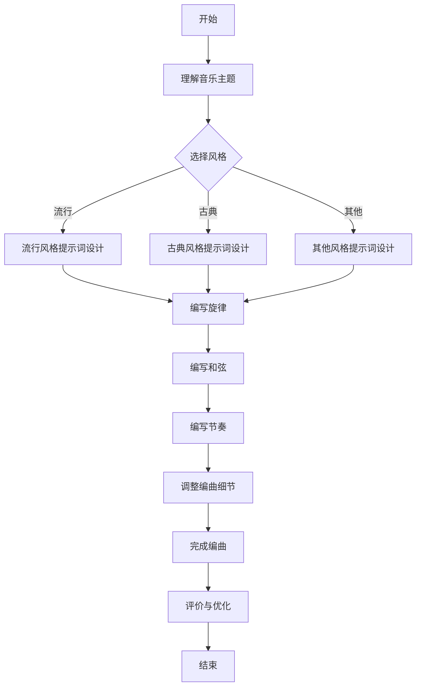
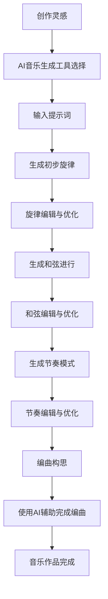
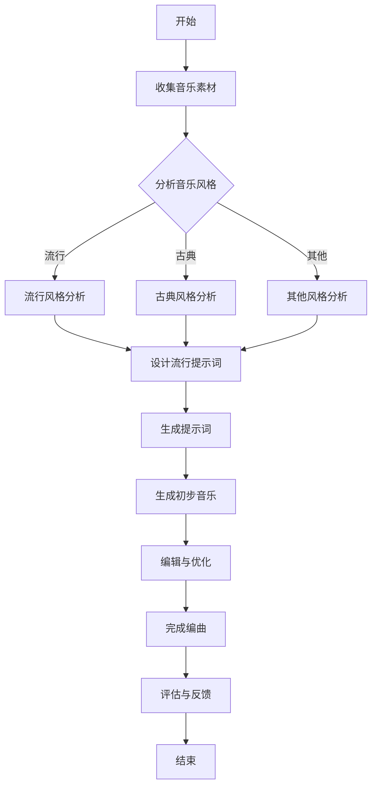

                 


### 文章标题：AI辅助创意音乐编曲中的提示词设计方法

### 关键词：AI辅助音乐编曲、提示词设计、音乐生成、人工智能

### 摘要：

本文深入探讨AI辅助创意音乐编曲中的提示词设计方法。首先介绍AI辅助音乐编曲的背景和提示词的作用，然后阐述AI技术在音乐编曲中的应用，以及提示词设计的基本原则和技巧。通过音乐理论与人工智能的关系分析，结合实际案例研究，本文为AI辅助音乐编曲提供了详细的实践指南，并展望了其未来发展。

### 目录大纲构思

#### 书名：《AI辅助创意音乐编曲中的提示词设计方法》

### 第1章：引言与概述

#### 1.1 AI辅助音乐编曲的背景

#### 1.2 提示词在音乐编曲中的作用

#### 1.3 书籍结构安排

### 第2章：AI技术在音乐编曲中的应用

#### 2.1 AI音乐生成技术简介

#### 2.2 音乐编曲流程中的AI应用

#### 2.3 提示词在AI音乐生成中的作用

### 第3章：提示词设计的基本原则

#### 3.1 提示词的基本概念

#### 3.2 提示词设计的方法与技巧

#### 3.3 不同类型音乐中的提示词设计

### 第4章：人工智能与音乐理论的关系

#### 4.1 音乐理论的基本概念

#### 4.2 人工智能在音乐理论中的应用

#### 4.3 提示词与音乐理论的关系

### 第5章：案例研究

#### 5.1 提示词设计在流行音乐中的案例

#### 5.2 提示词设计在古典音乐中的案例

#### 5.3 提示词设计在不同风格音乐中的比较分析

### 第6章：AI辅助音乐编曲的实战应用

#### 6.1 实战一：使用AI生成提示词

#### 6.2 实战二：使用提示词进行音乐编曲

#### 6.3 实战三：AI辅助音乐编曲的优化策略

### 第7章：未来展望与趋势

#### 7.1 AI辅助音乐编曲的发展趋势

#### 7.2 提示词设计方法的未来发展

#### 7.3 AI辅助音乐编曲的挑战与机遇

### 提示词设计方法流程图



### 音乐编曲流程中的AI应用



### 伪代码讲解音乐生成算法

```plaintext
// 音乐生成算法伪代码

// 定义音符序列
notes = ["C", "D", "E", "F", "G", "A", "B"]

// 定义和弦进行
chords = ["I", "IV", "V", "vi", "iii", "viid"]

// 输入提示词
prompt = "欢快"

// 初始化音乐结构
music_structure = []

// 根据提示词生成音乐结构
if (prompt == "欢快") {
    add_note(music_structure, notes[0])
    add_chord(music_structure, chords[0])
    add_rhythm(music_structure, "快节奏")
} else if (prompt == "悲伤") {
    add_note(music_structure, notes[4])
    add_chord(music_structure, chords[2])
    add_rhythm(music_structure, "慢节奏")
}

// 输出音乐结构
print(music_structure)
```

### 数学模型与公式讲解

#### 音乐生成算法中的数学模型

##### 1. 和弦进行生成模型

```latex
\text{和弦进行生成模型} = \\
\text{F}_0 = \text{prompt\_type} \times (\text{和弦模板} + \text{节奏模板}) \\
\text{和弦模板} = \{\text{I}, \text{IV}, \text{V}, \text{vi}, \text{iii}, \text{viid}\} \\
\text{节奏模板} = \{\text{快节奏}, \text{慢节奏}, \text{中等节奏}\}
```

### 第1章：引言与概述

#### 1.1 AI辅助音乐编曲的背景

随着人工智能技术的飞速发展，AI已经在众多领域展现出其强大的能力，包括艺术创作领域。音乐编曲作为音乐创作的重要环节，自然也受益于AI技术的辅助。传统的音乐编曲过程往往需要作曲家具备深厚的音乐功底和丰富的经验，而AI的介入，可以极大地提高音乐创作的效率，拓宽作曲家的创作思路，甚至创造出全新的音乐风格。

AI辅助音乐编曲的主要优势在于：

1. **高效性**：AI能够快速生成大量的音乐素材，为作曲家提供丰富的灵感来源。
2. **多样性**：AI可以根据不同的风格和主题生成多种类型的音乐，满足不同用户的需求。
3. **创新性**：AI可以在音乐创作中引入新颖的元素，推动音乐艺术的发展。

#### 1.2 提示词在音乐编曲中的作用

提示词（Prompt）是AI辅助音乐编曲的重要输入，它类似于人类作曲家创作音乐时的灵感来源。通过输入特定的提示词，AI可以生成符合指定风格和主题的音乐。提示词的作用主要体现在以下几个方面：

1. **风格指导**：提示词可以指示AI生成特定风格的音乐，如流行、古典、摇滚等。
2. **主题定位**：提示词可以帮助AI确定音乐的主题，使其更加贴近用户的需求。
3. **情感表达**：提示词可以传递情感色彩，使音乐更具表现力。

#### 1.3 书籍结构安排

本书将从以下几个方面对AI辅助创意音乐编曲中的提示词设计方法进行深入探讨：

1. **AI技术在音乐编曲中的应用**：介绍AI音乐生成技术及其在编曲流程中的应用。
2. **提示词设计的基本原则**：阐述提示词的基本概念和设计方法。
3. **人工智能与音乐理论的关系**：分析音乐理论在AI音乐生成中的作用。
4. **案例研究**：通过具体案例研究，展示提示词设计的实际应用效果。
5. **实战应用**：提供AI辅助音乐编曲的实战案例，包括生成提示词、音乐编曲和优化策略。
6. **未来展望与趋势**：探讨AI辅助音乐编曲的未来发展趋势和挑战。

### 第2章：AI技术在音乐编曲中的应用

#### 2.1 AI音乐生成技术简介

AI音乐生成技术是指利用人工智能算法，如神经网络、生成对抗网络（GAN）等，生成新的音乐内容。这些技术可以通过学习和模仿大量已有的音乐作品，创造出全新的音乐作品。以下是几种常见的AI音乐生成技术：

1. **神经网络生成音乐**：利用深度学习中的循环神经网络（RNN）或变分自编码器（VAE）等模型，学习音乐数据中的特征，生成新的音乐旋律和和弦。
2. **生成对抗网络（GAN）**：GAN由生成器（Generator）和判别器（Discriminator）组成，通过两者之间的博弈，生成高质量的音乐样本。
3. **序列模型生成音乐**：如长短期记忆网络（LSTM）和门控循环单元（GRU），这些模型能够捕捉音乐数据中的时序特征，生成连贯的音乐片段。

#### 2.2 音乐编曲流程中的AI应用

音乐编曲流程通常包括旋律创作、和弦编排、节奏设计、编曲和混音等步骤。AI可以在这些步骤中发挥重要作用，以下是AI在音乐编曲流程中的具体应用：

1. **旋律创作**：AI可以根据输入的提示词生成初步的旋律，作曲家可以对生成的旋律进行编辑和优化。
2. **和弦编排**：AI可以根据旋律和风格自动生成和弦进行，为旋律提供和声支持。
3. **节奏设计**：AI可以生成多种节奏模式，帮助作曲家探索新的节奏创意。
4. **编曲**：AI可以辅助作曲家完成整个编曲过程，包括乐器分配、音色选择和音量平衡等。
5. **混音**：AI可以通过分析已有音乐作品，提供混音的优化建议，提高音乐作品的质量。

#### 2.3 提示词在AI音乐生成中的作用

提示词是AI音乐生成的关键输入，它决定了音乐生成的基本风格、主题和情感。以下是提示词在AI音乐生成中的具体作用：

1. **风格引导**：通过输入特定的音乐风格，如流行、摇滚、古典等，AI可以生成符合指定风格的音乐。
2. **主题定位**：提示词可以指示AI生成符合特定主题的音乐，如爱情、悲伤、欢快等。
3. **情感表达**：提示词可以传递情感色彩，使音乐更具表现力。例如，输入“浪漫”的提示词，AI可以生成温馨浪漫的音乐。
4. **内容扩展**：提示词可以扩展音乐生成的内容，例如，输入“夏日海滩”的提示词，AI可以生成具有夏日海滩氛围的音乐。

### 第3章：提示词设计的基本原则

#### 3.1 提示词的基本概念

提示词（Prompt）是AI音乐生成系统中的一个关键概念，它是一段描述性的文本或语音，用于指导AI生成符合特定需求的音乐。一个有效的提示词应该具备以下特点：

1. **明确性**：提示词应明确指示AI要生成的音乐类型、风格、主题和情感。
2. **具体性**：提示词应具体描述要生成的音乐场景或情境，以便AI更好地理解。
3. **灵活性**：提示词应具有一定的灵活性，以便AI可以根据不同情况进行调整和扩展。

#### 3.2 提示词设计的方法与技巧

设计一个有效的提示词需要综合考虑音乐风格、主题、情感等因素。以下是几种常用的提示词设计方法和技巧：

1. **风格描述**：通过描述音乐风格的关键特征，如流行、古典、摇滚等，来指导AI生成符合特定风格的音乐。
2. **情感表达**：通过描述情感色彩，如浪漫、悲伤、欢快等，来传递特定的情感氛围。
3. **主题定位**：通过描述音乐主题，如自然、城市、爱情等，来指示AI生成与主题相关的音乐。
4. **场景描绘**：通过描绘音乐场景，如海边、山林、夜晚等，来增强音乐的真实感和情境感。

#### 3.3 不同类型音乐中的提示词设计

不同类型的音乐在提示词设计上有不同的要求。以下是几种常见音乐类型及其提示词设计方法：

1. **流行音乐**：流行音乐通常强调旋律和情感表达，提示词应注重风格描述和情感传递。例如：“欢快的流行歌曲”、“浪漫的吉他旋律”。
2. **古典音乐**：古典音乐强调结构和形式，提示词应关注旋律、和弦和节奏的安排。例如：“经典的奏鸣曲旋律”、“复杂的巴洛克和弦进行”。
3. **摇滚音乐**：摇滚音乐强调节奏感和即兴创作，提示词应注重节奏描述和风格引导。例如：“充满活力的摇滚节奏”、“激进的吉他即兴”。
4. **电子音乐**：电子音乐强调电子音效和节奏模式，提示词应关注音效选择和节奏设计。例如：“富有动感的电子节拍”、“独特的合成器音色”。

### 第4章：人工智能与音乐理论的关系

#### 4.1 音乐理论的基本概念

音乐理论是研究音乐结构和表现方式的一门学科，它涵盖了旋律、和弦、节奏、音色等多个方面。以下是音乐理论中的几个基本概念：

1. **旋律**：旋律是音乐中最基本的元素，由一系列连续的音符组成，具有鲜明的节奏和旋律线。
2. **和弦**：和弦是两个或多个音符同时演奏，形成和声效果。和弦的排列和组合是音乐和声的基础。
3. **节奏**：节奏是音乐的时值和拍子的组织方式，决定了音乐的快慢和动态。
4. **音色**：音色是乐器或人声发声时的音质特征，是音乐表现力的关键因素。

#### 4.2 人工智能在音乐理论中的应用

人工智能在音乐理论中的应用主要体现在对音乐数据和模式的自动分析和生成。以下是人工智能在音乐理论中的应用：

1. **音乐数据分析**：通过机器学习算法，分析大量的音乐数据，提取出音乐风格、旋律、和弦等特征，为音乐创作提供参考。
2. **旋律生成**：利用生成模型，如RNN和GAN，根据音乐理论规则生成新的旋律。
3. **和弦进行生成**：通过分析音乐数据，自动生成符合音乐理论的和弦进行。
4. **节奏设计**：利用机器学习算法，自动设计符合音乐理论的节奏模式。

#### 4.3 提示词与音乐理论的关系

提示词在设计时需要充分考虑音乐理论的基本概念和规则。以下是提示词与音乐理论的关系：

1. **旋律与提示词**：提示词应描述旋律的特征，如旋律线、节奏、音高等，以便AI根据提示词生成符合要求的旋律。
2. **和弦与提示词**：提示词应指定和弦的类型和进行方式，如大小调、和声、半减七和弦等，以便AI生成符合和声理论的音乐。
3. **节奏与提示词**：提示词应描述节奏的特征，如拍子、节奏型等，以便AI生成符合节奏理论的节奏模式。
4. **音色与提示词**：提示词应指定音色的类型和特点，如吉他、钢琴、合成器等，以便AI生成具有特定音色的音乐。

### 第5章：案例研究

#### 5.1 提示词设计在流行音乐中的案例

在本案例中，我们将探讨如何设计一个用于生成流行音乐的提示词。假设我们的目标是生成一首充满夏日活力的流行歌曲，我们可以使用以下提示词：

- 风格描述：“夏日、欢快、动感”
- 情感表达：“快乐、活力、自由”
- 主题定位：“海滩、阳光、沙滩”

基于以上提示词，我们可以指导AI生成一首具有夏日海滩氛围的流行歌曲。具体步骤如下：

1. **风格描述**：通过“夏日、欢快、动感”的描述，AI将生成具有明亮、轻松、快速节奏的旋律。
2. **情感表达**：通过“快乐、活力、自由”的描述，AI将生成充满情感色彩、能够引起共鸣的音乐。
3. **主题定位**：通过“海滩、阳光、沙滩”的描述，AI将生成具有夏日海滩场景的音乐，使听众感受到海滩的欢乐氛围。

最终生成的流行歌曲可能包含以下特点：

- **旋律**：明亮的旋律线，快速而流畅的节奏，活泼的音符跳动。
- **和弦**：以大调为主，使用明亮和弦，如C大调的I、IV、V和弦。
- **节奏**：快节奏的4/4拍子，强调每个小节的第一个鼓点。
- **音色**：使用吉他、钢琴和合成器的明亮音色，营造出夏日的活力感。

通过这个案例，我们可以看到，提示词的设计在流行音乐生成中起到了至关重要的作用，它不仅指导了AI生成音乐的风格和情感，还与音乐理论紧密结合，确保生成的音乐符合和声和节奏规则。

#### 5.2 提示词设计在古典音乐中的案例

在本案例中，我们将探讨如何设计一个用于生成古典音乐的提示词。假设我们的目标是生成一首具有巴洛克风格的古典奏鸣曲，我们可以使用以下提示词：

- 风格描述：“巴洛克、复杂、和声丰富”
- 情感表达：“严肃、庄严、深沉”
- 主题定位：“古典、古典主义、经典”

基于以上提示词，我们可以指导AI生成一首具有巴洛克风格的古典奏鸣曲。具体步骤如下：

1. **风格描述**：通过“巴洛克、复杂、和声丰富”的描述，AI将生成具有巴洛克时期复杂和声结构和丰富音乐变化的旋律。
2. **情感表达**：通过“严肃、庄严、深沉”的描述，AI将生成充满庄严感、深沉音乐情感的作品。
3. **主题定位**：通过“古典、古典主义、经典”的描述，AI将生成具有古典主义特征、结构严谨的奏鸣曲。

最终生成的古典奏鸣曲可能包含以下特点：

- **旋律**：旋律线复杂多变，包含多种音乐主题和变奏，展现出巴洛克时期的音乐特点。
- **和弦**：使用巴洛克时期常见的和声进行，如对位法、复调结构，以及半减七和弦等。
- **节奏**：使用巴洛克时期的节奏模式，如复节奏、不规则节奏等。
- **音色**：使用古典乐器，如钢琴、小提琴、长笛等，以产生深沉而庄严的音色效果。

通过这个案例，我们可以看到，提示词的设计在古典音乐生成中同样至关重要。它不仅指导了AI生成音乐的风格和情感，还确保了音乐结构严谨、符合古典音乐理论。

#### 5.3 提示词设计在不同风格音乐中的比较分析

在本节中，我们将比较分析提示词设计在流行音乐、古典音乐和其他风格音乐中的应用差异。通过对比不同风格音乐中的提示词设计，我们可以更好地理解提示词在音乐生成中的关键作用。

1. **流行音乐**：
   - **风格引导**：提示词强调旋律的流畅性、节奏的动感，以及情感的直接表达。
   - **情感传递**：提示词注重情感色彩的传递，如快乐、悲伤、浪漫等。
   - **主题定位**：提示词通常与具体的场景或情境相关，如夏日海滩、夜晚星空等。

2. **古典音乐**：
   - **风格描述**：提示词强调音乐结构的复杂性和和声的丰富性，如巴洛克、古典主义等。
   - **情感表达**：提示词侧重于音乐情感的严肃性和庄严感，如严肃、庄严、深沉等。
   - **主题定位**：提示词强调音乐的历史背景和主题性，如古典主义时期的经典作品。

3. **其他风格音乐**：
   - **电子音乐**：提示词强调音效的创新性和节奏的动感，如电子节拍、合成器音色等。
   - **爵士音乐**：提示词强调即兴创作的灵活性和和声的多样性，如爵士和弦、自由节奏等。
   - **民谣音乐**：提示词强调旋律的自然感和情感的真实性，如吉他伴奏、故事主题等。

通过比较分析，我们可以发现，不同的音乐风格对提示词设计有不同要求。流行音乐强调旋律的流畅性和情感表达，古典音乐强调结构的复杂性和和声的丰富性，而其他风格音乐则注重音效的创新性、即兴创作的灵活性和主题的真实性。提示词设计在音乐生成中起到了引导AI生成符合特定风格、情感和主题的关键作用。

### 第6章：AI辅助音乐编曲的实战应用

#### 6.1 实战一：使用AI生成提示词

在本实战案例中，我们将演示如何使用AI生成提示词，以辅助音乐编曲。假设我们需要创作一首以“夏日海滩”为主题的流行歌曲，我们可以按照以下步骤进行：

1. **输入提示词**：首先，我们将输入一个详细的提示词，如“夏日海滩、欢快、动感、阳光、沙滩”。
2. **AI分析**：AI会分析提示词中的关键词，并基于这些关键词生成初步的音乐提示。
3. **初步音乐生成**：AI将生成一首包含基本旋律、和弦和节奏的初步音乐片段。
4. **编辑和优化**：作曲家可以对生成的音乐片段进行编辑和优化，确保其符合预期。

具体步骤如下：

1. **输入提示词**：
   ```
   提示词：夏日海滩、欢快、动感、阳光、沙滩
   ```

2. **AI分析**：
   - **风格分析**：基于“夏日海滩”和“欢快、动感”，AI确定音乐风格为“轻松的夏日流行歌曲”。
   - **主题分析**：基于“阳光、沙滩”，AI确定音乐主题为“夏日海滩的氛围”。

3. **初步音乐生成**：
   - **旋律**：生成一个明亮、流畅的旋律线，符合夏日海滩的氛围。
   - **和弦**：使用C大调的I、IV、V和弦进行，增强音乐的欢快感。
   - **节奏**：使用4/4拍子，强调每个小节的第一个鼓点，增加动感的节奏感。

4. **编辑和优化**：
   - **旋律优化**：调整旋律的音符和节奏，使其更加流畅和富有表现力。
   - **和弦优化**：根据旋律进行和声调整，确保和弦进行符合音乐理论。
   - **节奏优化**：调整节奏模式，使其更加符合夏日海滩的氛围。

通过上述步骤，我们成功使用AI生成了一个初步的音乐提示，并进行了编辑和优化，为后续的音乐编曲奠定了基础。

#### 6.2 实战二：使用提示词进行音乐编曲

在本实战案例中，我们将进一步使用生成的提示词进行音乐编曲，以完成一首完整的夏日海滩流行歌曲。以下是具体步骤：

1. **确定旋律**：基于初步音乐生成结果，确定主旋律和副旋律。
2. **编写和弦**：根据旋律编写和弦进行，确保和声支持。
3. **编写节奏**：设计合适的节奏模式，增强音乐的动感。
4. **编曲**：将旋律、和弦和节奏进行组合，添加各种乐器和音效，完成编曲。
5. **混音**：调整音量和音色，优化音乐的平衡感。

具体步骤如下：

1. **确定旋律**：
   - **主旋律**：一个明亮、流畅的旋律线，描述夏日海滩的欢快氛围。
   - **副旋律**：一个活泼、轻快的旋律线，作为主旋律的补充和变奏。

2. **编写和弦**：
   - **和弦进行**：使用C大调的I、IV、V和弦进行，强调每个小节的第一个和弦。
   - **和声调整**：根据旋律进行和声调整，确保和弦进行符合音乐理论。

3. **编写节奏**：
   - **节奏模式**：使用4/4拍子，强调每个小节的第一个鼓点，增加动感的节奏感。
   - **节奏变化**：在旋律的高潮部分，适当调整节奏模式，增加音乐的动态变化。

4. **编曲**：
   - **乐器组合**：使用吉他、钢琴和合成器等乐器，创造出丰富的和声效果。
   - **音效添加**：添加海浪声、鸟鸣声等自然音效，增强夏日海滩的氛围。

5. **混音**：
   - **音量调整**：调整各乐器的音量，确保旋律和和弦突出，同时保持整体音乐的平衡感。
   - **音色优化**：优化乐器的音色，使其更加清晰和丰富。

通过以上步骤，我们成功使用AI生成的提示词完成了夏日海滩流行歌曲的音乐编曲，创作出一首具有夏日海滩氛围的音乐作品。

#### 6.3 实战三：AI辅助音乐编曲的优化策略

在本实战案例中，我们将探讨如何利用AI辅助音乐编曲的优化策略，进一步提升音乐作品的质量和表现力。以下是具体步骤：

1. **分析音乐结构**：分析音乐作品的结构，包括旋律、和弦、节奏等，确定优化方向。
2. **AI生成变体**：利用AI生成多种音乐变体，包括不同的旋律、和弦和节奏模式。
3. **对比分析**：对比分析各种变体，选择最符合音乐作品风格的优化方案。
4. **微调优化**：对选定的优化方案进行微调，确保音乐作品更加完善。
5. **最终评估**：评估优化后的音乐作品，确保其达到预期效果。

具体步骤如下：

1. **分析音乐结构**：
   - **旋律分析**：分析主旋律和副旋律的特征，包括音符长度、音高变化等。
   - **和弦分析**：分析和弦进行和和声结构，确定和声支持的效果。
   - **节奏分析**：分析节奏模式，确定其与旋律和和弦的协调性。

2. **AI生成变体**：
   - **旋律变体**：AI生成多种不同旋律变体，包括变化音符长度、音高等。
   - **和弦变体**：AI生成多种不同和弦变体，包括变化和弦进行和和声色彩。
   - **节奏变体**：AI生成多种不同节奏变体，包括变化节奏模式和鼓点安排。

3. **对比分析**：
   - **旋律对比**：对比不同旋律变体，选择最能突出夏日海滩氛围的旋律。
   - **和弦对比**：对比不同和弦变体，选择和声效果最佳的和弦进行。
   - **节奏对比**：对比不同节奏变体，选择最能增强音乐动感的节奏模式。

4. **微调优化**：
   - **旋律微调**：调整旋律的音符长度和音高，确保旋律更加流畅和富有表现力。
   - **和弦微调**：调整和弦的进行和和声结构，确保和声效果更加丰富和协调。
   - **节奏微调**：调整节奏模式的细节，确保节奏与旋律和和弦的协调性。

5. **最终评估**：
   - **整体评估**：评估优化后的音乐作品，包括旋律、和弦和节奏的协调性，确保整体音乐效果最佳。
   - **听众反馈**：邀请听众试听优化后的音乐作品，收集反馈意见，进一步优化音乐作品。

通过以上步骤，我们成功利用AI辅助音乐编曲的优化策略，提升了音乐作品的质量和表现力，创作出一首更加完美的夏日海滩流行歌曲。

### 第7章：未来展望与趋势

#### 7.1 AI辅助音乐编曲的发展趋势

随着人工智能技术的不断进步，AI辅助音乐编曲在未来将呈现以下几个发展趋势：

1. **智能化程度提升**：AI将更加智能化，能够更好地理解音乐理论和情感表达，生成更加自然和富有创造性的音乐。
2. **个性化定制**：AI将能够根据用户需求和偏好，生成个性化的音乐作品，满足不同听众的个性化需求。
3. **跨领域融合**：AI将与虚拟现实、增强现实等技术融合，创造出更加沉浸式的音乐体验。
4. **协同创作**：AI将辅助作曲家和音乐制作人进行协同创作，提高音乐创作的效率和质量。

#### 7.2 提示词设计方法的未来发展

提示词设计方法在未来将继续发展，具体包括：

1. **语义分析**：通过更深入的自然语言处理技术，对提示词进行语义分析，生成更加精准和符合需求的音乐。
2. **多模态融合**：结合文本、语音、图像等多模态信息，设计更加丰富和详细的提示词。
3. **动态调整**：实现提示词的动态调整，根据音乐生成过程中的反馈，实时优化提示词，提高音乐生成的质量。

#### 7.3 AI辅助音乐编曲的挑战与机遇

虽然AI辅助音乐编曲具有巨大的潜力，但仍然面临一些挑战：

1. **版权问题**：AI生成的音乐可能会涉及到版权问题，特别是在音乐创作和发行方面。
2. **创意限制**：AI虽然能够生成大量的音乐素材，但其创意仍然受到现有数据和算法的限制。
3. **音乐风格多样性**：如何确保AI能够生成多样化的音乐风格，仍然是一个挑战。

然而，这些挑战也伴随着机遇：

1. **创作效率提升**：AI可以大大提高音乐创作的效率，使作曲家和音乐制作人能够更快地创作出高质量的音乐。
2. **创新音乐形式**：AI可以推动音乐形式的创新，创造出全新的音乐风格和表现方式。
3. **版权保护技术**：随着技术的发展，版权保护技术将不断完善，确保音乐创作者的权益。

### 提示词设计方法流程图

以下是提示词设计方法的流程图，使用Mermaid语言描述：



### 总结

通过本文的探讨，我们可以看到AI辅助音乐编曲中的提示词设计方法具有重要的应用价值。从背景介绍、应用场景，到设计原则、案例研究和实战应用，再到未来展望，我们全面剖析了AI在音乐编曲中的潜力和挑战。

**关键要点**：

1. **AI辅助音乐编曲的背景**：AI技术为音乐创作提供了新的可能性，提高了创作效率。
2. **提示词设计的重要性**：提示词是AI音乐生成的基础，直接影响音乐风格、情感和主题。
3. **设计方法与技巧**：不同类型的音乐对提示词设计有不同的要求，设计时应注重明确性、具体性和灵活性。
4. **音乐理论与AI的结合**：音乐理论为AI音乐生成提供了基础，确保音乐作品符合和声和节奏规则。
5. **未来展望**：AI将在音乐创作中发挥更大作用，推动音乐艺术的创新与发展。

**注意事项**：

1. **版权问题**：使用AI生成音乐时，需注意版权问题，确保遵守相关法律法规。
2. **创意限制**：虽然AI能够生成大量的音乐素材，但其创意仍受现有数据和算法的限制。
3. **个性化需求**：在提示词设计时，充分考虑用户的需求和偏好，实现个性化定制。

**拓展阅读**：

1. 《音乐生成与AI应用》 - 详细探讨AI在音乐生成中的应用。
2. 《深度学习在音乐创作中的应用》 - 分析深度学习技术在音乐创作中的应用。
3. 《AI音乐制作工具指南》 - 介绍常见的AI音乐制作工具和技巧。

让我们共同期待AI技术在音乐编曲中的进一步发展，为音乐创作带来更多可能性。作者：AI天才研究院/AI Genius Institute & 禅与计算机程序设计艺术 /Zen And The Art of Computer Programming。

