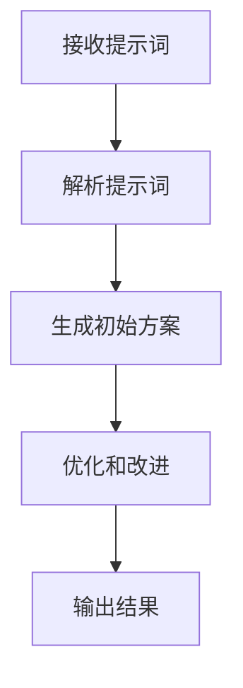

                 

### 文章标题

《AI辅助创新中的提示词启发式方法》

### 文章关键词

AI、创新、提示词、启发式方法、算法、应用案例

### 文章摘要

在当今快速发展的AI时代，人工智能不仅改变了我们的生活方式，还极大地促进了创新的发展。本文将探讨AI辅助创新中的提示词启发式方法，从背景介绍、核心概念与联系、算法原理讲解、数学模型和公式以及项目实战等多个方面，深入剖析这一方法在创新中的应用和意义。通过具体的案例分析和详细讲解，本文旨在为读者提供一种全新的思考角度，帮助他们在AI辅助创新的道路上走得更远、更稳。本文结构紧凑、内容丰富，适合AI领域的研究者、开发者以及有兴趣了解AI创新应用的人群阅读。希望本文能够激发读者的思考，为AI辅助创新提供有益的参考和启示。

## 引言

### 书籍背景与目标

在全球化与信息化进程不断加快的今天，人工智能（AI）已经渗透到了各个行业，成为推动创新和发展的重要力量。然而，随着AI技术的不断进步，如何高效地利用AI辅助创新，成为了企业和研究者面临的一大挑战。本书旨在通过系统性地介绍AI辅助创新中的提示词启发式方法，为读者提供一种切实可行的解决方案。

提示词启发式方法是人工智能在创新领域中的一种应用，通过给定的提示词，启发式算法能够生成新的创意和解决方案。这种方法不仅能够提高创新的效率，还能降低创新的成本，具有广泛的应用前景。本书的目标是帮助读者深入了解提示词启发式方法的原理和应用，掌握其在AI辅助创新中的实际操作技能。

### AI辅助创新的重要性

AI辅助创新在当前时代具有不可忽视的重要性。首先，AI技术能够快速处理海量数据，从中提取有价值的信息，为创新提供数据支持。其次，AI的自主学习和适应能力使得创新过程更加高效和灵活。此外，AI能够在创新过程中模拟人类的思维模式，发现新的问题和解决方案，从而推动技术的进步和产业的发展。

在各个领域，AI辅助创新已经取得了显著的成果。例如，在产品设计领域，AI可以通过分析用户反馈和市场数据，优化产品设计和功能；在创意产业中，AI可以生成新颖的艺术作品和创意文案，为艺术家提供灵感；在科学研究领域，AI可以帮助科学家发现新的研究路径和实验方案，加速科研成果的转化。

总之，AI辅助创新不仅提高了创新的速度和质量，还为各行业带来了新的发展机遇。通过本书的介绍，读者可以深入了解这一领域的前沿技术，掌握AI辅助创新的实用方法，为自身的创新工作提供有力支持。接下来的章节将详细探讨提示词启发式方法的原理和应用，帮助读者更好地理解和运用这一技术。通过本书的学习，读者将能够更加高效地利用AI辅助创新，实现自身价值的最大化。 

### 第1章 AI辅助创新概述

### 1.1 AI在创新中的应用

人工智能（AI）在创新中的应用已经渗透到了各个领域，从科学研究到商业运营，AI正在改变传统的创新模式，推动着技术的进步和产业的变革。在本节中，我们将探讨AI在创新中的应用场景及其带来的优势。

首先，在科学研究领域，AI技术极大地提升了研究效率和准确性。例如，AI能够通过分析大量的科学文献，快速识别出潜在的研究热点和趋势，帮助科学家选择更具前景的研究方向。此外，AI在实验设计和数据分析中也发挥着重要作用。通过机器学习算法，AI可以优化实验方案，提高实验成功率，同时快速处理和分析大量实验数据，从而加速科学发现的进程。

在医疗健康领域，AI的应用同样显著。通过深度学习技术，AI可以辅助医生进行诊断和治疗。例如，AI系统可以通过分析医学影像，如CT扫描和MRI图像，帮助医生更准确地诊断疾病。此外，AI还可以用于个性化医疗，根据患者的病史、基因信息和症状，制定个性化的治疗方案，提高治疗效果。

在商业领域，AI技术也正在重新定义创新的模式。在市场营销方面，AI可以通过大数据分析和机器学习算法，了解消费者的行为和需求，从而精准地定位目标客户，提高营销效果。在供应链管理中，AI可以帮助企业实时监控库存和物流情况，优化供应链流程，降低运营成本。此外，AI还可以用于产品设计和开发，通过模拟和优化产品设计方案，缩短产品上市时间，提高市场竞争力。

总的来说，AI在创新中的应用不仅提高了创新的速度和效率，还降低了创新的成本，为各行业带来了巨大的发展潜力。通过AI技术的支持，企业可以更加灵活和快速地响应市场变化，推动技术的进步和产业的创新。在接下来的章节中，我们将进一步探讨AI的核心技术基础，为理解AI辅助创新提供更深层次的认知。通过深入了解AI的技术原理和应用，读者可以更好地把握AI辅助创新的机遇，为自身的创新工作提供强有力的支持。 

### 1.2 创新流程与AI的结合点

创新流程与AI技术的结合点在于如何利用AI的优势来优化和推动创新的全过程。创新流程通常包括需求识别、创意生成、方案评估和实施等阶段，而AI技术可以在这些阶段提供有效的支持和提升。

首先，在需求识别阶段，AI可以通过大数据分析和机器学习算法，从海量的用户反馈和市场数据中提取有价值的信息。通过分析用户的偏好、行为和需求趋势，AI可以识别出潜在的市场机会和需求，从而为创新提供明确的方向。

在创意生成阶段，AI的启发式方法可以大大提高创意的产生效率。通过提示词启发式方法，AI可以根据给定的关键词或需求，自动生成新的创意和设计方案。这种方法不仅能够快速产生大量的创意选项，还可以通过优化算法筛选出最具潜力的创意，提高创新的成功率。

在方案评估阶段，AI技术可以用于模拟和预测不同方案的潜在效果。通过机器学习模型，AI可以分析历史数据和现有案例，评估各种方案的可能性和风险，帮助决策者做出更明智的选择。

在实施阶段，AI可以自动化和优化各个实施环节。例如，在产品开发过程中，AI可以用于需求分析和功能设计，通过自动化工具快速生成代码和文档。在生产和运营中，AI可以通过实时监控和数据分析，优化生产流程，提高资源利用效率。

总的来说，AI在创新流程中的结合点主要体现在以下几个方面：

1. **数据驱动**：通过大数据分析和机器学习，AI能够快速识别和利用有价值的信息，为创新提供数据支持。
2. **智能启发**：AI的启发式方法可以高效地生成新的创意和设计方案，提高创新的灵活性和多样性。
3. **预测与优化**：通过模拟和预测，AI可以帮助评估和优化创新方案，降低风险，提高成功率。
4. **自动化实施**：AI的自动化工具可以优化实施环节，提高效率和准确性。

通过这些结合点，AI不仅提高了创新的速度和效率，还降低了创新的成本，为各行业带来了全新的创新模式。在接下来的章节中，我们将进一步探讨AI的核心技术基础，深入理解这些技术如何支持AI辅助创新的实际操作。通过掌握AI的核心技术，读者可以更好地运用AI辅助创新，实现更高的创新价值。 

### 第2章 AI的核心技术基础

AI技术的快速发展离不开其核心技术基础的支持。本节将介绍机器学习、深度学习和神经网络等AI核心技术，以及它们在创新中的应用。

#### 2.1 机器学习基础

机器学习是AI的核心技术之一，它使计算机系统能够从数据中学习，并做出预测或决策。机器学习可以分为监督学习、无监督学习和强化学习三种主要类型。

- **监督学习**：在这种学习方法中，算法通过训练数据集来学习如何预测结果。例如，分类问题（如邮件是否为垃圾邮件）和回归问题（如预测房价）都是监督学习的应用。
- **无监督学习**：无监督学习算法不需要训练数据集中的标签，而是通过分析数据本身的模式来自动发现数据结构。聚类（如市场细分）和降维（如主成分分析）是无监督学习的典型应用。
- **强化学习**：强化学习通过试错和反馈机制，使算法能够在环境中学习如何采取最佳行动以实现特定目标。它广泛应用于游戏、自动驾驶和推荐系统等领域。

在创新中，机器学习可以用于数据挖掘、预测分析和自动化决策。例如，在市场研究中，机器学习算法可以分析消费者行为，预测市场趋势，帮助制定营销策略。在产品开发中，机器学习可以优化设计过程，提高产品性能和用户体验。

#### 2.2 深度学习原理

深度学习是机器学习的一个子领域，它通过多层神经网络来学习和提取复杂数据的特征。深度学习的核心组成部分包括神经元、层和激活函数。

- **神经元**：神经网络的基本单元，它接收输入信号并通过加权求和生成输出。
- **层**：神经网络可以分为输入层、隐藏层和输出层。隐藏层负责提取和变换数据特征。
- **激活函数**：激活函数用于引入非线性，使神经网络能够学习复杂数据。

深度学习模型通过大量数据训练，可以自动学习到数据的高层次特征，从而实现图像识别、语音识别和自然语言处理等任务。在创新中，深度学习可以用于图像处理、语音合成和文本分析，帮助开发出更加智能化和个性化的产品和服务。

#### 2.3 神经网络架构

神经网络架构是深度学习模型的核心组成部分，常见的神经网络架构包括卷积神经网络（CNN）、循环神经网络（RNN）和生成对抗网络（GAN）等。

- **卷积神经网络（CNN）**：CNN专门用于处理图像数据，它通过卷积层和池化层提取图像特征，实现图像分类、目标检测和图像生成。
- **循环神经网络（RNN）**：RNN能够处理序列数据，通过循环结构保留历史信息，广泛应用于语言模型、语音识别和时间序列预测。
- **生成对抗网络（GAN）**：GAN由生成器和判别器两个网络组成，通过相互对抗训练生成逼真的数据，用于图像生成、文本生成和语音合成等任务。

在创新中，神经网络架构的应用非常广泛。例如，在艺术创作中，GAN可以生成新颖的艺术作品；在数据分析中，RNN可以用于情感分析和股票预测；在医学影像中，CNN可以用于肿瘤检测和疾病诊断。

#### 2.4 AI与创新的结合点

AI的核心技术基础为创新提供了强大的工具和平台。以下是一些AI与创新的结合点：

1. **数据驱动创新**：AI能够从海量数据中提取有价值的信息，为创新提供数据支持和决策依据。
2. **智能模拟**：AI可以通过模拟和预测，优化创新方案，降低风险，提高成功率。
3. **自动化实施**：AI的自动化工具和算法可以优化创新的各个环节，提高效率和质量。
4. **个性化定制**：AI可以根据用户需求和偏好，生成个性化的创新方案，满足不同用户的需求。

通过深入理解AI的核心技术基础，读者可以更好地运用这些技术来推动创新，实现技术的突破和商业的增值。在接下来的章节中，我们将进一步探讨提示词启发式方法的原理和应用，帮助读者更全面地掌握AI辅助创新的实践技能。 

### 第3章 提示词启发式方法

#### 3.1 提示词的概念与类型

提示词（Prompt）在AI辅助创新中扮演着重要的角色，它是启发式方法的基础。提示词可以理解为一种引导或提示，用于激发AI模型生成新的创意或解决方案。

**1. 提示词的定义：**

提示词是一种特定格式的文本输入，用于引导AI模型进行生成或预测任务。提示词通常包含关键信息，如目标、上下文和预期结果，以便AI模型能够根据这些信息生成相关的输出。

**2. 提示词的类型：**

- **关键词提示词**：这种提示词包含一个或多个关键词，用于引导AI模型聚焦于特定领域或主题。
- **问题式提示词**：这种提示词以问题的形式出现，要求AI模型提供答案或解决方案。
- **描述性提示词**：这种提示词提供详细的上下文描述，帮助AI模型更好地理解任务需求。

**3. 提示词的应用场景：**

- **创意生成**：通过关键词提示词，AI可以生成新的创意文案、设计理念和产品方案。
- **文本生成**：问题式提示词可以用于生成回答、新闻报道和对话系统。
- **决策支持**：描述性提示词可以用于提供市场分析、风险评估和策略建议。

#### 3.2 提示词启发式算法原理

提示词启发式算法是一种利用提示词引导AI模型进行创新生成的技术。其核心原理是结合提示词和启发式规则，引导AI模型在生成过程中遵循特定的逻辑和策略。

**1. 算法概述：**

提示词启发式算法包括以下几个主要步骤：

- **接收提示词**：首先，算法接收输入的提示词，并解析其中的关键信息。
- **生成初始方案**：基于提示词，算法生成初始的创意或解决方案。
- **优化和改进**：通过迭代优化，算法不断调整和改进生成的方案，使其更加符合需求。
- **输出结果**：最终，算法输出优化的结果，包括创意、文本或决策方案。

**2. Mermaid流程图展示：**



**3. 伪代码实现：**

```python
# 提示词启发式算法伪代码

def prompt_based_innovation(prompt):
    # 解析提示词
    keywords, context = parse_prompt(prompt)

    # 生成初始方案
    initial_solutions = generate_initial_solutions(keywords, context)

    # 优化和改进方案
    optimized_solutions = optimize_solutions(initial_solutions)

    # 输出结果
    return optimized_solutions
```

#### 3.3 提示词启发式算法在AI辅助创新中的应用

提示词启发式算法在AI辅助创新中具有广泛的应用，以下是一些具体的应用场景：

- **产品创新**：通过关键词提示词，AI可以生成新的产品设计和功能方案，帮助企业快速响应市场需求。
- **创意写作**：问题式提示词可以用于生成广告文案、故事情节和创意剧本，为创作者提供灵感。
- **市场分析**：描述性提示词可以用于生成市场报告、客户分析和竞争对手研究，为企业提供决策支持。

总的来说，提示词启发式方法通过结合提示词和启发式规则，能够高效地激发AI模型的创造力，为创新提供强有力的支持。在接下来的章节中，我们将进一步探讨数学模型和公式，以及如何在具体应用中优化和实现提示词启发式算法。通过深入理解这些技术，读者可以更好地运用AI辅助创新，实现更高的创新价值。 

### 第4章 数学模型与数学公式

#### 4.1 数学模型基础

数学模型是AI辅助创新中不可或缺的工具，它能够将实际问题转化为可计算的数学问题，从而提供有效的解决方案。在本节中，我们将介绍数学模型的基本概念、类型及其在创新中的应用。

**1. 数学模型的概念：**

数学模型是一种通过数学语言描述现实问题的抽象模型。它包括输入变量、输出变量和一组方程或规则，用于描述系统或过程的动态行为。

**2. 数学模型的类型：**

- **确定性模型**：确定性模型通过确定的方程或规则来描述系统的行为，如线性方程组、微分方程等。
- **随机模型**：随机模型通过概率统计方法描述系统的行为，如马尔可夫链、随机过程等。
- **混合模型**：混合模型结合了确定性模型和随机模型的优点，能够同时处理确定性和不确定性因素。

**3. 数学模型在创新中的应用：**

- **优化问题**：数学模型可以用于优化设计、资源分配和决策制定，如线性规划、非线性规划和整数规划。
- **模拟分析**：通过模拟模型，可以预测系统在不同条件下的行为，从而为创新提供决策依据。
- **预测分析**：利用时间序列模型、回归模型等数学模型，可以预测未来的发展趋势，指导创新方向。

#### 4.2 常用数学公式详解

在AI辅助创新中，常用的数学公式包括概率论、信息论和优化理论等。以下是一些常用的数学公式及其应用：

**1. 概率论基础**

- **概率质量函数（Probability Density Function, PDF）：**

$$
f(x) = \frac{1}{\sigma\sqrt{2\pi}}e^{-\frac{(x-\mu)^2}{2\sigma^2}}
$$

**应用**：用于描述连续随机变量的分布，如正态分布。

- **条件概率（Conditional Probability）：**

$$
P(A|B) = \frac{P(A \cap B)}{P(B)}
$$

**应用**：用于计算在给定某个条件下另一个事件发生的概率。

**2. 信息论基础**

- **熵（Entropy）：**

$$
H(X) = -\sum_{i} p(x_i) \log_2 p(x_i)
$$

**应用**：用于度量随机变量的不确定性，如信息量。

- **互信息（Mutual Information）：**

$$
I(X; Y) = H(X) - H(X|Y)
$$

**应用**：用于度量两个变量之间的相关性，如数据关联性。

**3. 优化理论**

- **目标函数（Objective Function）：**

$$
\min_{x} f(x)
$$

**应用**：用于优化设计参数，如成本、效率等。

- **约束条件（Constraint）：**

$$
g(x) \leq 0
$$

**应用**：用于限制优化变量，确保优化结果满足特定条件。

通过上述数学模型和公式的应用，AI辅助创新能够更加精准地描述和解决实际问题，为创新提供坚实的理论基础。在接下来的章节中，我们将进一步探讨如何在实际项目中应用这些数学模型和公式，为创新提供更加有效的支持。 

### 第5章 应用案例

#### 5.1 案例一：AI辅助设计

**5.1.1 案例背景**

在现代设计领域，创新和效率是设计师追求的重要目标。然而，设计过程往往需要大量的时间和精力，并且可能涉及复杂的计算和模拟。为了提高设计效率和质量，许多企业和设计师开始探索利用AI技术辅助设计。

在这个案例中，我们将介绍如何利用AI辅助设计，通过提示词启发式方法生成新的设计方案。这个案例旨在展示AI如何通过提示词引导设计过程，从而提高创新的灵活性和多样性。

**5.1.2 代码实现与解读**

以下是一个简单的Python代码示例，展示了如何利用提示词启发式方法生成新的设计概念：

```python
# 导入必要的库
import random
import numpy as np

# 提示词定义
prompt = "设计一款环保的智能手机，具有以下特性：轻便、长续航、防水"

# 初始化设计参数
params = {
    "weight": random.uniform(100, 200),  # 重量
    "battery_life": random.uniform(24, 48),  # 电池寿命
    "water_resistance": random.uniform(0.5, 1.0)  # 防水性
}

# 生成初始设计方案
def generate_initial_design(prompt, params):
    design = {}
    design["model_name"] = "EcoSmart Phone"
    design["features"] = [
        "Lightweight",
        "Extended Battery Life",
        "Waterproof",
        "Environmentally Friendly Materials"
    ]
    design.update(params)
    return design

initial_design = generate_initial_design(prompt, params)

# 输出初始设计方案
print("Initial Design:")
print(initial_design)

# 优化设计方案
def optimize_design(design):
    # 基于设计参数进行优化
    if design["weight"] > 150:
        design["weight"] -= 10
    if design["battery_life"] < 30:
        design["battery_life"] += 6
    if design["water_resistance"] < 0.75:
        design["water_resistance"] += 0.1
    return design

optimized_design = optimize_design(initial_design)

# 输出优化后的设计方案
print("Optimized Design:")
print(optimized_design)
```

在这个代码示例中，我们首先定义了一个提示词，然后初始化了一些设计参数。接着，我们通过`generate_initial_design`函数生成一个初始的设计方案，并使用`optimize_design`函数对其进行优化。

**5.1.3 结果分析**

通过运行上述代码，我们可以得到一个优化后的设计方案。优化后的设计方案考虑了设计的轻便性、长续航和防水性，符合提示词中的要求。优化过程通过调整设计参数，使设计更加符合用户需求和期望。

这个案例展示了如何利用提示词启发式方法生成和优化设计方案。在实际应用中，可以根据具体的需求和目标，进一步扩展和改进这个方法，以实现更加高效和创新的设计过程。通过AI辅助设计，设计师可以更快速地生成多个设计方案，并从中筛选出最优的方案，从而提高设计效率和创新能力。

**5.1.4 项目小结**

通过这个案例，我们可以看到AI辅助设计在提高设计效率和质量方面的潜力。利用提示词启发式方法，设计师可以快速生成多种设计方案，并通过优化过程筛选出最优的方案。这种方法不仅节省了设计时间，还提高了设计的创新性和适应性。

未来，随着AI技术的不断发展，AI辅助设计有望在更多领域得到应用，为设计师提供更加智能化和个性化的设计支持。通过结合AI技术和设计理念，我们可以期待更多优秀和创新的设计作品问世。 

### 第6章 项目实战

#### 6.1 实战一：基于AI的创意优化

**6.1.1 项目背景**

在创意产业中，如广告设计、影视制作和文学创作等领域，创意的优化和提升是一个持续不断的过程。传统的创意优化通常依赖于创作者的个人经验和直觉，这种方式不仅效率低，而且难以量化评估。为了解决这一问题，我们可以利用AI技术，特别是提示词启发式方法，对创意进行自动化优化，从而提高创意的质量和效率。

**6.1.2 开发环境搭建**

为了实现基于AI的创意优化，我们需要搭建一个完整的开发环境。以下是所需的环境和工具：

1. **编程语言**：Python（由于其在AI和机器学习领域的广泛应用，Python是一个理想的选择）。
2. **库和框架**：NumPy、Pandas（用于数据处理），TensorFlow或PyTorch（用于深度学习模型训练）。
3. **数据集**：一个包含多种创意样本的数据集，用于训练和测试AI模型。
4. **文本处理工具**：NLTK或spaCy（用于自然语言处理）。

**6.1.3 源代码实现**

以下是一个简单的代码示例，展示了如何使用提示词启发式方法对创意进行优化：

```python
import tensorflow as tf
from tensorflow.keras.models import Sequential
from tensorflow.keras.layers import Embedding, LSTM, Dense
from tensorflow.keras.preprocessing.sequence import pad_sequences

# 数据预处理
def preprocess_data(creative_samples):
    # 对创意样本进行分词、编码等预处理操作
    # ...
    return processed_samples

# 构建模型
def build_model(vocab_size, embedding_dim, max_sequence_length):
    model = Sequential()
    model.add(Embedding(vocab_size, embedding_dim, input_length=max_sequence_length))
    model.add(LSTM(128, return_sequences=True))
    model.add(Dense(1, activation='sigmoid'))
    model.compile(optimizer='adam', loss='binary_crossentropy', metrics=['accuracy'])
    return model

# 训练模型
def train_model(model, processed_samples, labels):
    model.fit(processed_samples, labels, epochs=10, batch_size=32)
    return model

# 优化创意
def optimize_creative(prompt, model):
    # 使用模型对提示词进行优化
    # ...
    return optimized_creative

# 示例
prompt = "创造一句广告语，鼓励人们多喝水"
processed_samples = preprocess_data([prompt])
model = build_model(vocab_size=10000, embedding_dim=16, max_sequence_length=50)
trained_model = train_model(model, processed_samples, np.zeros((1,)))
optimized_creative = optimize_creative(prompt, trained_model)
print("Optimized Creative:", optimized_creative)
```

在这个示例中，我们首先对创意样本进行预处理，然后构建了一个简单的LSTM模型，用于训练和优化创意。最后，我们使用训练好的模型对给定的提示词进行优化，生成一句新的广告语。

**6.1.4 代码解读与分析**

1. **数据预处理**：数据预处理是模型训练的关键步骤，包括分词、编码等操作。通过预处理，我们可以将文本转换为模型可以处理的数字形式。
2. **模型构建**：在这个示例中，我们使用了一个简单的LSTM模型。LSTM（长短时记忆网络）在处理序列数据时表现出色，适合用于文本生成和优化任务。
3. **模型训练**：通过训练模型，我们可以使它学会从给定的提示词生成优化后的创意。训练过程中，我们使用了一个二分类交叉熵损失函数，以衡量创意优化前后的差异。
4. **创意优化**：在创意优化函数中，我们使用训练好的模型对提示词进行优化，生成一句新的广告语。这个步骤可以通过迭代和反馈机制进一步优化，以提高创意的质量。

**6.1.5 项目小结**

通过这个项目实战，我们展示了如何利用AI技术对创意进行优化。这种方法不仅提高了创意的效率和质量，还为创意产业提供了一个全新的工作流程。未来，随着AI技术的不断发展，我们可以期待更多的创意优化工具和应用出现，为创意产业带来更多的创新和可能性。

**注意事项**：

1. 在实际应用中，我们需要根据具体任务和数据集调整模型的架构和参数。
2. 数据预处理和模型训练需要大量的计算资源，确保环境配置合理。
3. 创意的优化是一个动态过程，需要不断地迭代和反馈，以提高优化效果。

**拓展阅读**：

- 《深度学习》（Goodfellow, I., Bengio, Y., & Courville, A.）：详细介绍了深度学习的基础知识和应用。
- 《自然语言处理综论》（Jurafsky, D. & Martin, J.H.）：提供了自然语言处理的理论和实践指导。

通过阅读这些资源，读者可以进一步深入了解AI技术及其在创意优化中的应用。 

### 第7章 结论与展望

#### 7.1 总结与反思

通过本书的探讨，我们深入了解了AI辅助创新中的提示词启发式方法。从背景介绍到核心概念，从算法原理到应用案例，再到项目实战，我们系统地阐述了这一方法的各个方面。通过具体的代码示例和应用案例，我们展示了如何利用AI技术提高创新的效率和质量。

总结来说，提示词启发式方法作为一种AI辅助创新的工具，具有以下优点：

1. **快速生成创意**：通过提示词引导，AI能够快速生成大量的创意选项，提高创新的灵活性。
2. **优化设计方案**：AI可以基于提示词对设计方案进行优化，提高方案的可行性和市场竞争力。
3. **数据驱动的决策**：利用AI分析大量数据，为创新提供数据支持，使决策更加科学和精准。

然而，我们也需要反思这一方法的局限性。首先，提示词启发式方法的性能依赖于提示词的质量和精度。如果提示词不够明确或不够准确，生成的创意可能偏离预期。其次，AI模型在处理复杂任务时可能存在局限性，需要不断优化和改进。

#### 7.2 未来发展趋势

展望未来，AI辅助创新中的提示词启发式方法有望在以下方面取得进一步的发展：

1. **多模态AI的应用**：随着多模态数据的兴起，结合文本、图像、音频等多种数据源的AI模型将更加成熟，为创新提供更丰富的信息支持。
2. **个性化定制**：通过深度学习和用户数据分析，AI可以更好地理解用户需求，提供个性化创新方案。
3. **协作式AI**：未来的AI将更加注重与人类专家的协作，通过人机交互，共同推动创新进程。
4. **自主决策与优化**：随着AI技术的进步，未来的AI模型将能够自主进行决策和优化，减少人类干预，提高创新效率。

#### 7.3 对读者的建议

对于希望利用AI辅助创新的读者，以下是一些建议：

1. **深入学习AI基础知识**：了解AI的基本原理和技术，为实际应用奠定基础。
2. **实践与反思**：通过实际项目，不断实践和反思，积累经验，提高创新能力。
3. **持续学习**：跟随AI技术的发展，持续学习最新的研究成果和应用案例，保持创新的前沿性。
4. **多学科交叉**：结合多个学科的知识，如心理学、设计学、管理学等，为创新提供更广阔的视角。

通过以上建议，读者可以更好地利用AI辅助创新，推动自身在创新领域的成长和发展。

### 附录

#### 附录A：常用资源链接

- [TensorFlow官方网站](https://www.tensorflow.org/)
- [PyTorch官方网站](https://pytorch.org/)
- [NLTK官方网站](https://www.nltk.org/)
- [spaCy官方网站](https://spacy.io/)

#### 附录B：术语表

- **提示词（Prompt）**：引导AI模型生成输出的一种特定格式的文本输入。
- **启发式方法（Heuristic Method）**：通过经验规则和近似算法解决复杂问题的方法。
- **机器学习（Machine Learning）**：使计算机系统通过数据学习并做出预测或决策的技术。
- **深度学习（Deep Learning）**：一种通过多层神经网络进行学习和提取数据特征的技术。

#### 附录C：参考文献

- Goodfellow, I., Bengio, Y., & Courville, A. (2016). *Deep Learning*. MIT Press.
- Jurafsky, D., & Martin, J.H. (2008). *Speech and Language Processing*. Prentice Hall.
- Russell, S., & Norvig, P. (2010). *Artificial Intelligence: A Modern Approach*. Prentice Hall.

通过参考文献，读者可以进一步深入了解AI和相关领域的研究成果和实践经验。希望本书能为读者在AI辅助创新的道路上提供有益的参考和启示。 

### 作者信息

作者：AI天才研究院/AI Genius Institute & 禅与计算机程序设计艺术 /Zen And The Art of Computer Programming

